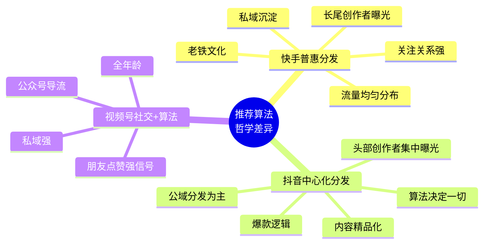
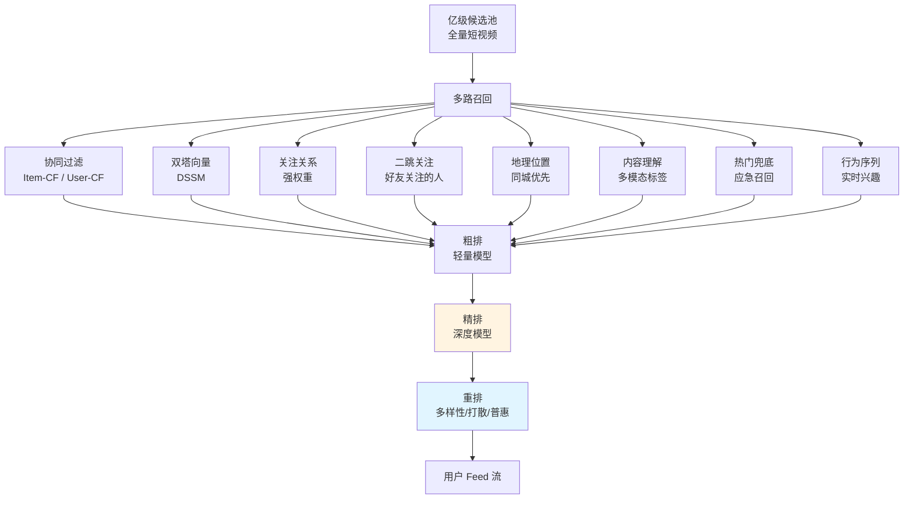
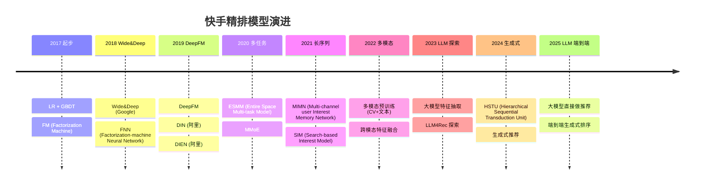

# 02 - 快手推荐系统与下沉市场

## 一、快手推荐系统核心哲学

### 1.1 "普惠分发" vs "中心化分发"

快手推荐系统的核心哲学与抖音形成鲜明对比：



### 1.2 普惠分发的核心思想

**快手普惠分发的本质**：让每一个创作者的视频都能被看到，让每一个用户都能找到喜欢的内容。

```
快手普惠分发 ≠ 简单平均曝光
而是基于"质量分"的均匀分布：
- 高质量创作者获得更多曝光
- 但长尾创作者也有稳定曝光机会
- 不会让 0.1% 创作者拿走 99% 流量
```

### 1.3 快手 vs 抖音算法哲学对比

| 维度 | 快手 | 抖音 |
|------|------|------|
| 核心哲学 | 普惠、去中心化 | 中心化、爆款逻辑 |
| 头部集中度 | 低 (HHI 较低) | 高 |
| 长尾创作者 | 稳定曝光 | 难出头 |
| 关注分发 | 强权重 | 中等 |
| 公私域比例 | 私域强 | 公域强 |
| 同质化抑制 | 弱 | 强 |
| 用户使用时长 | 长 (老铁常来) | 中等 |
| 关注转化率 | 高 | 中 |
| 内容调性 | 真实生活 | 精品化 |

### 1.4 算法哲学的产品体现

| 产品差异 | 快手 | 抖音 |
|----------|------|------|
| 主 Feed | 关注+发现 Tab 显著 | 双列 Feed，"关注"弱化 |
| 关注页地位 | 强 | 弱 |
| 粉丝触达 | 强 | 弱 |
| 私域沉淀 | 老铁文化 | 兴趣电商 |
| 创作者激励 | 流量普惠 | 头部奖励 |
| 评论文化 | 老铁互动 | 段子评论 |

## 二、快手下沉市场策略

### 2.1 下沉市场用户画像

快手核心用户群特征：

| 维度 | 特征 |
|------|------|
| 年龄 | 25-45 岁主力 |
| 性别 | 男女比例相对均衡 |
| 地域 | 三线及以下城市、农村占比高 |
| 收入 | 中低收入群体 |
| 设备 | 中低端 Android 为主 |
| 网络 | 4G/WiFi，偏远地区 3G |
| 内容偏好 | 真实生活、家长里短 |
| 消费力 | 客单价中等但复购强 |

### 2.2 下沉市场推荐挑战

```
┌────────────────────────────────────────────────────┐
│              下沉市场推荐挑战                        │
├────────────────────────────────────────────────────┤
│                                                      │
│  1. 网络条件差                                        │
│     - 弱网延迟高                                       │
│     - 视频加载慢                                       │
│     - 解决: CDN 边缘下沉 + 视频预加载                  │
│                                                      │
│  2. 设备性能低                                        │
│     - 中低端 Android                                  │
│     - 内存不足                                         │
│     - 解决: 客户端轻量化 + 播放器优化                  │
│                                                      │
│  3. 用户行为差异                                      │
│     - 主动搜索少                                       │
│     - 偏好刷推荐流                                     │
│     - 解决: 个性化推荐精度要求高                       │
│                                                      │
│  4. 内容偏好差异                                      │
│     - 偏好真实生活                                     │
│     - 偏好方言/草根                                    │
│     - 解决: 内容理解 + 本地化运营                      │
│                                                      │
│  5. 消费习惯差异                                      │
│     - 价格敏感                                         │
│     - 信任熟人推荐                                     │
│     - 解决: 信任电商 + 老铁文化                       │
│                                                      │
└────────────────────────────────────────────────────┘
```

### 2.3 极速版 (下沉专属版)

快手极速版是专门为下沉市场设计的独立 App：

```
快手极速版 vs 主站:
├── 用户奖励
│   ├── 看视频赚钱 (现金激励)
│   ├── 签到得现金
│   ├── 邀请好友得现金
│   └── 拉新奖励
├── 内容简化
│   ├── 算法更激进
│   ├── 内容更接地气
│   └── 沉浸式单列
├── 流量分发
│   ├── 普惠更彻底
│   ├── 长尾流量更大
│   └── 头部更克制
└── 商业化
    ├── 广告密度低
    ├── 电商引导弱
    └── 红包雨
```

极速版用户量级：DAU 2 亿+，是快手系用户量的重要组成。

## 三、快手推荐系统架构

### 3.1 整体架构



### 3.2 召回层关键设计

#### 3.2.1 关注关系召回

```python
# 快手关注关系召回（伪代码）
def follow_recall(user_id):
    """关注关系召回 - 快手的核心召回通道"""
    # 1. 直接关注的人的视频
    direct_followee_videos = db.query("""
        SELECT v.id, v.createtime 
        FROM video v
        JOIN follow f ON v.creator_id = f.followee_id
        WHERE f.follower_id = ?
          AND f.status = 1
          AND v.status = 'normal'
          AND v.createtime > ?
        ORDER BY v.createtime DESC
        LIMIT 200
    """, [user_id, time.time() - 7*24*3600])
    
    # 2. 好友关注的人的视频 (社交扩散)
    friends_followee_videos = db.query("""
        SELECT v.id, v.createtime
        FROM video v
        JOIN follow f1 ON v.creator_id = f1.followee_id
        JOIN follow f2 ON f1.follower_id = f2.followee_id
        WHERE f2.follower_id = ?
          AND f1.follower_id != ?
          AND f1.status = 1
          AND v.status = 'normal'
        ORDER BY v.createtime DESC
        LIMIT 200
    """, [user_id, user_id])
    
    # 3. 关注的人最新发布 - 高优先级
    # 4. 关注的人高热视频 - 中优先级
    # 5. 关注的人直播预约 - 高优先级
    
    return merge_and_dedup(direct_followee_videos + friends_followee_videos)
```

#### 3.2.2 双塔召回

```python
# 双塔召回 DSSM (Deep Structured Semantic Model)
class TwoTowerModel(nn.Module):
    def __init__(self, user_feat_dim, item_feat_dim, embed_dim=128):
        super().__init__()
        # 用户塔
        self.user_tower = nn.Sequential(
            nn.Linear(user_feat_dim, 256),
            nn.ReLU(),
            nn.Linear(256, embed_dim),
            nn.L2_norm()  # 向量归一化
        )
        # 物品塔
        self.item_tower = nn.Sequential(
            nn.Linear(item_feat_dim, 256),
            nn.ReLU(),
            nn.Linear(256, embed_dim),
            nn.L2_norm()
        )
    
    def forward(self, user_feat, item_feat):
        user_emb = self.user_tower(user_feat)  # [B, D]
        item_emb = self.item_tower(item_feat)  # [B, D]
        # 余弦相似度
        sim = (user_emb * item_emb).sum(dim=-1)
        return sim
    
    def recall_topk(self, user_emb, item_embs, k=1000):
        # ANN 检索 (Faiss / Milvus)
        scores = torch.matmul(user_emb, item_embs.T)
        topk = torch.topk(scores, k=k)
        return topk.indices, topk.values
```

#### 3.2.3 多模态内容召回

```python
# 多模态视频理解标签
def get_video_tags(video_id):
    """获取视频多模态标签"""
    video = video_db.get(video_id)
    
    # 1. 视觉标签 (CV 模型)
    cv_tags = cv_model.predict(video.frame_features)  
    # 输出: ['人物', '美食', '农村', '小孩', ...]
    
    # 2. 音频标签 (ASR + 声纹)
    audio_tags = asr_model.predict(video.audio_features)
    # 输出: ['四川话', '户外', '有笑声', ...]
    
    # 3. 文本标签 (OCR + 标题)
    text_tags = text_model.predict(video.text_features)
    # 输出: ['#农村生活', '#美食', '#亲子']
    
    # 4. 行为标签 (用户行为聚类)
    behavior_tags = behavior_cluster(video_id)
    # 输出: ['同城高热', '老铁圈层', ...]
    
    return merge_tags(cv_tags, audio_tags, text_tags, behavior_tags)
```

### 3.3 粗排层

粗排层用轻量模型快速筛选 1000+ 候选：

```python
# 粗排模型 (典型实现)
class CoarseRankModel(nn.Module):
    """粗排: 双塔 DNN, 快速打分"""
    def __init__(self, feat_dim):
        super().__init__()
        self.fc = nn.Sequential(
            nn.Linear(feat_dim, 256),
            nn.ReLU(),
            nn.Dropout(0.1),
            nn.Linear(256, 64),
            nn.ReLU(),
            nn.Linear(64, 1)
        )
    
    def forward(self, x):
        return torch.sigmoid(self.fc(x))
```

粗排 vs 精排的性能取舍：

| 阶段 | 模型大小 | 候选量 | 耗时 | 优化目标 |
|------|---------|--------|------|----------|
| 召回 | 浅层模型 | 10000+ | <50ms | 召回率 |
| 粗排 | 中等 DNN | 1000 | <30ms | 准确率+速度 |
| 精排 | 深度模型 | 100-500 | <50ms | 准确率 |
| 重排 | 规则+小模型 | 20 | <10ms | 多样性+策略 |

### 3.4 精排层

快手精排层经历了多代演进：



### 3.5 精排核心模型：DIN/DIEN/DSIN

```python
# DIN (Deep Interest Network) 简化实现
# 快手精排模型基础
class DIN(nn.Module):
    def __init__(self, user_feat_dim, item_feat_dim, embed_dim=64):
        super().__init__()
        # 用户历史行为序列
        self.hist_attention = LocalActivationUnit(embed_dim)
        # 主体网络
        self.main_net = nn.Sequential(
            nn.Linear(embed_dim*3, 256),
            nn.PReLU(),
            nn.Linear(256, 128),
            nn.PReLU(),
            nn.Linear(128, 1)
        )
        self.embed = nn.Embedding(item_feat_dim, embed_dim)
    
    def forward(self, user_hist, target_item):
        target_emb = self.embed(target_item)
        # 注意力激活
        att_score = self.hist_attention(user_hist, target_emb)
        user_interest = (att_score.unsqueeze(-1) * user_hist).sum(dim=1)
        # 拼接 [target, user_interest, target*user_interest]
        out = torch.cat([target_emb, user_interest, target_emb*user_interest], dim=-1)
        return torch.sigmoid(self.main_net(out))


class LocalActivationUnit(nn.Module):
    """DIN 注意力单元"""
    def __init__(self, embed_dim, hidden=(80, 40)):
        super().__init__()
        self.fc = nn.Sequential(
            nn.Linear(embed_dim*4, hidden[0]),
            nn.PReLU(),
            nn.Linear(hidden[0], hidden[1]),
            nn.PReLU(),
            nn.Linear(hidden[1], 1)
        )
    
    def forward(self, hist_emb, target_emb):
        # hist_emb: [B, T, D], target_emb: [B, D]
        T = hist_emb.shape[1]
        target_exp = target_emb.unsqueeze(1).expand(-1, T, -1)
        att_input = torch.cat([
            target_exp, hist_emb, target_exp*hist_emb, target_exp-hist_emb
        ], dim=-1)
        return F.softmax(self.fc(att_input).squeeze(-1), dim=-1)
```

### 3.6 长序列兴趣建模：MIMN / SIM

快手在长序列建模上有重要贡献：

```python
# MIMN (Multi-channel user Interest Memory Network)
# 解决用户长期兴趣建模，序列长达 1000+
class MIMN(nn.Module):
    def __init__(self, mem_size=128, mem_dim=64):
        super().__init__()
        # 记忆单元 (类似 NTM)
        self.memory = nn.Parameter(torch.randn(mem_size, mem_dim))
        # 记忆读写控制器
        self.read_ctrl = nn.Linear(mem_dim, mem_size)
        self.write_ctrl = nn.Linear(mem_dim, mem_size)
    
    def read(self, query):
        """从记忆读取兴趣"""
        att = F.softmax(self.read_ctrl(query), dim=-1)  # [B, mem_size]
        return torch.matmul(att.unsqueeze(1), self.memory).squeeze(1)
    
    def write(self, new_info):
        """写入新兴趣"""
        att = F.softmax(self.write_ctrl(new_info), dim=-1)
        # 更新记忆 (实际是用 GRU 更新)
        # ... 
```

```python
# SIM (Search-based Interest Model)
# 通过搜索相关历史行为避免长序列 Attention 的 O(n^2)
class SIM(nn.Module):
    def __init__(self, embed_dim, n_hashes=4):
        super().__init__()
        self.n_hashes = n_hashes
        # 哈希函数 (LSH)
        self.hash_proj = nn.Linear(embed_dim, n_hashes)
    
    def hash_softmax_topk(self, query, keys, k=50):
        """基于哈希的 topk 检索"""
        # 1. LSH 哈希
        bucket = (query @ self.hash_proj.weight.T).argmax(dim=-1)  # [B]
        # 2. 同 bucket 内做 softmax
        # 3. TopK 注意力
        # ... (类似 Reformer / Linformer)
```

## 四、快手普惠分发算法

### 4.1 普惠分发的核心思想

```
普惠分发 ≠ 完全平均曝光
而是基于"基尼系数控制"的分发：

基尼系数 (Gini Coefficient) 是衡量曝光不平等的指标：
- 0 = 完全平均
- 1 = 完全不平等（一人独占）

快手的目标：让头部流量集中度低于行业平均
```

### 4.2 普惠分发算法实现

```python
# 普惠分发机制 (简化版)
def fair_distribution(items, scores, creator_history):
    """
    items: 候选视频
    scores: 精排分数
    creator_history: 创作者历史曝光数据
    """
    # 1. 计算创作者基尼系数
    creator_exposure = get_creator_exposure(creator_history)
    gini = compute_gini(creator_exposure)
    
    # 2. 如果基尼系数过高 (头部集中)，增加长尾曝光
    if gini > 0.7:
        # 长尾创作者 boost
        for item in items:
            if is_long_tail_creator(item.creator_id, creator_exposure):
                item.score *= 1.3  # boost 30%
            else:
                item.score *= 0.9  # 头部轻微降权
    
    # 3. 重排排序
    items.sort(key=lambda x: x.score, reverse=True)
    return items

def compute_gini(values):
    """计算基尼系数"""
    sorted_values = sorted(values)
    n = len(sorted_values)
    cum = sum((i+1) * v for i, v in enumerate(sorted_values))
    total = sum(sorted_values)
    return (2 * cum) / (n * total) - (n + 1) / n
```

### 4.3 普惠的具体策略

```
┌────────────────────────────────────────────────────┐
│            快手普惠分发的具体策略                     │
├────────────────────────────────────────────────────┤
│                                                      │
│  1. 流量基尼系数控制                                   │
│     - 目标: 头部创作者不能拿走 80% 流量               │
│     - 监控: 实时 Gini 指标                            │
│     - 调优: 调整头部降权 / 长尾 boost                  │
│                                                      │
│  2. 关注关系强化                                       │
│     - 关注的人的视频获得高权重                        │
│     - 关注页是强入口                                  │
│     - 创作者粉丝价值高                                │
│                                                      │
│  3. 同质化内容抑制弱                                   │
│     - 同一创作者的相似内容不会被严重抑制                │
│     - 创作者可以持续输出                               │
│                                                      │
│  4. 长尾创作者扶持                                     │
│     - 新创作者流量保底                                │
│     - 优质长尾视频获得额外曝光                        │
│     - 不让老用户拿走所有曝光                          │
│                                                      │
│  5. 公私域平衡                                         │
│     - 私域 (关注) 与公域 (发现) 流量分配               │
│     - 关注页点击率高的创作者获得更多公域                │
│                                                      │
└────────────────────────────────────────────────────┘
```

## 五、快手特殊场景推荐

### 5.1 直播推荐

直播推荐与短视频有显著差异：

```python
# 直播推荐特征
live_features = {
    # 实时特征
    'room_hot_score': 0,         # 实时热度
    'online_count': 0,           # 在线人数
    'gift_amount_per_min': 0,    # 每分钟礼物金额
    'comment_velocity': 0,       # 弹幕速率
    'like_velocity': 0,          # 点赞速率
    'share_count_per_min': 0,    # 每分钟分享
    'product_click_rate': 0,     # 商品点击率
    'order_count_per_min': 0,    # 每分钟订单
    'follow_count_per_min': 0,   # 每分钟关注
    'live_duration': 0,          # 已直播时长
    'audience_retention': 0,     # 观众留存
    
    # 创作者特征
    'creator_followers': 0,      # 粉丝数
    'creator_avg_watch': 0,      # 场均观看
    'creator_gmv_history': 0,    # 历史 GMV
    'creator_history_peak': 0,   # 历史峰值
    'creator_specialty': [],     # 专长类目
    
    # 实时上下文
    'is_hot_seller': False,      # 是否热卖
    'is_exclusive_deal': False,  # 是否独家优惠
    'is_live_event': False,      # 是否活动直播
}
```

### 5.2 同城推荐

快手同城主打"身边的内容"：

```python
# 同城推荐特殊逻辑
def local_recommend(user_id, location):
    # 1. 同城最近视频 (5km / 20km / 50km 多档)
    city_videos = db.query("""
        SELECT * FROM video
        WHERE city_code = ?
          AND status = 'normal'
          AND geo_distance(?, ?) < ?
          AND createtime > ?
        ORDER BY hot_score DESC
        LIMIT 500
    """, [location.city, location.lat, location.lng, 
          50000,  # 50km
          time.time() - 7*24*3600])
    
    # 2. 同城 + 兴趣交叉
    user_interest_tags = get_user_interest_tags(user_id)
    local_interest = filter_by_tags(city_videos, user_interest_tags)
    
    # 3. 同城主播开播 - 强召回
    local_live = live_service.get_local_live(location)
    
    return merge(local_interest, local_live, city_videos)
```

### 5.3 关注页双列 vs 发现页双列

快手有"关注"和"发现"两个 Tab：

```
关注 Tab:
- 仅显示已关注创作者
- 强按时间排序 (新内容优先)
- 用户主要看熟人/关注的人

发现 Tab:
- 算法推荐
- 关注 + 兴趣混合
- 用户发现新内容

两个 Tab 流量分配 ≈ 30% 关注 : 70% 发现
但不同用户比例不同：老铁用户关注页占比更高
```

## 六、快手用户兴趣建模

### 6.1 用户画像架构

```
用户画像 (User Profile)
├── 基础属性
│   ├── age, gender, city
│   └── device, network
├── 行为序列
│   ├── 视频消费 (曝光/点击/完播/点赞/评论/转发)
│   ├── 直播消费 (进入/停留/打赏/购买)
│   ├── 搜索历史
│   └── 关注历史
├── 兴趣标签
│   ├── 内容兴趣 (美食/搞笑/三农/...)
│   ├── 创作者兴趣 (类型化创作者)
│   ├── 商品兴趣 (电商消费)
│   └── 类目兴趣
├── 社交关系
│   ├── 关注列表
│   ├── 好友列表
│   ├── 互动记录
│   └── 群组归属
├── 消费能力
│   ├── 月消费金额
│   ├── 客单价
│   ├── 品类偏好
│   └── 支付活跃度
└── 价值分层
    ├── DAU / WAU / MAU
    ├── 高活 / 中活 / 低活 / 沉睡
    └── 商业化价值
```

### 6.2 兴趣演化建模 (DIEN)

```python
# DIEN (Deep Interest Evolution Network)
# 建模用户兴趣随时间的演化
class DIEN(nn.Module):
    def __init__(self, embed_dim, hidden_dim=64):
        super().__init__()
        # 兴趣抽取层 (GRU)
        self.interest_gru = nn.GRU(embed_dim, hidden_dim, batch_first=True)
        # 兴趣演化层 (AUGRU)
        self.evolution_gru = AGRU(hidden_dim, hidden_dim)
    
    def forward(self, hist_behaviors, target_item):
        """
        hist_behaviors: [B, T, D] 用户历史行为序列
        """
        # 1. 兴趣抽取 (GRU 提取每一时刻的兴趣)
        interest_seq, _ = self.interest_gru(hist_behaviors)
        # interest_seq: [B, T, hidden_dim]
        
        # 2. 兴趣演化 (AUGRU: Attention-based GRU)
        target_emb = self.embed(target_item)  # [B, D]
        evolved_interest = self.evolution_gru(interest_seq, target_emb)
        # evolved_interest: [B, hidden_dim]
        
        # 3. 与目标物品交互预测
        return self.predict(evolved_interest, target_emb)


class AGRU(nn.Module):
    """Attention-based GRU"""
    def __init__(self, input_dim, hidden_dim):
        super().__init__()
        self.gru_cell = nn.GRUCell(input_dim, hidden_dim)
        self.att = nn.Sequential(
            nn.Linear(input_dim + hidden_dim, hidden_dim),
            nn.Tanh(),
            nn.Linear(hidden_dim, 1)
        )
    
    def forward(self, seq, query):
        """
        seq: [B, T, D]
        query: [B, D]
        """
        B, T, D = seq.shape
        h = torch.zeros(B, self.hidden_dim, device=seq.device)
        outputs = []
        for t in range(T):
            # 注意力分数
            att_score = self.att(torch.cat([seq[:, t, :], h], dim=-1))
            att_score = torch.sigmoid(att_score)
            # GRU 更新
            h = self.gru_cell(seq[:, t, :], h)
            h = att_score * h  # 注意力加权
            outputs.append(h)
        return outputs[-1]
```

## 七、快手推荐系统评估

### 7.1 在线指标

```
┌────────────────────────────────────────────────────┐
│            快手推荐系统核心指标                      │
├────────────────────────────────────────────────────┤
│                                                      │
│  用户消费指标:                                        │
│   - 人均使用时长                                      │
│   - 人均播放次数                                      │
│   - 完播率                                            │
│   - 互动率 (点赞+评论+转发)/曝光                       │
│   - 关注转化率                                        │
│                                                      │
│  创作者指标:                                          │
│   - 创作者活跃度                                      │
│   - 新创作者留存                                      │
│   - 万粉创作者数                                      │
│   - 长尾创作者曝光 Gini                                │
│                                                      │
│  商业化指标:                                          │
│   - 电商 GMV                                          │
│   - 广告收入                                          │
│   - 直播打赏收入                                      │
│   - 商业化 CTR/CVR                                    │
│                                                      │
│  内容生态指标:                                        │
│   - 内容多样性                                        │
│   - 同质化程度                                        │
│   - 创作者分布 Gini                                   │
│   - 新内容曝光占比                                    │
│                                                      │
└────────────────────────────────────────────────────┘
```

### 7.2 离线指标

| 指标 | 说明 |
|------|------|
| AUC | CTR 预估 |
| gAUC | 按用户 group 后 AUC |
| NDCG | TopK 排序 |
| Recall@K | 召回质量 |
| 创作者 Gini | 流量公平性 |
| 内容多样性 | 类目覆盖 |

### 7.3 A/B 实验平台

快手 A/B 平台支持分层实验、正交实验、流量复用：

```
实验分层 (Layer):
├── 第 1 层: 召回策略
├── 第 2 层: 粗排模型
├── 第 3 层: 精排模型
├── 第 4 层: 重排策略
├── 第 5 层: UI 调整
└── 第 6 层: 商业化

每层独立分流 (正交)，可以同时运行多个实验
```

## 八、快手 vs 抖音推荐系统对比

| 维度 | 快手 | 抖音 |
|------|------|------|
| 召回核心 | 关注+兴趣+同城 | 兴趣+关注 |
| 精排模型 | DIN/DIEN/MMoE | DeepFM/DIN/多模态 |
| 普惠分发 | 强 | 弱 |
| 关注权重 | 高 | 中 |
| 同城推荐 | 强 | 中 |
| 长序列建模 | MIMN/SIM | 长行为序列 |
| 多任务学习 | MMoE/PLE | MMoE/PLE |
| 长视频/直播 | 重视 | 中等 |

## 九、可借鉴点

对 AI 直播平台的可借鉴：

1. **普惠分发思想**：让长尾创作者也有曝光机会
2. **关注关系召回**：关注关系是私域核心
3. **下沉市场策略**：极速版 + 现金激励 + 简化内容
4. **同城推荐**：本地化内容触达
5. **老铁文化**：粉丝-主播强信任关系
6. **兴趣演化建模**：DIEN/AUGRU 跟踪用户兴趣漂移
7. **普惠 Gini 系数控制**：监控流量公平性
8. **极速版独立 App**：下沉市场专属

## 十、参考资料

- [快手技术博客](https://tech.kuaishou.com/)
- KDD/SIGIR/RecSys 快手论文集
- Zhou et al. **Deep Interest Network**, KDD 2018
- Zhou et al. **Deep Interest Evolution Network**, AAAI 2019
- Pi et al. **Search-based Interest Model**, CIKM 2020
- **MIMN: Multi-channel user Interest Memory Network**, CIKM 2019
- 快手 2024 Q3 财报
- 36氪《快手下沉市场研究报告》

## 附录：快手关键论文清单

1. **MIMN**: Multi-channel user Interest Memory Network - CIKM 2019
2. **SIM**: Search-based Interest Model - CIKM 2020
3. **HSTU**: Hierarchical Sequential Transduction Unit - 2024
4. **多任务学习在快手推荐中的应用** - KDD 2020
5. **精排模型演进** - 快手技术博客系列
6. **长序列用户行为建模** - 快手技术博客

## 附录：快手 vs 抖音关键论文对比

| 问题 | 快手代表论文 | 抖音代表论文 |
|------|------------|------------|
| 长期兴趣 | MIMN, SIM | 长序列 DIN |
| 多任务 | MMoE 实践 | 抖音 PLE |
| 多模态 | 多模态融合 | 多模态预训练 |
| 冷启动 | 普惠分发 | 流量扶持 |