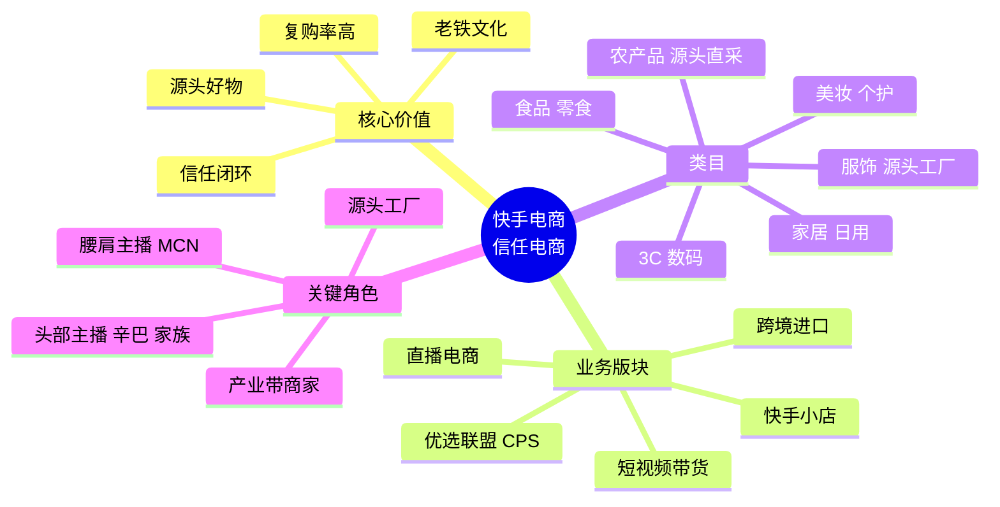
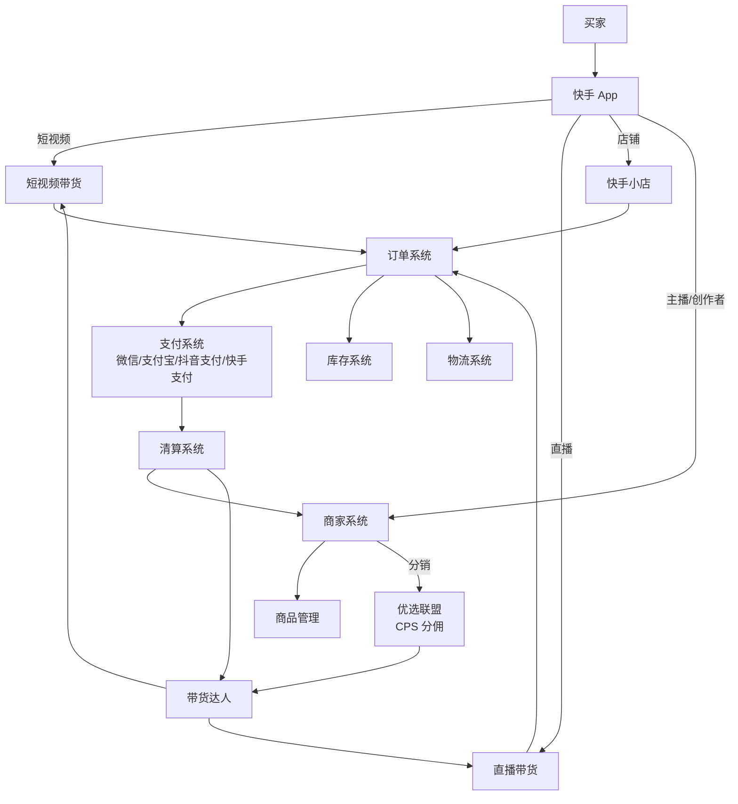
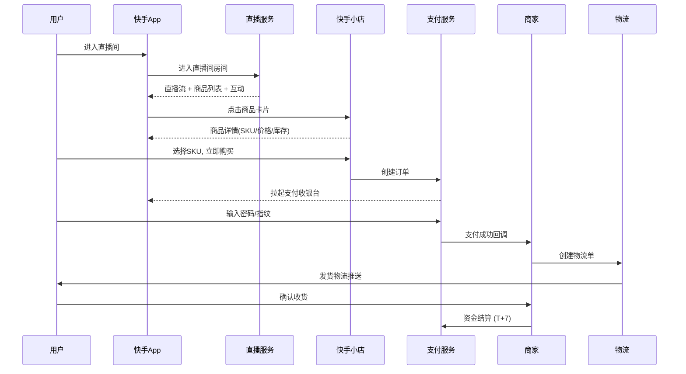
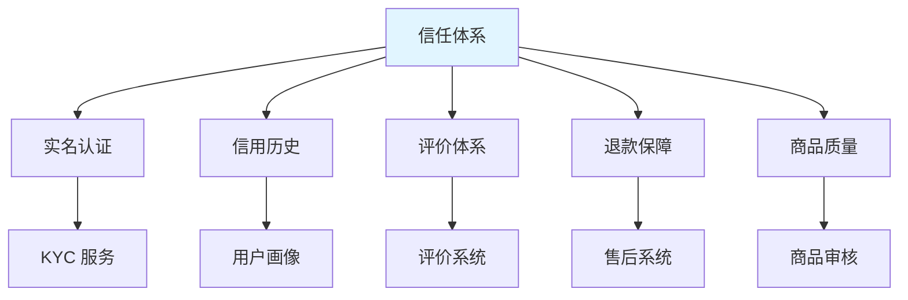

# 03 - 快手直播电商与信任电商

## 一、快手电商业务概览

### 1.1 业务定位

快手电商定位为"**信任电商**"，区别于淘宝/京东的"货架电商"和抖音的"兴趣电商"，核心是建立在老铁文化基础上的**主播-粉丝信任关系**驱动的电商模式。



### 1.2 关键数据 (2024-2025)

| 指标 | 数据 |
|------|------|
| 月度 GMV | 千亿级 |
| 年度 GMV | 万亿规模 |
| 月活买家 | 数亿 |
| 商家数 | 数百万 |
| 客单价 | 中等 (下沉特征) |
| 复购率 | 高 (信任电商特征) |
| 平均退货率 | 中等 |

### 1.3 快手 vs 抖音电商对比

| 维度 | 快手 (信任电商) | 抖音 (兴趣电商) |
|------|---------------|---------------|
| 核心驱动 | 老铁信任 | 算法兴趣 |
| 用户决策 | 看主播 | 看商品 |
| 主播地位 | 强 (头部主播 GMV 大) | 中 (平台流量主导) |
| 复购率 | 高 | 中 |
| 退货率 | 中 | 较高 |
| 类目特点 | 源头好物、白牌 | 品牌 + 白牌 |
| 客单价 | 中等 | 中高 |
| 私域沉淀 | 强 | 中 |

### 1.4 信任电商的核心要素

```
┌────────────────────────────────────────────────────┐
│            信任电商的三大要素                         │
├────────────────────────────────────────────────────┤
│                                                      │
│  1. 真实的人                                           │
│     - 主播真实身份 (不是冰冷的算法)                    │
│     - 粉丝了解主播的生活、性格、家庭                    │
│     - 主播把粉丝当 "家人/老铁"                       │
│     - 主播有鲜明的个人特色和故事                       │
│                                                      │
│  2. 真实的货                                           │
│     - 源头好物 (工厂直发、农产品直采)                  │
│     - 价格透明 (没有中间商)                            │
│     - 主播亲自试用、体验                                │
│     - 售后有保障                                       │
│                                                      │
│  3. 真实的场景                                         │
│     - 工厂直播、田间地头直播                           │
│     - 真实使用场景展示                                 │
│     - 即时互动 (弹幕、连麦)                            │
│     - 边看边买 (小黄车)                                │
│                                                      │
│  → 信任 → 转化 → 复购                                 │
│                                                      │
└────────────────────────────────────────────────────┘
```

## 二、快手电商业务架构

### 2.1 整体架构



### 2.2 快手小店

```
快手小店
├── 店铺管理
│   ├── 个人店
│   ├── 个体工商户店
│   ├── 企业店
│   ├── 品牌店
│   └── 跨境店
├── 商品管理
│   ├── 商品上架
│   ├── SKU 管理
│   ├── 库存管理
│   └── 价格管理
├── 营销工具
│   ├── 优惠券
│   ├── 满减
│   ├── 拼团
│   ├── 秒杀
│   └── 直播间专享
├── 订单履约
│   ├── 订单管理
│   ├── 物流发货
│   ├── 售后服务
│   └── 退款流程
└── 数据洞察
    ├── 销售数据
    ├── 流量来源
    ├── 商品分析
    └── 客户画像
```

### 2.3 优选联盟 (CPS 选品中心)

优选联盟是快手的**带货达人 CPS 分销平台**，是快手电商生态的核心基础设施。

```
优选联盟角色:
├── 商家 (供货方)
│   ├── 上架商品到优选联盟
│   ├── 设置佣金比例 (5%-50%)
│   └── 处理订单履约
├── 带货达人 (推广方)
│   ├── 选择商品带货
│   ├── 短视频/直播推广
│   └── 获得佣金分成
└── 平台
    ├── 撮合交易
    ├── 资金清算
    └── 数据分析
```

**佣金分配**：
```
商品售价: 100 元
├── 商家收入: 70 元 (70%)
├── 平台佣金: 5 元 (5%) [技术服务费]
├── 达人佣金: 20 元 (20%) [推广分成]
├── 平台促销补贴: 5 元 (5%) [红包/优惠券]
└── 用户实付: 100 元 (原价) 或 95 元 (用券)
```

### 2.4 优选联盟接入流程

```python
# 商家接入优选联盟 API 示例 (伪代码)
import requests

class KuaishouAllianceAPI:
    """快手优选联盟开放 API"""
    
    def __init__(self, app_key, app_secret, access_token):
        self.base_url = "https://open.kuaishou.com/api/v1"
        self.app_key = app_key
        self.access_token = access_token
    
    def add_product_to_alliance(self, product_data):
        """添加商品到优选联盟"""
        url = f"{self.base_url}/alliance/product/add"
        payload = {
            "product_id": product_data['id'],
            "title": product_data['title'],
            "main_image": product_data['main_image'],
            "price": product_data['price'],
            "commission_rate": product_data['commission_rate'],
            "category_id": product_data['category'],
            "inventory": product_data['stock'],
        }
        return self._post(url, payload)
    
    def query_commission_orders(self, start_date, end_date):
        """查询分佣订单"""
        url = f"{self.base_url}/alliance/order/list"
        params = {
            "start_date": start_date,
            "end_date": end_date,
        }
        return self._get(url, params)
```

## 三、快手直播电商链路

### 3.1 主播开播 → 用户下单完整链路



### 3.2 直播间核心能力

```
直播间核心能力:
├── 商品挂载 (小黄车)
│   ├── 直播间商品列表
│   ├── 主播口播弹窗
│   ├── 商品讲解
│   └── 抢购倒计时
├── 互动能力
│   ├── 弹幕
│   ├── 点赞
│   ├── 礼物打赏
│   ├── 连麦
│   ├── 福袋/抽奖
│   └── 红包雨
├── 直播切片
│   ├── 自动录制
│   ├── AI 精彩切片
│   └── 切片商品回挂
├── 直播订阅
│   ├── 开播提醒
│   ├── 预约提醒
│   └── 关注推送
└── 营销工具
    ├── 优惠券
    ├── 限时秒杀
    ├── 满减活动
    └── 拼团
```

### 3.3 直播电商转化漏斗

```
曝光 → 进入直播间：CTR ~ 5-15%
进入直播间 → 互动：点赞率 ~ 30-60%
互动 → 点击商品：CTR ~ 3-10%
点击商品 → 下单：CVR ~ 10-30%
下单 → 支付：转化率 ~ 70-90%
支付 → 完成：完成率 ~ 95%+

整体：曝光 → 下单 ~ 0.1-1%
头部主播直播间可达 2-5%
```

### 3.4 直播电商特殊场景

#### 3.4.1 工厂直播

快手电商的差异化能力之一是**工厂直播/源头直播**：

```
工厂直播模式:
├── 场景: 主播在工厂车间直播生产过程
├── 信任点: 眼见为实，没有中间商
├── 价格: 工厂直发价，低于市场价
├── 类目: 服饰、家居、小商品
└── 主播: 工厂主、产业带商家
```

#### 3.4.2 田间地头直播 (三农直播)

```
三农直播模式:
├── 场景: 主播在田间、果园、养殖场直播
├── 信任点: 农产品源头，无中间商
├── 价格: 直采价
├── 类目: 水果、蔬菜、肉禽蛋
└── 主播: 农民、农业合作社、地方政府
```

快手三农直播是国家乡村振兴战略的重要组成部分。

#### 3.4.3 玉石珠宝直播

```
玉石珠宝直播模式:
├── 场景: 云南/广东玉石市场直播
├── 信任点: 现场挑货、源头市场
├── 类目: 翡翠、和田玉、蜜蜡
├── 客单价: 高 (几千元到几百万元)
└── 主播: 玉石商人、雕刻师
```

## 四、快手小店跨境业务

### 4.1 跨境业务概览

快手跨境业务起步相对抖音较晚，但 2024 年起加速：

```
快手跨境业务:
├── 跨境进口
│   ├── 海外品牌入驻
│   ├── 保税仓发货
│   └── 海外直邮
├── 出海 (Kwai / Snack Video)
│   ├── 巴西市场
│   ├── 东南亚
│   └── 中东
└── 跨境卖家扶持
    ├── 跨境卖家训练营
    ├── 海外仓对接
    └── 跨境物流方案
```

### 4.2 跨境业务流程

```
┌────────────────────────────────────────────────────┐
│              快手跨境进口业务链路                      │
├────────────────────────────────────────────────────┤
│                                                      │
│  1. 海外品牌入驻                                       │
│     - 主体资质 (海外公司注册)                          │
│     - 品牌授权                                         │
│     - 商品备案 (海关)                                  │
│                                                      │
│  2. 保税仓备货                                         │
│     - 商品提前入中国保税仓                             │
│     - 海关备案                                         │
│     - 库存管理                                         │
│                                                      │
│  3. 国内销售                                           │
│     - 快手小店上架                                     │
│     - 直播间/短视频推广                                │
│     - 用户下单                                         │
│                                                      │
│  4. 清关发货                                           │
│     - 三单对碰 (订单/支付单/物流单)                    │
│     - 海关清关                                         │
│     - 国内快递发货                                     │
│                                                      │
│  5. 资金结算                                           │
│     - 消费者支付 (人民币)                              │
│     - 平台代收代付                                     │
│     - 商家结算 (人民币或外币)                          │
│                                                      │
└────────────────────────────────────────────────────┘
```

### 4.3 跨境支付与汇率

```python
# 跨境支付结算示例
class CrossBorderSettlement:
    """快手跨境支付结算逻辑"""
    
    def calculate_settlement(self, 
                              product_price_usd,
                              exchange_rate,
                              platform_commission_rate,
                              customs_tax_rate,
                              logistics_cost):
        """
        product_price_usd: 商品价格(美元)
        exchange_rate: 汇率 (USD -> CNY)
        platform_commission_rate: 平台佣金率
        customs_tax_rate: 进口税率
        logistics_cost: 物流成本(CNY)
        """
        # 1. 转换为人民币
        price_cny = product_price_usd * exchange_rate
        
        # 2. 用户实付 (含税)
        user_pay = price_cny * (1 + customs_tax_rate)
        
        # 3. 平台佣金
        platform_fee = user_pay * platform_commission_rate
        
        # 4. 商家最终收入
        merchant_income = user_pay - platform_fee - logistics_cost
        
        return {
            'price_cny': round(price_cny, 2),
            'user_pay': round(user_pay, 2),
            'platform_fee': round(platform_fee, 2),
            'merchant_income': round(merchant_income, 2),
        }

# 100 USD 商品示例
result = CrossBorderSettlement().calculate_settlement(
    product_price_usd=100,
    exchange_rate=7.2,
    platform_commission_rate=0.05,
    customs_tax_rate=0.10,
    logistics_cost=30
)
# 输出:
# price_cny: 720.0 CNY
# user_pay: 792.0 CNY (含税)
# platform_fee: 39.6 CNY
# merchant_income: 722.4 CNY
```

## 五、信任电商的技术支撑

### 5.1 信任电商的技术架构



### 5.2 商家信用体系

```
商家信用分 (Merchant Credit Score)
├── 基础信用 (40 分)
│   ├── 实名认证
│   ├── 经营资质
│   └── 注册时间
├── 交易信用 (30 分)
│   ├── 订单完成率
│   ├── 退款率
│   └── 投诉率
├── 服务信用 (20 分)
│   ├── 客服响应时长
│   ├── 售后处理时长
│   └── 用户评价
└── 合规信用 (10 分)
    ├── 违规记录
    ├── 处罚历史
    └── 合规培训
```

### 5.3 主播信用体系

```
主播信用分
├── 内容质量
│   ├── 商品质量
│   ├── 虚假宣传 (夸大宣传、虚假促销)
│   └── 内容合规
├── 服务质量
│   ├── 履约率
│   ├── 售后率
│   └── 投诉率
├── 经营行为
│   ├── 价格欺诈
│   ├── 刷单行为
│   └── 不正当竞争
└── 用户评价
    ├── 好评率
    ├── 互动质量
    └── 老铁粘性
```

### 5.4 商品审核与风控

```
商品上架审核流程:
1. 商品信息提交
   ↓
2. 机审
   ├── 标题合规 (无违禁词)
   ├── 图片合规
   ├── 价格合规 (无虚假促销)
   ├── 类目合规
   └── 商品资质
   ↓
3. 人审 (可疑商品)
   ↓
4. 审核结果
   ├── 通过 → 上架
   ├── 拒绝 → 商家修改
   └── 限流 → 部分品类限流
   ↓
5. 售后监控
   ├── 退货率监控
   ├── 投诉监控
   └── 抽检机制
```

## 六、快手电商 vs 抖音电商业务对比

| 维度 | 快手 | 抖音 |
|------|------|------|
| 业务定位 | 信任电商 | 兴趣电商 |
| 核心心智 | 老铁、源头好物 | 算法推荐、品牌 |
| 主播地位 | 强 | 中 |
| 类目优势 | 服饰、农产品、美妆 | 美妆、服饰、3C |
| 客单价 | 中等 | 中高 |
| 复购率 | 高 | 中 |
| 私域沉淀 | 强 (关注+私域) | 中 |
| 跨境业务 | 起步阶段 | 相对成熟 |
| 国际业务 | Kwai + 本地化 | TikTok Shop |

## 七、快手电商运营策略

### 7.1 主播运营分层

```
主播分层与策略:
├── 头部 (粉丝 > 100w)
│   ├── GMV 大、品牌合作
│   ├── 平台流量倾斜
│   ├── 直播电商主要 GMV 来源
│   └── 风险: 主播个人依赖强
├── 腰部 (粉丝 10w-100w)
│   ├── 自营为主
│   ├── MCN 签约
│   ├── 产业带主播
│   └── 稳定增长
├── 尾部 (粉丝 1w-10w)
│   ├── CPS 分销 (优选联盟)
│   ├── 私域沉淀
│   └── 高复购
└── 素人 (< 1w)
    ├── 私域分享
    ├── 短视频带货
    └── 试水阶段
```

### 7.2 信任电商的运营打法

```
┌────────────────────────────────────────────────────┐
│              信任电商运营核心打法                     │
├────────────────────────────────────────────────────┤
│                                                      │
│  1. 主播人设打造                                       │
│     - 真实身份、生活场景                                │
│     - 鲜明性格、行业背景                                │
│     - 持续输出，建立粉丝认知                            │
│                                                      │
│  2. 私域沉淀                                           │
│     - 关注页 → 粉丝群                                  │
│     - 直播间互动 → 加粉                                 │
│     - 老客户维护 → 高复购                               │
│                                                      │
│  3. 货源选择                                           │
│     - 源头工厂合作                                      │
│     - 亲自体验试用                                      │
│     - 价格透明，性价比高                                │
│                                                      │
│  4. 内容真实                                           │
│     - 真实使用场景                                      │
│     - 真实评价反馈                                      │
│     - 不夸大、不虚假宣传                                │
│                                                      │
│  5. 售后保障                                           │
│     - 7天无理由退货                                     │
│     - 运费险                                            │
│     - 快速响应                                          │
│                                                      │
│  → 信任建立 → 持续转化 → 高复购                        │
│                                                      │
└────────────────────────────────────────────────────┘
```

### 7.3 关键运营指标

```
信任电商关键指标:
├── 复购率 (核心)
│   ├── 月度复购率: 30%+ (优秀)
│   ├── 季度复购率: 50%+ (优秀)
│   └── 用户LTV / 用户CAC
├── 客单价
├── 退货率 (反向指标)
├── 好评率
├── 投诉率
├── 主播粉丝活跃度
├── 直播间互动率
└── 老铁粘性 (私域活跃)
```

## 八、可借鉴点

对 AI 直播平台的可借鉴：

1. **信任电商定位**：建立主播-粉丝的强信任关系
2. **源头直播**：工厂直播、田间直播的差异化场景
3. **优选联盟 CPS**：让所有创作者都能参与带货
4. **私域沉淀**：关注+群运营的私域闭环
5. **老铁文化**：粉丝运营、社群运营
6. **下沉市场策略**：极速版+红包激励
7. **商品审核风控**：源头商家资质审核
8. **跨境电商流程**：保税仓+三单对碰

对 TikTok Shop 跨境业务的借鉴：

1. **信任电商理念**：海外市场也适用主播-粉丝信任
2. **源头直播**：可借鉴到 TikTok Shop 的工厂直播
3. **优选联盟 CPS**：TikTok Shop 的 Affiliate 模式
4. **私域沉淀**：TikTok Shop 较弱，可借鉴快手
5. **三农/源头场景**：海外农场直播、工厂直播可借鉴

## 九、参考资料

- 快手电商官方文档 (developer.kuaishou.com)
- 快手电商学习中心 (seller.kuaishou.com)
- 36氪《快手电商研究报告》
- 晚点 LatePost《快手电商系列报道》
- 快手 2024 Q3 财报
- 《2024 直播电商行业白皮书》

## 十、附录：快手电商关键术语表

| 术语 | 含义 |
|------|------|
| 优选联盟 | 快手 CPS 选品平台 |
| 磁力金牛 | 电商广告投放 |
| 磁力聚星 | 达人合作 |
| 源头好物 | 工厂直发 / 产地直采 |
| 老铁 | 快手粉丝昵称 (信任关系) |
| 小黄车 | 直播间商品挂载 |
| 直播间切片 | 直播精彩片段二次分发 |
| 优选联盟佣金 | 达人推广分成 |
| 服务费 | 平台佣金 (5% 左右) |
| 跨境保税 | 跨境商品保税仓模式 |
| 三单对碰 | 订单/支付单/物流单比对 |