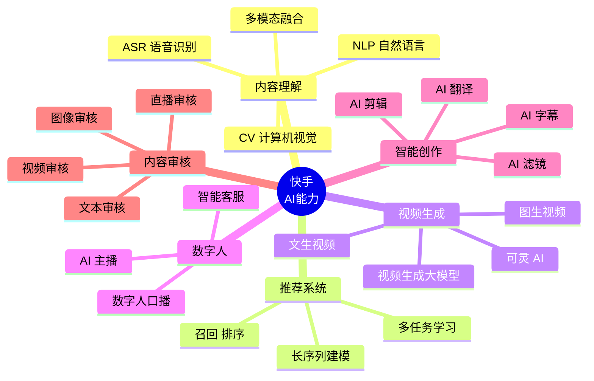
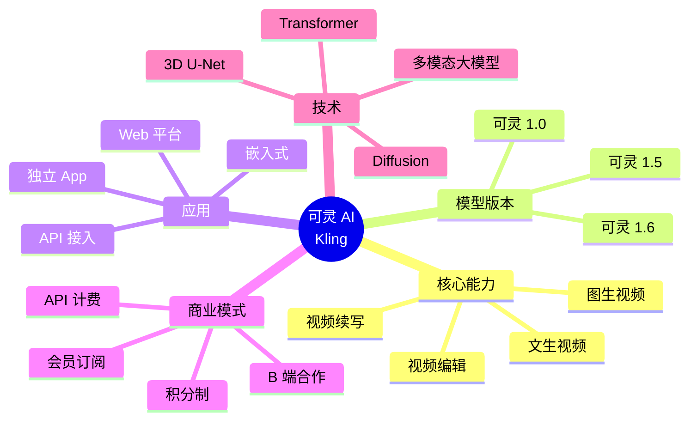
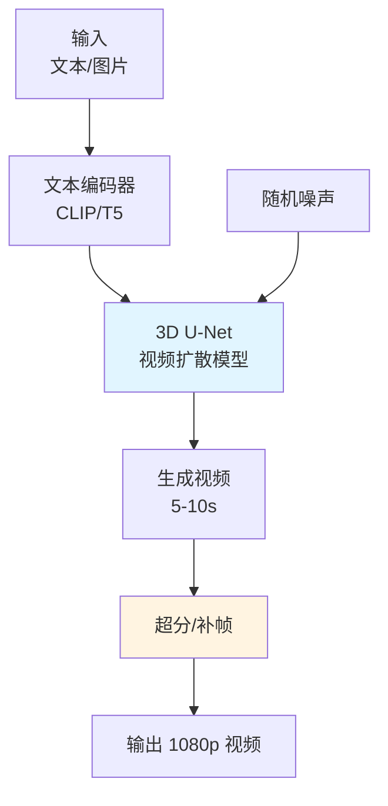
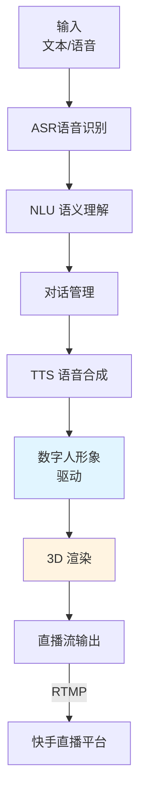
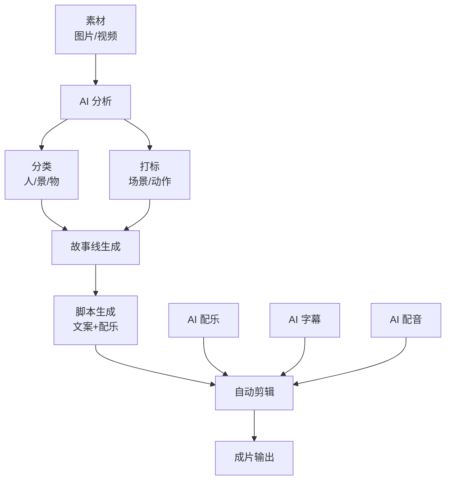
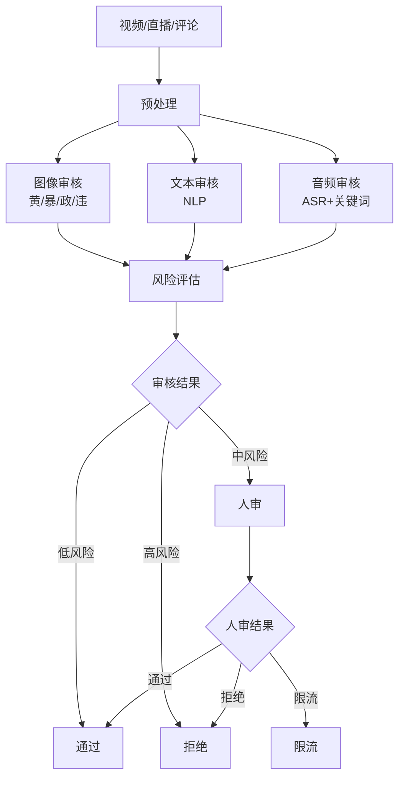

# 04 - 快手 AI 能力与可灵 AI

## 一、快手 AI 能力版图

快手在 AI 领域投入巨大，是国内 AI 研究的领军企业之一。AI 能力主要体现在：内容理解、推荐算法、多模态、视频生成、智能创作等。



### 1.1 AI 应用场景

| 场景 | AI 能力 | 落地产品 |
|------|---------|---------|
| 内容推荐 | 推荐算法 | 主 Feed / 关注 / 同城 |
| 内容审核 | 多模态审核 | 视频/直播机审 |
| 智能创作 | AI 剪辑/滤镜 | 快影 App |
| 数字人 | 数字人口播 | 商家直播 / 主播辅助 |
| 视频生成 | 可灵 AI | 独立 App + 快手内嵌 |
| 直播理解 | 实时分析 | 直播切片 / 实时标签 |
| 搜索 | 语义搜索 | 快手搜索 |
| 广告创意 | AI 生成广告 | 磁力引擎 / 创意生成 |
| 风控反作弊 | 异常检测 | 流量反作弊 |

## 二、可灵 AI (Kling AI) 深度调研

### 2.1 可灵 AI 概览

可灵 AI 是快手自研的视频生成大模型，2024 年 6 月正式发布，对标 OpenAI Sora，是国内首批视频生成大模型之一。



### 2.2 可灵 AI 版本演进

| 版本 | 发布时间 | 关键能力 |
|------|----------|---------|
| 可灵 1.0 | 2024.06 | 文生视频 5s/720p |
| 可灵 1.5 | 2024.09 | 视频质量提升、运动控制 |
| 可灵 1.6 | 2024.12 | 1080p 高清、更长时长 (10s) |
| 可灵 AI 视频 1.6 | 2025.Q1 | 多模态融合、镜头控制 |
| 可灵 AI 视频 O1 | 2025.Q2 | 推理式视频生成 (规划中) |

### 2.3 可灵 AI 核心能力

```
┌────────────────────────────────────────────────────┐
│              可灵 AI 核心能力矩阵                     │
├────────────────────────────────────────────────────┤
│                                                      │
│  1. 文生视频 (Text-to-Video)                          │
│     - 输入: 文本描述                                   │
│     - 输出: 5-10 秒视频                               │
│     - 分辨率: 720p / 1080p                            │
│     - 应用: 内容创作、广告创意                         │
│                                                      │
│  2. 图生视频 (Image-to-Video)                         │
│     - 输入: 一张图片                                   │
│     - 输出: 让图片动起来的视频                          │
│     - 应用: 老照片动起来、商品动起来                    │
│                                                      │
│  3. 视频续写 (Video Continuation)                    │
│     - 输入: 一段视频                                   │
│     - 输出: 续写后续                                   │
│     - 应用: 短视频二次创作                             │
│                                                      │
│  4. 视频编辑 (Video Editing)                          │
│     - 输入: 视频 + 编辑指令                            │
│     - 输出: 编辑后的视频                               │
│     - 应用: 一键改背景、改风格                          │
│                                                      │
│  5. 镜头控制 (Camera Control)                         │
│     - 推、拉、摇、移、跟                                │
│     - 应用: 电影感镜头                                 │
│                                                      │
└────────────────────────────────────────────────────┘
```

### 2.4 可灵 AI 技术原理 (推测)

可灵 AI 的技术架构基于**扩散模型 (Diffusion Model)** 与 **Transformer** 的融合：



#### 2.4.1 关键技术点

```python
# 可灵 AI 推测的技术架构 (示意)
# 基于 Diffusion + Transformer 的视频生成

class KlingVideoGenerator:
    """可灵视频生成核心架构 (简化示意)"""
    
    def __init__(self):
        # 1. 文本编码器 (CLIP / T5)
        self.text_encoder = T5Encoder()  # 文本编码
        # 2. 3D U-Net (视频扩散模型)
        self.unet_3d = UNet3D(
            in_channels=4,    # 视频潜空间通道
            out_channels=4,
            down_block_types=("CrossAttnDown", "CrossAttnDown", "CrossAttnDown", "DownBlock"),
            up_block_types=("UpBlock", "CrossAttnUp", "CrossAttnUp", "CrossAttnUp"),
        )
        # 3. VAE (视频变分自编码器)
        self.vae = VideoVAE()  # 视频编码到潜空间
        # 4. 超分模型
        self.super_res = VideoSuperResolution()
    
    def generate(self, text_prompt, num_frames=48, height=720, width=1280):
        # 1. 文本编码
        text_emb = self.text_encoder(text_prompt)
        
        # 2. 初始化潜空间噪声
        latent = torch.randn(
            num_frames // 8,  # 时间下采样
            4, height // 8, width // 8  # 空间下采样
        )
        
        # 3. 扩散过程去噪 (50 步 DDIM)
        for t in self.scheduler.timesteps:
            latent = self.scheduler.step(
                self.unet_3d(latent, t, text_emb),
                t, latent
            )
        
        # 4. VAE 解码到像素空间
        video = self.vae.decode(latent)  # [num_frames, 3, H, W]
        
        # 5. 超分到目标分辨率
        if height > 720:
            video = self.super_res(video)
        
        return video  # [num_frames, 3, H, W]
```

### 2.5 可灵 AI 商业化

```
可灵 AI 商业模式:
├── C 端
│   ├── 独立 App (klingai.com)
│   ├── 会员订阅 (包月/包年)
│   ├── 积分制 (按次付费)
│   └── 免费试用额度
├── B 端
│   ├── API 接入 (按调用次数)
│   ├── 企业级定制
│   └── 私有化部署
└── 平台内嵌
    ├── 快手 App 内可灵入口
    ├── 商家 AI 生图/生视频
    └── 主播 AI 辅助
```

### 2.6 可灵 AI 的竞争优势

| 维度 | 可灵 AI | 竞品 |
|------|---------|------|
| 视频质量 | 优秀 | 与 Sora 接近 |
| 国内访问 | 容易 | Sora 国内难访问 |
| 中文理解 | 强 | 较弱 |
| 价格 | 较低 | 较高 |
| 集成度 | 与快手生态深度集成 | 独立工具 |
| 持续迭代 | 1.0 → 1.6 快速迭代 | 较慢 |

### 2.7 可灵 AI 在快手生态内的应用

```
可灵 AI × 快手生态:
├── 创作者工具
│   ├── 视频模板生成
│   ├── AI 补帧/补画面
│   └── 老照片修复 + 动起来
├── 商家工具
│   ├── 商品图生成视频
│   ├── AI 主播短视频
│   └── 广告素材生成
├── 直播场景
│   ├── AI 数字人主播
│   ├── 直播背景替换
│   └── 直播切片 AI 处理
└── 内容生态
    ├── AI 生成内容标识
    ├── 创作者 AI 助手
    └── 内容生态多元化
```

## 三、快手数字人

### 3.1 数字人产品

快手数字人产品矩阵：

```
快手数字人:
├── 商家数字人 (B 端)
│   ├── 24h 不间断直播
│   ├── 标准化商品讲解
│   ├── 降低直播成本
│   └── 集成可灵 AI 形象
├── 主播数字分身 (C 端)
│   ├── 主播 AI 克隆
│   ├── 离线直播
│   └── 短视频自动生成
├── 数字员工
│   ├── 客服数字人
│   ├── 直播助手
│   └── 内容审核助手
└── 数字人 SDK / API
    ├── 第三方接入
    └── 行业解决方案
```

### 3.2 数字人技术架构



### 3.3 数字人主播的关键技术

```python
# 数字人主播核心技术
class DigitalHumanBroadcaster:
    """AI 数字人主播"""
    
    def __init__(self, avatar_model, voice_model):
        self.avatar = avatar_model  # 形象模型
        self.voice = voice_model   # 语音模型
        self.tts = TTSModel()      # TTS
        self.asr = ASRModel()      # ASR
        self.dialog = DialogSystem()  # 对话系统
        self.rd_engine = RenderEngine()  # 渲染引擎
    
    def handle_user_question(self, audio):
        """处理用户提问"""
        # 1. ASR 语音识别
        text = self.asr.recognize(audio)
        
        # 2. NLU 理解意图
        intent = self.dialog.understand(text)
        
        # 3. 生成回复
        reply = self.dialog.generate_reply(intent)
        
        # 4. TTS 合成语音
        audio_reply = self.tts.synthesize(reply)
        
        # 5. 数字人口型同步
        lip_sync = self.avatar.lip_sync(audio_reply)
        
        # 6. 渲染输出
        video_frame = self.rd_engine.render(lip_sync, audio_reply)
        
        return video_frame, audio_reply
    
    def product_introduce(self, product_info):
        """商品介绍 - 主动讲解"""
        # 1. 生成讲解脚本
        script = self.dialog.generate_intro_script(product_info)
        
        # 2. TTS
        audio = self.tts.synthesize(script)
        
        # 3. 数字人表达
        video = self.avatar.express(audio)
        
        return video, audio
```

### 3.4 数字人主播的典型应用

```
┌────────────────────────────────────────────────────┐
│              数字人主播应用场景                       │
├────────────────────────────────────────────────────┤
│                                                      │
│  1. 24h 不间断直播                                     │
│     - 商家不可能 24h 在线，数字人可以                  │
│     - 自动讲解商品、自动回复常见问题                    │
│     - 用户进直播间可与数字人互动                       │
│                                                      │
│  2. 主播离线直播                                       │
│     - 主播录一段训练视频                                │
│     - 数字人克隆主播形象 + 声音                        │
│     - 主播休息时数字人代替直播                          │
│                                                      │
│  3. 多语言直播                                         │
│     - 同一个数字人，中英日韩多语言                      │
│     - 适合跨境电商                                     │
│     - 数字人自动翻译 + 讲解                            │
│                                                      │
│  4. AI 短视频自动生成                                  │
│     - 输入商品信息                                     │
│     - 自动生成数字人讲解短视频                         │
│     - 批量生成投放素材                                 │
│                                                      │
│  5. 标准化服务                                         │
│     - 数字人客服                                       │
│     - 数字人助理                                       │
│     - 数字人向导                                       │
│                                                      │
└────────────────────────────────────────────────────┘
```

## 四、快手 AI 智能创作

### 4.1 快影 App

快影是快手官方的视频编辑 App，深度集成 AI 能力：

```
快影 AI 能力:
├── AI 剪辑
│   ├── 一键成片 (素材 → 完整视频)
│   ├── AI 配乐
│   ├── AI 字幕
│   └── AI 配音
├── AI 滤镜
│   ├── 美颜滤镜
│   ├── 风格化滤镜
│   └── AI 漫画化
├── AI 修复
│   ├── 老照片修复
│   ├── 视频超分
│   └── 视频补帧
└── AI 创作
    ├── AI 文案
    ├── AI 数字人
    └── 可灵 AI 入口
```

### 4.2 一键成片 (AI 剪辑) 原理



```python
# AI 一键成片 (简化示意)
class AIOneClickVideo:
    def create_video(self, materials, user_prompt=None):
        # 1. 素材分析
        scenes = self.analyze_materials(materials)
        
        # 2. 内容分类与打标
        tags = self.classify_scenes(scenes)  # 人物、风景、特写...
        
        # 3. 故事线生成 (基于模板/LLM)
        storyline = self.generate_storyline(tags, user_prompt)
        
        # 4. 智能剪辑
        clips = self.smart_edit(scenes, storyline)
        
        # 5. AI 配音
        voiceover = self.tts_synthesize(storyline.narration)
        
        # 6. AI 字幕
        subtitles = self.generate_subtitles(voiceover)
        
        # 7. AI 配乐
        bgm = self.recommend_bgm(storyline.mood)
        
        # 8. 合成成片
        final_video = self.compose(
            clips=clips,
            voiceover=voiceover,
            subtitles=subtitles,
            bgm=bgm
        )
        
        return final_video
```

### 4.3 内容理解与多模态

```python
# 多模态视频理解 (简化示意)
class VideoMultimodalUnderstanding:
    """快手多模态视频理解模型"""
    
    def understand(self, video):
        # 1. 视觉特征 (CV)
        visual_feat = self.cv_model.encode(video.frames)
        # 2. 音频特征 (ASR)
        audio_feat = self.asr_model.encode(video.audio)
        # 3. 文本特征 (OCR)
        text_feat = self.ocr_model.encode(video.frames)
        
        # 4. 多模态融合
        multimodal_feat = self.fusion_net(
            visual_feat, audio_feat, text_feat
        )
        
        # 5. 内容标签预测
        tags = self.tag_predictor(multimodal_feat)
        # 输出: ['美食', '农村', '小孩', '真实生活', ...]
        
        # 6. 内容质量评分
        quality_score = self.quality_scorer(multimodal_feat)
        # 输出: 0.0-1.0
        
        # 7. 内容审核判断
        is_violation, violation_type = self.audit(multimodal_feat)
        
        return {
            'tags': tags,
            'quality': quality_score,
            'audit': (is_violation, violation_type)
        }
```

## 五、AI 内容审核

### 5.1 审核体系



### 5.2 审核模型架构

```python
# 多模态内容审核模型
class ContentAuditModel(nn.Module):
    """快手多模态内容审核"""
    
    def __init__(self):
        self.vision_encoder = ResNet50()      # 视觉编码
        self.text_encoder = BertModel()        # 文本编码
        self.audio_encoder = Wav2Vec2()        # 音频编码
        self.fusion = nn.MultiheadAttention(embed_dim=512, num_heads=8)
        self.classifier = nn.Linear(512, num_classes)  # 多标签分类
    
    def forward(self, image, text, audio):
        # 1. 多模态编码
        v_feat = self.vision_encoder(image)   # [B, D]
        t_feat = self.text_encoder(text)       # [B, D]
        a_feat = self.audio_encoder(audio)     # [B, D]
        
        # 2. 多模态融合
        feats = torch.stack([v_feat, t_feat, a_feat], dim=1)  # [B, 3, D]
        fused, _ = self.fusion(feats, feats, feats)  # [B, 3, D]
        fused = fused.mean(dim=1)  # [B, D]
        
        # 3. 分类 (多标签)
        logits = self.classifier(fused)  # [B, num_classes]
        # num_classes: 色情/暴力/政治/广告/未成年保护/...
        
        return logits
```

### 5.3 直播实时审核

```python
# 直播实时审核
class LiveAuditPipeline:
    """直播实时审核流水线"""
    
    def __init__(self):
        self.frame_sampler = FrameSampler(every_n_seconds=2)
        self.image_audit = ContentAuditModel()
        self.audio_audit = AudioAuditModel()
        self.risk_db = RiskDatabase()
    
    def audit_stream(self, stream_url):
        """实时审核直播流"""
        for frame, audio_chunk in self.stream_reader(stream_url):
            # 1. 帧采样
            frames = self.frame_sampler.sample(frame)
            
            # 2. 视觉审核
            visual_risk = self.image_audit.predict(frames)
            
            # 3. 音频审核
            audio_risk = self.audio_audit.predict(audio_chunk)
            
            # 4. 风险决策
            if visual_risk > 0.8 or audio_risk > 0.8:
                yield self.trigger_action('interrupt_live')
            elif visual_risk > 0.5 or audio_risk > 0.5:
                yield self.trigger_action('warn_anchor')
            else:
                yield self.trigger_action('pass')
```

## 六、快手 AI 基础设施

### 6.1 训练框架 - YY 平台

```
YY 平台 (快手自研):
├── 分布式训练
│   ├── 多机多卡训练
│   ├── Parameter Server 架构
│   ├── Ring AllReduce
│   └── 混合精度训练
├── 资源调度
│   ├── GPU 集群 (数千张卡)
│   ├── Kubernetes 调度
│   └── 训练任务排队
├── 数据管理
│   ├── 训练样本管理
│   ├── 数据版本控制
│   └── 特征存储
└── 模型管理
    ├── 模型版本
    ├── 在线/离线一致性
    └── A/B 实验
```

### 6.2 GPU 集群规模

快手 GPU 集群在国内属于头部，规模数千张 A100/H100：

```
GPU 集群用途:
├── 推荐系统训练
├── 内容理解模型 (CV/NLP)
├── 可灵 AI 训练 (大模型)
├── 数字人训练
└── 多模态研究
```

### 6.3 在线推理服务

```python
# TF Serving 在线推理 (示意)
class ModelServing:
    """模型在线推理服务"""
    
    def __init__(self):
        self.serving = TFServingClient(
            model_name='din_rank_model',
            model_version='latest',
            gpu_id=0
        )
    
    def predict(self, features):
        """在线推理"""
        # 1. 特征准备
        inputs = self.prepare_inputs(features)
        
        # 2. 推理
        result = self.serving.predict(inputs)
        
        # 3. 后处理
        score = result['output'][0]
        
        return score
```

## 七、可灵 AI API 与生态

### 7.1 可灵 AI API

```python
# 可灵 AI API (示意)
import requests

class KlingAIClient:
    def __init__(self, api_key):
        self.api_key = api_key
        self.base_url = "https://api.klingai.com/v1"
    
    def text_to_video(self, prompt, duration=5, mode='std'):
        """文生视频"""
        url = f"{self.base_url}/videos/text2video"
        payload = {
            "model": "kling-v1-6",  # 模型版本
            "prompt": prompt,
            "duration": duration,
            "mode": mode,  # std 标准 / pro 高质量
            "aspect_ratio": "16:9",
        }
        headers = {"Authorization": f"Bearer {self.api_key}"}
        return requests.post(url, json=payload, headers=headers).json()
    
    def image_to_video(self, image_url, prompt=None):
        """图生视频"""
        url = f"{self.base_url}/videos/image2video"
        payload = {
            "model": "kling-v1-6",
            "image": image_url,
            "prompt": prompt,
            "duration": 5,
        }
        headers = {"Authorization": f"Bearer {self.api_key}"}
        return requests.post(url, json=payload, headers=headers).json()
    
    def query_task(self, task_id):
        """查询任务状态"""
        url = f"{self.base_url}/videos/task/{task_id}"
        headers = {"Authorization": f"Bearer {self.api_key}"}
        return requests.get(url, headers=headers).json()
```

### 7.2 可灵 AI 与 AI 直播平台结合

可灵 AI 与 AI 直播平台天然契合：

```
可灵 AI × AI 直播平台:
├── 数字人形象生成
│   ├── 可灵生成虚拟主播形象
│   ├── 主播 AI 分身
│   └── 多元化主播库
├── 直播背景/道具
│   ├── 实时 AI 换背景
│   ├── AI 道具生成
│   └── 沉浸式直播场景
├── 直播切片增强
│   ├── AI 补帧
│   ├── AI 修复
│   └── AI 二次创作
└── 跨境直播
    ├── AI 实时翻译
    ├── 数字人多语言
    └── 海外场景生成
```

## 八、快手 AI 与 TikTok/抖音 AI 对比

| 维度 | 快手 (可灵 AI) | 抖音 (字节/豆包) | TikTok (海外) |
|------|---------------|----------------|--------------|
| 视频生成大模型 | 可灵 AI | 字节 Seedance | Sora (海外) |
| 数字人 | 商家数字人 + 主播分身 | 火山引擎数字人 | 海外数字人 |
| 智能创作 | 快影 | 剪映 / 即梦 | CapCut |
| 直播 AI | AI 数字人主播 | 火山引擎直播 | 海外直播 AI |
| 内容审核 | 立体化 | 立体化 | 同等 |
| 推荐算法 | DIN/MMoE | DIN/MMoE | 类似 |

## 九、快手 AI 未来趋势

1. **可灵 AI 持续迭代**：对标 Sora，向 4K/更长时长发展
2. **AI 数字人主播普及**：商家直播标配
3. **多模态深度融合**：文/图/视频/音频一体化
4. **AIGC 内容标识**：AI 生成内容合规化
5. **AI 辅助创作**：降低创作门槛
6. **AI 直播运营**：AI 自动选品、AI 自动讲解

## 十、可借鉴点

对 AI 直播平台的可借鉴：

1. **数字人主播**：AI 数字人 + 真人连麦模式
2. **AI 一键成片**：商家可批量生成短视频素材
3. **可灵 AI 集成**：使用可灵 API 生成数字人形象/背景
4. **多模态内容理解**：AI 自动打标、审核、推荐
5. **AI 内容审核**：实时机审 + 人审
6. **智能创作工具**：降低创作者门槛

## 十一、参考资料

- [可灵 AI 官方](https://klingai.com/)
- [快手技术博客](https://tech.kuaishou.com/)
- 快手 AI 论文集 (NeurIPS / ICML / CVPR)
- 36氪《可灵 AI 深度报道》
- 《2024 视频生成大模型研究报告》

## 十二、附录：可灵 AI 与 Sora 对比

| 维度 | 可灵 AI 1.6 | Sora (OpenAI) |
|------|------------|---------------|
| 发布时间 | 2024.12 | 2024.02 |
| 时长 | 10s | 60s |
| 分辨率 | 1080p | 1080p |
| 中文支持 | 强 | 弱 |
| 国内访问 | 容易 | 难 |
| 价格 | 较低 | 较高 (未公开) |
| API | 有 | 限量内测 |
| 商业化 | 完整 | 等待 |