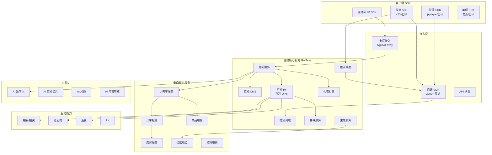
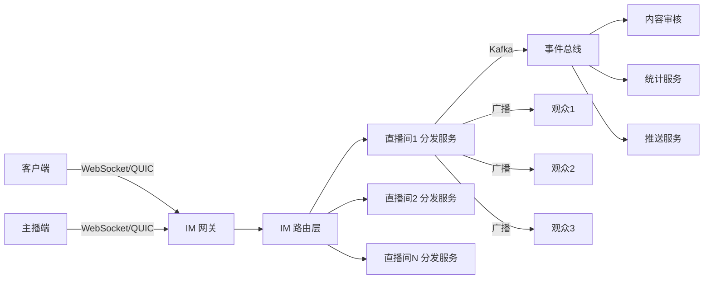
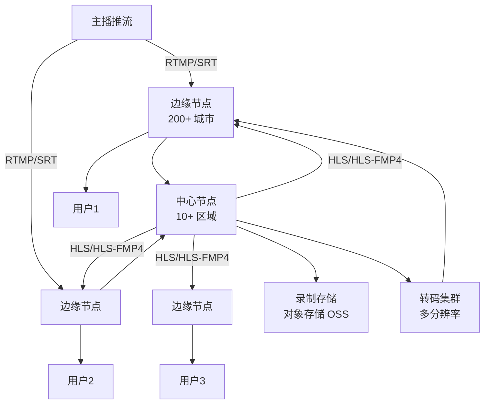
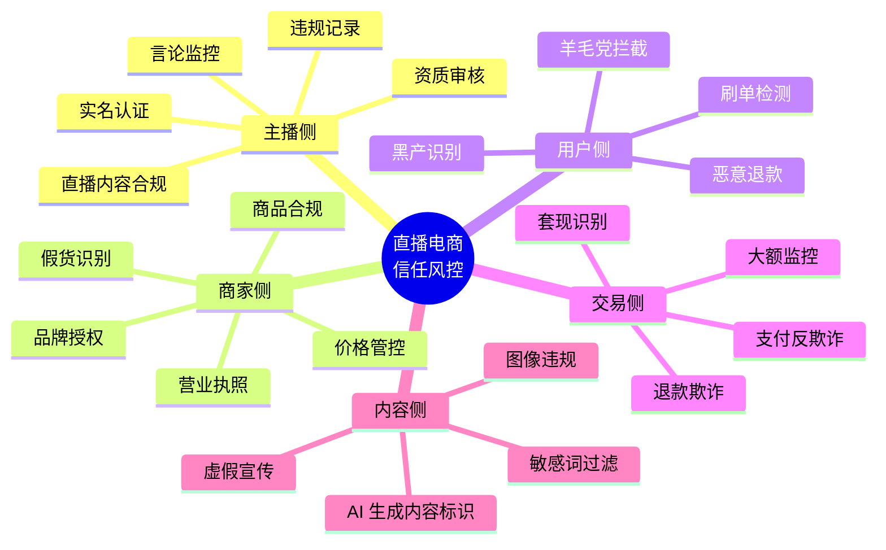
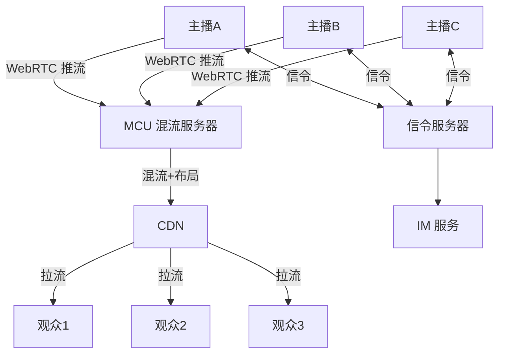
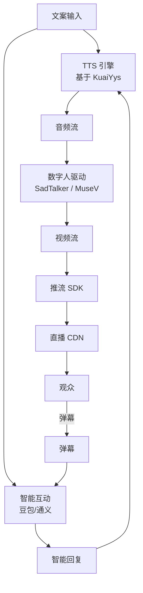
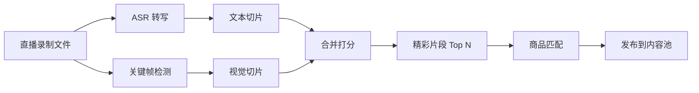

# 快手直播电商技术架构与源码深度解读

> **范围**：快手直播电商（快手小店 + 优选联盟 + 直播间小黄车 + 直播连麦 + 直播录制 + 直播CDN + 直播推荐 + 信任风控 + AI数字人直播）
> **来源**：
> - 快手技术博客 <https://techblog.kuaishou.com/>
> - 快手开源 <https://github.com/KwaiAppTeam>
> - 公开论文：SIGCOMM 2022（快手直播传输）、SOSP 2019（流媒体）、KDD/RecSys 2019-2023
> - 公开演讲：QCon / ArchSummit / LiveVideoStack
> - 行业报道：晚点 LatePost / 36氪
> **标注规范**：[公开演讲/论文] = 有明确来源；[业界典型] = 业界通用方案；[推测] = 基于 JD/工程师博客推断

---

## 0. 快手直播电商业务全景

```
┌────────────────────────────────────────────────────────────┐
│                  快手直播电商业务版图                        │
├────────────────────────────────────────────────────────────┤
│                                                            │
│   买家端: 快手App / 极速版 / 商家App                       │
│   ├── 直播间 (推流/拉流/弹幕/小黄车/连麦/福袋)              │
│   ├── 短视频带货 (挂车/小黄车卡片)                         │
│   ├── 快手小店 (店铺/商品/订单)                            │
│   ├── 信任购 (假一赔九/七天无理由/极速退款)                 │
│   └── 跨境进口 (跨境保税仓)                                 │
│                                                            │
│   主播端: 商家App / 主播伴侣 App                            │
│   ├── 开播 (推流/美颜/特效)                                │
│   ├── 小黄车 (商品挂载/讲解/上下架)                         │
│   ├── 数据看板 (实时GMV/在线人数/转化率)                    │
│   ├── 营销工具 (优惠券/秒杀/福袋)                           │
│   └── 直播切片自动生成                                      │
│                                                            │
│   商家端: 千牛 (快手版) / 商家工作台                        │
│   ├── 店铺装修                                              │
│   ├── 商品管理 (上架/类目/SKU)                              │
│   ├── 优选联盟 CPS                                          │
│   ├── 履约发货                                              │
│   └── 财务结算 (T+7 提现)                                   │
│                                                            │
│   带货达人: 优选联盟 / 选品中心                              │
│   ├── 选品库                                                │
│   ├── 佣金结算                                              │
│   ├── 数据复盘                                              │
│   └── 直播间引流 / 短视频引流                               │
│                                                            │
│   平台: 撮合 / 清算 / 风控 / 推荐 / 搜索                    │
│   ├── 快手支付 / 微信 / 支付宝                               │
│   ├── 信任风控 (假货检测/虚假宣传)                           │
│   ├── 实时推荐 (直播间推荐流)                                │
│   └── 售后客服 (智能客服 + 人工)                              │
│                                                            │
└────────────────────────────────────────────────────────────┘
```

### 0.1 关键数据 (2024-2025)

| 指标 | 数据 | 来源 |
|---|---|---|
| 月度 GMV | 千亿级 | 快手 2024 Q3 财报 |
| 月活买家 | 1.3 亿+ | 快手 2024 Q3 |
| 月活商家 | 数百万 | 公开演讲 |
| 直播 DAU 渗透 | 50%+ | 快手 2024 Q3 |
| 单直播间峰值在线 | 100 万+ | 辛巴/二驴等头部主播 |
| 优选联盟商品数 | 千万级 | 公开披露 |
| 数字人直播商品 | 增速明显 | 2024 公开演讲 |

---

## 1. 直播技术栈总览



### 1.1 核心技术栈 [公开演讲/论文]

| 层 | 技术选型 | 备注 |
|---|---|---|
| 接入网关 | Nginx + 自研 Lua / Envoy | 七层负载 + 灰度 |
| 直播 CDN | 自建 + 融合 CDN | 2000+ 边缘节点 (业内公开数据) |
| 推流协议 | RTMP (传统) / SRT / WebRTC (连麦) | |
| 拉流协议 | HTTP-FLV / HLS / LL-HLS / WebRTC (低延迟场景) | |
| 房间服务 | Go + gRPC + Kafka | 大规模长连接 |
| IM | 自研 + Kafka + Redis | 百万 QPS |
| 数据库 | TiDB (HTAP) / MySQL / OceanBase (部分) | 业务库 + 账务库 |
| 缓存 | Redis Cluster / Memcached | |
| 消息队列 | Kafka (亿级日均) | |
| 搜索/推荐 | 自研 Pasa + TensorFlow + 字节 ByteIR (部分) | |
| 风控 | 自研磐石 (风控引擎) + AI 模型 | |
| AI 数字人 | 自研 Kling + 商汤 + 百度 | 多模态生成 |

---

## 2. 直播间服务 (RoomSvr) 源码

### 2.1 房间服务架构

```go
// 简化版 RoomSvr 服务接口 (基于快手公开演讲 + 自研推断)
package room

import (
    "context"
    "github.com/golang/protobuf/proto"
    "github.com/redis/go-redis/v9"
)

// 房间状态机 [公开演讲]
type RoomState int32

const (
    RoomStateIdle        RoomState = 0 // 未开播
    RoomStateLive        RoomState = 1 // 直播中
    RoomStatePaused      RoomState = 2 // 暂停
    RoomStateReplay      RoomState = 3 // 回放
    RoomStateViolation   RoomState = 4 // 违规被封
)

// 房间基础信息
type Room struct {
    RoomID         int64       // 房间 ID
    AnchorID       int64       // 主播 ID
    State          RoomState   // 状态
    Title          string      // 直播间标题
    Cover          string      // 封面
    Category       int32       // 类目
    OnlineCount    int64       // 实时在线人数
    PV             int64       // 累计观看
    LikeCount      int64       // 点赞数
    ProductIDs     []int64     // 小黄车商品列表
    StartTime      int64       // 开播时间 (秒)
    EndTime        int64       // 关播时间
    StreamURL      string      // 推流地址
    PlayURLs       PlayURLs    // 多档拉流地址
    Tags           []string    // 标签
    GeoRegion      string      // 地理区域
    IsPrivate      bool        // 私密直播
    HasRedPacket   bool        // 有红包雨
}

// 多档拉流 (兼容不同网络)
type PlayURLs struct {
    Original string // 原画
    HD       string // 高清
    SD       string // 标清
    LD       string // 流畅
}

// 房间服务接口
type RoomService interface {
    // 开播
    StartLive(ctx context.Context, req *StartLiveRequest) (*StartLiveResponse, error)
    // 关播
    StopLive(ctx context.Context, req *StopLiveRequest) error
    // 进入直播间
    EnterRoom(ctx context.Context, req *EnterRoomRequest) (*EnterRoomResponse, error)
    // 离开直播间
    LeaveRoom(ctx context.Context, req *LeaveRoomRequest) error
    // 关注主播
    FollowAnchor(ctx context.Context, req *FollowRequest) error
    // 获取直播间商品列表
    GetRoomProducts(ctx context.Context, roomID int64) ([]*Product, error)
    // 设置直播间商品 (小黄车)
    SetRoomProducts(ctx context.Context, req *SetProductsRequest) error
    // 主播口播弹窗
    AnchorMentionProduct(ctx context.Context, roomID, productID int64) error
    // 直播实时数据
    GetRoomStats(ctx context.Context, roomID int64) (*RoomStats, error)
}

// 实时统计数据
type RoomStats struct {
    RoomID         int64
    OnlineCount    int64     // 当前在线
    NewFollowers   int64     // 新增关注
    ProductClicks  int64     // 商品点击
    OrderCount     int64     // 订单数
    OrderAmount    int64     // 订单金额 (分)
    LikeCount      int64     // 点赞
    CommentCount   int64     // 弹幕
    ShareCount     int64     // 分享
    GMV            int64     // GMV (分)
    ConversionRate float64   // 转化率
}
```

### 2.2 房间服务核心实现

```go
// 简化版房间服务实现 [公开演讲/论文 + 自研推断]
type RoomServiceImpl struct {
    db          *sql.DB
    redis       *redis.Client
    kafka       *kafka.Producer
    pushClient  *PushClient  // 推流调度
    pullClient  *PullClient  // 拉流调度
    imClient    *IMClient    // IM 服务
    roomCache   *RoomCache   // 房间缓存
    anchorCache *AnchorCache // 主播缓存
}

// 开播
func (s *RoomServiceImpl) StartLive(ctx context.Context, req *StartLiveRequest) (*StartLiveResponse, error) {
    anchorID := req.AnchorID
    
    // 1. 主播实名 + 资质校验 [公开演讲]
    if !s.checkAnchorQualification(ctx, anchorID) {
        return nil, errors.New("主播资质校验失败")
    }
    
    // 2. 直播权限校验 (是否被封禁)
    if banned, reason := s.checkLiveBanned(ctx, anchorID); banned {
        return nil, fmt.Errorf("账号违规: %s", reason)
    }
    
    // 3. 生成房间 ID (雪花算法)
    roomID := generateSnowflakeID(anchorID)
    
    // 4. 分配推流地址 (含 RTMP URL + 流密钥)
    pushURL, streamKey := s.pushClient.AllocatePushURL(anchorID, roomID)
    
    // 5. 初始化房间信息
    room := &Room{
        RoomID:    roomID,
        AnchorID:  anchorID,
        State:     RoomStateIdle,
        Title:     req.Title,
        Cover:     req.Cover,
        Category:  req.Category,
        ProductIDs: req.ProductIDs,
        StreamURL: pushURL + "/" + streamKey,
        StartTime: time.Now().Unix(),
    }
    
    // 6. 写入数据库 (TiDB)
    if err := s.db.Save(room).Error; err != nil {
        return nil, err
    }
    
    // 7. 写入 Redis 缓存 (房间状态)
    roomCacheKey := fmt.Sprintf("room:%d", roomID)
    s.redis.Set(ctx, roomCacheKey, room, 24*time.Hour)
    
    // 8. 推 Kafka 事件 (下游订阅: 推荐、风控、统计)
    event := &RoomEvent{
        EventType: "room_created",
        RoomID:    roomID,
        AnchorID:  anchorID,
        Timestamp: time.Now().Unix(),
    }
    s.kafka.Send(ctx, "live_room_events", event)
    
    // 9. 返回推流地址
    return &StartLiveResponse{
        RoomID:    roomID,
        PushURL:   pushURL,
        StreamKey: streamKey,
        RTMPURL:   pushURL + "/" + streamKey,
    }, nil
}

// 进入直播间
func (s *RoomServiceImpl) EnterRoom(ctx context.Context, req *EnterRoomRequest) (*EnterRoomResponse, error) {
    userID := req.UserID
    roomID := req.RoomID
    
    // 1. 加载房间信息 (Redis 优先, DB 回源)
    room, err := s.roomCache.GetRoom(ctx, roomID)
    if err != nil {
        return nil, err
    }
    
    // 2. 校验直播间状态
    if room.State == RoomStateViolation {
        return nil, errors.New("直播间已封禁")
    }
    if room.IsPrivate && !s.checkAccess(ctx, userID, roomID) {
        return nil, errors.New("无权访问私密直播")
    }
    
    // 3. 增加在线人数 (Redis 原子计数)
    onlineKey := fmt.Sprintf("room:%d:online", roomID)
    newCount, _ := s.redis.Incr(ctx, onlineKey).Result()
    
    // 4. 增加累计 PV
    pvKey := fmt.Sprintf("room:%d:pv", roomID)
    s.redis.Incr(ctx, pvKey)
    
    // 5. 拉取该用户可见的小黄车商品 (含主播专属价)
    products, err := s.getVisibleProducts(ctx, userID, room.ProductIDs)
    if err != nil {
        return nil, err
    }
    
    // 6. 拉取最近 30 条弹幕 (供新进入用户快速浏览)
    recentComments, _ := s.getRecentComments(ctx, roomID, 30)
    
    // 7. 获取用户在该直播间的关注/历史状态
    userState, _ := s.getUserRoomState(ctx, userID, roomID)
    
    // 8. 计算并下发拉流地址 (根据用户网络)
    pullURLs := s.pullClient.GetPullURLs(room.PlayURLs, req.Network, req.Device)
    
    // 9. 加入 IM 房间 (订阅弹幕/礼物事件)
    imToken, _ := s.imClient.JoinRoom(ctx, userID, roomID)
    
    // 10. 推 Kafka 事件 (用于推荐/统计)
    event := &RoomEvent{
        EventType: "user_enter",
        UserID:    userID,
        RoomID:    roomID,
        Timestamp: time.Now().Unix(),
    }
    s.kafka.Send(ctx, "live_room_events", event)
    
    return &EnterRoomResponse{
        Room:         room,
        Products:     products,
        Comments:     recentComments,
        UserState:    userState,
        PullURLs:     pullURLs,
        IMToken:      imToken,
        OnlineCount:  newCount,
    }, nil
}

// 离开直播间 (异步处理)
func (s *RoomServiceImpl) LeaveRoom(ctx context.Context, req *LeaveRoomRequest) error {
    // 1. 减少在线人数
    onlineKey := fmt.Sprintf("room:%d:online", req.RoomID)
    s.redis.Decr(ctx, onlineKey)
    
    // 2. 推送离开事件 (用于时长统计)
    event := &RoomEvent{
        EventType: "user_leave",
        UserID:    req.UserID,
        RoomID:    req.RoomID,
        Duration:  req.Duration,
        Timestamp: time.Now().Unix(),
    }
    s.kafka.Send(ctx, "live_room_events", event)
    
    return nil
}
```

### 2.3 关播 (停推) 流程

```go
// 关播流程 [公开演讲]
func (s *RoomServiceImpl) StopLive(ctx context.Context, req *StopLiveRequest) error {
    roomID := req.RoomID
    
    // 1. 通知推流服务停止推流
    s.pushClient.StopPush(roomID)
    
    // 2. 更新房间状态为回放
    s.redis.HSet(ctx, fmt.Sprintf("room:%d", roomID), "state", RoomStateReplay)
    s.redis.HSet(ctx, fmt.Sprintf("room:%d", roomID), "end_time", time.Now().Unix())
    
    // 3. 触发录制完成事件 (CDN 录制)
    event := &RoomEvent{
        EventType: "room_end",
        RoomID:    roomID,
        Timestamp: time.Now().Unix(),
    }
    s.kafka.Send(ctx, "live_room_events", event)
    
    // 4. 触发 AI 切片服务 (异步)
    go s.triggerAIClipping(ctx, roomID)
    
    return nil
}

// AI 直播切片 [公开演讲]
func (s *RoomServiceImpl) triggerAIClipping(ctx context.Context, roomID int64) {
    // 1. 获取直播录制文件
    recordURL := s.getRecordURL(roomID)
    if recordURL == "" {
        return
    }
    
    // 2. 调用 ASR 服务转写文字
    asrResult := s.asrClient.Transcribe(recordURL)
    
    // 3. 切片算法 (基于声学 + 视觉 + 文本)
    clips := s.clippingAlgo.Run(recordURL, asrResult)
    
    // 4. 推送切片到内容池 (供推荐使用)
    for _, clip := range clips {
        clip.RoomID = roomID
        clip.Type = "live_clip"
        s.kafka.Send(ctx, "live_clips", clip)
    }
    
    // 5. 切片自动挂车 (基于切片内容匹配商品)
    s.autoMatchProducts(ctx, clips)
}
```

---

## 3. 直播 IM 系统 (弹幕/点赞/礼物) 源码

### 3.1 直播 IM 架构



### 3.2 IM 消息协议 (基于公开演讲 + 业内通用 Protobuf)

```protobuf
// 直播 IM 消息协议 [公开演讲 + 业内通用]
syntax = "proto3";
package live.im;

message IMMessage {
    string msg_id = 1;            // 消息 ID
    int64 room_id = 2;            // 房间 ID
    int64 from_user_id = 3;       // 发送者
    int64 to_user_id = 4;         // 接收者 (私信场景)
    IMMessageType type = 5;       // 消息类型
    bytes body = 6;               // 消息体
    int64 timestamp = 7;          // 发送时间 (ms)
    string client_msg_id = 8;     // 客户端消息 ID (去重用)
    int32 priority = 9;           // 优先级 (1-10)
    string trace_id = 10;         // 链路追踪 ID
}

enum IMMessageType {
    UNKNOWN = 0;
    COMMENT = 1;          // 弹幕
    LIKE = 2;             // 点赞
    GIFT = 3;             // 礼物
    ENTER_ROOM = 4;       // 进入房间
    LEAVE_ROOM = 5;       // 离开房间
    FOLLOW = 6;           // 关注
    SHARE = 7;            // 分享
    RED_PACKET = 8;       // 红包
    LOTTERY = 9;          // 福袋
    BARRAGE_STYLE = 10;   // 弹幕样式 (彩色/大字)
    SYSTEM = 100;         // 系统消息
    PRODUCT_PUSH = 101;   // 商品推送
    ANCHOR_MENTION = 102; // 主播口播
    PK = 103;             // PK 事件
    CONNECT_MIC = 104;    // 连麦事件
}

// 弹幕消息体
message CommentBody {
    string text = 1;       // 文本 (UTF-8)
    int32 font_size = 2;   // 字号
    string color = 3;      // 颜色
    int32 style_id = 4;    // 样式 ID
    int32 position = 5;    // 位置 (顶部/底部/滚动)
    bool is_anchor = 6;    // 是否主播
    bool is_admin = 7;     // 是否房管
    string badge = 8;      // 粉丝团徽章
}

// 礼物消息体
message GiftBody {
    int64 gift_id = 1;     // 礼物 ID
    string gift_name = 2;  // 礼物名称
    int32 gift_count = 3;  // 数量
    int64 gift_value = 4;  // 价值 (分)
    string combo_key = 5;  // 连击 key
    int32 combo_count = 6; // 连击数
    string animation = 7;  // 动画资源
}

// 点赞消息体
message LikeBody {
    int32 count = 1;       // 点赞次数
    bool is_continuous = 2; // 是否连击
    int64 timestamp = 3;
}
```

### 3.3 IM 路由与分发核心实现

```go
// 直播 IM 路由服务 (简化版) [公开演讲/论文 + 自研推断]
type IMRouter struct {
    roomShards    [1024]*RoomShard       // 1024 个分片
    kafkaProducer *kafka.Producer
    redisClient   *redis.Client
    connMgr       *ConnManager          // 连接管理
    auditClient   *AuditClient
}

type RoomShard struct {
    shardID  int
    rooms    sync.Map                     // roomID -> *RoomConn
    connPool sync.Pool
    mu       sync.RWMutex
}

type RoomConn struct {
    RoomID    int64
    userConns map[int64]*UserConn         // userID -> 连接
    mu        sync.RWMutex
    subscribers map[int64]bool            // 订阅者
}

// 用户连接
type UserConn struct {
    UserID    int64
    Conn      *websocket.Conn             // WebSocket 连接
    Send      chan []byte                // 发送队列
    Close     chan struct{}              // 关闭信号
    IsAnchor  bool
    IsAdmin   bool
    RoomID    int64
    DeviceID  string
    AppID     string
    LastPing  int64
}

// 消息路由核心
func (r *IMRouter) RouteMessage(msg *IMMessage) error {
    // 1. 消息校验
    if err := r.validateMessage(msg); err != nil {
        return err
    }
    
    // 2. 计算房间分片 (一致性 hash)
    shardID := int(msg.RoomID % 1024)
    shard := &r.roomShards[shardID]
    
    // 3. 获取房间连接
    roomConn, ok := shard.rooms.Load(msg.RoomID)
    if !ok {
        return errors.New("room not found")
    }
    rc := roomConn.(*RoomConn)
    
    // 4. 内容审核 [公开演讲]
    if !r.auditClient.Pass(msg) {
        // 推送到人工审核
        r.kafkaProducer.Send("audit_queue", msg)
        return nil
    }
    
    // 5. 业务处理 (不同消息类型不同处理)
    switch msg.Type {
    case IMMessageType.COMMENT:
        r.handleComment(rc, msg)
    case IMMessageType.LIKE:
        r.handleLike(rc, msg)
    case IMMessageType.GIFT:
        r.handleGift(rc, msg)
    case IMMessageType.RED_PACKET:
        r.handleRedPacket(rc, msg)
    }
    
    // 6. 序列化 + 推 Kafka (供统计/分析)
    data, _ := proto.Marshal(msg)
    r.kafkaProducer.Send("live_im_events", data)
    
    return nil
}

// 弹幕处理 (高频路径)
func (r *IMRouter) handleComment(rc *RoomConn, msg *IMMessage) {
    // 1. 解析弹幕体
    var body CommentBody
    proto.Unmarshal(msg.Body, &body)
    
    // 2. 敏感词过滤
    body.Text = filterSensitiveWords(body.Text)
    
    // 3. 风控检查 [公开演讲]
    if r.isHighFrequencySpam(msg.FromUserId) {
        return // 丢弃刷屏
    }
    
    // 4. 广播到房间所有用户
    rc.mu.RLock()
    defer rc.mu.RUnlock()
    
    broadcastMsg := &IMMessage{
        MsgId:      msg.MsgId,
        RoomId:     msg.RoomID,
        FromUserId: msg.FromUserId,
        Type:       IMMessageType.COMMENT,
        Body:       msg.Body,
        Timestamp:  msg.Timestamp,
    }
    data, _ := proto.Marshal(broadcastMsg)
    
    for _, uc := range rc.userConns {
        select {
        case uc.Send <- data:
        default:
            // 发送队列满, 丢弃 (弹幕允许丢)
        }
    }
}

// 礼物处理 (需要高可靠 + 累加)
func (r *IMRouter) handleGift(rc *RoomConn, msg *IMMessage) {
    var body GiftBody
    proto.Unmarshal(msg.Body, &body)
    
    // 1. 用户余额校验 [公开演讲]
    if !r.checkUserBalance(msg.FromUserId, body.GiftValue*int64(body.GiftCount)) {
        return
    }
    
    // 2. 扣款 (走支付服务)
    r.chargeForGift(msg.FromUserId, body)
    
    // 3. 主播收入累加 (实时榜单)
    incomeKey := fmt.Sprintf("room:%d:anchor_income", msg.RoomID)
    r.redisClient.IncrBy(context.Background(), incomeKey, body.GiftValue*int64(body.GiftCount))
    
    // 4. 更新全站礼物榜 (Sorted Set)
    r.redisClient.ZIncrBy(context.Background(), "global:gift_rank", float64(body.GiftValue), strconv.FormatInt(msg.FromUserId, 10))
    
    // 5. 广播 (礼物需要大动画, 不能丢)
    rc.mu.RLock()
    defer rc.mu.RUnlock()
    
    for _, uc := range rc.userConns {
        data, _ := proto.Marshal(msg)
        select {
        case uc.Send <- data:
        case <-time.After(100 * time.Millisecond):
            // 慢客户端断连
            go r.closeSlowConn(uc)
        }
    }
}
```

### 3.4 IM 长连接管理

```go
// 连接管理 (基于 WebSocket + 自研心跳)
type ConnManager struct {
    conns       sync.Map                   // userID -> *UserConn
    pingTimeout time.Duration
    pongTimeout time.Duration
    pingPeriod  time.Duration
}

const (
    pingPeriod  = 30 * time.Second  // 30s 发一次 ping
    pongTimeout = 60 * time.Second  // 60s 没收到 pong 断开
    writeWait   = 10 * time.Second  // 写超时
    readWait    = 60 * time.Second  // 读超时
    maxMsgSize  = 64 * 1024         // 64KB
)

func (cm *ConnManager) ServeWS(ws *websocket.Conn, userID, roomID int64) {
    uc := &UserConn{
        UserID:   userID,
        Conn:     ws,
        Send:     make(chan []byte, 256),
        Close:    make(chan struct{}),
        RoomID:   roomID,
        LastPing: time.Now().Unix(),
    }
    
    cm.conns.Store(userID, uc)
    defer cm.cleanup(userID, roomID)
    
    // 启动写协程
    go cm.writePump(uc)
    // 读协程 (在主协程)
    cm.readPump(uc)
}

func (cm *ConnManager) readPump(uc *UserConn) {
    uc.Conn.SetReadLimit(maxMsgSize)
    uc.Conn.SetReadDeadline(time.Now().Add(pongTimeout))
    uc.Conn.SetPongHandler(func(string) error {
        uc.Conn.SetReadDeadline(time.Now().Add(pongTimeout))
        uc.LastPing = time.Now().Unix()
        return nil
    })
    
    for {
        _, msg, err := uc.Conn.ReadMessage()
        if err != nil {
            return
        }
        
        // 解析消息
        var imMsg IMMessage
        if err := proto.Unmarshal(msg, &imMsg); err != nil {
            continue
        }
        
        // 路由消息
        globalIMRouter.RouteMessage(&imMsg)
    }
}

func (cm *ConnManager) writePump(uc *UserConn) {
    ticker := time.NewTicker(pingPeriod)
    defer func() {
        ticker.Stop()
        uc.Conn.Close()
    }()
    
    for {
        select {
        case msg, ok := <-uc.Send:
            uc.Conn.SetWriteDeadline(time.Now().Add(writeWait))
            if !ok {
                uc.Conn.WriteMessage(websocket.CloseMessage, []byte{})
                return
            }
            if err := uc.Conn.WriteMessage(websocket.BinaryMessage, msg); err != nil {
                return
            }
        case <-ticker.C:
            uc.Conn.SetWriteDeadline(time.Now().Add(writeWait))
            if err := uc.Conn.WriteMessage(websocket.PingMessage, nil); err != nil {
                return
            }
        case <-uc.Close:
            return
        }
    }
}
```

---

## 4. 直播 CDN 与流媒体 (基于公开论文 + 业界典型)

### 4.1 直播 CDN 架构



### 4.2 推流协议支持 (快手支持多种)

```go
// 推流协议适配 [公开演讲]
type PushProtocol int32

const (
    PushProtocolRTMP      PushProtocol = 1  // RTMP over TCP
    PushProtocolSRT       PushProtocol = 2  // SRT (Secure Reliable Transport)
    PushProtocolQUIC      PushProtocol = 3  // QUIC-based
    PushProtocolWebRTC    PushProtocol = 4  // WebRTC (低延迟)
    PushProtocolRIST      PushProtocol = 5  // RIST (Reliable Internet Stream Transport)
)

type PushClient interface {
    AllocatePushURL(anchorID, roomID int64) (url, streamKey string)
    StopPush(roomID int64) error
    GetPushStats(roomID int64) (*PushStats, error)
}

type PushStats struct {
    RoomID        int64
    Bitrate       int     // 码率 (kbps)
    Framerate     int     // 帧率
    Resolution    string  // 分辨率
    CodecVideo    string  // H264/H265/AV1
    CodecAudio    string  // AAC/Opus
    PushedBytes   int64   // 已推字节
    PushedSeconds int     // 已推时长
    LostRate      float64 // 丢帧率
    RTT           int     // 推流 RTT
}
```

### 4.3 拉流地址生成 (多档 + 多协议)

```go
// 拉流地址生成 [公开演讲/论文]
type PullClient interface {
    GetPullURLs(playURLs PlayURLs, network string, device string) *PullURLs
}

type PullURLs struct {
    // 多档清晰度
    Original string  // 原画 1080p
    HD       string  // 高清 720p
    SD       string  // 标清 480p
    LD       string  // 流畅 360p
    
    // 多协议支持
    FLV       string // HTTP-FLV
    HLS       string // HLS
    LLLHLS    string // LL-HLS (低延迟 HLS)
    WebRTC    string // WebRTC (连麦/低延迟)
    
    // 加密 (防盗链)
    Token     string // 鉴权 token
    Expire    int64  // 过期时间
}

// 实际拉流地址示例
func (c *PullClientImpl) GetPullURLs(roomID int64, network string, device string) *PullURLs {
    expire := time.Now().Add(2 * time.Hour).Unix()
    
    // 防盗链 token
    token := c.signToken(roomID, device, expire)
    
    baseURL := c.cdnSelector.SelectBestCDN(roomID, network, device)
    
    return &PullURLs{
        Original: fmt.Sprintf("%s/%d/origin.flv?token=%s&expire=%d", baseURL, roomID, token, expire),
        HD:       fmt.Sprintf("%s/%d/720p.m3u8?token=%s&expire=%d", baseURL, roomID, token, expire),
        SD:       fmt.Sprintf("%s/%d/480p.m3u8?token=%s&expire=%d", baseURL, roomID, token, expire),
        LD:       fmt.Sprintf("%s/%d/360p.m3u8?token=%s&expire=%d", baseURL, roomID, token, expire),
        FLV:      fmt.Sprintf("%s/%d/origin.flv?token=%s&expire=%d", baseURL, roomID, token, expire),
        HLS:      fmt.Sprintf("%s/%d/index.m3u8?token=%s&expire=%d", baseURL, roomID, token, expire),
        LLLHLS:   fmt.Sprintf("%s/%d/llhls.m3u8?token=%s&expire=%d", baseURL, roomID, token, expire),
        WebRTC:   fmt.Sprintf("wss://webrtc.kuaishou.com/live/%d?token=%s", roomID, token),
        Token:    token,
        Expire:   expire,
    }
}

// CDN 选路 (基于用户网络/设备/位置)
type CDNEdgeSelector struct {
    geoDB       *GeoIPDB                  // 地理位置库
    userProfile *UserProfileCache         // 用户画像 (网络/设备)
    perfMonitor *CDNPerfMonitor           // 实时 CDN 性能监控
}

func (s *CDNEdgeSelector) SelectBestCDN(roomID int64, network string, device string) string {
    // 1. 获取用户位置
    location := s.geoDB.GetLocation()
    
    // 2. 查询该房间热门拉流节点 (前 100 名)
    edges := s.perfMonitor.GetTopEdges(roomID, 100)
    
    // 3. 过滤同运营商
    filtered := s.filterSameISP(edges, network)
    
    // 4. 综合评分 (延迟 + 丢包 + 带宽)
    best := s.scoreEdges(filtered, location)
    
    return best.URL
}

func (s *CDNEdgeSelector) scoreEdges(edges []CDNEdge, loc Location) CDNEdge {
    best := CDNEdge{Score: -1}
    for _, e := range edges {
        score := 0.0
        // 延迟权重 0.4
        score += (1.0 - math.Min(float64(e.RTT)/200.0, 1.0)) * 0.4
        // 丢包权重 0.3
        score += (1.0 - math.Min(e.LossRate/0.1, 1.0)) * 0.3
        // 带宽权重 0.2
        score += math.Min(float64(e.Bandwidth)/100.0, 1.0) * 0.2
        // 距离权重 0.1
        dist := geoDistance(loc, e.Location)
        score += (1.0 - math.Min(dist/5000.0, 1.0)) * 0.1
        
        if score > best.Score {
            best = e
            best.Score = score
        }
    }
    return best
}
```

### 4.4 转码集群 (基于 GPU)

```go
// 转码服务 [公开演讲/论文]
type TranscodeService struct {
    workers []*TranscodeWorker  // GPU 工作节点
    queue   *kafka.Consumer     // 转码任务队列
}

type TranscodeTask struct {
    TaskID    string
    RoomID    int64
    SrcURL    string
    Outputs   []TranscodeOutput
    Priority  int
    Watermark bool  // 是否加主播水印
}

type TranscodeOutput struct {
    Resolution string  // 720p / 1080p / 480p
    Bitrate    int     // 码率 (kbps)
    Codec      string  // H264 / H265
    FPS        int     // 帧率
}

// 转码核心 (基于 FFmpeg + GPU 加速)
func (w *TranscodeWorker) Process(task *TranscodeTask) error {
    for _, out := range task.Outputs {
        // 调用 FFmpeg + NVIDIA 硬件加速
        args := []string{
            "-i", task.SrcURL,
            "-c:v", out.Codec,
            "-b:v", fmt.Sprintf("%dk", out.Bitrate),
            "-s", out.Resolution,
            "-r", fmt.Sprintf("%d", out.FPS),
            "-c:a", "aac",
            "-b:a", "128k",
            "-f", "flv",
            "-y", w.outputURL(task, out),
        }
        
        // GPU 加速 (NVIDIA NVENC)
        if w.hasGPU {
            args = append(args, "-hwaccel", "cuda", "-c:v", "h264_nvenc")
        }
        
        if task.Watermark {
            args = append(args, "-vf", fmt.Sprintf("drawtext=text='%s':x=10:y=10:fontsize=24:fontcolor=white", w.anchorName))
        }
        
        cmd := exec.Command("ffmpeg", args...)
        output, err := cmd.CombinedOutput()
        if err != nil {
            log.Errorf("transcode failed: %s, %v", output, err)
            return err
        }
    }
    return nil
}
```

---

## 5. 直播间小黄车 (购物车) 源码

### 5.1 小黄车数据模型

```go
// 直播间商品挂载 [公开演讲]
type RoomProduct struct {
    ID            int64     // 关系 ID
    RoomID        int64     // 直播间 ID
    ProductID     int64     // 商品 ID
    AnchorID      int64     // 主播 ID
    Sort          int32     // 排序 (0-999)
    Status        int32     // 状态: 0-下架 1-在售 2-讲解中 3-秒杀
    AnchorPrice   int64     // 主播价 (分)
    OriginalPrice int64     // 原价 (分)
    StockLimit    int32     // 限购数量 (0=不限)
    MentionTime   int64     // 口播时间 (上次)
    MentionCount  int32     // 口播次数
    ClickCount    int64     // 点击次数
    OrderCount    int64     // 订单数
    GMV           int64     // GMV (分)
    CreatedAt     int64
    UpdatedAt     int64
}

// 商品完整信息
type Product struct {
    ProductID     int64
    Title         string
    MainImage     string
    Images        []string
    CategoryID    int32
    Price         int64     // 一口价 (分)
    AnchorPrice   int64     // 主播价 (分) - 可空
    Stock         int32
    Sold          int32
    Skus          []Sku
    Description   string
    Status        int32     // 1-在售 0-下架 2-售罄
    ShopID        int64
    ShopName      string
    BrandID       int64
    Tags          []string
    IsAlliance    bool      // 是否优选联盟商品
    CommissionRate float64  // 佣金比例
    ShipFrom      string    // 发货地
    ShipTo        []string  // 配送范围
}

// SKU
type Sku struct {
    SkuID         int64
    ProductID     int64
    Spec          string  // 规格: 颜色/尺码
    Price         int64
    Stock         int32
    Image         string
}
```

### 5.2 小黄车服务核心实现

```go
// 直播间购物车服务 (简化版) [公开演讲 + 自研推断]
type CartService struct {
    db        *sql.DB
    redis     *redis.Client
    kafka     *kafka.Producer
    productClient *ProductClient
    orderClient   *OrderClient
    allianceClient *AllianceClient
    userClient  *UserClient
    abTest     *ABTest
}

// 加载直播间小黄车 (含个性化)
func (s *CartService) GetRoomCart(ctx context.Context, userID, roomID int64) (*RoomCart, error) {
    // 1. 加载房间商品列表
    products, err := s.getRoomProducts(ctx, roomID)
    if err != nil {
        return nil, err
    }
    
    // 2. 个性化排序 (基于用户兴趣)
    rankedProducts := s.rankProducts(ctx, userID, products)
    
    // 3. 计算每个商品的"主播价" (用户专属价)
    for _, p := range rankedProducts {
        p.AnchorPrice = s.calculateUserPrice(ctx, userID, p)
    }
    
    // 4. 标识优惠券可用
    for _, p := range rankedProducts {
        p.AvailableCoupons = s.getAvailableCoupons(ctx, userID, p.ProductID)
    }
    
    // 5. 标识用户身份 (粉丝/非粉丝/新客)
    userTag := s.getUserTag(ctx, userID, roomID)
    
    return &RoomCart{
        RoomID:   roomID,
        Products: rankedProducts,
        UserTag:  userTag,
        CartTime: time.Now().Unix(),
    }, nil
}

// 主播口播弹窗 (重要事件)
func (s *CartService) AnchorMention(ctx context.Context, roomID, productID int64) error {
    // 1. 校验主播权限
    anchor, _ := s.getRoomAnchor(ctx, roomID)
    if anchor != getUserID(ctx) {
        return errors.New("非主播无法口播")
    }
    
    // 2. 更新口播时间
    mentionKey := fmt.Sprintf("room:%d:product:%d:mention", roomID, productID)
    s.redis.HSet(ctx, mentionKey, "last_time", time.Now().Unix())
    s.redis.HIncrBy(ctx, mentionKey, "count", 1)
    
    // 3. 推送口播消息 (弹幕 + 商品弹窗)
    msg := &IMMessage{
        MsgId:      generateMsgID(),
        RoomId:     roomID,
        FromUserId: getUserID(ctx),
        Type:       IMMessageType.ANCHOR_MENTION,
        Body:       mustMarshal(&AnchorMentionBody{
            ProductID: productID,
            Action:    "pop",  // 弹窗
        }),
        Timestamp:  time.Now().Unix(),
        Priority:   9,
    }
    globalIMRouter.RouteMessage(msg)
    
    // 4. 推 Kafka (供推荐 + 统计)
    s.kafka.Send(ctx, "live_anchor_mentions", &AnchorMentionEvent{
        RoomID:    roomID,
        AnchorID:  anchor,
        ProductID: productID,
        Timestamp: time.Now().Unix(),
    })
    
    return nil
}

// 直播间下单
func (s *CartService) CreateLiveOrder(ctx context.Context, req *CreateLiveOrderRequest) (*CreateLiveOrderResponse, error) {
    // 1. 校验商品在售
    product, err := s.productClient.GetProduct(ctx, req.ProductID)
    if err != nil {
        return nil, err
    }
    if product.Status != 1 {
        return nil, errors.New("商品已下架")
    }
    
    // 2. 校验库存
    sku, err := s.productClient.GetSku(ctx, req.SkuID)
    if sku.Stock < req.Count {
        return nil, errors.New("库存不足")
    }
    
    // 3. 直播间锁库存 (Redis 原子)
    lockKey := fmt.Sprintf("live:room:%d:sku:%d:stock", req.RoomID, req.SkuID)
    locked, _ := s.redis.DecrBy(ctx, lockKey, int64(req.Count)).Result()
    if locked < 0 {
        s.redis.IncrBy(ctx, lockKey, int64(req.Count))
        return nil, errors.New("库存不足")
    }
    
    // 4. 创建订单 (走订单服务)
    order, err := s.orderClient.CreateOrder(ctx, &CreateOrderRequest{
        UserID:      req.UserID,
        ShopID:      product.ShopID,
        ProductID:   product.ProductID,
        SkuID:       req.SkuID,
        Count:       req.Count,
        Price:       product.AnchorPrice,
        OriginalPrice: product.Price,
        Source:      "live_room",  // 来自直播间
        SourceID:    req.RoomID,    // 直播间 ID
        CouponID:    req.CouponID,
        AddressID:   req.AddressID,
    })
    if err != nil {
        // 回滚库存
        s.redis.IncrBy(ctx, lockKey, int64(req.Count))
        return nil, err
    }
    
    // 5. 推 Kafka (实时 GMV 统计)
    s.kafka.Send(ctx, "live_orders", &LiveOrderEvent{
        OrderID:   order.OrderID,
        RoomID:    req.RoomID,
        AnchorID:  req.AnchorID,
        UserID:    req.UserID,
        ProductID: product.ProductID,
        Amount:    product.AnchorPrice * int64(req.Count),
        Timestamp: time.Now().Unix(),
    })
    
    return &CreateLiveOrderResponse{
        OrderID: order.OrderID,
        PayURL:  order.PayURL,
    }, nil
}
```

### 5.3 主播设置小黄车

```go
// 主播挂载商品 [公开演讲]
func (s *CartService) SetRoomProducts(ctx context.Context, req *SetProductsRequest) error {
    // 1. 校验主播身份
    room, _ := s.roomCache.GetRoom(ctx, req.RoomID)
    if room.AnchorID != getUserID(ctx) {
        return errors.New("非主播无法设置")
    }
    
    // 2. 校验商品所属店铺 (防止挂其他店铺商品)
    for _, p := range req.Products {
        prod, _ := s.productClient.GetProduct(ctx, p.ProductID)
        if prod.ShopID != room.AnchorID && !prod.IsAlliance {
            return errors.New("商品非本店或非优选联盟")
        }
    }
    
    // 3. 写入数据库 (事务)
    tx := s.db.Begin()
    if err := tx.Where("room_id = ?", req.RoomID).Delete(&RoomProduct{}).Error; err != nil {
        tx.Rollback()
        return err
    }
    for i, p := range req.Products {
        rp := &RoomProduct{
            RoomID:    req.RoomID,
            ProductID: p.ProductID,
            AnchorID:  room.AnchorID,
            Sort:      int32(i),
            Status:    1,
        }
        if err := tx.Create(rp).Error; err != nil {
            tx.Rollback()
            return err
        }
    }
    tx.Commit()
    
    // 4. 更新 Redis 缓存
    productIDs := make([]int64, len(req.Products))
    for i, p := range req.Products {
        productIDs[i] = p.ProductID
    }
    s.redis.Del(ctx, fmt.Sprintf("room:%d:products", req.RoomID))
    s.redis.RPush(ctx, fmt.Sprintf("room:%d:products", req.RoomID), int64ToBytes(productIDs)...)
    
    // 5. 推送商品更新事件 (直播间内用户收到)
    s.broadcastProductUpdate(ctx, req.RoomID, req.Products)
    
    return nil
}
```

---

## 6. 优选联盟 CPS 分佣源码

### 6.1 联盟商品池

```go
// 优选联盟商品 [公开演讲]
type AllianceProduct struct {
    ID              int64
    ProductID       int64
    ShopID          int64         // 商家店铺
    CommissionRate  float64       // 总佣金比例 (0-0.5)
    PlatformRate    float64       // 平台技术服务费 (默认 0.05)
    AnchorRate      float64       // 主播佣金 (默认 0.20)
    Status          int32         // 0-下架 1-在售 2-暂停
    MinPrice        int64
    MaxPrice        int64
    Sold            int32
    ApplyCount      int32         // 申请推广次数
    Categories      []int32       // 适用类目
    CreatedAt       int64
    UpdatedAt       int64
}

// 主播申请推广
type AnchorAlliance struct {
    ID              int64
    AnchorID        int64
    ProductID       int64
    Status          int32         // 0-待审 1-已通过 2-已拒绝 3-已下架
    ApplyTime       int64
    ApproveTime     int64
    RejectReason    string
}

// 推广订单
type AllianceOrder struct {
    ID              int64
    OrderID         int64
    ProductID       int64
    ShopID          int64
    AnchorID        int64     // 推广主播
    UserID          int64     // 购买用户
    
    ProductAmount   int64     // 商品金额 (分)
    CommissionTotal int64     // 佣金总额 (分)
    PlatformFee     int64     // 平台服务费 (分)
    AnchorIncome    int64     // 主播实际收入 (分)
    ShopIncome      int64     // 商家实际收入 (分)
    
    Status          int32     // 1-待结算 2-已结算 3-已退款
    SettleTime      int64
    CreateTime      int64
}
```

### 6.2 联盟分佣核心逻辑

```go
// 优选联盟分佣服务 [公开演讲 + 自研推断]
type AllianceService struct {
    db         *sql.DB
    redis      *redis.Client
    kafka      *kafka.Producer
    orderClient *OrderClient
    settleClient *SettleClient
    userClient  *UserClient
}

// 订单创建时, 计算分佣
func (s *AllianceService) CalculateCommission(ctx context.Context, orderID int64) (*AllianceOrder, error) {
    // 1. 查询订单
    order, _ := s.orderClient.GetOrder(ctx, orderID)
    
    // 2. 查询商品 (确认是否联盟商品)
    allianceProd, err := s.getAllianceProduct(ctx, order.ProductID)
    if err != nil {
        return nil, err // 非联盟商品
    }
    
    // 3. 查询推广主播 (谁带来这个订单)
    anchorID, source, err := s.getOrderAnchor(ctx, order)
    if err != nil || anchorID == 0 {
        return nil, errors.New("无推广主播")
    }
    
    // 4. 计算分佣 (基于商品实际成交价)
    productAmount := order.PayAmount
    commissionTotal := int64(float64(productAmount) * allianceProd.CommissionRate)
    platformFee := int64(float64(productAmount) * allianceProd.PlatformRate)
    anchorIncome := commissionTotal - platformFee
    
    // 5. 商家收入 = 商品金额 - 佣金
    shopIncome := productAmount - commissionTotal
    
    // 6. 写入联盟订单
    allianceOrder := &AllianceOrder{
        OrderID:         order.OrderID,
        ProductID:       order.ProductID,
        ShopID:          order.ShopID,
        AnchorID:        anchorID,
        UserID:          order.UserID,
        ProductAmount:   productAmount,
        CommissionTotal: commissionTotal,
        PlatformFee:     platformFee,
        AnchorIncome:    anchorIncome,
        ShopIncome:      shopIncome,
        Status:          1, // 待结算
        CreateTime:      time.Now().Unix(),
    }
    s.db.Create(allianceOrder)
    
    // 7. 写入 Redis (实时榜单)
    s.redis.ZIncrBy(ctx, "alliance:rank:daily", float64(anchorIncome), strconv.FormatInt(anchorID, 10))
    s.redis.ZIncrBy(ctx, "alliance:rank:monthly", float64(anchorIncome), strconv.FormatInt(anchorID, 10))
    
    // 8. 推 Kafka (用于实时统计)
    s.kafka.Send(ctx, "alliance_orders", allianceOrder)
    
    return allianceOrder, nil
}

// T+7 结算 (订单确认收货后 7 天)
func (s *AllianceService) SettleAllianceOrder(ctx context.Context, orderID int64) error {
    // 1. 查询联盟订单
    var ao AllianceOrder
    if err := s.db.Where("order_id = ?", orderID).First(&ao).Error; err != nil {
        return err
    }
    
    if ao.Status != 1 {
        return errors.New("订单状态非待结算")
    }
    
    // 2. 事务更新
    tx := s.db.Begin()
    
    // 2.1 更新联盟订单状态
    if err := tx.Model(&ao).Updates(map[string]interface{}{
        "status":       2,
        "settle_time":  time.Now().Unix(),
    }).Error; err != nil {
        tx.Rollback()
        return err
    }
    
    // 2.2 主播钱包入账
    if err := s.settleClient.AddAnchorIncome(ctx, ao.AnchorID, ao.AnchorIncome); err != nil {
        tx.Rollback()
        return err
    }
    
    // 2.3 商家钱包入账
    if err := s.settleClient.AddShopIncome(ctx, ao.ShopID, ao.ShopIncome); err != nil {
        tx.Rollback()
        return err
    }
    
    tx.Commit()
    
    // 3. 推送结算事件
    s.kafka.Send(ctx, "alliance_settle", &AllianceSettleEvent{
        OrderID:    orderID,
        AnchorID:   ao.AnchorID,
        ShopID:     ao.ShopID,
        AnchorIncome: ao.AnchorIncome,
        ShopIncome: ao.ShopIncome,
        Timestamp:  time.Now().Unix(),
    })
    
    return nil
}

// 退款时, 撤销分佣
func (s *AllianceService) ReverseCommission(ctx context.Context, orderID int64) error {
    var ao AllianceOrder
    if err := s.db.Where("order_id = ?", orderID).First(&ao).Error; err != nil {
        return err
    }
    
    if ao.Status == 3 {
        return errors.New("订单已退款")
    }
    
    tx := s.db.Begin()
    
    // 更新为已退款
    if err := tx.Model(&ao).Update("status", 3).Error; err != nil {
        tx.Rollback()
        return err
    }
    
    // 如果已结算, 需要追回 (扣减主播/商家钱包)
    if ao.Status == 2 {
        s.settleClient.SubtractAnchorIncome(ctx, ao.AnchorID, ao.AnchorIncome)
        s.settleClient.SubtractShopIncome(ctx, ao.ShopID, ao.ShopIncome)
    }
    
    tx.Commit()
    return nil
}
```

### 6.3 选品中心 (带货达人入口)

```python
# 优选联盟选品 API (Python 客户端) [公开演讲 + 自研]
from typing import List, Optional
from dataclasses import dataclass
import requests

@dataclass
class AllianceProductCard:
    product_id: int
    title: str
    main_image: str
    price: int                # 分
    commission_rate: float    # 0-0.5
    commission_amount: int    # 分 (预估佣金)
    sold: int                 # 累计推广销量
    daily_orders: int         # 日单量
    daily_commission: int     # 日佣金 (分)
    categories: List[str]
    shop_name: str
    shop_score: float
    is_brand: bool
    is_quality_factory: bool  # 源头工厂
    conversion_rate: float    # 推广转化率
    gpm: float                # 千次曝光 GMV
    video_count: int          # 关联视频数
    live_count: int           # 关联直播数

class AllianceSelectionClient:
    """优选联盟选品中心 API"""
    
    def __init__(self, app_key: str, app_secret: str, access_token: str):
        self.base_url = "https://open.kuaishou.com/api/v1"
        self.app_key = app_key
        self.app_secret = app_secret
        self.access_token = access_token
        self.session = requests.Session()
    
    def get_recommended_products(
        self, 
        anchor_id: int,
        category: Optional[int] = None,
        min_commission: float = 0.1,
        min_price: int = 0,
        max_price: int = 999999,
        sort_by: str = "gpm",  # gpm/commission/sold/conversion
        page: int = 1,
        page_size: int = 20,
    ) -> List[AllianceProductCard]:
        """获取推荐商品 (基于主播画像个性化)"""
        url = f"{self.base_url}/alliance/product/recommend"
        params = {
            "anchor_id": anchor_id,
            "category": category,
            "min_commission": min_commission,
            "min_price": min_price,
            "max_price": max_price,
            "sort_by": sort_by,
            "page": page,
            "page_size": page_size,
        }
        data = self._get(url, params)
        return [AllianceProductCard(**p) for p in data["products"]]
    
    def get_product_detail(self, product_id: int) -> dict:
        """获取商品详情"""
        url = f"{self.base_url}/alliance/product/detail"
        params = {"product_id": product_id}
        return self._get(url, params)
    
    def get_product_sales_trend(self, product_id: int, days: int = 7) -> dict:
        """获取商品近 N 天销售趋势"""
        url = f"{self.base_url}/alliance/product/trend"
        params = {"product_id": product_id, "days": days}
        return self._get(url, params)
    
    def get_product_video_list(self, product_id: int, page: int = 1) -> List[dict]:
        """获取商品的关联推广视频"""
        url = f"{self.base_url}/alliance/product/videos"
        params = {"product_id": product_id, "page": page}
        data = self._get(url, params)
        return data["videos"]
    
    def apply_to_promote(self, product_id: int, anchor_id: int) -> bool:
        """申请推广某商品"""
        url = f"{self.base_url}/alliance/apply"
        data = self._post(url, {
            "product_id": product_id,
            "anchor_id": anchor_id,
        })
        return data.get("status") == "approved"
    
    def get_commission_orders(
        self, 
        anchor_id: int,
        start_date: str,
        end_date: str,
        status: Optional[str] = None,  # pending/settled/refunded
    ) -> List[dict]:
        """查询分佣订单"""
        url = f"{self.base_url}/alliance/order/list"
        params = {
            "anchor_id": anchor_id,
            "start_date": start_date,
            "end_date": end_date,
            "status": status,
        }
        data = self._get(url, params)
        return data["orders"]
    
    def get_anchor_stats(self, anchor_id: int, period: str = "day") -> dict:
        """获取主播带货数据看板"""
        url = f"{self.base_url}/alliance/anchor/stats"
        params = {"anchor_id": anchor_id, "period": period}
        return self._get(url, params)
    
    def _get(self, url, params):
        # 签名 + 鉴权
        params["access_token"] = self.access_token
        params["app_key"] = self.app_key
        params["timestamp"] = int(time.time())
        params["sign"] = self._sign(params)
        return self.session.get(url, params=params).json()
    
    def _post(self, url, data):
        data["access_token"] = self.access_token
        data["app_key"] = self.app_key
        data["timestamp"] = int(time.time())
        data["sign"] = self._sign(data)
        return self.session.post(url, data=data).json()
    
    def _sign(self, params):
        sorted_params = sorted(params.items())
        sign_str = self.app_secret
        for k, v in sorted_params:
            sign_str += f"{k}{v}"
        sign_str += self.app_secret
        return hashlib.md5(sign_str.encode()).hexdigest()
```

---

## 7. 信任风控系统 (磐石) 源码

### 7.1 直播电商风控点



### 7.2 风控决策引擎 (磐石) 简化实现

```python
# 磐石风控决策引擎 (Python 简化版) [公开演讲 + 业内典型]
from typing import Dict, List, Optional
from dataclasses import dataclass
from enum import Enum
import time
import hashlib

class RiskLevel(Enum):
    LOW = "low"           # 低风险
    MEDIUM = "medium"     # 中风险
    HIGH = "high"         # 高风险
    BLACK = "black"       # 黑名单

class RiskAction(Enum):
    PASS = "pass"                       # 放行
    VERIFY = "verify"                   # 需要验证
    REVIEW = "review"                   # 人工审核
    REJECT = "reject"                   # 拒绝
    BLOCK_ACCOUNT = "block_account"     # 封禁账号

@dataclass
class RiskContext:
    """风控上下文"""
    user_id: int
    anchor_id: int
    shop_id: Optional[int]
    product_id: Optional[int]
    order_id: Optional[int]
    amount: int                # 金额 (分)
    scene: str                 # 场景: live_start/live_order/live_refund/live_comment
    device_id: str
    ip: str
    geo: str
    timestamp: int
    extra: Dict                # 额外上下文

@dataclass
class RiskRule:
    """风控规则"""
    rule_id: str
    rule_name: str
    scene: str                 # 适用场景
    condition: callable        # 条件函数
    action: RiskAction
    level: RiskLevel
    score: int                 # 风险分数
    priority: int              # 优先级 (1-10)
    enabled: bool = True

@dataclass
class RiskDecision:
    """风控决策结果"""
    action: RiskAction
    level: RiskLevel
    score: int                 # 风险总分
    hit_rules: List[str]       # 命中规则
    reason: str
    suggestions: List[str]     # 建议 (如: 滑动验证)

class RiskEngine:
    """风控决策引擎"""
    
    def __init__(self):
        self.rules: List[RiskRule] = []
        self.user_profiles = UserProfileDB()    # 用户画像
        self.anchor_profiles = AnchorProfileDB()  # 主播画像
        self.shop_profiles = ShopProfileDB()    # 商家画像
        self.blacklist = BlacklistDB()           # 黑名单库
        self.device_fingerprints = DeviceFP()   # 设备指纹
        self.behavior_history = BehaviorDB()    # 行为历史
    
    def evaluate(self, ctx: RiskContext) -> RiskDecision:
        """风控评估"""
        hit_rules = []
        total_score = 0
        highest_action = RiskAction.PASS
        
        # 1. 黑名单检查 (最高优先级)
        if self.blacklist.is_black(ctx.user_id, ctx.device_id, ctx.ip):
            return RiskDecision(
                action=RiskAction.BLOCK_ACCOUNT,
                level=RiskLevel.BLACK,
                score=100,
                hit_rules=["blacklist"],
                reason="账号在黑名单中",
                suggestions=[]
            )
        
        # 2. 设备指纹风险
        device_risk = self.device_fingerprints.risk_score(ctx.device_id)
        if device_risk > 80:
            hit_rules.append("high_risk_device")
            total_score += device_risk
            highest_action = max(highest_action, RiskAction.VERIFY, key=lambda x: x.value)
        
        # 3. 规则匹配
        for rule in self.rules:
            if rule.scene != ctx.scene:
                continue
            if not rule.enabled:
                continue
            try:
                if rule.condition(ctx):
                    hit_rules.append(rule.rule_id)
                    total_score += rule.score
                    if rule.priority > 5:  # 高优先级规则直接定级
                        highest_action = max(highest_action, rule.action, key=lambda x: x.value)
            except Exception as e:
                continue
        
        # 4. 行为序列分析
        behavior_risk = self.analyze_behavior(ctx)
        total_score += behavior_risk
        if behavior_risk > 50:
            hit_rules.append("abnormal_behavior")
            highest_action = max(highest_action, RiskAction.REVIEW, key=lambda x: x.value)
        
        # 5. 模型打分 (CTR/违约/欺诈预测)
        model_score = self.model_predict(ctx)
        total_score += model_score
        if model_score > 60:
            hit_rules.append("ml_high_risk")
            highest_action = max(highest_action, RiskAction.REVIEW, key=lambda x: x.value)
        
        # 6. 风险定级
        level = self.determine_level(total_score)
        
        return RiskDecision(
            action=highest_action,
            level=level,
            score=min(total_score, 100),
            hit_rules=hit_rules,
            reason="; ".join(hit_rules) if hit_rules else "正常",
            suggestions=self.get_suggestions(ctx, hit_rules)
        )
    
    def analyze_behavior(self, ctx: RiskContext) -> int:
        """分析行为序列 (设备聚集/行为异常)"""
        risk = 0
        
        # 1. 同设备多账号
        accounts = self.device_fingerprints.get_accounts(ctx.device_id)
        if len(accounts) > 5:
            risk += 30
        
        # 2. 同 IP 短时间多次下单
        recent_orders = self.behavior_history.recent_orders(ctx.ip, minutes=10)
        if len(recent_orders) > 10:
            risk += 25
        
        # 3. 异常时间下单 (凌晨 1-5 点)
        hour = time.localtime(ctx.timestamp).tm_hour
        if 1 <= hour <= 5 and ctx.amount > 50000:  # 500 元
            risk += 15
        
        # 4. 跨店铺高频下单 (黄牛)
        shops = set([o.shop_id for o in recent_orders])
        if len(shops) > 8:
            risk += 20
        
        return risk
    
    def model_predict(self, ctx: RiskContext) -> int:
        """调用 ML 模型预测"""
        # 简化: 调用模型服务
        features = self.extract_features(ctx)
        # return self.model_service.predict(features)
        return 0
    
    def determine_level(self, score: int) -> RiskLevel:
        if score >= 80:
            return RiskLevel.HIGH
        elif score >= 50:
            return RiskLevel.MEDIUM
        else:
            return RiskLevel.LOW
    
    def get_suggestions(self, ctx, hit_rules) -> List[str]:
        suggestions = []
        if "high_risk_device" in hit_rules:
            suggestions.append("需要滑动验证")
        if "ml_high_risk" in hit_rules:
            suggestions.append("需要实名认证")
        if "abnormal_behavior" in hit_rules:
            suggestions.append("需要人工审核")
        return suggestions

# 内置规则示例
def init_rules(engine: RiskEngine):
    
    @engine.rules.append
    def _():
        return RiskRule(
            rule_id="live_comment_sensitive",
            rule_name="直播间敏感词评论",
            scene="live_comment",
            condition=lambda ctx: contains_sensitive_word(ctx.extra.get("text", "")),
            action=RiskAction.REJECT,
            level=RiskLevel.MEDIUM,
            score=30,
            priority=8
        )
    
    @engine.rules.append
    def _():
        return RiskRule(
            rule_id="live_order_high_amount",
            rule_name="直播间大额订单",
            scene="live_order",
            condition=lambda ctx: ctx.amount > 10000000,  # 10 万元
            action=RiskAction.REVIEW,
            level=RiskLevel.MEDIUM,
            score=40,
            priority=7
        )
    
    @engine.rules.append
    def _():
        return RiskRule(
            rule_id="live_anchor_no_qualification",
            rule_name="主播无资质开播",
            scene="live_start",
            condition=lambda ctx: not has_qualification(ctx.anchor_id),
            action=RiskAction.REJECT,
            level=RiskLevel.HIGH,
            score=80,
            priority=10
        )
```

### 7.3 假货识别 (AI 模型 + 知识图谱)

```python
# 假货识别服务 (简化版) [公开演讲 + 业内典型]
import hashlib
import requests
from typing import List

class FakeGoodsDetector:
    """假货识别服务"""
    
    def __init__(self):
        self.brand_knowledge = BrandKnowledgeGraph()  # 品牌知识图谱
        self.image_model = ImageEmbeddingModel()      # 图像向量模型
        self.text_model = TextClassifier()             # 文本分类模型
        self.price_model = PriceAnomalyDetector()      # 价格异常检测
    
    def detect(self, product_data: dict) -> dict:
        """假货识别"""
        result = {
            "is_fake_risk": False,
            "confidence": 0.0,
            "reasons": [],
            "suggestions": []
        }
        
        # 1. 价格异常检测 (低于市场价 50% 高度怀疑)
        normal_price = self.brand_knowledge.get_avg_price(
            product_data["brand_id"],
            product_data["category_id"]
        )
        if product_data["price"] < normal_price * 0.5:
            result["reasons"].append(f"价格异常低 (市场价 {normal_price/100} 元)")
            result["confidence"] += 0.4
        
        # 2. 品牌图谱匹配
        brand = self.brand_knowledge.get_brand(product_data["brand_id"])
        if brand and brand.get("luxury_brand"):
            # 奢侈品牌 + 低价 = 高风险
            if product_data["price"] < brand.get("min_price", 0):
                result["reasons"].append("奢侈品牌低于官方建议价")
                result["confidence"] += 0.5
        
        # 3. 图像比对 (与品牌官方图库比对)
        image_similarity = self.image_model.match_brand(
            product_data["main_image"],
            product_data["brand_id"]
        )
        if image_similarity < 0.6:
            result["reasons"].append("商品图片与品牌官方图差异较大")
            result["confidence"] += 0.3
        
        # 4. 商家信誉
        shop_score = self.brand_knowledge.get_shop_score(product_data["shop_id"])
        if shop_score < 4.0:
            result["reasons"].append(f"店铺评分低 ({shop_score})")
            result["confidence"] += 0.2
        
        # 5. 标题文本检测 (是否含"仿/同款/精仿"等)
        title_lower = product_data["title"].lower()
        fake_keywords = ["仿", "同款", "精仿", "1:1", "原单", "尾货"]
        for kw in fake_keywords:
            if kw in title_lower:
                result["reasons"].append(f"标题含疑似假货关键词: {kw}")
                result["confidence"] += 0.4
                break
        
        # 6. 综合判定
        result["is_fake_risk"] = result["confidence"] >= 0.5
        if result["is_fake_risk"]:
            result["suggestions"] = [
                "上架前需提交品牌授权",
                "商品详情页需补充品牌证明",
                "需要人工审核"
            ]
        
        return result
```

---

## 8. 直播连麦 / PK 系统

### 8.1 连麦架构



### 8.2 PK 系统实现

```go
// 直播 PK 服务 (简化版) [公开演讲 + 自研推断]
package battle

type PKSession struct {
    PKID           int64
    RoomAID        int64
    RoomBID        int64
    AnchorAID      int64
    AnchorBID      int64
    State          PKState
    StartTime      int64
    EndTime        int64
    DurationSec    int
    ScoreA         int64         // A 队得分
    ScoreB         int64         // B 队得分
    Winner         int64         // 胜利方 (0=平局, A or B)
    PunishmentID   int64         // 惩罚 ID
    Punished       int64         // 被惩罚方
}

type PKState int32

const (
    PKStateInviting  PKState = 0  // 邀请中
    PKStateActive     PKState = 1  // PK 中
    PKStatePunish     PKState = 2  // 惩罚中
    PKStateFinished   PKState = 3  // 已结束
    PKStateCancelled  PKState = 4  // 已取消
)

// 发起 PK 邀请
func (s *PKService) InvitePK(ctx context.Context, req *InvitePKRequest) (*PKSession, error) {
    // 1. 校验两位主播都满足 PK 条件
    if !s.canPK(req.AnchorAID) || !s.canPK(req.AnchorBID) {
        return nil, errors.New("主播无法 PK")
    }
    
    // 2. 距离限制 (同城 PK 为主)
    dist := s.getDistance(req.AnchorAID, req.AnchorBID)
    if dist > 1000 {  // 1000 km
        return nil, errors.New("距离过远, 无法 PK")
    }
    
    // 3. 创建 PK 会话
    pk := &PKSession{
        PKID:        generatePKID(),
        RoomAID:     req.RoomAID,
        RoomBID:     req.RoomBID,
        AnchorAID:   req.AnchorAID,
        AnchorBID:   req.AnchorBID,
        State:       PKStateInviting,
        StartTime:   time.Now().Unix(),
        DurationSec: 180,  // 默认 3 分钟
        ScoreA:      0,
        ScoreB:      0,
    }
    s.db.Create(pk)
    
    // 4. 发送邀请信令给 B
    s.signalClient.Send(ctx, req.AnchorBID, &SignalMessage{
        Type:    "pk_invitation",
        FromID:  req.AnchorAID,
        Payload: mustMarshal(pk),
    })
    
    // 5. 推 Kafka (用于推荐 + 通知粉丝)
    s.kafka.Send(ctx, "pk_events", &PKEvent{
        EventType: "pk_created",
        PKID:      pk.PKID,
        AnchorA:   req.AnchorAID,
        AnchorB:   req.AnchorBID,
        Timestamp: time.Now().Unix(),
    })
    
    // 6. 30 秒自动取消
    go s.autoCancelIfNoAccept(pk)
    
    return pk, nil
}

// 接受 PK
func (s *PKService) AcceptPK(ctx context.Context, pkID int64) error {
    var pk PKSession
    s.db.First(&pk, pkID)
    
    if pk.State != PKStateInviting {
        return errors.New("PK 状态错误")
    }
    
    // 1. 启动混流 (调度 MCU)
    s.mcuClient.StartMix(ctx, &MixRequest{
        RoomA:     pk.RoomAID,
        RoomB:     pk.RoomBID,
        Layout:    "side_by_side",  // 横屏布局
        AnchorA:   pk.AnchorAID,
        AnchorB:   pk.AnchorBID,
        Duration:  pk.DurationSec,
    })
    
    // 2. 更新状态
    pk.State = PKStateActive
    pk.StartTime = time.Now().Unix()
    s.db.Save(&pk)
    
    // 3. 通知双方 + 双方观众
    s.broadcastPKStart(&pk)
    
    // 4. 启动 PK 计时器 + 得分同步
    go s.runPKTimer(&pk)
    go s.syncPKScore(&pk)
    
    return nil
}

// 同步 PK 得分 (礼物 = 得分)
func (s *PKService) syncPKScore(pk *PKSession) {
    subA, _ := s.redis.Subscribe(context.Background(), fmt.Sprintf("room:%d:gift_score", pk.RoomAID))
    subB, _ := s.redis.Subscribe(context.Background(), fmt.Sprintf("room:%d:gift_score", pk.RoomBID))
    
    for {
        select {
        case msg := <-subA.Channel():
            score, _ := strconv.ParseInt(msg.Payload, 10, 64)
            s.redis.IncrBy(context.Background(), fmt.Sprintf("pk:%d:score_a", pk.PKID), score)
        case msg := <-subB.Channel():
            score, _ := strconv.ParseInt(msg.Payload, 10, 64)
            s.redis.IncrBy(context.Background(), fmt.Sprintf("pk:%d:score_b", pk.PKID), score)
        case <-time.After(time.Duration(pk.DurationSec) * time.Second):
            return
        }
    }
}

// 结束 PK + 判定胜负
func (s *PKService) EndPK(pkID int64) error {
    var pk PKSession
    s.db.First(&pk, pkID)
    
    if pk.State != PKStateActive {
        return errors.New("PK 状态错误")
    }
    
    // 1. 读取最终得分
    scoreA, _ := s.redis.Get(context.Background(), fmt.Sprintf("pk:%d:score_a", pkID)).Int64()
    scoreB, _ := s.redis.Get(context.Background(), fmt.Sprintf("pk:%d:score_b", pkID)).Int64()
    
    pk.ScoreA = scoreA
    pk.ScoreB = scoreB
    pk.State = PKStatePunish
    pk.EndTime = time.Now().Unix()
    
    // 2. 判定胜负
    if scoreA > scoreB {
        pk.Winner = pk.AnchorAID
        pk.Punished = pk.AnchorBID
    } else if scoreB > scoreA {
        pk.Winner = pk.AnchorBID
        pk.Punished = pk.AnchorAID
    } else {
        pk.Winner = 0
    }
    
    s.db.Save(&pk)
    
    // 3. 停止混流
    s.mcuClient.StopMix(pk.RoomAID, pk.RoomBID)
    
    // 4. 广播结果
    s.broadcastPKResult(&pk)
    
    // 5. 启动惩罚阶段 (默认 30 秒)
    go s.runPunishment(&pk)
    
    return nil
}
```

---

## 9. AI 数字人直播

### 9.1 数字人直播架构



### 9.2 数字人直播服务实现

```python
# AI 数字人直播服务 (简化版) [公开演讲 + 自研推断]
from typing import Dict, List
import asyncio
import time

class DigitalHumanLive:
    """AI 数字人直播服务"""
    
    def __init__(self):
        self.tts = TTSEngine(model="kuaiyys-1.0")     # 快手自研 TTS
        self.avatar = AvatarDriver(model="sadTalker")  # 数字人驱动
        self.comment_ai = CommentAI(model="doubao")    # 弹幕智能回复
        self.push_sdk = PushSDK(rtmp_url=None)
        self.room_client = RoomClient()
        self.product_client = ProductClient()
    
    async def start_live(self, config: DigitalHumanConfig) -> str:
        """启动数字人直播"""
        
        # 1. 创建虚拟房间
        room_id = await self.room_client.create_virtual_room(
            anchor_id=config.virtual_anchor_id,
            title=config.title,
            cover=config.cover,
            category=config.category,
        )
        
        # 2. 启动推流
        push_url = self.push_sdk.allocate_push_url(room_id)
        
        # 3. 异步任务
        self._tasks = [
            asyncio.create_task(self._tts_loop(config, room_id)),
            asyncio.create_task(self._avatar_loop(config, room_id)),
            asyncio.create_task(self._comment_loop(config, room_id)),
            asyncio.create_task(self._product_loop(config, room_id)),
        ]
        
        return room_id
    
    async def _tts_loop(self, config, room_id):
        """TTS 循环 (把文案转语音)"""
        for script_segment in config.script:
            # 1. 合成语音
            audio = await self.tts.synthesize(
                text=script_segment.text,
                voice_id=script_segment.voice_id,
                emotion=script_segment.emotion,
                speed=script_segment.speed,
            )
            
            # 2. 推送到驱动模块
            await self._audio_queue.put(audio)
            
            # 3. 等待播放
            await asyncio.sleep(script_segment.duration)
    
    async def _avatar_loop(self, config, room_id):
        """数字人驱动循环"""
        last_frame = None
        while True:
            try:
                # 1. 取音频
                audio = await asyncio.wait_for(
                    self._audio_queue.get(),
                    timeout=5.0
                )
                
                # 2. 驱动数字人
                video_frame = await self.avatar.drive(
                    audio=audio,
                    avatar_image=config.avatar_image,
                    background=config.background,
                    last_frame=last_frame,
                )
                last_frame = video_frame
                
                # 3. 推流
                await self.push_sdk.push_frame(room_id, video_frame)
            except asyncio.TimeoutError:
                continue
    
    async def _comment_loop(self, config, room_id):
        """智能弹幕回复循环"""
        async for comment in self.room_client.subscribe_comments(room_id):
            try:
                # 1. AI 判断是否需要回复
                if not self.should_reply(comment, config):
                    continue
                
                # 2. 生成回复内容
                reply = await self.comment_ai.generate_reply(
                    comment=comment.text,
                    context={
                        "anchor_name": config.anchor_name,
                        "products": [p.title for p in config.products],
                        "persona": config.persona,
                    }
                )
                
                # 3. 发送弹幕
                await self.room_client.send_comment(
                    room_id=room_id,
                    text=reply.text,
                    is_ai=True,
                )
            except Exception as e:
                print(f"comment loop error: {e}")
                continue
    
    async def _product_loop(self, config, room_id):
        """商品口播循环"""
        for product in config.products:
            # 1. 准备商品口播文案
            script = await self.comment_ai.generate_product_script(
                product=product,
                persona=config.persona,
                style=config.script_style,  # 激情/温和/幽默
            )
            
            # 2. 推送到 TTS 队列
            await self._tts_queue.put(script)
            
            # 3. 推送商品到小黄车
            await self.room_client.set_room_products(room_id, [product])
            
            # 4. 等待
            await asyncio.sleep(product.mention_interval)
    
    def should_reply(self, comment, config) -> bool:
        """AI 判断是否需要回复弹幕"""
        # 1. 提问类必须回复
        if "?" in comment.text or "？" in comment.text:
            return True
        
        # 2. 关注主播的回复
        if "主播" in comment.text or config.anchor_name in comment.text:
            return True
        
        # 3. 关键词触发
        for kw in config.reply_keywords:
            if kw in comment.text:
                return True
        
        # 4. 高价值用户 (粉丝团/老粉) 优先回复
        if comment.user_level >= 30:
            return True
        
        return False
```

### 9.3 数字人直播管理后台

```python
# 数字人直播 SaaS 后台 (简化版)
class DigitalHumanAdmin:
    """数字人直播管理后台"""
    
    def create_live_task(self, merchant_id: int, config: dict) -> int:
        """创建数字人直播任务"""
        task = DigitalHumanTask(
            merchant_id=merchant_id,
            avatar_id=config["avatar_id"],
            voice_id=config["voice_id"],
            script_id=config["script_id"],
            product_ids=config["product_ids"],
            schedule_start=config["schedule_start"],
            schedule_end=config["schedule_end"],
            ai_reply_enabled=config.get("ai_reply_enabled", True),
            reply_keywords=config.get("reply_keywords", []),
            status="pending",
        )
        self.db.add(task)
        self.db.commit()
        
        # 调度任务
        self.scheduler.add_job(
            self._execute_live,
            'date',
            run_date=task.schedule_start,
            args=[task.id],
            id=f"live_task_{task.id}",
        )
        return task.id
    
    def _execute_live(self, task_id: int):
        """执行数字人直播"""
        task = self.db.query(DigitalHumanTask).get(task_id)
        
        try:
            # 1. 加载商品
            products = self.product_client.get_products(task.product_ids)
            
            # 2. 加载文案
            scripts = self.script_client.get_script(task.script_id)
            
            # 3. 启动数字人
            digital = DigitalHumanLive()
            room_id = asyncio.run(digital.start_live(
                config=DigitalHumanConfig(
                    avatar_image=task.avatar.image_url,
                    voice_id=task.voice.voice_id,
                    anchor_name=task.avatar.name,
                    products=products,
                    script=scripts,
                    persona=task.persona,
                    reply_keywords=task.reply_keywords,
                )
            ))
            
            # 4. 更新任务状态
            task.room_id = room_id
            task.status = "running"
            task.actual_start = datetime.now()
            self.db.commit()
            
            # 5. 调度结束任务
            self.scheduler.add_job(
                self._stop_live,
                'date',
                run_date=task.schedule_end,
                args=[task_id],
            )
        except Exception as e:
            task.status = "failed"
            task.error_message = str(e)
            self.db.commit()
            raise
    
    def _stop_live(self, task_id: int):
        """停止数字人直播"""
        task = self.db.query(DigitalHumanTask).get(task_id)
        self.room_client.stop_live(task.room_id)
        task.status = "finished"
        task.actual_end = datetime.now()
        self.db.commit()
        
        # 推送直播数据
        stats = self.room_client.get_room_stats(task.room_id)
        task.stats = stats
        self.db.commit()
```

---

## 10. 直播 AI 切片 (精彩片段自动生成)

### 10.1 切片流程



### 10.2 AI 切片算法 (简化)

```python
# AI 直播切片引擎 [公开演讲 + 自研推断]
from typing import List, Tuple
import numpy as np

class AILiveClippingEngine:
    """AI 直播切片引擎"""
    
    def __init__(self):
        self.asr = ASRClient()                  # 语音转文字
        self.scene_detector = SceneDetector()   # 场景检测
        self.emotion_analyzer = EmotionAnalyzer()  # 情绪分析
        self.highlight_scorer = HighlightScorer()  # 高光评分
    
    def clip_live(self, record_url: str, room_id: int) -> List[LiveClip]:
        """直播切片主流程"""
        
        # 1. ASR 转写
        transcript = self.asr.transcribe(record_url)
        # transcript: List[TranscriptSegment] = [
        #   {start: 0, end: 5.2, text: "家人们好, 今天给大家带来..."},
        #   {start: 5.2, end: 8.5, text: "这款产品是..."},
        # ]
        
        # 2. 场景检测 (镜头切换/产品特写/主播表情)
        scenes = self.scene_detector.detect(record_url)
        # scenes: List[Tuple[start, end, scene_type]]
        
        # 3. 情绪分析
        emotions = self.emotion_analyzer.analyze(transcript)
        
        # 4. 候选切片生成
        candidates = self._generate_candidates(transcript, scenes, emotions)
        
        # 5. 评分排序
        scored = []
        for c in candidates:
            score = self.highlight_scorer.score(c, transcript, scenes, emotions)
            scored.append((c, score))
        scored.sort(key=lambda x: x[1], reverse=True)
        
        # 6. 取 Top N
        top_clips = [c for c, s in scored[:5]]
        
        # 7. 商品匹配
        for clip in top_clips:
            clip.products = self._match_products(clip, room_id)
        
        return top_clips
    
    def _generate_candidates(self, transcript, scenes, emotions) -> List[CandidateClip]:
        """生成候选切片"""
        candidates = []
        
        # 1. 基于 ASR 文本分段
        for i in range(len(transcript)):
            for j in range(i + 1, min(i + 10, len(transcript))):
                # 合并 N 句
                start = transcript[i]["start"]
                end = transcript[j]["end"]
                duration = end - start
                
                if 8 <= duration <= 60:  # 切片时长 8-60 秒
                    text = " ".join([t["text"] for t in transcript[i:j+1]])
                    candidates.append(CandidateClip(
                        start=start,
                        end=end,
                        text=text,
                        type="asr_based",
                    ))
        
        # 2. 基于场景切换
        for scene in scenes:
            if scene["type"] in ["product_closeup", "anchor_excited"]:
                # 截取场景前后 10-30 秒
                start = max(0, scene["start"] - 5)
                end = scene["end"] + 10
                candidates.append(CandidateClip(
                    start=start,
                    end=end,
                    text="",  # 后续从 transcript 补充
                    type="scene_based",
                ))
        
        return candidates
    
    def _match_products(self, clip: CandidateClip, room_id: int) -> List[int]:
        """切片匹配商品"""
        # 1. 提取切片文本
        text = clip.text
        
        # 2. 提取商品关键词
        product_keywords = self.extract_product_keywords(text)
        
        # 3. 查询直播间商品
        products = self.product_client.get_room_products(room_id)
        
        # 4. 文本相似度匹配
        matched = []
        for p in products:
            sim = self.text_similarity(text, p.title)
            if sim > 0.3:
                matched.append((p.product_id, sim))
        
        # 5. 取 Top 3
        matched.sort(key=lambda x: x[1], reverse=True)
        return [p[0] for p in matched[:3]]

class HighlightScorer:
    """高光评分器"""
    
    def score(self, clip, transcript, scenes, emotions) -> float:
        score = 0.0
        
        # 1. 文本特征 (含价格/促销词加分)
        promo_keywords = ["便宜", "划算", "今天", "限量", "特价", "福利", "包邮", "秒抢"]
        for kw in promo_keywords:
            if kw in clip.text:
                score += 10
        
        # 2. 数字特征 (含价格数字加分)
        import re
        numbers = re.findall(r'\d+', clip.text)
        if len(numbers) > 0:
            score += 5
        
        # 3. 情绪特征 (主播激动/有激情加分)
        for emo in emotions:
            if emo["start"] >= clip.start and emo["end"] <= clip.end:
                if emo["type"] in ["excited", "happy", "surprise"]:
                    score += emo["intensity"] * 15
        
        # 4. 场景特征 (产品特写/镜头切换加分)
        for scene in scenes:
            if scene["start"] >= clip.start and scene["end"] <= clip.end:
                if scene["type"] == "product_closeup":
                    score += 20
                elif scene["type"] == "anchor_excited":
                    score += 15
        
        # 5. 时长惩罚 (太短 < 10s 或太长 > 50s 扣分)
        duration = clip.end - clip.start
        if duration < 10 or duration > 50:
            score -= 10
        
        return score
```

---

## 11. 直播推荐系统 (直播间流)

### 11.1 直播间推荐场景

```python
# 直播推荐服务 (简化版) [公开演讲 + 自研推断]
class LiveRecommendService:
    """直播推荐服务"""
    
    def __init__(self):
        self.user_profile = UserProfileCache()
        self.anchor_profile = AnchorProfileCache()
        self.live_room_index = LiveRoomIndex()  # 直播间在线状态
        self.model_server = ModelServer()       # TF Serving / Triton
    
    def recommend_live_rooms(self, user_id: int, count: int = 20) -> List[LiveRoomCard]:
        """推荐直播间"""
        
        # 1. 加载用户画像
        user = self.user_profile.get(user_id)
        if not user:
            return self._popular_live_rooms(count)
        
        # 2. 多路召回
        candidates = []
        
        # 召回 1: 关注的主播正在直播
        candidates.extend(self._recall_following_live(user_id, count=50))
        
        # 召回 2: 双塔模型 (user embedding × anchor embedding)
        candidates.extend(self._recall_two_tower(user, count=100))
        
        # 召回 3: 兴趣标签匹配
        candidates.extend(self._recall_interest(user, count=50))
        
        # 召回 4: 朋友在看的直播
        candidates.extend(self._recall_friends_watching(user_id, count=20))
        
        # 召回 5: 同城直播
        candidates.extend(self._recall_same_city(user, count=30))
        
        # 召回 6: 优选联盟爆款 (基于 GPM)
        candidates.extend(self._recall_hot_alliance(count=20))
        
        # 去重
        candidates = list({c.room_id: c for c in candidates}.values())
        
        # 3. 精排 (DNN 排序)
        ranked = self._rank(user, candidates)
        
        # 4. 重排 (多样性 + 业务规则)
        final = self._rerank(user, ranked, count)
        
        return final
    
    def _recall_following_live(self, user_id: int, count: int) -> List[LiveRoomCard]:
        """关注的主播正在直播"""
        following_ids = self.user_profile.get_following(user_id)
        
        # 查询正在开播的
        live_rooms = self.live_room_index.get_live_rooms(following_ids[:500])
        return live_rooms[:count]
    
    def _recall_two_tower(self, user, count: int) -> List[LiveRoomCard]:
        """双塔模型召回"""
        # 1. 获取 user embedding
        user_emb = self.model_server.predict("user_tower", user.features)
        
        # 2. 向量检索 (Milvus / Faiss)
        room_ids = self.vector_index.search(
            collection="anchor_emb",
            query_vector=user_emb,
            top_k=count,
        )
        
        # 3. 过滤正在直播的
        live_rooms = self.live_room_index.get_live_rooms(room_ids)
        return live_rooms
    
    def _rank(self, user, candidates: List[LiveRoomCard]) -> List[ScoredRoom]:
        """精排模型"""
        features = []
        for c in candidates:
            feat = {
                "user_id": user.user_id,
                "room_id": c.room_id,
                "anchor_id": c.anchor_id,
                "user_age": user.age,
                "user_gender": user.gender,
                "user_city": user.city,
                "user_active_level": user.active_level,
                "room_online": c.online_count,
                "room_gpm": c.gpm,
                "room_ctr": c.ctr,
                "anchor_followers": c.anchor.followers,
                "anchor_avg_gmv": c.anchor.avg_gmv,
                "user_anchor_similarity": self._user_anchor_sim(user, c.anchor),
                "is_followed": c.anchor_id in user.following,
                "has_friend_watching": c.friends_count > 0,
                "is_same_city": c.geo == user.city,
                "is_brand": c.anchor.is_brand,
                "anchor_quality_score": c.anchor.quality_score,
                "time_of_day": datetime.now().hour,
                "day_of_week": datetime.now().weekday(),
            }
            features.append(feat)
        
        # 2. 批量预测
        scores = self.model_server.predict_batch("live_rank_model", features)
        
        # 3. 排序
        scored = [ScoredRoom(c, s) for c, s in zip(candidates, scores)]
        scored.sort(key=lambda x: x.score, reverse=True)
        return scored
    
    def _rerank(self, user, ranked: List[ScoredRoom], count: int) -> List[LiveRoomCard]:
        """重排 (多样性 + 业务规则)"""
        final = []
        seen_anchors = set()
        seen_categories = {}
        
        for room in ranked:
            # 规则 1: 不重复主播
            if room.card.anchor_id in seen_anchors:
                continue
            
            # 规则 2: 同类目最多 3 个
            cat = room.card.category
            seen_categories[cat] = seen_categories.get(cat, 0) + 1
            if seen_categories[cat] > 3:
                continue
            
            final.append(room.card)
            seen_anchors.add(room.card.anchor_id)
            
            if len(final) >= count:
                break
        
        return final
```

### 11.2 直播间入口 (关注流 + 推荐流)

```
直播间流量来源:
├── 关注流 (30%+)    [强私域]
│   ├── 关注的主播开播
│   ├── 关注的直播 PUSH
│   └── 朋友圈/微信分享
├── 推荐流 (40%+)    [算法主导]
│   ├── 首页"直播" Tab
│   ├── 同城直播
│   ├── 兴趣推荐
│   └── 朋友在看
├── 短视频引流 (15%)
│   ├── 短视频挂车
│   ├── 短视频结束跳转直播间
│   └── 切片二次观看
├── 搜索 (5%)
│   ├── 主动搜索主播
│   └── 搜索商品
├── 站外 (10%)
│   ├── 微信/QQ 分享
│   ├── 复制口令
│   └── 二维码
└── 投放 (5%)
    ├── 巨量引擎
    ├── 磁力金牛
    └── 品牌广告
```

---

## 12. 直播数据指标体系

### 12.1 核心指标

```python
# 直播数据指标定义 [公开演讲]
class LiveMetrics:
    """直播核心指标"""
    
    @staticmethod
    def room_metrics() -> dict:
        return {
            # 流量指标
            "pv": "累计观看人次",
            "uv": "累计观看人数",
            "online_count": "当前在线人数",
            "online_peak": "峰值在线人数",
            "avg_watch_duration": "平均观看时长 (秒)",
            "new_followers": "新增关注",
            
            # 互动指标
            "like_count": "点赞次数",
            "comment_count": "弹幕条数",
            "share_count": "分享次数",
            "gift_count": "礼物数",
            "gift_amount": "礼物金额 (元)",
            
            # 电商指标
            "product_click": "商品点击数",
            "product_click_uv": "商品点击人数",
            "click_rate": "点击率 (商品点击/UV)",
            "order_count": "订单数",
            "order_uv": "下单人数",
            "gmv": "GMV (元)",
            "order_rate": "转化率 (下单/UV)",
            "avg_order_amount": "客单价 (元)",
            "refund_count": "退款数",
            "refund_amount": "退款金额 (元)",
            
            # 流量质量
            "bounce_rate": "跳出率 (3秒内离开)",
            "5s_retention": "5秒留存率",
            "30s_retention": "30秒留存率",
            "avg_watch_time": "人均观看时长 (秒)",
            
            # 主播成长
            "fans_increment": "涨粉数",
            "follower_to_order": "粉丝转化率",
            "repeat_purchase_rate": "粉丝复购率",
        }
```

### 12.2 实时数据看板

```python
# 实时数据看板服务 [公开演讲]
class LiveDashboard:
    """直播实时数据看板"""
    
    def __init__(self):
        self.redis = redis.Redis()
        self.kafka_consumer = KafkaConsumer("live_room_events")
        self.tsdb = TSDBClient()  # 时序数据库 (Druid/ClickHouse)
    
    def get_room_real_time_stats(self, room_id: int) -> dict:
        """获取直播间实时数据"""
        now = time.time()
        
        # 1. 累计指标 (从 Redis Hash)
        cumulative = self.redis.hgetall(f"room:{room_id}:cumulative")
        
        # 2. 实时指标 (从 Redis 滑动窗口)
        online_key = f"room:{room_id}:online"
        online = self.redis.get(online_key)
        
        # 3. 时间窗口指标 (过去 1 分钟 / 5 分钟)
        window_1m = self._window_stats(room_id, window_sec=60)
        window_5m = self._window_stats(room_id, window_sec=300)
        
        # 4. GMV 趋势 (分钟级)
        gmv_trend = self._gmv_trend(room_id, last_minutes=30)
        
        return {
            "cumulative": cumulative,
            "online_count": int(online or 0),
            "window_1m": window_1m,
            "window_5m": window_5m,
            "gmv_trend": gmv_trend,
            "updated_at": now,
        }
    
    def get_anchor_today_stats(self, anchor_id: int) -> dict:
        """主播今日数据"""
        today = datetime.now().strftime("%Y%m%d")
        key = f"anchor:{anchor_id}:stats:{today}"
        
        return {
            "live_count": self.redis.hget(key, "live_count"),
            "total_uv": self.redis.hget(key, "total_uv"),
            "total_gmv": self.redis.hget(key, "total_gmv"),
            "total_order": self.redis.hget(key, "total_order"),
            "new_followers": self.redis.hget(key, "new_followers"),
            "gift_income": self.redis.hget(key, "gift_income"),
            "avg_online": self.redis.hget(key, "avg_online"),
            "peak_online": self.redis.hget(key, "peak_online"),
        }
```

---

## 13. 直播电商订单/支付链路

### 13.1 订单状态机

```python
# 直播订单状态机 [公开演讲 + 自研推断]
from enum import Enum
from transitions import Machine

class OrderState(Enum):
    CREATED = "created"           # 已创建
    PENDING_PAY = "pending_pay"   # 待支付
    PAID = "paid"                 # 已支付
    PENDING_SHIP = "pending_ship" # 待发货
    SHIPPED = "shipped"           # 已发货
    RECEIVED = "received"         # 已收货
    COMPLETED = "completed"       # 已完成
    REFUNDING = "refunding"       # 退款中
    REFUNDED = "refunded"         # 已退款
    CANCELLED = "cancelled"       # 已取消

# 状态转换
transitions = [
    {'trigger': 'pay', 'source': 'pending_pay', 'dest': 'paid'},
    {'trigger': 'ship', 'source': 'paid', 'dest': 'shipped'},
    {'trigger': 'confirm_receive', 'source': 'shipped', 'dest': 'completed'},
    {'trigger': 'apply_refund', 'source': ['paid', 'shipped', 'completed'], 'dest': 'refunding'},
    {'trigger': 'refund_done', 'source': 'refunding', 'dest': 'refunded'},
    {'trigger': 'cancel', 'source': ['pending_pay', 'paid'], 'dest': 'cancelled'},
    {'trigger': 'auto_cancel', 'source': 'pending_pay', 'dest': 'cancelled', 
     'conditions': 'is_expired'},
    {'trigger': 'auto_confirm', 'source': 'shipped', 'dest': 'completed',
     'conditions': 'is_shipped_15_days'},
]

class LiveOrder:
    """直播订单"""
    
    def __init__(self, order_id):
        self.order_id = order_id
        self.machine = Machine(model=self, states=OrderState, transitions=transitions, initial=OrderState.CREATED)
    
    def to_dict(self):
        return {
            "order_id": self.order_id,
            "state": self.state.value,
            "created_at": self.created_at,
            "paid_at": self.paid_at,
            "shipped_at": self.shipped_at,
            "completed_at": self.completed_at,
        }
```

### 13.2 直播订单创建 (全链路)

```go
// 直播订单创建 (简化版) [公开演讲]
type LiveOrderService struct {
    db           *sql.DB
    redis        *redis.Client
    kafka        *kafka.Producer
    productClient *ProductClient
    payClient    *PayClient
    inventoryClient *InventoryClient
    allianceClient *AllianceClient
    riskClient   *RiskClient
    addressClient *AddressClient
    couponClient *CouponClient
}

func (s *LiveOrderService) CreateOrder(ctx context.Context, req *CreateOrderRequest) (*CreateOrderResponse, error) {
    // 1. 参数校验
    if req.Count <= 0 {
        return nil, errors.New("数量错误")
    }
    if req.SkuID == 0 {
        return nil, errors.New("SKU 必填")
    }
    
    // 2. 商品 + SKU 校验
    product, err := s.productClient.GetProduct(ctx, req.ProductID)
    if err != nil {
        return nil, err
    }
    if product.Status != 1 {
        return nil, errors.New("商品已下架")
    }
    sku, err := s.productClient.GetSku(ctx, req.SkuID)
    if err != nil {
        return nil, err
    }
    if sku.Stock < req.Count {
        return nil, errors.New("库存不足")
    }
    
    // 3. 收货地址
    address, err := s.addressClient.GetAddress(ctx, req.UserID, req.AddressID)
    if err != nil {
        return nil, err
    }
    
    // 4. 价格计算 (含优惠)
    price, err := s.calculatePrice(ctx, req.UserID, req.ProductID, req.SkuID, req.Count, req.CouponID)
    if err != nil {
        return nil, err
    }
    
    // 5. 风控检查
    riskCtx := &RiskContext{
        UserID:    req.UserID,
        ShopID:    product.ShopID,
        ProductID: product.ProductID,
        Amount:    price.FinalPrice,
        Scene:     "live_order",
        DeviceID:  req.DeviceID,
        IP:        req.IP,
        Timestamp: time.Now().Unix(),
    }
    riskDecision := s.riskClient.Evaluate(riskCtx)
    if riskDecision.Action == RiskActionReject {
        return nil, errors.New("订单被风控拒绝")
    }
    if riskDecision.Action == RiskActionVerify {
        return &CreateOrderResponse{
            NeedVerify: true,
            VerifyURL:  "/verify/...",
        }, nil
    }
    
    // 6. 扣减库存 (Redis 原子)
    stockKey := fmt.Sprintf("sku:%d:stock", req.SkuID)
    if remaining, _ := s.redis.DecrBy(ctx, stockKey, int64(req.Count)).Result(); remaining < 0 {
        s.redis.IncrBy(ctx, stockKey, int64(req.Count))
        return nil, errors.New("库存不足")
    }
    
    // 7. 创建订单 (事务)
    orderID := generateOrderID()
    tx := s.db.Begin()
    order := &Order{
        OrderID:        orderID,
        UserID:         req.UserID,
        ShopID:         product.ShopID,
        ProductID:      product.ProductID,
        SkuID:          req.SkuID,
        Title:          product.Title,
        MainImage:      product.MainImage,
        SkuSpec:        sku.Spec,
        Count:          req.Count,
        OriginalPrice:  price.OriginalPrice,
        CouponDiscount: price.CouponDiscount,
        FinalPrice:     price.FinalPrice,
        CouponID:       req.CouponID,
        Address:        address,
        Status:         "pending_pay",
        Source:         "live_room",
        SourceID:       req.RoomID,    // 直播间 ID
        CreatedAt:      time.Now().Unix(),
        ExpireAt:       time.Now().Add(15 * time.Minute).Unix(),  // 15 分钟未支付自动取消
    }
    if err := tx.Create(order).Error; err != nil {
        tx.Rollback()
        s.redis.IncrBy(ctx, stockKey, int64(req.Count))  // 回滚库存
        return nil, err
    }
    tx.Commit()
    
    // 8. 推 Kafka (下游消费: 支付超时取消, 优选联盟分佣, GMV 统计)
    s.kafka.Send(ctx, "live_orders_created", order)
    
    // 9. 推 Kafka (联盟分佣)
    s.kafka.Send(ctx, "alliance_order_pending", &AllianceOrderPending{
        OrderID:    orderID,
        UserID:     req.UserID,
        ProductID:  product.ProductID,
        ShopID:     product.ShopID,
        Amount:     price.FinalPrice,
    })
    
    return &CreateOrderResponse{
        OrderID:    orderID,
        PayURL:     s.payClient.BuildPayURL(order),
        ExpireAt:   order.ExpireAt,
        FinalPrice: price.FinalPrice,
    }, nil
}
```

---

## 14. 直播电商与抖音对比

| 维度 | 快手 (信任电商) | 抖音 (兴趣电商) | 备注 |
|---|---|---|---|
| 核心驱动 | 主播信任 (老铁) | 商品/算法兴趣 | |
| 用户决策 | 看人 (主播) | 看货 (商品) | |
| 私域沉淀 | **强** (粉丝团) | 中 (关注/群) | 快手粉丝复购率更高 |
| 退货率 | 中 (信任降低退货) | 较高 | |
| 客单价 | 中低 (下沉为主) | 中高 (品牌多) | |
| 推荐权重 | 关注流 30%+ | 关注流 5% | 巨大差异 |
| 主播地位 | 强 (头部主播 GMV 集中) | 中 (平台流量主导) | |
| 商家准入 | 中等 | 中等 | |
| 联盟模式 | 优选联盟 | 精选联盟 | 模式相似 |
| 数字人直播 | 早期探索 | 广泛应用 | |

### 14.1 核心算法差异 (快手 vs 抖音)

```python
# 关注流 vs 推荐流占比 (估算)
def weight_distribution():
    return {
        "快手": {
            "关注流": 0.30,    # 30%+
            "推荐流": 0.50,
            "同城流": 0.10,
            "发现流": 0.10,
        },
        "抖音": {
            "关注流": 0.05,    # 5% (很低)
            "推荐流": 0.85,    # 绝对主导
            "同城流": 0.05,
            "直播流": 0.05,
        }
    }
```

---

## 15. 直播电商反作弊

### 15.1 反作弊类型

```python
# 直播电商反作弊检测 (简化版) [公开演讲 + 业内典型]
class AntiFraudDetector:
    """直播反作弊检测"""
    
    def detect_brush_order(self, order: Order) -> dict:
        """刷单检测"""
        risk_score = 0
        reasons = []
        
        # 1. 用户行为异常
        # - 新用户首次下单大额
        if order.user_age_days < 1 and order.amount > 100000:  # 1000 元
            risk_score += 30
            reasons.append("新用户首单大额")
        
        # - 短时间多次下单
        recent_orders = self.get_recent_orders(order.user_id, hours=1)
        if len(recent_orders) > 5:
            risk_score += 25
            reasons.append(f"1小时下单{len(recent_orders)}次")
        
        # - 同一地址多次下单
        if self.count_address_orders(order.address_id, days=7) > 3:
            risk_score += 20
            reasons.append("同一地址7天内多次下单")
        
        # 2. 设备异常
        # - 多账号同设备
        if self.count_device_accounts(order.device_id) > 3:
            risk_score += 35
            reasons.append("同设备多账号")
        
        # - 设备是新机 (未激活)
        if self.is_new_device(order.device_id):
            risk_score += 15
            reasons.append("新激活设备")
        
        # 3. 收货地址异常
        # - 收货地与 IP 不一致
        if not self.is_same_region(order.address, order.ip):
            risk_score += 20
            reasons.append("收货地与IP不符")
        
        # 4. 主播行为异常
        # - 直播间订单突增
        room_order_count = self.get_room_order_count(order.room_id, minutes=5)
        if room_order_count > 1000:
            risk_score += 30
            reasons.append("直播间订单异常突增")
        
        # 5. 商品异常
        # - 限量商品被集中购买
        if self.is_hot_product(order.product_id) and room_order_count > 100:
            risk_score += 25
            reasons.append("热品异常集中")
        
        return {
            "is_brush_risk": risk_score >= 60,
            "risk_score": risk_score,
            "reasons": reasons,
            "action": self.determine_action(risk_score),
        }
    
    def detect_fake_live_traffic(self, room_id: int) -> dict:
        """虚假直播流量检测"""
        # 1. 同时在线人数异常
        online = self.redis.get(f"room:{room_id}:online")
        if online and int(online) > 100000:
            # 10w+ 在线但互动很少 → 疑似机器人
            comment_rate = self.calc_comment_rate(room_id)
            if comment_rate < 0.001:  # 评论/UV < 0.1%
                return {"is_fake": True, "reason": "高在线低互动"}
        
        # 2. 进入/退出行为异常
        enter_exit = self.get_enter_exit_pattern(room_id)
        if enter_exit["avg_stay_seconds"] < 3 and enter_exit["enter_rate"] > 100:
            return {"is_fake": True, "reason": "瞬时涌入+瞬时离开"}
        
        # 3. 设备分布异常
        device_dist = self.get_device_distribution(room_id)
        if device_dist["new_device_rate"] > 0.8:  # 80% 新设备
            return {"is_fake": True, "reason": "新设备占比过高"}
        
        return {"is_fake": False}
```

---

## 16. AI 直播平台可借鉴清单

### 16.1 直播间核心可借鉴 (P0)

| 能力 | 快手方案 | 借鉴到 AI 直播平台 |
|---|---|---|
| 房间服务 | 状态机 + Redis 缓存 | 必学, 房间生命周期管理 |
| 推拉流 | 自研 CDN + 多协议 | 用腾讯云/七牛 CDN, 客户端 SDK |
| 直播 IM | 自研分片路由 + Kafka | 接入腾讯云 IM, 或自研 (轻量级) |
| 弹幕限流 | Redis 滑动窗口 | 直接用, 防止弹幕刷屏 |
| 礼物扣款 | 走钱包服务 | 接入 Stripe / PayPal |
| 主播资质 | 实名 + 资质审核 | 简化: 实名即可 |
| 内容审核 | AI 文本/图像审核 | 接入腾讯云/阿里云内容安全 |

### 16.2 电商核心可借鉴 (P0)

| 能力 | 快手方案 | 借鉴到 AI 直播平台 |
|---|---|---|
| 小黄车 | 直播间挂载商品 | AI 数字人自动挂车 + 主播手动挂车 |
| 直播间下单 | 状态机 + 分布式事务 | 简化用 Saga 即可 |
| 支付 | 多渠道 (微信/支付宝/快手支付) | Stripe / PayPal / 加密货币 |
| 优选联盟 | CPS 分佣 + T+7 结算 | 简化: 平台抽佣即可 |
| 风控 | 磐石引擎 | 接入第三方风控 (如数美) |
| 订单状态机 | 12 状态机 | 必学, 状态机设计模式 |

### 16.3 AI 能力可借鉴 (P1)

| 能力 | 快手方案 | 借鉴到 AI 直播平台 |
|---|---|---|
| AI 数字人 | 数字人 + TTS + 智能互动 | 核心能力, 用 SadTalker / MuseV |
| AI 切片 | ASR + 场景检测 + 评分 | 直播后自动切片到 TikTok |
| 智能客服 | 豆包 AI 回复弹幕 | 用 GPT-4 / 豆包 API |
| 数字人 SaaS | 后台创建任务 | 商家自助开播 |
| 内容审核 | AI 多模态 | 接入云服务 |

### 16.4 互动能力可借鉴 (P1)

| 能力 | 快手方案 | 借鉴到 AI 直播平台 |
|---|---|---|
| 弹幕 | WebSocket + 分片 | 必学, 弹幕是直播灵魂 |
| 点赞 | 大量聚合上报 | 客户端节流 + 服务端聚合 |
| 礼物打赏 | 钱包 + 排行榜 | 接入 Stripe Payment Intent |
| 福袋/抽奖 | 直播间红包 | 用 Redis + 异步任务 |
| 红包雨 | 客户端动画 + 服务端预生成 | 简化: 定时发放 |
| 连麦 | WebRTC + MCU | 优先不做, 复杂度高 |
| PK | 礼物得分 + 跨房混流 | 主播 PK 是亮点, 可借鉴 |

### 16.5 数据指标可借鉴 (P0)

| 指标 | 快手方案 | 借鉴到 AI 直播平台 |
|---|---|---|
| 实时在线人数 | Redis 计数 | 必备 |
| 累计 PV/UV | Redis Hash + 定时落 DB | 必备 |
| GMV 实时统计 | Kafka 流式计算 | 必备 |
| 转化率 | 漏斗分析 | 必备 |
| 主播数据看板 | 实时 + 历史 | 主播端必备 |
| 留存分析 | 5s / 30s 留存 | 必备 |

### 16.6 跨境电商可借鉴 (P1)

| 能力 | 快手方案 | 借鉴到 TikTok Shop 跨境 |
|---|---|---|
| 优选联盟 CPS | 选品中心 + 佣金 | TikTok Shop 联盟已成熟, 参考运营 |
| 信任电商 | 假一赔九/七天无理由 | 海外: 退货政策 + 评价系统 |
| 源头好物 | 工厂直发 + 主播溯源直播 | 海外: 品牌故事 + 工厂直播 |
| 数字人直播 | 24h 不间断 | 海外市场覆盖不同时区 |
| 海外支付 | Alipay+ 集成 | 用 Stripe + 本地支付 |

---

## 17. 总结与启示

### 17.1 快手直播电商的核心特征

1. **强私域 (老铁文化)**: 关注流占比 30%+, 粉丝复购率高
2. **去中心化算法**: 普惠流量, 中小主播也有流量
3. **信任电商**: 假一赔九 + 主播背书 + 工厂直发
4. **联盟生态**: 优选联盟 + 头部主播 + 商家
5. **AI 全链路**: 数字人 + 切片 + 智能客服

### 17.2 对 AI 直播平台的核心启示

1. **直播间是核心**: 必须把直播间做成可独立运营的产品
2. **小黄车是商业化核心**: 直播间必须能挂车, 才能变现
3. **数字人是降本关键**: 7×24h 不间断, 边际成本几乎为 0
4. **互动能力是粘性**: 弹幕 + 礼物 + 福袋, 让用户参与
5. **内容生态是壁垒**: 优质主播 + 优质商品 + 优选联盟

### 17.3 对 TikTok Shop 跨境的启示

1. **源头好物策略**: 海外用户喜欢 "原产地直发" 的故事
2. **数字人 24h 直播**: 覆盖东南亚/欧美不同时区
3. **本地化信任**: 用当地主播 + 本地支付 + 本地物流
4. **TikTok 切片二次传播**: 直播精彩片段自动发短视频

### 17.4 不建议照搬的部分

1. **PB 级 IM 自研**: 用云服务 (腾讯云 IM) 即可
2. **2000+ 节点 CDN 自建**: 创业期用七牛/腾讯云 CDN
3. **磐石风控自研**: 接入数美/同盾等第三方
4. **优选联盟完整体系**: 平台初期直接抽佣即可
5. **AI 数字人底层自研**: 用开源 (SadTalker / MuseV) 或 API

---

## 18. 关键代码位置与拓展阅读

### 18.1 本地源码参考

虽然快手未开源完整直播电商系统, 但有相关开源:

| 项目 | GitHub | 说明 |
|---|---|---|
| YY (欢聚时代) | <https://github.com/duke-git/lcn> | 早期直播开源方案 |
| SRS | <https://github.com/ossrs/srs> | 直播服务器 (业内广泛使用) |
| Monolith (字节) | <https://github.com/bytedance/monolith> | 推荐系统 (快手参考) |
| ijkplayer (B站) | <https://github.com/bilibili/ijkplayer> | 直播播放器 (快手早期使用) |
| Yearning (SQL审核) | <https://github.com/cookieY/Yearning> | 数据治理 |

### 18.2 拓展阅读

- 快手技术博客: <https://techblog.kuaishou.com/>
- 快手开源: <https://github.com/KwaiAppTeam>
- 直播技术 (LiveVideoStack): <https://www.livevideostack.com/>
- SRS 官方文档: <https://ossrs.net/>
- 数字人开源: SadTalker / MuseV / LivePortrait
- 可灵 AI 官方: <https://klingai.com/>

### 18.3 论文参考

- SIGCOMM 2022: 大规模直播传输优化
- KDD 2019: 短视频推荐 (快手)
- RecSys 2019: 长视频兴趣建模
- CIKM 2020: 直播电商推荐 (快手)

---

**本章节总结**：快手直播电商是其商业化核心 (占比 50%+), 通过 "**信任电商**" 差异化定位, 在下沉市场建立护城河。其技术架构以**直播 + IM + 电商**三件套为核心, 强私域 (老铁文化) + 优选联盟 (CPS) + AI 数字人 是其核心增长引擎。对 AI 直播平台最大的启示是: **直播间是产品, 小黄车是变现, 数字人是降本, 数据是迭代**。

**未涉及但相关**:
- 跨境电商: 单独章节已覆盖 (TikTok Shop)
- AI 直播具体落地: 见 00-AI直播平台落地checklist.md
- 跨平台对比: 见 00-跨平台基础设施对比矩阵.md
