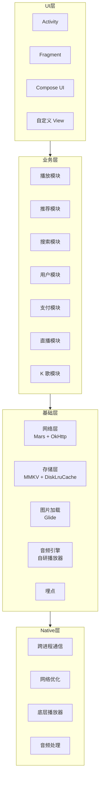
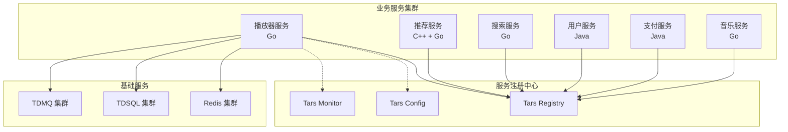
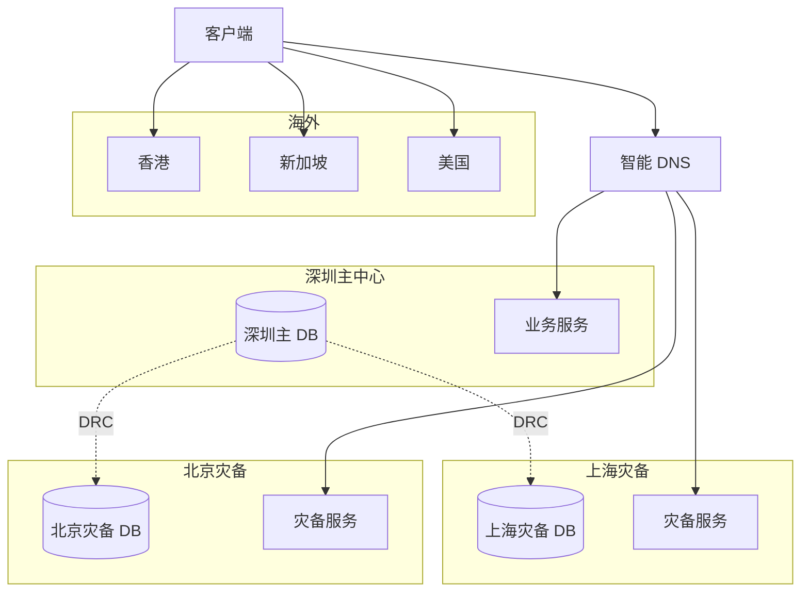
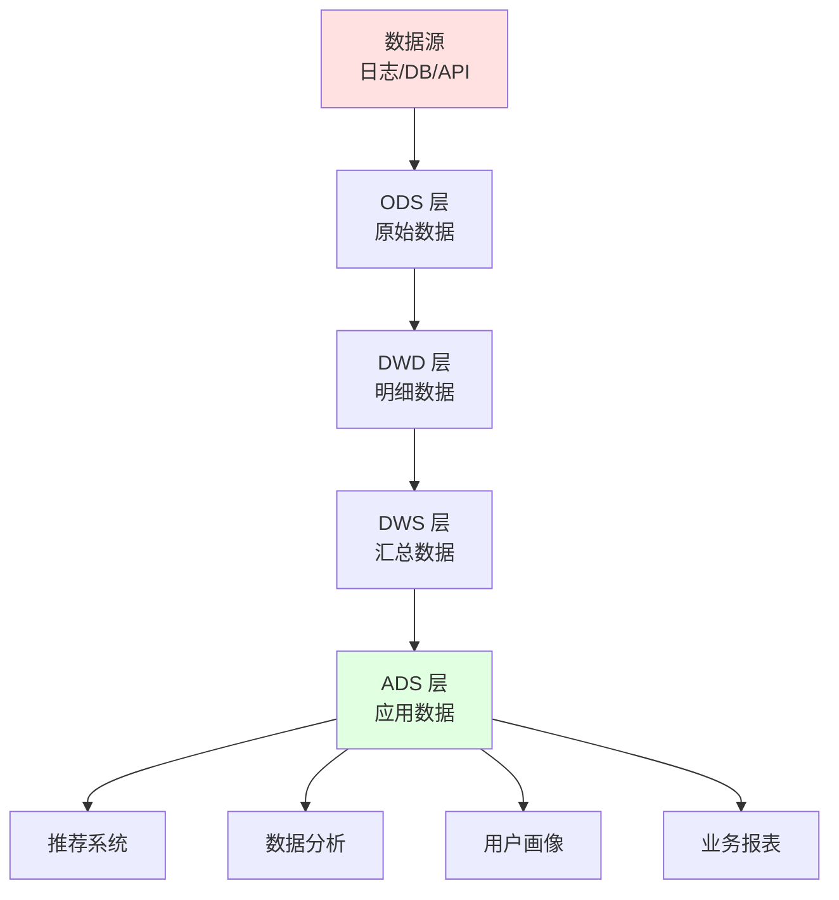

# 01 QQ 音乐整体架构与 TME 技术栈

## 1.1 TME 业务全景

腾讯音乐娱乐集团 (Tencent Music Entertainment Group, NYSE: TME) 是中国最大的在线音乐娱乐平台，由 QQ 音乐、酷狗音乐、酷我音乐三大平台合并而成，并整合了全民K歌、LOOK 直播等社交娱乐业务。截至 2024 年底，TME 总营收 574 亿 RMB，在线音乐付费用户 1.13 亿，是中国音乐流媒体市场的绝对领导者。

### 1.1.1 TME 业务演进

```
┌────────────────────────────────────────────────────────┐
│                   TME 业务演进                          │
├────────────────────────────────────────────────────────┤
│                                                        │
│  2003-2015: QQ 音乐独立运营                              │
│  ├── 绿钻会员起家                                      │
│  ├── 数字专辑首发（周杰伦等）                          │
│  └── 与三大唱片公司达成版权合作                         │
│                                                        │
│  2016: 中国音乐集团 (CMC) 成立                           │
│  ├── 整合 QQ 音乐 + 酷狗 + 酷我                         │
│  └── 合并海洋音乐集团 (酷狗 + 酷我)                      │
│                                                        │
│  2018: TME 在纽交所上市                                │
│  ├── 股票代码：TME                                     │
│  ├── IPO 融资 12 亿美元                                 │
│  └── 估值 213 亿美元                                   │
│                                                        │
│  2019-2022: 社交娱乐爆发                                │
│  ├── 全民K歌上市                                       │
│  ├── LOOK 直播崛起                                     │
│  ├── 长音频布局（播客、有声书）                         │
│  └── 反垄断后独家版权时代结束                           │
│                                                        │
│  2023-2025: AI + 全球化                                │
│  ├── AI 翻唱（基于 AI 合成）                           │
│  ├── AI 作曲（昆仑万维）                               │
│  ├── 空间音频普及                                       │
│  ├── Hi-Res 无损音质                                   │
│  └── 国际化布局（Joox 东南亚）                         │
│                                                        │
└────────────────────────────────────────────────────────┘
```

### 1.1.2 四大产品矩阵

TME 旗下四大产品各有定位和差异化：

| 产品 | 月活 | 用户画像 | 核心功能 |
|------|------|---------|---------|
| QQ 音乐 | 2.5 亿+ | 都市白领、学生 | 高品质音乐、数字专辑首发 |
| 酷狗音乐 | 3.0 亿+ | 县城、年轻人 | 直播打赏、长音频、K 歌 |
| 酷我音乐 | 1.5 亿+ | 车载、智能硬件 | 高品质、车载集成 |
| 全民K歌 | 2.0 亿+ | K 歌爱好者 | 录歌、合唱、家族 |

### 1.1.3 TME 整体架构

```mermaid
graph TB
    subgraph App端
        QQ[QQ 音乐 App]
        KG[酷狗 App]
        KW[酷我 App]
        K歌[全民K歌 App]
        Web[Web 端]
        PC[PC 客户端]
    end
    
    subgraph 接入层
        Gateway[TME 自研网关<br/>基于 Nginx + Lua]
        CDN[TME CDN<br/>全球加速]
    end
    
    subgraph 业务中台
        MusicSvc[音乐服务]
        UserSvc[用户中心]
        PaySvc[支付中心]
        SearchSvc[搜索服务]
        RecommendSvc[推荐服务]
        LiveSvc[直播服务]
        K歌Svc[K 歌服务]
        AudioSvc[音频处理服务]
    end
    
    subgraph 数据中台
        DataLake[TME 数据湖]
        FeatureStore[特征平台]
        UserPortrait[用户画像]
        MusicTag[音乐标签]
    end
    
    subgraph AI 中台
        MLPlatform[ML 平台]
        ACR[听歌识曲]
        TTS[语音合成]
        ASR[语音识别]
    end
    
    subgraph 基础服务
        Storage[对象存储<br/>COS]
        KV[(Redis/KV)]
        DB[(MySQL/TDSQL)]
        MQ[TDMQ/Kafka]
        ES[ES 集群]
    end
    
    App端 --> Gateway
    App端 --> CDN
    Gateway --> 业务中台
    业务中台 --> 数据中台
    业务中台 --> AI 中台
    业务中台 --> 基础服务
```

## 1.2 技术栈全景

QQ 音乐 / TME 技术栈整体基于腾讯生态，与微信、QQ 同源但有自己的独特优化。

### 1.2.1 后端服务

| 层级 | 技术选型 | 用途 |
|------|---------|------|
| Web 网关 | Nginx + OpenResty + 自研 TGW | 流量网关、限流、防盗链 |
| RPC 框架 | Tars (腾讯开源) + gRPC + 自研 | 服务间通信 |
| 微服务框架 | Tars + Spring Cloud (历史) + 自研 Polaris | 服务治理 |
| 服务网格 | Istio (灰度) + 自研 Mesh | 流量管理 |
| 业务语言 | C++ (历史) + Go (主) + Java (中台) + Python (算法) | 业务开发 |
| 异步消息 | TDMQ (基于 Pulsar) + Kafka + RocketMQ | 事件驱动、日志流 |
| 任务调度 | TCT (腾讯云) + 自研 Crane | 离线任务、定时任务 |
| 配置中心 | Apollo + 自研 Polaris | 配置管理 |
| API 网关 | 自研基于 TGW | API 管理 |

### 1.2.2 数据与存储

| 类别 | 技术 | 用途 |
|------|------|------|
| 关系数据库 | MySQL 8.0 + TDSQL (腾讯分布式 MySQL) | 业务主库 |
| 缓存 | Redis 7 + 自研 QKV (基于 RocksDB) | 热点缓存、计数器 |
| 搜索引擎 | ElasticSearch 8 (音乐搜索) + 自研 Muse | 全文检索 |
| 文档数据库 | MongoDB + 自研 TxStore | 半结构化存储 |
| 时序数据库 | Druid + ClickHouse + InfluxDB | 监控、APM |
| 图数据库 | NebulaGraph + 自研关系链 | 社交关系 |
| 数据仓库 | Hive + ClickHouse + StarRocks + Tencent DLC | 离线/实时数仓 |
| 数据湖 | Iceberg + 对象存储 COS | 原始日志、画像 |
| 对象存储 | 腾讯云 COS | 音频、图片、备份 |

### 1.2.3 音视频与流媒体

| 类别 | 技术 | 用途 |
|------|------|------|
| 音频编码 | FFmpeg + 自研 TFAudio + AAC/Opus/MP3/Hi-Res | 音频编解码 |
| 视频编码 | FFmpeg + H.264/H.265 | 视频编码（MV、直播） |
| 流媒体协议 | HLS + DASH + RTMP + WebRTC | 流媒体传输 |
| 直播 | 自研直播 SDK + SRS (基于开源) + 七牛/腾讯云直播 | 直播服务 |
| 实时音视频 | 腾讯 TRTC + Agora (部分) | 实时合唱、K 歌 |
| 播放器 | 自研 QQ 音乐播放器 + ExoPlayer (Android) + AVPlayer (iOS) | 客户端播放 |
| 音频处理 | WebRTC APM + 自研降噪 + 空间音频 | 实时音频处理 |

### 1.2.4 算法与 AI

| 类别 | 技术 | 用途 |
|------|------|------|
| 训练框架 | TensorFlow + PyTorch + 腾讯 Angel | 模型训练 |
| 特征平台 | 自研 FeatureStore (基于 HBase + Redis) | 特征存储 |
| 在线推理 | TensorFlow Serving + Triton + 自研 TFProxy | 模型部署 |
| 召回引擎 | Faiss + 自研 ANNS (向量检索) | 向量召回 |
| 排序框架 | DeepFM + DIN + 自研 RTA | 深度学习排序 |
| ASR | 自研 ASR (基于 Conformer) + 微信智聆 | 歌词识别、语音搜索 |
| TTS | 自研 TTS + 腾讯云 TTS | AI 翻唱、播报 |
| 听歌识曲 | 自研 ACRCloud-like + Shazam-like | 音频指纹 |
| 音频分离 | Spleeter (开源) + 自研 | 人声/伴奏分离 |
| 音乐理解 | MusicBERT + 自研 | 音乐情感、风格、节奏 |

### 1.2.5 移动端

| 平台 | 技术 | 亮点 |
|------|------|------|
| Android | Kotlin + Java + 自研 MMKV + 自研播放器 | 包大小优化、启动速度 |
| iOS | Swift + Objective-C + 自研播放器 | 音频处理、空间音频 |
| 跨端 | Flutter (部分) + H5 + 自研 Hippy | 直播、运营活动 |
| 音频播放 | ExoPlayer + 自研 QQ 音频播放器 | 高品质、低延迟 |
| 视频播放 | 自研 + ExoPlayer + AVPlayer | MV、直播 |

## 1.3 服务架构详解

### 1.3.1 音乐核心服务

```mermaid
graph TB
    Client[客户端]
    
    Client --> PlayerSvc[播放器服务]
    Client --> SearchSvc[搜索服务]
    Client --> RecommendSvc[推荐服务]
    Client --> UserSvc[用户服务]
    Client --> PaySvc[支付服务]
    Client --> DownloadSvc[下载服务]
    Client --> LiveSvc[直播服务]
    
    PlayerSvc --> MusicLib[音乐库]
    PlayerSvc --> AudioEngine[音频引擎]
    PlayerSvc --> LyricSvc[歌词服务]
    PlayerSvc --> ProgressSvc[进度上报]
    
    SearchSvc --> MusicIndex[音乐索引]
    SearchSvc --> HotSearch[热搜]
    SearchSvc --> Suggest[搜索建议]
    
    RecommendSvc --> RecallEngine[召回引擎]
    RecommendSvc --> RankEngine[排序引擎]
    RecommendSvc --> DailyRec[每日推荐]
    RecommendSvc --> RadioSvc[电台服务]
    
    UserSvc --> UserCenter[用户中心]
    UserSvc --> SubSvc[会员订阅]
    UserSvc --> FavSvc[收藏服务]
    
    PaySvc --> OrderSvc[订单服务]
    PaySvc --> PayChannel[支付渠道]
    PaySvc --> AlbumSvc[数字专辑]
    
    LiveSvc --> LiveRoom[直播间]
    LiveSvc --> GiftSvc[礼物服务]
    LiveSvc --> LiveRecommend[直播推荐]
    
    style PlayerSvc fill:#ffe1e1
    style RecommendSvc fill:#e1ffe1
    style PaySvc fill:#e1e1ff
```



### 1.3.2 音乐库设计

QQ 音乐 / TME 维护着 2 亿+ 首歌的音乐库，是国内最大的中文音乐库之一。

```sql
-- 歌曲主表
CREATE TABLE song (
    song_id BIGINT UNSIGNED PRIMARY KEY,
    song_mid VARCHAR(32),                 -- QQ 音乐内部 ID
    title VARCHAR(255),
    subtitle VARCHAR(255),                -- 副标题（如：电影《XXX》主题曲）
    duration INT,                          -- 时长（秒）
    
    -- 艺人
    singer_id INT,                         -- 主艺人
    singer_ids JSON,                       -- 多艺人
    
    -- 专辑
    album_id INT,
    
    -- 发行
    release_date DATE,
    publisher VARCHAR(128),
    
    -- 标签
    genre_l1 VARCHAR(32),                 -- 大类：流行/摇滚/电子等
    genre_l2 VARCHAR(32),                 -- 细分
    language VARCHAR(16),                 -- 中文/英文/日韩/纯音乐
    region VARCHAR(16),                   -- 中国大陆/港台/欧美/日韩
    
    -- 文件
    file_path VARCHAR(512),
    file_size BIGINT,
    bitrate INT,
    sample_rate INT,
    format VARCHAR(16),                   -- mp3/aac/flac/opus
    channels TINYINT,                     -- 1: 单声道 2: 立体声
    
    -- 版权
    copyright_owner VARCHAR(128),          -- 版权方
    license_type TINYINT,                 -- 1: 独家 2: 非独家 3: 自有
    license_expiry DATE,
    
    -- 统计
    play_count BIGINT DEFAULT 0,
    like_count BIGINT DEFAULT 0,
    share_count BIGINT DEFAULT 0,
    download_count BIGINT DEFAULT 0,
    
    -- 状态
    status TINYINT DEFAULT 1,             -- 1: 正常 2: 下架 3: 版权过期
    
    -- 时间
    created_at TIMESTAMP,
    updated_at TIMESTAMP,
    
    KEY idx_album (album_id),
    KEY idx_singer (singer_id),
    KEY idx_release (release_date),
    KEY idx_genre_region (genre_l1, region)
) ENGINE=InnoDB;

-- 歌手表
CREATE TABLE singer (
    singer_id BIGINT UNSIGNED PRIMARY KEY,
    singer_mid VARCHAR(32),
    name VARCHAR(128),
    english_name VARCHAR(128),
    avatar VARCHAR(512),
    
    -- 信息
    region VARCHAR(32),
    gender TINYINT,
    birth_date DATE,
    constellation VARCHAR(16),
    intro TEXT,
    
    -- 标签
    genres JSON,                          -- 擅长的曲风
    tags JSON,                            -- 用户标签
    
    -- 统计
    fan_count BIGINT DEFAULT 0,
    song_count INT,
    album_count INT,
    
    KEY idx_region (region)
) ENGINE=InnoDB;

-- 专辑表
CREATE TABLE album (
    album_id BIGINT UNSIGNED PRIMARY KEY,
    album_mid VARCHAR(32),
    title VARCHAR(255),
    singer_id INT,
    cover VARCHAR(512),
    
    -- 发行
    release_date DATE,
    publisher VARCHAR(128),
    
    -- 类型
    album_type TINYINT,                   -- 1: 单曲 2: EP 3: 专辑 4: 合辑 5: Live
    
    -- 简介
    intro TEXT,
    
    -- 统计
    song_count INT,
    play_count BIGINT DEFAULT 0,
    sell_count BIGINT DEFAULT 0,
    price DECIMAL(10, 2),
    
    KEY idx_singer (singer_id),
    KEY idx_release (release_date)
) ENGINE=InnoDB;

-- 多音质文件
CREATE TABLE song_file (
    file_id BIGINT UNSIGNED PRIMARY KEY,
    song_id BIGINT UNSIGNED NOT NULL,
    quality TINYINT,                      -- 1: 标准 2: 高品 3: 无损 4: Hi-Res
    
    -- 文件信息
    file_path VARCHAR(512),
    file_size BIGINT,
    bitrate INT,
    sample_rate INT,
    format VARCHAR(16),
    channels TINYINT,
    
    -- 加密
    encrypted BOOLEAN DEFAULT FALSE,
    
    KEY idx_song_quality (song_id, quality)
) ENGINE=InnoDB;
```

### 1.3.3 曲库索引

QQ 音乐的曲库索引基于自研 Muse（基于 ES 改造）：

```python
class MusicIndexService:
    """音乐索引服务"""
    
    def build_index_mapping(self):
        """构建索引 mapping"""
        return {
            'settings': {
                'number_of_shards': 20,
                'number_of_replicas': 3,
                'analysis': {
                    'analyzer': {
                        'music_analyzer': {
                            'type': 'custom',
                            'tokenizer': 'ik_max_word',
                            'filter': [
                                'lowercase',
                                'pinyin_filter',      # 拼音搜索
                                'english_filter',
                                'synonym_filter'       # 同义词
                            ]
                        }
                    }
                }
            },
            'mappings': {
                'properties': {
                    'song_id': {'type': 'long'},
                    'title': {
                        'type': 'text',
                        'analyzer': 'music_analyzer',
                        'fields': {
                            'pinyin': {
                                'type': 'text',
                                'analyzer': 'pinyin_analyzer'
                            },
                            'keyword': {'type': 'keyword'}
                        }
                    },
                    'subtitle': {'type': 'text'},
                    'singer_names': {'type': 'keyword'},
                    'singer_ids': {'type': 'long'},
                    'album_title': {
                        'type': 'text',
                        'fields': {'keyword': {'type': 'keyword'}}
                    },
                    'lyrics_text': {
                        'type': 'text',
                        'analyzer': 'music_analyzer'
                    },
                    'genre_l1': {'type': 'keyword'},
                    'genre_l2': {'type': 'keyword'},
                    'language': {'type': 'keyword'},
                    'region': {'type': 'keyword'},
                    'duration': {'type': 'integer'},
                    'release_date': {'type': 'date'},
                    'play_count': {'type': 'long'},
                    'hot_score': {'type': 'float'},  # 综合热度分
                    'tags': {'type': 'keyword'},
                    'embedding': {
                        'type': 'dense_vector',
                        'dims': 256
                    }
                }
            }
        }
    
    def search(self, query, filters=None, limit=20):
        """音乐搜索"""
        body = {
            'query': {
                'function_score': {
                    'query': {
                        'bool': {
                            'must': [
                                {
                                    'multi_match': {
                                        'query': query,
                                        'fields': [
                                            'title^5',
                                            'title.pinyin^3',
                                            'subtitle^2',
                                            'singer_names^4',
                                            'singer_names.pinyin^2',
                                            'album_title^3',
                                            'lyrics_text^1'
                                        ],
                                        'type': 'best_fields',
                                        'fuzziness': 'AUTO'
                                    }
                                }
                            ],
                            'filter': filters or []
                        }
                    },
                    'functions': [
                        {
                            'field_value_factor': {
                                'field': 'play_count',
                                'factor': 0.0001,
                                'modifier': 'log1p',
                                'missing': 0
                            }
                        }
                    ]
                }
            },
            'size': limit
        }
        
        return self.es_client.search(index='music_v5', body=body)
    
    def suggest(self, prefix):
        """搜索建议（自动补全）"""
        body = {
            'suggest': {
                'song_suggest': {
                    'prefix': prefix,
                    'completion': {
                        'field': 'title_suggest',
                        'size': 10,
                        'skip_duplicates': True
                    }
                },
                'singer_suggest': {
                    'prefix': prefix,
                    'completion': {
                        'field': 'singer_suggest',
                        'size': 10
                    }
                }
            }
        }
        
        return self.es_client.search(index='music_v5', body=body)
```

## 1.4 客户端架构

### 1.4.1 移动端分层



### 1.4.2 音频播放器

QQ 音乐自研音频播放器是核心技术资产，针对音乐播放场景做了深度优化：

```cpp
// QQ 音乐播放器核心 (简化伪代码)
class QQMusicPlayer {
public:
    // 1. 播放控制
    void play(const std::string& songId);
    void pause();
    void stop();
    void seek(int position_ms);
    
    // 2. 音质切换
    void switchQuality(Quality quality);  // 标准/高品/无损/Hi-Res
    
    // 3. 音效
    void setEqualizer(const EqualizerSettings& eq);
    void setSpatialAudio(bool enabled);    // 空间音频
    void setDolbyAtmos(bool enabled);      // Dolby Atmos
    
    // 4. 缓冲管理
    void setBufferStrategy(BufferStrategy strategy);  // 流畅优先/省流优先
    
private:
    // 1. 解码器（多格式）
    Decoder* decoder_;  // FFmpeg + 自研解码器
    
    // 2. 音频后处理
    AudioEffectChain effect_chain_;
    
    // 3. 缓冲队列
    BufferQueue buffer_queue_;
    
    // 4. 输出设备
    AudioOutput audio_output_;
};

// 播放器状态机
enum PlayerState {
    IDLE,
    INITIALIZED,
    PREPARING,
    PLAYING,
    PAUSED,
    STOPPED,
    ERROR
};

// 缓冲策略
class BufferStrategy {
public:
    virtual int getMinBufferSize() = 0;
    virtual int getMaxBufferSize() = 0;
    virtual int getPrefetchSize() = 0;
};

class SmoothStrategy : public BufferStrategy {
    // 流畅优先：高缓冲
    int getMinBufferSize() override { return 256 * 1024; }   // 256KB
    int getMaxBufferSize() override { return 4 * 1024 * 1024; } // 4MB
    int getPrefetchSize() override { return 1024 * 1024; }   // 1MB
};

class EconomyStrategy : public BufferStrategy {
    // 省流优先：低缓冲
    int getMinBufferSize() override { return 64 * 1024; }     // 64KB
    int getMaxBufferSize() override { return 512 * 1024; }    // 512KB
    int getPrefetchSize() override { return 256 * 1024; }    // 256KB
};
```

### 1.4.3 启动速度优化

QQ 音乐 App 启动时间从 4s 优化到 0.8s（业界领先），主要手段：

```java
// Android 启动优化（基于内部公开演讲整理）
public class StartupOptimizer {
    
    // 1. 启动任务分级
    public enum TaskPriority {
        CRITICAL,    // 必须主线程：UI 初始化
        HIGH,        // 异步并行：网络初始化
        NORMAL,      // 异步延迟：推荐加载
        LOW,         // 异步延迟：统计初始化
        IDLE         // 空闲时执行
    }
    
    // 2. 启动任务编排
    public void startupTasks() {
        // 主线程（Critical）
        runOnMainThread(() -> {
            initUI();
            renderSplash();
        });
        
        // 并行异步
        executor.execute(() -> initAudioEngine());
        executor.execute(() -> initNetworkStack());
        executor.execute(() -> initUserCenter());
        
        // 延迟初始化
        mainHandler.postDelayed(() -> initRecommendModule(), 500);
        mainHandler.postDelayed(() -> initLiveModule(), 1000);
    }
    
    // 3. 类加载优化（按需加载）
    public void optimizeClassLoading() {
        // 懒加载非启动必需类
        // 使用 R8/ProGuard 优化
    }
    
    // 4. 资源优化
    public void optimizeResources() {
        // AAB 资源分包
        // 启动 Activity 不加载非必需资源
        // 图片懒加载
    }
}
```

## 1.5 后端服务架构

### 1.5.1 微服务治理

QQ 音乐 / TME 使用 Tars (腾讯开源 RPC 框架) 作为微服务底座：



### 1.5.2 流量调度

```python
# 流量调度配置（简化）
class TrafficScheduling:
    """流量调度策略"""
    
    def schedule_request(self, user_id, request):
        """根据用户位置、设备、网络情况调度"""
        
        # 1. 地理位置调度
        location = self.get_user_location(user_id)
        if location.country == 'CN':
            return self.route_to_china_cluster(request)
        else:
            return self.route_to_overseas_cluster(request)
        
        # 2. 网络情况调度
        network_type = self.get_user_network(user_id)
        if network_type == '5G' or network_type == 'WiFi':
            return self.allow_high_quality_stream(request)
        else:
            return self.downgrade_to_low_quality(request)
        
        # 3. 设备能力调度
        device = self.get_user_device(user_id)
        if device.supports_dolby_atmos:
            return self.enable_spatial_audio(request)
        else:
            return self.use_stereo_audio(request)
```

## 1.6 高可用与容灾

### 1.6.1 多活架构



### 1.6.2 限流降级

```java
// 自研限流器（基于令牌桶 + 滑动窗口）
public class RateLimiter {
    
    // 1. 令牌桶限流（全局）
    private final TokenBucket globalBucket = new TokenBucket(
        capacity = 100000,
        refillRate = 100000 / 60  // 每分钟 10 万
    );
    
    // 2. 用户级限流
    private final LoadingCache<Long, TokenBucket> userBuckets = Caffeine.newBuilder()
        .maximumSize(1_000_000)
        .expireAfterAccess(Duration.ofMinutes(10))
        .build(this::createUserBucket);
    
    // 3. 接口级限流
    private final ConcurrentHashMap<String, SlidingWindowCounter> apiCounters = new ConcurrentHashMap<>();
    
    public boolean allowRequest(Long userId, String api) {
        // 全局限流
        if (!globalBucket.tryAcquire()) {
            return false;
        }
        
        // 用户级限流
        TokenBucket userBucket = userBuckets.get(userId);
        if (!userBucket.tryAcquire()) {
            return false;
        }
        
        // 接口级限流
        SlidingWindowCounter counter = apiCounters.computeIfAbsent(
            api, k -> new SlidingWindowCounter(60_000, 10000)
        );
        if (!counter.allow()) {
            return false;
        }
        
        return true;
    }
}

// 降级开关
public class DegradationService {
    
    public Response handleRequest(Request request) {
        // 1. 熔断判断
        if (isCircuitBreakerOpen(request.service)) {
            return getFallbackResponse(request);
        }
        
        // 2. 降级开关
        if (isDegradationEnabled(request.service, request.feature)) {
            return getDegradationResponse(request);
        }
        
        // 3. 正常处理
        return normalProcess(request);
    }
    
    private boolean isDegradationEnabled(String service, String feature) {
        // 检查动态配置
        return configService.getBoolean(
            "degradation." + service + "." + feature,
            false
        );
    }
}
```

### 1.6.3 故障演练

QQ 音乐定期进行故障演练，包括：

- **机房断电演练**：模拟主中心宕机
- **网络抖动演练**：模拟网络分区
- **数据库故障演练**：模拟 DB 主从切换
- **缓存击穿演练**：模拟 Redis 集群宕机
- **依赖服务故障演练**：模拟下游服务不可用

## 1.7 监控与可观测性

### 1.7.1 监控指标

QQ 音乐的关键业务指标监控：

```python
# 业务指标（实时）
business_metrics = {
    # 用户指标
    'dau': '日活用户',
    'mau': '月活用户',
    'paid_users': '付费用户数',
    'new_registers': '新增注册',
    
    # 播放指标
    'play_count': '总播放次数',
    'play_duration_total': '总播放时长',
    'avg_session_duration': '人均听歌时长',
    'avg_daily_songs': '人均日听歌数',
    
    # 内容指标
    'song_count': '曲库歌曲数',
    'album_count': '专辑数',
    'new_releases': '新发歌曲数',
    
    # 商业指标
    'revenue': '总收入',
    'subscription_revenue': '订阅收入',
    'digital_album_revenue': '数字专辑收入',
    'live_gift_revenue': '直播打赏收入',
    'ad_revenue': '广告收入',
    
    # 推荐指标
    'ctr': '点击率',
    'conversion_rate': '转化率',
    'completion_rate': '完播率',
    'radio_avg_duration': '电台人均时长',
}

# 技术指标
tech_metrics = {
    # API 性能
    'api_qps': 'API QPS',
    'api_p99': 'P99 响应时间',
    'api_error_rate': 'API 错误率',
    
    # 播放器性能
    'play_success_rate': '播放成功率',
    'buffer_underrun_rate': '缓冲卡顿率',
    'first_frame_time': '首帧时间',
    
    # 资源使用
    'cpu_usage': 'CPU 使用率',
    'memory_usage': '内存使用率',
    'bandwidth': '带宽使用',
}
```

### 1.7.2 链路追踪

基于 OpenTelemetry 的全链路追踪：

```python
# 追踪示例
from opentelemetry import trace

tracer = trace.get_tracer('qqmusic.api')

@tracer.start_as_current_span('get_recommend')
def get_recommend(user_id, context):
    span = trace.get_current_span()
    span.set_attribute('user_id', user_id)
    
    # 多路召回
    with tracer.start_as_current_span('multi_recall'):
        candidates = []
        with tracer.start_as_current_span('interest_recall'):
            candidates.extend(interest_recall.recall(user_id))
        with tracer.start_as_current_span('vector_recall'):
            candidates.extend(vector_recall.recall(user_id))
        with tracer.start_as_current_span('collab_recall'):
            candidates.extend(collab_recall.recall(user_id))
    
    # 排序
    with tracer.start_as_current_span('rank'):
        ranked = rank_service.rank(candidates, user_id)
    
    return ranked
```

## 1.8 数据中台

### 1.8.1 数据仓库分层



### 1.8.2 用户画像

```python
class UserPortrait:
    """QQ 音乐用户画像"""
    
    def build_portrait(self, user_id):
        """构建用户画像"""
        return {
            # 人口属性
            'demographics': {
                'age_bucket': '20-25',
                'gender': 'female',
                'city_tier': 'tier_1',
                'device_type': 'iOS',
            },
            
            # 音乐偏好
            'music_preferences': {
                # 一级类目偏好
                'genre_l1': {
                    'pop': 0.78,
                    'rock': 0.32,
                    'electronic': 0.45,
                    'folk': 0.21,
                    'rap': 0.65,
                },
                
                # 语种偏好
                'language': {
                    'chinese_mandarin': 0.85,
                    'chinese_cantonese': 0.12,
                    'english': 0.45,
                    'japanese': 0.32,
                    'korean': 0.28,
                },
                
                # 地区偏好
                'region': {
                    'mainland': 0.88,
                    'hongkong_taiwan': 0.15,
                    'western': 0.42,
                    'japan': 0.31,
                    'korea': 0.27,
                },
                
                # 年代偏好
                'decade': {
                    '2000s': 0.45,
                    '2010s': 0.78,
                    '2020s': 0.92,
                },
                
                # 情绪偏好
                'mood': {
                    'happy': 0.62,
                    'sad': 0.45,
                    'energetic': 0.55,
                    'calm': 0.48,
                    'romantic': 0.52,
                },
                
                # 场景偏好
                'scene': {
                    'work': 0.78,
                    'study': 0.65,
                    'commute': 0.85,
                    'workout': 0.45,
                    'sleep': 0.55,
                },
            },
            
            # 听歌行为
            'listening_behavior': {
                'daily_songs_avg': 28,
                'daily_duration_minutes': 142,
                'avg_session_count': 4,
                'avg_session_duration': 35,
                'peak_listening_hour': 21,  # 晚上 9 点
                'active_days_7d': 6,
                'skip_rate': 0.18,
                'complete_rate': 0.62,
                'replay_rate': 0.15,
            },
            
            # 互动行为
            'engagement': {
                'like_count_7d': 42,
                'collect_count_7d': 28,
                'comment_count_7d': 5,
                'share_count_7d': 3,
                'download_count_7d': 2,
            },
            
            # 商业行为
            'commercial': {
                'is_paid': True,
                'subscription_type': 'green_diamond',  # 绿钻
                'subscription_duration_days': 365,
                'ltv': 158,  # 终身价值
                'digital_album_purchases': 12,
                'gift_spend_30d': 50,
                'price_sensitivity': 'medium',
            },
            
            # 关注歌手
            'favorite_artists': [
                {'artist_id': 101, 'name': '周杰伦', 'affinity': 0.95},
                {'artist_id': 102, 'name': '陈奕迅', 'affinity': 0.88},
                {'artist_id': 103, 'name': 'Taylor Swift', 'affinity': 0.82},
            ],
            
            # 收听设备
            'devices': {
                'mobile': 0.85,
                'pc': 0.25,
                'car_audio': 0.15,
                'smart_speaker': 0.10,
                'headphones_quality': 'high_end',
            },
        }
```

## 1.9 团队与工程文化

### 1.9.1 组织架构

```
┌─────────────────────────────────────────┐
│          TME 技术委员会                   │
├──────────┬───────────┬──────────────────┤
│ 基础架构 │ 业务中台  │ 应用工程         │
├──────────┼───────────┼──────────────────┤
│ 存储     │ 音乐服务  │ QQ 音乐业务部    │
│ 计算     │ 用户中心  │ 酷狗业务部       │
│ 网络     │ 推荐中台  │ 酷我业务部       │
│ SRE      │ 商业化    │ 全民 K 歌业务部   │
│ 安全     │ 数据中台  │ LOOK 直播业务部   │
└──────────┴───────────┴──────────────────┘
```

### 1.9.2 工程文化

- **代码审查**：所有 PR 必须经过 2 人 Review
- **持续部署**：每天 300+ 次发布
- **故障复盘**：所有线上故障 24 小时内复盘
- **A/B 测试**：所有重大变更必须经过 A/B 测试
- **技术分享**：每周技术沙龙、每月技术大会

### 1.9.3 招聘技术栈倾向

| 岗位 | 技术栈 |
|------|--------|
| 后端开发 | Go、Java、C++、MySQL、Redis、Kafka |
| 客户端 | Kotlin、Swift、C++、音频处理、性能优化 |
| 算法 | Python、TensorFlow、PyTorch、音频信号处理 |
| SRE | Kubernetes、Istio、Prometheus |

## 1.10 小结

QQ 音乐 / TME 的整体架构体现了"音乐流媒体 + 社交娱乐"的复杂业务形态：

1. **四大产品矩阵**：QQ 音乐 + 酷狗 + 酷我 + 全民K歌
2. **2 亿+ 曲库**：国内最大的中文音乐库
3. **高品质音频**：Hi-Res、无损、Dolby Atmos、空间音频
4. **完整商业化**：绿钻 + 数字专辑 + 直播打赏 + 广告
5. **腾讯生态协同**：微信、QQ、腾讯视频无缝连接
6. **AI 全方位应用**：听歌识曲、AI 翻唱、空间音频、AI 作曲

对自身业务的启示：

- **AI 直播平台**：实时音频处理、降噪、空间音频
- **TikTok Shop 音乐**：音乐 + 商品的"听歌购"模式
- **跨境流媒体**：本地化音乐推荐 + 多语言 NLP