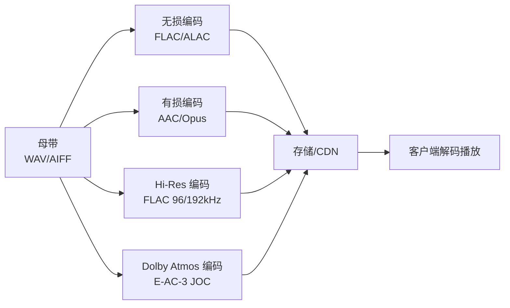
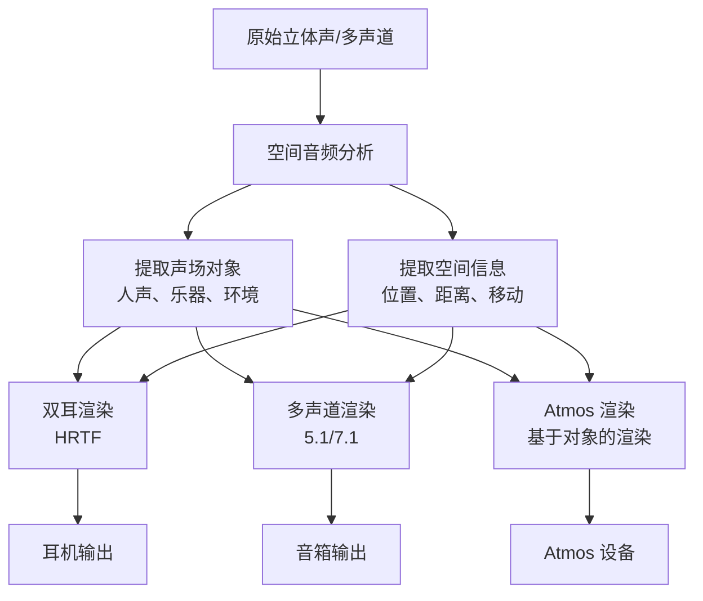
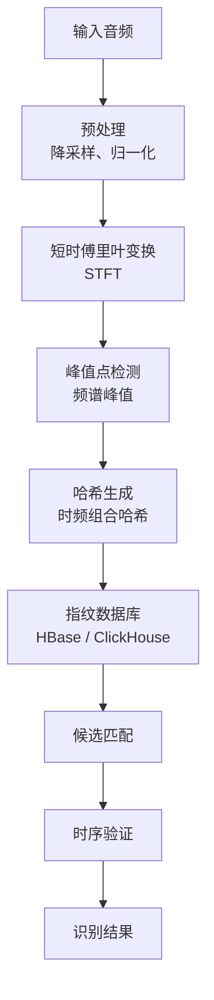
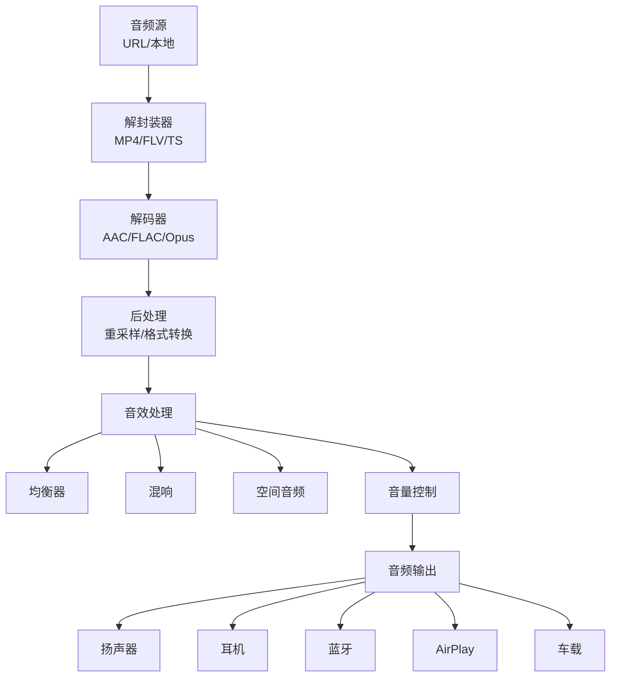
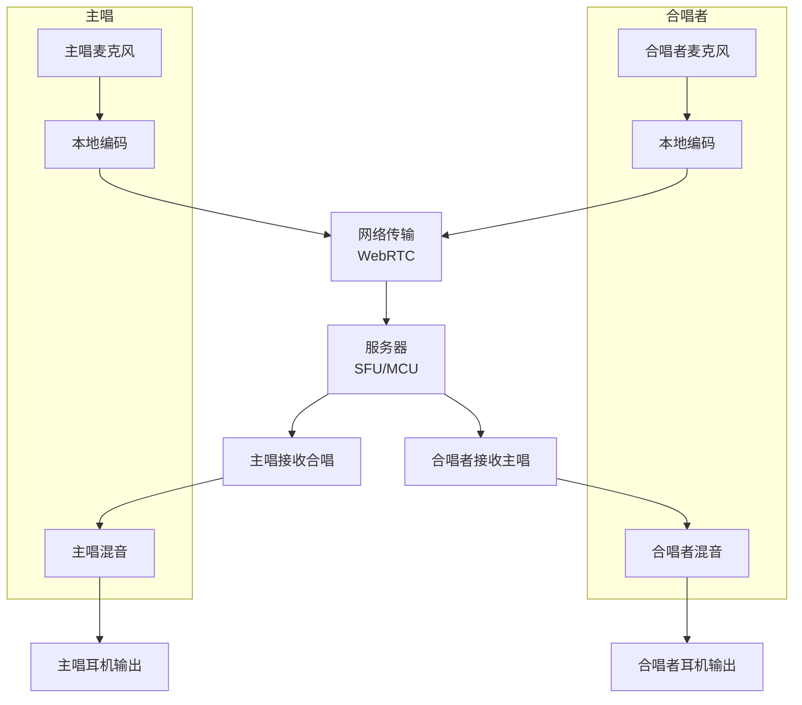

# 02 QQ 音乐音频处理与编码

## 2.1 音频技术全景

音频处理是 QQ 音乐 / TME 最核心的技术资产，覆盖了从内容生产、编码、传输、播放、效果处理的完整链路。作为国内音频技术的领头羊，QQ 音乐在编解码、空间音频、降噪、版权保护等领域积累了深厚经验。

### 2.1.1 音频技术栈分层

```
┌────────────────────────────────────────────────────────┐
│                  QQ 音乐音频技术栈                        │
├────────────────────────────────────────────────────────┤
│                                                        │
│  应用层                                                 │
│  ├── 音乐播放                                          │
│  ├── 直播连麦                                          │
│  ├── K 歌录音                                          │
│  ├── 听歌识曲                                          │
│  └── AI 翻唱/作曲                                      │
│                                                        │
│  效果层                                                 │
│  ├── 音效（均衡器、混响）                              │
│  ├── 空间音频（Dolby Atmos、5.1/7.1）                  │
│  ├── 降噪 / 回声消除                                   │
│  ├── 人声美化                                          │
│  └── AI 修复老歌                                       │
│                                                        │
│  解码层                                                 │
│  ├── MP3 / AAC / Opus                                  │
│  ├── FLAC / ALAC / APE（无损）                         │
│  ├── Hi-Res（DXD / DSD）                               │
│  └── Dolby Atmos（E-AC-3 JOC / DD+ JOC）              │
│                                                        │
│  传输层                                                 │
│  ├── HLS / DASH（流媒体切片）                          │
│  ├── QUIC（低延迟）                                    │
│  ├── P2P（用户分享）                                   │
│  └── 防盗链 / 加密                                     │
│                                                        │
│  编码层                                                 │
│  ├── 离线转码（FFmpeg + 自研 TFAudio）                 │
│  ├── 实时编码（直播）                                  │
│  ├── AI 编码（基于内容的感知编码）                      │
│  └── 内容指纹 / 加密水印                               │
│                                                        │
│  采集层                                                 │
│  ├── 麦克风阵列                                        │
│  ├── 噪声采集                                          │
│  └── 设备适配                                          │
│                                                        │
└────────────────────────────────────────────────────────┘
```

## 2.2 音频编解码

### 2.2.1 多音质体系

QQ 音乐 / TME 提供了业内最丰富的音质选项，覆盖从流量友好到极高品质：

| 音质 | 编码格式 | 比特率 | 采样率 | 文件大小（3 分钟） | 适用场景 |
|------|---------|--------|--------|-------------------|---------|
| 流畅 | AAC-LC | 96 kbps | 44.1 kHz | ~2 MB | 流量敏感、低端机 |
| 标准 | AAC-LC | 128 kbps | 44.1 kHz | ~3 MB | 默认音质 |
| 高品 | AAC-LC | 256 kbps | 44.1 kHz | ~6 MB | 主流推荐 |
| 无损 | FLAC | 800-1100 kbps | 44.1 kHz | ~20 MB | 音乐爱好者 |
| Hi-Res | FLAC | 2300-4600 kbps | 96/192 kHz | ~50 MB | 发烧友 |
| 杜比全景声 | E-AC-3 JOC | 768 kbps | 48 kHz | ~18 MB | 影视音乐 |

### 2.2.2 编码器架构



### 2.2.3 FFmpeg 改造的音频编码

QQ 音乐基于 FFmpeg 做深度改造，以适配音乐场景：

```cpp
// 基于 FFmpeg 的音频转码（简化示例）
class AudioTranscoder {
public:
    // 1. 初始化编码器
    AVCodecContext* initEncoder(
        int sample_rate,
        int channels,
        int bitrate,
        AudioCodec codec
    ) {
        AVCodec* encoder = nullptr;
        
        switch (codec) {
            case AudioCodec::AAC:
                encoder = avcodec_find_encoder(AV_CODEC_ID_AAC);
                break;
            case AudioCodec::OPUS:
                encoder = avcodec_find_encoder(AV_CODEC_ID_OPUS);
                break;
            case AudioCodec::FLAC:
                encoder = avcodec_find_encoder(AV_CODEC_ID_FLAC);
                break;
            case AudioCodec::MP3:
                encoder = avcodec_find_encoder(AV_CODEC_ID_MP3);
                break;
            case AudioCodec::EAC3:
                encoder = avcodec_find_encoder_by_name("eac3");  // Dolby
                break;
        }
        
        AVCodecContext* ctx = avcodec_alloc_context3(encoder);
        
        ctx->sample_rate = sample_rate;
        ctx->channels = channels;
        ctx->channel_layout = av_get_default_channel_layout(channels);
        ctx->bit_rate = bitrate;
        ctx->sample_fmt = encoder->sample_fmts[0];
        
        // 2. 自研优化：动态码率
        if (codec == AudioCodec::AAC) {
            // 自适应码率（基于内容复杂度）
            ctx->flags |= AV_CODEC_FLAG_QSCALE;
            ctx->global_quality = calculateAdaptiveQuality(sample_rate, bitrate);
        }
        
        // 3. 开启多线程
        ctx->thread_count = 4;
        
        // 4. 打开编码器
        avcodec_open2(ctx, encoder, nullptr);
        return ctx;
    }
    
    // 2. 转码流程
    void transcode(
        const std::string& input_path,
        const std::string& output_path,
        TranscodeConfig config
    ) {
        // 打开输入
        AVFormatContext* in_ctx = nullptr;
        avformat_open_input(&in_ctx, input_path.c_str(), nullptr, nullptr);
        
        // 创建输出
        AVFormatContext* out_ctx = nullptr;
        avformat_alloc_output_context2(&out_ctx, nullptr, "mp4", output_path.c_str());
        
        // 创建编码器
        AVCodecContext* enc_ctx = initEncoder(
            config.sample_rate,
            config.channels,
            config.bitrate,
            config.codec
        );
        
        // 转码循环
        AVPacket* pkt = av_packet_alloc();
        AVFrame* frame = av_frame_alloc();
        
        while (av_read_frame(in_ctx, pkt) >= 0) {
            // 解码
            avcodec_send_packet(dec_ctx, pkt);
            while (avcodec_receive_frame(dec_ctx, frame) == 0) {
                // 音频后处理（重采样、降噪等）
                processAudio(frame, config);
                
                // 编码
                avcodec_send_frame(enc_ctx, frame);
                while (avcodec_receive_packet(enc_ctx, pkt) == 0) {
                    // 写入输出
                    av_interleaved_write_frame(out_ctx, pkt);
                    av_packet_unref(pkt);
                }
            }
            av_packet_unref(pkt);
        }
        
        // 收尾
        flush_encoder(enc_ctx, out_ctx);
        
        // 释放
        av_packet_free(&pkt);
        av_frame_free(&frame);
        avcodec_free_context(&enc_ctx);
        avformat_close_input(&in_ctx);
        avio_closep(&out_ctx->pb);
        avformat_free_context(out_ctx);
    }
};
```

### 2.2.4 AI 编码优化

QQ 音乐基于 AI 做感知编码，在相同音质下进一步降低码率：

```python
class AIContentAwareEncoder:
    """AI 内容感知编码器"""
    
    def __init__(self):
        # 内容分析模型（识别音乐类型）
        self.content_classifier = ContentClassifier()
        
        # 编码参数优化模型
        self.param_optimizer = EncodingParamOptimizer()
    
    def encode_with_ai(self, audio_signal, target_bitrate):
        """基于内容的智能编码"""
        # 1. 内容分析
        content_info = self.content_classifier.analyze(audio_signal)
        # 返回：音乐类型、复杂度、动态范围等
        
        # 2. 内容类型决定编码策略
        if content_info.type == 'classical':
            # 古典乐：动态范围大，需要高码率
            target_bitrate = max(target_bitrate, 256)
            use_lossless_preprocess = True
        elif content_info.type == 'rock':
            # 摇滚：失真多，可以适当降低码率
            target_bitrate = min(target_bitrate, 192)
            use_loudness_normalize = True
        elif content_info.type == 'speech':
            # 语音：可以极低码率
            target_bitrate = 64
        
        # 3. 编码参数优化
        params = self.param_optimizer.predict(
            content_info=content_info,
            target_bitrate=target_bitrate
        )
        
        # 4. 应用编码
        encoded = self.apply_encoding(audio_signal, params)
        
        return encoded
```

## 2.3 空间音频与 Dolby Atmos

空间音频是 QQ 音乐 / TME 在 2022-2025 年的重要技术投入，覆盖耳机、音响、车载等场景。

### 2.3.1 空间音频技术



### 2.3.2 HRTF 双耳渲染

HRTF (Head-Related Transfer Function) 是模拟人耳空间感知的核心技术：

```python
import numpy as np

class HRTFBinauralRenderer:
    """HRTF 双耳渲染器"""
    
    def __init__(self, hrtf_database_path):
        # 加载 HRTF 数据库
        # 包含不同方位角、仰角的 HRTF 数据
        self.hrtf_db = load_hrtf_database(hrtf_database_path)
        # HRTF 数据库通常包含：
        # - 不同方位角（azimuth）：-180° 到 180°
        # - 不同仰角（elevation）：-90° 到 90°
        # - 每个位置的左耳和右耳 HRTF 脉冲响应
    
    def render_binaural(self, audio_sources, listener_orientation):
        """渲染空间音频
        
        Args:
            audio_sources: 多个音频源列表，每个包含 (audio, azimuth, elevation, distance)
            listener_orientation: 听者朝向
        """
        left_channel = np.zeros(len(audio_sources[0]['audio']))
        right_channel = np.zeros(len(audio_sources[0]['audio']))
        
        for source in audio_sources:
            # 1. 计算相对位置（考虑听者朝向）
            relative_azimuth = source['azimuth'] - listener_orientation['yaw']
            relative_elevation = source['elevation'] - listener_orientation['pitch']
            
            # 2. 在 HRTF 数据库中插值
            hrtf_left, hrtf_right = self.interpolate_hrtf(
                relative_azimuth,
                relative_elevation
            )
            
            # 3. 距离衰减
            attenuation = self.calculate_distance_attenuation(source['distance'])
            
            # 4. 应用 HRTF 滤波（卷积）
            source_audio = source['audio'] * attenuation
            left = np.convolve(source_audio, hrtf_left)
            right = np.convolve(source_audio, hrtf_right)
            
            # 5. 累加到输出
            left_channel += left[:len(left_channel)]
            right_channel += right[:len(right_channel)]
        
        return left_channel, right_channel
    
    def interpolate_hrtf(self, azimuth, elevation):
        """HRTF 插值（双线性/三线性）"""
        # 找到最近的 4 个 HRTF 点
        # 双线性插值
        # ...
        pass
```

### 2.3.3 Dolby Atmos 集成

QQ 音乐是国内首家完整支持 Dolby Atmos 的音乐平台：

```cpp
// Dolby Atmos 编码器（简化）
class DolbyAtmosEncoder {
public:
    // 1. Atmos 渲染输入（基于对象）
    struct AudioObject {
        std::string name;
        std::vector<float> audio_data;
        float x, y, z;           // 3D 位置
        float size;              // 物体大小
        bool is_bed_channel;     // 是否为声道
    };
    
    void encode(
        const std::vector<AudioObject>& objects,
        const std::string& output_path
    ) {
        // 1. 准备 Atmos 对象
        for (auto& obj : objects) {
            // 编码对象元数据（位置、大小等）
            // 编码对象音频数据
        }
        
        // 2. Dolby Atmos 编码（使用 Dolby 提供的 SDK）
        DDPDecoderEncoder encoder;
        encoder.setSampleRate(48000);
        encoder.setChannelLayout(E_AC3_JOC);
        encoder.setBitrate(768);  // 768 kbps
        
        for (const auto& obj : objects) {
            encoder.addObject(
                obj.audio_data,
                obj.x, obj.y, obj.z,
                obj.size
            );
        }
        
        // 3. 输出
        encoder.encode(output_path);
    }
};
```

### 2.3.4 实时空间音频

```python
class RealtimeSpatialAudio:
    """实时空间音频处理（用于直播、K 歌）"""
    
    def __init__(self):
        # WebRTC APM (Audio Processing Module)
        self.apm = webrtc_audio_processing.AudioProcessing()
        
        # HRTF 渲染器
        self.hrtf_renderer = HRTFBinauralRenderer()
        
        # 3D 引擎（用于虚拟环境）
        self.spatial_engine = SpatialEngine3D()
    
    def process_realtime_stream(self, audio_stream, spatial_config):
        """处理实时音频流"""
        # 1. AEC（回声消除）
        processed = self.apm.process_stream(
            audio_stream,
            echo_cancellation=True,
            noise_suppression=True,
            auto_gain_control=True
        )
        
        # 2. 空间化处理
        if spatial_config.enabled:
            # 提取声源位置
            source_position = self.spatial_engine.get_source_position(
                spatial_config.source_id
            )
            
            # 空间化渲染
            left, right = self.hrtf_renderer.render_binaural(
                [{'audio': processed, **source_position}],
                spatial_config.listener_orientation
            )
            
            # 返回立体声
            return np.stack([left, right])
        
        return processed
```

## 2.4 降噪与音频增强

### 2.4.1 实时降噪

QQ 音乐在直播、K 歌场景使用深度学习降噪：

```python
class DNNDenoiser:
    """基于 DNN 的实时降噪"""
    
    def __init__(self):
        # RNNoise (基于 RNN 的轻量级降噪)
        self.rnnoise = RNNoiseModel()
        
        # 谱减法（传统方法，用于兜底）
        self.spectral_subtractor = SpectralSubtractor()
        
        # 深度降噪（高负载场景）
        self.dnn_denoiser = DNNDenoiseModel()
    
    def denoise(self, audio, mode='auto'):
        """降噪主入口"""
        if mode == 'light':
            # 轻度降噪（保留更多声音细节）
            return self.rnnoise.process(audio)
        elif mode == 'aggressive':
            # 强降噪（嘈杂环境）
            return self.dnn_denoiser.process(audio)
        else:
            # 自动选择
            snr = self.estimate_snr(audio)
            if snr > 20:
                return audio  # 高信噪比，无需降噪
            elif snr > 10:
                return self.rnnoise.process(audio)
            else:
                return self.dnn_denoiser.process(audio)
    
    def estimate_snr(self, audio):
        """估计信噪比"""
        # ... 基于静音段估计噪声能量
        pass


class DNNDenoiseModel(nn.Module):
    """深度降噪模型（基于 RNN）"""
    
    def __init__(self, input_dim=161, hidden_dim=512, num_layers=2):
        super().__init__()
        
        # LSTM
        self.lstm = nn.LSTM(
            input_size=input_dim,
            hidden_size=hidden_dim,
            num_layers=num_layers,
            batch_first=True
        )
        
        # 输出层
        self.output = nn.Linear(hidden_dim, input_dim)
        
        # 掩码激活（sigmoid 输出 0-1 掩码）
        self.sigmoid = nn.Sigmoid()
    
    def forward(self, noisy_spectrogram):
        """
        输入：带噪音频的频谱 (B, T, F)
        输出：降噪后的频谱
        """
        # LSTM 提取时序特征
        lstm_out, _ = self.lstm(noisy_spectrogram)
        
        # 预测掩码
        mask = self.sigmoid(self.output(lstm_out))
        
        # 应用掩码
        clean_spectrogram = noisy_spectrogram * mask
        
        return clean_spectrogram
```

### 2.4.2 回声消除（AEC）

K 歌、直播场景需要实时回声消除：

```python
class AcousticEchoCanceller:
    """声学回声消除器（AEC）"""
    
    def __init__(self):
        # 自适应滤波器（NLMS / RLS）
        self.adaptive_filter = RLSFilter(filter_length=1024)
        
        # 残余回声抑制
        self.residual_suppressor = ResidualEchoSuppressor()
    
    def process(self, mic_signal, speaker_signal):
        """回声消除
        
        Args:
            mic_signal: 麦克风采集的信号（含回声）
            speaker_signal: 扬声器播放的信号（参考信号）
        """
        # 1. 自适应滤波（估计回声路径）
        estimated_echo = self.adaptive_filter.estimate(speaker_signal)
        
        # 2. 减法
        error = mic_signal - estimated_echo
        
        # 3. 残余回声抑制（NLP / NS）
        clean = self.residual_suppressor.suppress(
            error, speaker_signal
        )
        
        # 4. 更新自适应滤波器
        self.adaptive_filter.update(mic_signal, speaker_signal, error)
        
        return clean


class WebRTCAPM:
    """WebRTC APM 集成（生产环境使用）"""
    
    def __init__(self):
        self.apm = webrtc_audio_processing.AudioProcessing()
        
        # 配置 APM
        config = webrtc_audio_processing.Config()
        config.echo_canceller.enabled = True
        config.echo_canceller.mobile_mode = False
        config.noise_suppression.enabled = True
        config.noise_suppression.level = NoiseSuppression.kHigh
        config.gain_controller.enabled = True
        config.gain_controller.mode = GainControlMode.kAdaptiveDigital
        config.high_pass_filter.enabled = True
        config.level_estimation.enabled = True
        self.apm.ApplyConfig(config)
    
    def process_stream(self, audio_frame):
        """处理音频流（实时）"""
        return self.apm.ProcessStream(audio_frame)
    
    def process_reverse_stream(self, audio_frame):
        """处理参考流（远端信号）"""
        return self.apm.ProcessReverseStream(audio_frame)
```

### 2.4.3 人声美化（K 歌场景）

K 歌场景需要对人声进行美化处理：

```python
class VoiceBeautifier:
    """人声美化器"""
    
    def __init__(self):
        # 音高修正（Auto-Tune）
        self.pitch_correction = PitchCorrector()
        
        # 混响
        self.reverb = ReverbEffect()
        
        # EQ 调整
        self.eq = Equalizer()
        
        # 压缩
        self.compressor = Compressor()
        
        # 美声（基于深度学习）
        self.dnn_beautifier = DNNVoiceBeautifier()
    
    def beautify(self, vocal_track, settings):
        """美化人声
        
        Args:
            vocal_track: 干声
            settings: 美化设置
                - pitch_correction: 是否音高修正
                - reverb: 混响强度
                - eq_preset: EQ 预设
                - beautifier: 美声强度
        """
        result = vocal_track.copy()
        
        # 1. 音高修正（Auto-Tune）
        if settings.get('pitch_correction', False):
            result = self.pitch_correction.correct(result)
        
        # 2. 美声（基于深度学习）
        if settings.get('beautifier', 0) > 0:
            result = self.dnn_beautifier.beautify(
                result,
                strength=settings['beautifier']
            )
        
        # 3. EQ
        if 'eq_preset' in settings:
            result = self.eq.apply(result, settings['eq_preset'])
        
        # 4. 压缩
        result = self.compressor.compress(result)
        
        # 5. 混响
        if settings.get('reverb', 0) > 0:
            result = self.reverb.apply(result, settings['reverb'])
        
        return result


class DNNVoiceBeautifier(nn.Module):
    """深度学习人声美化"""
    
    def __init__(self):
        super().__init__()
        # 编码器
        self.encoder = nn.Sequential(
            nn.Conv1d(1, 64, kernel_size=5, padding=2),
            nn.LeakyReLU(0.2),
            nn.Conv1d(64, 128, kernel_size=5, padding=2),
            nn.LeakyReLU(0.2),
            nn.Conv1d(128, 256, kernel_size=5, padding=2),
            nn.LeakyReLU(0.2),
        )
        
        # 中间处理（基于 RNN 或 Transformer）
        self.rnn = nn.LSTM(
            input_size=256,
            hidden_size=512,
            num_layers=2,
            batch_first=True
        )
        
        # 解码器
        self.decoder = nn.Sequential(
            nn.ConvTranspose1d(512, 256, kernel_size=5, padding=2),
            nn.LeakyReLU(0.2),
            nn.ConvTranspose1d(256, 128, kernel_size=5, padding=2),
            nn.LeakyReLU(0.2),
            nn.ConvTranspose1d(128, 1, kernel_size=5, padding=2),
            nn.Tanh(),
        )
    
    def forward(self, vocal_audio):
        """美化人声"""
        # ... 编码 -> RNN -> 解码
        pass
```

## 2.5 AI 翻唱与 AI 作曲

### 2.5.1 AI 翻唱技术

QQ 音乐 / TME 在 AI 翻唱方面有重要布局，主要技术是歌声转换 (Singing Voice Conversion, SVC)：

```python
class SingingVoiceConversion:
    """歌声转换（SVC）：让一首歌用另一个人的声音演唱"""
    
    def __init__(self):
        # 声纹提取
        self.speaker_encoder = SpeakerEncoder()
        # 输出说话人 embedding
        
        # 内容特征提取（去除说话人信息）
        self.content_extractor = ContentExtractor()
        # 基于 ContentVec / Whisper
        
        # 声学模型（从内容 + 说话人 -> 频谱）
        self.acoustic_model = AcousticModel()
        # 基于扩散模型或 GAN
        
        # 声码器（从频谱 -> 波形）
        self.vocoder = Vocoder()
        # HiFi-GAN / NSF-HiFiGAN
        self.vocoder = NsfHiFiGAN()
    
    def convert(self, source_audio, target_speaker_id):
        """歌声转换
        
        Args:
            source_audio: 源音频（要转换的歌声）
            target_speaker_id: 目标说话人 ID（要转换成的音色）
        """
        # 1. 提取目标说话人 embedding
        target_embedding = self.speaker_encoder.encode_by_id(
            target_speaker_id
        )
        
        # 2. 提取源音频内容特征
        content_features = self.content_extractor.extract(source_audio)
        
        # 3. 声学模型生成频谱
        mel_spectrogram = self.acoustic_model.generate(
            content=content_features,
            speaker=target_embedding
        )
        
        # 4. 声码器生成波形
        output_audio = self.vocoder.generate(mel_spectrogram)
        
        return output_audio


class DiffSVC(nn.Module):
    """基于扩散模型的歌声转换"""
    
    def __init__(self):
        super().__init__()
        # 扩散过程
        self.diffusion = GaussianDiffusion()
        
        # U-Net 去噪网络
        self.denoiser = UNet(
            in_channels=80,  # Mel 维度
            out_channels=80,
            condition_dim=256  # 说话人条件
        )
    
    def forward(self, mel, speaker_emb, timestep):
        """扩散模型前向"""
        # 加噪
        noisy_mel = self.diffusion.q_sample(mel, timestep)
        
        # 去噪（带条件）
        predicted_noise = self.denoiser(
            noisy_mel,
            timestep,
            speaker_emb
        )
        
        return predicted_noise
```

### 2.5.2 AI 作曲

```python
class AIComposer:
    """AI 作曲（基于 Transformer / 扩散模型）"""
    
    def __init__(self):
        # 旋律生成模型
        self.melody_model = MelodyTransformer()
        
        # 和弦进行模型
        self.chord_model = ChordProgressionModel()
        
        # 编曲生成模型
        self.arrangement_model = ArrangementModel()
    
    def compose(self, style='pop', duration=180, lyrics=None):
        """AI 作曲
        
        Args:
            style: 风格 (pop/rock/electronic/...)
            duration: 时长（秒）
            lyrics: 歌词（可选）
        """
        # 1. 生成和弦进行
        chord_progression = self.chord_model.generate(
            style=style,
            duration=duration
        )
        
        # 2. 生成旋律
        melody = self.melody_model.generate(
            chords=chord_progression,
            style=style,
            lyrics=lyrics
        )
        
        # 3. 编曲（添加伴奏）
        arrangement = self.arrangement_model.generate(
            melody=melody,
            style=style
        )
        
        # 4. 混音
        final_track = self.mix(arrangement)
        
        return final_track
```

## 2.6 听歌识曲

### 2.6.1 音频指纹技术

QQ 音乐听歌识曲基于音频指纹技术，类似于 Shazam：



```python
class AudioFingerprint:
    """音频指纹识别（Shazam-like）"""
    
    def __init__(self):
        # 指纹数据库（每首歌的指纹集合）
        self.fingerprint_db = {}
        # 倒排索引：fingerprint_hash -> [song_id, offset]
        self.inverted_index = defaultdict(list)
    
    def extract_fingerprint(self, audio, sample_rate=22050):
        """提取音频指纹
        
        Args:
            audio: 音频信号
            sample_rate: 采样率
        Returns:
            指纹列表 [(hash, timestamp), ...]
        """
        # 1. 降采样到统一采样率
        if sample_rate != 22050:
            audio = resample(audio, sample_rate, 22050)
        
        # 2. STFT
        spectrogram = self.compute_stft(
            audio,
            window_size=1024,
            hop_size=512
        )
        
        # 3. 频谱峰值检测
        peaks = self.find_peaks(spectrogram)
        # peaks: [(time, freq), ...]
        
        # 4. 生成组合哈希
        fingerprints = []
        for i, (t1, f1) in enumerate(peaks):
            # 与后面的几个峰值组合
            for j in range(i + 1, min(i + 10, len(peaks))):
                t2, f2 = peaks[j]
                # 时间差
                dt = t2 - t1
                
                # 哈希 = (f1, f2, dt)
                h = self.compute_hash(f1, f2, dt)
                
                # 时间戳（用于匹配验证）
                fingerprints.append((h, t1))
        
        return fingerprints
    
    def compute_hash(self, f1, f2, dt):
        """计算组合哈希"""
        # 量化为离散值
        f1_q = int(f1 / 10)  # 10Hz 量化
        f2_q = int(f2 / 10)
        dt_q = int(dt / 8)   # 8 帧量化
        
        # 组合成 32 位整数
        # 高 10 位：f1
        # 中 10 位：f2
        # 低 12 位：dt
        hash_value = (f1_q << 22) | (f2_q << 12) | dt_q
        return hash_value
    
    def add_song(self, song_id, audio):
        """将歌曲添加到数据库"""
        # 提取指纹
        fingerprints = self.extract_fingerprint(audio)
        
        # 存储
        for hash_value, timestamp in fingerprints:
            self.inverted_index[hash_value].append((song_id, timestamp))
    
    def identify(self, query_audio):
        """识别音频"""
        # 1. 提取查询指纹
        query_fps = self.extract_fingerprint(query_audio)
        
        # 2. 匹配候选
        song_votes = defaultdict(list)
        for hash_value, query_time in query_fps:
            if hash_value in self.inverted_index:
                for song_id, db_time in self.inverted_index[hash_value]:
                    song_votes[song_id].append(db_time - query_time)
        
        # 3. 时序投票（时间差直方图）
        scores = {}
        for song_id, time_diffs in song_votes.items():
            # 找峰值（大多数时间差相同 = 匹配）
            time_diff_histogram = Counter(time_diffs)
            most_common_diff, votes = time_diff_histogram.most_common(1)[0]
            scores[song_id] = votes
        
        # 4. 排序
        ranked = sorted(scores.items(), key=lambda x: x[1], reverse=True)
        
        if ranked and ranked[0][1] >= 10:  # 阈值
            return ranked[0][0]
        return None  # 未识别
```

### 2.6.2 深度学习辅助识别

传统指纹方法在噪声环境下表现差，QQ 音乐结合深度学习：

```python
class DeepAudioIdentifier:
    """深度学习音频识别（用于噪声/哼唱场景）"""
    
    def __init__(self):
        # 特征提取器（基于 PANN / AST 改造）
        self.feature_extractor = PANNFeatureExtractor()
        
        # 编码器（音频 -> embedding）
        self.encoder = AudioEncoder()
        # 输出 256 维向量
        
        # 检索引擎（向量相似度）
        self.vector_db = Milvus()
        self.vector_db.load('music_embeddings')
    
    def identify_with_humming(self, humming_audio):
        """哼唱识别"""
        # 1. 特征提取
        features = self.feature_extractor.extract(humming_audio)
        
        # 2. 编码
        embedding = self.encoder.encode(features)
        
        # 3. 向量检索
        results = self.vector_db.search(embedding, top_k=5)
        
        return results
```

## 2.7 播放器核心技术

### 2.7.1 播放器架构



### 2.7.2 自适应码率（ABR）

```python
class AdaptiveBitrate:
    """自适应码率切换"""
    
    QUALITY_LEVELS = [
        {'quality': 'lossless', 'bitrate': 1100, 'min_bandwidth': 1500},
        {'quality': 'high', 'bitrate': 256, 'min_bandwidth': 350},
        {'quality': 'standard', 'bitrate': 128, 'min_bandwidth': 200},
        {'quality': 'low', 'bitrate': 96, 'min_bandwidth': 120},
    ]
    
    def __init__(self):
        self.network_monitor = NetworkMonitor()
        self.buffer_health = BufferHealth()
    
    def select_quality(self):
        """根据网络情况选择音质"""
        # 1. 检测网络
        bandwidth = self.network_monitor.estimate_bandwidth()
        
        # 2. 检查缓冲
        buffer_seconds = self.buffer_health.get_buffer_seconds()
        
        # 3. 综合决策
        if buffer_seconds > 60 and bandwidth > 1500:
            # 缓冲充足且带宽高：选最高品质
            return 'lossless'
        elif buffer_seconds > 30 and bandwidth > 350:
            return 'high'
        elif buffer_seconds > 15 and bandwidth > 200:
            return 'standard'
        else:
            return 'low'
    
    def switch_quality_if_needed(self):
        """切换音质"""
        new_quality = self.select_quality()
        if new_quality != self.current_quality:
            self.player.switch_quality(new_quality)
            self.current_quality = new_quality
            # 平滑切换
            self.smooth_transition()
```

### 2.7.3 预加载策略

```python
class PreloadStrategy:
    """预加载策略"""
    
    def __init__(self):
        # 1. 下一首预加载（基于用户收听模式）
        self.next_song_predictor = NextSongPredictor()
        
        # 2. 滑行预加载（拖动进度条）
        self.scrubbing_loader = ScrubbingLoader()
        
        # 3. 智能预加载（Wi-Fi 下预加载整个歌单）
        self.smart_preloader = SmartPreloader()
    
    def preload_next(self, current_song, playlist):
        """预加载下一首"""
        # 1. 预测用户最可能听的下一首
        candidates = self.next_song_predictor.predict(
            current_song=current_song,
            playlist=playlist,
            top_k=3
        )
        
        # 2. 预加载 top 1 的下一首
        for candidate in candidates[:1]:
            self.download_partial(
                song_id=candidate.song_id,
                quality='standard',
                duration=30  # 预加载前 30 秒
            )
    
    def smart_preload_playlist(self, playlist):
        """智能预加载整个歌单"""
        # 仅在 Wi-Fi 下
        if self.network_monitor.is_wifi():
            for song in playlist:
                self.download_full(song)
```

## 2.8 直播音频技术

### 2.8.1 实时合唱

QQ 音乐 / 全民K歌 的实时合唱是核心场景，需要处理多人实时同步：



### 2.8.2 K 歌评分

```python
class KTVScoringSystem:
    """K 歌评分系统"""
    
    def __init__(self):
        # 音高检测
        self.pitch_detector = PitchDetector()
        
        # 节拍检测
        self.beat_detector = BeatDetector()
        
        # 歌词对齐
        self.lyric_aligner = LyricAligner()
    
    def score_singing(self, user_audio, reference_song):
        """K 歌评分"""
        scores = {}
        
        # 1. 音准分数
        user_pitch = self.pitch_detector.detect(user_audio)
        ref_pitch = reference_song.pitch_sequence
        pitch_score = self.compare_pitch(user_pitch, ref_pitch)
        scores['pitch'] = pitch_score  # 0-100
        
        # 2. 节拍分数
        user_beats = self.beat_detector.detect(user_audio)
        ref_beats = reference_song.beat_sequence
        beat_score = self.compare_beats(user_beats, ref_beats)
        scores['beat'] = beat_score
        
        # 3. 歌词对齐分数
        user_lyrics = self.recognize_lyrics(user_audio)
        ref_lyrics = reference_song.lyrics
        lyric_score = self.compare_lyrics(user_lyrics, ref_lyrics)
        scores['lyric'] = lyric_score
        
        # 4. 呼吸 / 情感
        expression_score = self.evaluate_expression(user_audio, ref_pitch)
        scores['expression'] = expression_score
        
        # 5. 综合分
        total = (
            scores['pitch'] * 0.35 +
            scores['beat'] * 0.25 +
            scores['lyric'] * 0.20 +
            scores['expression'] * 0.20
        )
        scores['total'] = total
        
        # 6. 等级
        if total >= 90:
            scores['grade'] = 'SSS'
        elif total >= 80:
            scores['grade'] = 'SS'
        elif total >= 70:
            scores['grade'] = 'S'
        elif total >= 60:
            scores['grade'] = 'A'
        else:
            scores['grade'] = 'B'
        
        return scores
```

## 2.9 AI 数字人音频

### 2.9.1 TTS 语音合成

```python
class TTSSynthesizer:
    """TTS 语音合成器（用于 AI 数字人）"""
    
    def __init__(self):
        # 基于 VITS / Tacotron 2 + HiFi-GAN
        self.acoustic_model = VITSModel()
        self.vocoder = HiFiGAN()
    
    def synthesize(self, text, voice_id='default', emotion='neutral'):
        """合成语音"""
        # 1. 文本处理（中文分词、韵律预测）
        processed_text = self.preprocess_text(text)
        
        # 2. 声学模型
        mel_spectrogram = self.acoustic_model.generate(
            text=processed_text,
            voice_id=voice_id,
            emotion=emotion
        )
        
        # 3. 声码器
        audio = self.vocoder.generate(mel_spectrogram)
        
        return audio


class VITSModel(nn.Module):
    """VITS：端到端 TTS"""
    
    def __init__(self):
        super().__init__()
        # 文本编码器
        self.text_encoder = TextEncoder()
        
        # 随机时长预测器
        self.duration_predictor = DurationPredictor()
        
        # 标准化流
        self.flow = NormalizingFlows()
        
        # 解码器
        self.decoder = Decoder()
        # HiFi-GAN
    
    def forward(self, text, voice_emb):
        """VITS 前向"""
        # 文本编码
        text_features = self.text_encoder(text)
        
        # 预测时长
        durations = self.duration_predictor(text_features)
        
        # 时长扩展
        expanded_features = expand_by_duration(text_features, durations)
        
        # 标准化流（生成隐变量）
        z, _ = self.flow(expanded_features, voice_emb)
        
        # 解码生成音频
        audio = self.decoder(z, voice_emb)
        
        return audio
```

### 2.9.2 实时语音克隆

```python
class VoiceCloning:
    """实时语音克隆"""
    
    def __init__(self):
        # 说话人编码器（从少量样本提取声纹）
        self.speaker_encoder = SpeakerEncoder()
        
        # VITS + 说话人 embedding
        self.tts_model = VITSWithSpeakerEmb()
    
    def clone_voice(self, reference_audio):
        """克隆声音"""
        # 1. 提取说话人 embedding（从 5-30 秒样本）
        speaker_emb = self.speaker_encoder.encode(reference_audio)
        
        # 2. 后续合成使用该 embedding
        return speaker_emb
    
    def synthesize_with_cloned_voice(self, text, speaker_emb, emotion=None):
        """用克隆的声音合成"""
        return self.tts_model.generate(
            text=text,
            speaker_emb=speaker_emb,
            emotion=emotion
        )
```

## 2.10 小结

QQ 音乐 / TME 的音频技术体系是国内最完整的：

1. **多音质体系**：流畅/标准/高品/无损/Hi-Res/Atmos 覆盖全场景
2. **空间音频**：HRTF 双耳渲染 + Dolby Atmos + 5.1/7.1
3. **音频降噪**：RNNoise + WebRTC APM + DNN 降噪
4. **回声消除**：RLS + WebRTC AEC
5. **人声美化**：音高修正 + 美声 + 混响
6. **AI 翻唱**：基于扩散模型的歌声转换
7. **AI 作曲**：基于 Transformer 的旋律/和弦/编曲生成
8. **听歌识曲**：Shazam-like 指纹 + DNN embedding
9. **实时合唱**：WebRTC + SFU/MCU
10. **K 歌评分**：音准/节拍/歌词/情感综合评分

对自身业务的启示：

- **AI 直播平台**：实时降噪、回声消除、空间音频
- **AI 数字人**：TTS 合成、实时语音克隆
- **TikTok Shop**：音乐 + 商品结合的"听歌购"模式
- **跨境流媒体**：本地化音频处理（不同语言的 TTS）