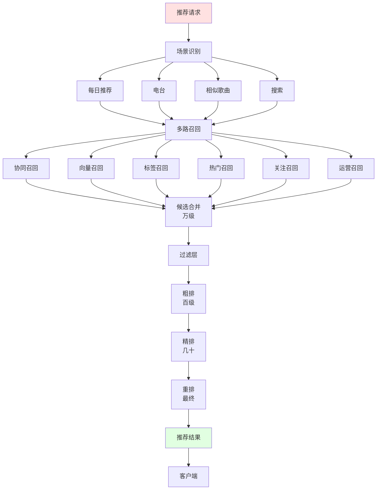
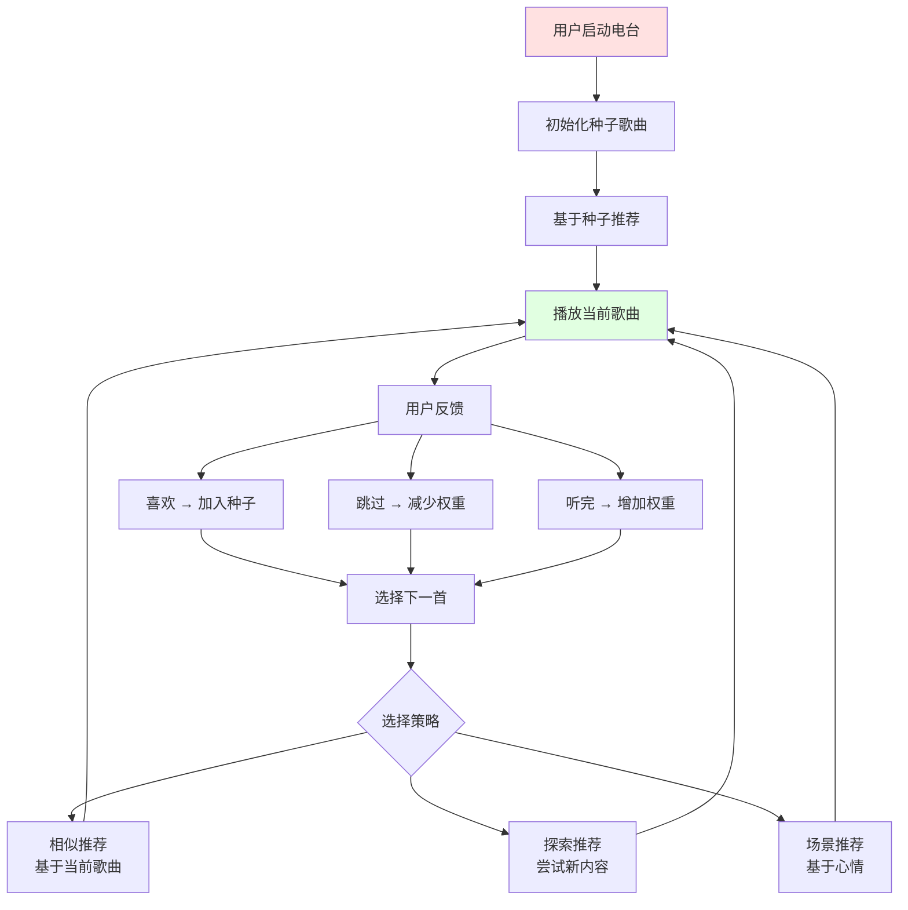
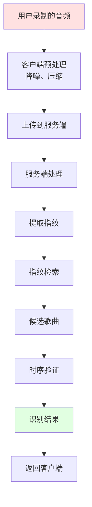
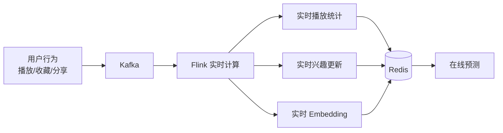

# 03 QQ 音乐推荐系统与听歌识曲

## 3.1 推荐系统全景

QQ 音乐 / TME 推荐系统是中国最复杂的音乐推荐系统之一，承担着从发现音乐、每日推荐、电台、相似歌曲、相似歌手、风格推荐等多个场景。依托腾讯的 AI 能力和海量用户行为数据，QQ 音乐的推荐准确度和多样性在国内领先。

### 3.1.1 推荐场景矩阵

```
┌────────────────────────────────────────────────────────┐
│              QQ 音乐推荐场景矩阵                         │
├────────────────────────────────────────────────────────┤
│                                                        │
│  发现音乐（首页）                                      │
│  ├── 每日推荐（30 首）                                │
│  ├── 个性化电台                                       │
│  ├── 排行榜（多维度）                                 │
│  ├── 编辑推荐                                          │
│  └── 心情/场景推荐                                     │
│                                                        │
│  播放场景                                              │
│  ├── 心动模式（边听边推荐）                            │
│  ├── 相似歌曲                                          │
│  ├── 相似歌手                                          │
│  ├── 猜你喜欢                                          │
│  └── 听完这首播这首                                    │
│                                                        │
│  搜索场景                                              │
│  ├── 搜索建议（自动补全）                              │
│  ├── 搜索结果                                          │
│  └── 搜索相关性排序                                    │
│                                                        │
│  长音频推荐                                            │
│  ├── 播客推荐                                          │
│  ├── 有声书推荐                                        │
│  └── 广播剧推荐                                        │
│                                                        │
│  商业化推荐                                            │
│  ├── 数字专辑推荐                                      │
│  ├── 会员活动推荐                                      │
│  ├── 直播推荐                                          │
│  └── 广告推荐                                          │
│                                                        │
└────────────────────────────────────────────────────────┘
```

### 3.1.2 推荐系统架构



## 3.2 多路召回

### 3.2.1 召回策略

```python
class RecallService:
    """QQ 音乐召回服务"""
    
    def __init__(self):
        # 1. 协同召回（基于用户行为）
        self.collab_recall = CollaborativeRecall()
        
        # 2. 向量召回（基于双塔）
        self.vector_recall = VectorRecall()
        
        # 3. 标签召回（基于音乐标签）
        self.tag_recall = TagRecall()
        
        # 4. 热门召回（基于热度榜单）
        self.hot_recall = HotRecall()
        
        # 5. 关注召回（关注歌手/朋友）
        self.follow_recall = FollowRecall()
        
        # 6. 运营召回（编辑精选、活动）
        self.operation_recall = OperationRecall()
        
        # 7. 序列召回（基于 Transformer）
        self.sequential_recall = SequentialRecall()
    
    def recall(self, user_id, context):
        """多路召回"""
        candidates = {}
        
        # 协同召回
        collab_songs = self.collab_recall.recall(user_id, limit=500)
        for song_id, score in collab_songs:
            candidates[song_id] = candidates.get(song_id, {})
            candidates[song_id]['collab'] = score
        
        # 向量召回
        vector_songs = self.vector_recall.recall(user_id, limit=500)
        for song_id, score in vector_songs:
            candidates.setdefault(song_id, {})['vector'] = score
        
        # 标签召回
        tag_songs = self.tag_recall.recall(
            user_id, 
            categories=context.get('preferred_categories', []),
            limit=300
        )
        for song_id, score in tag_songs:
            candidates.setdefault(song_id, {})['tag'] = score
        
        # 热门召回
        hot_songs = self.hot_recall.recall(
            category=context.get('preferred_category'),
            limit=200
        )
        for song_id, score in hot_songs:
            candidates.setdefault(song_id, {})['hot'] = score
        
        # 关注召回
        follow_songs = self.follow_recall.recall(user_id, limit=200)
        for song_id, score in follow_songs:
            candidates.setdefault(song_id, {})['follow'] = score
        
        # 序列召回
        seq_songs = self.sequential_recall.recall(user_id, limit=300)
        for song_id, score in seq_songs:
            candidates.setdefault(song_id, {})['seq'] = score
        
        return candidates
```

### 3.2.2 向量召回（双塔）

```python
class TwoTowerModel(nn.Module):
    """音乐双塔召回模型"""
    
    def __init__(self, user_dim=512, song_dim=512, embedding_dim=128):
        super().__init__()
        
        # User Tower
        self.user_tower = nn.Sequential(
            nn.Linear(user_dim, 256),
            nn.ReLU(),
            nn.BatchNorm1d(256),
            nn.Dropout(0.2),
            nn.Linear(256, embedding_dim),
            nn.L2Normalization(dim=-1)
        )
        
        # Song Tower
        self.song_tower = nn.Sequential(
            nn.Linear(song_dim, 256),
            nn.ReLU(),
            nn.BatchNorm1d(256),
            nn.Dropout(0.2),
            nn.Linear(256, embedding_dim),
            nn.L2Normalization(dim=-1)
        )
    
    def forward(self, user_features, song_features):
        user_emb = self.user_tower(user_features)
        song_emb = self.song_tower(song_features)
        return user_emb, song_emb


class VectorRecallService:
    """向量召回服务"""
    
    def __init__(self):
        # HNSW 索引（2 亿+ 歌曲）
        self.index = hnswlib.Index(space='cosine', dim=128)
        self.index.init_index(
            max_elements=300_000_000,  # 3 亿
            ef_construction=200,
            M=32
        )
        
        # 离线产出歌曲 embedding（基于歌曲特征 + 协同信号）
        self.song_embeddings = {}  # song_id -> embedding
    
    def build_index(self):
        """构建索引（每天/每周重建）"""
        songs = self.get_all_songs()
        
        embeddings = []
        ids = []
        for song in songs:
            # 计算歌曲 embedding
            embedding = self.compute_song_embedding(song)
            embeddings.append(embedding)
            ids.append(song.song_id)
        
        self.index.add_items(embeddings, ids)
    
    def compute_song_embedding(self, song):
        """计算歌曲 embedding"""
        # 综合特征：
        # - 音乐内容特征（音频 embedding）
        # - 标签特征
        # - 协同信号（被收藏的歌曲集合的平均 embedding）
        # - 文本特征（歌词、评论）
        return self.two_tower_model.encode_song(song)
    
    def recall(self, user_id, limit=500):
        """向量召回"""
        # 1. 计算用户 embedding
        user_features = self.get_user_features(user_id)
        user_emb = self.two_tower_model.encode_user(user_features)
        
        # 2. 向量检索
        labels, distances = self.index.knn_query(user_emb, k=limit)
        
        results = []
        for label, distance in zip(labels[0], distances[0]):
            similarity = 1 - distance  # 余弦相似度
            results.append({
                'song_id': label,
                'similarity': similarity
            })
        
        return results
```

### 3.2.3 序列召回（SASRec）

```python
class SASRecModel(nn.Module):
    """SASRec: Self-Attentive Sequential Recommendation"""
    
    def __init__(self, vocab_size, embedding_dim=128, num_heads=4, num_layers=2, max_len=50):
        super().__init__()
        
        self.item_embedding = nn.Embedding(vocab_size, embedding_dim)
        self.position_embedding = nn.Embedding(max_len, embedding_dim)
        
        # Transformer Encoder
        encoder_layer = nn.TransformerEncoderLayer(
            d_model=embedding_dim,
            nhead=num_heads,
            dim_feedforward=512,
            dropout=0.1,
            batch_first=True
        )
        self.transformer = nn.TransformerEncoder(
            encoder_layer,
            num_layers=num_layers
        )
        
        # 输出
        self.output = nn.Linear(embedding_dim, vocab_size)
    
    def forward(self, item_sequence):
        """
        Args:
            item_sequence: 用户历史听歌序列 (B, L)
        Returns:
            next_item_logits: 下一个可能听的歌曲的概率分布
        """
        seq_len = item_sequence.size(1)
        positions = torch.arange(seq_len).unsqueeze(0).expand_as(item_sequence)
        
        # Embedding
        item_emb = self.item_embedding(item_sequence)
        pos_emb = self.position_embedding(positions)
        
        x = item_emb + pos_emb
        
        # Causal mask（只看过去）
        causal_mask = torch.triu(torch.ones(seq_len, seq_len), diagonal=1).bool()
        
        # Transformer
        x = self.transformer(x, mask=causal_mask)
        
        # 预测下一个 item
        logits = self.output(x[:, -1, :])
        
        return logits
```

## 3.3 排序模型

### 3.3.1 多目标精排

QQ 音乐的精排模型同时优化多个目标：

```python
class MultiTaskMusicRanker(nn.Module):
    """QQ 音乐多目标精排模型"""
    
    def __init__(self, feature_dim=512, embedding_dim=256):
        super().__init__()
        
        # 共享层
        self.shared = nn.Sequential(
            nn.Linear(feature_dim, 512),
            nn.ReLU(),
            nn.Dropout(0.2),
            nn.Linear(512, embedding_dim),
            nn.ReLU()
        )
        
        # 多目标塔
        # 1. 点击率（曝光 -> 点击）
        self.click_tower = nn.Sequential(
            nn.Linear(embedding_dim, 128),
            nn.ReLU(),
            nn.Linear(128, 1),
            nn.Sigmoid()
        )
        
        # 2. 完播率（点击 -> 听完）
        self.completion_tower = nn.Sequential(
            nn.Linear(embedding_dim, 128),
            nn.ReLU(),
            nn.Linear(128, 1),
            nn.Sigmoid()
        )
        
        # 3. 收藏率
        self.collect_tower = nn.Sequential(
            nn.Linear(embedding_dim, 128),
            nn.ReLU(),
            nn.Linear(128, 1),
            nn.Sigmoid()
        )
        
        # 4. 分享率
        self.share_tower = nn.Sequential(
            nn.Linear(embedding_dim, 128),
            nn.ReLU(),
            nn.Linear(128, 1),
            nn.Sigmoid()
        )
        
        # 5. 付费转化
        self.paid_tower = nn.Sequential(
            nn.Linear(embedding_dim, 128),
            nn.ReLU(),
            nn.Linear(128, 1),
            nn.Sigmoid()
        )
    
    def forward(self, features):
        shared = self.shared(features)
        
        click_pred = self.click_tower(shared)
        completion_pred = self.completion_tower(shared)
        collect_pred = self.collect_tower(shared)
        share_pred = self.share_tower(shared)
        paid_pred = self.paid_tower(shared)
        
        # 目标融合（加权求和）
        final_score = (
            0.10 * click_pred +
            0.25 * completion_pred +
            0.25 * collect_pred +
            0.15 * share_pred +
            0.25 * paid_pred
        )
        
        return {
            'click': click_pred,
            'completion': completion_pred,
            'collect': collect_pred,
            'share': share_pred,
            'paid': paid_pred,
            'final': final_score
        }
```

### 3.3.2 特征工程

```python
class MusicFeatureEngineer:
    """音乐推荐特征工程"""
    
    def extract_song_features(self, song):
        """歌曲特征"""
        return {
            # 基础特征
            'song_id': song.song_id,
            'duration': song.duration,
            'release_year': song.release_date.year,
            'language': song.language,
            'region': song.region,
            'genre_l1': song.genre_l1,
            'genre_l2': song.genre_l2,
            'tags': song.tags,
            
            # 艺人特征
            'singer_id': song.singer_id,
            'singer_popularity': song.singer_popularity,  # 歌手热度
            'singer_avg_quality': song.singer_avg_quality,
            
            # 音频特征
            'tempo': song.tempo,  # BPM
            'key': song.key,  # 调性
            'mode': song.mode,  # 大调/小调
            'loudness': song.loudness,
            'energy': song.energy,
            'valence': song.valence,  # 欢快度
            'danceability': song.danceability,
            'acousticness': song.acousticness,
            
            # 统计特征
            'play_count_30d': song.play_count_30d,
            'collect_count_30d': song.collect_count_30d,
            'download_count_30d': song.download_count_30d,
            'comment_count_30d': song.comment_count_30d,
            'share_count_30d': song.share_count_30d,
            
            # Embedding
            'audio_embedding': song.audio_embedding,  # 256 维
            'lyrics_embedding': song.lyrics_embedding,
            
            # 质量分
            'quality_score': song.quality_score,
            'popularity_score': song.popularity_score,
            'freshness_score': song.freshness_score,
        }
    
    def extract_user_features(self, user_id):
        """用户特征"""
        portrait = self.get_user_portrait(user_id)
        
        return {
            # 人口属性
            'age_bucket': portrait.age_bucket,
            'gender': portrait.gender,
            'city_tier': portrait.city_tier,
            
            # 音乐偏好（多维度）
            'preferred_genres': portrait.genre_l1_preferences,
            'preferred_languages': portrait.language_preferences,
            'preferred_regions': portrait.region_preferences,
            'preferred_decades': portrait.decade_preferences,
            'preferred_moods': portrait.mood_preferences,
            'preferred_scenes': portrait.scene_preferences,
            
            # 行为统计
            'daily_songs_avg': portrait.daily_songs_avg,
            'avg_listening_duration': portrait.avg_listening_duration,
            'active_days_7d': portrait.active_days_7d,
            'skip_rate': portrait.skip_rate,
            'complete_rate': portrait.complete_rate,
            
            # 关注歌手
            'followed_singers': portrait.followed_singers,
            'followed_singers_embedding': portrait.followed_singers_embedding,
            
            # 历史听歌序列
            'recent_songs': portrait.recent_songs_30d,
            'recent_songs_embedding': portrait.recent_songs_embedding,
            
            # 商业属性
            'is_paid': portrait.is_paid,
            'subscription_type': portrait.subscription_type,
            'ltv': portrait.ltv,
        }
```

### 3.3.3 DIN 兴趣建模

```python
class MusicDINModel(nn.Module):
    """音乐 DIN：动态兴趣建模"""
    
    def __init__(self, user_feature_dim, song_feature_dim, 
                 hist_len=50, embedding_dim=64):
        super().__init__()
        
        # 歌曲 embedding
        self.song_embedding = nn.Embedding(song_feature_dim, embedding_dim)
        self.singer_embedding = nn.Embedding(10000, embedding_dim)
        self.genre_embedding = nn.Embedding(100, embedding_dim)
        
        # 用户特征
        self.user_dense = nn.Linear(user_feature_dim, 64)
        
        # 注意力网络
        self.attention = nn.Sequential(
            nn.Linear(4 * embedding_dim, 64),
            nn.ReLU(),
            nn.Linear(64, 32),
            nn.ReLU(),
            nn.Linear(32, 1)
        )
        
        # 输出层
        self.output = nn.Sequential(
            nn.Linear(8 * embedding_dim + 64, 256),
            nn.ReLU(),
            nn.Dropout(0.2),
            nn.Linear(256, 64),
            nn.ReLU(),
            nn.Linear(64, 1),
            nn.Sigmoid()
        )
    
    def forward(self, user_features, hist_songs, hist_singers, hist_genres,
                target_song, target_singer, target_genre):
        """DIN 前向"""
        # 用户 dense 特征
        user_dense = self.user_dense(user_features)
        
        # 历史序列 embedding
        hist_song_emb = self.song_embedding(hist_songs)
        hist_singer_emb = self.singer_embedding(hist_singers)
        hist_genre_emb = self.genre_embedding(hist_genres)
        hist_combined = torch.cat(
            [hist_song_emb, hist_singer_emb, hist_genre_emb], dim=-1
        )
        
        # 候选 embedding
        target_song_emb = self.song_embedding(target_song)
        target_singer_emb = self.singer_embedding(target_singer)
        target_genre_emb = self.genre_embedding(target_genre)
        target_combined = torch.cat(
            [target_song_emb, target_singer_emb, target_genre_emb], dim=-1
        )
        
        # 注意力
        target_expanded = target_combined.unsqueeze(1).expand(
            -1, hist_combined.size(1), -1
        )
        
        att_input = torch.cat([
            hist_combined,
            target_expanded,
            hist_combined * target_expanded,
            hist_combined - target_expanded
        ], dim=-1)
        
        att_scores = self.attention(att_input).squeeze(-1)
        att_weights = torch.softmax(att_scores, dim=-1)
        
        # 加权求和
        user_interest = torch.sum(
            att_weights.unsqueeze(-1) * hist_combined, dim=1
        )
        
        # 输出
        all_features = torch.cat([
            user_interest, target_combined, user_dense
        ], dim=-1)
        
        return self.output(all_features)
```

## 3.4 个性化电台

### 3.4.1 电台算法架构



### 3.4.2 心动模式实现

```python
class HeartbeatModeService:
    """心动模式：边听边推荐"""
    
    def __init__(self):
        # 当前歌曲
        self.current_song = None
        
        # 听歌历史（最近 N 首）
        self.history = []
        
        # 用户反馈累计
        self.likes = set()
        self.dislikes = set()
    
    def on_song_start(self, song):
        """歌曲开始播放"""
        self.current_song = song
        self.history.append(song)
    
    def on_song_end(self, song, completion_rate, user_action):
        """歌曲结束"""
        # 1. 记录反馈
        if user_action == 'like':
            self.likes.add(song.song_id)
        elif user_action == 'skip':
            self.dislikes.add(song.song_id)
            self.history.pop()  # 从历史移除
        
        # 2. 更新兴趣向量
        if completion_rate > 0.8 or user_action == 'like':
            self.update_interest_vector(song, weight=1.0)
        elif user_action == 'skip' and completion_rate < 0.3:
            self.update_interest_vector(song, weight=-0.5)
    
    def recommend_next(self):
        """推荐下一首"""
        # 1. 基于当前歌曲的相似歌曲
        similar_songs = self.recommend_similar(self.current_song)
        
        # 2. 基于用户兴趣向量
        interest_songs = self.recommend_by_interest()
        
        # 3. 探索新内容（10% 比例）
        explore_songs = self.recommend_explore()
        
        # 4. 综合打分排序
        candidates = self.merge_candidates(
            similar_songs, interest_songs, explore_songs
        )
        
        # 5. 过滤（不喜欢、已听）
        filtered = self.filter(candidates)
        
        # 6. 多样性打散（避免连续同类）
        result = self.diversify(filtered, max_consecutive_same=3)
        
        return result[0]  # 返回 top 1
    
    def update_interest_vector(self, song, weight):
        """更新兴趣向量"""
        song_emb = self.song_service.get_embedding(song.song_id)
        
        # 加权更新
        self.interest_vector = (
            self.interest_vector * 0.9 + song_emb * weight * 0.1
        )
```

## 3.5 听歌识曲

### 3.5.1 听歌识曲架构



### 3.5.2 客户端音频处理

```python
class AudioRecordingService:
    """客户端录音服务（听歌识曲）"""
    
    def __init__(self):
        self.sample_rate = 16000  # 降采样到 16kHz
        self.chunk_duration = 5   # 5 秒一个 chunk
    
    def record_and_identify(self, duration=10):
        """录制并识别"""
        # 1. 录音（使用麦克风）
        audio_data = self.record_audio(duration)
        
        # 2. 预处理
        processed = self.preprocess(audio_data)
        
        # 3. 上传到服务端
        result = self.upload_and_identify(processed)
        
        return result
    
    def preprocess(self, audio):
        """音频预处理"""
        # 1. 降采样
        audio = self.resample(audio, original_sr=44100, target_sr=self.sample_rate)
        
        # 2. 降噪
        audio = self.noise_reduce(audio)
        
        # 3. 归一化
        audio = self.normalize(audio)
        
        # 4. 截取有效段（避免沉默段）
        audio = self.trim_silence(audio)
        
        # 5. 压缩
        audio = self.compress(audio, target_format='opus')
        
        return audio
```

### 3.5.3 服务端指纹识别

```python
class ServerAudioIdentification:
    """服务端音频识别"""
    
    def __init__(self):
        # 指纹索引（基于 ES + 自研 Muse）
        self.fingerprint_index = self.load_fingerprint_index()
        
        # 深度学习辅助（噪声场景）
        self.dnn_identifier = DeepAudioIdentifier()
    
    def identify(self, audio):
        """识别歌曲"""
        # 1. 提取指纹
        fingerprints = self.extract_fingerprints(audio)
        
        # 2. 检索候选
        candidates = self.search_candidates(fingerprints)
        # candidates: [(song_id, match_score), ...]
        
        # 3. 时序验证
        verified_candidates = self.temporal_verify(candidates, fingerprints)
        
        # 4. 综合决策
        if verified_candidates:
            top = verified_candidates[0]
            if top['confidence'] > 0.85:
                return {
                    'song_id': top['song_id'],
                    'confidence': top['confidence'],
                    'method': 'fingerprint'
                }
        
        # 5. 兜底：DNN embedding
        dnn_result = self.dnn_identifier.identify(audio)
        if dnn_result['confidence'] > 0.5:
            return {
                'song_id': dnn_result['song_id'],
                'confidence': dnn_result['confidence'],
                'method': 'dnn'
            }
        
        return {'song_id': None, 'confidence': 0}
    
    def extract_fingerprints(self, audio):
        """提取音频指纹（参考 02 章）"""
        # 同 02 章的音频指纹实现
        pass
    
    def search_candidates(self, fingerprints):
        """指纹候选检索"""
        # 1. 倒排索引检索
        song_votes = defaultdict(lambda: {'votes': 0, 'time_diffs': []})
        
        for hash_value, query_time in fingerprints:
            # 检索匹配的歌曲
            matches = self.fingerprint_index.search(hash_value)
            # matches: [(song_id, db_time), ...]
            
            for song_id, db_time in matches:
                time_diff = db_time - query_time
                song_votes[song_id]['votes'] += 1
                song_votes[song_id]['time_diffs'].append(time_diff)
        
        # 2. 计算分数（投票数 + 时间一致性）
        candidates = []
        for song_id, info in song_votes.items():
            # 时间差直方图（找峰值）
            histogram = Counter(info['time_diffs'])
            most_common_diff, votes = histogram.most_common(1)[0]
            
            candidates.append({
                'song_id': song_id,
                'votes': info['votes'],
                'time_diff': most_common_diff,
                'consistency': votes / info['votes'],
            })
        
        # 3. 排序
        candidates.sort(key=lambda x: x['votes'] * x['consistency'], reverse=True)
        return candidates[:10]
    
    def temporal_verify(self, candidates, query_fingerprints):
        """时序验证"""
        verified = []
        
        for candidate in candidates[:5]:
            song_id = candidate['song_id']
            
            # 获取该歌曲的完整指纹
            db_fingerprints = self.fingerprint_index.get_song_fingerprints(song_id)
            
            # 时序对齐（DTW 动态时间规整）
            alignment = self.dtw_align(
                query_fingerprints,
                db_fingerprints,
                time_diff=candidate['time_diff']
            )
            
            # 计算对齐分数
            alignment_score = self.alignment_quality(alignment)
            
            if alignment_score > 0.7:
                verified.append({
                    'song_id': song_id,
                    'confidence': alignment_score,
                    'method': 'fingerprint_verify'
                })
        
        return verified
```

### 3.5.4 哼唱识别

```python
class HummingIdentificationService:
    """哼唱识别（用户哼唱旋律来识别歌曲）"""
    
    def __init__(self):
        # 音高序列提取
        self.pitch_extractor = PitchExtractor()
        
        # 旋律编码器
        self.melody_encoder = MelodyEncoder()
        
        # 旋律向量索引
        self.melody_vector_db = Milvus()
        self.melody_vector_db.load('melody_embeddings')
    
    def identify_from_humming(self, audio):
        """哼唱识别"""
        # 1. 提取音高序列
        pitch_sequence = self.pitch_extractor.extract(audio)
        # 返回 [(time, pitch), ...]
        
        # 2. 音高校正（去除八度误差）
        corrected_pitch = self.correct_octave(pitch_sequence)
        
        # 3. 旋律编码
        melody_emb = self.melody_encoder.encode(corrected_pitch)
        # 输出 256 维向量
        
        # 4. 向量检索
        results = self.melody_vector_db.search(melody_emb, top_k=5)
        
        # 5. 重排（考虑 DTW）
        reranked = self.rerank_with_dtw(results, corrected_pitch)
        
        return reranked[0] if reranked else None


class PitchExtractor:
    """音高提取（基于 YIN / pYIN / CREPE）"""
    
    def extract(self, audio, sr=22050):
        """提取音高序列"""
        # 使用 pYIN（概率 YIN）
        f0, voiced_flag, voiced_prob = pyin(
            audio,
            fmin=80,    # 最低 E2
            fmax=800,   # 最高 G5
            sr=sr
        )
        
        # 转换为 MIDI
        midi_sequence = []
        for time_idx, (f, voiced) in enumerate(zip(f0, voiced_flag)):
            if voiced:
                midi = librosa.hz_to_midi(f)
                midi_sequence.append((time_idx * 0.01, midi))  # 10ms 步长
        
        return midi_sequence
```

## 3.6 相似歌曲推荐

### 3.6.1 相似度计算

```python
class SimilarSongService:
    """相似歌曲服务"""
    
    def __init__(self):
        # 音频特征索引
        self.audio_index = Milvus()
        
        # 标签相似度
        self.tag_similarity = TagSimilarity()
        
        # 协同相似度
        self.collab_similarity = CollaborativeSimilarity()
    
    def find_similar_songs(self, song_id, limit=30):
        """找相似歌曲"""
        # 1. 音频相似度（基于音频 embedding）
        audio_similar = self.audio_index.search(
            self.audio_index.get(song_id),
            top_k=limit
        )
        
        # 2. 标签相似度（同标签、同歌手、同类目）
        tag_similar = self.tag_similarity.find(song_id, limit=limit)
        
        # 3. 协同相似度（"听过这首歌的人也听"）
        collab_similar = self.collab_similarity.find(song_id, limit=limit)
        
        # 4. 综合排序
        candidates = {}
        for song_id, score in audio_similar:
            candidates[song_id] = candidates.get(song_id, 0) + score * 0.4
        
        for song_id, score in tag_similar:
            candidates[song_id] = candidates.get(song_id, 0) + score * 0.3
        
        for song_id, score in collab_similar:
            candidates[song_id] = candidates.get(song_id, 0) + score * 0.3
        
        # 5. 排序
        ranked = sorted(candidates.items(), key=lambda x: x[1], reverse=True)
        
        return ranked[:limit]
```

## 3.7 长音频推荐

### 3.7.1 播客推荐

```python
class PodcastRecommendService:
    """播客推荐"""
    
    def recommend(self, user_id, context):
        """推荐播客"""
        candidates = {}
        
        # 1. 协同过滤（基于收听历史）
        collab = self.collab_recall(user_id)
        for podcast_id, score in collab.items():
            candidates[podcast_id] = candidates.get(podcast_id, {})
            candidates[podcast_id]['collab'] = score
        
        # 2. 内容相似（基于播客主题）
        content = self.content_recall(user_id, context)
        for podcast_id, score in content.items():
            candidates.setdefault(podcast_id, {})['content'] = score
        
        # 3. 热门
        hot = self.hot_recall()
        for podcast_id, score in hot.items():
            candidates.setdefault(podcast_id, {})['hot'] = score
        
        # 4. 关注主播
        follow = self.follow_recall(user_id)
        for podcast_id, score in follow.items():
            candidates.setdefault(podcast_id, {})['follow'] = score
        
        # 5. 排序
        ranked = self.rank(candidates, user_id)
        
        return ranked
```

## 3.8 A/B 测试与效果评估

### 3.8.1 关键指标

```python
class MusicRecommendationMetrics:
    """音乐推荐评估指标"""
    
    @staticmethod
    def business_metrics():
        """业务指标"""
        return {
            # 用户指标
            'DAU': '日活',
            'MAU': '月活',
            'paid_user_rate': '付费率',
            'retention_7d': '7 日留存',
            'retention_30d': '30 日留存',
            
            # 播放指标
            'daily_songs_per_user': '人均日听歌数',
            'daily_duration_per_user': '人均日听歌时长',
            'completion_rate': '完播率',
            'skip_rate': '跳过率',
            
            # 推荐效果
            'recommend_ctr': '推荐点击率',
            'recommend_completion_rate': '推荐完播率',
            'daily_recommend_acceptance_rate': '每日推荐接受率',
            
            # 商业指标
            'arpu': '人均收入',
            'arppu': '付费用户人均收入',
            'subscription_conversion_rate': '订阅转化率',
            'digital_album_conversion_rate': '数字专辑转化率',
        }
    
    @staticmethod
    def diversity_metrics(recommended_list):
        """多样性指标"""
        # 类目多样性
        categories = set(song.genre_l1 for song in recommended_list)
        category_diversity = len(categories) / len(recommended_list)
        
        # 歌手多样性
        singers = set(song.singer_id for song in recommended_list)
        singer_diversity = len(singers) / len(recommended_list)
        
        # 年代多样性
        decades = set(song.release_date.year // 10 for song in recommended_list)
        decade_diversity = len(decades) / len(recommended_list)
        
        return {
            'category_diversity': category_diversity,
            'singer_diversity': singer_diversity,
            'decade_diversity': decade_diversity,
        }
    
    @staticmethod
    def novelty_metrics(recommended_list, user_history):
        """新颖性指标"""
        history_song_ids = set(s.user_action.song_id for s in user_history)
        
        new_songs = sum(
            1 for song in recommended_list 
            if song.song_id not in history_song_ids
        )
        novelty = new_songs / len(recommended_list)
        
        return {'novelty': novelty}
```

## 3.9 冷启动

### 3.9.1 用户冷启动

```python
class ColdStartService:
    """冷启动服务"""
    
    def handle_new_user(self, user_id):
        """新用户冷启动"""
        # 1. 收集初始信息
        initial_info = self.collect_initial_info(user_id)
        # 包括：注册时填的兴趣标签、设备类型、来源渠道
        
        # 2. 初始画像
        portrait = {
            'preferred_genres': initial_info.get('genres', []),
            'preferred_languages': initial_info.get('languages', []),
            'age_bucket': initial_info.get('age_bucket'),
            'gender': initial_info.get('gender'),
        }
        
        # 3. 初始推荐（基于初始标签）
        initial_recommendations = self.recommend_by_tags(portrait)
        
        # 4. 引导式反馈
        self.show_onboarding_questions(user_id)
        # 问 5-10 个问题：喜欢的曲风、喜欢的年代、喜欢的歌手
        
        # 5. 探索模式（高新颖性）
        self.enable_exploration_mode(user_id, duration_days=7)
        # 前 7 天用高新颖性推荐，让系统快速了解用户
        
        return initial_recommendations
```

### 3.9.2 歌曲冷启动

```python
class NewSongColdStart:
    """新歌冷启动"""
    
    def bootstrap_new_song(self, song):
        """新歌冷启动"""
        # 1. 多维度特征
        features = self.extract_features(song)
        # - 歌手画像
        # - 专辑类型
        # - 标签
        # - 音频特征（基于相似歌曲）
        
        # 2. 推送给相似用户
        similar_users = self.find_similar_users(features)
        
        # 3. 探索流量配额
        # 前 7 天分配 5% 探索流量
        exploration_quota = 0.05
        
        # 4. 实时反馈调整
        # 根据新歌的实时表现（播放、收藏、完播）调整推荐策略
        
        return similar_users, exploration_quota
```

## 3.10 实时特征与在线学习

### 3.10.1 实时特征 Pipeline



### 3.10.2 实时推荐

```python
class RealtimeMusicRecommender:
    """实时音乐推荐"""
    
    def recommend_realtime(self, user_id, context):
        """实时推荐"""
        # 1. 提取实时特征
        realtime_features = self.extract_realtime_features(user_id)
        # - 最近 1 小时听的歌
        # - 实时兴趣向量
        # - 当前时间场景
        # - 网络情况
        
        # 2. 实时召回
        candidates = self.realtime_recall(user_id, realtime_features)
        
        # 3. 实时排序
        scores = self.online_model.predict(candidates, realtime_features)
        
        # 4. 重排
        ranked = self.rerank(candidates, scores)
        
        return ranked
    
    def on_user_action(self, user_id, action):
        """用户行为反馈"""
        # 1. 更新实时特征
        self.update_realtime_features(user_id, action)
        
        # 2. 在线学习
        features = self.extract_features(user_id, action)
        label = 1 if action in ['like', 'collect', 'complete'] else 0
        self.online_model.update(features, label)
```

## 3.11 小结

QQ 音乐 / TME 的推荐与听歌识曲系统是国内最复杂的音乐智能系统：

1. **多路召回**：协同 + 向量 + 标签 + 热门 + 关注 + 序列召回
2. **多目标精排**：点击 + 完播 + 收藏 + 分享 + 付费转化
3. **DIN 兴趣建模**：动态捕捉用户兴趣演化
4. **心动模式**：边听边推荐，实时反馈
5. **听歌识曲**：基于指纹 + 深度学习 + 时序验证
6. **哼唱识别**：基于音高序列的旋律检索
7. **冷启动方案**：新用户 / 新歌 / 新场景
8. **实时特征 + 在线学习**：分钟级响应

对自身业务的启示：

- **AI 直播平台**：心动模式（实时反馈推荐）、冷启动方案
- **TikTok Shop 音乐**：音乐 + 商品的协同推荐
- **跨境流媒体**：多语言 + 本地化推荐