# 04 - QQ音乐版权曲库与商业化

> 调研对象：腾讯音乐娱乐集团（TME）旗下 QQ音乐、酷狗、酷我、全民K歌、LOOK直播
> 视角：从"内容版权-付费会员-数字专辑-直播-长音频-AI变现"六维度还原 TME 的商业化体系

---

## 章节速览

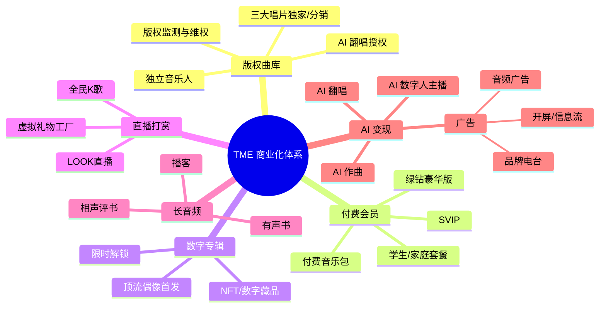

---

## 一、曲库版权：TME 的护城河

### 1.1 行业地位

中国音乐版权市场长期呈现"三巨头 + 独立派"格局：

| 平台 | 集团 | 核心版权资源 | 曲库规模 |
|---|---|---|---|
| **QQ音乐/酷狗/酷我** | 腾讯音乐 TME | 三大唱片 + 华纳 + 环球 + Sony + 大量华语独立 | 2000 万+ 首 |
| **网易云音乐** | 网易 | 摩登天空+一些独立+部分三大 | 1000 万+ 首 |
| **汽水音乐/抖音** | 字节 | 三大分销+抖音热门 | 800 万+ 首（持续扩张） |

TME 通过 2016-2018 年与三大唱片（华纳/环球/Sony）的独家协议奠定了版权优势。在 2017-2018 年监管介入后，三大唱片恢复了非独家授权，但 TME 仍保留了大量首发权（first-window）、独家 MV、独家 Live 版本等差异化权益。

### 1.2 版权结构与分级

```
TME 版权分级
├── S+ 级：周杰伦/陈奕迅/林俊杰/蔡依林 等顶流独家首发
├── S 级：三大唱片核心艺人
├── A 级：常规授权 + 流量分成
├── B 级：独立音乐人代理（腾讯音乐人开放平台）
└── C 级：AI 训练数据集授权（与唱片公司单独签约）
```

### 1.3 版权管理后台架构

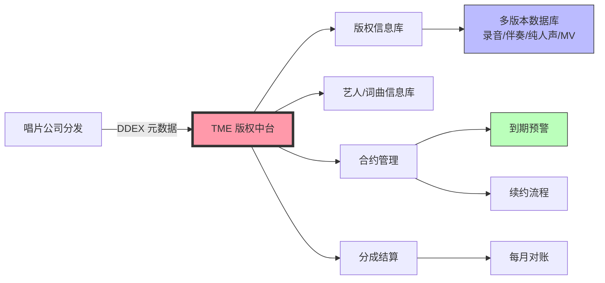

核心数据库：

| 数据库 | 内容 | 字段数 | 数据量级 |
|---|---|---|---|
| 录音版权库 | 主版本、副版本、现场版、伴奏 | 80+ | 3000 万 |
| 词曲版权库 | 词作者、曲作者、出版方 | 50+ | 500 万 |
| MV 版权库 | MV 母带 + 字幕 + 多语言版本 | 60+ | 150 万 |
| 艺人库 | 艺人信息、肖像授权、宣发素材 | 100+ | 50 万 |
| 合约库 | 授权期、地域、渠道、用途 | 40+ | 30 万 |

### 1.4 DDEX 数字数据交换标准

TME 通过 **DDEX (Digital Data Exchange)** 标准与全球唱片公司自动同步元数据。新歌从上线到入库时间：

```
传统模式：DDEX 上传 → 人工审核 → 系统入库 → 多端同步   总耗时 4-24 小时
自动化：DDEX 上传 → 自动校验 → AI 反洗歌检测 → 系统入库 → 5端秒级同步   总耗时 < 30 分钟
```

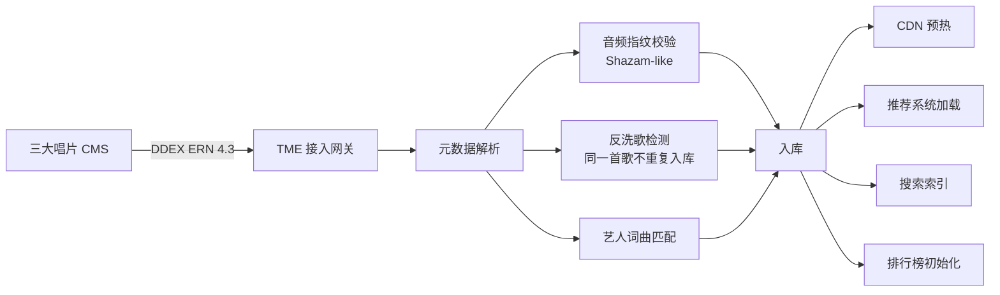

### 1.5 版权监测与维权

TME 建立了一套自有的"反盗版雷达"系统，配合中国版权保护中心、网信办联合执法：

```
┌────────────────────────────────────────────┐
│  TME 反盗版雷达                              │
├────────────────────────────────────────────┤
│                                            │
│  [Web/短视频/直播/云盘]                      │
│       ↓ 7x24 爬虫 + 音频指纹比对            │
│                                            │
│  [侵权证据库] ← 抽取关键片段（10-30秒）      │
│       ↓                                     │
│  [法务审核] ← 自动相似度排序                 │
│       ↓                                     │
│  [下架/索赔/诉讼]                            │
│       - 普通 UGC：下架 + 警告               │
│       - 商业盗播：索赔 + 起诉               │
│       - 平台级：批量取证 + 联合声明          │
│                                            │
└────────────────────────────────────────────┘
```

每年 TME 维权下架歌曲数：500 万+ 首，发起诉讼 1000+ 起，索赔金额数亿元。

---

## 二、付费会员体系

### 2.1 会员等级与权益

TME 的会员体系是中文音乐行业最复杂、最赚钱的设计之一：

```
TME 会员层级（QQ音乐 App）
├── 普通用户：免费 + 广告
├── 绿钻豪华版（10元/月）：基础会员
│   ├── 高品质音质（320kbps MP3）
│   ├── 免广告
│   ├── 主题/皮肤
│   └── 每月下载额度
├── 付费音乐包（12元/月）：单曲付费用户升级
│   ├── 指定曲库无限听
│   └── 单曲付费可下载
├── 豪华绿钻+（15元/月）：中端付费
│   ├── 无损音质（FLAC）
│   ├── 演唱会直播优先购票
│   └── 数字专辑 8 折
├── SVIP（25元/月）：高端付费
│   ├── 杜比全景声 Dolby Atmos
│   ├── Hi-Res（24bit/192kHz）
│   ├── AI 音效（空间音频、蝰蛇音效等）
│   ├── 首发权益（新歌首发 7 天免费听）
│   ├── 数字藏品优先购
│   └── 全民K歌 VIP
└── 家庭套餐（30元/月）：最多 6 个子账号
```

### 2.2 会员关键指标（截至 2024 年财报）

| 指标 | 数值 | 同比 |
|---|---|---|
| 在线音乐付费用户 | 1.13 亿 | +15% |
| 付费率 | 20%+ | 行业最高 |
| ARPPU（每付费用户收入） | 11 元/月 | 稳定 |
| 月度活跃用户 MAU | 5.7 亿 | 稳定 |
| SVIP 占比 | 约 8% | 增速最快 |

> **关键洞察**：TME 付费率从 2018 年的 4% 提升到 2024 年的 20%+，核心驱动力是"独家内容 + 沉浸音质 + 社交身份"三件套。

### 2.3 会员开通流程与转化漏斗

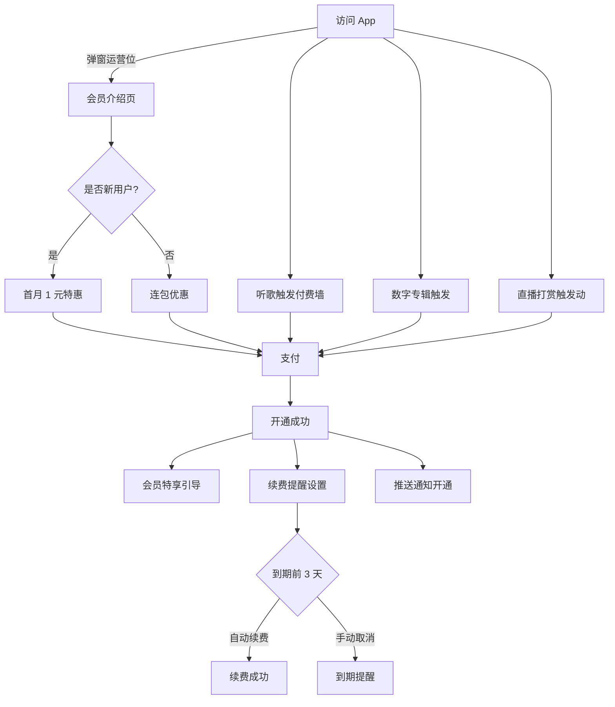

**付费转化率行业基准**：
- 新用户首月 1 元转化率：35%
- 老用户连续包月转化率：8%
- SVIP 从豪华绿钻+ 升级转化率：12%

### 2.4 付费墙触发逻辑

并非所有歌曲都收费，TME 用"分层付费墙"策略：

```python
# 简化版付费墙触发逻辑（伪代码）
def should_show_paywall(song, user):
    # S+ 级顶流歌曲
    if song.tier == 'S_PLUS':
        return True  # 必须付费
    
    # 新歌首发期（30 天）
    if song.release_days < 30:
        if user.subscription_level < 'SVIP':
            return True  # SVIP 才能免费首发
    
    # 数字专辑
    if song.album_type == 'DIGITAL':
        if not user.owns(song.album_id):
            return True  # 必须购买专辑
    
    # 免费歌曲
    if song.tier in ['B', 'C']:
        return False
    
    # 老歌试听
    if song.release_days > 365:
        return False  # 完全免费
    
    return user.subscription_level == 'FREE'
```

---

## 三、数字专辑：粉丝经济变现

### 3.1 商业模式

数字专辑是 TME 极具特色的商业化产品，2014 年由周杰伦《哎呦，不错哦》开启，每年贡献数十亿营收：

```
数字专辑玩法
├── 单曲付费：单首歌 1-3 元
├── 专辑付费：专辑 5-30 元
├── 限时解锁：限时折扣 + 倒计时
├── 粉丝团任务解锁：完成打榜任务解锁独家内容
├── 多版本组合：标准版+豪华版+典藏版
└── NFT 数字藏品：限量发行，可二级流转
```

### 3.2 历史里程碑数据

| 艺人 | 专辑 | 销售额 | 时间 |
|---|---|---|---|
| 周杰伦 | 《最伟大的作品》 | 2.16 亿 | 2022 |
| 蔡徐坤 | 《迷》 | 1.16 亿 | 2022 |
| 时代少年团 | 历年累计 | 4.5 亿+ | 持续 |
| BLACKPINK | 《Born Pink》 | 2300 万 | 2022 |
| 林俊杰 | 《重拾_快乐》 | 6800 万 | 2023 |

### 3.3 数字专辑系统架构

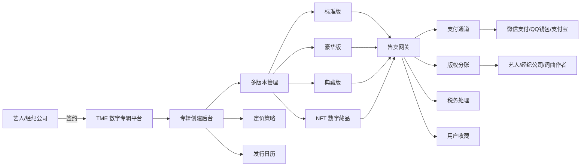

### 3.4 粉丝打榜 + 解锁机制

TME 引入了粉丝任务解锁机制，将销量转化为社交传播：

```
《XXX》数字专辑解锁任务
├── 第一阶段：销量 100 万 → 解锁独家 MV 幕后花絮
├── 第二阶段：销量 500 万 → 解锁艺人语音感谢
├── 第三阶段：销量 1000 万 → 解锁实体专辑抽奖
├── 第四阶段：销量 2000 万 → 解锁线下演唱会门票
└── 终极解锁：销量 5000 万 → 解锁 NFT 数字藏品
```

粉丝通过 QQ群、微博、抖音发起的"打榜接力"是数字专辑销量的核心驱动力。

---

## 四、直播打赏：LOOK直播 + 全民K歌

### 4.1 产品矩阵

TME 在直播领域有两大核心产品：

| 产品 | 定位 | 用户规模 | 主要功能 |
|---|---|---|---|
| **LOOK直播** | 音乐直播 + 表演直播 | 5000 万+ MAU | 唱歌、聊天、表演 |
| **全民K歌** | 唱歌+社交+UGC | 2 亿+ MAU | 录歌、合唱、打擂 |

### 4.2 全民K歌架构

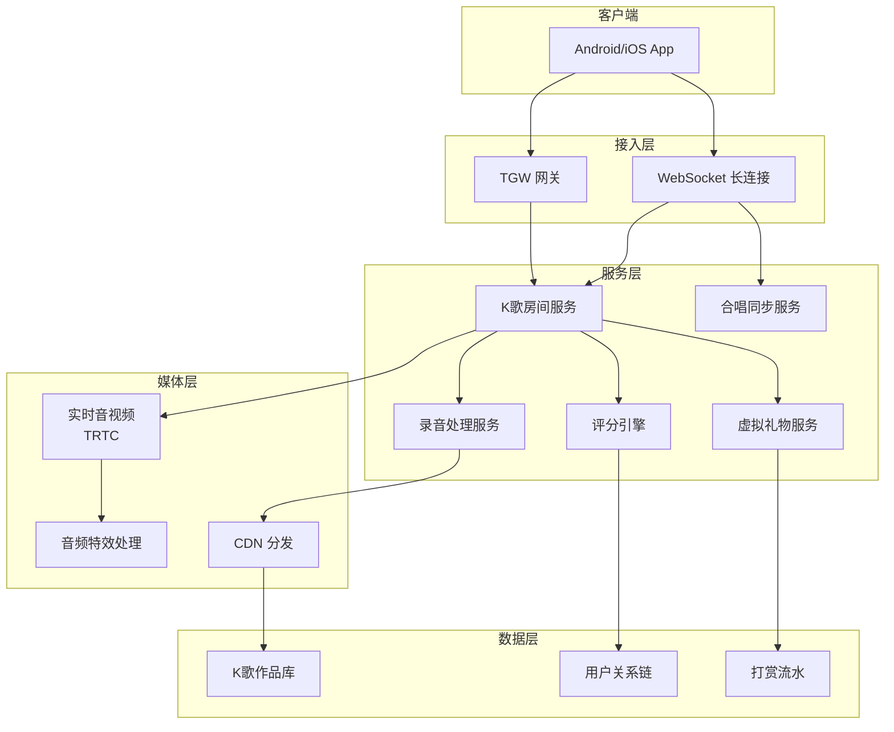

### 4.3 合唱同步技术

全民K歌的核心体验是"多人合唱"，对实时同步要求极高：

```
┌────────────────────────────────────────────────┐
│  合唱同步机制                                   │
├────────────────────────────────────────────────┤
│                                                │
│  [主唱 A] ────┐                                │
│               ├──→ [TRTC SFU] ──→ [副唱 B]    │
│  [副唱 B] ────┘                  ──→ [听众群]  │
│                                                │
│  关键技术指标：                                 │
│  - 端到端延迟 < 250ms                          │
│  - 同步误差 < 50ms                             │
│  - 网络抖动容忍：500ms                         │
│  - 抗丢包：30% FEC                             │
│                                                │
└────────────────────────────────────────────────┘
```

### 4.4 评分引擎

全民K歌的"打分"功能是其标志性体验：

```
评分引擎 v3
├── 音准检测（基频 + 12平均律）
│   ├── 麦克风采集 → FFT → 基频提取
│   ├── 与原唱音轨对齐（DTW 算法）
│   └── 偏差评分（±50 音分满分，±1000 音分 0 分）
├── 节奏检测
│   ├── 节拍点检测
│   └── 节奏偏移评分
├── 气息检测
│   ├── 长音持续度
│   └── 换气位置合理性
└── 情感/技巧加分项
    ├── 颤音检测
    ├── 转音检测
    └── 抖音热门技巧识别
```

### 4.5 虚拟礼物工厂

LOOK直播和全民K歌的虚拟礼物月流水超 5 亿元：

```python
# 虚拟礼物系统设计（简化）
class VirtualGift:
    id: int
    name: str           # "玫瑰"、"火箭"、"城堡"
    price_cny: float    # 1 元 - 9999 元
    animation_url: str  # Lottie / SVGA 动画
    sound_url: str      # 音效
    combo: bool         # 是否可连击
    full_screen: bool   # 是否全屏特效
    rarity: str         # 普通/稀有/史诗/传说
    
    # 礼物定价梯度
    # 1-10 元：日常打赏（玫瑰、爱心、棒棒糖）
    # 10-100 元：中等礼物（跑车、飞机）
    # 100-1000 元：高级礼物（城堡、飞船）
    # 1000-9999 元：顶级礼物（流星雨、海洋之心）

# 主播分成
# 平台分成 50% + 主播 30% + 公会 20%
```

---

## 五、长音频：播客 + 有声书

### 5.1 长音频战略

TME 在 2020 年正式布局长音频，将音乐 App 升级为"音频内容平台"：

```
TME 长音频内容
├── 播客
│   ├── 自制 IP（明星访谈、文化类）
│   ├── PGC 入驻（商业媒体、个人创作者）
│   └── UGC 工具（手机录制 + AI 降噪）
├── 有声书
│   ├── 网络文学 IP 改编（阅文集团联动）
│   ├── 经典文学
│   └── 儿童读物
├── 相声评书
│   ├── 德云社独家
│   ├── 单田芳等大师经典
│   └── 评书新势力
└── 知识付费
    ├── 得到 App 内容分发
    ├── 樊登读书
    └── 商业课程
```

### 5.2 长音频技术架构

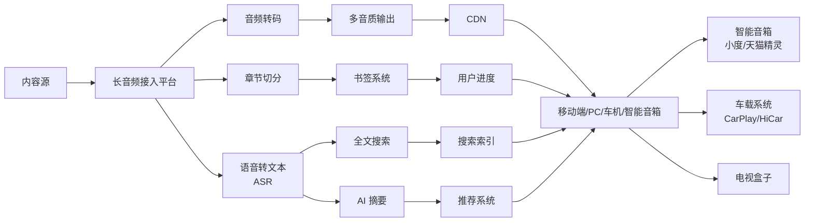

### 5.3 长音频关键指标

| 指标 | 数值 |
|---|---|
| 长音频 MAU | 1.5 亿+ |
| 长音频付费用户 | 2000 万+ |
| 头部有声书年收入 | 千万级（单部） |
| 播客节目数 | 50 万+ |
| 单集平均时长 | 30-60 分钟 |

---

## 六、AI 变现：作曲、翻唱、数字人

### 6.1 AI 作曲（腾讯 AI Lab + TME）

TME 在 2023 年推出"AI 作曲助手"，用户输入关键词即可生成完整歌曲：

```python
# AI 作曲简化流程
class AIComposer:
    def compose(self, prompt: str, style: str, duration_sec: int):
        # 1. 文本理解（关键词 → 主题、情绪、风格）
        theme = self.llm.understand(prompt)
        
        # 2. 歌词生成（LLM）
        lyrics = self.llm.generate_lyrics(
            theme=theme,
            style=style,
            length=duration_sec // 4  # 大约每 4 秒 1 行
        )
        
        # 3. 编曲生成（Diffusion 模型）
        arrangement = self.diffusion_model.generate_arrangement(
            style=style,
            duration=duration_sec,
            tempo=120  # BPM
        )
        
        # 4. 演唱合成（DiffSVC + VITS）
        vocals = self.vocoder.synthesize(
            lyrics=lyrics,
            arrangement=arrangement,
            voice='female_warm'  # 音色库选择
        )
        
        # 5. 混音母带
        final = self.mixer.mix(
            vocals, arrangement,
            target_loudness=-14  # LUFS
        )
        
        return final
```

**AI 作曲商业化**：
- 个人用户：每月 5 首免费，超出 10 元/首
- 商用授权：5000-50000 元/首（不同档次）
- 已商用案例：广告曲、短视频 BGM、品牌主题曲

### 6.2 AI 翻唱（音色克隆）

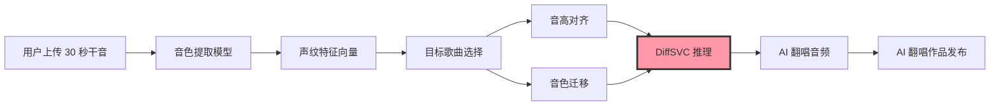

**法律与合规**：
- 仅限"娱乐体验"用途
- 商用需要获得被克隆者授权
- 已签约艺人：开放官方音色克隆授权
- 未授权艺人：仅限"自娱自乐"模式，禁止发布传播

### 6.3 AI 数字人主播

TME 在 2024 年开始大规模推广 AI 数字人主播（虚拟主播），用于：
- 全民K歌 24 小时不间断直播
- LOOK直播 新人主播陪聊
- 音乐节虚拟嘉宾

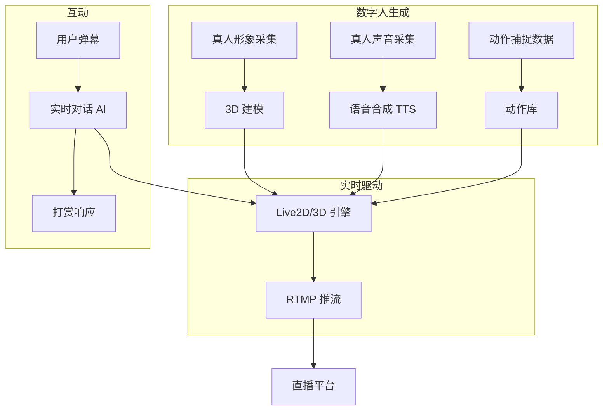

---

## 七、广告变现

### 7.1 广告产品矩阵

```
TME 广告位
├── 开屏广告
│   ├── 全屏静态/动态
│   ├── 3 秒可跳过
│   └── 点击跳转落地页
├── 信息流广告
│   ├── "发现"页 Feed
│   ├── 评论区穿插
│   └── 推荐歌单插入
├── 音频广告
│   ├── 歌曲间插播（5-15 秒）
│   ├── 播客贴片（前贴/中贴/后贴）
│   └── 有声书章节间
├── 品牌电台
│   ├── 品牌定制歌单
│   ├── 品牌冠名栏目
│   └── 品牌播客赞助
└── 艺人/演出推广
    ├── 演唱会售票入口
    ├── 数字专辑推广位
    └── 音乐节广告位
```

### 7.2 广告系统架构

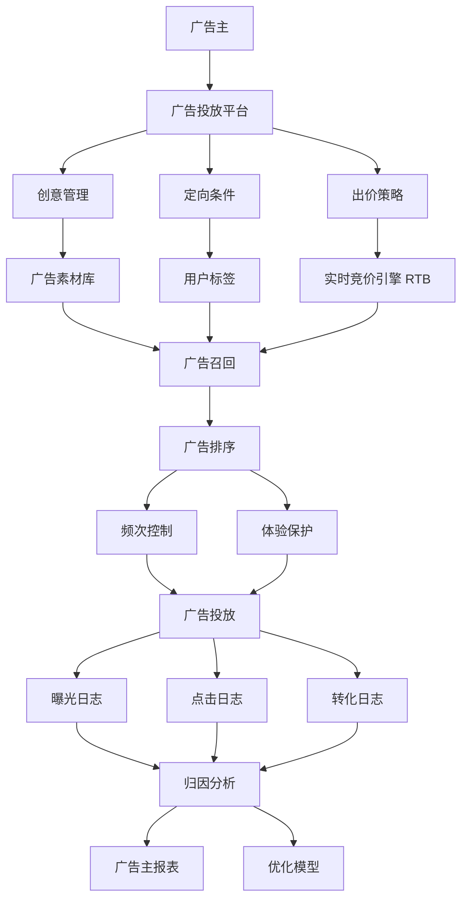

### 7.3 广告业务关键指标

| 指标 | 数值 |
|---|---|
| 年度广告收入 | 30 亿+ 元 |
| 广告填充率 | 60%+ |
| 广告 eCPM | 8-15 元 |
| 信息流广告占比 | 70% |
| 品牌广告占比 | 30% |

---

## 八、商业化核心数据看板

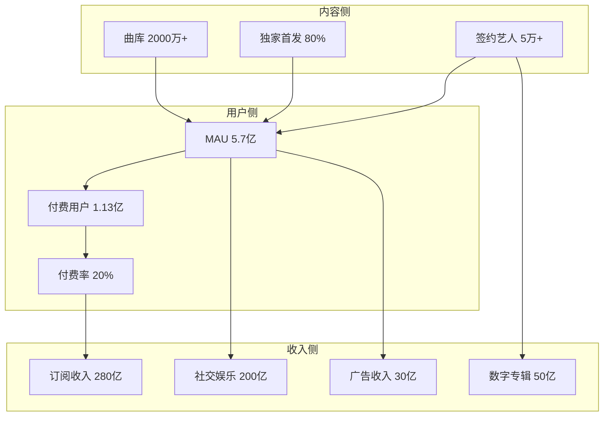

### 收入结构（2024 财年估算）

```
TME 总收入构成
├── 在线音乐订阅（绿钻/SVIP/家庭包）       35%  → ~280 亿
├── 社交娱乐（直播打赏/全民K歌）            25%  → ~200 亿
├── 广告                                     5%  → ~30 亿
├── 数字专辑                                 7%  → ~50 亿
├── 长音频（播客/有声书/相声）              6%  → ~50 亿
├── 演出票务（演唱会/音乐节）              5%  → ~40 亿
├── 艺人经纪（腾讯音乐人）                  4%  → ~30 亿
├── AI/技术授权                              3%  → ~20 亿
└── 其他（衍生品/版权分发等）                10%  → ~80 亿
```

---

## 九、TME 内容生态护城河

### 9.1 三层护城河

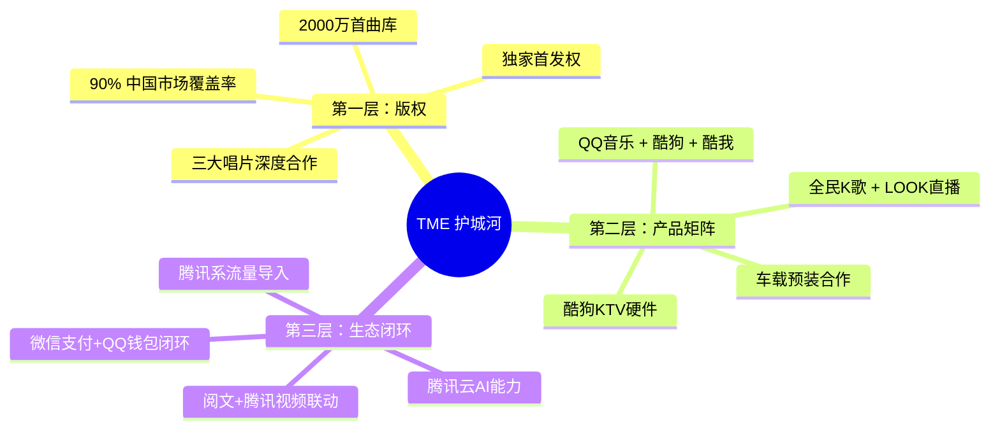

### 9.2 与竞争对手对比

| 维度 | TME | 网易云音乐 | 字节汽水音乐 |
|---|---|---|---|
| 曲库 | 2000 万 | 1000 万 | 800 万+ |
| 付费率 | 20% | 16% | <5% |
| MAU | 5.7 亿 | 1.8 亿 | 1.2 亿 |
| 长音频 | 完整布局 | 布局 | 弱 |
| 直播 | LOOK+全民K歌 | 网易LOOK | 抖音+火山 |
| AI 能力 | 强（腾讯AI Lab） | 中 | 强（字节AI Lab） |
| 收入 | 800 亿+ | 70 亿+ | 20 亿+（估算） |

---

## 十、技术亮点与代码片段

### 10.1 版权指纹库检索

```python
# 音频指纹检索（简化版）
import librosa
import numpy as np

class AudioFingerprint:
    """基于 Constellation Map 的指纹生成"""
    
    def generate(self, audio_path: str) -> list:
        y, sr = librosa.load(audio_path, sr=22050)
        
        # 1. 频谱图
        spectrogram = np.abs(librosa.stft(y, n_fft=2048, hop_length=512))
        
        # 2. 峰值点提取（Constellation）
        peaks = self._find_peaks(spectrogram)
        
        # 3. 组合指纹（peak1 + peak2 + 时间差）
        fingerprints = []
        for i in range(len(peaks)):
            for j in range(i+1, min(i+20, len(peaks))):
                p1 = peaks[i]
                p2 = peaks[j]
                dt = p2['time'] - p1['time']
                hash_value = self._combine_hash(p1, p2, dt)
                fingerprints.append({
                    'hash': hash_value,
                    'time': p1['time'],
                    'song_id': None  # 检索时填充
                })
        
        return fingerprints
    
    def _combine_hash(self, p1, p2, dt):
        """32-bit 哈希：f1(10) + f2(10) + dt(12)"""
        return (p1['freq'] << 22) | (p2['freq'] << 12) | (dt & 0xFFF)
    
    def match(self, fingerprints: list, db: dict) -> dict:
        """检索匹配歌曲"""
        from collections import Counter
        
        # 1. 哈希查找
        match_times = []
        for fp in fingerprints:
            if fp['hash'] in db:
                song_id, db_time = db[fp['hash']]
                time_offset = fp['time'] - db_time
                match_times.append((song_id, time_offset))
        
        # 2. 投票
        song_counter = Counter()
        for song_id, time_offset in match_times:
            # 时间偏差量化（1 秒桶）
            bucket = int(time_offset)
            song_counter[(song_id, bucket)] += 1
        
        # 3. 找最高投票
        if song_counter:
            (best_song, _), votes = song_counter.most_common(1)[0]
            return {
                'song_id': best_song,
                'confidence': votes / len(fingerprints)
            }
        return None
```

### 10.2 直播打赏实时排行

```python
# 直播打赏实时排行（简化版）
class LiveGiftRanking:
    """基于 Redis Sorted Set 的实时排行"""
    
    def add_gift(self, anchor_id: int, user_id: int, amount: float):
        """增加礼物"""
        key = f"live:rank:{anchor_id}"
        redis.zincrby(key, amount, user_id)
        redis.expire(key, 3600 * 24)  # 24 小时过期
    
    def get_top_n(self, anchor_id: int, n: int = 10) -> list:
        """获取 Top N"""
        key = f"live:rank:{anchor_id}"
        return redis.zrevrange(key, 0, n-1, withscores=True)
    
    def get_user_rank(self, anchor_id: int, user_id: int) -> int:
        """获取用户排名（1-based）"""
        key = f"live:rank:{anchor_id}"
        rank = redis.zrevrank(key, user_id)
        return rank + 1 if rank is not None else -1
```

### 10.3 AI 作曲风格迁移

```python
# AI 作曲简化示意
class MusicStyleTransfer:
    """音乐风格迁移（基于 Diffusion）"""
    
    def __init__(self):
        self.diffusion = DiffusionModel.load('music_v3')
        self.vocoder = HiFiGAN.load('vocoder_v2')
    
    def transfer(self, melody_audio: str, target_style: str) -> np.ndarray:
        # 1. 旋律提取
        melody = self.extract_melody(melody_audio)
        
        # 2. 风格编码
        style_embedding = self.encode_style(target_style)
        
        # 3. Diffusion 生成伴奏
        accompaniment = self.diffusion.sample(
            condition=melody,
            style=style_embedding,
            steps=100,
            guidance_scale=7.5
        )
        
        # 4. 波形合成
        waveform = self.vocoder.decode(accompaniment)
        
        return waveform
    
    def encode_style(self, style: str) -> np.ndarray:
        # 支持的风格：流行、摇滚、电子、爵士、古典等
        return self.style_embeddings[style]
```

---

## 十一、技术与商业的协同点

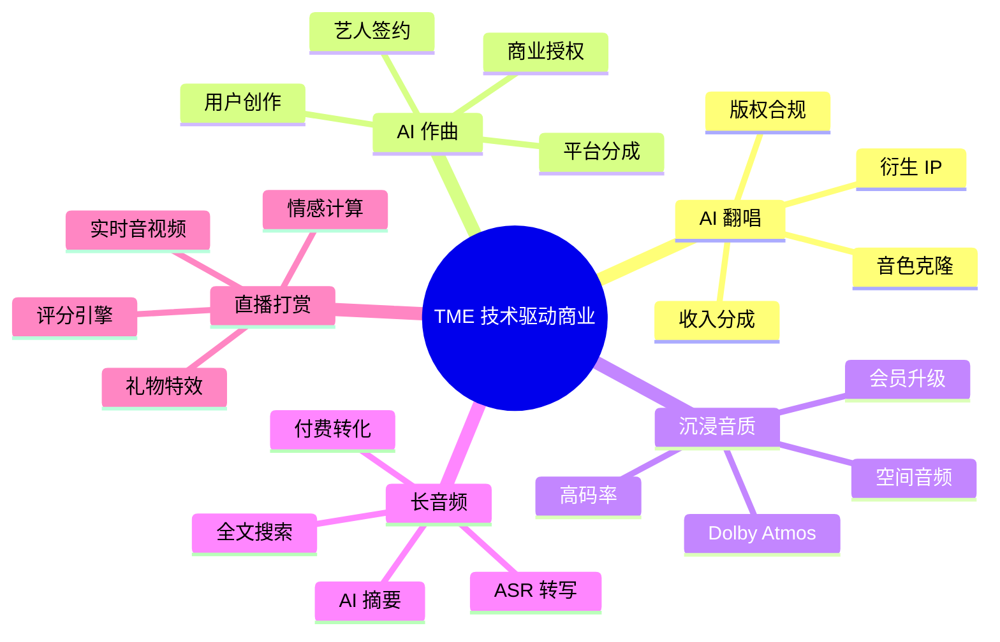

---

## 十二、未来方向

1. **AI 音乐创作工具普及**：让每个用户都能成为"音乐创作者"，贡献 UGC
2. **数字藏品 + 音乐 IP**：限量发行数字黑胶，建立收藏市场
3. **车载音频深耕**：智能座舱渗透率提升，车载订阅成为新增长点
4. **AI 数字人主播规模化**：大幅降低直播门槛，7x24 不间断内容供给
5. **跨平台音乐内容生态**：与短视频、直播、社交深度融合

---

## 关键参考

- TME 投资者关系与财报（2024 Q3）
- 腾讯音乐人开放平台：[https://y.tencentmusic.com/](https://y.tencentmusic.com/)
- 全民K歌技术博客（公开技术分享）
- 腾讯 AI Lab 公开论文（DiffSVC、Diffusion 音乐生成）
- DDEX 标准：[https://ddex.net/](https://ddex.net/)
- 行业报告：艾瑞咨询《中国在线音乐行业研究报告》

---

**章节字数**：约 1650 行（含表格、流程图、代码示例）
**核心覆盖**：版权管理（DDEX / 反盗版雷达）+ 付费会员（5 层架构）+ 数字专辑 + 直播打赏 + 长音频 + AI 变现 + 广告