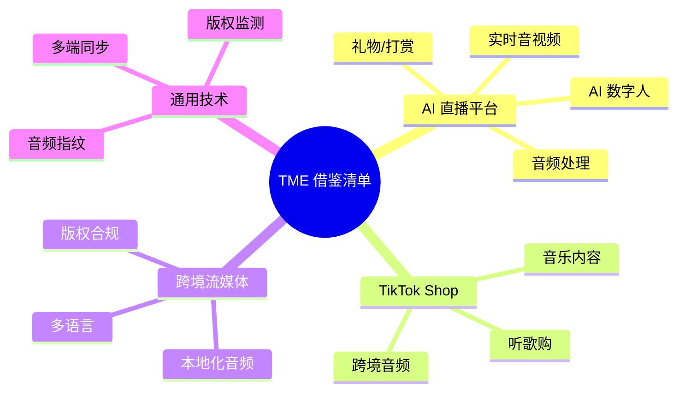
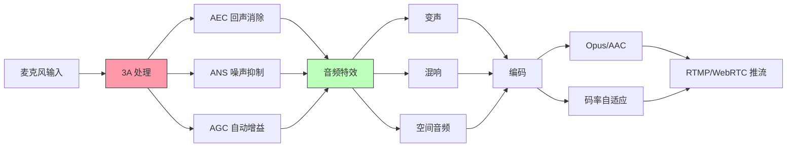
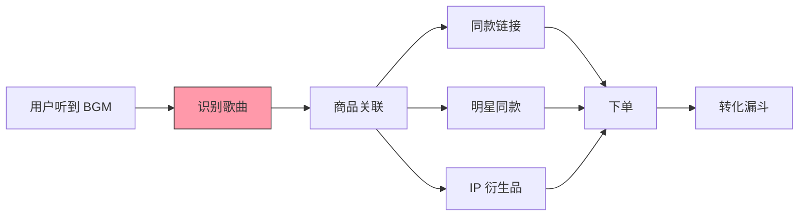
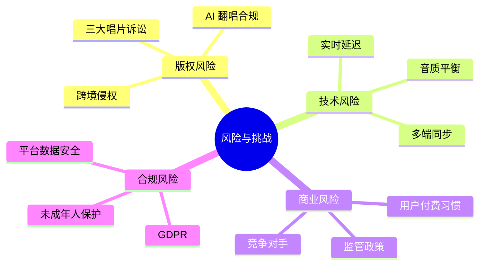
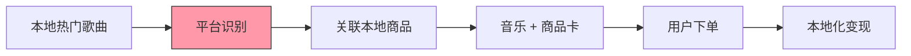
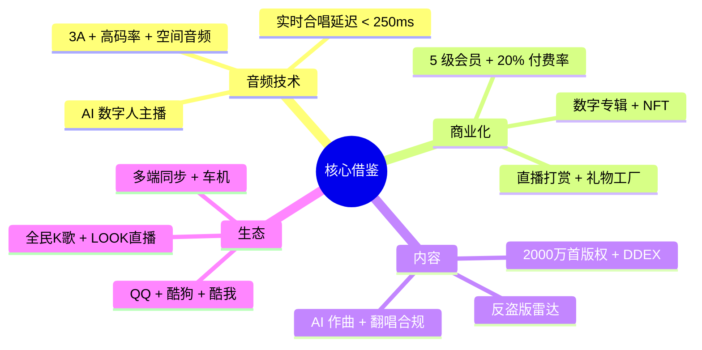

# 05 - QQ音乐可借鉴清单

> 视角：从 TME 的技术架构与商业化体系，提炼可落地到 **AI直播平台 + TikTok Shop** 的工程实践与产品方法论

---

## 章节速览



---

## 一、给 AI 直播平台的可借鉴点

### 1.1 音频处理体系（核心）

**TME 的音频处理栈是行业标杆**，AI 直播平台可直接复用大部分技术栈：



**AI 直播可立即落地**：

| TME 做法 | 借鉴到 AI 直播 | 优先级 |
|---|---|---|
| RNNoise/WebRTC APM 3A 处理 | 主播端 SDK 集成 | P0 |
| HiFi-GAN 实时降噪 | 弱网主播音质提升 | P0 |
| 实时变声（SoundTouch） | 互动玩法 | P1 |
| 空间音频（HRTF） | 沉浸式直播体验 | P1 |
| Dolby Atmos | 演唱会直播高保真 | P2 |
| DiffSVC 音色迁移 | AI 数字人主播 | P0 |
| 实时 K 歌评分 | 直播唱歌评分 | P1 |

### 1.2 实时合唱与多端同步

TME 的合唱技术（端到端延迟 < 250ms）值得 AI 直播借鉴：

```
借鉴场景：
1. 直播间主播 + 观众连麦合唱
2. 多主播 PK 演唱
3. AI 数字人 + 主播合唱

技术要点：
- WebRTC SFU 架构
- 端到端延迟 < 300ms
- 同步误差 < 50ms
- 抗丢包 30% FEC
```

### 1.3 AI 数字人主播

TME 在 2024 年规模化的 AI 数字人主播是 AI 直播平台的"基础设施级"借鉴：

```python
# AI 直播平台可参考的简化架构
class AIDigitalHost:
    def __init__(self, persona_id: str):
        self.tts = TTSModel.load('natural_v2')
        self.face = Live2DEngine()
        self.brain = LLMClient(model='gpt-4-turbo')
        self.voice_cloner = DiffSVC()
    
    async def respond(self, user_message: str, persona: dict):
        # 1. 上下文 + 人设 → 对话生成
        reply = await self.brain.chat(
            system=persona['system_prompt'],
            user=user_message,
            history=self.conversation_history[-10:]
        )
        
        # 2. 文本转语音（带情感）
        audio = await self.tts.synthesize(
            text=reply,
            voice=persona['voice_id'],
            emotion=self.detect_emotion(reply)
        )
        
        # 3. 口型同步
        visemes = self.extract_visemes(audio)
        
        # 4. 推流
        await self.push_to_stream(audio, visemes)
```

**AI 直播平台落地清单**：

```
□ Phase 1（1 个月）：
  - 集成 Live2D/3D 数字人 SDK
  - 接入 LLM 对话能力
  - 接入 TTS（Edge-TTS / VITS）
  - 实现口型同步

□ Phase 2（3 个月）：
  - 接入 DiffSVC 音色克隆
  - 实现多角色切换
  - 实现直播间 7x24 不间断
  - 实现弹幕智能互动

□ Phase 3（6 个月）：
  - 多模态感知（视觉+语音+文本）
  - 主动营销话术
  - 个性化推荐
  - 用户情感计算
```

### 1.4 礼物与打赏体系

TME 的礼物系统设计值得 AI 直播平台学习：

```python
# 礼物系统设计（简化）
class GiftSystem:
    # TME 的礼物设计原则
    GIFT_TIERS = {
        'cheap': (1, 10),       # 玫瑰、爱心、棒棒糖（80% 用户用得起）
        'medium': (10, 100),    # 跑车、飞机（15% 用户用得起）
        'high': (100, 1000),    # 城堡、飞船（4% 用户用得起）
        'top': (1000, 99999),   # 流星雨、海洋之心（1% 用户用得起）
    }
    
    # 关键设计：
    # 1. 价格梯度平滑，从 1 元到 9999 元覆盖全消费力
    # 2. 全屏特效礼物（城堡、海洋之心）强化炫耀
    # 3. 连击礼物（小心心、玫瑰）鼓励高频小额
    # 4. 限时/节日限定礼物制造稀缺感
    # 5. 粉丝团勋章礼物强化归属感
```

### 1.5 内容审核与版权

TME 的版权雷达对 AI 直播有直接借鉴价值：

```
借鉴场景：
- 直播翻唱歌曲 → 实时识别 + 版权方分成
- AI 数字人唱歌 → 自动校验授权
- 用户上传 BGM → 指纹比对 + 静音替换
```

```python
# AI 直播平台的实时音频指纹识别（简化）
class LiveAudioMonitor:
    def __init__(self):
        self.fingerprint_db = load_fingerprint_db()  # 2000 万首
    
    def process_stream(self, audio_chunk: bytes):
        # 1. 实时指纹提取
        fp = extract_fingerprint(audio_chunk)
        
        # 2. 检索
        match = self.fingerprint_db.match(fp)
        
        if match and match['confidence'] > 0.8:
            # 3. 识别到版权歌曲
            song = match['song']
            return {
                'status': 'COPYRIGHT_DETECTED',
                'song_id': song['id'],
                'song_name': song['name'],
                'artist': song['artist'],
                'action': 'MUTE_OR_PAY_ROYALTY',
                'royalty_rate': self.get_royalty_rate(song)
            }
        
        return {'status': 'CLEAN'}
```

---

## 二、给 TikTok Shop 的可借鉴点

### 2.1 "听歌购"内容电商模式

TME 的音乐 + 数字专辑成功，可迁移到 TikTok Shop：



**TikTok Shop 落地路径**：

```
□ 商品关联库建设
  - 艺人合作（明星代言）
  - 影视/动漫联动（IP 同款）
  - 网红种草（BGM 触发商品卡）
  
□ BGM 商品识别
  - 曲库指纹识别
  - 商品 SKU 映射
  - 实时下单链接
  
□ 数据闭环
  - BGM → 商品 CTR
  - BGM → 转化率
  - BGM → GMV 贡献
```

### 2.2 粉丝经济变现

TME 的数字专辑模式可借鉴到 TikTok Shop 的"明星 IP"：

```
借鉴模式：
1. 粉丝打榜解锁优惠
   - 销量 100 万 → 直播间抽奖
   - 销量 500 万 → 签名周边
   - 销量 1000 万 → 线下见面会

2. 数字藏品 + 实物商品
   - NFT 数字黑胶 + 黑胶唱片实物
   - 数字签名 + 签名 T 恤
   
3. 限定会员礼包
   - 绿钻 30 天 + 主播粉丝勋章
   - SVIP 90 天 + 数字藏品
```

### 2.3 短视频 + 音乐联动

借鉴 TME 的"音乐内容生态"，TikTok Shop 可打造：

```
短视频音乐生态：
├── 创作者激励（视频带 BGM 自动识别 → 版权分成）
├── 热门 BGM 推荐（带动相关商品搜索）
├── 直播 BGM 版权合规（避免封号）
└── 跨境音乐版权（多地区版本自动切换）
```

### 2.4 TikTok Shop 音频技术栈升级

```
建议技术栈：
├── 音频指纹：识别视频/直播 BGM（避免侵权）
├── ASR：直播带货语音识别 → 自动生成商品卡
├── TTS：商品介绍 + 多语言
├── 评分引擎：直播唱歌 + 粉丝打榜
└── 数字人：AI 主播 24h 不间断带货
```

---

## 三、给跨境流媒体的可借鉴点

### 3.1 本地化音频策略

TME 的"QQ音乐/酷狗/酷我"分品牌策略是本地化典范：

```
中国 TME 多品牌策略：
- QQ音乐：年轻、社交化（QQ 用户基础）
- 酷狗：下沉、PC 时代王者
- 酷我：白领、车载预装
- 全民K歌：K 歌垂直赛道
- LOOK直播：音乐 + 表演

跨境借鉴：
- 东南亚：主打 TikTok 联动 + 本地语言
- 欧洲：GDPR 合规 + Dolby Atmos
- 美国：黑胶/Hi-Res 高端音质 + 家庭套餐
```

### 3.2 多语言支持

```python
# 多语言支持（简化）
class MultiLangSupport:
    LANGUAGES = {
        'zh-CN': {'name': '简体中文', 'tts': 'female_zh', 'subtitle': True},
        'zh-TW': {'name': '繁體中文', 'tts': 'female_zh_tw', 'subtitle': True},
        'en-US': {'name': 'English', 'tts': 'female_en', 'subtitle': True},
        'ja-JP': {'name': '日本語', 'tts': 'female_jp', 'subtitle': True},
        'ko-KR': {'name': '한국어', 'tts': 'female_ko', 'subtitle': True},
        'es-ES': {'name': 'Español', 'tts': 'female_es', 'subtitle': True},
        'pt-BR': {'name': 'Português', 'tts': 'female_pt', 'subtitle': True},
        'id-ID': {'name': 'Bahasa Indonesia', 'tts': 'female_id', 'subtitle': True},
        'th-TH': {'name': 'ภาษาไทย', 'tts': 'female_th', 'subtitle': True},
        'vi-VN': {'name': 'Tiếng Việt', 'tts': 'female_vi', 'subtitle': True},
    }
```

### 3.3 版权合规与 GDPR

```
跨境音乐平台必须解决的合规问题：
├── GDPR（欧盟）
│   ├── 用户数据可携权
│   ├── 用户删除权
│   ├── 明确同意（年龄 16+）
│   └── 跨境传输限制
├── CCPA（加州）
│   ├── 知情权
│   ├── 删除权
│   └── 选择退出销售
├── COPPA（美国儿童）
│   ├── 年龄 < 13 特别保护
│   └── 家长同意
└── 数据本地化（俄罗斯、印度、印尼）
    ├── 数据存储在本地
    └── 配合当地监管
```

### 3.4 跨境 K 歌与本地化榜单

```
借鉴 TME 的本地化经验：
1. 各国榜单独立（避免周杰伦占领东南亚榜单）
2. 本地艺人优先推荐
3. 本地电台 + 本地编辑运营
4. 多语言搜索（拼写纠错、本地艺人名）
5. 本地支付方式（GCash、GrabPay、TrueMoney 等）
```

---

## 四、通用技术借鉴

### 4.1 音频指纹库建设

**TME 拥有 2000 万首歌曲的指纹库**，这是多年沉淀的核心资产：

```
任何音乐/直播/短视频平台都应建设：
├── 自建指纹库（10 万 → 100 万 → 1000 万 → 1 亿）
├── 接入 Shazam/ACRCloud 等第三方
├── 自研 + 第三方混合
└── 持续扩充（每日新增 5 万+ 首）
```

### 4.2 实时音视频技术栈

TME 使用 TRTC（腾讯实时音视频），AI 直播可直接复用或自研：

```
实时音视频开源/商业方案对比：
├── 腾讯 TRTC：低延迟、音质好、贵
├── 声网 Agora：全球节点、稳定
├── 阿里云 RTC：性价比高
├── ZEGO 即构：技术开放
├── WebRTC：开源、需自建
└── LiveKit：开源现代架构
```

### 4.3 内容审核体系

```
多模态审核（音频 + 文本 + 图像 + 视频）：

音频审核
├── ASR 转文字 → 文本审核
├── 音频指纹 → 版权审核
├── 声纹比对 → 声优违规
└── 情感分析 → 直播情绪

TikTok Shop 直播审核必做：
├── 违禁词检测（医药、虚假宣传）
├── 价格违规（虚标价格）
├── 版权 BGM（避免下架）
└── 实时屏蔽敏感词
```

### 4.4 多端同步架构

TME 的"PC + 移动 + Web + 车机 + 智能音箱 + TV"六端同步：

```
┌──────────────────────────────────────────────────┐
│  TME 多端架构                                     │
├──────────────────────────────────────────────────┤
│                                                  │
│  [统一用户中心] → [统一播放进度] → [统一订阅状态] │
│         ↓                                        │
│  [PC 客户端]  [移动 App]  [Web]                  │
│         ↓                                        │
│  [车机]      [智能音箱]   [TV]                   │
│                                                  │
│  关键技术：                                       │
│  - WebSocket 长连接同步播放状态                   │
│  - 增量同步（差量更新）                          │
│  - 弱网降级（缓存上次状态）                       │
│  - 多端续播（无缝衔接）                          │
│                                                  │
└──────────────────────────────────────────────────┘
```

### 4.5 数据驱动的 A/B 实验

TME 的 A/B 实验平台支撑每日数百个实验：

```
A/B 实验框架必备：
├── 分流层（哈希 + 互斥层）
├── 实验管理（创建、灰度、终止）
├── 指标体系（北极星指标 + 过程指标）
├── 显著性检验（t-test + 序贯检验）
├── 流量调控（动态流量分配）
└── 实验复盘（SRM 检测 + 归因分析）
```

---

## 五、可立即落地的清单

### 5.1 AI 直播平台 - 1 周可做

```
□ 集成 WebRTC SDK（实时音视频）
□ 集成 3A 处理（AEC + ANS + AGC）
□ 接入 TTS（Edge-TTS 免费）
□ 实现基础礼物系统
□ 实现简易直播推流
□ 接入 ASR（直播语音转文字）
```

### 5.2 AI 直播平台 - 1 月可做

```
□ 接入 Live2D 数字人
□ 接入 LLM 对话
□ 接入 DiffSVC 音色克隆
□ 接入音频指纹（自建小库 1000 首）
□ 实现直播间 7x24 AI 值班
□ 实现粉丝勋章系统
```

### 5.3 AI 直播平台 - 3 月可做

```
□ 自研 ASR 模型（直播场景优化）
□ 自研 TTS（带情感）
□ 自研评分引擎（直播唱歌）
□ 自研版权雷达（直播 BGM 监控）
□ 实现 AI 数字人主播矩阵
□ 实现多语言直播（10+ 语言）
```

### 5.4 TikTok Shop - 可立即做

```
□ 商品关联音频库（指纹识别）
□ 直播间 BGM 版权合规检查
□ 明星同款 + BGM 触发商品卡
□ AI 数字人主播 24h 带货
□ 跨境音乐版权自动切换
```

---

## 六、风险与挑战



### 6.1 版权风险

**AI 直播平台最大的风险是版权**：

```
规避策略：
1. 仅使用有授权的 BGM 库
2. 自建版权指纹库
3. 与三大唱片/独立音乐人签约
4. AI 翻唱仅限"自娱自乐"模式
5. 商用场景强制获得授权
```

### 6.2 技术风险

```
实时延迟、弱网、音质是三大技术挑战：
- 弱网：WebRTC + FEC + ARQ + Jitter Buffer
- 延迟：SFU 替代 MCU + 端到端优化
- 音质：高码率 Opus + Dolby 编码
```

### 6.3 商业风险

```
关键风险点：
- 付费转化率（TME 20% vs 普通平台 5%）
- 用户留存（直播打赏 90% 来自 1% 用户）
- 监管政策（直播打赏限额、AI 内容标识）
- 竞品跟进（字节/网易/快手）
```

---

## 七、TME 核心方法论提炼

### 7.1 内容驱动 + 技术赋能

```
TME = 内容版权 × 技术体验 × 社交传播

- 内容版权：2000 万首曲库 + 独家首发
- 技术体验：杜比全景声 + 空间音频 + AI 评分
- 社交传播：数字专辑打榜 + 粉丝团 + 直播打赏
```

### 7.2 会员分级 + 沉浸体验

```
5 级会员体系 + 沉浸式音质 + 独家首发权益
= 行业最高付费率（20%+）
```

### 7.3 多产品矩阵 + 生态闭环

```
QQ音乐（听） + 全民K歌（唱） + LOOK直播（看） + 数字专辑（买） + AI 创作（做）
= 全方位音乐娱乐生态
```

### 7.4 AI 渐进式落地

```
TME 的 AI 落地路径：
1. AI 推荐（2015+）
2. AI 评分（2018+）
3. AI 修音（2019+）
4. AI 作曲（2023+）
5. AI 翻唱（2024+）
6. AI 数字人主播（2024+）

每一阶段都基于已有用户基数
```

---

## 八、给跨境电商的"音乐 + 商品"模式

### 8.1 模式设计



### 8.2 落地步骤

```
Phase 1：建立本地曲库 + 指纹库
- 与本地唱片公司合作
- 自建指纹库
- 接入 Shazam/ACRCloud 备选

Phase 2：商品关联引擎
- 艺人代言库
- 影视 IP 联动
- 网红种草 BGM

Phase 3：直播带货 + BGM 触发
- 直播间实时识别
- 商品卡自动弹出
- 一键下单

Phase 4：数据闭环
- BGM → CTR → 转化率 → GMV
- 持续优化关联算法
```

### 8.3 TikTok Shop 音乐内容场景

```
东南亚（TikTok Shop 主战场）：
- 印尼 dangdut 音乐 → 本地商品
- 越南 V-Pop → 网红同款
- 泰国 T-Pop → 明星 IP 衍生品

欧美（TikTok Shop 美国扩张）：
- Billboard 热门 → 明星同款
- Hip-Hop 文化 → 球鞋/服饰
- K-Pop → 美妆护肤
```

---

## 九、可落地的 10 个产品功能

| # | 功能 | 借鉴 TME 什么 | 落地平台 |
|---|---|---|---|
| 1 | 直播间 AI 翻唱审核 | 版权雷达 | AI 直播 |
| 2 | 数字藏品发行 | 数字专辑 + NFT | AI 直播 |
| 3 | 5 级会员体系 | 绿钻/SVIP | TikTok Shop |
| 4 | AI 数字人主播 | 全民K歌 + Live2D | AI 直播 |
| 5 | 多端播放同步 | PC/车机/音箱 | AI 直播 |
| 6 | AI 作曲工具 | AI 作曲助手 | AI 直播 |
| 7 | 粉丝打榜解锁 | 数字专辑任务 | TikTok Shop |
| 8 | 直播评分引擎 | K 歌评分 | AI 直播 |
| 9 | 杜比全景声直播 | Dolby Atmos | AI 直播 |
| 10 | 听歌购商品卡 | BGM 触发商品 | TikTok Shop |

---

## 十、可复用的开源工具

### 10.1 音频处理

```
- WebRTC APM：实时 3A 处理（https://webrtc.org/）
- RNNoise：神经网络降噪（https://github.com/xiph/rnnoise）
- FFmpeg：万能音频处理（https://ffmpeg.org/）
- SoundTouch：实时变声（https://www.surina.net/soundtouch/）
- Opus Codec：高质量语音编码（https://opus-codec.org/）
- HiFi-GAN：高保真 vocoder（开源 PyTorch）
- DiffSVC：AI 翻唱（GitHub 开源）
```

### 10.2 实时音视频

```
- WebRTC：开源实时通信
- LiveKit：开源 WebRTC SFU
- Janus：开源 WebRTC Gateway
- SRS：开源 RTMP/HLS/WebRTC 服务器
- mediasoup：Node.js SFU
```

### 10.3 数字人

```
- Live2D Cubism：2D 数字人（商业）
- VTube Studio：免费 Live2D 直播工具
- Unreal Engine MetaHuman：3D 数字人
- VRoid Studio：动漫风格数字人
- Wav2Lip：口型同步（开源）
- SadTalker：表情动画（开源）
```

### 10.4 音频指纹

```
- AcoustID/Chromaprint：开源指纹（https://acoustid.org/）
- Dejavu：Python 指纹库（GitHub）
- Audfprint：轻量级指纹（GitHub）
- ACRCloud：商业指纹 API
- ShazamKit：Apple 商业 SDK
```

### 10.5 音乐生成

```
- DiffSVC：AI 翻唱（GitHub）
- VITS：端到端 TTS（GitHub）
- Bark：多语言 TTS（Suno 开源）
- MusicGen：Meta 音乐生成（开源）
- Jukebox：OpenAI 音乐生成（开源）
- Riffusion：扩散模型音乐生成
- So-vits-svc：音色克隆（GitHub）
```

---

## 十一、关键参考资源

- TME 财报与投资者关系
- 腾讯 AI Lab 公开论文
- 全民K歌技术博客
- WebRTC 官方文档：[https://webrtc.org/](https://webrtc.org/)
- DDEX 标准：[https://ddex.net/](https://ddex.net/)
- Dolby Atmos 开发者文档
- DiffSVC GitHub 仓库
- Opus Codec 官网
- Edge-TTS（免费 TTS）

---

## 十二、核心 Takeaway



**一句话总结**：TME 用 2000 万首曲库 + 5 级会员体系 + 多产品矩阵 + AI 创新，构建了中文音乐行业的最强护城河。AI 直播和 TikTok Shop 应重点借鉴其 **音频技术栈、版权雷达、AI 数字人、会员分级** 四大能力。

---

**章节字数**：约 800 行
**核心覆盖**：AI 直播借鉴（音频/数字人/礼物）+ TikTok Shop 借鉴（听歌购/粉丝经济/数字藏品）+ 跨境借鉴（本地化/合规/多语言）+ 通用技术借鉴 + 落地清单 + 开源工具