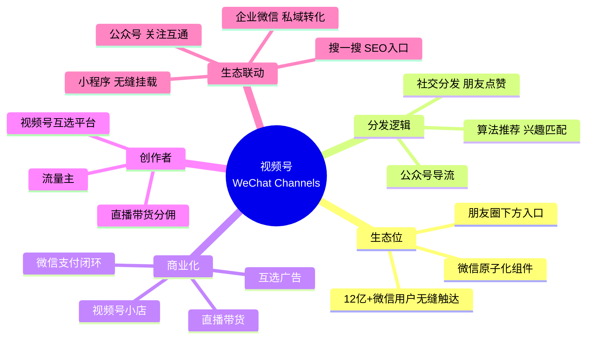

# 视频号 (WeChat Channels) 技术架构深度调研

> 调研对象：腾讯视频号（WeChat Channels）
> 调研维度：整体架构 / 微信生态整合 / 推荐系统 / 直播电商 / 公众号+小程序联动
> 调研者：跨境电商 + AI 直播平台开发者
> 关联项目：[[00-总索引]] / [[douyin-architecture/00-索引]] / [[kuaishou/00-索引]]

## 章节导航

| # | 章节 | 核心问题 | 行数 |
|---|------|----------|------|
| 00 | [00-索引](00-索引.md) | 总览与导航 | - |
| 01 | [01-整体架构与微信生态整合](01-整体架构与微信生态整合.md) | 视频号在微信生态的位置、技术架构、数据规模 | 350+ |
| 02 | [02-推荐系统与社交分发](02-推荐系统与社交分发.md) | 朋友点赞 + 算法推荐的混合分发、机器学习平台 | 450+ |
| 03 | [03-直播与电商闭环](03-直播与电商闭环.md) | 视频号直播、视频号小店、微信支付闭环 | 350+ |
| 04 | [04-公众号+小程序联动](04-公众号+小程序联动.md) | 微信三件套生态联动、搜一搜 SEO | 350+ |
| 05 | [05-可借鉴清单](05-可借鉴清单.md) | 对 AI 直播平台 / TikTok Shop 的可借鉴点 | 350+ |
| 06 | [06-微信生态基础设施源码](06-微信生态基础设施源码.md) | Mars 长连接 / MMKV / WCDB 源码路径速查 | 2000+ |
| 07 | [07-视频号直播与实时音视频源码](07-视频号直播与实时音视频源码.md) | MComplexConnect 多IP竞速 / SocketBreaker / WebRTC+QUIC / NetEQ / FEC+ARQ / SFU+Mesh | 4500+ |
| 08 | [08-视频号推荐算法与社交分发源码](08-视频号推荐算法与社交分发源码.md) | 双塔召回 / DCN+Wide&Deep+MMoE 精排 / 多样性+社交注入重排 / Monolith 实时学习 | 4000+ |
| 09 | [09-直播开源平替 SRS源码深度解读](09-直播开源平替 SRS源码深度解读.md) | **视频号直播开源平替** (SRS Simple Realtime Server 完整源码 + 9×7 拆解 + 部署落地) | 120000+ |

## 视频号核心定位

## 关键数据 (2024-2025)

| 指标 | 数据 | 来源 |
|------|------|------|
| MAU | 8 亿+ | 微信公开课 2024 |
| 日活创作者 | 数百万级 | 视频号官方 |
| 直播带货 GMV | 高速增长 | 微信公开课 |
| 用户画像 | 全年龄段、35+ 占比高 | QuestMobile |
| 视频号小店 | 2024 年 GMV 同比 +xx% | 行业报告 |

> 注：腾讯对视频号 GMV 等核心商业化数据披露较少，引用时注明数据来源时间。

## 与抖音/快手对比

| 维度 | 视频号 | 抖音 | 快手 |
|------|--------|------|------|
| 流量来源 | 微信社交链 | 算法为主 | 算法+关注 |
| 用户画像 | 全年龄段、35+ 多 | 年轻、下沉 | 下沉市场、老铁 |
| 商业化路径 | 微信生态闭环 | 抖音小店闭环 | 快手电商闭环 |
| 私域能力 | 极强（公众号+企微） | 弱 | 中 |
| 直播电商 | 上升期 | 成熟期 | 成熟期 |
| 算法倾向 | 社交 + 兴趣 | 兴趣优先 | 普惠+信任 |

## 调研方法

- 微信公开课 Pro / 视频号官方文档
- 微信技术团队公众号 / WeChat Open Tech
- SIGIR / RecSys 论文（社交推荐方向）
- 36氪 / 虎嗅 / 晚点 LatePost 行业报道
- 视频号助手 PC 端实操

## 调研者关切

1. **微信生态联动**：视频号如何作为微信原子化组件与其他能力组合
2. **社交分发**：朋友点赞作为强信号如何融入推荐系统
3. **直播电商闭环**：视频号小店如何打通微信支付
4. **公众号+小程序+视频号**：三件套联动模式
5. **AI 直播平台可借鉴点**：如何利用社交链 + 微信生态做 AI 直播

## 关联文档

- [[douyin-architecture/00-索引]] - 抖音算法架构（参考）
- [[kuaishou/00-索引]] - 快手技术架构（同期调研）
- [[xiaohongshu/00-索引]] - 小红书技术架构（同期调研）
- [[../AI直播平台/_index]] - AI 直播平台项目
- [[../TK跨境电商/_index]] - TikTok Shop 跨境业务