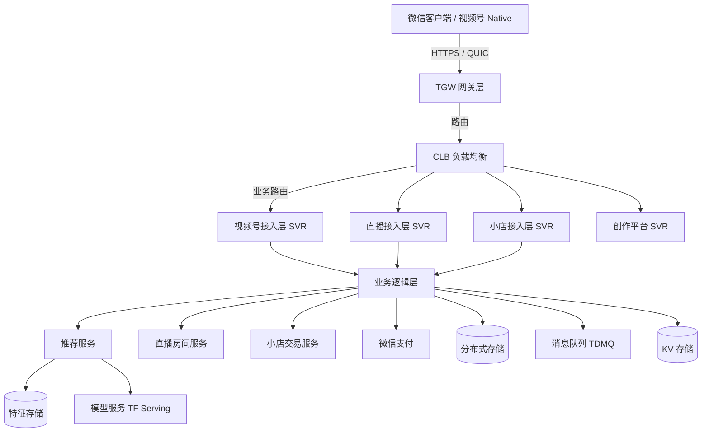
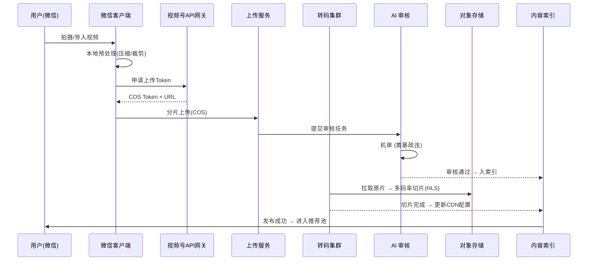
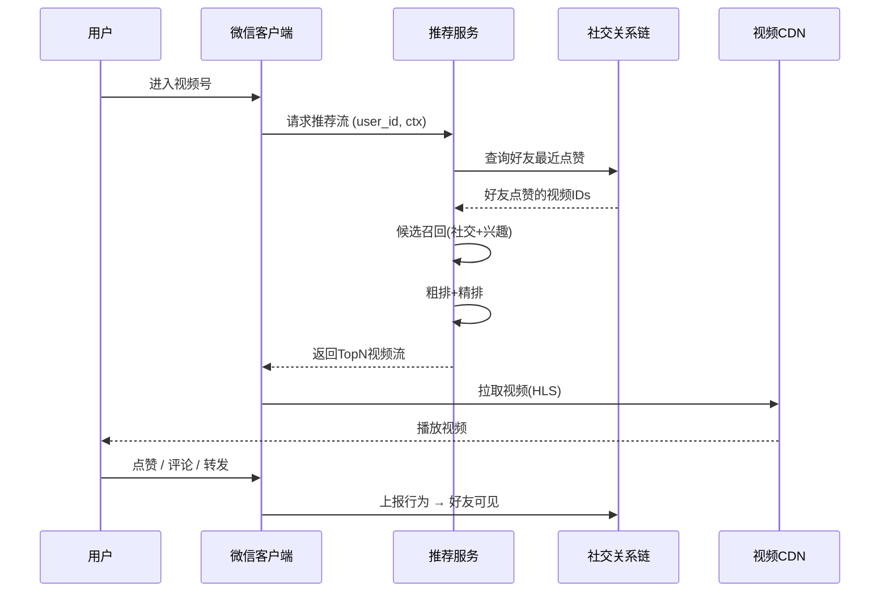
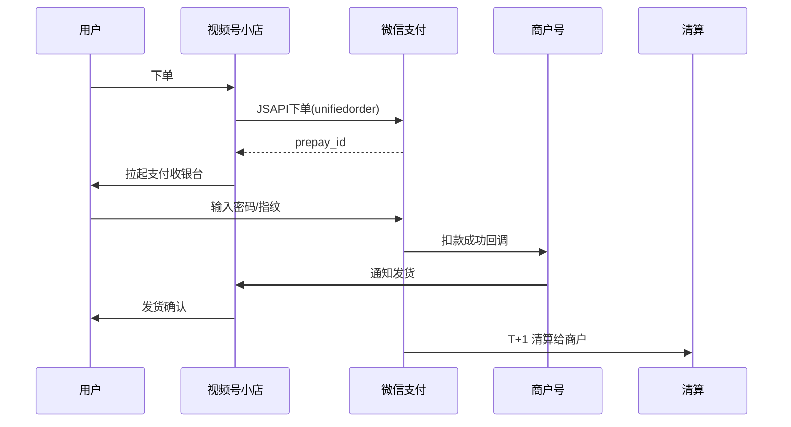

# 01 - 视频号整体架构与微信生态整合

## 一、视频号在微信生态的位置

### 1.1 微信原子化组件矩阵

视频号不是独立的 App，而是微信（WeChat）这个超级 App 内部的"原子化组件"，与公众号、小程序、企业微信、看一看、搜一搜、微信支付并列，共同构成微信的内容+商业基础设施。

```
微信 (WeChat) 12亿+ MAU
├── 通信层
│   ├── 聊天 (Chat)
│   ├── 群聊 (Group)
│   └── 朋友圈 (Moments)
├── 内容层
│   ├── 公众号 (Official Account) ──┐
│   ├── 视频号 (Channels)         ──┤── 内容三件套
│   ├── 小程序 (Mini Program)     ──┘
│   └── 看一看 (Top Stories)
├── 商业层
│   ├── 微信支付 (WeChat Pay)
│   ├── 视频号小店 (Channel Shop)
│   └── 企业微信 (WeCom)
└── 触达层
    ├── 搜一搜 (Search)
    ├── 城市服务 / 医疗健康
    └── 视频号直播 (Live)
```

视频号的关键定位是：**位于朋友圈入口下方、聊天列表置顶可关闭、搜一搜内容源之一、公众号文章可插入视频号卡片、小程序可跳转视频号、视频号可挂载小程序。**

### 1.2 视频号入口矩阵

```
┌─────────────────────────────────────────────────────────┐
│                     微信主界面                            │
│                                                          │
│   [聊天][通讯录][发现][我]                                │
│                                                          │
│   "发现" Tab 内:                                          │
│   ┌──────────────────────────┐                           │
│   │ 朋友圈                    │  ← 原有内容入口           │
│   ├──────────────────────────┤                           │
│   │ 视频号                    │  ← 视频号入口（2020 加入）│
│   ├──────────────────────────┤                           │
│   │ 直播                     │  ← 直播广场                │
│   ├──────────────────────────┤                           │
│   │ 附近                     │                            │
│   ├──────────────────────────┤                           │
│   │ 搜一搜                   │  ← 视频号内容 SEO          │
│   ├──────────────────────────┤                           │
│   │ 购物                     │  ← 视频号小店入口          │
│   └──────────────────────────┘                           │
└─────────────────────────────────────────────────────────┘
```

### 1.3 视频号与微信其他组件的联通

| 联通场景 | 描述 |
|----------|------|
| 公众号文章插入视频号 | 公众号编辑器支持插入视频号卡片，图文+视频混排 |
| 视频号主页绑定公众号 | 视频号 profile 可"关联公众号"，互导粉丝 |
| 视频号挂载小程序 | 短视频/直播可挂载小程序卡片，点击跳转 |
| 小程序跳转视频号 | 小程序内通过 `wx.navigateToVideoChannel` API 跳转 |
| 视频号绑定企业微信 | 主页可关联企微客服，私域沉淀 |
| 搜一搜视频号结果 | 关键词命中视频号内容，导流反哺 |
| 微信支付购买视频号小店商品 | 支付链路原生，无需跳转外部 |
| 视频号直播打赏 | 微信钱包 → 直播间打赏 |
| 朋友圈分享视频号 | 长按分享 / 链接分享视频号内容到朋友圈 |
| 聊天窗口分享视频号 | 单聊/群聊可分享视频号卡片 |

## 二、视频号整体技术架构

### 2.1 客户端架构（基于微信客户端）

视频号没有独立 App，运行在微信客户端内，采用 **微信原生插件化 (WMP插件框架)** 模式：

```
┌────────────────────────────────────────────────────┐
│                微信客户端 (WeChat)                   │
│                                                      │
│   Native Container (Android Activity / iOS ViewController)
│   ├─ WebView 容器                                    │
│   ├─ 小程序容器 (WAWebview)                          │
│   ├─ 视频号 Native Module                            │
│   │   ├─ 视频播放器 (LiteAV / TXLivePlayer)          │
│   │   ├─ 推流 SDK (TXLivePusher)                     │
│   │   ├─ 互动层 (点赞、评论、转发 UI)                 │
│   │   └─ 数据采集 (埋点 SDK)                         │
│   └─ 通用能力 (登录、支付、位置、相机、麦克风)        │
└────────────────────────────────────────────────────┘
            │
            ▼ (HTTPS / WSS / QUIC)
   ┌──────────────────────────────────────┐
   │          微信后台服务集群              │
   │  - 视频号业务后端                      │
   │  - 推荐服务                            │
   │  - 直播服务                            │
   │  - 视频号小店                          │
   │  - 微信支付                            │
   │  - CDN / 视频处理                      │
   └──────────────────────────────────────┘
```

### 2.2 后端服务架构

视频号后端继承了微信后台的分布式服务化架构（自研 + 部分开源）：



### 2.3 关键基础设施

| 组件 | 选型 | 说明 |
|------|------|------|
| 网关 | TGW (Tencent Gateway) | 微信自研 7 层/4 层网关 |
| RPC 框架 | ToB / Svrkit | 微信自研 RPC |
| 配置中心 | WXConfig | 微信自研 |
| 消息队列 | TDMQ / Kafka | 高吞吐消息 |
| KV 存储 | Pigeon / Twemproxy + SSDB | 微信自研 KV |
| 数据库 | MySQL (TXSQL) + 自研分布式 DB | 微信改造 MySQL |
| 缓存 | Redis Cluster | 通用 |
| 监控 | 立体化监控 + CAT | 微信自研 |
| 视频处理 | 自研转码集群 + AI 审核 | 多码率切片 |
| CDN | 腾讯云 CDN | 边缘加速 |
| 机器学习 | Angel + TF Serving | 分布式训练 |

## 三、视频号核心数据规模

### 3.1 用户与流量

| 指标 | 数据 | 时间 |
|------|------|------|
| 微信 MAU | 13 亿+ | 2024 Q3 |
| 视频号 MAU | 8 亿+ | 2024 |
| 视频号 DAU | 5 亿+（行业估计） | 2024 |
| 用户日均使用时长 | 50+ 分钟 | 微信公开课 |
| 直播日均观看 | 显著增长 | 2024 |

### 3.2 内容规模

| 指标 | 数据 |
|------|------|
| 日均上传视频 | 数千万级 |
| 创作者数量 | 数百万级活跃 |
| 直播开播数 | 数十万/日（高峰期） |
| 视频号小店数量 | 持续增长 |

> 视频号官方较少披露绝对数字，公开数据多为行业测算。

## 四、视频号链路：从发布到消费

### 4.1 发布链路



### 4.2 消费链路



## 五、视频号与微信生态整合的具体技术实现

### 5.1 公众号+视频号互通

**关联账号 (bound account) 机制**：

```yaml
# 公众号后台配置
mp_bind_channel:
  app_id: wx_official_appid_xxx
  channel_id: channel_xxx
  bind_type: "primary"  # primary/secondary
  # primary: 视频号主绑公众号
  # secondary: 公众号主绑视频号
```

**互通行为**：
1. 视频号 profile 展示公众号入口
2. 公众号 profile 展示视频号入口
3. 公众号文章可插入视频号动态卡片（实时同步）
4. 公众号粉丝可收到视频号开播提醒（订阅后）
5. 公众号文章阅读 → 引导关注视频号

### 5.2 视频号挂载小程序

视频号短视频和直播间均可挂载小程序卡片：

```javascript
// 视频号服务商接口 - 挂载小程序
// ChannelService API
{
  "item_id": "video_xxx",
  "mini_program_path": "pages/product/detail?id=123",
  "mini_program_appid": "wx_appid_xxx",
  "title": "立即购买",
  "type": "shopping"
}
```

**直播间挂载示例**：

```javascript
// 直播间小程序挂载配置
{
  "room_id": "live_xxx",
  "promotion": [
    {
      "type": "miniprogram",
      "appid": "wx_appid_xxx",
      "path": "pages/product/detail?id=123",
      "title": "立即抢购"
    },
    {
      "type": "goods",   // 视频号小店商品
      "product_id": "p_xxx"
    }
  ]
}
```

### 5.3 微信支付一体化

视频号小店商品 / 直播带货商品 / 小程序商品均走微信支付：



## 六、视频号后台团队组织

视频号是腾讯 WXG (微信事业群) 下的核心业务，团队划分：

- **视频号产品部**：产品、运营
- **视频号技术部**：客户端、服务端、算法
- **视频号商业化部**：广告、电商
- **视频号创作平台部**：PC 端助手、创作者工具
- **联合团队**：与微信支付、公众号、小程序团队深度联动

## 七、可借鉴架构思路

1. **超级 App + 原子化组件**：将核心业务作为平台能力暴露给其他业务
2. **社交链作为推荐强信号**：微信关系链是视频号冷启动和提升分发的关键
3. **支付作为闭环基础**：微信支付让商业化链路极短
4. **多端复用**：视频号无需独立 App，复用微信基础设施
5. **私域沉淀**：视频号流量可沉淀到公众号+企微，长期复用

## 八、参考资料

- [微信公开课 Pro](https://weread.qq.com/) 视频号专场
- 微信技术团队：WeChat Open Tech
- 36氪《视频号全景报告》
- 晚点 LatePost 视频号系列报道
- QuestMobile 视频号用户画像

## 附：腾讯云视频号相关产品

- **腾讯云视立方·直播 SDK (MLVB)**：视频号直播推流底层
- **腾讯云视立方·短视频 SDK (UGSV)**：视频号录制/编辑底层
- **TXSS 媒体处理**：视频转码、截图、审核
- **TI 平台**：视频内容审核 AI
- **天御**：反作弊、风控