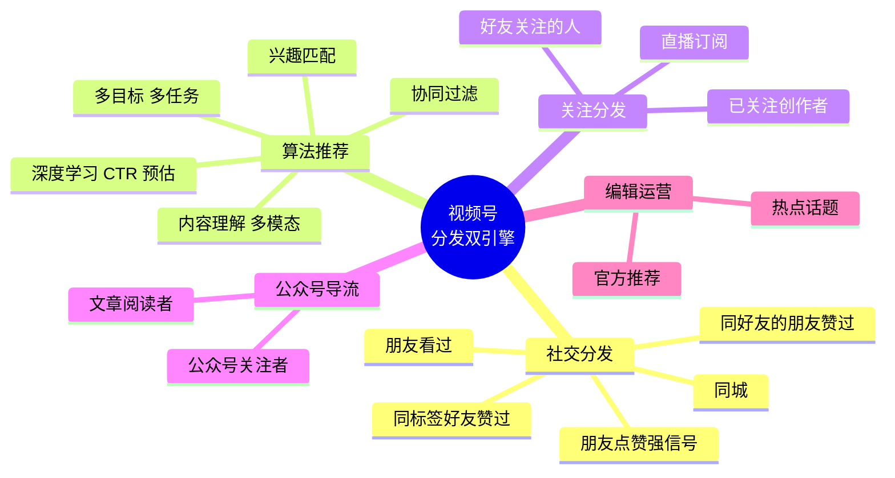
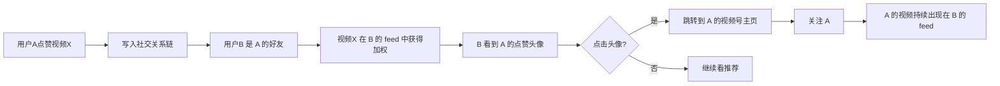
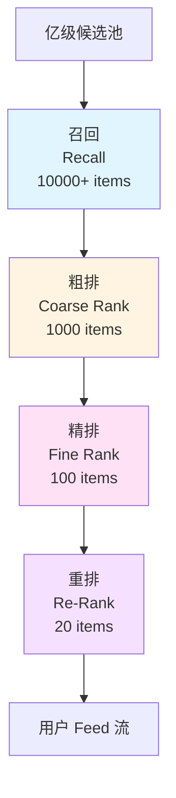
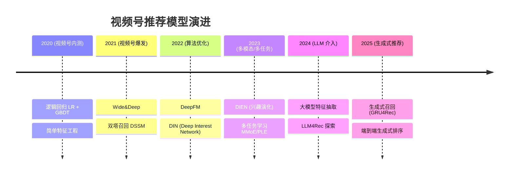
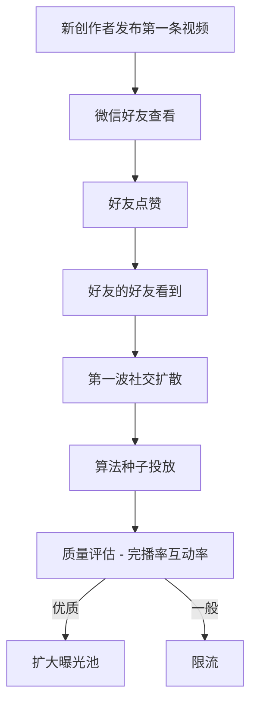

# 02 - 视频号推荐系统与社交分发

## 一、视频号分发的双引擎：社交 + 算法

视频号的推荐系统是**社交分发 (Social-based)** 与**算法推荐 (Algorithm-based)** 双引擎融合，与抖音"算法优先 + 关注弱化"、快手"普惠分发 + 关注强化"形成差异化。



### 1.1 与抖音/快手分发差异

| 维度 | 视频号 | 抖音 | 快手 |
|------|--------|------|------|
| 主导信号 | 社交 + 算法 接近 1:1 | 算法 > 社交 > 关注 | 关注 + 普惠分发 |
| 朋友点赞权重 | 极高 | 低（私聊分享除外） | 中 |
| 同质内容曝光 | 重社交，去同质化弱 | 重算法，去同质化强 | 中等 |
| 关注页地位 | 强（关注 Tab 显著） | 弱 | 强 |
| 长尾创作者 | 中等曝光 | 难出头 | 普惠曝光 |
| 直播分发 | 社交+算法 | 算法+关注 | 私域+算法 |

## 二、社交分发机制详解

### 2.1 朋友点赞的强信号地位

视频号最显眼的 UI 设计就是：**朋友点赞的头像会出现在视频下方**，这构成了视频号最强的社交推荐信号。



**社交信号权重示例（推算）**：

| 信号 | 预估权重 | 说明 |
|------|---------|------|
| 朋友点赞 | 10x | 极强 |
| 朋友评论 | 5x | 强 |
| 朋友转发到群 | 8x | 极强 |
| 朋友关注的人发布 | 3x | 中 |
| 同城 + 兴趣相似 | 2x | 中 |
| 纯兴趣匹配 | 1x | 基线 |

### 2.2 关系链数据来源

视频号可直接利用微信多年沉淀的社交图谱：

| 关系来源 | 数据维度 |
|----------|---------|
| 微信好友 | 双向关注关系 |
| 微信群聊 | 同群成员（弱关系） |
| 通讯录 | 手机号匹配 |
| 公众号关注 | 兴趣标签 |
| 视频号关注 | 显式关注 |
| 视频号互动 | 点赞/评论/转发历史 |

### 2.3 社交召回通道

```
┌────────────────────────────────────────────────────┐
│          视频号召回层 (Recall)                        │
├────────────────────────────────────────────────────┤
│                                                      │
│  【社交召回】                                         │
│   ├── 好友点赞召回 (last 7 days, top-K)               │
│   ├── 好友评论召回 (last 7 days)                      │
│   ├── 好友转发召回 (last 30 days)                     │
│   ├── 好友关注的人的视频 (关注扩散)                    │
│   └── 同标签好友赞过 (基于 LBS/兴趣标签)              │
│                                                      │
│  【兴趣召回】                                         │
│   ├── 双塔向量召回 (user_emb, item_emb)               │
│   ├── item-CF 协同过滤                               │
│   ├── 关注扩散 (关注链 1-hop/2-hop)                   │
│   └── 相似视频召回 (item-to-item)                    │
│                                                      │
│  【内容召回】                                         │
│   ├── 多模态内容理解标签匹配                           │
│   ├── 话题/活动召回                                   │
│   └── 同城召回                                       │
│                                                      │
└────────────────────────────────────────────────────┘
```

## 三、推荐系统整体架构

### 3.1 经典漏斗架构



### 3.2 多阶段目标

| 阶段 | 模型 | 候选量 | 关键特征 | 耗时 |
|------|------|--------|---------|------|
| 召回 | 双塔 / DSSM / 协同过滤 | 10000+ | user_emb、tag、social | <50ms |
| 粗排 | 轻量 DNN / Wide&Deep | 1000 | 交叉特征 | <30ms |
| 精排 | DeepFM / DIN / DIEN | 100 | 全特征 + 实时行为 | <50ms |
| 重排 | 多目标融合 + 多样性 | 20 | 上下文、社交关系 | <20ms |

### 3.3 多目标融合

视频号精排模型需要同时优化多个目标：

```python
# 精排多目标融合示例（伪代码）
class VideoChannelRankModel(nn.Module):
    def __init__(self):
        self.base = DIN(self.feature_dim)  # DIN 基础
        self.heads = nn.ModuleDict({
            'ctr': nn.Linear(64, 1),     # 点击率
            'like': nn.Linear(64, 1),     # 点赞率
            'comment': nn.Linear(64, 1),  # 评论率
            'forward': nn.Linear(64, 1),  # 转发率
            'follow': nn.Linear(64, 1),   # 关注率
            'finish': nn.Linear(64, 1),   # 完播率
            'long_view': nn.Linear(64, 1),# 长播放率
            'live_click': nn.Linear(64, 1),# 进直播间率
            'shop_click': nn.Linear(64, 1),# 进小店率
        })
    
    def forward(self, x):
        rep = self.base(x)
        return {k: torch.sigmoid(head(rep)) for k, head in self.heads.items()}
    
    def final_score(self, preds, weights):
        # 加权融合
        score = sum(weights[k] * preds[k] for k in weights)
        return score

# 融合权重示例
weights = {
    'ctr': 0.10,
    'like': 0.20,      # 社交信号 - 点赞权重大
    'comment': 0.10,
    'forward': 0.20,   # 社交信号 - 转发权重大
    'follow': 0.15,
    'finish': 0.10,
    'long_view': 0.05,
    'live_click': 0.05,
    'shop_click': 0.05,
}
```

## 四、特征工程

### 4.1 用户特征

```
用户特征 (User Features)
├── 基础属性
│   ├── age / gender / location
│   └── device / network / os
├── 行为序列
│   ├── 历史点击视频 (last 100/30/7 days)
│   ├── 历史点赞视频
│   ├── 历史评论视频
│   ├── 历史转发视频
│   └── 历史关注创作者
├── 社交特征
│   ├── 好友数
│   ├── 活跃好友数 (last 30d)
│   ├── 社交影响分 (社交活跃度)
│   └── 朋友圈互动强度
├── 兴趣画像
│   ├── 兴趣标签分布 (top-K)
│   ├── 消费时长统计
│   └── 活跃时段
└── 消费能力
    ├── 直播打赏历史
    ├── 小店购买历史
    └── 支付活跃度
```

### 4.2 视频/物品特征

```
物品特征 (Item Features)
├── 内容特征
│   ├── 视频时长 / 分辨率 / 码率
│   ├── 多模态标签 (CV/NLP/ASR)
│   ├── 话题标签
│   └── 文本标题/描述
├── 创作者特征
│   ├── 创作者粉丝数
│   ├── 创作者历史互动率
│   ├── 创作者类型 (个人/媒体/品牌)
│   └── 创作者认证状态
├── 统计特征
│   ├── 曝光数 / 点击数 (CTR)
│   ├── 点赞数 / 评论数 / 转发数
│   ├── 完播率 / 平均观看时长
│   └── 同龄/同城人群点击率
├── 生态特征
│   ├── 是否绑定公众号
│   ├── 是否关联小程序
│   └── 是否有视频号小店商品
└── 时间特征
    ├── 发布时间
    └── 时效性衰减
```

### 4.3 上下文特征

```
上下文特征 (Context Features)
├── 设备上下文
│   ├── network (wifi/4g/5g)
│   ├── device tier
│   └── battery level
├── 时间上下文
│   ├── hour_of_day
│   ├── day_of_week
│   └── is_holiday
├── 地理上下文
│   ├── city
│   ├── 城市等级
│   └── 同城候选数
└── 行为上下文
    ├── session 内已曝光
    ├── session 内已点击
    └── 距上次点赞时长
```

## 五、深度学习模型演进

### 5.1 推荐模型时间线



### 5.2 DIN / DIEN 详解

DIN (Deep Interest Network) 是视频号精排核心模型，关键思想：**用注意力机制建模用户兴趣的局部激活**。

```python
# DIN Attention 简化版
class DINAttention(nn.Module):
    """对用户历史行为序列做注意力加权"""
    def __init__(self, embed_dim, hidden_units):
        super().__init__()
        self.mlp = nn.Sequential(
            nn.Linear(embed_dim * 4, hidden_units[0]),
            nn.PReLU(),
            nn.Linear(hidden_units[0], hidden_units[1]),
            nn.PReLU(),
            nn.Linear(hidden_units[1], 1),
        )
    
    def forward(self, query, keys, keys_length):
        """
        query: 候选视频 emb [B, D]
        keys: 历史视频 emb [B, T, D]
        """
        B, T, D = keys.shape
        # 拼接 [query, key, query*key, query-key]
        query_exp = query.unsqueeze(1).expand(B, T, D)
        att_input = torch.cat([query_exp, keys, query_exp*keys, query_exp-keys], dim=-1)
        att_scores = self.mlp(att_input).squeeze(-1)  # [B, T]
        # mask padding
        mask = torch.arange(T, device=keys.device).expand(B, T) < keys_length.unsqueeze(-1)
        att_scores = att_scores * mask.float()
        att_scores = F.softmax(att_scores, dim=-1)
        # 加权求和
        output = (att_scores.unsqueeze(-1) * keys).sum(dim=1)
        return output  # [B, D]
```

### 5.3 多任务学习 MMoE / PLE

视频号多目标融合使用 **MMoE (Multi-gate Mixture-of-Experts)** 或 **PLE (Progressive Layered Extraction)**：

```python
# MMoE 示例
class MMoE(nn.Module):
    def __init__(self, input_dim, n_experts, n_tasks, expert_dim):
        super().__init__()
        self.experts = nn.ModuleList([
            nn.Sequential(nn.Linear(input_dim, expert_dim), nn.ReLU())
            for _ in range(n_experts)
        ])
        # 每个任务一个 gate
        self.gates = nn.ModuleList([
            nn.Linear(input_dim, n_experts) for _ in range(n_tasks)
        ])
        # 任务塔
        self.towers = nn.ModuleList([
            nn.Sequential(
                nn.Linear(expert_dim, expert_dim//2),
                nn.ReLU(),
                nn.Linear(expert_dim//2, 1),
            ) for _ in range(n_tasks)
        ])
    
    def forward(self, x):
        expert_outs = torch.stack([e(x) for e in self.experts], dim=1)  # [B, n_experts, D]
        task_outs = []
        for i, (gate, tower) in enumerate(zip(self.gates, self.towers)):
            gate_w = F.softmax(gate(x), dim=-1)        # [B, n_experts]
            mixed = (gate_w.unsqueeze(-1) * expert_outs).sum(dim=1)  # [B, D]
            task_outs.append(torch.sigmoid(tower(mixed)))
        return task_outs  # [ctr, like, comment, ...]
```

## 六、社交与算法融合的关键设计

### 6.1 社交召回 + 算法排序的融合策略

```python
# 混合召回排序逻辑 (伪代码)
def hybrid_ranking(user_id, candidate_pool):
    # 1. 社交召回候选
    social_candidates = social_recall(
        user_id=user_id,
        recall_types=['friend_like', 'friend_comment', 'friend_forward', 'friend_follow'],
        limit=500
    )
    
    # 2. 算法召回候选
    algo_candidates = algo_recall(
        user_id=user_id,
        recall_types=['two_tower', 'item_cf', 'tag_match', 'content_understand'],
        limit=2000
    )
    
    # 3. 合并去重
    merged = deduplicate(social_candidates + algo_candidates)
    
    # 4. 精排打分
    scores = fine_ranker.predict(user_id, merged)
    
    # 5. 社交加权 (核心差异化)
    for item in merged:
        social_boost = 0
        if item in social_candidates:
            social_boost = compute_social_signal(user_id, item)
            # 朋友赞过 → boost 1.5x
            # 朋友评论过 → boost 1.3x
            # 朋友转发过 → boost 1.4x
        item.final_score = scores[item] * (1 + social_boost)
    
    # 6. 重排：多样性 + 社交关系链曝光
    reranked = rerank_with_diversity(merged)
    
    return reranked[:20]
```

### 6.2 视频号 vs 抖音的"去同质化"

**抖音的策略**：同一创作者的相似内容曝光抑制，避免重复刷屏。

**视频号的策略**：
- 同一视频被多个好友赞过 → 增加曝光（社交验证）
- 但同一创作者的相似内容 → 同样抑制
- 朋友点赞作为强信号，但**不会让单一视频无限曝光**

### 6.3 冷启动策略

视频号的冷启动依赖微信生态：



**冷启动优先级**：
1. 创作者微信好友的点赞率
2. 视频前 3s 完播率
3. 整体完播率
4. 评论率（情感正负）
5. 转发率（社交扩散指标）

## 七、直播推荐

直播推荐与短视频推荐有显著差异：

### 7.1 直播分发渠道

```
┌────────────────────────────────────────────────────┐
│           视频号直播分发                             │
├────────────────────────────────────────────────────┤
│                                                      │
│  【开播提醒】                                         │
│   ├── 关注者开播提醒                                  │
│   └── 好友关注的主播开播提醒                          │
│                                                      │
│  【直播广场】                                         │
│   ├── 同城直播                                       │
│   ├── 兴趣直播                                       │
│   └── 好友看过的直播                                 │
│                                                      │
│  【短视频引流】                                       │
│   ├── 创作者短视频 → 预约直播                        │
│   ├── 直播切片 → 推荐                                │
│   └── 直播高光 → 二次分发                            │
│                                                      │
│  【公众号导流】                                       │
│   ├── 公众号文章 → 直播预约                          │
│   └── 公众号菜单 → 直播入口                          │
│                                                      │
└────────────────────────────────────────────────────┘
```

### 7.2 直播推荐特征

直播推荐相比短视频增加了实时特征：

```python
# 直播实时特征
live_features = {
    'room_hot_score': '实时热度 (单位时间进房+互动)',
    'online_count': '当前在线人数',
    'gift_amount': '礼物金额 (打赏热度)',
    'comment_velocity': '评论速率',
    'like_velocity': '点赞速率',
    'share_count': '转发次数',
    'product_click_rate': '商品点击率',
    'order_rate': '下单转化率',
    'live_duration': '已直播时长',
    'creator_history_gmv': '主播历史 GMV',
}
```

## 八、推荐系统评估

### 8.1 在线指标

| 指标 | 含义 |
|------|------|
| CTR | 点击率 |
| LTS | 长播放率 (>50% 时长) |
| 完播率 | 看完率 |
| 互动率 | (点赞+评论+转发)/曝光 |
| 关注率 | 关注转化率 |
| 停留时长 | 人均停留 |
| 进直播间率 | 短视频 → 直播间 |
| 成交转化率 | 直播间 → 下单 |

### 8.2 离线指标

| 指标 | 用途 |
|------|------|
| AUC | CTR 预估 |
| gAUC (group AUC) | 按用户 group 后计算 AUC |
| NDCG | TopK 排序质量 |
| Recall@K | 召回质量 |
| Multi-task loss | 多任务平衡 |
| Calibration | 预估概率校准 |

### 8.3 A/B 测试框架

视频号使用微信后台的 **WatchMan (微信自研 A/B 平台)** 进行分流实验：

```
实验流程：
1. 实验配置 → 分流 (hash(user_id) % 10000)
2. 用户落入实验桶 (control / treatment_1 / treatment_2)
3. 实时收集埋点
4. T+1 看核心指标差异
5. 显著性检验 (t-test / bootstrap)
6. 实验结论 → 全量发布
```

## 九、推荐系统踩坑与挑战

1. **社交信号过强导致"信息茧房"**：朋友圈都点赞的内容同质化
   - 解法：插入 15-20% 兴趣多样化内容
2. **中老年用户冷启动**：行为稀疏
   - 解法：依赖微信社交链 + 公众号阅读历史推断兴趣
3. **公众号导流作弊**：黑产通过公众号矩阵导流刷量
   - 解法：内容质量分 + 创作者信用分
4. **直播带货虚假繁荣**：刷单机器人
   - 解法：实时风控 + 物流回执校验
5. **多目标跷跷板**：点赞率上升，完播率下降
   - 解法：MMoE + Pareto 多目标优化

## 十、可借鉴算法思路

对 AI 直播平台的可借鉴点：

1. **社交信号作为强特征**：AI 直播引入"好友在看的直播间"
2. **冷启动依赖社交链**：新主播开播先推给微信好友
3. **多目标精排模型**：同时优化互动 + 成交 + 关注
4. **MMoE 多任务学习**：把不同业务目标联合训练
5. **实时特征 + 离线特征分离**：直播场景实时性极强
6. **A/B 实验平台化**：WatchMan 式分流基础设施

## 十一、参考资料

- [微信公开课 Pro - 推荐算法专题](https://weread.qq.com/)
- Zhou et al. **Deep Interest Network for Click-Through Rate Prediction**, KDD 2018
- Zhou et al. **Deep Interest Evolution Network**, AAAI 2019
- Ma et al. **MMoE: Modeling Task Relationships in Multi-task Learning**, KDD 2018
- Tang et al. **Progressive Layered Extraction (PLE)**, RecSys 2020
- Covington et al. **Deep Neural Networks for YouTube Recommendations**, RecSys 2016
- 微信技术团队博客 - 推荐系统实践