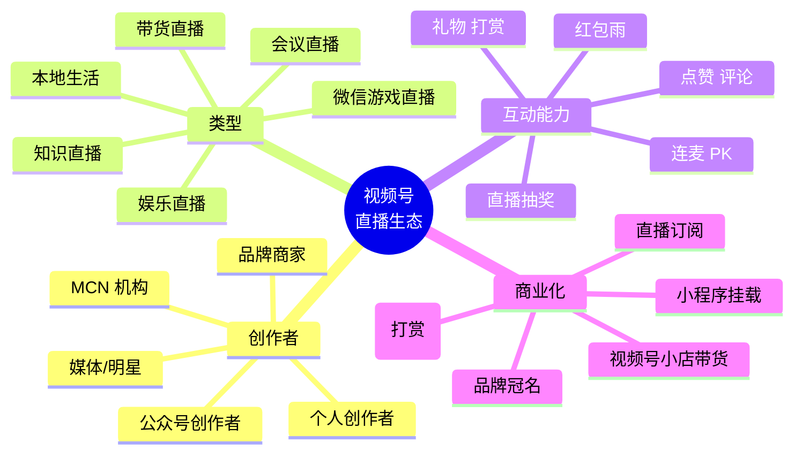
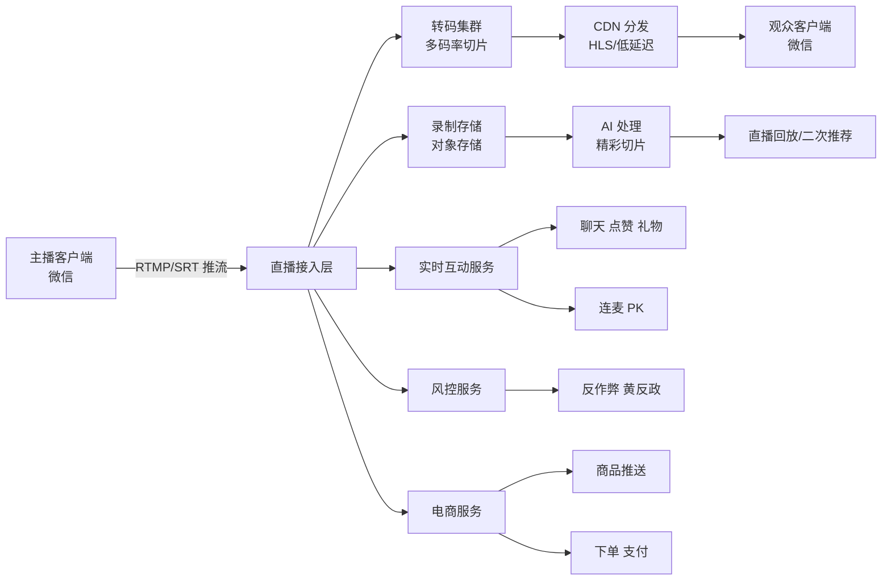
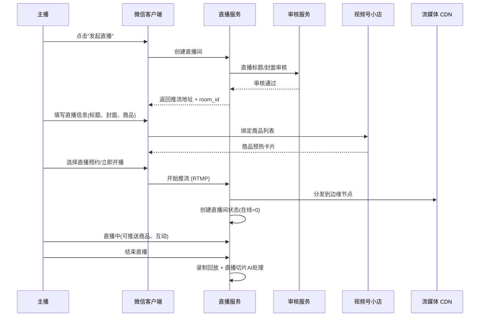
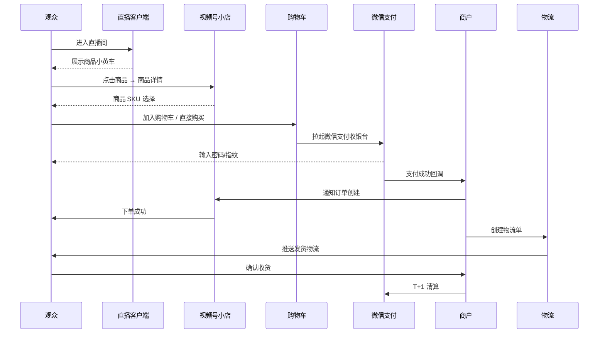

# 03 - 视频号直播与电商闭环

## 一、视频号直播业务概述

视频号直播是微信生态内的实时音视频 + 商业化能力，2020 年起逐步开放，从最初的娱乐直播扩展到带货直播、知识直播、本地生活直播等多种形态。

### 1.1 直播生态全景



### 1.2 关键数据 (2024-2025)

| 指标 | 数据 |
|------|------|
| 月度开播创作者数 | 数百万级 |
| 月度直播观看数 | 高速增长 |
| 直播带货 GMV | 2024 高速增长 |
| 客单价 | 多元化 |
| 美妆/服饰/食品类目 | 强势类目 |

## 二、视频号直播技术架构

### 2.1 直播全链路



### 2.2 推流 SDK (TXLivePusher)

视频号直播底层使用腾讯云 **MLVB (Mobile Live Video Broadcasting)** SDK：

```javascript
// 主播端推流配置示例 (web 端)
const pusher = new TxLivePusher({
  sdkAppId: 'your_sdkappid',
  streamId: 'live_room_xxx',
  // 推流地址（从业务后端获取）
  pushUrl: 'rtmp://push.live.channel.qq.com/path?bizid=xxx&txSecret=xxx&txTime=xxx',
});

pusher.setVideoQuality({
  resolution: '720p',
  fps: 25,
  bitrate: 2000, // kbps
});

pusher.setAudioQuality({
  sampleRate: 48000,
  bitrate: 64,
  channels: 1,
});

pusher.start();
```

### 2.3 播放 SDK (TXLivePlayer)

```javascript
// 观众端播放
const player = new TxLivePlayer();

player.setPlayConfig({
  // 极速模式 - 降低延迟到 800ms 以内
  enableAccelerate: true,
  // 自动切换码率
  enableAutoAdjust: true,
  // 缓冲策略
  bufferStrategy: 'smooth', // smooth / fast
});

player.play({
  streamUrl: 'http://live.stream.channel.qq.com/path.flv',
  type: 'live',
});
```

### 2.4 延迟优化

视频号直播延迟从最初的 3-5 秒优化到当前的 **800ms-1.5s**：

```
传统 RTMP + FLV：  3-5s
WebRTC：           < 500ms (互动直播)
QUIC/HTTP3：       1-2s
低延迟 HLS (LL-HLS)：2-3s

视频号选择：低延迟 RTMP + QUIC 推流，观众侧 LL-HLS/WebRTC
```

## 三、视频号小店 (Channel Shop)

### 3.1 视频号小店定位

视频号小店是腾讯对标抖音小店、快手小店的电商基础设施，2023-2024 年完成从"微信小商店"升级到"视频号小店"的转型。

```
演进路径：
微信小店 (2019) → 微信小商店 (2020) → 视频号小店 (2023 全面升级)
```

### 3.2 视频号小店能力

```
视频号小店
├── 店铺管理
│   ├── 店铺装修
│   ├── 商品管理
│   ├── 库存管理
│   └── 客服系统
├── 营销工具
│   ├── 优惠券
│   ├── 限时秒杀
│   ├── 拼团
│   ├── 满减
│   └── 店铺会员
├── 直播带货
│   ├── 商品上架直播间
│   ├── 讲解回放
│   ├── 直播间小黄车
│   └── 直播切片商品
├── 订单履约
│   ├── 微信支付
│   ├── 物流对接 (快递100/顺丰)
│   ├── 售后服务
│   └── 电子发票
└── 数据洞察
    ├── 实时 GMV
    ├── 转化漏斗
    ├── 流量来源
    └── 商品分析
```

### 3.3 视频号小店开通条件

| 类型 | 资质要求 |
|------|---------|
| 个体工商户 | 营业执照 + 法人身份证 |
| 企业 | 营业执照 + 对公账户 + 法人身份证 |
| 品牌 | 商标注册证 + 品牌授权 |
| 跨境品牌 | 海关备案 + 跨境资质 |

### 3.4 视频号小店 API 示例

```python
# 商品上架 API (伪代码)
import requests

def add_product(product_data):
    """视频号小店商品上架"""
    api_url = "https://api.weixin.qq.com/channels-ec/product/add"
    access_token = get_access_token()
    
    payload = {
        "title": product_data['name'],
        "sub_title": product_data['subtitle'],
        "category_id": product_data['category'],
        "main_image": product_data['main_image'],
        "images": product_data['gallery'],
        "sku_list": product_data['skus'],
        "price": {
            "currency": "CNY",
            "amount": product_data['price_cent']
        },
        "stock": product_data['stock'],
        "freight_template_id": product_data['freight_id'],
        "detail": product_data['description'],
    }
    
    response = requests.post(
        api_url,
        params={"access_token": access_token},
        json=payload
    )
    return response.json()

# 直播间推送商品
def push_product_to_live(room_id, product_id, presenter_word=""):
    """直播间小黄车推送"""
    api_url = "https://api.weixin.qq.com/channels-ec/live/pushproduct"
    payload = {
        "room_id": room_id,
        "product_id": product_id,
        "presenter_word": presenter_word,
    }
    return requests.post(api_url, json=payload, headers={"Authorization": f"Bearer {access_token}"})
```

## 四、直播带货完整链路

### 4.1 主播开播流程



### 4.2 观众下单流程



### 4.3 直播带货核心转化率指标

```
曝光 → 进房：CTR ~ 10-30%
进房 → 点击商品：CTR ~ 5-15%
点击商品 → 下单：CVR ~ 5-20%
下单 → 支付：转化 ~ 60-80%
支付 → 完成：完成率 ~ 90%+

整体：曝光 → 下单转化 ~ 0.5-3%
```

## 五、微信支付在视频号电商中的作用

### 5.1 微信支付的优势

视频号电商选择微信支付的天然优势：

```
┌────────────────────────────────────────────┐
│  微信支付核心优势                           │
├────────────────────────────────────────────┤
│  1. 0 跳转 - 收银台原生在微信内              │
│  2. 实名/绑卡完备 - 用户无需重复输入           │
│  3. 多种支付方式 - 零钱/银行卡/微信分付        │
│  4. 担保交易 - 资金 T+1 清算，纠纷有保障        │
│  5. 营销工具 - 微信支付券、立减金              │
│  6. 资金流/信息流/物流 三流合一               │
└────────────────────────────────────────────┘
```

### 5.2 微信支付下单核心代码

```python
# 微信支付 V3 API - JSAPI 下单
import requests, json, time, hashlib, hmac
from cryptography.hazmat.primitives import hashes
from cryptography.hazmat.primitives.asymmetric import padding

class WechatPayV3:
    def __init__(self, app_id, mch_id, api_v3_key, private_key, serial_no):
        self.app_id = app_id
        self.mch_id = mch_id
        self.api_v3_key = api_v3_key
        self.private_key = private_key
        self.serial_no = serial_no
    
    def sign(self, method, url, body):
        """生成签名"""
        timestamp = str(int(time.time()))
        nonce_str = hashlib.md5(str(time.time()).encode()).hexdigest()
        message = f"{method}\n{url}\n{timestamp}\n{nonce_str}\n{body}\n"
        signature = hmac.new(
            self.api_v3_key.encode(),
            message.encode(),
            hashlib.sha256
        ).hexdigest()
        return f"WECHATPAY2-SHA256-RSA2048 mchid=\"{self.mch_id}\",nonce_str=\"{nonce_str}\",signature=\"{signature}\",timestamp=\"{timestamp}\",serial_no=\"{self.serial_no}\""
    
    def jsapi_order(self, openid, out_trade_no, total, description):
        """JSAPI 下单"""
        url = "/v3/pay/transactions/jsapi"
        body = json.dumps({
            "appid": self.app_id,
            "mchid": self.mch_id,
            "description": description,
            "out_trade_no": out_trade_no,
            "notify_url": "https://your-domain.com/notify/wechat",
            "amount": {"total": total, "currency": "CNY"},
            "payer": {"openid": openid}
        })
        # ... request with sign
```

## 六、视频号小店跨境业务

### 2024-2025 年腾讯开始加速视频号跨境电商布局：

### 6.1 跨境入驻模式

| 模式 | 说明 | 适合对象 |
|------|------|---------|
| 直营模式 | 品牌方直接入驻 | 海外品牌中国总部 |
| 代运营模式 | TP 服务商代运营 | 中小海外品牌 |
| 保税仓模式 | 商品提前入保税仓 | 美妆、母婴 |
| 直邮模式 | 海外直邮 | 奢侈品、高端品牌 |

### 6.2 跨境支付与清关

```
跨境电商链路：
海外品牌 → 视频号小店 → 微信支付(人民币) → 第三方支付(汇兑) → 品牌方境外账户
保税仓商品 → 海关清关 → 消费者收货
```

### 6.3 跨境类目优势类目

视频号跨境热销类目：
- 美妆护肤 (欧莱雅、雅诗兰黛等)
- 母婴用品 (奶粉、辅食)
- 保健品 (Swisse、GNC)
- 轻奢 (Coach、MK)
- 食品 (保健品、零食)

## 七、视频号直播运营策略

### 7.1 主播分层

| 层级 | 粉丝量 | 商业化能力 |
|------|--------|-----------|
| 头部 | 100w+ | 品牌冠名 + 自营 |
| 腰部 | 10w-100w | 自营为主 |
| 尾部 | 1w-10w | MCN 供货分销 |
| 素人 | <1w | 私域转化 |

### 7.2 直播带货 vs 短视频带货

```
短视频带货:
├── 流量分发更广
├── 转化周期长
├── 内容种草属性强
└── 适合品类：服饰、美妆、食品

直播带货:
├── 流量更集中
├── 转化即时
├── 实时互动建立信任
└── 适合品类：全品类，决策成本高的品类需要主播说服
```

### 7.3 私域直播

视频号直播的差异化能力是**私域直播**：

```
直播预约 → 公众号提醒 → 视频号开播 → 分享到社群 → 朋友圈同步 → 沉淀企微好友
```

**私域直播工具**：
- 直播预约海报 (带小程序码)
- 直播间分享到群
- 公众号模板消息推送
- 企业微信一键邀约
- 视频号订阅直播

## 八、视频号直播带货的可借鉴点

对 AI 直播平台的关键借鉴：

1. **零跳转支付**：原生微信支付 / 支付宝是电商闭环的关键
2. **直播间小黄车**：直观挂载商品，降低决策路径
3. **录制 + AI 切片**：直播后二次分发，把长尾流量榨干
4. **私域 + 公域混合**：先私域预约开播，公域算法补充
5. **订阅 + 提醒**：开播前 5 分钟推送提醒
6. **数据看板**：实时 GMV、转化漏斗、流量来源

## 九、视频号直播的技术挑战

1. **延迟优化**：带货直播对延迟敏感（800ms 目标）
2. **并发观看**：头部直播间 100w+ 并发
3. **互动爆炸**：弹幕、点赞、礼物的实时下行
4. **AI 审核**：直播实时机审 + 人审
5. **风控反作弊**：刷量、刷单、虚假交易
6. **跨境合规**：海关、保税仓、跨境支付
7. **公私域协同**：私域引流 → 直播转化 → 沉淀私域

## 十、关键术语表

| 术语 | 含义 |
|------|------|
| 小黄车 | 直播间底部商品挂载条 |
| 微信豆 | 直播间打赏虚拟币 (1 元 = 10 微信豆) |
| 流量主 | 视频号内容创作者收益分成身份 |
| 视频号小店 | 视频号原生电商店铺 |
| 视频号互选 | 创作者与品牌合作广告平台 |
| 视频号小店优选联盟 | 选品中心 (CPS 分佣) |
| 视频号直播伴侣 | PC 端直播工具 |
| 直播切片 | 直播录像 AI 自动精彩片段 |

## 十一、参考资料

- 微信公开课 Pro - 视频号直播专场
- 微信支付 V3 API 文档 (pay.weixin.qq.com)
- 视频号小店开放平台文档
- 腾讯云 MLVB SDK 文档
- 36氪《视频号直播带货研究报告》
- 晚点 LatePost《视频号小店跨境业务》

## 附：视频号电商关键页面/页面 ID (微信生态术语)

- `pages/live/live` - 直播间页面
- `pages/shop/index` - 视频号小店
- `pages/product/detail` - 商品详情
- `pages/cart/index` - 购物车
- `pages/order/list` - 订单列表
- `pages/order/detail` - 订单详情
- `pages/after-sale/index` - 售后服务
- `pages/coupon/list` - 优惠券列表