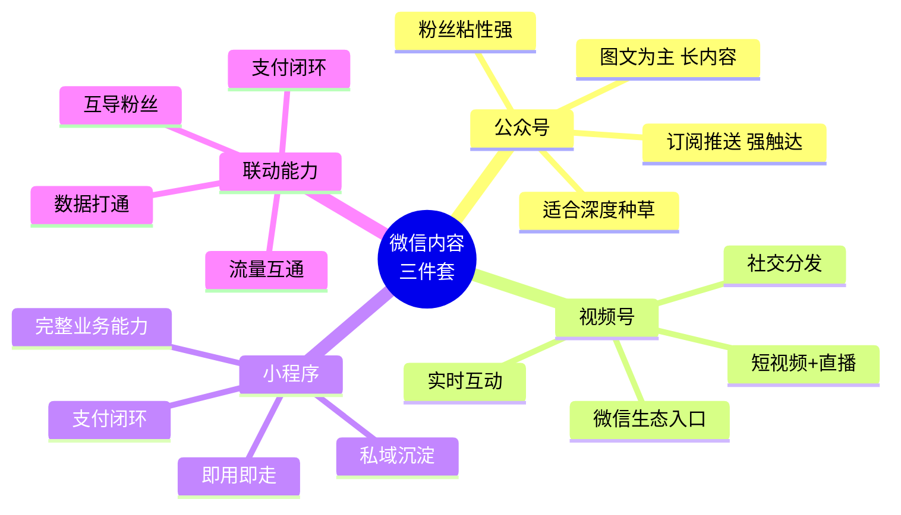
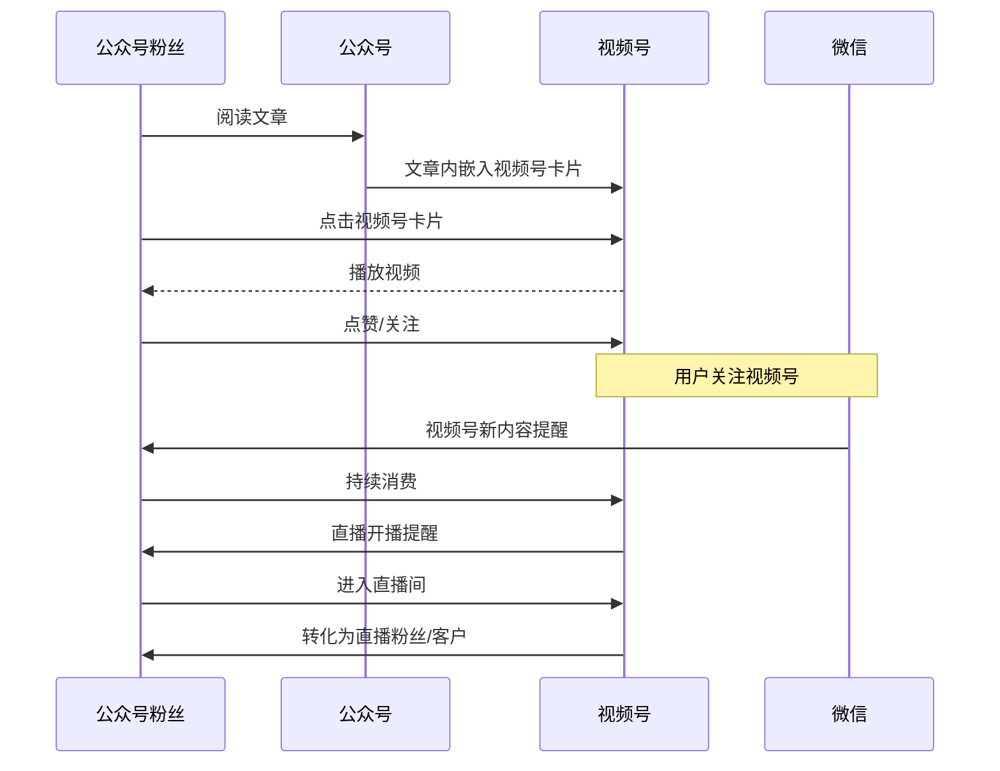
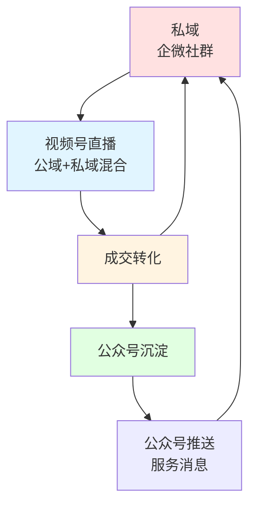
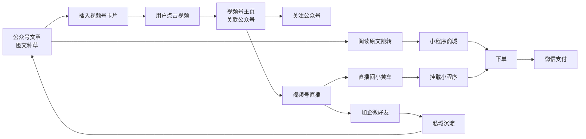

# 04 - 公众号 + 小程序 + 视频号三件套联动

## 一、微信内容三件套生态

微信生态的"内容三件套"是公众号、小程序、视频号。三者深度打通，构成微信生态最强的内容+商业闭环。



### 1.1 三件套的能力对比

| 维度 | 公众号 | 视频号 | 小程序 |
|------|--------|--------|--------|
| 内容形态 | 图文 + 音频 + 视频卡片 | 短视频 + 直播 | 完整 H5 应用 |
| 触达方式 | 订阅消息 + 服务通知 | 推荐 + 关注 | 扫码 + 搜索 + 跳转 |
| 用户粘性 | 高 | 中 | 即用即走 |
| 商业化 | 阅读原文链接 | 小黄车 + 直播间 | 完整电商能力 |
| 数据沉淀 | 公众号粉丝 | 视频号粉丝 | 小程序用户体系 |
| 创作难度 | 中 | 中 | 高 |
| 启动成本 | 低 | 低 | 中-高 |

### 1.2 三件套的典型组合场景

```
┌──────────────────────────────────────────────────────────┐
│                                                          │
│   场景 1: 内容种草 → 直播带货 → 私域沉淀                   │
│   公众号图文 → 视频号预告 → 视频号直播 → 企业微信好友      │
│                                                          │
│   场景 2: 私域唤醒 → 直播 → 二次触达                       │
│   公众号粉丝 → 视频号订阅 → 直播 → 公众号 + 服务通知        │
│                                                          │
│   场景 3: 短视频引流 → 小程序成交 → 视频号复购              │
│   视频号挂载小程序 → 小程序商城下单 → 视频号再次种草         │
│                                                          │
│   场景 4: 小程序商城 → 视频号内容营销                       │
│   小程序商城积分 → 引导关注视频号 → 看短视频领券             │
│                                                          │
└──────────────────────────────────────────────────────────┘
```

## 二、公众号 ↔ 视频号联动

### 2.1 关联账号机制

```
┌────────────────────────────────────────────────────┐
│            公众号 - 视频号关联机制                    │
├────────────────────────────────────────────────────┤
│                                                      │
│   关联方式:                                          │
│   - 视频号主绑公众号 (Primary)                       │
│   - 公众号主绑视频号 (Secondary)                     │
│                                                      │
│   关联效果:                                          │
│   1. 视频号 profile 展示公众号入口                    │
│   2. 公众号 profile 展示视频号入口                    │
│   3. 公众号文章可插入视频号卡片 (实时同步)            │
│   4. 公众号粉丝可收到视频号开播提醒                   │
│   5. 公众号文章阅读 → 引导关注视频号                  │
│                                                      │
│   限制:                                              │
│   - 一个视频号只能绑定一个公众号                       │
│   - 一个公众号可绑定多个视频号                        │
│   - 主体认证需一致 (个人/企业)                        │
│                                                      │
└────────────────────────────────────────────────────┘
```

### 2.2 公众号插入视频号卡片

公众号文章编辑器支持插入视频号动态卡片：

```html
<!-- 公众号文章 HTML (微信编辑器生成) -->
<mpvideosnapper
  data-pluginname="mpvideosnapper_v2"
  data-url="https://finder.video.qq.com/..."
  data-thumb="https://wxappvideo/cover.jpg"
  data-title="视频号标题"
  data-usercard="channel_id_xxx"
></mpvideosnapper>
```

**插入方式**：
1. 公众号编辑器搜索视频号
2. 选择视频/直播回放
3. 自动插入卡片
4. 文章阅读者点击 → 跳转到视频号

### 2.3 公众号粉丝 → 视频号关注转化路径



### 2.4 视频号导流到公众号

视频号 profile 页有"关联公众号"入口，用户点击 → 跳转公众号文章列表 / 公众号 profile。

```
视频号 profile 入口布局:
├── 头像 + 名称 + 简介
├── 关注按钮
├── 私信按钮
├── 关联公众号 (绿色入口)
├── 关联小程序 (灰底卡片)
├── 视频列表
└── 直播记录
```

## 三、视频号 ↔ 小程序联动

### 3.1 视频号挂载小程序

视频号短视频和直播间都可以挂载小程序：

```
短视频挂载小程序:
- 在视频下方展示小程序卡片
- 用户点击 → 跳转到小程序指定页面
- 卡片样式: 标题 + icon + 路径预览

直播间挂载小程序:
- 直播间右下角"购物袋"按钮
- 点击展开商品/小程序列表
- 用户点击 → 跳转小程序
```

### 3.2 视频号跳转小程序 API

```javascript
// 视频号服务商 API - 短视频挂载小程序
// 实际生产由微信后台处理，前端通过 wx.miniProgram.navigateTo 跳转

// 视频号自定义按钮 - 配置挂载小程序
const channelMiniProgramConfig = {
  // 视频号小店商品
  product: {
    product_id: "p_xxx",
    type: "product"
  },
  // 普通小程序
  miniProgram: {
    appid: "wx_appid_xxx",
    path: "pages/product/detail?id=123",
    type: "miniprogram",
    title: "立即购买",
    icon: "shopping-cart"
  }
};
```

### 3.3 小程序跳转视频号

小程序可通过特定 API 跳转到视频号直播间或短视频：

```javascript
// 小程序端跳转视频号
// 1. 跳转到视频号主页
wx.openChannelsUserProfile({
  finderUserName: 'video_channel_id_xxx',  // 视频号 ID
  success: (res) => console.log('跳转成功'),
  fail: (err) => console.log('跳转失败', err)
});

// 2. 跳转到视频号直播
wx.openChannelsLive({
  finderUserName: 'video_channel_id_xxx',
  success: (res) => console.log('进入直播间'),
  fail: (err) => console.log(err)
});

// 3. 跳转到视频号视频
wx.openChannelsVideo({
  finderUserName: 'video_channel_id_xxx',
  videoId: 'video_xxx',
  success: (res) => console.log('进入视频'),
  fail: (err) => console.log(err)
});
```

### 3.4 视频号 → 小程序电商闭环

```
用户路径:
视频号短视频种草 → 视频号挂载小程序卡片 → 点击进入小程序商城 → 下单 → 微信支付 → 物流
```

**核心组件**：

```
┌──────────────────────────────────────────────┐
│         视频号 + 小程序电商方案                │
├──────────────────────────────────────────────┤
│                                              │
│  视频号 Native (微信宿主)                    │
│    ├─ 短视频/直播间                          │
│    └─ 挂载小程序卡片                          │
│         ↓ 点击                               │
│  小程序 (微信 WebView 容器)                  │
│    ├─ 商品列表 (商品卡片组件)                  │
│    ├─ 商品详情 (商品详情组件)                  │
│    ├─ 购物车                                 │
│    ├─ 订单结算 (微信支付组件)                  │
│    └─ 售后 (客服组件)                         │
│         ↓ 支付                                │
│  微信支付 (JSAPI)                            │
│    └─ 担保交易 → T+1 清算                     │
│                                              │
└──────────────────────────────────────────────┘
```

## 四、小程序 + 公众号联动

### 4.1 公众号文章插入小程序卡片

```html
<!-- 公众号文章内插入小程序卡片 -->
<mp-common-miniprogram
  data-pluginname="mp-common-miniprogram"
  data-url="pages/index/index"
  data-appid="wx_appid_xxx"
  data-path="pages/product/detail"
  data-title="小程序名称"
  data-thumb="https://..."
></mp-common-miniprogram>
```

### 4.2 公众号自定义菜单跳转小程序

```
公众号后台 → 自定义菜单 → 菜单内容:
├── 跳转到网页
├── 跳转到小程序
├── 触发客服消息
└── 推送图文/图片/视频
```

### 4.3 公众号模板消息触达小程序

```javascript
// 服务号模板消息 API
{
  "touser": "OPENID",
  "template_id": "template_xxx",
  "url": "https://mp.weixin.qq.com/...",  // 备用 URL
  "miniprogram": {
    "appid": "wx_appid_xxx",  // 跳转的小程序
    "pagepath": "pages/order/detail?id=123"
  },
  "data": {
    "first": {"value": "您的订单已发货"},
    "keyword1": {"value": "顺丰快递 SF1234567890"},
    "keyword2": {"value": "2025-01-15 10:00"},
    "remark": {"value": "点击查看详情"}
  }
}
```

### 4.4 关注公众号组件 (小程序 → 公众号)

小程序内可以引导用户关注公众号：

```html
<!-- 小程序 WXML -->
<official-account
  bindload="onOfficialAccountLoad"
  binderror="onOfficialAccountError"
></official-account>

<!-- 渲染规则：
     1. 用户未关注该公众号 → 显示"关注"组件
     2. 用户已关注 → 不显示
     3. 场景值限制: 只有特定场景 (如扫描公众号二维码) 才显示
-->
```

## 五、视频号 + 搜一搜 SEO

### 5.1 视频号在微信搜一搜的权重

微信搜一搜 (Search) 是微信生态的统一搜索入口，视频号是核心内容源之一。

```
搜一搜内容源:
├── 公众号文章 (权重最高)
├── 小程序 (权重高)
├── 视频号内容 (权重高)
├── 朋友圈 (低权重)
├── 百科 (腾讯医典等)
├── 问答
└── 表情/小说/新闻
```

### 5.2 视频号 SEO 关键因素

| 因素 | 权重 | 优化建议 |
|------|------|---------|
| 标题关键词 | 极高 | 标题包含目标关键词 |
| 描述/话题 | 高 | 添加 #话题 标签 |
| 创作者名称/简介 | 中 | 设置含关键词的简介 |
| 互动数据 | 中 | 引导点赞评论转发 |
| 内容质量 | 高 | 完播率高的内容优先 |
| 时效性 | 中 | 新内容优先 |
| 创作者权重 | 高 | 粉丝多/活跃的创作者优先 |

### 5.3 视频号 SEO 优化实操

```yaml
# 视频号 SEO 优化清单

发布前:
  - 标题: 主关键词在前 20 字内
  - 描述: 包含长尾关键词
  - 话题: 添加 3-5 个相关 #话题
  - 封面: 含文字关键词
  - 位置: 添加同城 POI

发布后:
  - 引导: 文案引导点赞评论
  - 分享: 转发到群/朋友圈
  - 互动: 亲自回复评论
  - 持续: 保持更新频率

矩阵策略:
  - 多账号矩阵: 同一关键词覆盖
  - 系列内容: 关联内容互相导流
  - 私域: 公众号文章插入视频号
```

## 六、视频号 + 企业微信 (WeCom) 私域联动

### 6.1 企业微信客服接入视频号

视频号 profile 可关联企业微信：

```
用户路径:
视频号 profile → 联系客服 → 添加企业微信 → 进入私域社群
```

### 6.2 企业微信客户群 + 视频号直播

企业微信客户群是私域核心，可以：

```
开播前:
- 群内推送直播预约海报
- 一键发送视频号直播链接
- 设置直播提醒机器人

开播中:
- 群内同步直播间福利
- 邀请好友进直播间抽奖

开播后:
- 群内同步直播回放
- 群内同步直播切片商品链接
- 群内发起团购活动
```

### 6.3 私域 + 公域联动模型



## 七、视频号助手 (PC 端创作者平台)

### 7.1 视频号助手定位

视频号助手是 PC 端创作者后台 (channels.weixin.qq.com)，类似抖音的"创作者服务中心"。

```
视频号助手能力:
├── 内容管理
│   ├── 视频上传
│   ├── 直播管理
│   ├── 数据看板
│   └── 评论管理
├── 直播管理
│   ├── 创建预告/直播
│   ├── 直播预告管理
│   ├── 直播数据回顾
│   └── 直播切片
├── 数据分析
│   ├── 内容数据 (曝光/点赞/完播)
│   ├── 直播数据 (观看/成交)
│   ├── 粉丝画像
│   └── 流量来源
├── 商业化
│   ├── 视频号小店商品管理
│   ├── 互选广告
│   └── 流量主收益
└── 账号管理
    ├── 账号设置
    ├── 客服配置
    ├── 关联设置
    └── 违规记录
```

### 7.2 视频号助手 vs 抖音创作者服务中心

| 维度 | 视频号助手 | 抖音创作者 |
|------|-----------|-----------|
| 入口 | channels.weixin.qq.com | creator.douyin.com |
| 数据延迟 | T+1 | 实时 (部分) |
| 私域能力 | 公众号/企微集成 | 弱 |
| 直播工具 | 直播伴侣 (PC 端推流) | 直播伴侣 |
| 商业化 | 微信支付集成 | 抖音支付 |
| 数据维度 | 社交关系链 | 算法标签 |

## 八、视频号三件套联动案例分析

### 8.1 完美日记模式

```
公众号:
- 推送新品发布文章 (图文种草)
- 底部"阅读原文"跳转小程序商城
- 插入视频号短视频卡片

视频号:
- 美妆教程短视频 (产品植入)
- 直播间带货 (主推爆款)
- 挂载小程序商城入口

小程序:
- 完美日记官方商城
- 会员积分体系
- 拼团/秒杀活动
- 微信支付闭环

公众号 + 视频号 + 小程序 + 企微 形成完整闭环
```

### 8.2 知识付费模式

```
公众号:
- 深度长文 (建立专业信任)
- 课程介绍 + 试听
- 引导加企微

视频号:
- 短视频 (1 分钟干货)
- 直播课 (1 小时大课)
- 直播带货 (课程包)

小程序:
- 课程详情
- 在线学习
- 课后作业
- 微信支付购课

企微:
- 班主任 1v1 服务
- 学习群打卡
- 续费转化
```

### 8.3 本地生活模式

```
公众号:
- 城市分号推送本地内容
- 商家优惠信息

视频号:
- 同城商家短视频
- 探店直播
- 本地 POI 挂载

小程序:
- 本地生活商城
- 到店核销
- 同城配送

企微:
- 商家客服
- 客户群运营
```

## 九、视频号三件套联动的关键技术

### 9.1 UnionID 体系

微信生态跨应用账号打通靠 **UnionID**：

```yaml
微信账号体系:
  OpenID:
    说明: 同一用户在不同公众号/小程序/视频号有不同 OpenID
    用途: 单一应用内的用户标识
  
  UnionID:
    说明: 同一微信开放平台账号下所有应用的用户唯一标识
    用途: 跨应用打通用户身份
    获取: 需先绑定到微信开放平台
  
  示例:
    公众号 OpenID: oPxxxx_1
    小程序 OpenID: oPxxxx_2
    视频号 OpenID: oPxxxx_3
    UnionID: union_xxxxx  # 三者统一
```

### 9.2 跨应用用户识别流程

```
┌────────────────────────────────────────────────────┐
│           跨应用用户识别                              │
├────────────────────────────────────────────────────┤
│                                                      │
│   用户访问公众号 / 小程序 / 视频号                    │
│         ↓                                            │
│   各自获取 OpenID                                    │
│         ↓                                            │
│   携带 code 调后端                                    │
│         ↓                                            │
│   后端调微信接口换取 OpenID + UnionID                  │
│         ↓                                            │
│   业务系统以 UnionID 为主键                            │
│         ↓                                            │
│   实现跨应用粉丝/用户资产打通                          │
│                                                      │
└────────────────────────────────────────────────────┘
```

### 9.3 三件套联动的 API 入口

```python
# 微信公众号 API
from wechatpy import WeChatClient
mp = WeChatClient(app_id, app_secret)
user = mp.user.get(user_id)

# 微信小程序 API
from wechatpy.miniprogram import WeChatMiniProgram
mini = WeChatMiniProgram(app_id, app_secret)
session = mini.login(code)

# 视频号助手 API
import requests
def channels_api(method, path, access_token, data=None):
    url = f"https://api.weixin.qq.com{path}"
    params = {"access_token": access_token}
    if method == "GET":
        return requests.get(url, params=params).json()
    return requests.post(url, params=params, json=data).json()

# UnionID 换取
def get_unionid(code, appid, secret):
    url = f"https://api.weixin.qq.com/sns/oauth2/access_token"
    params = {
        "appid": appid,
        "secret": secret,
        "code": code,
        "grant_type": "authorization_code"
    }
    return requests.get(url, params=params).json()
```

## 十、可借鉴点

对 AI 直播平台 / 自有 App 的可借鉴：

1. **统一用户标识 (UnionID) 思路**：跨应用跨端识别同一用户
2. **公众号 + 视频号互导**：长内容种草 + 短视频带货
3. **小程序 + 直播挂载**：H5 商城 + 直播小黄车
4. **私域 + 公域混合**：私域预约 + 直播转化 + 私域沉淀
5. **模板消息 + 服务通知**：强触达能力
6. **微信支付一体化**：0 跳转闭环
7. **搜一搜 SEO**：内容搜索流量
8. **企业微信客服**：视频号 → 企微私域沉淀

## 十一、参考资料

- 微信开放文档 (developers.weixin.qq.com)
- 视频号助手 (channels.weixin.qq.com)
- 微信开放平台 (open.weixin.qq.com)
- 微信公开课 Pro
- 《微信生态运营白皮书》

## 附录：三件套联动流程图合集

### A. 公众号 + 视频号 + 小程序 + 直播 完整路径

