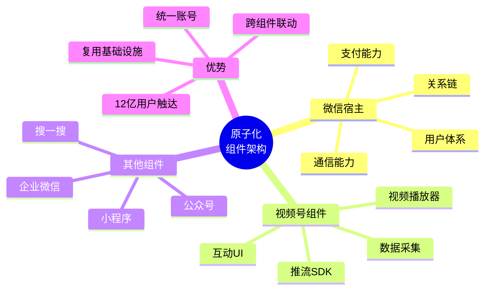
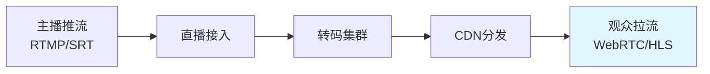
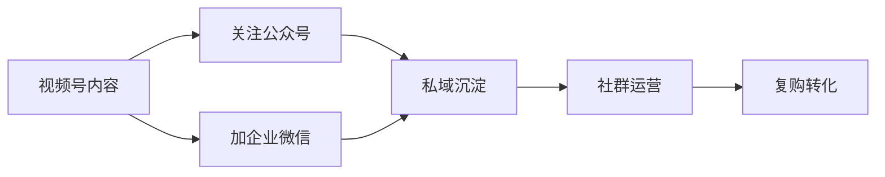

# 05 - 视频号可借鉴清单

> 本章总结视频号 (WeChat Channels) 对 **AI 直播平台** 和 **TikTok Shop 跨境业务** 的可借鉴点。按重要性分级：P0 (核心) / P1 (重要) / P2 (可参考)。

## 一、整体架构层面

### P0：原子化组件 / 嵌入式业务 (Atomized Components)

**视频号做法**：视频号不是独立 App，而是微信内部的原子化组件，与公众号、小程序、企业微信、微信支付、搜一搜并列。



**借鉴思路**：
- AI 直播平台不一定要做独立 App，可以作为微信/抖音/支付宝的"小程序 + 组件"
- 在自有 App 中，把核心业务拆成原子化组件（直播 / 短视频 / 商城 / 私域），互相组合
- 通过统一的"宿主 + 组件"架构，避免重复造轮子

### P0：社交关系链作为推荐强信号

**视频号做法**：朋友点赞是视频号最显著的 UI 元素，朋友点赞的头像直接展示在视频下方，朋友点赞的视频获得极高推荐权重。

**借鉴思路**：
- AI 直播平台加入"好友在看"信号：展示好友当前进入的直播间
- 用户进入直播间时，优先推荐"好友关注的直播间"
- 直播间内加入"好友在直播间"的弹幕提示

### P1：私域 + 公域混合分发

**视频号做法**：视频号是少有的"私域强 + 公域强"双轨平台，公众号粉丝可订阅视频号，企业微信可推送开播提醒，私域预约 + 公域算法补充。

**借鉴思路**：
- AI 直播平台支持"私域预约直播"，开播前推送提醒
- 已付费用户/会员用户优先推荐
- 建立"私域社群 + 直播 + 商城"闭环

### P1：搜一搜 SEO 流量

**视频号做法**：视频号是搜一搜核心内容源之一，标题/描述/话题标签都影响搜索权重。

**借鉴思路**：
- AI 直播平台每个直播内容都要做 SEO：标题、话题、标签、封面文字
- 支持站内搜索的视频化结果

## 二、推荐系统层面

### P0：社交召回 + 算法召回的混合策略

**视频号做法**：召回层分社交召回（朋友点赞/评论/转发/关注）+ 兴趣召回（双塔/CF/标签），精排层把社交信号作为强加权。

```python
# 视频号社交召回示意
social_recall(user_id):
    # 1. 朋友最近点赞的视频
    friends_like = social_graph.query_friends_recent_actions(
        user_id, 
        action_type='like', 
        days=7
    )
    # 2. 朋友最近评论的视频
    friends_comment = ...
    # 3. 朋友最近转发的视频
    friends_forward = ...
    # 4. 朋友关注的人发布的视频
    friends_followee_post = ...
    # 合并去重
    return dedupe(friends_like + friends_comment + friends_forward + friends_followee_post)
```

**借鉴思路**：
- AI 直播平台召回层加入"社交召回通道"
- 用户互动过的好友的直播偏好，是重要冷启动信号

### P0：多目标精排模型

**视频号做法**：精排层同时优化 CTR / LTS / 点赞率 / 评论率 / 转发率 / 关注率 / 进直播间率 / 进小店率等多个目标，用 MMoE/PLE 等多任务学习融合。

**借鉴思路**：
- AI 直播平台精排层也要多目标：CTR / 互动率 / 停留时长 / 商品点击率 / 成交转化率
- 不同业务阶段调整目标权重

### P1：DIN / DIEN 用户兴趣建模

**视频号做法**：使用 DIN (Deep Interest Network) 通过注意力机制建模用户历史行为的局部激活，DIEN 进一步建模兴趣演化。

**借鉴思路**：
- 直接套用 DIN 架构，AI 直播平台用户历史行为序列是关键
- 用兴趣演化建模用户偏好漂移

### P2：A/B 实验平台化 (WatchMan)

**视频号做法**：自研 WatchMan A/B 平台，统一管理所有实验，包括分层实验、流量分配、显著性检验。

**借鉴思路**：
- 即使是早期 AI 直播平台，也需要 A/B 实验平台
- 推荐使用开源方案：Airflow + 自研分流 + 统计检验

## 三、直播技术层面

### P0：低延迟直播 (800ms-1.5s)

**视频号做法**：使用 QUIC/WebRTC/低延迟 HLS 优化直播延迟到 800ms-1.5s。



**借鉴思路**：
- AI 直播数字人 + 真人主播连麦场景，延迟必须 < 1s
- 主播互动、弹幕、连麦等场景的实时性极重要
- 可以考虑 SRS / ZLMediaKit + WebRTC

### P0：原生支付闭环

**视频号做法**：微信支付 0 跳转、实名/绑卡完备、担保交易、JSAPI 拉起。

**借鉴思路**：
- AI 直播平台优先接入**目标用户最常用的支付**（国内：微信/支付宝；海外：Stripe/PayPal）
- 避免外部 H5 跳转，所有支付在原生完成

### P1：直播间挂载商品 (小黄车)

**视频号做法**：直播间底部商品挂载条，主播讲解 + 用户点击立即购买。

**借鉴思路**：
- AI 直播间必须有商品挂载位
- 支持主播口播 + 商品卡片自动弹出
- 支持直播间内"边看边买"

### P2：直播切片 + 二次分发

**视频号做法**：直播结束后 AI 自动切片精彩片段，作为短视频二次推荐。

**借鉴思路**：
- AI 直播平台可以自动切片高光时刻（GMV 高峰/弹幕高峰）
- 把切片作为短视频持续分发，长尾流量榨干

## 四、商业化层面

### P0：私域沉淀 (公众号 + 企微)

**视频号做法**：视频号流量沉淀到公众号 + 企业微信，长期复用。



**借鉴思路**：
- AI 直播平台必须有"私域沉淀"能力
- 不只是卖货，要沉淀"粉丝"资产

### P1：直播订阅 + 开播提醒

**视频号做法**：用户订阅主播，开播前 5 分钟通过微信推送提醒。

**借鉴思路**：
- 直播间必须有"订阅"功能
- 开播前推送（微信服务通知、APP Push、短信）

### P1：直播打赏 (微信豆)

**视频号做法**：直播打赏虚拟币 (1元 = 10微信豆)，用户为喜欢的直播打赏。

**借鉴思路**：
- AI 直播平台可考虑加入打赏机制（虚拟礼物）
- 用户为喜欢的 AI 数字人 / 主播打赏

### P2：互选广告 (视频号原生广告)

**视频号做法**：视频号互选平台，品牌方与创作者直接合作广告。

**借鉴思路**：
- AI 直播平台可以引入"主播商务合作平台"

## 五、生态联动层面

### P0：UnionID 统一用户识别

**视频号做法**：通过 UnionID 跨公众号/小程序/视频号识别同一用户。

**借鉴思路**：
- AI 直播平台在不同渠道（Web / iOS / Android / 小程序 / 公众号）必须打通用户
- 自有 UnionID-like 体系

### P1：三件套联动 (公众号 + 视频号 + 小程序)

**视频号做法**：公众号 + 视频号 + 小程序深度打通，互导流量、互引关注、互促交易。

**借鉴思路**：
- 长内容 + 短视频 + 完整商城 = 内容 + 商业闭环
- AI 直播平台 = 长内容知识库 + 短视频 + 直播 + 商城

### P2：搜一搜内容 SEO

**视频号做法**：视频号是搜一搜核心内容源，标题/标签/话题权重高。

**借鉴思路**：
- AI 直播平台的每个内容都要 SEO 友好
- 提供搜索流量入口

## 六、AI 直播平台直接可借鉴的清单

针对 [[../AI直播平台/_index]] 项目，列出可直接落地的清单：

### 立即可做 (P0)

| # | 借鉴点 | 视频号做法 | AI 直播平台落地 |
|---|--------|-----------|---------------|
| 1 | 社交信号 | 朋友点赞强信号 | 加"好友在看的直播间" |
| 2 | 私域沉淀 | 公众号 + 企微 | 加微信生态对接 (公众号 + 企微) |
| 3 | 直播订阅 | 订阅 + 开播提醒 | 主播订阅 + 服务通知 |
| 4 | 原生支付 | 微信支付 0 跳转 | 优先微信/支付宝原生支付 |
| 5 | 直播间商品 | 小黄车 | 直播挂载商品 |
| 6 | 低延迟 | 800ms-1.5s | WebRTC / QUIC 推流 |
| 7 | 多目标精排 | CTR + 互动 + 成交 | MMoE 多任务精排 |
| 8 | 直播切片 | AI 精彩片段 | AI 自动切片 + 二次分发 |

### 中期可做 (P1)

| # | 借鉴点 | 视频号做法 | AI 直播平台落地 |
|---|--------|-----------|---------------|
| 9 | 搜一搜 SEO | 标题/标签 | 站内搜索 + 内容 SEO |
| 10 | 直播打赏 | 微信豆 | 虚拟礼物 + 打赏 |
| 11 | 多端打通 | UnionID | 跨端用户体系 |
| 12 | 私域直播 | 预约 + 提醒 | 私域预约 + 开播提醒 |
| 13 | DIN 兴趣建模 | 注意力机制 | 套用 DIN 精排 |
| 14 | MMoE 多任务 | 多目标融合 | MMoE 精排 |
| 15 | 直播订阅 | 服务通知 | APP Push + 微信服务通知 |

### 长期可做 (P2)

| # | 借鉴点 | 视频号做法 | AI 直播平台落地 |
|---|--------|-----------|---------------|
| 16 | 直播生态 | 视频号小店 | 自建直播小店 |
| 17 | 商务平台 | 视频号互选 | 主播商务平台 |
| 18 | 三件套联动 | 公众号 + 视频号 + 小程序 | 内容 + 短视频 + 直播 |
| 19 | 创作者工具 | 视频号助手 PC 端 | PC 端创作者后台 |
| 20 | A/B 实验平台 | WatchMan | 自建 A/B 实验平台 |

## 七、TikTok Shop 跨境业务可借鉴点

针对 [[../TK跨境电商/_index]]：

### 借鉴视频号的私域能力

TikTok Shop 在欧美/东南亚最大的劣势是 **私域沉淀能力弱**。视频号的"公众号 + 企微"私域链路值得借鉴：

```
视频号私域路径:
视频号直播 → 关注公众号 → 加企微好友 → 群运营 → 复购

TikTok Shop 借鉴思路:
TikTok Shop 直播 → 引导加 WhatsApp/Line → 群运营 → 复购
```

### 借鉴视频号的内容三件套

TikTok Shop 在欧美只有"短视频 + 直播"，缺少图文长内容生态。可借鉴：

```
视频号: 公众号(长文) + 视频号(短视频) + 直播
TikTok: 长图文内容 + 短视频 + 直播 (待发展)
```

### 借鉴视频号微信支付

TikTok 在海外可借鉴微信支付的零跳转体验：

```
微信支付: 0 跳转，原生体验
TikTok Pay: 集成支付，但用户绑卡体验可进一步优化
```

### 借鉴视频号 SEO

```
微信搜一搜: 视频号是核心内容源
TikTok: 站内搜索 + 外部 SEO (Google/YouTube)
```

## 八、不可盲目借鉴的"反面清单"

不是所有视频号做法都适合 AI 直播平台，以下要避免：

| 视频号做法 | 不能直接借鉴的原因 |
|-----------|-----------------|
| 复用微信宿主 | AI 直播是独立 App |
| 朋友圈社交链 | 没有朋友圈等价的社交资产 |
| 公众号长文 | 微信生态独有 |
| 微信豆打赏 | 虚拟礼物需要合规设计 |
| 公众号粉丝订阅 | 等价物是 APP Push + 微信服务通知 |
| 视频号小店 | 需要独立电商牌照和仓储物流 |

## 九、视频号未来趋势预测

基于已公开信息：

1. **视频号小店跨境加速**：2025-2026 年视频号小店将大力拓展跨境业务
2. **AI 数字人主播普及**：腾讯智影 + 视频号直播深度结合
3. **视频号 SEO 权重提升**：搜一搜流量继续增长
4. **私域直播成熟**：企微 + 视频号直播成为私域标配
5. **直播带货与短视频带货融合**：直播切片成短视频二次增长

## 十、参考资料

- 微信公开课 Pro 2024
- 微信技术团队博客
- 晚点 LatePost《微信视频号》系列报道
- 36氪《视频号生态报告 2024》
- QuestMobile《视频号用户画像》

## 附录：视频号关键链接

- [视频号助手](https://channels.weixin.qq.com)
- [微信开放文档](https://developers.weixin.qq.com)
- [微信支付 V3 文档](https://pay.weixin.qq.com/wiki/doc/apiv3/)
- [微信公开课](https://weread.qq.com)
- [腾讯云 MLVB SDK](https://cloud.tencent.com/product/mlvb)