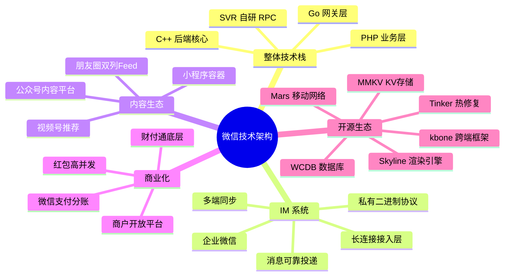

# 微信 (WeChat) 技术架构深度拆解 — 索引

> 调研日期: 2026-06-19
> 调研者: Claude (Opus 4.7)
> 目标读者: 跨境电商 TikTok Shop 运营者 + AI 直播平台开发者

---

## 章节地图

| 序号 | 文件 | 主题 | 核心价值 |
|------|------|------|---------|
| 00 | `00-索引.md` | 本索引 | 拆解地图 |
| 01 | `01-整体架构与微信技术栈.md` | 大图全景 | 技术栈选型、组织架构 |
| 02 | `02-即时通讯IM系统.md` | 微信 IM | 私有协议、长连接网关、亿级并发 |
| 03 | `03-朋友圈与公众号.md` | 内容平台 | 双列 Feed、公众号矩阵 |
| 04 | `04-小程序与微信生态.md` | 小程序 | 双线程模型、Skyline 渲染、跨端方案 |
| 05 | `05-微信支付与商业化.md` | 商业化 | 财付通、红包系统、商户体系 |
| 06 | `06-可借鉴清单.md` | 启示 | 对 TikTok Shop + AI 直播的借鉴 |
| 07 | `07-WCDB-MMKV-Mars源码.md` | 客户端存储 + 长连接 | WCDB / MMKV / Mars 完整源码解读 |
| 08 | `08-Tinker-kbone-BlueKing源码.md` | 热修复 + 跨端 + 蓝鲸 | Tinker / kbone / BlueKing 完整源码解读 |
| 09 | `09-WeChaty+BlueKing开源平替.md` | **微信个人号/客服机器人开源平替** | WeChaty (6语言SDK + PadLocal协议) + BlueKing (蓝鲸 PaaS) 完整源码 + 9×7 拆解 + 跨境电商客服落地 |

---

## 思维导图

---

## 关键数字速查

| 指标 | 数值 | 来源 |
|------|------|------|
| MAU | 13.4 亿 (2024 Q3) | 腾讯财报 |
| 微信小程序数量 | 700万+ (2024) | 阿拉丁指数 |
| 公众号注册数 | 3000万+ | 微信公开课 |
| 单长连接网关承载 | 100万+ 连接 | 微信团队分享 |
| 红包除夕峰值 | 76 万 QPS (2020) | 微信支付团队 |
| 视频号 DAU | 8 亿+ (2024) | 微信公开课 |
| WCDB GitHub Star | 11k+ | github.com/Tencent |
| MMKV GitHub Star | 17k+ | github.com/Tencent |
| Mars GitHub Star | 17k+ | github.com/Tencent |
| Tinker GitHub Star | 17k+ | github.com/Tencent |

---

## 调研源

### 官方技术博客
- 微信后台团队: https://cloud.tencent.com/developer/column/7827
- 微信开放社区: https://developers.weixin.qq.com/
- 微信公开课: https://open.weixin.qq.com/

### 开源仓库
- 微信前端: https://github.com/WechatFE
- 腾讯开源: https://github.com/Tencent
- 微信小程序: https://github.com/wechat-miniprogram

### 公开演讲
- QCon 北京/上海: 微信团队多次分享
- ArchSummit: 张小龙、张志东多次主题演讲
- WOT: 微信后台架构
- GMTC: 微信小程序技术

### 学术论文
- "Large-scale Incremental Processing Using Distributed Transactions and Notifications" (Google, OSDI 2010) - Percolator
- "Tao: Powering the Alibaba Recommendation System" (VLDB 2019)
- "微信大规模分布式存储系统" (微信团队)

---

## 与本调研者业务的相关性

### 对 TikTok Shop 的启示
- 微信支付 → TikTok Pay
- 微信红包 → TikTok 直播打赏
- 公众号 → TikTok 创作者中心
- 小程序 → TikTok Shop 店铺

### 对 AI 直播平台的启示
- 长连接网关 (Mars) → 直播弹幕协议
- 小程序双线程模型 → 低代码直播工具
- 视频号推荐 → AI 直播内容分发
- WCDB/MMKV → 客户端存储
