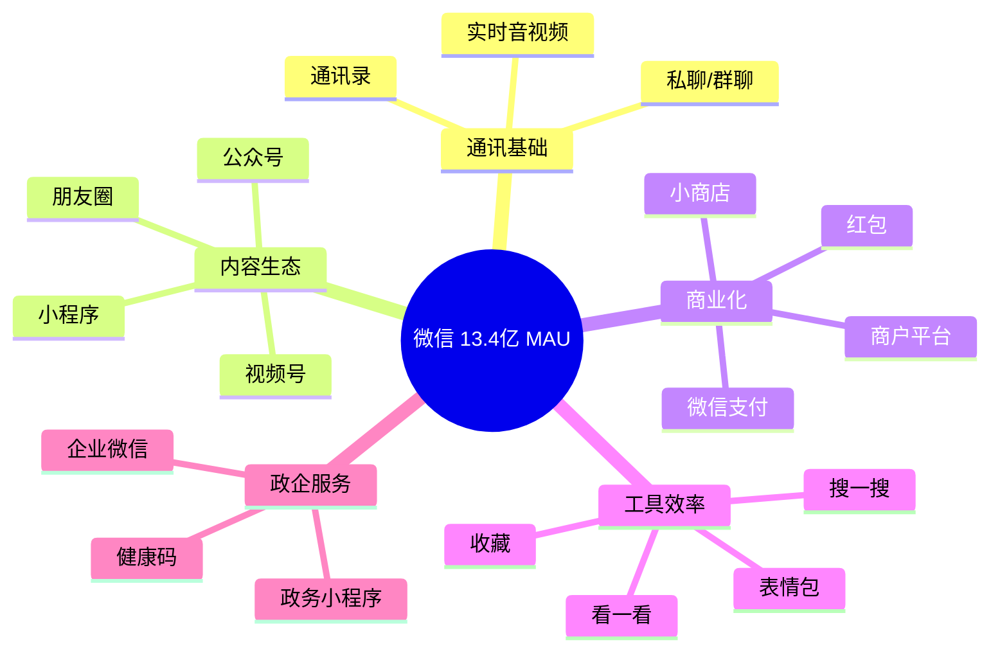
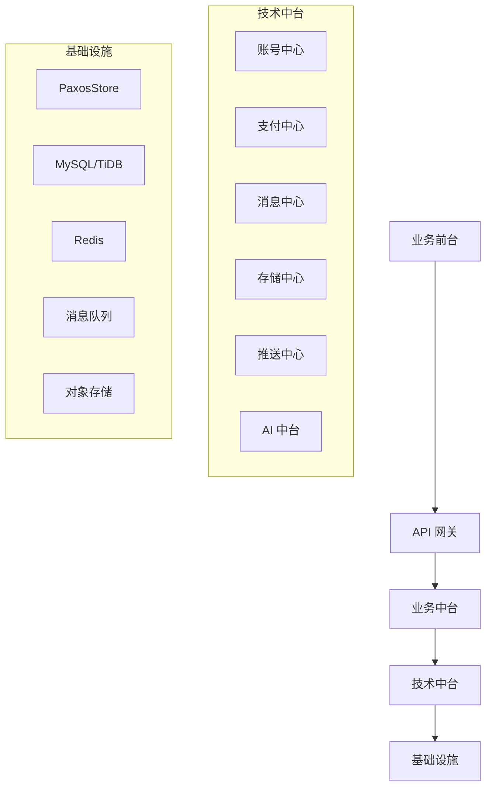

# 01 - 微信整体架构与技术栈全景

> 调研日期: 2026-06-19
> 本章目标: 建立微信技术栈的全局视图，理解各模块的语言选型、组织分工、基础设施

---

## 1. 微信业务版图



### 1.1 业务规模

| 业务 | 规模指标 | 峰值场景 |
|------|---------|---------|
| 私聊消息 | 日均千亿条 | 春节 |
| 群聊消息 | 单群 500→2000 人 (2024) | 工作群 |
| 朋友圈 | 日均 100 亿次曝光 | 晚高峰 |
| 视频号 | 日均 8 亿次播放 | 黄金档 |
| 公众号 | 3000 万注册 | - |
| 小程序 | 700 万+ 应用 | 双十一 |
| 微信支付 | 日均 20 亿笔 | 春节红包 |
| 企业微信 | 1.4 亿用户 (2024) | 远程办公 |

---

## 2. 整体技术架构

### 2.1 分层架构

```
+-----------------------------------------------------------+
|  客户端层 (Android/iOS/macOS/Windows/HarmonyOS)           |
|  - 微信客户端 (C++/Obj-C/Java/Kotlin/Swift/ArkTS)         |
|  - 小程序运行时 (双线程模型)                               |
+-----------------------------------------------------------+
                          |
                          v
+-----------------------------------------------------------+
|  接入层 (接入网关)                                         |
|  - 长连接网关 (C++) - 单实例 100w+ 连接                    |
|  - 短连接 HTTP 网关 (Go/C++)                               |
|  - 小程序网关 (Go)                                         |
+-----------------------------------------------------------+
                          |
                          v
+-----------------------------------------------------------+
|  业务逻辑层                                                |
|  - IM 服务 (C++) - 消息收发/群/通讯录                      |
|  - 朋友圈服务 (C++) - Feed 生成/评论                       |
|  - 公众号服务 (PHP/Go) - 内容管理/推送                     |
|  - 小程序服务 (Go) - 容器调度                              |
|  - 支付服务 (C++) - 财付通对接                             |
|  - 视频号 (C++/Go) - 推荐/转码                             |
+-----------------------------------------------------------+
                          |
                          v
+-----------------------------------------------------------+
|  数据层                                                    |
|  - 存储: PaxosStore (自研 KV) + MySQL/TiDB                 |
|  - 队列: 自研 SVR/Tube + Kafka                             |
|  - 缓存: Redis Cluster + 自研 L5                            |
|  - 搜索: 自研全文检索 + ES                                 |
|  - 对象存储: 自研 CFS + 接入 S3/COS                        |
+-----------------------------------------------------------+
                          |
                          v
+-----------------------------------------------------------+
|  基础设施层                                                |
|  - IDC: 深圳/上海/天津/香港/海外                           |
|  - 网络: 自研 BGP + SD-WAN                                 |
|  - 监控: 自研 WatchDog + Prometheus                        |
|  - 容器: TKE (K8s 改造)                                    |
+-----------------------------------------------------------+
```

### 2.2 数据中心分布

| IDC | 定位 | 业务 |
|-----|------|------|
| 深圳滨海 | 总部 | 核心交易、IM 接入 |
| 上海青浦 | 华东 | 朋友圈、公众号 |
| 天津 | 华北 | 支付、小程序 |
| 香港 | 海外 | 跨境支付 |
| 新加坡 | 东南亚 | WeChat 海外版 |
| 法兰克福 | 欧洲 | GDPR 合规 |

---

## 3. 微信后端的多语言策略

### 3.1 语言分工

```
+----------------------------------------------------------+
|  语言选型地图                                              |
+----------------------------------------------------------+
|                                                            |
|  C++  (核心、高性能、协议)                                 |
|    - 长连接网关、IM 核心、消息分发                         |
|    - 视频编解码、压缩传输                                  |
|    - 财付通交易核心                                        |
|                                                            |
|  Go   (网关、微服务、生态服务)                             |
|    - 接入网关 (HTTP/gRPC)                                  |
|    - 公众号/视频号/小程序 API 服务                         |
|    - 中台化、容器化场景                                    |
|                                                            |
|  PHP  (业务快速迭代)                                       |
|    - 公众号后台、CRM                                       |
|    - 商户平台、运营系统                                    |
|    - 历史遗留的 web 系统                                   |
|                                                            |
|  Java (辅助、运营、离线)                                   |
|    - 推荐系统、机器学习                                    |
|    - 数据仓库、离线计算                                    |
|    - 内部 OA                                              |
|                                                            |
|  Lua  (热补丁、规则引擎)                                   |
|    - 风控规则、ABTest                                      |
|    - 配置热更新                                            |
|                                                            |
+----------------------------------------------------------+
```

### 3.2 为什么是这种组合？

**C++ 占比最高的原因**:
- 微信诞生于 2011 年，张小龙团队（Foxmail 团队）C++ 基因
- IM 对延迟敏感（毫秒级），C++ 内存可控
- 长连接网关要求 100w+ 连接，C++ 节省资源
- 与移动端代码共享（Symbian → Android → iOS 一脉相承）

**Go 的崛起路径**:
- 2015 年起逐步引入，负责网关、容器化
- 替代 PHP 在性能敏感场景的位置
- 与腾讯云原生 TKE 体系契合

**PHP 的保留**:
- 业务迭代快、CRUD 类系统 PHP 开发效率高
- 腾讯的 PHP 基础设施完备（Yaf 框架、PHP 扩展）
- 公众号/CRM 仍是 PHP 大户

---

## 4. 微信自研基础设施

### 4.1 SVR — 自研 RPC 框架

> SVR (Server, SVR) 是微信自研的高性能 RPC 框架，对标 gRPC/Thrift
> 在 2015 年开源了部分设计思想 (OBT 团队)

```cpp
// SVR 服务接口定义 (类似 protobuf IDL)
syntax = "proto3";

package wechat.im;

service MessageService {
    rpc SendMessage(SendMessageRequest) returns (SendMessageResponse);
    rpc SyncMessages(SyncRequest) returns (SyncResponse);
    rpc AckMessage(AckRequest) returns (AckResponse);
}

message SendMessageRequest {
    uint64 from_uid = 1;
    uint64 to_uid = 2;
    uint32 client_msg_id = 3;     // 客户端生成,去重用
    bytes content = 4;
    int64 server_msg_id = 5;       // 服务端分配
    int64 create_time = 6;
    int32 message_type = 7;        // 1:文本 2:图片 3:语音 4:视频
}

message SendMessageResponse {
    int64 server_msg_id = 1;
    int32 error_code = 2;
    int64 dispatch_time_ms = 3;    // 投递耗时
}
```

**SVR 的核心特性**:
- 基于 TCP 长连接 (类似 HTTP/2 多路复用)
- 二进制序列化 (类似 Protobuf)
- 内置服务发现 (基于 PaxosStore)
- 集成流量控制、超时、重试
- 一致性哈希路由

```cpp
// SVR 服务端示例 (简化)
#include "svr/server.h"
#include "message_service.pb.h"

class MessageServiceImpl : public MessageService {
public:
    void SendMessage(const SendMessageRequest& req,
                     SendMessageResponse* resp,
                     SvrContext* ctx) override {
        // 1. 参数校验
        if (req.to_uid() == 0) {
            resp->set_error_code(ERR_INVALID_TARGET);
            return;
        }

        // 2. 内容审核 (风控)
        if (auto rc = RiskControl::Check(req.content()); rc != 0) {
            resp->set_error_code(rc);
            return;
        }

        // 3. 分配 server_msg_id
        int64 msg_id = msg_id_allocator_->Next();
        resp->set_server_msg_id(msg_id);

        // 4. 持久化到 PaxosStore
        PaxosStorePutRequest put_req;
        put_req.set_key(MakeMsgKey(req.to_uid(), msg_id));
        put_req.set_value(req.SerializeAsString());
        paxos_client_->Put(put_req);

        // 5. 异步推送给接收方
        auto start = Now();
        PushTask* task = new PushTask();
        task->to_uid = req.to_uid();
        task->msg_id = msg_id;
        task->content = req.content();
        push_queue_->Enqueue(task);

        resp->set_dispatch_time_ms(Now() - start);
    }

private:
    std::unique_ptr<PaxosClient> paxos_client_;
    std::unique_ptr<MsgIdAllocator> msg_id_allocator_;
    std::unique_ptr<PushQueue> push_queue_;
};
```

### 4.2 PaxosStore — 自研分布式 KV

> 微信核心存储,基于 Multi-Paxos 实现强一致
> 论文: "微信分布式存储 PaxosStore 实践" (ArchSummit 2018)

**架构**:
```
+---------------------------------------------------+
|  Client (业务进程)                                  |
+---------------------------------------------------+
                |  Multi-Paxos RPC
                v
+---------------------------------------------------+
|  PaxosStore Master 节点 (3 副本/Group)             |
|  - Leader/Follower                                |
|  - 内存表 + 异步checkpoint                         |
+---------------------------------------------------+
                |
                v
+---------------------------------------------------+
|  ChunkServer (存储节点)                            |
|  - RocksDB 作为底层存储                            |
|  - 多 Group 分片                                   |
+---------------------------------------------------+
```

**为什么不用 etcd/TiKV**:
- 微信起步早 (2013 年),自研早于这些开源项目
- 对延迟要求更极致 (P99 < 5ms)
- 与 SVR、消息队列深度集成

### 4.3 L5 — 自研服务发现与负载均衡

> 微信内部的服务发现系统,类似 Airbnb SmartStack

```cpp
// L5 Client 使用示例
#include "l5/l5_client.h"

L5Client l5_client;

// 调用远程服务
L5RouteResult route = l5_client.GetRoute(
    /* service_key */ "im.message_service",
    /* method */     "SendMessage",
    /* caller info */ {"im_gateway", ip}
);

if (route.success) {
    // route.ip, route.port 给出具体实例
    SvrChannel* ch = svr_client_->GetChannel(route.ip, route.port);
    ch->CallMethod("SendMessage", req, resp, 100 /* timeout ms */);
}
```

**L5 的核心能力**:
- 主动健康检查 (5s 周期)
- 同机房优先路由
- 自动故障摘除
- 灰度发布支持 (按 UID 取模)
- 调用链追踪 (TraceID 透传)

---

## 5. 客户端技术栈

### 5.1 多端架构

```
+----------------------------------------------------------+
|  微信客户端分层                                            |
+----------------------------------------------------------+
|                                                            |
|  表现层 (UI)                                               |
|    - Android: Java/Kotlin + 自研 UI 框架                   |
|    - iOS: Obj-C/Swift + 自研 UI 框架                       |
|    - Windows: C++ + MFC/自绘                              |
|    - macOS: Obj-C/Swift                                    |
|                                                            |
|  业务逻辑层 (C++ 跨平台核心)                               |
|    - 二进制协议实现 (Mars)                                 |
|    - 消息加解密 (短密码/长密码)                            |
|    - 网络库 (Mars)                                         |
|    - 存储 (WCDB/MMKV)                                     |
|    - 多媒体处理 (音视频编解码)                             |
|                                                            |
|  平台适配层                                                |
|    - 平台 API 封装 (系统调用、UI 桥接)                     |
+----------------------------------------------------------+
```

**跨平台核心模块**:
- 协议层: Mars (开源,17k+ star)
- 存储层: WCDB (开源,11k+ star)
- KV 层: MMKV (开源,17k+ star)
- 加解密: 自研 SM4/AES
- 多媒体: 自研编解码,集成 FFmpeg

### 5.2 Android 客户端

```java
// 微信 Android 核心服务注册
public class WechatApplication extends Application {
    @Override
    public void onCreate() {
        super.onCreate();

        // 1. 初始化 MMKV
        String rootDir = MMKV.initialize(this, "/tencent/MMKV");
        Log.i(TAG, "MMKV root: " + rootDir);

        // 2. 初始化 WCDB
        WCDBInitializer.install(this, getApplicationContext());

        // 3. 初始化 Mars (网络库)
        Mars.init(getApplicationContext(), new MarsConfig.Builder()
            .setHost("long.weixin.qq.com")
            .setPort(8000)
            .setDebugMode(BuildConfig.DEBUG)
            .build());

        // 4. 启动长连接
        MarsServiceProxy.startLongLink();

        // 5. 启动 Worker 进程 (用于解耦计算)
        WorkerManager.getInstance().start();
    }
}
```

### 5.3 iOS 客户端

```objc
// WeChat iOS 启动 (简化)
@implementation WXAppDelegate

- (BOOL)application:(UIApplication *)application
    didFinishLaunchingWithOptions:(NSDictionary *)options {

    // 1. 初始化 MMKV
    [MMKV initializeMMKV:nil];

    // 2. 初始化 WCDB
    [WCDBInitializer install];

    // 3. 启动 Mars 长连接
    [[MarsBridge sharedInstance] startLongLink];

    // 4. 注册路由
    [[WXRouter sharedRouter] registerAllRoutes];

    // 5. 启动小程序容器
    [[WAMainContainer sharedInstance] start];

    return YES;
}

@end
```

---

## 6. 微信中台体系

### 6.1 技术中台



### 6.2 微信技术中台列表

| 中台 | 职责 | 对外能力 |
|------|------|---------|
| 账号中心 | 登录/注册/身份认证 | OpenID/UnionID |
| 支付中心 | 财付通对接 | JSAPI/H5/小程序支付 |
| 消息中心 | 公众号/小程序模板消息 | 推送 API |
| 存储中心 | 对象/CDN | cos/cf 接口 |
| 推送中心 | 长连接/系统通知 | Push API |
| AI 中台 | OCR/语音/NLP | 微信智聆/智言 |
| 风控中台 | 反作弊/反洗钱 | 实时/离线评分 |
| 数据中台 | 指标/分析 | 微信指数 |

---

## 7. 微信开源生态

### 7.1 已开源项目

| 项目 | 类型 | GitHub | Star | 用途 |
|------|------|--------|------|------|
| **Mars** | C++ 移动网络库 | github.com/Tencent/Mars | 17k+ | 长连接+短连接+日志 |
| **WCDB** | C++ 数据库 | github.com/Tencent/wcdb | 11k+ | SQLite 增强, ORM |
| **MMKV** | C++ KV 存储 | github.com/Tencent/MMKV | 17k+ | mmap 高性能 KV |
| **Tinker** | Android 热修复 | github.com/Tencent/Tinker | 17k+ | Dex/AAR/Resource |
| **Kona** | JDK | github.com/Tencent/kona-jdk | - | 腾讯 JDK 11+ |
| **Hippy** | 跨端框架 | github.com/Tencent/Hippy | 8k+ | 小程序/React Native 替代 |
| **vConsole** | 移动端调试 | github.com/Tencent/vConsole | 17k+ | 移动端 console |
| **WeUI** | UI 库 | github.com/wechat/weui | 14k+ | 微信风格 UI |
| **Kbone** | 小程序跨端 | github.com/Tencent/kbone | 5k+ | Web 框架跑在小程序 |
| **Skyline** | 小程序渲染 | github.com/Tencent/skyline | 1k+ | 自研渲染引擎 |
| **Omi** | Web Components | github.com/Tencent/omi | 13k+ | 类 React 框架 |
| **Tdesign** | 组件库 | github.com/Tencent/tdesign | 12k+ | 微信风格组件 |
| **BlueKing** | 运维平台 | github.com/Tencent/bk-cmdb | 6k+ | 蓝鲸 CMDB |
| **RapidJSON** | C++ JSON | github.com/Tencent/rapidjson | 14k+ | 高性能 JSON |
| **GT** | App 性能测试 | github.com/Tencent/GT | 5k+ | 移动端性能测试 |

### 7.2 未开源但公开的

| 项目 | 描述 |
|------|------|
| SVR | 内部 RPC 框架,部分设计思想在公开演讲 |
| PaxosStore | 微信自研分布式 KV |
| L5 | 服务发现 |
| Tube | 内部消息队列 |
| WNS | 移动推送服务 |
| WatchDog | 监控告警 |

---

## 8. 微信技术博客精选

### 8.1 官方账号

- **微信后台团队** (云+社区): https://cloud.tencent.com/developer/column/7827
- **微信小程序团队**: 公开课系列
- **微信支付技术**: pay.weixin.qq.com/wiki
- **WeChat Open Platform**: 开发者社区

### 8.2 推荐阅读 (经典)

| 文章 | 关键点 |
|------|--------|
| 《微信后台基础设施》 | SVR/PaxosStore/L5 全景 |
| 《微信长连接网关实践》 | 单实例 100w+ 连接 |
| 《Mars: 移动端网络库的演进》 | 长连接保活、弱网优化 |
| 《微信红包系统设计》 | 除夕峰值 76w QPS |
| 《WCDB: 微信数据库的演进》 | 从 SQLite 到自研 |
| 《MMKV: mmap 的艺术》 | 性能对比 SharedPreferences |
| 《小程序双线程模型》 | 渲染/逻辑分离 |
| 《Skyline 渲染引擎》 | 突破 WebView 性能 |

---

## 9. 微信团队组织

### 9.1 内部组织

```
+---------------------+
| WXG 事业群 (微信)   |
+---------------------+
        |
        +-- 微信基础产品部 (张小龙直管)
        |     - 通讯、朋友圈、表情
        |
        +-- 微信开放平台部
        |     - 公众号、小程序、视频号
        |
        +-- 微信支付中心
        |     - 财付通、商户、清算
        |
        +-- 企业微信部
        |     - 协同 OA
        |
        +-- 微信 AI 团队
        |     - 微信智聆、智言
        |
        +-- 微信搜索部
        |     - 搜一搜、看一看
        |
        +-- 基础架构部
              - 后台基础、客户端框架
```

### 9.2 工程师文化

- 内部代号: "TG" (Tencent Guang, 后改 WXG)
- 内部代码评审严格,核心模块需要部门负责人 review
- 注重代码稳定性,大版本发布周期长
- 灰度发布文化: 内部用户 → 1% → 10% → 50% → 100%
- 故障 30 分钟响应、4 小时定位、24 小时修复

---

## 10. 对比: 微信 vs TikTok

| 维度 | 微信 | TikTok |
|------|------|--------|
| 定位 | 通讯 + 超级 App | 短视频 + 内容 |
| 核心 | IM 关系链 | 算法推荐 |
| 后端 | C++/Go/PHP | Go/Java/Python |
| 存储 | 自研 PaxosStore | TiDB + 自研 |
| 协议 | TCP 长连接 | QUIC/HTTP3 |
| 客户端 | C++ 跨平台核心 | Flutter + Native |
| 商业化 | 支付 + 小程序 | 广告 + 电商 |
| 开源 | Mars/WCDB/MMKV | Monorepo, 部分开源 |

---

## 11. 小结

### 关键要点

1. **多语言混合是历史选择** - C++ 核心, Go 网关, PHP 业务, 各取所长
2. **自研基础设施** - PaxosStore / SVR / L5 / Mars, 深度适配 IM 场景
3. **客户端 C++ 跨平台核心** - 协议/存储/网络共享, 节省迭代成本
4. **开源策略保守** - 开源的是基础设施(库), 不开源的是业务核心
5. **组织决定架构** - WXG 内部多 BG 自治, 中台化是后期产物

### 下章预告

`02-即时通讯IM系统.md` - 深入微信 IM 私有协议、长连接网关、亿级消息可靠投递
