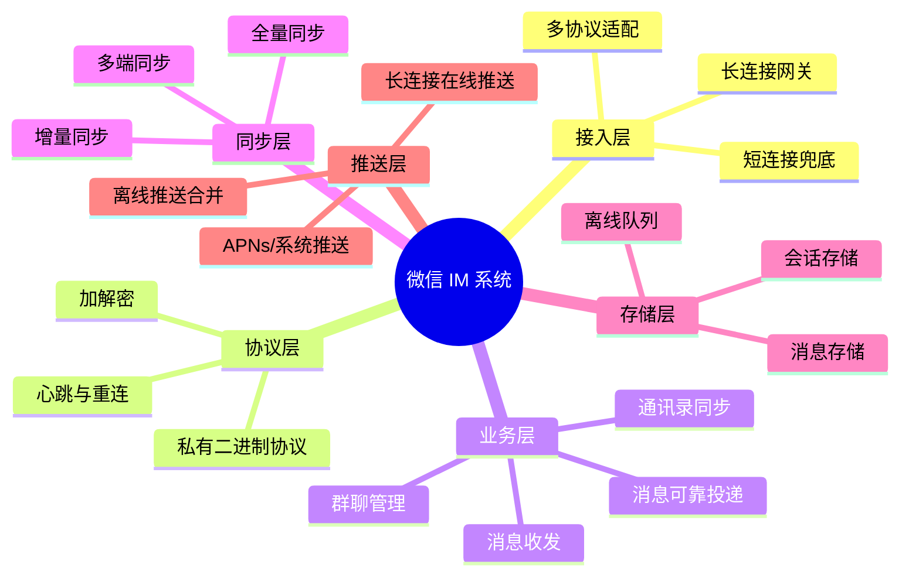
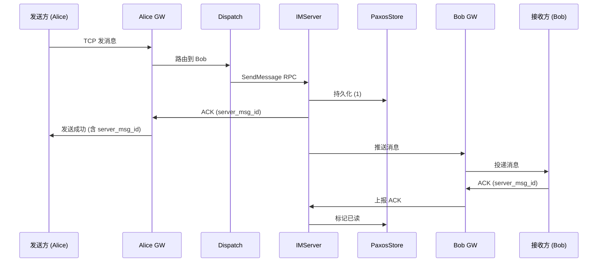
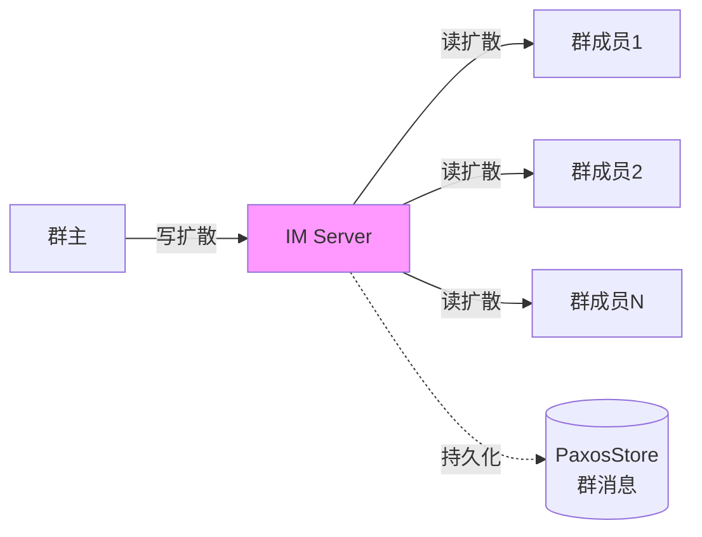
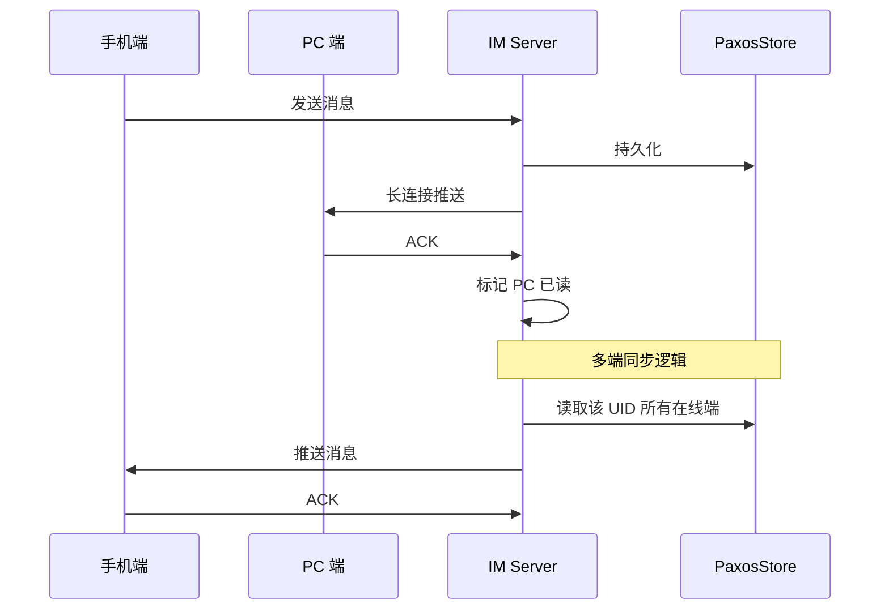
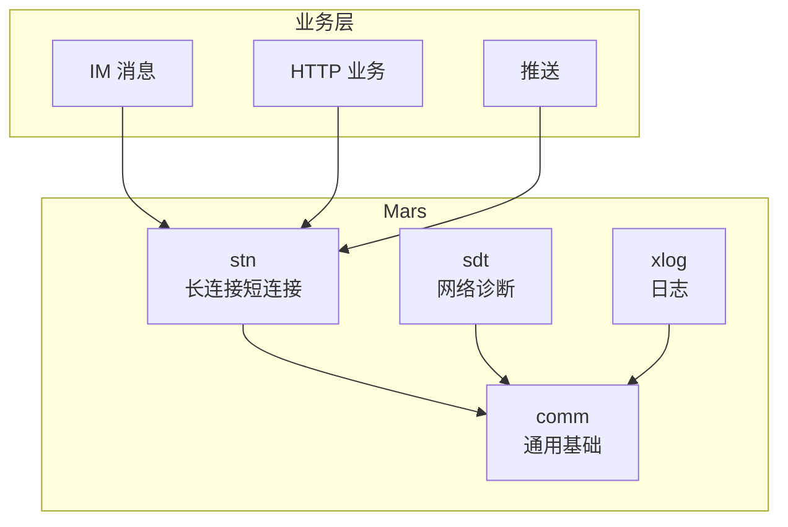
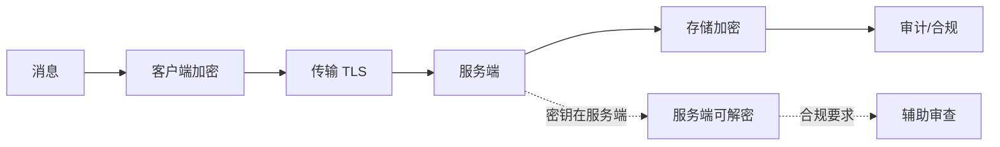
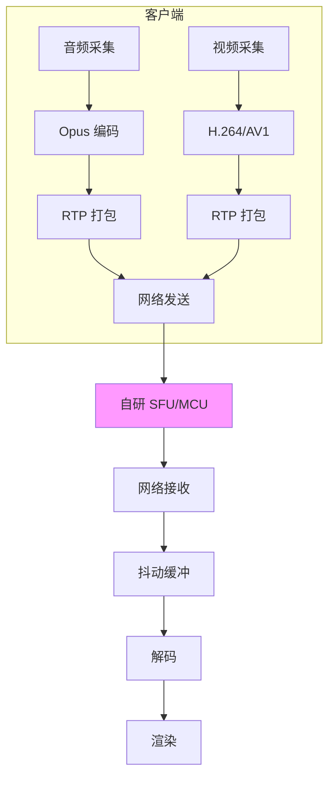

# 02 - 微信即时通讯 IM 系统

> 调研日期: 2026-06-19
> 本章目标: 深入微信 IM 私有协议、长连接网关、亿级消息可靠投递机制
> 重点: 微信 IM 是 C++ 体系下最复杂的系统, 也是张小龙团队最初的产品

---

## 1. IM 系统总体架构



### 1.1 核心指标

| 指标 | 数值 | 说明 |
|------|------|------|
| 日活 | 13.4 亿 | 2024 财报 |
| 消息量 | 千亿级/日 | 平均每人百条 |
| 长连接 | 单实例 100w+ | 网关层 |
| 消息延迟 | P99 < 100ms | 端到端 |
| 消息可靠性 | 99.999%+ | 不丢消息 |
| 群聊规模 | 单群 2000 人 | 2024 升级 |
| 历史消息 | 云端 90 天 | 默认, 可延长 |
| 端数 | iOS/Android/Mac/Windows/HarmonyOS | 5 端同步 |

---

## 2. 微信 IM 私有协议

### 2.1 为什么不用 QUIC/HTTP?

| 维度 | 微信协议 | QUIC |
|------|---------|------|
| 部署年份 | 2011 | 2013 IETF 草案 |
| 控制粒度 | 包级别 | 流级别 |
| 移动友好 | 专为弱网设计 | 通用 |
| 实现复杂度 | 中 | 高 |
| 中间设备兼容 | TCP/443 端口 | UDP/443, 部分网络屏蔽 |

**结论**: 微信诞生时 QUIC 还没成熟, 专有协议更适合场景。

### 2.2 协议分层

```
+----------------------------------------------------------+
|  协议栈分层                                                |
+----------------------------------------------------------+
|  Layer 5: 业务消息 (文本/图片/语音/视频/位置)              |
+----------------------------------------------------------+
|  Layer 4: 命令协议 (Login/SendMsg/Sync/Logout)            |
+----------------------------------------------------------+
|  Layer 3: 可靠传输层 (ACK/重传/排序)                      |
+----------------------------------------------------------+
|  Layer 2: 安全层 (TLS-like 加密 + 自研短密码)              |
+----------------------------------------------------------+
|  Layer 1: 帧协议 (包头/Magic/版本)                        |
+----------------------------------------------------------+
|  Layer 0: TCP (或移动端 KCP over UDP)                     |
+----------------------------------------------------------+
```

### 2.3 协议帧格式

```cpp
// 微信私有协议包头 (简化)
struct WechatPacket {
    uint16_t magic;           // 0xBEA0 魔数
    uint8_t  version;         // 协议版本 (5)
    uint8_t  type;            // 0xF1: 心跳 0xF2: 业务 0xF3: ACK
    uint32_t length;          // 载荷长度
    uint32_t session_id;      // 会话ID (长连接)
    uint64_t client_msg_id;   // 客户端消息ID (去重)
    uint64_t server_msg_id;   // 服务端消息ID
    uint16_t checksum;        // CRC16
    uint8_t  encrypt_type;    // 加密类型 (0: 无 1: AES 2: SM4)
    uint8_t  compress_type;   // 压缩 (0: 无 1: LZ4)
    uint8_t  payload[];       // 变长载荷
} __attribute__((packed));

static_assert(sizeof(WechatPacket) == 26, "Header size mismatch");

// 加密后的载荷结构
struct EncryptedPayload {
    uint16_t enc_len;         // 加密后长度
    uint8_t  rand_key[16];    // 随机密钥
    uint8_t  enc_data[];      // AES 加密的负载
} __attribute__((packed));
```

### 2.4 登录握手协议

```cpp
// 微信登录协议 (简化)
struct LoginRequest {
    uint8_t  version;            // 0x05
    uint8_t  client_type;        // 0x01: iOS 0x02: Android
    uint32_t uid;                // 微信 UID
    uint16_t auth_key_len;
    uint8_t  auth_key[1024];     // RSA 加密的认证密钥
    uint8_t  client_id[16];      // 设备指纹
    uint32_t login_time;         // 登录时间
    uint32_t client_version;     // 客户端版本号
};

struct LoginResponse {
    uint8_t  result;             // 0: 成功
    uint16_t server_time;        // 服务器时间 (用于时钟校准)
    uint32_t redirect_ip;        // 长连接重定向到的网关
    uint16_t redirect_port;
    uint8_t  session_key[32];    // 会话密钥 (用于后续加密)
    uint32_t heartbeat_interval; // 心跳间隔 (毫秒)
};

// 登录时序
//
// Client                       AuthServer                 IMServer
//   | ---- Hello, RSA-AES key --> |                            |
//   | <---- Auth Challenge ------ |                            |
//   | ---- Login Request -----> |                              |
//   |                            | -- 校验用户 -->              |
//   |                            | <-- 分配 session_key ------ |
//   | <---- LoginResponse ------ |                              |
//   | ----------- Connect to IMServer (redirected) ----------> |
//   | <---------- Heartbeat interval -----------|              |
//   | ---------------- Long-link Hello ------> |              |
//   | <--------------- Session Ready --------- |              |
```

---

## 3. 长连接网关 (Long-Link Gateway)

### 3.1 架构

```
+----------------------------------------------------------+
|  长连接网关架构                                            |
+----------------------------------------------------------+
|                                                            |
|  客户端 (亿级)                                             |
|     |                                                      |
|     |  TCP/443                                             |
|     v                                                      |
|  +--------------------+                                    |
|  |  L4 负载均衡 (LVS) |                                    |
|  +--------------------+                                    |
|     |                                                      |
|     v                                                      |
|  +--------------------+    +--------------------+           |
|  |  GW-1 (C++)        |    |  GW-2 (C++)        |  ...      |
|  |  100w+ 连接        |    |  100w+ 连接        |           |
|  +--------------------+    +--------------------+           |
|     |                       |                              |
|     v                       v                              |
|  +----------------------------------------+                |
|  |  消息分发集群 (Dispatch)               |                |
|  |  按 UID 一致性哈希                      |                |
|  +----------------------------------------+                |
|     |                                                      |
|     v                                                      |
|  +----------------------------------------+                |
|  |  IM 业务服务集群 (无状态, 多副本)       |                |
|  +----------------------------------------+                |
|     |                                                      |
|     v                                                      |
|  +----------------------------------------+                |
|  |  存储层 (PaxosStore + MySQL)            |                |
|  +----------------------------------------+                |
+----------------------------------------------------------+
```

### 3.2 单实例 100w+ 连接的秘密

**核心优化**:

1. **Epoll + IO 多路复用**
```cpp
// 微信长连接网关主循环 (简化)
class LongLinkGateway {
public:
    void Run() {
        const int kMaxEvents = 1024;
        struct epoll_event events[kMaxEvents];

        // 创建 epoll
        epoll_fd_ = epoll_create1(EPOLL_CLOEXEC);
        // 设置非阻塞监听
        listen_fd_ = CreateListenSocket(/* port */ 8000);

        // 注册到 epoll
        epoll_event ev;
        ev.events = EPOLLIN;
        ev.data.fd = listen_fd_;
        epoll_ctl(epoll_fd_, EPOLL_CTL_ADD, listen_fd_, &ev);

        while (running_) {
            int n = epoll_wait(epoll_fd_, events, kMaxEvents, 1000);
            for (int i = 0; i < n; ++i) {
                if (events[i].data.fd == listen_fd_) {
                    HandleNewConnection();
                } else {
                    HandleIOEvent(events[i].data.fd, events[i].events);
                }
            }
        }
    }

    void HandleNewConnection() {
        struct sockaddr_in client_addr;
        socklen_t addr_len = sizeof(client_addr);
        int conn_fd = accept4(listen_fd_,
                              (struct sockaddr*)&client_addr,
                              &addr_len,
                              SOCK_NONBLOCK | SOCK_CLOEXEC);

        if (conn_fd < 0) return;

        // 创建连接对象 (内存预分配)
        auto* conn = conn_pool_->Acquire();
        conn->fd = conn_fd;
        conn->last_active = NowMs();
        conn->state = CONN_STATE_HANDSHAKE;

        // 注册到 epoll (使用 edge-trigger 模式)
        epoll_event ev;
        ev.events = EPOLLIN | EPOLLET | EPOLLRDHUP;
        ev.data.ptr = conn;
        epoll_ctl(epoll_fd_, EPOLL_CTL_ADD, conn_fd, &ev);

        conn_count_++;
    }

    // 单线程 epoll 模式,避免锁竞争
    // 一个 worker 线程处理 10w+ 连接
    // 16 核机器 → 160w+ 连接

private:
    int epoll_fd_;
    int listen_fd_;
    std::atomic<int> conn_count_{0};
    MemoryPool<Connection>* conn_pool_;  // 预分配连接对象
};
```

2. **内存池 + 零拷贝**
```cpp
// 内存池设计
class MemoryPool {
public:
    MemoryPool(size_t block_size, size_t block_count)
        : block_size_(block_size), block_count_(block_count) {
        // 一次 mmap 大块内存
        memory_ = mmap(nullptr,
                       block_size * block_count,
                       PROT_READ | PROT_WRITE,
                       MAP_PRIVATE | MAP_ANONYMOUS,
                       -1, 0);

        // 构建空闲链表
        for (size_t i = 0; i < block_count - 1; ++i) {
            auto* block = At(i);
            block->next = At(i + 1);
        }
        At(block_count - 1)->next = nullptr;
        free_head_ = At(0);
    }

    void* Acquire() {
        if (!free_head_) return nullptr;
        Block* b = free_head_;
        free_head_ = b->next;
        return b;
    }

    void Release(void* p) {
        Block* b = static_cast<Block*>(p);
        b->next = free_head_;
        free_head_ = b;
    }

private:
    struct Block { Block* next; };
    Block* At(size_t i) {
        return reinterpret_cast<Block*>(
            static_cast<char*>(memory_) + i * block_size_);
    }

    void* memory_;
    size_t block_size_;
    size_t block_count_;
    Block* free_head_;
};

// 1MB block * 1000 blocks = 1GB
// 一个 16 核机器预分配 16GB 内存池
```

3. **共享内存 + 无锁队列**
```cpp
// Worker 线程间通信 - 无锁环形队列
template <typename T>
class SPSCRingBuffer {
public:
    bool Push(const T& item) {
        size_t current_tail = tail_.load(std::memory_order_relaxed);
        size_t next_tail = (current_tail + 1) % capacity_;
        if (next_tail == head_.load(std::memory_order_acquire)) {
            return false;  // 满
        }
        buffer_[current_tail] = item;
        tail_.store(next_tail, std::memory_order_release);
        return true;
    }

    bool Pop(T* item) {
        size_t current_head = head_.load(std::memory_order_relaxed);
        if (current_head == tail_.load(std::memory_order_acquire)) {
            return false;  // 空
        }
        *item = buffer_[current_head];
        head_.store((current_head + 1) % capacity_,
                   std::memory_order_release);
        return true;
    }

private:
    static constexpr size_t CACHE_LINE_SIZE = 64;
    alignas(CACHE_LINE_SIZE) std::atomic<size_t> head_{0};
    alignas(CACHE_LINE_SIZE) std::atomic<size_t> tail_{0};
    T buffer_[/* capacity */];
    size_t capacity_;
};
```

### 3.3 连接保活与重连

```cpp
// 心跳与超时管理
class HeartbeatManager {
public:
    void Tick() {
        int64_t now = NowMs();
        for (auto& [uid, conn] : connections_) {
            int64_t idle = now - conn->last_active;

            if (idle > kHeartbeatInterval) {  // 30s
                // 发送心跳
                SendHeartbeat(conn.get());
                conn->miss_count = 0;
            }

            if (idle > kNoDataTimeout) {  // 90s
                // 客户端无响应,主动断开
                LOG(WARNING) << "Connection timeout: " << uid;
                CloseConnection(conn.get());
            }
        }
    }

private:
    static constexpr int64_t kHeartbeatInterval = 30000;  // 30s
    static constexpr int64_t kNoDataTimeout = 90000;      // 90s
    std::unordered_map<uint64_t, std::unique_ptr<Connection>> connections_;
};
```

**重连策略 (客户端)**:
- 第一次断开: 立即重连
- 连续失败: 1s, 2s, 4s, 8s, 16s, 30s 退避
- WiFi 切换: 检测到网络变化立即重连
- 后台 → 前台: 立即重连
- 弱网: KCP 协议退化到 TCP 短连接

---

## 4. 消息可靠投递

### 4.1 消息流程



### 4.2 消息去重 (客户端)

```cpp
// 客户端消息去重 (基于 client_msg_id)
class MessageDedup {
public:
    // 检查消息是否已处理
    bool IsDuplicate(uint64_t client_msg_id) {
        // 1. 检查内存缓存 (LRU)
        if (in_memory_cache_.Contains(client_msg_id)) return true;

        // 2. 检查 MMKV 持久化
        std::string key = MakeKey(client_msg_id);
        if (mmkv_->containsKey(key)) return true;

        return false;
    }

    void MarkProcessed(uint64_t client_msg_id) {
        in_memory_cache_.Put(client_msg_id, 1);
        std::string key = MakeKey(client_msg_id);
        mmkv_->encode(key, true);
    }

private:
    LRUCache<uint64_t, int> in_memory_cache_;  // 10000 容量
    MMKV* mmkv_;  // 持久化最近 1 天的 client_msg_id
};
```

### 4.3 消息可靠投递

**三级 ACK 机制**:
1. **Server ACK** - 服务端持久化后立即返回
2. **Receiver ACK** - 接收方收到消息后确认
3. **Read ACK** - 接收方真正"看到"消息后

```cpp
// 消息状态机
enum class MessageState {
    kCreated,           // 客户端生成
    kSentToServer,      // 已发到服务端
    kServerPersisted,   // 服务端持久化
    kDeliveredToPeer,   // 投递到对端
    kRead,              // 对端已读
    kFailed,            // 失败
};

class MessageStateMachine {
public:
    void OnAck(uint64_t client_msg_id, MessageState new_state) {
        auto* msg = FindMessage(client_msg_id);
        if (!msg) return;

        msg->state = new_state;
        UpdateUI(msg);

        // 重试逻辑
        if (new_state == MessageState::kFailed) {
            if (msg->retry_count < kMaxRetry) {
                msg->retry_count++;
                ResendMessage(msg);
            } else {
                ShowSendFailedUI(msg);
            }
        }
    }

private:
    static constexpr int kMaxRetry = 3;
};
```

### 4.4 离线消息

```cpp
// 离线消息管理
class OfflineMessageQueue {
public:
    // 用户上线时拉取离线消息
    std::vector<Message> PullOfflineMessages(uint64_t uid, int64_t last_sync_id) {
        // 1. 从 PaxosStore 读取新消息
        std::vector<Message> msgs = store_->GetMessagesSince(uid, last_sync_id);

        // 2. 限制单次拉取数量
        if (msgs.size() > kMaxBatchSize) {
            msgs.resize(kMaxBatchSize);
        }

        // 3. 返回时附带最新 sync_id
        return msgs;
    }

    // 消息落盘
    void PersistOfflineMessage(uint64_t to_uid, const Message& msg) {
        std::string key = MakeOfflineKey(to_uid, msg.server_msg_id);
        // 写入 PaxosStore
        store_->Put(key, msg.Serialize());
        // 限制离线消息保留 7 天, 超过删除
        SetExpiration(key, kOfflineRetention);
    }

private:
    static constexpr size_t kMaxBatchSize = 500;
    static constexpr int kOfflineRetention = 7 * 24 * 3600;  // 7 days
    PaxosStoreClient* store_;
};
```

---

## 5. 群聊系统

### 5.1 群聊消息投递策略



**写扩散 vs 读扩散**:

| 维度 | 写扩散 | 读扩散 (微信选择) |
|------|--------|----------------|
| 写入次数 | N 倍 (群成员数) | 1 次 |
| 读取次数 | 1 次 | 1 次 |
| 存储 | 重复存储 | 单份存储 |
| 适用 | 小群 | 大群 (微信选这个) |
| 在线推送 | 简单 | 需查询在线列表 |

**微信选择读扩散的原因**:
- 单群上限 2000 人,大群占多数
- 消息写入量大, 写扩散会让数据库写入放大
- PaxosStore 读性能优秀

### 5.2 大群消息优化

```cpp
// 群消息路由 (简化)
class GroupMessageRouter {
public:
    void RouteGroupMessage(uint64_t group_id, const Message& msg) {
        // 1. 获取群成员列表
        std::vector<uint64_t> members = group_service_->GetMembers(group_id);

        // 2. 分批并行推送
        const size_t kBatchSize = 100;
        std::vector<std::future<void>> futures;
        for (size_t i = 0; i < members.size(); i += kBatchSize) {
            size_t end = std::min(i + kBatchSize, members.size());
            auto batch = std::vector<uint64_t>(
                members.begin() + i, members.begin() + end);

            futures.push_back(std::async(std::launch::async, [&, batch]() {
                for (uint64_t uid : batch) {
                    // 在线用户: 长连接推送
                    if (auto conn = conn_mgr_->GetConnection(uid)) {
                        PushToOnlineUser(conn, msg);
                    }
                    // 离线用户: 持久化
                    PersistOfflineMessage(uid, msg);
                }
            }));
        }

        for (auto& f : futures) f.wait();
    }

private:
    ConnectionManager* conn_mgr_;
    GroupService* group_service_;
    OfflineMessageQueue* offline_queue_;
};
```

### 5.3 群消息扩散控制

```cpp
// 避免大群消息风暴
class GroupMessageThrottle {
public:
    // 限流: 单个用户每分钟最多发 X 条群消息
    bool AllowSend(uint64_t uid, uint64_t group_id) {
        int64_t now = Now();
        auto& bucket = buckets_[uid];
        bucket.Refill(kRate, kBurst, now);

        if (bucket.Take(1) < 0) {
            // 限流 - 触发验证 (图形/手机验证)
            TriggerVerify(uid);
            return false;
        }
        return true;
    }

private:
    static constexpr int kRate = 30;    // 30 条/分钟
    static constexpr int kBurst = 10;   // 突发 10 条
    std::unordered_map<uint64_t, TokenBucket> buckets_;
};
```

---

## 6. 多端同步

### 6.1 同步协议

```cpp
// 增量同步请求
struct SyncRequest {
    uint64_t uid;
    int64_t  last_sync_id;     // 上次同步到的位置
    uint32_t sync_flag;        // 同步类型 (消息/通讯录/收藏/...)
    uint32_t max_count;        // 单次最多拉取
};

// 增量同步响应
struct SyncResponse {
    int64_t  new_sync_id;      // 本次同步到的最新位置
    std::vector<Message> messages;
    std::vector<ContactUpdate> contact_updates;
    std::vector<GroupUpdate> group_updates;
    bool has_more;             // 是否还有更多
};
```

### 6.2 同步策略



### 6.3 消息漫游

```cpp
// 跨端消息漫游
class MessageRoaming {
public:
    std::vector<Message> GetRoamingMessages(uint64_t uid, int64_t sync_id) {
        // 1. 从云端拉取漫游消息
        // 注意: 漫游消息有限制 (默认 7 天)
        std::vector<Message> msgs = store_->GetMessagesSince(uid, sync_id, kRoamingDays);

        // 2. 多端按 sync_id 排序
        std::sort(msgs.begin(), msgs.end(),
                  [](const Message& a, const Message& b) {
                      return a.server_msg_id < b.server_msg_id;
                  });

        return msgs;
    }

    // 实时同步
    void OnNewMessage(uint64_t uid, const Message& msg) {
        // 推送到该用户的所有在线端
        auto endpoints = conn_mgr_->GetUserEndpoints(uid);
        for (auto* ep : endpoints) {
            if (ep->device_id != msg.source_device_id) {
                // 不推送到发送端 (避免回声)
                ep->Send(msg);
            }
        }
    }

private:
    static constexpr int kRoamingDays = 7;  // 漫游保留天数
};
```

---

## 7. Mars 移动端网络库

### 7.1 Mars 架构

Mars 是微信开源的移动端网络库, GitHub Star 17k+。



### 7.2 Mars 关键设计

**长连接保活 (Android 后台)**:
- 唤醒心跳: 维持进程优先级
- TCP 短心跳: 5min/次
- TCP 长心跳: 30s 间隔
- 切换网络: WiFi ↔ 4G 立即重连

**弱网优化**:
- 智能 DNS 解析
- 多 IP 轮询
- 失败重试退避
- 请求合并

**代码示例 (iOS)**:

```objc
// Mars 启动长连接
#import <mars/stn/stn.h>

- (void)startLongLink {
    // 配置长连接参数
    NSDictionary* settings = @{
        @"longlink_host": @"long.weixin.qq.com",
        @"longlink_port": @8000,
        @"shortlink_host": @"short.weixin.qq.com",
        @"shortlink_port": @8080,
        @"heartbeat_interval": @30000,  // 30s
    };

    // 设置回调
    [MarsSTN setLongLinkEventCallback:^(LongLinkEvent event, int64_t taskid) {
        switch (event) {
            case kLongLinkEventConnected:
                NSLog(@"Long link connected");
                break;
            case kLongLinkEventDisconnected:
                NSLog(@"Long link disconnected, will reconnect");
                break;
        }
    }];

    // 启动
    [MarsSTN startLongLink:settings];
}

// 发送消息
- (void)sendMessage:(NSData*)data {
    Task task = {0};
    task.cmdid = 0xF2;  // 业务消息
    task.body = data.bytes;
    task.body_len = data.length;
    task.channel_select = kChannelLong;
    task.timeout = 5000;  // 5s 超时

    [MarsSTN sendTask:task
            callback:^(int err, int status, NSData* response) {
        if (err == 0) {
            NSLog(@"Message sent: %@", response);
        } else {
            NSLog(@"Send failed: %d", err);
        }
    }];
}
```

### 7.3 Mars 的 STN 模块

```cpp
// Mars 的 STN (Station) 核心 API
namespace mars::stn {

// 启动/停止
void StartLongLink();
void StopLongLink();

// 发送任务 (长连接/短连接)
int SendTask(const Task& task, TaskCallback callback);

// 设置网络变更回调
void SetNetworkChangeCallback(NetworkChangeCallback callback);

// 设置长连接事件回调
void SetLongLinkEventCallback(LongLinkEventCallback callback);

}

// 任务定义
struct Task {
    uint32_t cmdid;          // 命令 ID
    uint32_t channel_select; // 长连接/短连接
    std::vector<uint8_t> body;
    int32_t timeout;
    int32_t retry_count;
    // ... 用户上下文
};
```

---

## 8. 消息安全

### 8.1 端到端加密现状

微信 **目前未全量启用端到端加密**, 但有以下机制:

- **传输加密**: TLS 1.3
- **存储加密**: 消息在服务端加密存储
- **数据库加密**: WCDB 字段级加密
- **短密码 + 长密码**: 客户端本地数据保护

### 8.2 风险与挑战



**已知争议**:
- 服务端可解密 (合规要求)
- 与 Signal/WhatsApp 端到端不同
- 微信已在测试端到端加密 (群聊灰度)

### 8.3 风控系统

```cpp
// 实时风控评分
class RiskControl {
public:
    int Score(uint64_t uid, const std::string& content) {
        int score = 0;

        // 1. 文本风险 (涉黄/涉政/广告)
        score += text_model_.Predict(content) * 100;

        // 2. 行为风险 (高频/陌生人/群发)
        score += behavior_model_.Predict(uid) * 50;

        // 3. 设备风险 (新设备/模拟器/代理)
        score += device_model_.Predict(uid) * 30;

        // 4. 关系风险 (陌生人/非好友)
        if (!IsFriend(uid, target_uid_)) {
            score += 20;
        }

        return score;
    }

    RiskAction TakeAction(int score) {
        if (score > 80) return kActionBan;       // 封禁
        if (score > 50) return kActionVerify;    // 验证码
        if (score > 20) return kActionLimit;     // 限流
        return kActionAllow;
    }

private:
    TextRiskModel text_model_;
    BehaviorRiskModel behavior_model_;
    DeviceRiskModel device_model_;
};
```

---

## 9. 企业微信 IM 差异

### 9.1 架构对比

| 维度 | 微信 | 企业微信 |
|------|------|---------|
| 用户量 | 13.4 亿 | 1.4 亿 |
| 群规模 | 2000 | 2000 (部门群无上限) |
| 消息可靠性 | 5 个 9 | 5 个 9 |
| 内部互通 | 个人微信 | 企业间互联 |
| OA 集成 | 无 | 深度集成 |
| API 开放 | 受限 | 全面开放 |
| 音视频 | 实时音视频 | 会议 1000+ 人 |
| 消息撤回 | 2 分钟 | 24 小时 |

### 9.2 企业微信消息模型

```cpp
// 企业微信消息类型
enum class CorpMessageType {
    kText = 1,
    kImage = 2,
    kVoice = 3,
    kVideo = 4,
    kFile = 5,
    kCard = 6,           // 消息卡片
    kMarkdown = 7,
    kNews = 8,           // 图文消息
    kMiniProgram = 9,    // 小程序
    kMeeting = 10,       // 会议邀请
    kTodo = 11,          // 待办
    kRedPacket = 12,     // 红包
    kApproval = 13,      // 审批
};

// 企业微信特有的消息流
class CorpMessageFlow {
public:
    // 同步到企业邮箱
    void ArchiveToMail(const Message& msg) {
        if (msg.corp_id != 0) {
            mail_service_->SendToMail(msg);
        }
    }

    // 同步到 OA 系统
    void SyncToOA(const Message& msg) {
        if (msg.contains_approval) {
            oa_service_->CreateApproval(msg);
        }
    }
};
```

### 9.3 企业微信开放 API

```python
# 企业微信开放 API 示例
import requests

CORP_ID = "ww1234567890abcdef"
CORP_SECRET = "your_secret_here"

# 获取 access_token
def get_access_token():
    url = f"https://qyapi.weixin.qq.com/cgi-bin/gettoken?corpid={CORP_ID}&corpsecret={CORP_SECRET}"
    resp = requests.get(url).json()
    return resp["access_token"]

# 发送应用消息
def send_message(user_id, content):
    token = get_access_token()
    url = f"https://qyapi.weixin.qq.com/cgi-bin/message/send?access_token={token}"
    payload = {
        "touser": user_id,
        "msgtype": "text",
        "agentid": 1000002,
        "text": {
            "content": content
        },
        "safe": 0  // 0: 不加密 1: 加密
    }
    return requests.post(url, json=payload).json()

# 回调处理
def handle_callback(msg_signature, timestamp, nonce, echostr, body):
    # 验证签名
    if not verify_signature(CORP_SECRET, msg_signature, timestamp, nonce):
        return "error"

    # 解析加密消息
    decrypted = decrypt_message(CORP_SECRET, body)
    msg = xml_to_dict(decrypted)

    # 处理消息
    process_message(msg)

    return "success"
```

---

## 10. 实时音视频 (Real-Time)

### 10.1 微信音视频架构



**关键技术**:
- 音频: Opus + PLC (丢包隐藏)
- 视频: H.264 → H.265/AV1 (逐步切换)
- 网络: 自研 UDP/QUIC-like 协议
- QoS: 自适应码率, FEC 前向纠错
- 多人会议: SFU (微信 8 人音视频, 1000+ 会议)

### 10.2 群聊音视频

```cpp
// 微信群视频通话流程
class GroupVideoCall {
public:
    void StartCall(uint64_t room_id, std::vector<uint64_t> participants) {
        // 1. 创建房间 (SFU)
        auto sfu = sfu_service_->CreateRoom(room_id, /* max_size */ 9);

        // 2. 通知所有参与者
        for (uint64_t uid : participants) {
            Notification notif;
            notif.type = kNotificationVideoCall;
            notif.room_id = room_id;
            notif.sfu_addr = sfu.addr;
            PushNotification(uid, notif);
        }

        // 3. 等待参与者加入
        WaitForParticipants(room_id, participants.size(), 30s);
    }

    // 客户端加入
    void JoinRoom(uint64_t uid, uint64_t room_id) {
        // 通过 ICE 协商, P2P 失败 fallback 到 SFU
        auto sfu = sfu_service_->GetRoom(room_id);
        auto* session = new RtpSession(uid, sfu);

        // 音视频传输
        StartCapture(session);
    }
};
```

---

## 11. IM 性能优化

### 11.1 消息分发优化

```cpp
// 消息分发的零拷贝
class ZeroCopyDispatch {
public:
    // 使用 mmap 在进程间共享消息
    void Dispatch(uint64_t to_uid, const MessageBuffer& msg) {
        // 1. 在共享内存中分配 buffer
        void* buf = shm_pool_->Acquire(msg.size());

        // 2. 复制到共享内存 (一次 copy)
        memcpy(buf, msg.data(), msg.size());

        // 3. 投递到 worker 队列 (无 copy)
        shm_queue_->Push({to_uid, buf, msg.size()});
    }

private:
    SharedMemoryPool* shm_pool_;
    SharedMemoryQueue* shm_queue_;
};
```

### 11.2 关键性能数据

| 场景 | 性能指标 | 优化手段 |
|------|---------|---------|
| 消息发送 | P99 < 50ms | 长连接 + 内存分发 |
| 群消息投递 | 1000 人群 < 200ms | 读扩散 + 批量推送 |
| 消息同步 | 1 万条 < 3s | 增量 + 压缩 |
| 长连接 | 100w/实例 | epoll + 内存池 |
| 离线拉取 | 500 条 < 1s | 批量持久化 + 限流 |
| 音视频 | 端到端 < 200ms | 自研 SFU + UDP |

---

## 12. 借鉴清单 (对 IM 系统)

### 12.1 对 TikTok 私信系统

- **借鉴**: 长连接网关设计 (Mars)
- **借鉴**: 增量同步协议
- **借鉴**: 多端同步策略
- **适配**: TikTok 私信需要 50w+ 单实例, 沿用 Mars 架构

### 12.2 对 AI 直播平台

- **借鉴**: 长连接用于直播弹幕实时分发
- **借鉴**: 群消息用于直播间连麦
- **借鉴**: Mars 弱网优化应对直播弱网场景
- **借鉴**: 消息可靠投递保障弹幕不丢
- **适配**: 直播弹幕量大, 需要批量化, 不能像 IM 那样逐条推送

### 12.3 实践建议

| 实践 | 适用场景 |
|------|---------|
| TCP 长连接 (而非 WebSocket) | 移动端 IM/直播 |
| 二进制协议 (而非 JSON) | 性能敏感 |
| 读写扩散 (读扩散优先) | 大群/大房间 |
| 增量同步 | 多端同步 |
| 内存池 | 高并发 |
| 智能心跳 | 移动端后台 |

---

## 13. 小结

### 关键要点

1. **微信协议是私有的二进制协议** - TCP 上自研, 不用 HTTP/2 或 QUIC
2. **长连接网关是 C++ 极限优化** - 单实例 100w+ 连接
3. **消息可靠投递靠三级 ACK** - 服务端 ACK、接收方 ACK、已读 ACK
4. **群消息用读扩散** - 写扩散只对小群
5. **多端同步靠 sync_id** - 增量拉取
6. **Mars 开源了移动端实现** - 可直接用
7. **企业微信是企业级 IM** - 与 OA 深度集成
8. **服务端可解密** - 合规要求, 与 Signal 不同

### 下章预告

`03-朋友圈与公众号.md` - 朋友圈双列 Feed + 公众号内容平台
