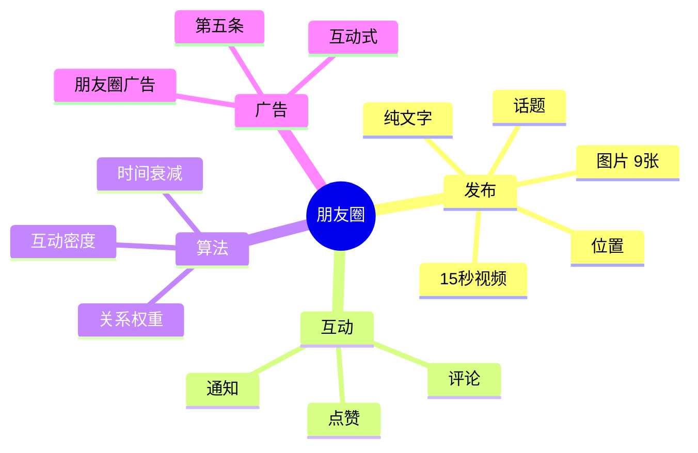
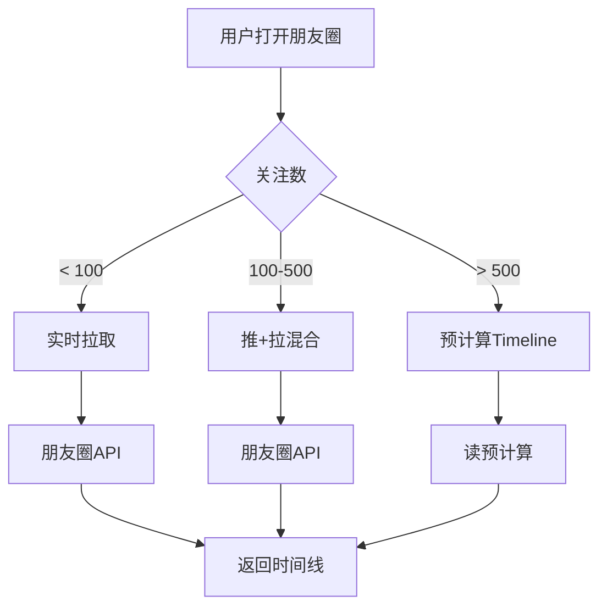
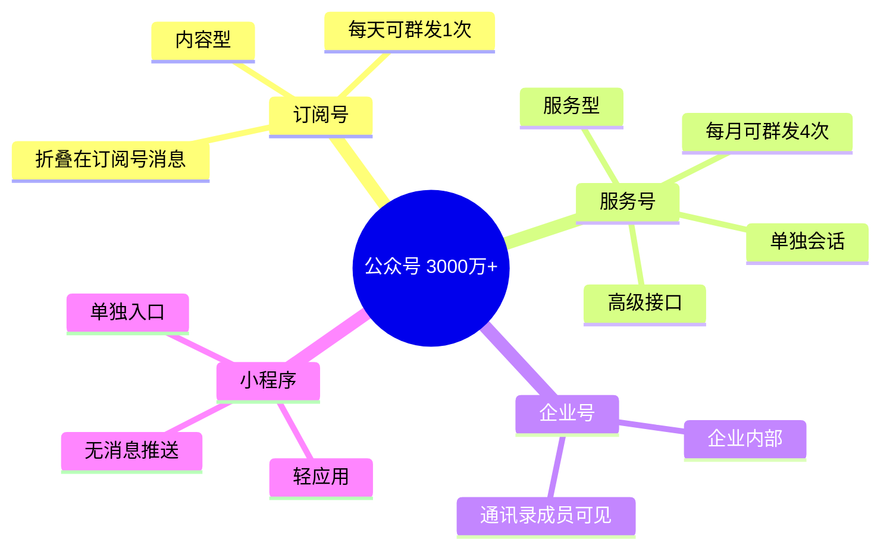
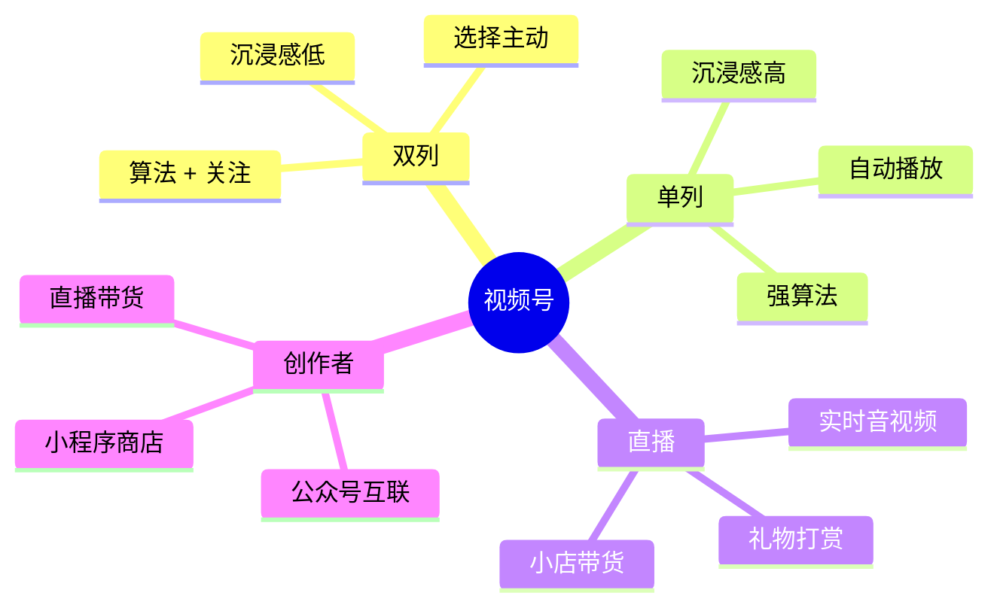
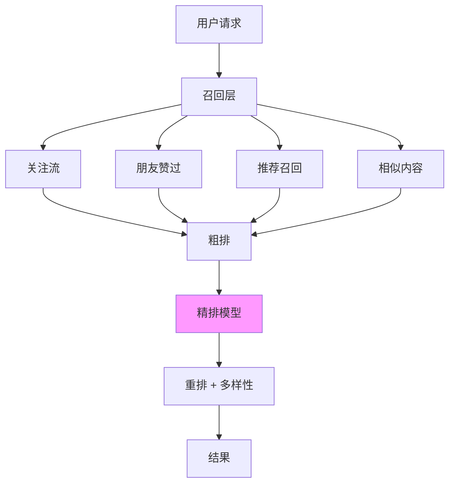
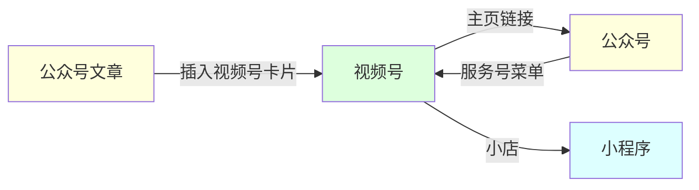
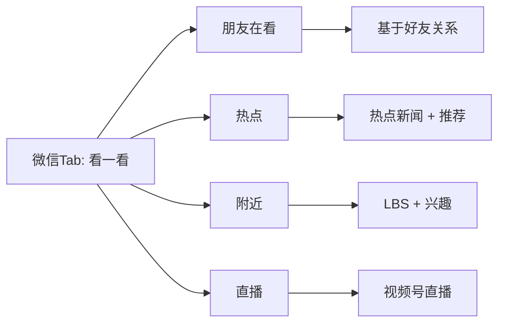
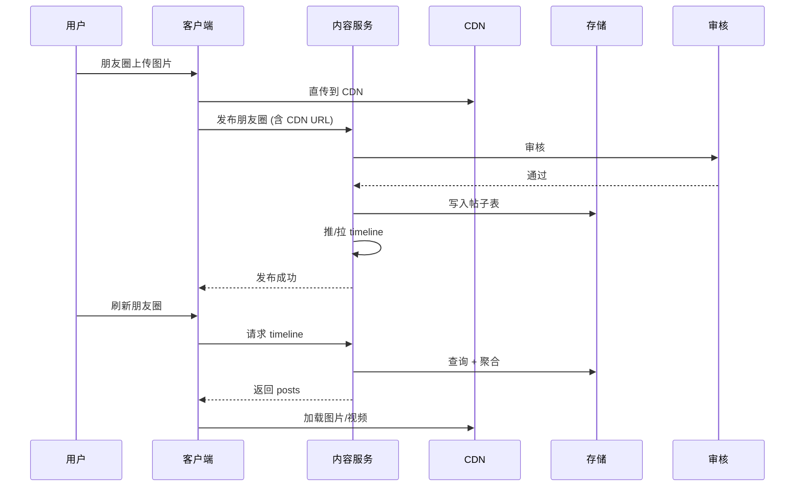

# 03 - 朋友圈与公众号 (内容平台)

> 调研日期: 2026-06-19
> 本章目标: 深入朋友圈双列 Feed、公众号内容平台、视频号推荐
> 重点: 微信的"另一面" - 不仅仅是 IM, 还是个内容分发平台

---

## 1. 朋友圈架构

### 1.1 业务规模

| 指标 | 数值 | 说明 |
|------|------|------|
| 日活 | 7.5 亿 (2024) | 发布 + 浏览 |
| 日均发布 | 1 亿+ | 文字/图片/视频 |
| 日均曝光 | 100 亿+ | 浏览 + 互动 |
| 内容保留 | 永久 | 直到用户删除 |
| 单条时间线 | 平均 100-200 条/天 | - |
| 互动形式 | 点赞/评论/转发 | - |

### 1.2 朋友圈双列 Feed



### 1.3 朋友圈架构图

```
+----------------------------------------------------------+
|  朋友圈系统架构                                            |
+----------------------------------------------------------+
|                                                            |
|  发布端 (Client)                                            |
|     |                                                      |
|     |  上传图片到 CDN                                        |
|     v                                                      |
|  +------------------+    +-----------------+               |
|  | 朋友圈写服务     |    | 朋友圈读服务    |               |
|  | (PHP/C++)        |    | (C++/Go)        |               |
|  +------------------+    +-----------------+               |
|     |                       |                              |
|     v                       v                              |
|  +------------------+    +-----------------+               |
|  | 朋友圈内容库     |    | 关注关系链     |               |
|  | (PaxosStore)     |    | (好友关系)     |               |
|  +------------------+    +-----------------+               |
|     |                       |                              |
|     v                       v                              |
|  +------------------+    +-----------------+               |
|  | 朋友圈时间线     |    | 用户画像       |               |
|  | 预计算 + 实时     |    | (标签/兴趣)    |               |
|  +------------------+    +-----------------+               |
|     |                       |                              |
|     v                       v                              |
|  +--------------------------+                              |
|  | 推/拉 混合策略             |                              |
|  | - 关注 ≤ 100: 推          |                              |
|  | - 关注 > 100: 拉          |                              |
|  +--------------------------+                              |
|     |                                                      |
|     v                                                      |
|  +------------------+                                       |
|  | CDN (图片/视频)  |                                       |
|  +------------------+                                       |
+----------------------------------------------------------+
```

---

## 2. 朋友圈数据模型

### 2.1 核心数据表

```sql
-- 朋友圈帖子表
CREATE TABLE moments_post (
    post_id BIGINT UNSIGNED PRIMARY KEY,        -- 帖子ID
    uid BIGINT UNSIGNED NOT NULL,               -- 发布者
    post_type TINYINT NOT NULL,                 -- 1: 文字 2: 图片 3: 视频
    content TEXT,                               -- 文字内容
    media_urls JSON,                            -- 媒体 URL 列表
    location VARCHAR(255),                      -- 位置
    create_time INT UNSIGNED NOT NULL,          -- 发布时间
    visibility TINYINT NOT NULL,                -- 可见性 (公开/私密/部分)
    like_count INT UNSIGNED DEFAULT 0,          -- 点赞数
    comment_count INT UNSIGNED DEFAULT 0,       -- 评论数
    share_count INT UNSIGNED DEFAULT 0,         -- 转发数
    INDEX idx_uid_time (uid, create_time)
) ENGINE=InnoDB PARTITION BY HASH(post_id) PARTITIONS 64;

-- 点赞表
CREATE TABLE moments_like (
    post_id BIGINT UNSIGNED NOT NULL,
    uid BIGINT UNSIGNED NOT NULL,               -- 点赞者
    create_time INT UNSIGNED NOT NULL,
    PRIMARY KEY (post_id, uid)
) ENGINE=InnoDB PARTITION BY HASH(post_id) PARTITIONS 64;

-- 评论表
CREATE TABLE moments_comment (
    comment_id BIGINT UNSIGNED PRIMARY KEY,
    post_id BIGINT UNSIGNED NOT NULL,
    uid BIGINT UNSIGNED NOT NULL,               -- 评论者
    parent_comment_id BIGINT UNSIGNED,          -- 父评论 (回复)
    content VARCHAR(1024) NOT NULL,
    create_time INT UNSIGNED NOT NULL,
    INDEX idx_post (post_id, create_time)
) ENGINE=InnoDB PARTITION BY HASH(post_id) PARTITIONS 64;
```

### 2.2 关注关系链

```cpp
// 关注关系 (好友关系)
class RelationGraph {
public:
    // 双向关注判断
    bool IsFriend(uint64_t uid1, uint64_t uid2) {
        // 查询好友关系, 双向
        return friend_set_[uid1].count(uid2) > 0;
    }

    // 获取好友列表
    std::vector<uint64_t> GetFriends(uint64_t uid) {
        std::vector<uint64_t> result;
        auto& set = friend_set_[uid];
        result.reserve(set.size());
        for (auto f : set) result.push_back(f);
        return result;
    }

    // 获取关注列表 (单向, 含公众号/视频号)
    std::vector<uint64_t> GetFollowings(uint64_t uid) {
        return follow_set_[uid].ToVector();
    }

private:
    // uid -> 好友 set
    std::unordered_map<uint64_t, std::unordered_set<uint64_t>> friend_set_;
    // uid -> 关注 set (单向)
    std::unordered_map<uint64_t, std::unordered_set<uint64_t>> follow_set_;
};
```

---

## 3. 朋友圈时间线生成

### 3.1 推/拉混合策略



**核心策略**:
- **小账号 (关注 < 100)**: 实时拉取所有关注者的新内容
- **中账号 (100-500)**: 推 + 拉混合
- **大账号 (公众号/明星)**: 粉丝主动拉, 不会推送给粉丝

```cpp
// 朋友圈时间线生成
class TimelineService {
public:
    Timeline GetTimeline(uint64_t uid, int64_t cursor, int count) {
        // 1. 查询用户的关注关系
        auto followings = relation_graph_->GetFollowings(uid);
        int fanout_threshold = 500;  // 关注数阈值

        Timeline timeline;
        if (followings.size() < fanout_threshold) {
            // 方式一: 拉模式
            timeline = PullTimeline(uid, followings, cursor, count);
        } else {
            // 方式二: 读预计算的 timeline
            timeline = ReadPrecomputedTimeline(uid, cursor, count);
        }

        return timeline;
    }

    // 拉模式 - 实时合并多个关注流
    Timeline PullTimeline(uint64_t uid,
                          const std::vector<uint64_t>& followings,
                          int64_t cursor, int count) {
        // 1. 并行查询每个关注者的新帖子
        std::vector<std::vector<Post>> all_posts(followings.size());
        std::vector<std::thread> threads;

        for (size_t i = 0; i < followings.size(); ++i) {
            threads.emplace_back([&, i]() {
                all_posts[i] = post_service_->GetRecentPosts(
                    followings[i], cursor, /* limit */ 20);
            });
        }
        for (auto& t : threads) t.join();

        // 2. 合并 + 按时间排序
        std::vector<Post> merged;
        for (auto& posts : all_posts) {
            merged.insert(merged.end(), posts.begin(), posts.end());
        }
        std::sort(merged.begin(), merged.end(),
                  [](const Post& a, const Post& b) {
                      return a.create_time > b.create_time;
                  });

        // 3. 截取请求数量
        Timeline result;
        result.posts.assign(merged.begin(),
                            merged.begin() + std::min(count, (int)merged.size()));
        result.has_more = merged.size() > count;
        result.next_cursor = result.posts.empty() ? 0
            : result.posts.back().create_time;
        return result;
    }

private:
    RelationGraph* relation_graph_;
    PostService* post_service_;
};
```

### 3.2 时间线预计算 (大 V)

```cpp
// 预计算时间线 - 异步
class TimelinePrecomputer {
public:
    void OnNewPost(const Post& post) {
        // 异步扩散给所有粉丝
        AsyncDispatchFans(post);

        // 推送到关注者的 timeline
        AsyncPushToTimelines(post);
    }

    void AsyncPushToTimelines(const Post& post) {
        // 1. 获取作者所有粉丝
        auto fans = fan_service_->GetFans(post.uid);

        // 2. 分批写入粉丝的 timeline
        const int kBatchSize = 1000;
        for (size_t i = 0; i < fans.size(); i += kBatchSize) {
            auto batch = std::vector<uint64_t>(
                fans.begin() + i,
                fans.begin() + std::min(i + kBatchSize, fans.size()));

            // 投递到消息队列
            async_queue_->Submit([this, post, batch]() {
                for (uint64_t fan : batch) {
                    PushToTimeline(fan, post);
                }
            });
        }
    }

    void PushToTimeline(uint64_t uid, const Post& post) {
        // 1. 写入 Redis (timeline 缓存)
        std::string key = MakeTimelineKey(uid);
        redis_->ZADD(key, post.create_time, post.Serialize());

        // 2. 限制长度 (保留最近 1000 条)
        redis_->ZREMRANGEBYRANK(key, 0, -1001);
    }

private:
    FanService* fan_service_;
    AsyncQueue* async_queue_;
    RedisClient* redis_;
};
```

### 3.3 朋友圈降级策略

```cpp
// 朋友圈的限流与降级
class MomentThrottle {
public:
    bool AllowPost(uint64_t uid) {
        int64_t now = Now();
        auto& stats = post_stats_[uid];

        // 1. 限流: 每用户每分钟最多 1 条
        if (now - stats.last_post_time < 60) {
            return false;
        }

        // 2. 限流: 大 V 每天最多 N 条
        if (IsBigV(uid) && stats.daily_count >= 10) {
            return false;
        }

        // 3. 风控: 敏感内容拦截
        if (RiskControl::IsSensitive(content)) {
            return false;
        }

        stats.last_post_time = now;
        stats.daily_count++;
        return true;
    }

    // 动态降级 (大 V 热点事件)
    void DegradeForBigV(uint64_t bigv_uid) {
        // 热点大 V 内容不预推
        // 改用主动拉取
        timeline_service_->SetPullMode(bigv_uid, true);
    }
};
```

---

## 4. 公众号

### 4.1 公众号分类



### 4.2 公众号架构

```
+----------------------------------------------------------+
|  公众号平台架构                                            |
+----------------------------------------------------------+
|                                                            |
|  +-------------------+                                     |
|  | 公众号管理后台     | <-- 运营者                          |
|  | (微信公众平台)     |                                     |
|  +-------------------+                                     |
|     |                                                      |
|     v                                                      |
|  +-------------------+    +-----------------+              |
|  | 内容编辑/排版     |    | 素材管理        |              |
|  +-------------------+    +-----------------+              |
|     |                       |                              |
|     v                       v                              |
|  +---------------------------------------------+           |
|  | 内容平台 (CMS)                                |           |
|  | - 文章 CRUD                                   |           |
|  | - 排版/图片处理                              |           |
|  | - 草稿/发布                                  |           |
|  +---------------------------------------------+           |
|     |                                                      |
|     v                                                      |
|  +-------------------+                                     |
|  | 文章内容库        | (CDN + KV)                          |
|  +-------------------+                                     |
|     |                                                      |
|     v                                                      |
|  +-------------------+    +-----------------+              |
|  | 群发任务调度      |    | 用户分群        |              |
|  +-------------------+    +-----------------+              |
|     |                       |                              |
|     v                       v                              |
|  +---------------------------------------------+           |
|  | 推送服务 (异步队列)                          |           |
|  | - 模板消息 (服务号)                          |           |
|  | - 订阅消息 (订阅号 2023 新规)                |           |
|  | - 客服消息                                    |           |
|  +---------------------------------------------+           |
|     |                                                      |
|     v                                                      |
|  +---------------------------------------------+           |
|  | 用户微信 (收件箱)                            |           |
|  | - 订阅号折叠                                  |           |
|  | - 服务号单独消息                              |           |
|  +---------------------------------------------+           |
+----------------------------------------------------------+
```

### 4.3 公众号核心 API

```python
# 公众号服务端示例 (Flask)
from flask import Flask, request
import hashlib
import xml.etree.ElementTree as ET

app = Flask(__name__)

WECHAT_TOKEN = "your_token"
APP_ID = "wx1234567890abcdef"
APP_SECRET = "your_secret"

# 验证签名
def verify_signature(signature, timestamp, nonce):
    arr = sorted([WECHAT_TOKEN, timestamp, nonce])
    sha1 = hashlib.sha1("".join(arr).encode()).hexdigest()
    return sha1 == signature

# 接收用户消息
@app.route("/wechat/callback", methods=["GET", "POST"])
def wechat_callback():
    if request.method == "GET":
        # 验证 URL
        signature = request.args.get("signature")
        timestamp = request.args.get("timestamp")
        nonce = request.args.get("nonce")
        echostr = request.args.get("echostr")

        if verify_signature(signature, timestamp, nonce):
            return echostr
        return "error"

    elif request.method == "POST":
        # 接收消息
        xml_data = request.data
        msg = parse_xml(xml_data)

        # 路由处理
        if msg["MsgType"] == "text":
            return handle_text(msg)
        elif msg["MsgType"] == "event":
            return handle_event(msg)
        # ...

# 主动推送客服消息
def send_custom_message(openid, content):
    access_token = get_access_token()
    url = f"https://api.weixin.qq.com/cgi-bin/message/custom/send?access_token={access_token}"
    payload = {
        "touser": openid,
        "msgtype": "text",
        "text": {"content": content}
    }
    return requests.post(url, json=payload).json()

# 模板消息推送
def send_template_message(openid, template_id, data):
    access_token = get_access_token()
    url = f"https://api.weixin.qq.com/cgi-bin/message/template/send?access_token={access_token}"
    payload = {
        "touser": openid,
        "template_id": template_id,
        "data": data
    }
    return requests.post(url, json=payload).json()
```

### 4.4 订阅号 vs 服务号

| 维度 | 订阅号 | 服务号 |
|------|--------|--------|
| 群发频率 | 每天 1 次 | 每月 4 次 |
| 显示位置 | 订阅号消息 (折叠) | 单独消息列表 |
| 自定义菜单 | 无 | 有 |
| 高级接口 | 受限 | 全面 |
| 模板消息 | 无 (2023 改为订阅消息) | 有 |
| 微信支付 | 无 | 有 |
| 小程序关联 | 有 | 有 |
| 适用场景 | 内容/媒体 | 企业/服务 |

---

## 5. 视频号 (Channels)

### 5.1 视频号业务规模

| 指标 | 数值 | 时间 |
|------|------|------|
| DAU | 8 亿+ | 2024 Q3 |
| 日均使用时长 | 50 分钟+ | 2024 |
| 月活创作者 | 1000 万+ | 2024 |
| 直播带货 GMV | 高速增长 | 2024 |
| 算法机制 | 双列 + 单列 | - |

### 5.2 视频号双列 vs 单列



### 5.3 视频号推荐架构



**推荐特征**:
- 用户画像: 年龄/性别/兴趣/关注
- 内容特征: 类目/标签/封面/时长
- 行为特征: 完播率/点赞/评论/转发
- 关系特征: 好友互动/同群赞过
- 实时特征: 最近 5 分钟行为

### 5.4 视频号技术栈

```cpp
// 视频号服务 (简化)
class VideoChannelService {
public:
    // 推荐流
    Feed GetRecommendFeed(uint64_t uid, int64_t cursor) {
        // 1. 多路召回
        std::vector<Video> candidates;
        candidates += recall_following_(uid, 100);
        candidates += recall_friend_liked_(uid, 100);
        candidates += recall_i2i_(uid, 200);  // 相似物品
        candidates += recall_u2i_(uid, 200);  // 用户兴趣

        // 2. 粗排 (双塔模型)
        std::vector<Video> rough_ranked = rough_rank_model_.Rank(uid, candidates);

        // 3. 精排 (DNN)
        std::vector<Video> fine_ranked = fine_rank_model_.Rank(uid, rough_ranked);

        // 4. 重排 (多样性 + 业务规则)
        std::vector<Video> final_list = rerank_.Apply(uid, fine_ranked);

        // 5. 返回
        return MakeFeed(final_list, cursor);
    }

    // 视频上传 + 转码
    void UploadVideo(uint64_t uid, const std::string& file) {
        // 1. 上传到对象存储
        std::string oss_key = oss_->Upload(file);

        // 2. 触发异步转码 (多码率)
        transcode_queue_->Submit([oss_key]() {
            // 720p, 1080p, H.264/H.265
            Transcode(oss_key, /* profiles */ {"720p", "1080p"});
        });

        // 3. 内容审核
        audit_queue_->Submit([oss_key]() {
            ContentAudit(oss_key);
        });
    }

private:
    RecallFollowing recall_following_;
    RecallFriendLiked recall_friend_liked_;
    RecallI2I recall_i2i_;
    RecallU2I recall_u2i_;
    RoughRankModel rough_rank_model_;
    FineRankModel fine_rank_model_;
    Reranker rerank_;
    ObjectStorage* oss_;
    AsyncQueue* transcode_queue_;
    AsyncQueue* audit_queue_;
};
```

### 5.5 视频号与公众号互通



**互通能力**:
- 公众号文章可插入视频号
- 视频号主页可挂公众号链接
- 视频号小店基于小程序
- 视频号直播可挂公众号链接

---

## 6. 看一看 / 搜一搜

### 6.1 看一看



### 6.2 搜一搜架构

```cpp
// 微信搜一搜 (简化)
class WechatSearch {
public:
    SearchResult Search(const std::string& query, uint64_t uid) {
        // 1. Query 理解
        QueryInfo info = nlp_.Parse(query);

        // 2. 多源召回
        std::vector<Doc> candidates;
        candidates += search_articles_(query);    // 公众号文章
        candidates += search_videos_(query);      // 视频号
        candidates += search_moments_(query);     // 朋友圈
        candidates += search_mini_programs_(query);  // 小程序
        candidates += search_web_(query);         // 微信内网页

        // 3. 个性化排序
        std::vector<Doc> ranked = rank_model_.Rank(uid, candidates);

        // 4. 结果分类聚合
        return AggregateByType(ranked);
    }

private:
    NLPService nlp_;
    RankModel rank_model_;

    Searcher<Article> search_articles_;
    Searcher<Video> search_videos_;
    Searcher<Moment> search_moments_;
    Searcher<MiniProgram> search_mini_programs_;
    Searcher<WebPage> search_web_;
};
```

---

## 7. 内容审核

### 7.1 朋友圈审核

```cpp
// 朋友圈内容审核
class MomentAudit {
public:
    AuditResult Audit(const Post& post) {
        // 1. 文本审核 (AI + 关键词)
        if (auto r = text_audit_.Check(post.content); !r.passed) {
            return AuditResult::Reject(r.reason);
        }

        // 2. 图片审核 (AI 涉黄/涉暴/政治)
        for (const auto& image_url : post.media_urls) {
            if (auto r = image_audit_.Check(image_url); !r.passed) {
                return AuditResult::Reject(r.reason);
            }
        }

        // 3. 视频审核
        for (const auto& video_url : post.video_urls) {
            if (auto r = video_audit_.Check(video_url); !r.passed) {
                return AuditResult::Reject(r.reason);
            }
        }

        // 4. 行为审核 (频繁/群发/广告)
        if (behavior_audit_.IsSpam(post.uid)) {
            return AuditResult::Reject("behavior");
        }

        return AuditResult::Pass();
    }

private:
    TextAuditService text_audit_;
    ImageAuditService image_audit_;
    VideoAuditService video_audit_;
    BehaviorAuditService behavior_audit_;
};
```

### 7.2 公众号审核

```cpp
// 公众号文章审核 - 多级
class ArticleAudit {
public:
    AuditResult Audit(const Article& article) {
        // 1. 机器审核
        if (auto r = ml_audit_.Check(article); !r.passed) {
            // 2. 人工抽审 (低置信度)
            if (r.confidence < 0.7) {
                return SubmitToHumanReview(article);
            }
            return AuditResult::Reject(r.reason);
        }

        // 3. 敏感词过滤
        if (KeywordFilter::HasSensitive(article.content)) {
            return AuditResult::Reject("keyword");
        }

        return AuditResult::Pass();
    }

private:
    MLAuditService ml_audit_;
    HumanReviewQueue human_review_queue_;
    KeywordFilter keyword_filter_;
};
```

---

## 8. 内容平台数据流



---

## 9. 借鉴清单 (对内容平台)

### 9.1 对 TikTok 短视频

| 借鉴点 | 应用 |
|--------|------|
| 推/拉混合 timeline | TikTok 关注流 |
| 双列 Feed | TikTok 朋友/关注 |
| 内容审核流水线 | TikTok 上传审核 |
| 关系链召回 | TikTok "朋友点赞"流 |
| 视频号算法 | TikTok 推荐 |

### 9.2 对 AI 直播平台

| 借鉴点 | 应用 |
|--------|------|
| 公众号 + 视频号互通 | AI 直播 + 内容沉淀 |
| 朋友圈双列 | AI 直播间广场 |
| 直播带货 | AI 数字人直播 |
| 看一看算法 | AI 直播内容分发 |

---

## 10. 小结

### 关键要点

1. **朋友圈用推/拉混合 timeline** - 大 V 推, 小 V 拉
2. **公众号分订阅/服务** - 不同能力/不同展示
3. **视频号是算法 + 关系** - 区别于抖音的纯算法
4. **公众号/视频号/小程序生态互通** - 微信内容生态闭环
5. **内容审核分多级** - 机器 + 人工抽审 + 关键词

### 下章预告

`04-小程序与微信生态.md` - 小程序双线程模型 + Skyline 渲染引擎 + 跨端方案
