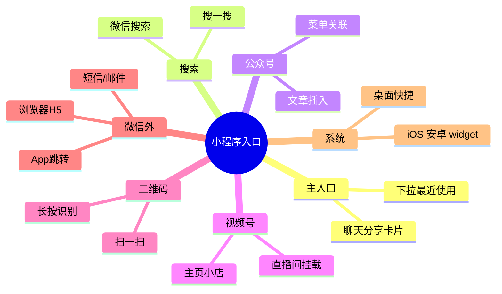
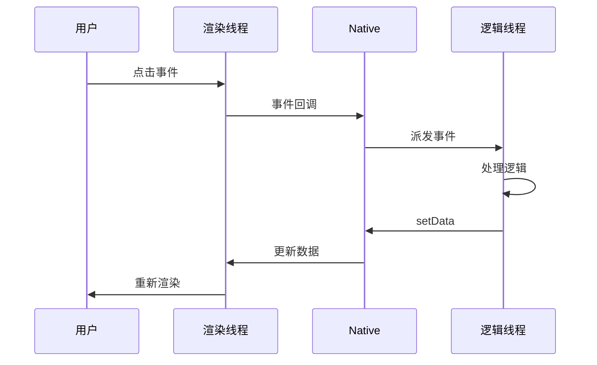
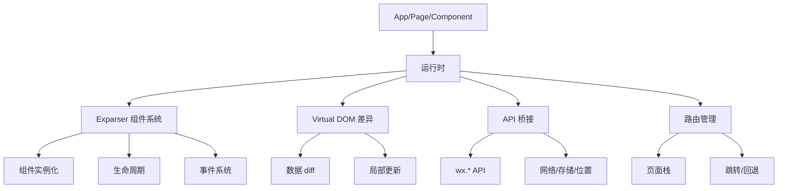
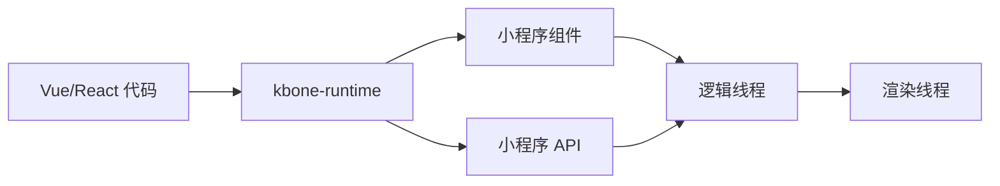
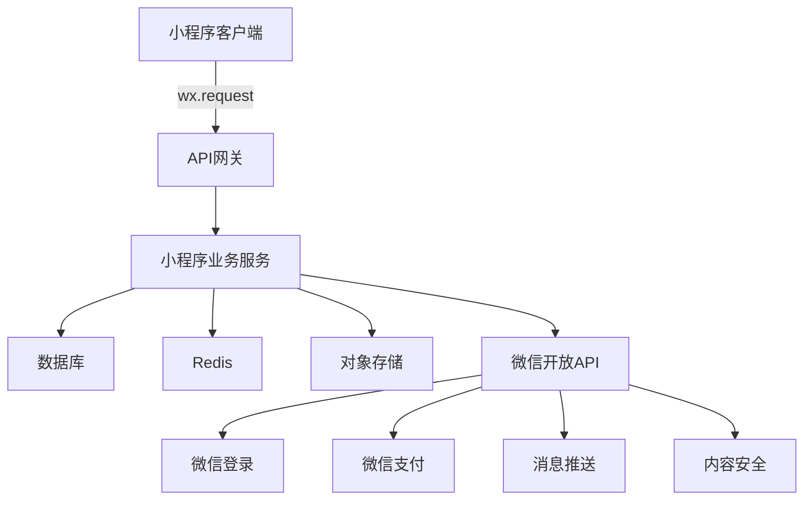
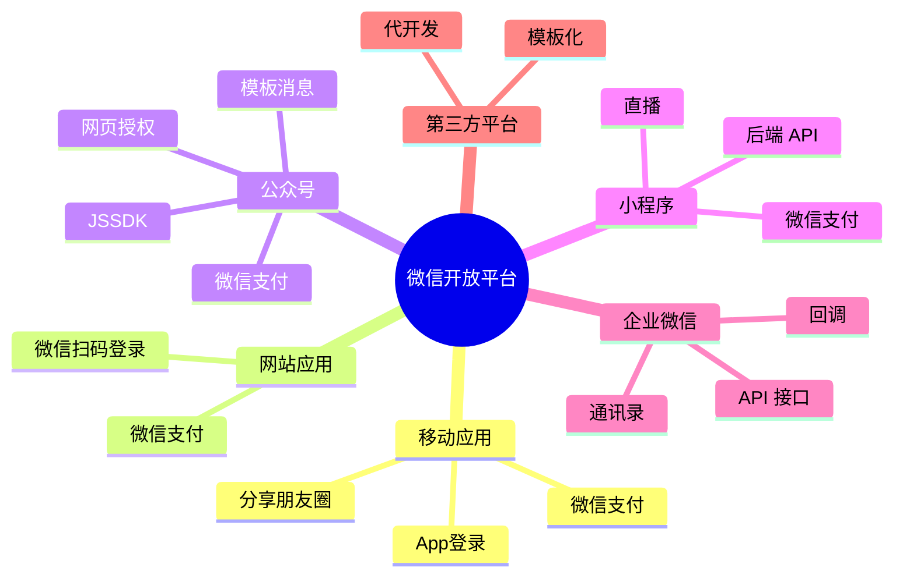

# 04 - 小程序与微信生态

> 调研日期: 2026-06-19
> 本章目标: 深入小程序双线程模型、Skyline 渲染引擎、跨端方案、开放平台
> 重点: 小程序是微信生态的核心入口, 也是张小龙"触手可及"理念的落地

---

## 1. 小程序业务版图

### 1.1 核心数据

| 指标 | 数值 | 时间 |
|------|------|------|
| 小程序数量 | 700 万+ | 2024 |
| DAU | 7 亿+ | 2024 |
| 月活 | 8 亿+ | 2024 |
| 开发者 | 500 万+ | 2024 |
| 支付 GMV | 万亿级 | 2024 |
| 类别 | 电商/游戏/工具/政务 | - |
| 入口 | 100+ | 微信内/外 |

### 1.2 小程序入口矩阵



---

## 2. 小程序双线程模型

### 2.1 为什么是双线程?

**问题**: 浏览器中 JS 线程和渲染线程在同一个线程, JS 长时间执行会阻塞渲染, 出现卡顿。

**小程序方案**: 逻辑线程 (JSCore / V8) 与渲染线程 (WebView) 分离, 通过 Native 桥接通信。

```
+----------------------------------------------------------+
|  小程序双线程模型                                          |
+----------------------------------------------------------+
|                                                            |
|  +-----------------+        +-----------------+            |
|  |  逻辑线程        |        |  渲染线程        |            |
|  |  (JSCore/V8)    |        |  (WebView)      |            |
|  |                 |        |                 |            |
|  |  - JS 代码       |        |  - WXML/WXSS   |            |
|  |  - 业务逻辑      |        |  - 页面渲染     |            |
|  |  - 数据绑定      |        |  - 事件回调     |            |
|  +-----------------+        +-----------------+            |
|         |                            |                     |
|         |   JSBridge (微信 Native)   |                     |
|         +-------------+--------------+                     |
|                       |                                    |
|                       v                                    |
|  +-----------------------------------------+               |
|  |  Native 桥接层                           |               |
|  |  - setData (数据传递)                   |               |
|  |  - wx.* API (系统能力)                 |               |
|  |  - 事件回调 (渲染→逻辑)                |               |
|  +-----------------------------------------+               |
+----------------------------------------------------------+
```

### 2.2 双线程数据流



### 2.3 setData 性能问题与优化

```javascript
// setData 的性能问题
// 1. 跨线程通信成本高
// 2. 数据序列化与反序列化
// 3. 频繁调用会阻塞渲染

// 错误示范: 频繁 setData
for (let i = 0; i < 100; i++) {
    this.setData({ count: i });  // 100 次 setData, 性能极差
}

// 正确做法 1: 合并 setData
this.setData({
    'list[0].name': 'A',
    'list[1].name': 'B',
    count: 100
});

// 正确做法 2: 使用路径更新, 减少数据量
this.setData({
    'list[0].name': 'A'
});

// 正确做法 3: 在 Web Worker (Skyline 支持) 中处理大数据
// 然后通过 postMessage 回传
```

### 2.4 关键 API 设计

```javascript
// 小程序 API 形式
wx.login({
    success: (res) => {
        if (res.code) {
            // 发起网络请求换取 openid
            wx.request({
                url: 'https://api.example.com/login',
                method: 'POST',
                data: { code: res.code },
                success: (resp) => {
                    console.log('登录成功', resp.data);
                }
            });
        }
    }
});

// wx.request 内部实现
// 1. 逻辑线程调用 wx.request
// 2. Native 接收, 通过系统能力 (NSURLSession / OkHttp) 发起 HTTP
// 3. 响应回传到逻辑线程

// wx.request 完整示例
wx.request({
    url: 'https://api.example.com/data',
    method: 'GET',
    header: {
        'content-type': 'application/json',
        'x-token': 'xxx'
    },
    data: { id: 123 },
    timeout: 10000,
    success: (res) => {
        console.log('status:', res.statusCode);
        console.log('data:', res.data);
    },
    fail: (err) => {
        console.error('网络错误', err.errMsg);
    },
    complete: () => {
        wx.hideLoading();
    }
});
```

---

## 3. Skyline 渲染引擎

### 3.1 Skyline 的来历

**背景**: 小程序双线程 + WebView 渲染存在性能瓶颈:
- 启动慢 (冷启动 1-2s)
- 长列表卡顿 (setData 限制)
- 复杂动画掉帧
- 视频同层渲染难

**Skyline 目标**:
- 直接使用 C++ 渲染 (Skia)
- 启动时间 < 500ms
- 长列表丝滑滚动
- 视频同层渲染

### 3.2 Skyline 架构

```
+----------------------------------------------------------+
|  Skyline 渲染引擎架构                                      |
+----------------------------------------------------------+
|                                                            |
|  +---------------------------------------------+          |
|  |  JS 引擎 (V8) - 逻辑线程                    |          |
|  |  - 业务逻辑                                  |          |
|  |  - 数据更新                                  |          |
|  +---------------------------------------------+          |
|         |                                                 |
|         | Native Bridge (C++)                            |
|         v                                                 |
|  +---------------------------------------------+          |
|  |  C++ 渲染引擎                                |          |
|  |  - Skia 2D 渲染                             |          |
|  |  - 自研 Layout 引擎                          |          |
|  |  - 动画引擎 (60fps)                          |          |
|  |  - 合成器 (Layer)                            |          |
|  +---------------------------------------------+          |
|         |                                                 |
|         v                                                 |
|  +---------------------------------------------+          |
|  |  GPU 加速                                    |          |
|  |  - OpenGL ES / Metal / Vulkan                |          |
|  +---------------------------------------------+          |
+----------------------------------------------------------+
```

### 3.3 Skyline vs WebView 对比

| 维度 | WebView 渲染 | Skyline 渲染 |
|------|-------------|-------------|
| 启动时间 | 1-2s | < 500ms |
| 列表滚动 | 容易卡顿 | 丝滑 |
| 动画 | 受限 | 60fps |
| 内存 | 较高 | 优化 |
| 视频同层 | 不支持 | 支持 |
| 兼容性 | 100% | 渐进式 |
| Web 标准 | 完全 | 子集 |

### 3.4 Skyline 关键 API

```javascript
// 在 app.json 中启用 Skyline
{
  "lazyCodeLoading": "requiredComponents",
  "rendererOptions": {
    "skyline": {
      "defaultDisplayBlock": true,
      "disableABTest": true,
      "splashScreen": {
        "alwaysShowBeforeRender": true
      }
    }
  }
}

// 页面配置使用 Skyline
{
  "pages": ["pages/index/index"],
  "renderer": "skyline"  // 单页使用 Skyline
}

// 共享元素动画 (Skyline 特有)
<navigator
  hover-class="none"
  url="/pages/detail/detail?id=1"
  animation-type="share-element"
  animation-duration="300">
  <image src="{{item.cover}}" share-element="cover" />
</navigator>

// 长列表优化 (recycle-view)
<recycle-view batch="{{batchSetRecycleData}}" id="recycleId">
  <view slot="item" wx:for="{{list}}">
    <text>{{item.name}}</text>
  </view>
</recycle-view>
```

---

## 4. 小程序框架设计

### 4.1 框架结构



### 4.2 组件系统 Exparser

```javascript
// 组件定义
Component({
    properties: {
        // 外部传入
        title: {
            type: String,
            value: '默认标题',
            observer: function(newVal, oldVal) {
                console.log('title changed:', newVal);
            }
        },
        count: {
            type: Number,
            value: 0
        }
    },

    data: {
        // 内部状态
        internal_state: 'idle'
    },

    lifetimes: {
        attached: function() {
            console.log('组件 attached');
        },
        ready: function() {
            console.log('组件 ready');
        },
        detached: function() {
            console.log('组件 detached');
        }
    },

    methods: {
        onTap: function() {
            // 触发外部事件
            this.triggerEvent('customevent', {
                value: this.data.count
            });
        },

        loadData: async function() {
            // 网络请求
            const res = await wx.request({
                url: 'https://api.example.com/data'
            });
            this.setData({ internal_state: 'loaded' });
        }
    }
});

// 父组件使用
<custom-component
    title="标题"
    count="{{total}}"
    bind:customevent="onCustomEvent"
/>
```

### 4.3 页面生命周期

```javascript
// 页面生命周期
Page({
    onLoad: function(options) {
        // 页面加载, options 包含 URL 参数
        console.log('onLoad', options);
    },

    onShow: function() {
        // 页面显示
    },

    onReady: function() {
        // 页面初次渲染完成
    },

    onHide: function() {
        // 页面隐藏
    },

    onUnload: function() {
        // 页面卸载
    },

    onPullDownRefresh: function() {
        // 下拉刷新
        wx.stopPullDownRefresh();
    },

    onReachBottom: function() {
        // 上拉触底
        this.loadMore();
    },

    onShareAppMessage: function() {
        // 分享配置
        return {
            title: '分享标题',
            path: '/pages/index/index'
        };
    }
});
```

### 4.4 双线程通信优化

```cpp
// Native 桥接层 (C++ 端, 简化)
class JSBridge {
public:
    // setData 接收
    void OnSetData(int page_id, const std::string& json_data) {
        // 1. 解析 JSON (用 rapidjson)
        rapidjson::Document doc;
        doc.Parse(json_data.c_str());

        // 2. 更新页面数据
        auto* page = page_mgr_->GetPage(page_id);
        if (page) {
            page->UpdateData(doc);

            // 3. 通知渲染线程更新
            render_thread_->PostTask([page, doc]() {
                page->Render();
            });
        }
    }

    // 事件回调 (渲染 → 逻辑)
    void OnEvent(int page_id, const std::string& event, const std::string& data) {
        // 投递到逻辑线程
        logic_thread_->PostTask([page_id, event, data, this]() {
            auto* page = page_mgr_->GetPage(page_id);
            if (page) {
                page->HandleEvent(event, data);
            }
        });
    }

private:
    PageManager* page_mgr_;
    RenderThread* render_thread_;
    LogicThread* logic_thread_;
};
```

---

## 5. 跨端方案对比

### 5.1 主流跨端方案

| 方案 | 原理 | 优势 | 劣势 |
|------|------|------|------|
| **原生** | 多套代码 | 性能最佳 | 维护成本高 |
| **H5 (Web)** | 浏览器 | 跨端简单 | 性能一般 |
| **小程序** | 微信容器 | 微信生态 | 仅微信 |
| **kbone** | H5 跑在小程序 | Web 框架 | 性能有损失 |
| **Taro** | 多端编译 | React 风格 | 编译时坑多 |
| **Uni-app** | Vue 风格 | 多端 | 性能一般 |
| **Remax** | 真正 React | 体验好 | 生态小 |
| **Hippy** | C++ 渲染 | 高性能 | 接入成本 |

### 5.2 kbone 原理

**kbone**: 微信开源, GitHub Star 5k+, 让 Web 框架 (Vue/React) 代码能跑在小程序中。



**核心实现**:
- DOM 模拟: JS 端实现 DOM API
- BOM 模拟: window/document/documentElement
- 事件模拟: 用户事件转换

```javascript
// kbone 使用示例
// main.js (Vue 项目)
import Vue from 'vue';
import App from './App.vue';

new Vue({
    render: h => h(App)
}).$mount('#app');

// kbone 构建脚本会自动转换
// 产物: 小程序代码
// index.js → App({ ... })
// pages/*/index.js → Page({ ... })
// 组件 → Component({ ... })
```

### 5.3 Hippy 跨端

```javascript
// Hippy (腾讯开源) 示例
import { Component } from '@hippy/react';

class Home extends Component {
    constructor(props) {
        super(props);
        this.state = { count: 0 };
    }

    render() {
        return (
            <View style={styles.container}>
                <Text style={styles.title}>
                    计数: {this.state.count}
                </Text>
                <View
                    style={styles.button}
                    onClick={() => this.setState({ count: this.state.count + 1 })}
                >
                    <Text>点击+1</Text>
                </View>
            </View>
        );
    }
}

const styles = {
    container: { flex: 1, backgroundColor: '#fff' },
    title: { fontSize: 24, textAlign: 'center' },
    button: { padding: 12, backgroundColor: '#07c160' }
};
```

### 5.4 Taro 跨端

```jsx
// Taro (京东开源, 微信生态) React 风格
import { useState, useEffect } from 'react';
import { View, Text, Button } from '@tarojs/components';
import Taro from '@tarojs/taro';

export default function Index() {
    const [count, setCount] = useState(0);

    useEffect(() => {
        Taro.request({ url: '/api/data' }).then(res => {
            console.log(res.data);
        });
    }, []);

    return (
        <View className="container">
            <Text>计数: {count}</Text>
            <Button onClick={() => setCount(count + 1)}>+1</Button>
        </View>
    );
}
```

---

## 6. 小程序后端架构

### 6.1 后端服务



### 6.2 后端示例 (Go)

```go
// 小程序后端 (Go) - 微信登录
package main

import (
    "crypto/aes"
    "crypto/cipher"
    "encoding/base64"
    "encoding/json"
    "fmt"
    "net/http"

    "github.com/gin-gonic/gin"
)

type WechatLoginReq struct {
    Code          string `json:"code" binding:"required"`
    EncryptedData string `json:"encryptedData"`
    Iv            string `json:"iv"`
}

type WechatLoginResp struct {
    OpenID    string `json:"openid"`
    SessionKey string `json:"session_key"`
    UnionID   string `json:"unionid"`
}

const (
    AppID     = "wx1234567890abcdef"
    AppSecret = "your_app_secret"
)

func HandleWechatLogin(c *gin.Context) {
    var req WechatLoginReq
    if err := c.ShouldBindJSON(&req); err != nil {
        c.JSON(400, gin.H{"error": err.Error()})
        return
    }

    // 1. 调用微信 API 换取 openid 和 session_key
    url := fmt.Sprintf(
        "https://api.weixin.qq.com/sns/jscode2session?appid=%s&secret=%s&js_code=%s&grant_type=authorization_code",
        AppID, AppSecret, req.Code,
    )
    resp, err := http.Get(url)
    if err != nil {
        c.JSON(500, gin.H{"error": "wechat api failed"})
        return
    }
    defer resp.Body.Close()

    var wechatResp struct {
        OpenID     string `json:"openid"`
        SessionKey string `json:"session_key"`
        UnionID    string `json:"unionid"`
        ErrCode    int    `json:"errcode"`
        ErrMsg     string `json:"errmsg"`
    }
    json.NewDecoder(resp.Body).Decode(&wechatResp)

    if wechatResp.ErrCode != 0 {
        c.JSON(400, gin.H{"error": wechatResp.ErrMsg})
        return
    }

    // 2. 解密 EncryptedData (可选)
    if req.EncryptedData != "" && req.Iv != "" {
        plain, _ := DecryptWechatData(wechatResp.SessionKey, req.EncryptedData, req.Iv)
        // 解析用户信息
        var userInfo map[string]interface{}
        json.Unmarshal(plain, &userInfo)
        wechatResp.UnionID = userInfo["unionId"].(string)
    }

    // 3. 业务逻辑: 存储用户信息
    user, _ := CreateOrUpdateUser(wechatResp.OpenID, wechatResp.UnionID)

    // 4. 生成自己的 token
    token := GenerateJWT(user)

    c.JSON(200, gin.H{
        "token": token,
        "user":  user,
    })
}

func DecryptWechatData(sessionKey, encryptedData, iv string) ([]byte, error) {
    key, _ := base64.StdEncoding.DecodeString(sessionKey)
    ciphertext, _ := base64.StdEncoding.DecodeString(encryptedData)
    ivBytes, _ := base64.StdEncoding.DecodeString(iv)

    block, _ := aes.NewCipher(key)
    mode := cipher.NewCBCDecrypter(block, ivBytes)

    plain := make([]byte, len(ciphertext))
    mode.CryptBlocks(plain, ciphertext)

    // 去除 PKCS#7 padding
    padLen := int(plain[len(plain)-1])
    return plain[:len(plain)-padLen], nil
}
```

### 6.3 微信支付集成

```go
// 小程序支付 (Go) - 微信支付 V3
import (
    "github.com/wechatpay-apiv3/wechatpay-go/core"
    "github.com/wechatpay-apiv3/wechatpay-go/services/payments/jsapi"
)

func CreateWechatPayOrder(c *gin.Context) {
    var req struct {
        OpenID  string  `json:"openid" binding:"required"`
        OrderID string  `json:"order_id" binding:"required"`
        Amount  int     `json:"amount" binding:"required"`
    }
    if err := c.ShouldBindJSON(&req); err != nil {
        c.JSON(400, gin.H{"error": err.Error()})
        return
    }

    // 1. 创建 JSAPI 支付订单
    result, err := jsapiApiClient.Create(c.Request.Context(), jsapi.CreateRequest{
        AppID:       core.String(AppID),
        MchID:       core.String(MchID),
        Description: core.String("商品描述"),
        OutTradeNo:  core.String(req.OrderID),
        NotifyUrl:   core.String("https://example.com/wechat/pay/notify"),
        Amount: &jsapi.Amount{
            Total: core.Int64(int64(req.Amount)),
        },
        Payer: &jsapi.Payer{
            OpenID: core.String(req.OpenID),
        },
    })

    if err != nil {
        c.JSON(500, gin.H{"error": err.Error()})
        return
    }

    // 2. 生成小程序支付参数
    payParams := map[string]interface{}{
        "timeStamp": time.Now().Unix(),
        "nonceStr":  GenerateNonceStr(),
        "package":   "prepay_id=" + *result.PrepayId,
        "signType":  "RSA",
        "paySign":   GeneratePaySign(result.PrepayId),
    }

    c.JSON(200, gin.H{
        "order_id": req.OrderID,
        "pay":      payParams,
    })
}

// 接收支付结果回调
func HandleWechatPayNotify(c *gin.Context) {
    // 1. 验签
    // 2. 解密回调
    // 3. 更新订单状态
    // 4. 返回 204
}
```

---

## 7. 小程序开放能力

### 7.1 系统能力 API

```javascript
// 位置
wx.getLocation({
    type: 'gcj02',
    success: (res) => {
        console.log(res.latitude, res.longitude);
    }
});

// 相机/相册
wx.chooseImage({
    count: 9,
    sizeType: ['compressed'],
    success: (res) => {
        const tempFilePaths = res.tempFilePaths;
        // 上传到服务器
        wx.uploadFile({
            url: 'https://example.com/upload',
            filePath: tempFilePaths[0],
            name: 'file'
        });
    }
});

// 蓝牙 (低功耗)
wx.openBluetoothAdapter({
    success: () => {
        wx.startBluetoothDevicesDiscovery({
            services: [],
            success: () => {
                wx.onBluetoothDeviceFound((res) => {
                    console.log('发现设备', res.devices);
                });
            }
        });
    }
});

// 实时音视频 (WebRTC)
wx.createLivePusherContext().start({
    url: 'rtmp://example.com/live/stream',
    mode: 'HD'
});

// 微信支付
wx.requestPayment({
    timeStamp: 'xxx',
    nonceStr: 'xxx',
    package: 'prepay_id=xxx',
    signType: 'RSA',
    paySign: 'xxx',
    success: (res) => {
        console.log('支付成功');
    }
});
```

### 7.2 登录 / 鉴权

```javascript
// 微信登录完整流程
async function wechatLogin() {
    // 1. wx.login 拿 code
    const { code } = await wx.login();

    // 2. 发送到业务后端
    const res = await wx.request({
        url: 'https://api.example.com/login',
        method: 'POST',
        data: { code }
    });

    // 3. 后端返回 token, 存储
    wx.setStorageSync('token', res.data.token);

    // 4. 后续请求带上 token
    wx.request({
        url: 'https://api.example.com/data',
        header: {
            'Authorization': 'Bearer ' + res.data.token
        }
    });
}

// 检查登录态是否过期
async function checkSession() {
    return new Promise((resolve) => {
        wx.checkSession({
            success: () => resolve(true),
            fail: () => resolve(false)
        });
    });
}
```

---

## 8. 微信开放平台

### 8.1 开放平台矩阵



### 8.2 开放 API 类别

| 类别 | 能力 |
|------|------|
| 用户身份 | openid/unionid |
| 微信支付 | JSAPI/H5/小程序/Native |
| 消息推送 | 模板/订阅/客服 |
| 内容安全 | 图片/文本/音频审核 |
| 音视频 | 实时音视频/直播 |
| 位置 | GPS/POI |
| OCR | 身份证/银行卡/发票 |
| 客服 | 智能客服/人工 |
| 数据分析 | 用户画像/行为分析 |

### 8.3 第三方平台 (TP)

第三方平台允许一个服务商管理多个公众号/小程序:

```python
# 第三方平台代开发 (简化)
class ComponentApp:
    def __init__(self, component_appid, component_secret, verify_ticket):
        self.component_appid = component_appid
        self.component_secret = component_secret
        self.verify_ticket = verify_ticket

    # 1. 推送 component_verify_ticket
    def handle_ticket(self, ticket):
        self.verify_ticket = ticket

    # 2. 获取 component_access_token
    def get_component_token(self):
        url = "https://api.weixin.qq.com/cgi-bin/component/api_component_token"
        payload = {
            "component_appid": self.component_appid,
            "component_appsecret": self.component_secret,
            "component_verify_ticket": self.verify_ticket
        }
        return requests.post(url, json=payload).json()

    # 3. 代公众号调用 API
    def call_for_authorizer(self, authorizer_appid, api, data):
        # 1. 拿 authorizer_access_token
        # 2. 调用具体 API
        pass
```

---

## 9. 小程序工程化

### 9.1 项目结构

```
miniprogram-project/
├── app.js               # 小程序入口
├── app.json             # 全局配置
├── app.wxss             # 全局样式
├── project.config.json  # 项目配置
├── sitemap.json         # 站点地图
├── pages/
│   ├── index/
│   │   ├── index.js     # 页面逻辑
│   │   ├── index.json   # 页面配置
│   │   ├── index.wxml   # 页面结构
│   │   └── index.wxss   # 页面样式
│   └── detail/
│       └── ...
├── components/          # 自定义组件
│   ├── custom-card/
│   └── ...
├── utils/               # 工具函数
│   ├── api.js
│   ├── auth.js
│   └── ...
├── assets/              # 静态资源
│   ├── images/
│   └── icons/
├── miniprogram_npm/     # 第三方 npm 包
└── lib/                 # 本地 lib
```

### 9.2 app.json 配置

```json
{
  "pages": [
    "pages/index/index",
    "pages/detail/detail",
    "pages/profile/profile"
  ],
  "window": {
    "navigationBarTitleText": "我的小程序",
    "navigationBarBackgroundColor": "#ffffff",
    "navigationBarTextStyle": "black",
    "backgroundColor": "#f8f8f8",
    "backgroundTextStyle": "dark",
    "enablePullDownRefresh": true
  },
  "tabBar": {
    "color": "#7A7E83",
    "selectedColor": "#07c160",
    "backgroundColor": "#ffffff",
    "borderStyle": "black",
    "list": [
      {
        "pagePath": "pages/index/index",
        "text": "首页",
        "iconPath": "assets/home.png",
        "selectedIconPath": "assets/home_active.png"
      },
      {
        "pagePath": "pages/profile/profile",
        "text": "我的",
        "iconPath": "assets/me.png",
        "selectedIconPath": "assets/me_active.png"
      }
    ]
  },
  "networkTimeout": {
    "request": 10000,
    "downloadFile": 10000
  },
  "permission": {
    "scope.userLocation": {
      "desc": "用于显示附近门店"
    }
  },
  "requiredPrivateInfos": ["getLocation", "chooseLocation"],
  "lazyCodeLoading": "requiredComponents"
}
```

### 9.3 npm 支持

```bash
# 小程序支持 npm
npm init
npm install --save lodash
npm install --save miniprogram-api-promise

# 在微信开发者工具中:
# 工具 -> 构建 npm
```

```json
// miniprogramRoot/node_modules/.miniprogram_npm
// project.config.json
{
  "setting": {
    "es6": true,
    "enhance": true,
    "minified": true,
    "newFeature": true
  }
}
```

---

## 10. 小程序性能优化

### 10.1 启动优化

```javascript
// 1. 避免同步 IO
// 错误:
const data = wx.getStorageSync('large_data');  // 阻塞

// 正确:
wx.getStorage({
    key: 'large_data',
    success: (res) => {
        // 异步处理
    }
});

// 2. 按需注入 (lazyCodeLoading)
{
  "lazyCodeLoading": "requiredComponents"
}

// 3. 分包加载
{
  "subpackages": [
    {
      "root": "packageA",
      "pages": ["pagesA/a/a"]
    },
    {
      "root": "packageB",
      "pages": ["pagesB/b/b"],
      "independent": true  // 独立分包
    }
  ]
}
```

### 10.2 setData 优化

```javascript
// 1. 数据大小控制 (< 256KB 每次)
this.setData({
    'list[0]': this.data.list[0]
});

// 2. 避免 setData 列表全量更新
// 错误:
this.setData({ list: newList });  // 全量

// 正确: 只更新变化项
const newItem = { id: 1, name: 'new' };
this.setData({
    [`list[${index}]`]: newItem
});

// 3. 复杂计算放到 Web Worker (Skyline 支持)
// worker.js
self.onMessage = (e) => {
    const result = heavyComputation(e.data);
    self.postMessage(result);
};
```

### 10.3 列表渲染优化

```html
<!-- 1. 列表 item 加 unique key -->
<view wx:for="{{list}}" wx:key="id">
    <text>{{item.name}}</text>
</view>

<!-- 2. 长列表使用 recycle-view (Skyline) -->
<recycle-view batch="{{batchSetRecycleData}}" id="recycleId">
    <view slot="item" wx:for="{{list}}">
        <text>{{item.name}}</text>
    </view>
</recycle-view>

<!-- 3. 减少节点嵌套 -->
<!-- 错误: 多层嵌套 -->
<view><view><view><text>内容</text></view></view></view>

<!-- 正确: 减少嵌套 -->
<text>内容</text>
```

---

## 11. 借鉴清单 (对小程序生态)

### 11.1 对 TikTok 小程序

| 借鉴点 | 应用 |
|--------|------|
| 双线程模型 | TikTok 小程序 |
| Skyline 渲染 | TikTok 直播小程序 |
| 跨端方案 | TikTok H5 → 小程序 |
| 开放 API | TikTok 小程序生态 |
| 性能优化 | 大数据列表 |

### 11.2 对 AI 直播平台

| 借鉴点 | 应用 |
|--------|------|
| 小程序双线程 | AI 数字人配置 |
| Skyline 渲染 | AI 直播间 |
| 实时音视频 | AI 直播连麦 |
| 跨端 (kbone) | AI 工具 H5 → 多端 |
| 分包加载 | 直播工具按需加载 |

### 11.3 工程实践

| 实践 | 适用 |
|------|------|
| 双线程模型 | 容器化应用 |
| setData 优化 | 高频更新 |
| 分包加载 | 复杂应用 |
| 跨端 (kbone/Taro) | 多端需求 |
| WXML/WXSS → 通用 DSL | 自研 DSL |

---

## 12. 小结

### 关键要点

1. **双线程模型是为了性能与安全** - 避免 JS 阻塞渲染, 防止 XSS
2. **Skyline 是 C++ 渲染的进化** - 解决 WebView 性能瓶颈
3. **小程序有 100+ 入口** - 不只是 App 内打开
4. **跨端方案多** - kbone/Taro/Uni-app/Hippy
5. **小程序后端是常规 Web API** - 加上微信特色 API
6. **开放平台能力强** - 第三方平台适合服务商

### 下章预告

`05-微信支付与商业化.md` - 财付通底层 + 红包高并发 + 商户体系
