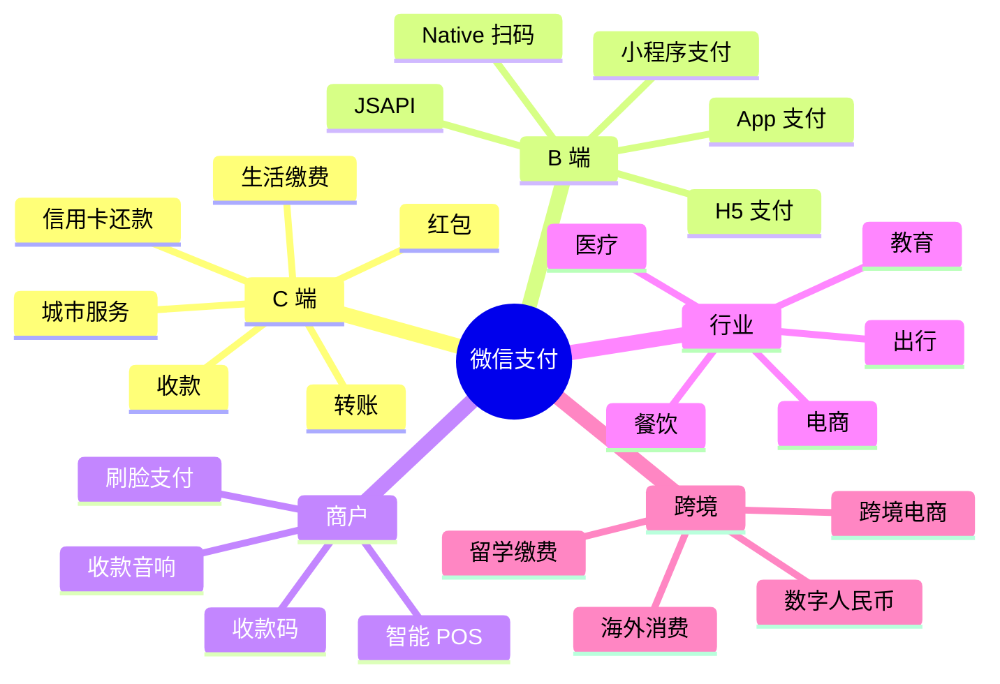
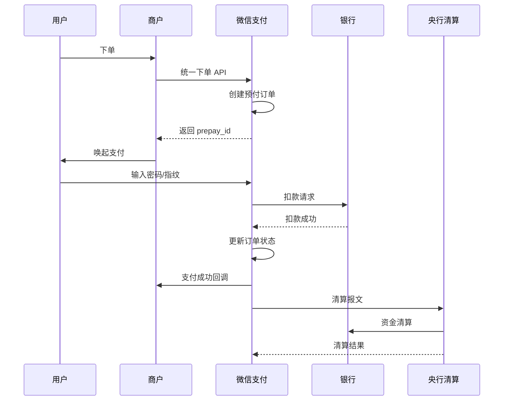
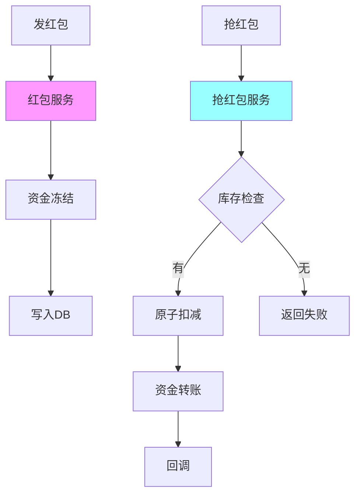
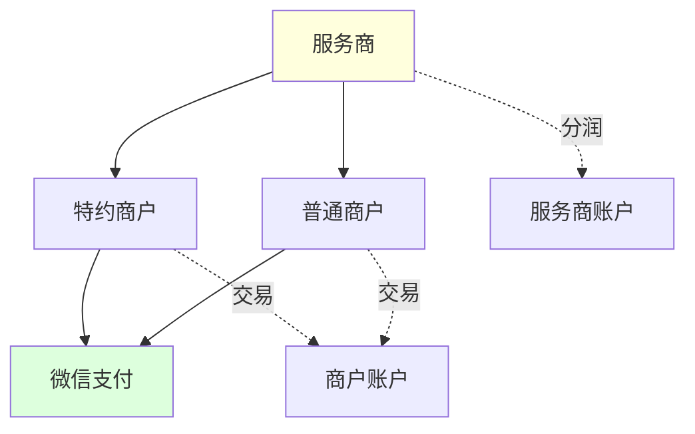
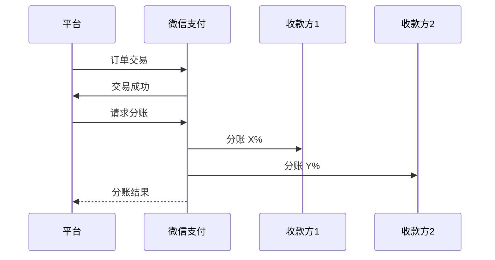
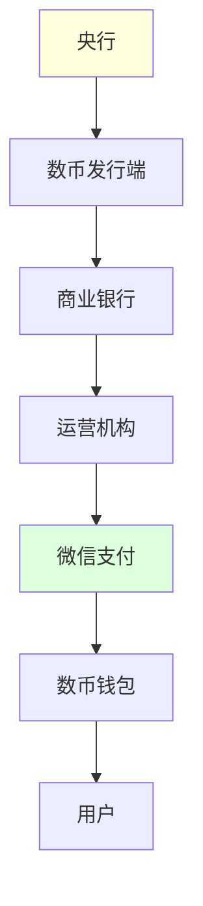
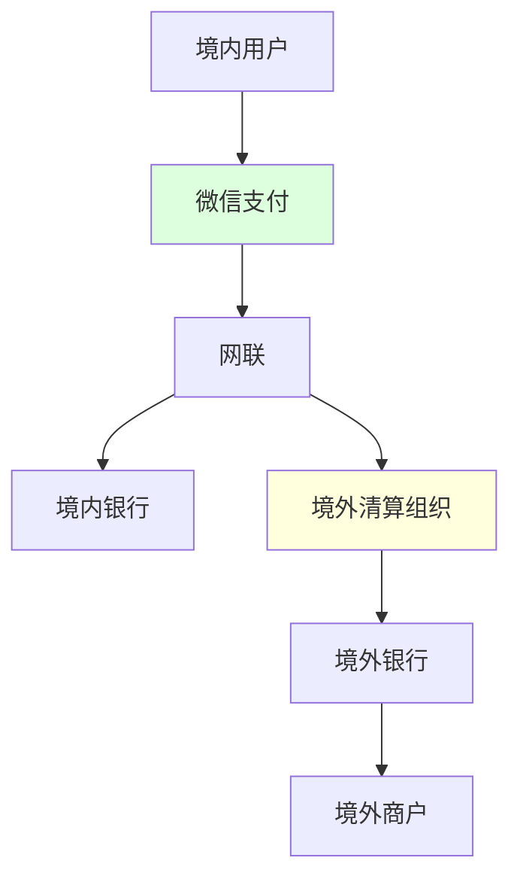
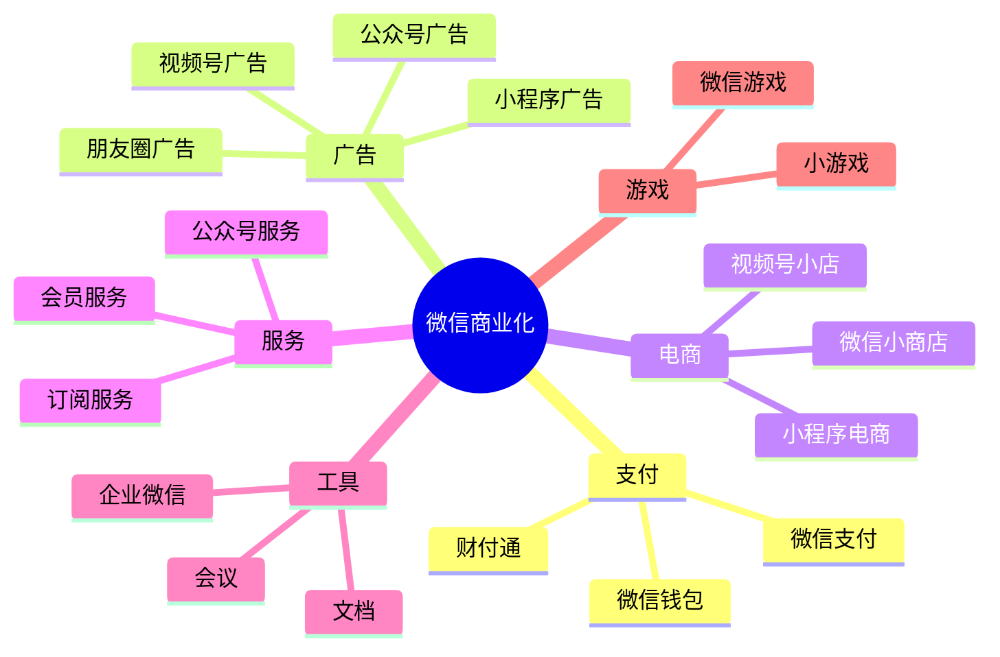
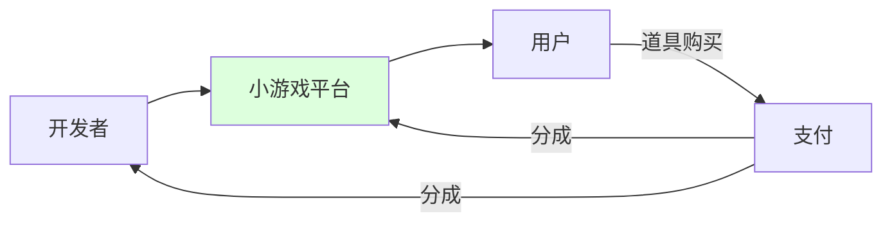

# 05 - 微信支付与商业化

> 调研日期: 2026-06-19
> 本章目标: 深入财付通底层架构、红包高并发、商户体系、跨境支付
> 重点: 微信支付是腾讯的"印钞机"之一, 2024 年日均交易超 20 亿笔

---

## 1. 微信支付业务版图

### 1.1 核心数据

| 指标 | 数值 | 时间 |
|------|------|------|
| 日均交易 | 20 亿笔+ | 2024 |
| 峰值 QPS | 76 万 (2020 春节红包) | 除夕 |
| 商业支付 | 万亿级/年 | 2024 |
| 商户数 | 5000 万+ | 2024 |
| 跨境支付 | 60+ 国家/地区 | 2024 |
| 接入方式 | JSAPI/H5/小程序/Native/App | - |

### 1.2 微信支付产品矩阵



---

## 2. 财付通底层架构

### 2.1 财付通历史

- 2005 年成立, 腾讯旗下
- 2011 年获得第三方支付牌照
- 2014 年微信红包引爆
- 2016 年与支付宝形成双寡头
- 2022 年与银联云闪付互联互通
- 2024 年跨境支付扩张

### 2.2 整体架构

```
+----------------------------------------------------------+
|  微信支付系统架构                                          |
+----------------------------------------------------------+
|                                                            |
|  客户端                                                    |
|     |                                                      |
|     v                                                      |
|  +-------------------+                                     |
|  | 支付接入网关      | (Go)                                |
|  | - 流量分发        |                                     |
|  | - 限流            |                                     |
|  | - 风控前置        |                                     |
|  +-------------------+                                     |
|     |                                                      |
|     v                                                      |
|  +-------------------+    +------------------+             |
|  | 交易核心 (C++)    |    | 账务核心 (C++)   |             |
|  | - 订单创建        |    | - 记账           |             |
|  | - 支付路由        |    | - 对账           |             |
|  | - 支付执行        |    | - 清结算         |             |
|  +-------------------+    +------------------+             |
|     |                       |                              |
|     v                       v                              |
|  +-------------------+    +------------------+             |
|  | 银行通道          |    | 备付金账户      |             |
|  | - 工/农/中/建/招 |    | - 央行存管      |             |
|  | - 银联/网联      |    | - 风险准备金    |             |
|  +-------------------+    +------------------+             |
|     |                                                      |
|     v                                                      |
|  +-------------------+                                     |
|  | 央行清算系统      | (网联/银联)                         |
|  +-------------------+                                     |
+----------------------------------------------------------+
```

### 2.3 交易核心流程



### 2.4 订单状态机

```cpp
// 微信支付订单状态机
enum class OrderState {
    kCreated,            // 已创建
    kUserPaying,         // 用户支付中
    kPaySuccess,         // 支付成功
    kPayFailed,          // 支付失败
    kRefunding,          // 退款中
    kRefunded,           // 已退款
    kClosed,             // 已关闭
    kReversing,          // 冲正中
    kReversed,           // 已冲正
    kPendingReview,      // 待审核
};

class OrderStateMachine {
public:
    bool CanTransit(OrderState from, OrderState to) {
        // 状态机白名单
        static const std::map<OrderState, std::set<OrderState>> transitions = {
            {OrderState::kCreated, {OrderState::kUserPaying, OrderState::kClosed}},
            {OrderState::kUserPaying, {OrderState::kPaySuccess, OrderState::kPayFailed, OrderState::kClosed}},
            {OrderState::kPaySuccess, {OrderState::kRefunding, OrderState::kRefunded, OrderState::kReversing}},
            {OrderState::kRefunding, {OrderState::kRefunded, OrderState::kPaySuccess}},
            {OrderState::kReversing, {OrderState::kReversed, OrderState::kPaySuccess}},
        };
        auto it = transitions.find(from);
        return it != transitions.end() && it->second.count(to) > 0;
    }
};
```

### 2.5 分布式事务 (TCC 模型)

```cpp
// 支付涉及多账户转账, 用 TCC 模式
class TransferTcc {
public:
    // Try: 资源预留
    void Try(uint64_t from_account, uint64_t to_account, int64_t amount) {
        // 1. 冻结 from 账户
        Freeze(from_account, amount);
        // 2. 预增 to 账户 (影子账户)
        PreIncrease(to_account, amount);
        // 3. 写入事务日志
        LogTransaction(from_account, to_account, amount);
    }

    // Confirm: 提交
    void Confirm(const std::string& tx_id) {
        auto tx = LoadTx(tx_id);
        // 1. 扣减 from 账户 (实际扣款)
        Deduct(tx.from, tx.amount);
        // 2. 增加 to 账户 (实际入账)
        Increase(tx.to, tx.amount);
        // 3. 标记事务完成
        MarkComplete(tx_id);
    }

    // Cancel: 取消
    void Cancel(const std::string& tx_id) {
        auto tx = LoadTx(tx_id);
        // 1. 解冻 from 账户
        Unfreeze(tx.from, tx.amount);
        // 2. 取消预增
        CancelPreIncrease(tx.to, tx.amount);
        // 3. 标记事务取消
        MarkCancel(tx_id);
    }
};
```

---

## 3. 红包系统

### 3.1 业务特点

- 强社交属性 (群红包)
- 短时高并发 (除夕 76w QPS)
- 实时性要求高 (抢完为止)
- 资金安全关键
- 限时限次

### 3.2 红包架构



### 3.3 抢红包核心 (原子性)

```cpp
// 抢红包核心 - 原子操作
class RedPacketClaimService {
public:
    ClaimResult Claim(uint64_t packet_id, uint64_t uid) {
        // 1. 用户限流 (同一用户 1 个红包只能抢 1 次)
        std::string user_key = MakeUserKey(packet_id, uid);
        if (redis_->SADD(user_key, uid) == 0) {
            return ClaimResult::AlreadyClaimed();
        }

        // 2. Lua 脚本原子扣减 (避免并发)
        static const char* claim_script = R"(
            local stock_key = KEYS[1]
            local amount_key = KEYS[2]
            local user_key = KEYS[3]
            local uid = ARGV[1]
            local now = tonumber(ARGV[2])

            -- 检查用户是否已抢
            if redis.call('SISMEMBER', user_key, uid) == 1 then
                return {-1, 0, 0}  -- 已抢过
            end

            -- 原子获取金额
            local amount = redis.call('LPOP', amount_key)
            if not amount then
                return {0, 0, 0}  -- 抢光了
            end

            -- 减少库存
            local stock = redis.call('DECR', stock_key)
            if stock < 0 then
                -- 回滚
                redis.call('INCR', stock_key)
                redis.call('RPUSH', amount_key, amount)
                return {0, 0, 0}  -- 抢光了
            end

            -- 记录用户抢到
            redis.call('SADD', user_key, uid)
            redis.call('HSET', KEYS[4], uid, amount)

            return {1, amount, now}
        )";

        // 3. 执行 Lua 脚本
        redis_->Eval(claim_script, {stock_key, amount_key, user_key, user_amount_key},
                    {std::to_string(uid), std::to_string(Now())});

        // 4. 异步入账
        if (amount > 0) {
            TransferMoneyAsync(uid, amount, packet_id);
        }

        return ClaimResult::Success(amount);
    }

private:
    RedisClient* redis_;
};
```

### 3.4 红包金额生成算法 (二倍均值法)

```cpp
// 随机分配红包金额 (线段切割法 / 二倍均值法)
class RedPacketAmountGenerator {
public:
    // 输入: 总金额(分), 红包数, 最小金额
    // 输出: 分配方案
    std::vector<int64_t> Generate(int64_t total_amount, int count, int64_t min_amount = 1) {
        std::vector<int64_t> result;
        int64_t remain = total_amount;
        int remain_count = count;

        for (int i = 0; i < count - 1; ++i) {
            // 二倍均值法: 每次取平均值附近随机值
            // 范围: [min_amount, 2 * remain / remain_count - min_amount]
            int64_t avg = remain / remain_count;
            int64_t max_amount = std::min(remain - min_amount * (remain_count - 1), 2 * avg);
            int64_t min_amt = std::max(min_amount, remain - max_amount * (remain_count - 1));

            if (min_amt > max_amount) {
                min_amt = max_amount;
            }

            int64_t amount = min_amt + RandomInt(0, max_amount - min_amt);
            result.push_back(amount);
            remain -= amount;
            remain_count--;
        }

        // 最后一个红包
        result.push_back(remain);
        return result;
    }

private:
    int RandomInt(int min, int max) {
        std::uniform_int_distribution<> dist(min, max);
        return dist(rng_);
    }
    std::mt19937 rng_;
};
```

### 3.5 红包预热 (列表缓存)

```cpp
// 红包列表预生成 - 抢之前分配好
class RedPacketPreload {
public:
    void Preload(uint64_t packet_id, int64_t total_amount, int count) {
        // 1. 生成红包金额列表
        auto amounts = amount_gen_.Generate(total_amount, count);

        // 2. 写入 Redis (List)
        std::string amount_key = MakeAmountKey(packet_id);
        for (int i = 0; i < amounts.size(); ++i) {
            redis_->RPUSH(amount_key, std::to_string(amounts[i]));
        }

        // 3. 设置库存
        std::string stock_key = MakeStockKey(packet_id);
        redis_->SET(stock_key, count);

        // 4. 设置过期时间 (24h)
        redis_->EXPIRE(amount_key, 24 * 3600);
        redis_->EXPIRE(stock_key, 24 * 3600);
    }
};
```

### 3.6 春节红包峰值 (2020 案例)

```
+----------------------------------------------------------+
|  2020 除夕红包数据                                          |
+----------------------------------------------------------+
|  峰值 QPS:        76 万 (支付成功)                          |
|  红包总个数:      78 亿                                    |
|  跨年峰值时刻:    00:00:00.005                              |
|  系统 P99 延迟:  < 50ms                                   |
|  系统可用性:      99.9999%+                                |
+----------------------------------------------------------+
```

**关键技术**:
- 全链路压测
- 多级缓存 (本地 + Redis)
- 异步化 (入账异步)
- 限流与降级
- 银行通道预热

---

## 4. 微信支付 API 体系

### 4.1 接入方式

| 方式 | 场景 | 流程 |
|------|------|------|
| **JSAPI** | 公众号/小程序内 | 调起支付 |
| **H5** | 手机浏览器 | 跳转微信 |
| **小程序** | 小程序内 | wx.requestPayment |
| **Native** | PC 网站 | 扫码支付 |
| **App** | 手机 App | 调起微信 |
| **刷脸** | 线下 | 摄像头 |
| **付款码** | 线下 | 被扫 |

### 4.2 统一支付 API (V3)

```go
// 微信支付 V3 API (Go)
import "github.com/wechatpay-apiv3/wechatpay-go/services/payments"

// JSAPI 下单
func JsapiOrder(req *JsapiOrderReq) (*JsapiOrderResp, error) {
    // 1. 构造请求
    jsapiReq := jsapi.CreateRequest{
        AppID:       core.String(AppID),
        MchID:       core.String(MchID),
        Description: core.String(req.Description),
        OutTradeNo:  core.String(req.OutTradeNo),
        NotifyUrl:   core.String(NotifyUrl),
        Amount: &jsapi.Amount{
            Total:    core.Int64(req.Total),
            Currency: core.String("CNY"),
        },
        Payer: &jsapi.Payer{
            OpenID: core.String(req.OpenID),
        },
    }

    // 2. 调用 API
    resp, _, err := jsapiApiClient.Create(ctx, jsapiReq)
    if err != nil {
        return nil, err
    }

    // 3. 生成前端调起参数
    return &JsapiOrderResp{
        PrepayID: *resp.PrepayId,
        AppID:    AppID,
        TimeStamp: fmt.Sprintf("%d", time.Now().Unix()),
        NonceStr:  generateNonceStr(),
        Package:   fmt.Sprintf("prepay_id=%s", *resp.PrepayId),
        SignType:  "RSA",
        PaySign:   signPayParams(...),
    }, nil
}
```

### 4.3 支付回调

```go
// 支付结果回调
func HandleWechatPayNotify(c *gin.Context) {
    // 1. 读取请求体
    body, _ := io.ReadAll(c.Request.Body)

    // 2. 验签 (V3 用微信平台证书)
    var notification TransactionNotify
    err := wechatpay.ParseNotify(
        c.Request.Context(),
        c.Request.Header,
        body,
        &notification,
        payApiClient,
    )
    if err != nil {
        log.Printf("Notify verify failed: %v", err)
        c.JSON(401, gin.H{"code": "FAIL"})
        return
    }

    // 3. 解密回调数据
    decrypted, err := wechatpay.DecryptAES256GCM(
        notification.Resource.AssociatedData,
        notification.Resource.Nonce,
        notification.Resource.Ciphertext,
        apiV3Key,
    )
    if err != nil {
        c.JSON(400, gin.H{"code": "FAIL"})
        return
    }

    var payment Transaction
    json.Unmarshal(decrypted, &payment)

    // 4. 业务处理
    if payment.TradeState == "SUCCESS" {
        // 更新订单状态
        orderService.MarkPaid(payment.OutTradeNo, payment.TransactionID)
    }

    // 5. 返回成功
    c.JSON(200, gin.H{"code": "SUCCESS"})
}
```

### 4.4 退款

```go
// 退款 API
func Refund(orderID string, amount int64, reason string) error {
    refundReq := refund.CreateRequest{
        TransactionId: core.String(transactionID),
        OutRefundNo:   core.String(generateRefundNo()),
        Reason:        core.String(reason),
        NotifyUrl:     core.String(RefundNotifyUrl),
        Amount: &refund.Amount{
            Refund:   core.Int64(amount),
            Total:    core.Int64(totalAmount),
            Currency: core.String("CNY"),
        },
    }

    resp, _, err := refundApiClient.Create(ctx, refundReq)
    if err != nil {
        return err
    }

    log.Printf("Refund created: %s", *resp.RefundId)
    return nil
}
```

---

## 5. 商户体系

### 5.1 商户架构



### 5.2 服务商模式

**服务商**: 帮助小商户接入微信支付, 收取分润。

```python
# 服务商 - 申请特约商户
class PartnerService:
    # 1. 申请特约商户
    def apply_merchant(self, business_info):
        url = "https://api.mch.weixin.qq.com/v3/applyment4sub/applyment/"
        return self._post_with_auth(url, business_info)

    # 2. 配置支付目录
    def config_pay_dir(self, sub_mchid, appid, dirs):
        url = f"https://api.mch.weixin.qq.com/v3/merchants/{sub_mchid}/appconfigs"
        return self._post_with_auth(url, {
            "appid": appid,
            "domains": dirs
        })

    # 3. 分润查询
    def query_profitsharing(self, transaction_id):
        url = f"https://api.mch.weixin.qq.com/v3/profitsharing/orders/{transaction_id}"
        return self._get_with_auth(url)
```

### 5.3 分账 (Profit Sharing)

适用于电商平台、连锁加盟等场景。



```go
// 分账请求
func ProfitSharing(req *ProfitSharingReq) error {
    url := "/v3/profitsharing/orders"
    body := map[string]interface{}{
        "appid":            AppID,
        "transaction_id":   req.TransactionID,
        "out_order_no":     req.OutOrderNo,
        "receivers": []map[string]string{
            {
                "type":        "MERCHANT_ID",
                "account":     "1900000109",
                "amount":      "100",
                "description": "分给商户A",
            },
            {
                "type":        "PERSONAL_OPENID",
                "account":     "oUpF8uMuAJ...",  // 用户的 openid
                "amount":      "50",
                "description": "分给个人",
            },
        },
        "unfreeze_unsplit": true,  // 分账后剩余解冻给商户
    }
    return wechatpay.Post(ctx, url, body)
}
```

### 5.4 商家券 / 商家储值卡

```go
// 创建商家券
func CreateBusifavor(req *BusifavorReq) (*BusifavorResp, error) {
    url := "/v3/marketing/busifavor/stocks"
    body := map[string]interface{}{
        "stock_name": req.StockName,
        "stock_type": "NORMAL",
        "coupon_type": "CASH",  // 满减
        "amount": map[string]string{
            "coupon_amount": "100",  // 减 1 元
            "transaction_minimum": "1000",  // 满 10 元
        },
        "available_begin_time": time.Now().Format("2006-01-02T15:04:05+08:00"),
        "available_end_time":   req.EndTime,
        "stock_use_rule": map[string]interface{}{
            "max_coupons_per_user": 1,
            "max_coupons": 10000,
        },
        "merchant_config": map[string]string{
            "merchant_id": MchID,
        },
    }
    return wechatpay.Post(ctx, url, body)
}
```

---

## 6. 风控与合规

### 6.1 支付风控

```cpp
// 支付风控评分
class PaymentRiskControl {
public:
    RiskScore Score(uint64_t uid,
                    int64_t amount,
                    const std::string& mchid,
                    const PaymentContext& ctx) {
        int score = 0;
        std::vector<std::string> reasons;

        // 1. 设备风险
        if (device_service_.IsNewDevice(uid, ctx.device_id)) {
            score += 20;
            reasons.push_back("new_device");
        }
        if (device_service_.IsRootedJailbroken(ctx.device_id)) {
            score += 30;
            reasons.push_back("rooted");
        }
        if (device_service_.IsProxy(ctx.ip)) {
            score += 25;
            reasons.push_back("proxy");
        }

        // 2. 行为风险
        if (behavior_service_.FrequencyExceed(uid, /* 1min */ 5)) {
            score += 30;
            reasons.push_back("high_frequency");
        }
        if (behavior_service_.IsAbnormalTime(uid)) {
            score += 15;
            reasons.push_back("abnormal_time");
        }

        // 3. 资金风险
        if (amount > 100000) {  // 1000元
            score += 20;
            reasons.push_back("large_amount");
        }
        if (behavior_service_.IsUnusualAmount(uid, amount)) {
            score += 25;
            reasons.push_back("unusual_amount");
        }

        // 4. 关系风险
        if (!relation_service_.IsFriendWithMerchant(uid, mchid)) {
            score += 10;
        }

        // 5. 名单匹配
        if (blacklist_service_.IsInBlacklist(uid)) {
            score += 100;
            reasons.push_back("blacklist");
        }

        return {score, reasons};
    }

    RiskAction TakeAction(const RiskScore& rs) {
        if (rs.score >= 100) return kActionBlock;       // 直接拦截
        if (rs.score >= 70)  return kActionVerifySms;   // 短信验证
        if (rs.score >= 40)  return kActionVerifyPin;   // 支付密码
        return kActionAllow;
    }
};
```

### 6.2 反洗钱

```cpp
// 反洗钱 (AML) 检测
class AntiMoneyLaundering {
public:
    AmlResult Check(uint64_t uid, const Transaction& tx) {
        // 1. 大额交易报告 (CTR)
        if (tx.amount >= 50000) {  // 5 万
            report_service_.ReportCTR(tx);
        }

        // 2. 可疑交易报告 (STR)
        if (IsSuspicious(uid, tx)) {
            report_service_.ReportSTR(uid, tx);
            return AmlResult::Suspicious();
        }

        return AmlResult::Normal();
    }

    bool IsSuspicious(uint64_t uid, const Transaction& tx) {
        // 1. 短时间多笔交易
        if (behavior_service_.GetRecentTxCount(uid, 1h) > 10) {
            return true;
        }

        // 2. 接近阈值
        if (tx.amount > 49000 && tx.amount < 50000) {
            return true;
        }

        // 3. 与高风险用户交易
        if (risk_db_.IsHighRisk(tx.counterparty)) {
            return true;
        }

        return false;
    }
};
```

### 6.3 KYC 实名认证

```go
// 商户 KYC 实名认证
func KYCVerify(business_info *BusinessInfo) error {
    // 1. 营业执照 OCR
    ocrResult, err := ocr.RecognizeBusinessLicense(business_info.LicenseImage)
    if err != nil {
        return err
    }

    // 2. 法人身份证 OCR
    idOcr, err := ocr.RecognizeIDCard(business_info.LegalIDFront, business_info.LegalIDBack)
    if err != nil {
        return err
    }

    // 3. 法人活体检测
    liveResult, err := liveness.Detect(business_info.LegalVideo, business_info.LegalIDFront)
    if err != nil {
        return err
    }

    // 4. 四要素校验 (姓名 + 身份证 + 银行卡 + 银行预留手机号)
    fourFactor, err := verify.FourFactor(
        idOcr.Name, idOcr.IDNumber,
        business_info.BankCard,
        business_info.BankPhone,
    )
    if err != nil {
        return err
    }

    // 5. 提交微信支付审核
    return submitKYC(...)
}
```

---

## 7. 数字人民币

### 7.1 数字人民币架构



### 7.2 微信支付集成数币

```go
// 数字人民币 - 微信支付集成
func DigitalRMBPayment(req *DRMBReq) error {
    // 1. 用户在数币 APP 中开通微信子钱包
    // 2. 商家调起数币支付
    // 3. 微信支付作为运营机构代理

    url := "/v3/pay/transactions/digital-rnb"
    body := map[string]interface{}{
        "appid":         AppID,
        "mchid":         MchID,
        "description":   req.Description,
        "out_trade_no":  req.OutTradeNo,
        "notify_url":    NotifyUrl,
        "amount": map[string]string{
            "total":    req.Amount,
            "currency": "CNY",
        },
        "digital_rnb_info": map[string]string{
            "contract_id": "xxx",  // 数币合约 ID
            "wallet_id":   req.WalletID,
        },
    }
    return wechatpay.Post(ctx, url, body)
}
```

---

## 8. 跨境支付

### 8.1 跨境支付架构



### 8.2 微信跨境支付方式

| 方式 | 场景 |
|------|------|
| **境外微信支付** | 微信用户到海外消费 |
| **境外收单** | 境外商户收单 (需海外主体) |
| **留学缴费** | 留学费用支付 |
| **跨境电商** | 跨境平台收款 |
| **汇款** | 微信跨境汇款 |

### 8.3 跨境支付实现

```go
// 微信跨境支付 - 外汇结算
func CrossBorderPay(req *CrossBorderReq) (*CrossBorderResp, error) {
    // 1. 创建订单
    orderReq := crossborder.CreateRequest{
        AppID:        core.String(AppID),
        MchID:        core.String(MchID),
        Description:  core.String(req.Description),
        OutTradeNo:   core.String(req.OutTradeNo),
        NotifyUrl:    core.String(NotifyUrl),
        Amount: &crossborder.Amount{
            Total:    core.Int64(req.TotalFen),  // 单位: 分
            Currency: core.String(req.Currency), // CNY / USD / HKD
        },
        Payer: &crossborder.Payer{
            OpenID: core.String(req.OpenID),
        },
        // 跨境支付特有字段
        ForeignCurrency: core.String(req.ForeignCurrency),
        Rate:            core.String(req.Rate),
    }

    resp, _, err := crossBorderApiClient.Create(ctx, orderReq)
    if err != nil {
        return nil, err
    }

    return &CrossBorderResp{
        PrepayID: *resp.PrepayId,
    }, nil
}
```

---

## 9. 商业化版图

### 9.1 微信商业化矩阵



### 9.2 小游戏

小游戏是微信重要的商业化方向:



**小游戏技术**:
- 基于 Canvas/WebGL
- 共享 canvas 优化
- 云开发 (云函数/云数据库)
- 广告组件

### 9.3 朋友圈广告

```cpp
// 朋友圈广告架构 (简化)
class MomentAdService {
public:
    AdResult GetAds(uint64_t uid, int count) {
        // 1. 请求召回
        std::vector<Ad> candidates = ad_recall_.Recall(uid, 100);

        // 2. 粗排
        candidates = ad_ranker_.RoughRank(uid, candidates);

        // 3. 精排
        candidates = ad_ranker_.FineRank(uid, candidates);

        // 4. 价格排序 (CPM 出价)
        std::sort(candidates.begin(), candidates.end(),
                  [](const Ad& a, const Ad& b) {
                      return a.bid_cpm > b.bid_cpm;
                  });

        // 5. 频次控制
        candidates = frequency_ctrl_.Filter(uid, candidates);

        // 6. 返回
        return AdResult{
            .ads = candidates,
            .ad_slots = /* 第 5 条位置等 */
        };
    }
};
```

---

## 10. 借鉴清单 (对支付/商业化)

### 10.1 对 TikTok Pay

| 借鉴点 | 应用 |
|--------|------|
| 财付通架构 | TikTok Pay 底层 |
| 红包高并发 | TikTok 直播打赏 |
| 商户体系 | TikTok Shop 商户 |
| 分账 | TikTok 达人分润 |
| 风控 | TikTok 反洗钱 |
| 数字人民币 | TikTok 数币支付 |

### 10.2 对 AI 直播平台

| 借鉴点 | 应用 |
|--------|------|
| 红包 | AI 直播打赏礼物 |
| 支付分账 | 平台+主播+商家分润 |
| 商户体系 | 直播带货商户 |
| 跨境支付 | 海外带货 |
| 风控 | AI 直播反作弊 |

### 10.3 关键工程实践

| 实践 | 适用 |
|------|------|
| 红包 Lua 原子化 | 高并发扣减 |
| 金额预生成 | 抢红包 |
| TCC 分布式事务 | 跨账户转账 |
| 限流 + 降级 | 秒杀场景 |
| 银行通道预热 | 高峰期 |
| 全链路压测 | 春节等大促 |

---

## 11. 小结

### 关键要点

1. **财付通是 C++ 交易核心** - 与微信 IM 共享基础
2. **红包用 Lua 脚本实现原子化** - 避免超发
3. **TCC 分布式事务** - 跨账户转账
4. **服务商 + 特约商户** - 拓展商户覆盖
5. **风控 + AML** - 合规要求
6. **跨境支付** - 多币种多通道
7. **数字人民币** - 央行合作

### 下章预告

`06-可借鉴清单.md` - 微信技术对 TikTok Shop + AI 直播平台的完整启示
