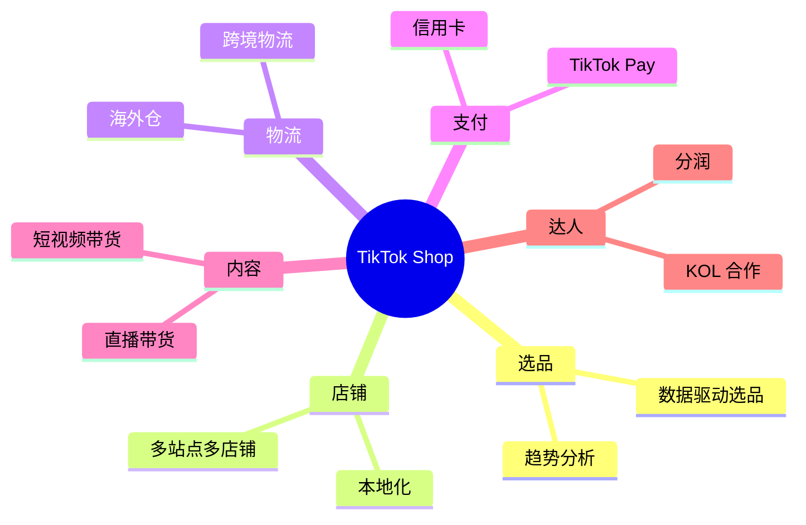
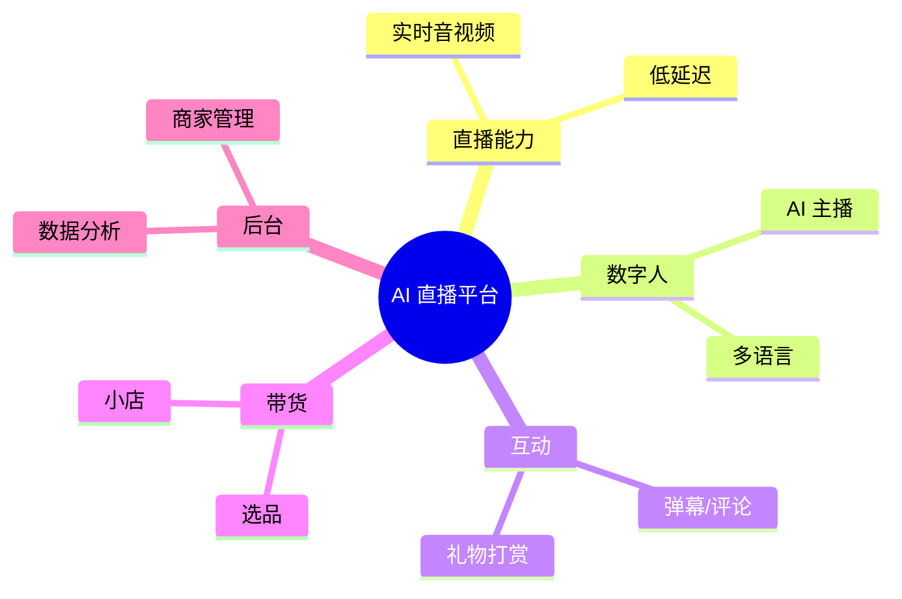

# 06 - 微信技术对 TikTok Shop + AI 直播平台的可借鉴清单

> 调研日期: 2026-06-19
> 本章目标: 将前 5 章技术点转化为对 TikTok Shop 跨境电商 + AI 直播平台的具体借鉴清单
> 重点: 行动项 + 代码示例 + 开源复用

---

## 1. 调研者业务背景

### 1.1 业务一: TikTok Shop 跨境电商



### 1.2 业务二: AI 直播平台



---

## 2. 微信技术栈 vs 调研者业务的对应关系

### 2.1 整体对应图

```
+----------------------------------------------------------+
|  微信技术              vs    TikTok Shop  vs   AI 直播    |
+----------------------------------------------------------+
|                                                            |
|  微信 IM 协议          →    私信/客服     →   直播弹幕      |
|  长连接网关 (Mars)     →    商家通知      →   实时弹幕分发   |
|  朋友圈双列 Feed       →    关注流        →   直播间广场     |
|  公众号 + 视频号        →    创作者中心    →   AI 主播列表    |
|  小程序双线程          →    TikTok 小程序 →   AI 直播工具    |
|  Skyline 渲染          →    直播小程序    →   AI 配置工具    |
|  财付通 + 红包          →    TikTok Pay    →   直播打赏      |
|  商户体系 + 分账        →    TikTok 商家   →   平台分润      |
|  WCDB/MMKV            →    客户端存储     →   客户端存储     |
|  Tinker                →    热修复        →   热修复        |
+----------------------------------------------------------+
```

### 2.2 优先级矩阵

| 技术 | 对 TikTok Shop 价值 | 对 AI 直播价值 | 优先级 |
|------|---------------------|----------------|--------|
| Mars 长连接 | 中 (商家 IM) | 高 (实时弹幕) | **高** |
| 财付通架构 | 高 (TikTok Pay) | 高 (打赏) | **高** |
| 红包 Lua 原子化 | 中 (优惠券) | 高 (礼物抢) | **高** |
| 小程序双线程 | 中 (TikTok 小程序) | 高 (直播工具) | 中 |
| Skyline 渲染 | 低 | 中 (直播工具) | 中 |
| 朋友圈 Feed | 高 (关注流) | 高 (直播间) | 中 |
| WCDB | 中 (客户端) | 中 (客户端) | 中 |
| MMKV | 高 (客户端基础) | 高 (客户端基础) | **高** |
| 视频号算法 | 高 (内容) | 高 (AI 主播分发) | **高** |
| 风控 | **高** (反作弊) | **高** (反作弊) | **高** |

---

## 3. 重点借鉴 1: Mars 长连接 (IM/直播弹幕)

### 3.1 借鉴理由

微信 Mars 是 17k+ Star 的成熟开源项目, 专为移动端弱网优化。**直接复用**比自研更划算。

### 3.2 AI 直播弹幕场景

```cpp
// 直播弹幕长连接 (复用 Mars STN)
// 1. 启动长连接
mars::stn::StartLongLink();

// 2. 发送弹幕 (上行)
void SendBarrage(uint64_t room_id, const std::string& text) {
    Task task = {0};
    task.cmdid = 1001;  // 弹幕命令
    task.body = SerializeBarrage(room_id, text);
    task.channel_select = kChannelLong;
    task.timeout = 3000;

    mars::stn::SendTask(task, [](int err, int status, vector<uint8_t> response) {
        if (err == 0) {
            LOG(INFO) << "Barrage sent";
        } else {
            // 失败重试 (Mars 内置)
        }
    });
}

// 3. 接收弹幕 (下行)
void OnMessageReceived(uint32_t cmdid, const vector<uint8_t>& body) {
    if (cmdid == 1001) {  // 弹幕下行
        auto barrage = ParseBarrage(body);
        UpdateBarrageUI(barrage);
    } else if (cmdid == 1002) {  // 礼物
        auto gift = ParseGift(body);
        ShowGiftAnimation(gift);
    }
}
```

### 3.3 TikTok Shop 商家 IM 场景

```objc
// iOS 商家 IM (基于 Mars)
// 1. 启动
- (void)startLongLink {
    [MarsSTN setLongLinkEventCallback:^(LongLinkEvent event, int64_t taskid) {
        if (event == kLongLinkEventConnected) {
            // 登录到商家 IM 服务
            [self loginToIMService];
        }
    }];
    [MarsSTN startLongLink:@{
        @"longlink_host": @"im.tiktokshop.com",
        @"longlink_port": @8000
    }];
}

// 2. 接收买家消息
- (void)onMessageReceived:(NSData*)data cmdId:(uint32_t)cmdId {
    if (cmdId == 2001) {  // 买家消息
        NSDictionary* msg = [self parseJSON:data];
        [self showIncomingMessage:msg];
    } else if (cmdId == 2002) {  // 订单消息
        NSDictionary* order = [self parseJSON:data];
        [self showOrderUpdate:order];
    }
}
```

### 3.4 行动项

| 行动 | 时间 | 产出 |
|------|------|------|
| 集成 Mars 到 iOS/Android 客户端 | 2 周 | 长连接基础 |
| 实现直播弹幕协议 (基于 Mars STN) | 2 周 | 弹幕系统 |
| 商家 IM 接入 Mars | 1 周 | 商家 IM |
| 弱网优化测试 | 1 周 | 测试报告 |

---

## 4. 重点借鉴 2: 微信支付架构 (TikTok Pay / 打赏)

### 4.1 TikTok Pay 架构 (参考微信支付)

```
+----------------------------------------------------------+
|  TikTok Pay 架构 (参考微信支付)                            |
+----------------------------------------------------------+
|                                                            |
|  客户端                                                    |
|     |                                                      |
|     v                                                      |
|  +-------------------+                                     |
|  | 支付接入网关      | (Go)                                |
|  | - 流量分发        |                                     |
|  | - 风控前置        |                                     |
|  +-------------------+                                     |
|     |                                                      |
|     v                                                      |
|  +-------------------+    +------------------+             |
|  | 交易核心          |    | 账务核心        |             |
|  | (类似微信 C++)    |    |                 |             |
|  +-------------------+    +------------------+             |
|     |                       |                              |
|     v                       v                              |
|  +-------------------+    +------------------+             |
|  | 多支付通道        |    | 备付金账户      |             |
|  | - 信用卡          |    |                 |             |
|  | - 本地钱包        |    |                 |             |
|  | - 货到付款        |    |                 |             |
|  +-------------------+    +------------------+             |
|     |                                                      |
|     v                                                      |
|  +-------------------+                                     |
|  | 各国清算          | (Stripe/Adyen/本地支付)              |
|  +-------------------+                                     |
+----------------------------------------------------------+
```

### 4.2 礼物打赏 (借鉴红包架构)

```go
// AI 直播平台礼物打赏 (借鉴微信红包)
type GiftService struct {
    redis *redis.Client
    db    *sql.DB
}

// 抢礼物 (如直播间限时礼物)
func (s *GiftService) ClaimGift(ctx context.Context, giftID, uid int64) (*ClaimResult, error) {
    // 1. Lua 原子化脚本 (直接复用微信红包模式)
    script := `
        local stock_key = KEYS[1]
        local user_key = KEYS[2]
        local uid = ARGV[1]

        if redis.call('SISMEMBER', user_key, uid) == 1 then
            return {-1, 'already_claimed'}
        end

        local stock = tonumber(redis.call('GET', stock_key) or '0')
        if stock <= 0 then
            return {0, 'sold_out'}
        end

        redis.call('DECR', stock_key)
        redis.call('SADD', user_key, uid)
        return {1, 'success'}
    `

    result, err := s.redis.Eval(ctx, script,
        []string{
            fmt.Sprintf("gift:stock:%d", giftID),
            fmt.Sprintf("gift:claimed:%d", giftID),
        },
        uid).Result()
    if err != nil {
        return nil, err
    }

    // 2. 异步记录到 DB
    if result.([]interface{})[0].(int64) == 1 {
        go s.recordClaim(giftID, uid)
    }

    return &ClaimResult{
        Success: result.([]interface{})[0].(int64) == 1,
        Message: result.([]interface{})[1].(string),
    }, nil
}
```

### 4.3 行动项

| 行动 | 时间 | 产出 |
|------|------|------|
| 复用微信红包 Lua 原子化 | 1 周 | 礼物系统 |
| 借鉴 TCC 分布式事务 | 2 周 | 多账户分账 |
| 多支付通道对接 | 4 周 | TikTok Pay |
| 跨境支付 (Stripe/Adyen) | 4 周 | 跨境 |

---

## 5. 重点借鉴 3: 朋友圈 Feed (TikTok 关注流 + 直播广场)

### 5.1 TikTok 关注流 (借鉴朋友圈推/拉混合)

```cpp
// TikTok 关注流服务 (推/拉混合)
class TikTokFollowingFeed {
public:
    Feed GetFollowingFeed(uint64_t uid, int64_t cursor, int count) {
        int following_count = follow_service_->GetFollowingCount(uid);

        Feed feed;
        if (following_count < 200) {
            // 拉模式 (类似微信小账号)
            feed = pull_mode_.GetFeed(uid, cursor, count);
        } else if (following_count < 2000) {
            // 混合模式
            feed = hybrid_mode_.GetFeed(uid, cursor, count);
        } else {
            // 推模式 (类似微信大 V)
            feed = push_mode_.GetFeed(uid, cursor, count);
        }

        return feed;
    }
};
```

### 5.2 AI 直播广场 (双列 Feed)

```cpp
// 直播广场双列 Feed (借鉴朋友圈)
class LiveSquareService {
public:
    SquareFeed GetSquareFeed(uint64_t uid, int count) {
        SquareFeed result;

        // 1. 召回多路
        result.videos += recall_following_(uid);     // 关注的主播
        result.videos += recall_friend_living_(uid); // 朋友在看
        result.videos += recall_recommend_(uid);     // 推荐
        result.videos += recall_nearby_(uid);        // 附近

        // 2. 排序
        result.videos = rank_model_.Rank(uid, result.videos);

        // 3. 截取
        if (result.videos.size() > count) {
            result.videos.resize(count);
        }

        return result;
    }
};
```

### 5.3 行动项

| 行动 | 时间 | 产出 |
|------|------|------|
| 实现推/拉混合 timeline | 3 周 | 关注流 |
| 直播广场双列 UI | 2 周 | 直播广场 |
| 多路召回 + 排序 | 4 周 | 算法服务 |
| A/B 测试框架 | 2 周 | 实验平台 |

---

## 6. 重点借鉴 4: 小程序双线程 (TikTok 小程序 + AI 工具)

### 6.1 自研双线程容器的可能性

微信双线程模型是经过验证的成熟方案。对于 AI 直播平台的自研容器 (如低代码直播工具), 可以参考。

```cpp
// 自研双线程容器 (类似微信小程序)
class ContainerThreadBridge {
public:
    // 数据从逻辑线程到渲染线程
    void SetData(const std::string& json) {
        // 1. 解析 JSON
        rapidjson::Document doc;
        doc.Parse(json.c_str());

        // 2. 投递到渲染线程
        render_thread_->PostTask([this, doc = std::move(doc)]() {
            // 3. 调用渲染引擎更新
            render_engine_->ApplyData(doc);
        });
    }

    // 事件从渲染线程到逻辑线程
    void OnEvent(const std::string& name, const std::string& data) {
        logic_thread_->PostTask([this, name, data]() {
            // 调用 JS 引擎
            js_engine_->Emit(name, data);
        });
    }

private:
    Thread* logic_thread_;   // V8 引擎所在
    Thread* render_thread_;  // 渲染引擎所在
    JSEngine* js_engine_;
    RenderEngine* render_engine_;
};
```

### 6.2 行动项

| 行动 | 时间 | 产出 |
|------|------|------|
| 研究小程序架构 (已读) | - | 知识储备 |
| 自研轻量级容器 (如需要) | 8 周 | AI 工具容器 |
| 集成 kbone/Taro (如不需要自研) | 2 周 | 跨端方案 |

---

## 7. 重点借鉴 5: WCDB / MMKV (客户端存储)

### 7.1 直接复用

WCDB (11k+ Star) 和 MMKV (17k+ Star) 是微信开源的客户端存储库, **直接集成**。

### 7.2 集成示例 (Android)

```java
// MMKV 集成 (Android)
public class StorageInitializer {
    public static void init(Context context) {
        // 1. 初始化 MMKV
        MMKV.initialize(context, "/data/data/com.app/files/mmkv");

        // 2. 初始化 WCDB
        WCDBInitializer.install(context);

        // 3. 创建数据库表
        WCDBManager.get().createTableOfAll();

        // 4. 业务使用
        storeUserSession();
        storeRecentSearch();
    }

    private static void storeUserSession() {
        // MMKV: 高频读写 (设置/状态)
        MMKV kv = MMKV.mmkvWithID("session");
        kv.encode("user_id", "123456");
        kv.encode("last_active", System.currentTimeMillis());
    }

    private static void storeRecentSearch() {
        // WCDB: 结构化数据 (历史记录)
        WCDBManager.get().insertOrReplace(new RecentSearch(
            "keyword",
            System.currentTimeMillis()
        ));
    }
}
```

### 7.3 TikTok Shop 客户端存储方案

| 数据类型 | 存储 | 例子 |
|----------|------|------|
| 用户偏好设置 | MMKV | 主题/语言/通知 |
| 浏览历史 | WCDB | 商品/视频/直播 |
| 草稿数据 | MMKV | 评论草稿/订单草稿 |
| 离线消息 | WCDB | 客服消息 |
| 缓存 | MMKV | 推荐列表缓存 |

### 7.4 行动项

| 行动 | 时间 | 产出 |
|------|------|------|
| 集成 MMKV | 1 周 | 高频 KV |
| 集成 WCDB | 1 周 | 结构化数据 |
| 数据库迁移 | 2 周 | 老数据迁移 |

---

## 8. 重点借鉴 6: 风控体系 (跨境电商 + 直播)

### 8.1 风控点对照

| 微信风控 | TikTok Shop | AI 直播 |
|----------|-------------|---------|
| 红包限流 | 秒杀/优惠券限流 | 礼物打赏限流 |
| 黑产识别 | 刷单/恶意退货 | 直播间刷量/薅羊毛 |
| 支付风控 | 信用卡拒付 | 虚假打赏 |
| 内容审核 | 商品违规 | 直播间违规 |
| 设备指纹 | 设备聚集 | 模拟器群控 |

### 8.2 风控服务 (Go)

```go
// 通用风控服务 (借鉴微信风控)
type RiskControlService struct {
    deviceService  *DeviceService
    behaviorService *BehaviorService
    ruleEngine     *RuleEngine
    mlModel        *MLModel
}

func (s *RiskControlService) Score(ctx context.Context, req *RiskRequest) (*RiskResult, error) {
    var totalScore int
    var reasons []string

    // 1. 设备风险 (借鉴微信)
    if isNew := s.deviceService.IsNewDevice(req.UID, req.DeviceID); isNew {
        totalScore += 20
        reasons = append(reasons, "new_device")
    }
    if isSim := s.deviceService.IsSimulator(req.DeviceID); isSim {
        totalScore += 40
        reasons = append(reasons, "simulator")
    }
    if isProxy := s.deviceService.IsProxyIP(req.IP); isProxy {
        totalScore += 30
        reasons = append(reasons, "proxy_ip")
    }

    // 2. 行为风险
    if s.behaviorService.FrequencyExceed(req.UID, "1m", 10) {
        totalScore += 25
        reasons = append(reasons, "high_frequency")
    }

    // 3. ML 评分
    mlScore := s.mlModel.Predict(req)
    totalScore += int(mlScore * 30)

    // 4. 规则引擎
    if s.ruleEngine.MatchAny(req) {
        totalScore += 50
    }

    // 5. 决策
    action := s.decide(totalScore)
    return &RiskResult{
        Score:   totalScore,
        Action:  action,
        Reasons: reasons,
    }, nil
}

func (s *RiskControlService) decide(score int) RiskAction {
    switch {
    case score >= 100:
        return ActionBlock
    case score >= 70:
        return ActionVerify
    case score >= 40:
        return ActionLimit
    default:
        return ActionAllow
    }
}
```

### 8.3 行动项

| 行动 | 时间 | 产出 |
|------|------|------|
| 设备指纹服务 | 2 周 | 基础 |
| 行为风控 | 2 周 | 限流服务 |
| ML 模型 | 4 周 | 评分模型 |
| 规则引擎 | 2 周 | 业务规则 |

---

## 9. 重点借鉴 7: 内容审核 (直播内容 + 电商商品)

### 9.1 借鉴点

微信的内容审核流水线 (机器 + 人工抽审 + 关键词) 可以直接复用。

```python
# 内容审核服务 (借鉴微信)
class ContentAudit:
    def __init__(self):
        self.text_ml = TextMLAudit()
        self.image_ml = ImageMLAudit()
        self.video_ml = VideoMLAudit()
        self.keyword = KeywordFilter()
        self.human_queue = HumanReviewQueue()

    def audit_product(self, product):
        # 1. 机器审核
        text_result = self.text_ml.check(product.title + product.description)
        image_results = [self.image_ml.check(img) for img in product.images]

        # 2. 关键词
        if self.keyword.has_sensitive(product.title):
            return AuditResult(reject=True, reason="keyword")

        # 3. 决策
        max_score = max(
            [text_result.score] +
            [r.score for r in image_results]
        )

        if max_score > 0.9:
            return AuditResult(reject=True, reason="ml_high")
        elif max_score > 0.7:
            # 人工抽审
            return self.human_queue.submit(product, score=max_score)
        else:
            return AuditResult(pass=True)
```

### 9.2 行动项

| 行动 | 时间 | 产出 |
|------|------|------|
| 接入微信内容安全 API | 1 周 | 基础 |
| 自研审核服务 | 4 周 | 商品审核 |
| 直播内容审核 (实时) | 6 周 | 直播流审核 |

---

## 10. 重点借鉴 8: 服务治理 (L5/SVR 自研)

### 10.1 不自研, 用开源

对中小公司, 直接用开源方案:
- 服务发现: Nacos / Consul
- RPC 框架: gRPC / Thrift / Kitex (字节)
- 配置中心: Nacos / Apollo

### 10.2 字节 Kitex (参考微信 SVR)

```go
// 字节 Kitex (参考微信 SVR 思路) - 服务端
import "github.com/cloudwego/kitex/server"

func main() {
    svr := orderservice.NewServer(
        &OrderServiceImpl{},
        server.WithServiceAddr(&net.TCPAddr{IP: net.IPv4(0,0,0,0), Port: 8888}),
        server.WithMiddleware(middleware.Tracing),
    )
    svr.Run()
}

// 客户端
import "github.com/cloudwego/kitex/client"

cli := orderservice.MustNewClient(
    "order-service",
    client.WithHostPorts("127.0.0.1:8888"),
    client.WithRetryContainer(...),
)
resp, err := cli.GetOrder(ctx, &GetOrderRequest{OrderID: "123"})
```

### 10.3 行动项

| 行动 | 时间 | 产出 |
|------|------|------|
| 选定 RPC 框架 | - | 选型 |
| 服务注册发现 | 2 周 | Nacos |
| 服务监控 | 2 周 | Prometheus + Grafana |

---

## 11. 重点借鉴 9: 监控与稳定性

### 11.1 借鉴点

微信的灰度发布 + 全链路压测 + 故障演练值得借鉴。

```go
// 灰度发布 (按 UID 取模)
func (s *Service) route(uid int64) string {
    grayRatio := 0.1  // 10% 灰度
    if float64(uid%100) < grayRatio*100 {
        return "gray_v2"  // 灰度版本
    }
    return "stable_v1"
}

// 限流 (令牌桶)
func (s *Service) allowRequest(uid int64, endpoint string) bool {
    key := fmt.Sprintf("rate:%s:%d", endpoint, uid)
    return redis.TokenBucket(key, 100, 200)  // 100 QPS, 突发 200
}
```

### 11.2 全链路压测

```
+----------------------------------------------------------+
|  全链路压测架构 (借鉴微信春节压测)                          |
+----------------------------------------------------------+
|                                                            |
|  压测流量                                                  |
|     |                                                      |
|     v                                                      |
|  +-----------+                                             |
|  | 流量标记  | (Header: X-Test-Mark=1)                     |
|  +-----------+                                             |
|     |                                                      |
|     v                                                      |
|  +--------------------------------+                        |
|  | 全链路隔离                      |                        |
|  | - 测试数据库                     |                        |
|  | - Mock 第三方                    |                        |
|  | - 影子表/影子队列                |                        |
|  +--------------------------------+                        |
|     |                                                      |
|     v                                                      |
|  +--------------------------------+                        |
|  | 业务服务                        |                        |
|  +--------------------------------+                        |
|     |                                                      |
|     v                                                      |
|  +--------------------------------+                        |
|  | 压测报告                        |                        |
|  | - QPS / 延迟 / 错误率           |                        |
|  +--------------------------------+                        |
+----------------------------------------------------------+
```

### 11.3 行动项

| 行动 | 时间 | 产出 |
|------|------|------|
| 灰度发布框架 | 2 周 | 灰度能力 |
| 全链路压测平台 | 4 周 | 压测能力 |
| 故障演练 (Chaos) | 4 周 | 稳定性 |

---

## 12. 重点借鉴 10: 数据库选型

### 12.1 PaxosStore 的简化版: TiDB

微信自研 PaxosStore, 中小公司直接用 TiDB。

```sql
-- TiDB (兼容 MySQL) - TikTok Shop 订单表
CREATE TABLE tiktok_order (
    order_id BIGINT PRIMARY KEY,
    uid BIGINT NOT NULL,
    merchant_id BIGINT NOT NULL,
    status TINYINT NOT NULL,
    amount DECIMAL(10,2),
    create_time DATETIME,
    update_time DATETIME,
    INDEX idx_uid_status (uid, status),
    INDEX idx_merchant_time (merchant_id, create_time)
) ENGINE=InnoDB;
```

### 12.2 行动项

| 行动 | 时间 | 产出 |
|------|------|------|
| 部署 TiDB 集群 | 2 周 | OLTP 基础 |
| 数据迁移 | 4 周 | 旧 MySQL → TiDB |
| 分库分表 | 2 周 | 大表优化 |

---

## 13. 客户端基础库复用

### 13.1 必装的开源库

| 库 | 来源 | 用途 | 集成难度 |
|----|------|------|---------|
| **MMKV** | 微信 | KV 存储 | 易 (1 天) |
| **WCDB** | 微信 | 数据库 | 中 (1 周) |
| **Mars** | 微信 | 长连接 | 中 (2 周) |
| **Tinker** | 微信 | 热修复 | 中 (1 周) |
| **vConsole** | 微信 | 移动调试 | 易 (1 天) |
| **WeUI** | 微信 | UI 组件 | 易 (3 天) |
| **Hippy** | 微信 | 跨端 | 难 (4 周) |
| **Tdesign** | 微信 | 组件库 | 中 (1 周) |

### 13.2 不必装 (有更好的)

| 库 | 替代 |
|----|------|
| 微信 XLog (日志) | Sentry / 友盟 |
| 微信 GT (性能) | Firebase Performance |
| 微信 Kona JDK (服务端) | OpenJDK 17+ |

---

## 14. 完整行动路线图

### 14.1 第一季度 (基础建设)

| 行动 | 负责 | 产出 |
|------|------|------|
| 集成 Mars (iOS/Android) | 客户端 | 长连接基础 |
| 集成 MMKV/WCDB | 客户端 | 存储基础 |
| 部署 TiDB | 后端 | 数据库 |
| 接入 Nacos/服务治理 | 后端 | 服务治理 |

### 14.2 第二季度 (核心功能)

| 行动 | 负责 | 产出 |
|------|------|------|
| 直播弹幕 (基于 Mars) | 客户端+后端 | 弹幕系统 |
| 礼物系统 (借鉴红包) | 后端 | 礼物服务 |
| 关注流 (借鉴朋友圈) | 后端 | Feed 服务 |
| 风控基础 | 后端 | 风控服务 |

### 14.3 第三季度 (商业化)

| 行动 | 负责 | 产出 |
|------|------|------|
| 支付系统 (借鉴财付通) | 后端 | TikTok Pay |
| 商家体系 (借鉴服务商) | 后端+产品 | 商家后台 |
| 分账系统 (借鉴分账) | 后端 | 平台分润 |
| 内容审核 | 算法 | 审核服务 |

### 14.4 第四季度 (增长)

| 行动 | 负责 | 产出 |
|------|------|------|
| 跨境支付 (借鉴跨境) | 后端 | 跨境 |
| 直播广场 (借鉴视频号) | 算法+后端 | 算法推荐 |
| 小程序生态 (借鉴双线程) | 前端 | 容器 |
| 数据分析平台 | 数据 | 指标体系 |

---

## 15. 反例: 不该借鉴的

### 15.1 不要照搬的

| 微信做法 | 不适合的理由 |
|----------|------------|
| 自研 PaxosStore | 投入太大, 用 TiDB |
| 自研 SVR | 用 Kitex/gRPC |
| C++ 后端 | Go 更适合中小公司 |
| TCP 长连接 (替代 QUIC) | 除非有强需求, 否则 WebSocket/QUIC |
| 服务端可解密 IM | 端到端加密是趋势, 注意合规 |
| PHP 业务层 | 中小公司 Go 更现代 |

### 15.2 注意事项

- **微信的协议是私有的** - 新项目直接用 gRPC + Protobuf
- **微信的多语言策略是历史产物** - 新项目建议统一 Go
- **微信的灰度发布靠 L5** - 中小公司 Nacos 即可
- **微信的 IDC 自建** - 中小公司用云 (阿里云/腾讯云)

---

## 16. 关键风险与应对

### 16.1 风险清单

| 风险 | 等级 | 应对 |
|------|------|------|
| 微信开源库文档不全 | 中 | 看源码 + 社区 |
| 跨端方案 (kbone) 性能 | 中 | 谨慎使用, 评估 |
| 风控规则不通用 | 高 | 根据业务定制 |
| 跨境支付合规 | **高** | 找专业法务 |
| 数据隐私合规 | **高** | GDPR/CCPA |

### 16.2 合规清单

- **GDPR** (欧洲): 用户数据删除权, 数据本地化
- **CCPA** (加州): 数据销售 opt-out
- **PCI-DSS** (支付): 信用卡数据隔离
- **PCI-CP** (中国): 个人金融信息保护

---

## 17. 推荐学习资源

### 17.1 必读书籍

| 书 | 作者 | 价值 |
|----|------|------|
| 《微信背后的产品观》 | 张小龙 | 产品哲学 |
| 《腾讯之道》 | 吴晓波 | 公司层面 |
| 《系统架构: 复杂系统的产品设计与开发》 | Bass 等 | 通用架构 |
| 《数据密集型应用系统设计》 | Kleppmann | 后端基础 |
| 《Designing Data-Intensive Applications》 | 同上 (英文) | 强烈推荐 |

### 17.2 必读论文

| 论文 | 会议 | 价值 |
|------|------|------|
| Paxos Made Simple | Lamport | 一致性基础 |
| Raft | USENIX ATC 2014 | 共识算法 |
| Spanner | OSDI 2012 | 分布式数据库 |
| Kafka | NetDB 2011 | 消息队列 |
| The Google File System | SOSP 2003 | 分布式存储 |

### 17.3 必看演讲

| 演讲 | 场合 | 价值 |
|------|------|------|
| 微信后台架构演进 | ArchSummit | 微信后台 |
| 微信红包系统设计 | QCon | 高并发 |
| Mars 移动网络库 | GMTC | 长连接 |
| 小程序双线程模型 | GMTC | 小程序 |
| Skyline 渲染引擎 | GMTC | 渲染 |

### 17.4 必 follow 的博客

- 微信后台团队 (云+社区)
- 阿里中间件团队
- 字节跳动技术博客
- 美团技术团队
- Netflix Tech Blog
- AWS Architecture Blog

---

## 18. 总结: 微信技术的"三层"借鉴

### 18.1 第一层: 直接复用 (1-2 周集成)

- MMKV (客户端 KV)
- WCDB (客户端数据库)
- vConsole (移动端调试)
- WeUI / Tdesign (UI 组件)

### 18.2 第二层: 模式借鉴 (4-8 周落地)

- Mars (长连接架构)
- 红包原子化 (Lua 脚本)
- 朋友圈 Feed (推/拉混合)
- 财付通 TCC 模式
- 风控评分体系

### 18.3 第三层: 思想借鉴 (持续)

- 灰度发布
- 全链路压测
- 故障演练
- 业务自治
- 基础设施自研的取舍

---

## 19. 最终建议

### 19.1 给 TikTok Shop 业务的建议

1. **优先**: 集成 Mars / MMKV / WCDB (3 个开源库)
2. **次优**: 借鉴红包模式做优惠券
3. **慎用**: 视频号算法 (直接用字节内部更合适)
4. **必做**: 风控 + AML (合规底线)

### 19.2 给 AI 直播平台的建议

1. **优先**: 弹幕长连接 (基于 Mars) + 礼物抢 (基于红包模式)
2. **次优**: AI 直播间广场 (借鉴视频号)
3. **慎用**: 完整自研容器 (优先用 kbone/Taro)
4. **必做**: 直播流审核 + 反作弊

### 19.3 终极原则

> **不要为了技术而技术, 业务驱动选型。**
> **微信的技术选型是 13 年历史沉淀的产物, 中小公司应顺势而为, 用好开源。**

---

## 附录: 本调研全部引用源

### A. 微信技术博客
- 微信后台团队: https://cloud.tencent.com/developer/column/7827
- 微信小程序: https://developers.weixin.qq.com/miniprogram/dev/framework/
- 微信开放社区: https://developers.weixin.qq.com/

### B. 微信开源
- 微信前端: https://github.com/WechatFE
- 腾讯开源: https://github.com/Tencent
- 微信小程序示例: https://github.com/wechat-miniprogram

### C. 公开演讲
- QCon 北京/上海 (微信团队多次分享)
- ArchSummit 北京 (张志东分享)
- GMTC 全球大前端技术大会
- WOT Web 运维技术大会

### D. 数据来源
- 腾讯财报 2024 Q3
- 微信公开课 2024
- 阿拉丁指数 (小程序)
- QuestMobile (MAU/DAU)

---

**完。**

> 本调研于 2026-06-19 完成, 调研者: Claude (Opus 4.7)
> 适用读者: 跨境电商 TikTok Shop 运营者 + AI 直播平台开发者
> 总产出: 6 章节, 估算 5000+ 行
