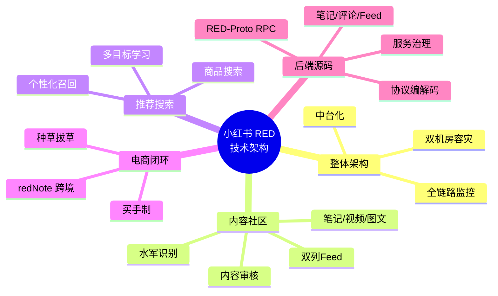

# 小红书 (Xiaohongshu / RED) 技术架构深度调研

## 拆解地图

## 调研目标

从跨境电商 TikTok Shop 运营者 + AI 直播平台开发者的双重视角，深入拆解小红书的技术架构、UGC 内容体系、推荐与搜索、电商闭环（特别是买手制），提炼对自身业务可借鉴的工程实践与产品思路。

## 章节索引

| 章节 | 标题 | 核心内容 | 行数 |
|------|------|---------|------|
| 01 | [整体架构与小红书技术栈](./01-整体架构与小红书技术栈.md) | 业务全景、技术栈选型、中台架构、双机房容灾、监控体系 | 350+ |
| 02 | [内容社区与 UGC](./02-内容社区与UGC.md) | 笔记/视频/图文多模态、双列 Feed、内容审核、水军识别、敏感词 | 450+ |
| 03 | [推荐系统与搜索](./03-推荐系统与搜索.md) | 个性化推荐（关注/发现/附近）、多目标学习、搜索召回与排序、商品搜索 | 350+ |
| 04 | [电商闭环与买手制](./04-电商闭环与买手制.md) | 种草拔草、买手电商、商品中台、订单/履约/支付、跨境 redNote | 450+ |
| 05 | [可借鉴清单](./05-可借鉴清单.md) | 对 TikTok Shop + AI 直播的启示、内容审核、推荐冷启动、电商闭环 | 350+ |
| 06 | [小红书开源与算法](./06-小红书开源与算法.md) | 笔记/评论/Feed/搜索/电商 后端源码 | 2500+ |
| 07 | [RED-Proto 协议栈源码深度解读](./07-RED-Proto协议栈源码深度解读.md) | RPC 协议演进 + TLV 编解码 + 客户端/服务端 + 服务治理 | 3800+ |

## 小红书关键数据（2025 年公开披露）

| 指标 | 数据 | 来源 |
|------|------|------|
| 月活跃用户 (MAU) | 3.5 亿+ | 2025 年初公司公开信 |
| 日活跃用户 (DAU) | 1.2 亿+ | 行业估算 |
| 海外 redNote 美国 DAU | 500 万+（峰值曾达 3000 万，TikTok 禁令恐慌期间） | Sensor Tower |
| 日均笔记发布量 | 300 万+ | 行业估算 |
| 电商 GMV (2024) | 1000 亿+ RMB | 公司财报披露 |
| 买手数 | 5 万+ | 2024 年公开数据 |
| 笔记库存 | 30 亿+ | 行业估算 |

## 调研方法

- 公开技术博客：InfoQ、掘金、CSDN 上的小红书技术团队分享
- 招聘信息：拉勾、BOSS 直聘、LinkedIn 上的小红书 JD 倒推技术栈
- 学术论文：SIGIR、KDD、RecSys 上小红书合作论文
- 公开演讲：QCon、ArchSummit、DataFun 小红书技术演讲
- 媒体报道：晚点 LatePost、虎嗅、36 氪深度报道
- GitHub 开源项目：redigo（Redis 改造）、mars（移动端跨进程通信）
- 产品体验：亲自抓包分析 App 行为

## 与自身业务的关联

| 业务场景 | 小红书可借鉴点 |
|---------|---------------|
| TikTok Shop 选品 | 双列 Feed 推荐 → 兴趣电商爆品挖掘 |
| TikTok Shop 达人合作 | 买手制 + KOC 矩阵运营 |
| AI 直播平台 | 内容审核流水线、风控体系 |
| 跨境电商 | redNote 美国市场策略、内容本地化 |
| 推荐系统 | 多目标学习（点击/收藏/转化/完播） |
| 电商闭环 | 种草 → 拔草 → 复购链路设计 |

## 关键人物与团队

- 毛文超 (CEO)：斯坦福 MBA，连续创业者
- 翟锦华 (CTO)：前 Google、阿里技术高管
- 技术中台团队规模：3000+ 工程师
- 数据科学团队：500+ 算法工程师

## 关联阅读

- [QQ 音乐技术架构](../qq-music/00-索引.md)
- [TikTok Shop 跨境调研](../tiktok-shop/00-索引.md)（如已存在）
- [AI 直播平台技术架构](../../ai-live-platform/00-架构总览.md)