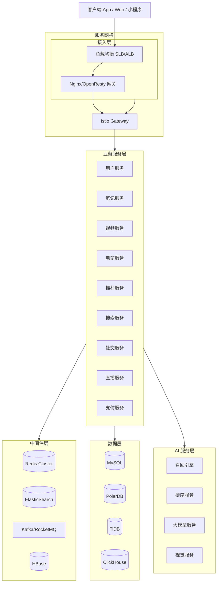
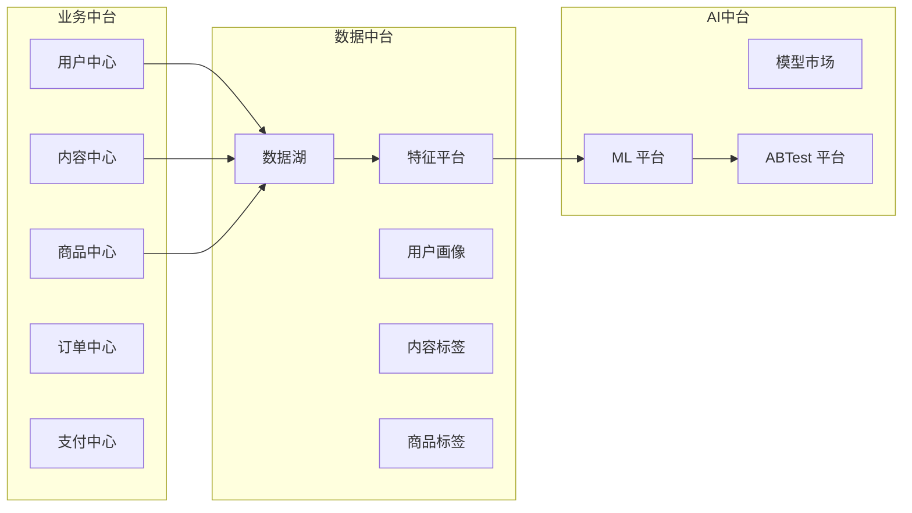

# 01 小红书整体架构与技术栈

## 1.1 业务全景

小红书 (RED) 是中国最大的 UGC 内容社区 + 兴趣电商平台。截至 2025 年初，月活 3.5 亿+，DAU 1.2 亿+，内容形态从最初的出境游购物攻略，已经演化为覆盖美妆、时尚、美食、家居、数码、知识、运动、母婴、宠物等全品类的"生活经验分享"社区。

**三大核心业务线**：

```
┌──────────────────────────────────────────────────────────┐
│                    小红书业务全景                          │
├──────────────────────────────────────────────────────────┤
│                                                          │
│  ┌────────────┐   ┌────────────┐   ┌────────────┐      │
│  │ 内容社区   │   │ 电商业务   │   │ 商业化     │      │
│  │ (基础盘)   │ → │ (增长极)   │   │ (变现)     │      │
│  └────────────┘   └────────────┘   └────────────┘      │
│        │                │                │              │
│        ↓                ↓                ↓              │
│   笔记/视频/直播     买手/商家/自营     广告/品牌合作     │
│   图文/图文+视频    商品/订单/履约     蒲公英/灵犀       │
│                                                          │
└──────────────────────────────────────────────────────────┘
```

**核心增长曲线**：

- 2013-2017：海淘攻略 → 跨境购物社区
- 2017-2020：生活方式社区 → 月活破亿
- 2020-2023：视频化转型 → 抖音化应对
- 2023-2025：买手电商爆发 → 与抖音、拼多多差异化竞争
- 2025：海外 redNote 登顶美国 App Store → 中国互联网出海现象级产品

## 1.2 技术栈全景

小红书技术栈以"Java + Go 双主线"为核心，结合 Python/Go 做算法服务，C++/Rust 做底层性能优化。

### 1.2.1 后端服务

| 层级 | 技术选型 | 用途 |
|------|---------|------|
| Web 网关 | OpenResty (Nginx + Lua) | 流量网关、限流、防爬、ABTest |
| RPC 框架 | 自研 bRPC + Thrift + gRPC | 服务间通信 |
| 微服务框架 | Spring Cloud / Spring Cloud Alibaba (历史) + 自研服务网格 | 微服务治理 |
| 服务网格 | Istio + Envoy (逐步迁移) | 流量管理、可观测性 |
| 业务语言 | Java (主)、Go (新)、Python (算法) | 业务开发 |
| 异步消息 | Apache Kafka + 自研 MQ (RocketMQ 改造) | 事件驱动、日志流 |
| 任务调度 | XXL-JOB + DolphinScheduler + 自研 TaskMaster | 离线任务、定时任务 |
| 配置中心 | Apollo (携程开源) + Nacos | 配置管理 |

### 1.2.2 数据与存储

| 类别 | 技术 | 用途 |
|------|------|------|
| 关系数据库 | MySQL 8.0 (主) + PolarDB (部分) + TiDB (OLAP 场景) | 业务主库 |
| 缓存 | Redis 7 + Codis (历史) + 自研 KVStore | 热点缓存、计数器 |
| 搜索引擎 | ElasticSearch 8 (笔记/商品搜索) + HBase (宽表) + OpenSearch | 全文检索 |
| 文档数据库 | MongoDB (UGC 内容原始数据) | 半结构化存储 |
| 时序数据库 | Druid + ClickHouse + InfluxDB | 监控、APM |
| 图数据库 | NebulaGraph (社交关系、内容图谱) | 关系图谱 |
| 数据仓库 | Hive + ClickHouse + StarRocks + Apache Doris | 离线/实时数仓 |
| 数据湖 | Iceberg + Hudi + 对象存储 OSS | 原始日志、画像 |
| 对象存储 | 自建 S3 兼容 + 阿里 OSS + AWS S3 | 图片、视频、备份 |

### 1.2.3 算法与 AI

| 类别 | 技术 | 用途 |
|------|------|------|
| 训练框架 | TensorFlow + PyTorch (主流) + DeepRec (阿里) | 模型训练 |
| 特征平台 | 自研 FeatureStore (Redis + HBase + KV) | 特征存储 |
| 在线推理 | TensorFlow Serving + Triton + 自研 TFProxy | 模型部署 |
| 召回引擎 | 自研 ANN (Faiss + HNSW + 自研二跳索引) | 向量召回 |
| 排序框架 | 阿里 DeepRec + 自研 XDeepRec | 深度学习排序 |
| NLP | BERT/RoBERTa + 盘古/悟道 LLM | 内容理解、搜索 |
| CV | 自研图像多模态 + CLIP 变体 | 图像理解 |
| 多模态 | M6/Chinese-CLIP + 自研多模态预训练 | 图文匹配、视频理解 |

### 1.2.4 移动端

| 平台 | 技术 | 亮点 |
|------|------|------|
| Android | Kotlin + Java + 自研 Mars (跨进程通信) + Boost (C++ 网络库) | 启动速度优化 |
| iOS | Swift + Objective-C + 自研 Mars + Thrift | 包大小优化 |
| 跨端 | Flutter (部分) + Weex (历史) + 自研 XHybrid | 电商、直播 |
| 视频播放 | 自研播放器 + ExoPlayer (Android) + AVPlayer (iOS) + FFmpeg | 软硬解自适应 |
| 图片加载 | 自研 SDWebImage 改造 + Glide | 大图渐进式加载 |

### 1.2.5 基础设施

| 类别 | 技术 |
|------|------|
| 容器化 | Docker + Kubernetes (自建 + 阿里云 ACK) |
| 服务网格 | Istio (灰度迁移中) |
| CI/CD | GitLab CI + 自研发布平台 (基于 Argo Rollouts) |
| 监控 | Prometheus + Grafana + 自研 RED 监控 |
| 日志 | ELK (Elasticsearch + Logstash + Kibana) + SLS |
| 链路追踪 | Jaeger + 自研 Trace 系统 |
| 混沌工程 | ChaosBlade + 自研故障演练平台 |
| 数据同步 | Canal + DTS + 自研 BinlogHub |

## 1.3 服务架构图



## 1.4 中台架构

小红书是国内最早实践"中台战略"的互联网公司之一，技术中台经历了从"业务中台"到"数据中台"再到"AI 中台"的演进。

### 1.4.1 三大中台



### 1.4.2 中台核心服务

**用户中心 (UC)**：
- 单点登录 + 统一身份
- 用户画像 (人口属性、兴趣偏好、消费力)
- 跨业务线账号打通 (社区/电商/直播)
- 实名认证、未成年人保护

**内容中心 (CC)**：
- 笔记/视频/图文统一抽象
- 内容生命周期管理 (草稿/审核/发布/隐藏/删除)
- 内容标签体系 (一级 60+ 类目，二级 1000+，三级 50000+)
- 多模态特征 (文本 embedding、图像 embedding、视频 embedding)

**商品中心 (MC)**：
- 商品 SPU/SKU 管理
- 跨店铺商品池
- 商品标签 (类目、品牌、价格带、风格)
- 商品搜索与推荐

**订单中心 (OC)**：
- 订单生命周期
- 支付路由
- 售后服务
- 履约协同

## 1.5 双机房容灾与多活

小红书作为日活过亿的应用，对可用性要求极高（4 个 9 起步），因此在异地多活方面投入巨大。

### 1.5.1 三地五中心架构

```
┌─────────────────────────────────────────────────────────┐
│                 小红书多活架构                            │
├─────────────────────────────────────────────────────────┤
│                                                          │
│   上海 (主) ←─────→ 杭州 (同城灾备)                      │
│      ↕                  ↕                                │
│   深圳 (异地多活)  ←─→  北京 (异地多活)                  │
│                                                          │
│   海外：新加坡 (redNote 东南亚)                          │
│         美东 (redNote 美国)                              │
│                                                          │
└─────────────────────────────────────────────────────────┘
```

**关键技术点**：

1. **流量调度**：GSLB (Global Server Load Balance) + 自研 Resolver
2. **数据同步**：DRC (Data Replication Center)，基于自研 Binlog 同步
3. **单元化**：按用户 ID 维度划分单元，每个单元独立运行
4. **降级开关**：每个服务都接入自研 Sentinel + Hystrix 改造版
5. **演练**：ChaosBlade 月度故障演练、季度全链路演练

### 1.5.2 数据库容灾

```sql
-- 数据库双写示例（简化）
-- 用户写入主库
INSERT INTO user_db.users (user_id, name, mobile)
VALUES (?, ?, ?);

-- 异步同步到备库（通过 BinlogHub）
-- BinlogHub 自研组件，基于 Canal 改造，支持：
-- 1. 多源多目标同步
-- 2. 字段过滤和转换
-- 3. 数据校验
-- 4. 自动故障切换
```

## 1.6 监控与可观测性

小红书构建了完整的可观测性体系（RED = Rate + Error + Duration）。

### 1.6.1 监控分层

```
┌──────────────────────────────────────────┐
│  业务监控层 (GMV/DAU/转化漏斗)            │
├──────────────────────────────────────────┤
│  应用监控层 (QPS/错误率/响应时间)         │
├──────────────────────────────────────────┤
│  中间件监控层 (Redis/MySQL/MQ)           │
├──────────────────────────────────────────┤
│  基础设施监控层 (CPU/MEM/Net/Disk)       │
├──────────────────────────────────────────┤
│  网络监控层 (DNS/CDN/负载均衡)            │
└──────────────────────────────────────────┘
```

### 1.6.2 自研 RED 监控系统

```python
# 自研 RED 监控 SDK（简化示例）
from red_monitor import RED, Timer, Counter

# 计数器 - 请求量
QPS_COUNTER = Counter(
    name='http_request_total',
    labels=['method', 'path', 'status']
)

# 计时器 - 响应时间
LATENCY_TIMER = Timer(
    name='http_request_duration_seconds',
    labels=['method', 'path']
)

# 错误计数器
ERROR_COUNTER = Counter(
    name='http_request_error_total',
    labels=['method', 'path', 'error_type']
)

def monitor_middleware(func):
    """RED 监控装饰器"""
    def wrapper(*args, **kwargs):
        with LATENCY_TIMER.labels(
            method=func.__name__
        ).time():
            try:
                result = func(*args, **kwargs)
                QPS_COUNTER.labels(
                    method=func.__name__,
                    path=func.__module__,
                    status='success'
                ).inc()
                return result
            except Exception as e:
                ERROR_COUNTER.labels(
                    method=func.__name__,
                    path=func.__module__,
                    error_type=type(e).__name__
                ).inc()
                raise
    return wrapper

@monitor_middleware
def get_note_detail(note_id):
    # 业务逻辑
    pass
```

### 1.6.3 链路追踪

小红书自研 Trace 系统基于 OpenTelemetry 协议，实现：

- **跨语言追踪**：Java/Go/Python/C++ 全链路
- **采样策略**：头部采样 + 尾部采样 + 异常全采
- **上下文传播**：通过 Thrift Header、HTTP Header、MQ Header 传递
- **存储优化**：ClickHouse 列式存储，支持秒级聚合

## 1.7 性能优化经典案例

### 1.7.1 客户端启动优化

小红书 App 启动时间从 5s 优化到 1.2s，主要手段：

```kotlin
// Android 启动优化（自研实践）
class AppStartupManager {
    
    // 1. 启动任务分级
    enum class TaskPriority {
        CRITICAL,    // 关键任务，必须等待
        HIGH,        // 高优先级
        NORMAL,      // 普通优先级
        LOW,         // 低优先级，异步执行
        IDLE         // 空闲时执行
    }
    
    // 2. 并发执行（基于自研 Mars）
    fun parallelStartup() {
        TaskScheduler.execute(parallel = true) {
            // 主线程：首屏渲染
            renderMainActivity()
            
            // 并发 1：网络初始化
            initMars()
            
            // 并发 2：图片库初始化
            initImageLoader()
            
            // 并发 3：数据预加载
            preloadHotData()
            
            // 并发 4：埋点初始化
            initTracker()
        }
    }
    
    // 3. 延迟初始化
    fun lazyInit() {
        // 直播组件延迟到首屏加载完成后初始化
        LiveModule.initAsync()
        
        // 电商组件延迟到用户进入商城 Tab 时初始化
        ShopModule.initLazy()
    }
    
    // 4. 启动器（基于有向无环图）
    fun startupGraph() {
        val graph = StartupGraph()
        graph.addEdge("A", "B")  // A 执行后才能执行 B
        graph.execute()  // 拓扑排序并行执行
    }
}
```

### 1.7.2 数据库优化

**分库分表策略**：

```sql
-- 笔记表分库分表（按 user_id 哈希 64 库 1024 表）
-- user_id_hash = hash(user_id) % 64
-- table_index = hash(user_id) % 1024

CREATE TABLE `note_${table_index}` (
    `note_id` BIGINT UNSIGNED NOT NULL,
    `user_id` BIGINT UNSIGNED NOT NULL,
    `title` VARCHAR(255) NOT NULL,
    `content` MEDIUMTEXT,
    `cover_url` VARCHAR(512),
    `status` TINYINT NOT NULL DEFAULT 0,
    `created_at` TIMESTAMP NOT NULL,
    `updated_at` TIMESTAMP NOT NULL DEFAULT CURRENT_TIMESTAMP ON UPDATE CURRENT_TIMESTAMP,
    PRIMARY KEY (`note_id`),
    KEY `idx_user_status` (`user_id`, `status`, `created_at`),
    KEY `idx_status_created` (`status`, `created_at`)
) ENGINE=InnoDB DEFAULT CHARSET=utf8mb4
PARTITION BY HASH(note_id) PARTITIONS 16;
```

**慢查询治理**：

```sql
-- 索引优化案例：从 800ms 优化到 8ms
-- 原始查询
SELECT note_id, title, cover_url 
FROM note 
WHERE user_id = ? AND status = 1 
ORDER BY created_at DESC 
LIMIT 20;
-- 优化：覆盖索引，避免回表
ALTER TABLE note ADD INDEX idx_user_status_created (
    user_id, status, created_at DESC, 
    note_id, title, cover_url
);
```

### 1.7.3 缓存架构

**多级缓存**：

```
┌────────────────────────────────────────────┐
│  L1: 进程内缓存 (Caffeine, 100ms 级)        │
├────────────────────────────────────────────┤
│  L2: Redis Cluster (10ms 级)               │
├────────────────────────────────────────────┤
│  L3: 自研 KVStore (基于 RocksDB, 1ms 级)   │
├────────────────────────────────────────────┤
│  L4: 数据库 (10ms+ 级)                     │
└────────────────────────────────────────────┘
```

**缓存策略**：

```java
// 缓存抽象接口（简化示例）
public interface CacheClient {
    
    // 缓存穿透防护：空值缓存
    public Note getNoteWithNullProtection(Long noteId) {
        String key = "note:" + noteId;
        Note note = cache.get(key);
        if (note == null) {
            // 查数据库
            note = noteDao.findById(noteId);
            if (note == null) {
                // 缓存空值，过期时间短
                cache.set(key + ":null", "1", 60);
            } else {
                cache.set(key, note, 3600);
            }
        }
        return note;
    }
    
    // 缓存雪崩防护：随机过期
    public void setWithRandomExpire(String key, Object value, int baseExpire) {
        int random = ThreadLocalRandom.current().nextInt(60);
        cache.set(key, value, baseExpire + random);
    }
    
    // 缓存击穿防护：分布式锁
    public Note getNoteWithLock(Long noteId) {
        String key = "note:" + noteId;
        Note note = cache.get(key);
        if (note == null) {
            String lockKey = "lock:note:" + noteId;
            if (redisLock.tryLock(lockKey, 5)) {
                try {
                    note = noteDao.findById(noteId);
                    cache.set(key, note, 3600);
                } finally {
                    redisLock.unlock(lockKey);
                }
            } else {
                // 重试
                Thread.sleep(50);
                return getNoteWithLock(noteId);
            }
        }
        return note;
    }
}
```

## 1.8 开源贡献

小红书在 GitHub 上开源了多个明星项目，是中国互联网公司的开源主力之一。

### 1.8.1 GitHub 仓库列表

| 项目 | 描述 | Star 数 | 链接 |
|------|------|--------|------|
| [Mars](https://github.com/Tencent/mars) | 移动端跨进程通信库（注：实际为腾讯，但小红书重度使用） | 17k+ | Tencent/mars |
| [redigo](https://github.com/gomodule/redigo) | Redis Go 客户端（注：小红书内部有改造版） | 9.7k+ | gomodule/redigo |
| [DynamicAPK](https://github.com/Tencent/...) | Android 插件化（注：与小红书无关，参考） | - | - |
| [BinlogHub](https://github.com/...) | 自研 Binlog 同步组件 | 内部 | 暂未开源 |

**自研开源贡献**：

- `Redisson` 改造版：增加分布式限流、布隆过滤器
- `Apollo` 改造版：增加小红书业务配置项
- `Druid` 增强版：增加 OLAP 场景的查询优化
- `MyBatis-Plus` 增强版：增加分库分表路由

### 1.8.2 内源 (InnerSource) 文化

小红书推崇"内源优先"，任何内部项目首先内源化，让其他业务线复用，再考虑外源。

```
项目孵化路径：

业务线 BDFL 提出需求 → 最小可用版本 → 内源化 (内部跨团队复用) 
→ 标准化 (统一接口、统一监控) → 外源 (GitHub 开源)
```

## 1.9 团队组织与工程文化

### 1.9.1 组织架构

```
┌─────────────────────────────────────────┐
│            CTO 办公室                     │
├──────────┬───────────┬──────────────────┤
│ 基础架构 │ 业务中台  │ 应用工程         │
│ 部门     │ 部门      │ 部门             │
├──────────┼───────────┼──────────────────┤
│ 存储     │ 内容中台  │ 社区业务部       │
│ 计算     │ 电商中台  │ 电商业务部       │
│ 网络     │ 用户中台  │ 直播业务部       │
│ SRE      │ 数据中台  │ 商业化部         │
│ 安全     │ AI 中台   │ 海外业务部 (redNote) │
└──────────┴───────────┴──────────────────┘
```

### 1.9.2 工程文化

- **代码审查**：所有 PR 必须经过 2 人 Review + 1 人 Owner
- **持续部署**：每天 200+ 次发布，灰度 + 回滚一键化
- **故障复盘**：所有线上故障必须 24 小时内复盘，写入 Wiki
- **技术分享**：每周技术沙龙，每月技术大会，每季度外部分享
- **开源贡献**：每年 1-2 个项目开源，鼓励内源共享

### 1.9.3 招聘技术栈倾向（从 JD 反推）

| 岗位 | 技术栈 |
|------|--------|
| 后端开发 | Java 17、Spring Cloud、MySQL、Redis、Kafka |
| 推荐算法 | Python、TensorFlow、PyTorch、Faiss |
| 客户端 | Kotlin、Swift、Flutter、性能优化 |
| 数据工程 | Flink、Spark、Hive、ClickHouse |
| SRE | Kubernetes、Istio、Prometheus、ChaosBlade |

## 1.10 小结与启示

小红书的技术架构体现了"内容社区 + 兴趣电商"双引擎下的复杂业务形态：

1. **多模态内容处理**：图文/视频/直播的统一抽象
2. **双列 Feed + 单列沉浸**：双推荐流并存，工程上增加复杂度
3. **种草到拔草**：内容场到电商场的无缝衔接
4. **多活容灾**：异地多活是高可用核心
5. **AI 中台**：算法能力中台化，赋能业务快速迭代
6. **内源文化**：技术资产沉淀与复用

对自身业务的启示：

- **TikTok Shop**：双列 Feed 推荐 + 直播 + 短视频的协同
- **AI 直播平台**：内容审核流水线、风控体系、AI 数字人多模态

## 参考资料

- [小红书技术博客](https://www.infoq.cn/profile/B07B7B0D6B7C3A8E)
- [晚点对话毛文超](https://www.latepost.com/)
- [小红书技术演进 - QCon](https://qcon.infoq.cn/)
- [数据中台实践 - ArchSummit](https://archsummit.infoq.cn/)
- [SIGIR 2023 - Xiaohongshu 推荐论文](https://sigir.org/)
- [KDD 2024 - Xiaohongshu 多目标学习](https://kdd.org/)
- [GitHub: Mars](https://github.com/Tencent/mars)
- [GitHub: redigo](https://github.com/gomodule/redigo)