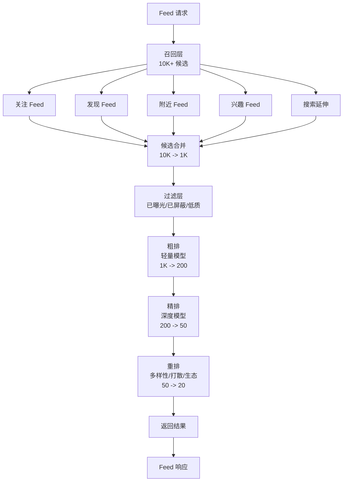
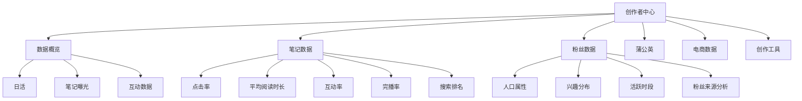

# 02 小红书内容社区与 UGC

## 2.1 UGC 内容全景

小红书是中国最具代表性的 UGC (User Generated Content) 内容社区，日均笔记发布量超过 300 万，内容形态从单一的图文笔记，已经演化为"图文 + 图文多图 + 短视频 + 直播 + 短故事"的全形态矩阵。

### 2.1.1 内容形态分类

| 形态 | 比例 | 特点 | 主要场景 |
|------|------|------|---------|
| 图文笔记 | 60%+ | 多图 + 文字，承载深度内容 | 美妆教程、测评攻略、生活记录 |
| 短视频 | 25%+ | 竖屏 15-60 秒，强沉浸 | 美食制作、开箱、vlog |
| 直播 | 5% | 实时互动，强转化 | 买手带货、达人分享 |
| 图文 + 视频混合 | 10%+ | 一次发布多种形态 | 高质量创作者 |

### 2.1.2 内容数据模型

```sql
-- 笔记主表（简化）
CREATE TABLE note (
    note_id BIGINT UNSIGNED PRIMARY KEY,         -- 笔记 ID (Snowflake)
    user_id BIGINT UNSIGNED NOT NULL,            -- 作者 ID
    note_type TINYINT NOT NULL,                  -- 1:图文 2:视频 3:直播 4:图文+视频
    title VARCHAR(255),
    summary VARCHAR(500),                        -- 摘要（自动生成）
    content MEDIUMTEXT,                          -- 文字内容（最长 10000 字）
    cover_url VARCHAR(512),                      -- 封面图
    image_count TINYINT,                         -- 图片数量（图文笔记）
    video_url VARCHAR(512),                      -- 视频 URL
    video_duration INT,                          -- 视频时长（秒）
    
    -- 状态
    status TINYINT NOT NULL DEFAULT 0,           -- 0:草稿 1:审核中 2:已发布 3:隐藏 4:删除
    
    -- 内容标签
    category_l1 VARCHAR(32),                     -- 一级类目
    category_l2 VARCHAR(32),                     -- 二级类目
    category_l3 VARCHAR(32),                     -- 三级类目
    tags JSON,                                   -- 用户自定义标签
    
    -- 地点
    location_id BIGINT,                          -- 地点 ID
    city VARCHAR(64),
    
    -- 互动数据 (冗余字段，定期刷新)
    view_count BIGINT DEFAULT 0,
    like_count BIGINT DEFAULT 0,
    collect_count BIGINT DEFAULT 0,
    comment_count BIGINT DEFAULT 0,
    share_count BIGINT DEFAULT 0,
    
    -- 时间
    created_at TIMESTAMP NOT NULL,
    updated_at TIMESTAMP NOT NULL DEFAULT CURRENT_TIMESTAMP ON UPDATE CURRENT_TIMESTAMP,
    published_at TIMESTAMP NULL,                -- 发布时间
    
    KEY idx_user_published (user_id, published_at DESC),
    KEY idx_status_published (status, published_at DESC),
    KEY idx_category_published (category_l1, category_l2, published_at DESC)
) ENGINE=InnoDB;

-- 笔记图片表（支持多图）
CREATE TABLE note_image (
    image_id BIGINT UNSIGNED PRIMARY KEY,
    note_id BIGINT UNSIGNED NOT NULL,
    image_url VARCHAR(512) NOT NULL,
    width INT,
    height INT,
    sort_order TINYINT,                          -- 图片顺序
    ocr_text TEXT,                               -- OCR 识别结果
    image_hash VARCHAR(64),                       -- 感知哈希（用于去重）
    KEY idx_note (note_id)
) ENGINE=InnoDB;

-- 笔记视频表
CREATE TABLE note_video (
    video_id BIGINT UNSIGNED PRIMARY KEY,
    note_id BIGINT UNSIGNED NOT NULL,
    video_url VARCHAR(512),
    hls_url VARCHAR(512),                         -- HLS 切片地址
    dash_url VARCHAR(512),                        -- DASH 切片地址
    cover_url VARCHAR(512),
    duration INT,                                -- 时长
    width INT,
    height INT,
    bitrate INT,
    size_bytes BIGINT,
    transcoded_status TINYINT,                   -- 转码状态
    transcoded_urls JSON,                        -- 多清晰度版本
    KEY idx_note (note_id)
) ENGINE=InnoDB;
```

## 2.2 内容创作工具

小红书投入巨大资源打造创作者工具，目标"让创作者专注于内容本身"。

### 2.2.1 创作工具矩阵

```
┌─────────────────────────────────────────────────────┐
│                 创作工具矩阵                          │
├─────────────────────────────────────────────────────┤
│                                                      │
│   ┌─────────┐   ┌─────────┐   ┌─────────┐         │
│   │ 文字编辑 │   │ 图片编辑 │   │ 视频编辑 │         │
│   │ 富文本   │ → │ 滤镜贴纸 │ → │ 剪辑转场 │         │
│   │ AI 排版  │   │ AI 修图  │   │ AI 字幕  │         │
│   └─────────┘   └─────────┘   └─────────┘         │
│        ↓             ↓              ↓               │
│        └─────────────┴──────────────┘               │
│                      ↓                               │
│              ┌──────────────┐                       │
│              │  模板中心    │                       │
│              │  AI 生成器   │                       │
│              └──────────────┘                       │
│                      ↓                               │
│              ┌──────────────┐                       │
│              │  智能封面    │                       │
│              │  标签推荐    │                       │
│              │  SEO 优化    │                       │
│              └──────────────┘                       │
│                      ↓                               │
│                  发布 → 审核 → 推荐                  │
└─────────────────────────────────────────────────────┘
```

### 2.2.2 图片处理流水线

```python
# 小红书图片处理流水线（基于内部公开演讲整理）
class ImageProcessingPipeline:
    
    def __init__(self):
        self.oss_client = OSSClient()
        self.image_ai = ImageAIService()
        self.cdn_purger = CDNPurger()
    
    def process(self, raw_image_url, user_id):
        """完整图片处理流程"""
        
        # 1. 原始图下载
        raw_image = self.download(raw_image_url)
        
        # 2. 内容审核（多模态）
        audit_result = self.image_ai.audit(raw_image)
        if not audit_result.is_safe:
            raise AuditException(audit_result.reason)
        
        # 3. EXIF 信息清除（隐私保护）
        clean_image = self.strip_exif(raw_image)
        
        # 4. 智能裁剪（基于美学模型）
        aesthetic_score = self.image_ai.predict_aesthetic(clean_image)
        cropped_image = self.smart_crop(clean_image, aesthetic_score)
        
        # 5. 多尺寸生成
        sizes = [
            ('origin', 0),       # 原图
            ('large', 1080),     # 大图
            ('medium', 720),     # 中图
            ('small', 480),      # 小图
            ('thumb', 240),      # 缩略图
        ]
        
        urls = {}
        for size_name, width in sizes:
            url = self.upload_to_oss(cropped_image, user_id, size_name)
            urls[size_name] = url
        
        # 6. 图像特征提取（用于去重 + 召回）
        image_embedding = self.image_ai.extract_embedding(clean_image)
        self.save_embedding(user_id, image_embedding)
        
        # 7. OCR 识别（用于搜索 + 风控）
        ocr_text = self.image_ai.ocr(clean_image)
        self.save_ocr(user_id, ocr_text)
        
        # 8. 标签预测
        tags = self.image_ai.predict_tags(clean_image)
        
        # 9. 感知哈希（用于去重）
        phash = self.image_ai.phash(clean_image)
        
        return {
            'urls': urls,
            'embedding': image_embedding,
            'ocr': ocr_text,
            'tags': tags,
            'phash': phash,
            'aesthetic_score': aesthetic_score
        }
    
    def smart_crop(self, image, aesthetic_score):
        """智能裁剪：保留构图关键区域"""
        # 通过显著性检测模型找到主体区域
        saliency_map = self.image_ai.saliency(image)
        
        # 根据显著性图选择最佳裁剪框
        # 优先保证 4:3、3:4、1:1 等小红书常用比例
        best_crop = self.select_best_crop(image, saliency_map, ratios=[
            (3, 4),   # 竖图，封面图常用
            (1, 1),   # 方图
            (4, 3),   # 横图
        ])
        
        return best_crop
```

### 2.2.3 视频处理流水线

视频处理比图片复杂得多，涉及转码、抽帧、封面、字幕、ASR、CV 分析等：

```python
class VideoProcessingPipeline:
    
    def __init__(self):
        self.ffmpeg = FFmpegService()
        self.video_ai = VideoAIService()
        self.oss_client = OSSClient()
    
    def process(self, raw_video_url, user_id):
        """完整视频处理流程"""
        
        # 1. 视频下载
        raw_video = self.download(raw_video_url)
        
        # 2. 预处理：格式校验、时长限制、文件大小
        self.validate(raw_video, max_duration=300, max_size=500*1024*1024)
        
        # 3. 转码：H.264/H.265，多清晰度
        transcoded_versions = self.ffmpeg.transcode(
            raw_video,
            profiles=[
                {'name': '1080p', 'bitrate': 3000, 'codec': 'h264'},
                {'name': '720p', 'bitrate': 1500, 'codec': 'h264'},
                {'name': '480p', 'bitrate': 800, 'codec': 'h264'},
                {'name': '360p', 'bitrate': 400, 'codec': 'h264'},
            ]
        )
        
        # 4. 切片：HLS + DASH
        hls_url = self.ffmpeg.hls_slice(raw_video)
        dash_url = self.ffmpeg.dash_slice(raw_video)
        
        # 5. 抽帧 + 封面选择
        frames = self.ffmpeg.extract_frames(raw_video, interval=1)
        cover_url = self.select_best_cover(frames)
        
        # 6. 内容审核（关键帧 + 全帧）
        audit_result = self.video_ai.audit(raw_video, frames)
        if not audit_result.is_safe:
            raise AuditException(audit_result.reason)
        
        # 7. ASR 字幕生成
        audio = self.ffmpeg.extract_audio(raw_video)
        asr_result = self.video_ai.asr(audio)
        
        # 8. 视频特征
        video_embedding = self.video_ai.extract_embedding(raw_video)
        
        # 9. 物体识别 + 场景分类
        objects = self.video_ai.detect_objects(frames)
        scenes = self.video_ai.classify_scenes(frames)
        
        # 10. 标签预测 + SEO 优化
        tags = self.video_ai.predict_tags(
            text=asr_result.text,
            audio_features=audio.features,
            visual_features=video_embedding
        )
        
        return {
            'transcoded_urls': transcoded_versions,
            'hls_url': hls_url,
            'dash_url': dash_url,
            'cover_url': cover_url,
            'asr_text': asr_result.text,
            'asr_segments': asr_result.segments,
            'embedding': video_embedding,
            'objects': objects,
            'scenes': scenes,
            'tags': tags
        }
    
    def select_best_cover(self, frames):
        """智能选封面：基于美学模型 + 人脸检测"""
        scored_frames = []
        for i, frame in enumerate(frames):
            # 美学分数
            aesthetic_score = self.video_ai.aesthetic(frame)
            # 人脸检测（优先有清晰人脸的）
            face_score = self.video_ai.face_quality(frame)
            # 内容相关性
            content_score = self.video_ai.content_relevance(frame)
            
            total = aesthetic_score * 0.4 + face_score * 0.4 + content_score * 0.2
            scored_frames.append((i, frame, total))
        
        # 选 top 3 候选封面
        scored_frames.sort(key=lambda x: x[2], reverse=True)
        candidates = scored_frames[:3]
        
        return candidates[0][1]
```

## 2.3 双列 Feed 与单列沉浸

小红书的 Feed 流有两种形态，是国内内容社区的经典设计：

### 2.3.1 双列 vs 单列对比

| 维度 | 双列 Feed (Discover) | 单列沉浸 (Recommend) |
|------|---------------------|---------------------|
| 视觉 | 2 列瀑布流，每条笔记预览 | 全屏单条，沉浸式 |
| 信息密度 | 高，每屏 6-9 条 | 低，每屏 1 条 |
| 适用场景 | 浏览、种草、找灵感 | 深度消费、娱乐 |
| 转化路径 | 点击 → 详情 → 行动 | 滑动 → 触发下一步 |
| 创作者压力 | 封面党，标题党 | 内容本身要吸引人 |
| 算法要求 | 多样性 + 探索 | 相关性 + 完播 |
| 商业化 | 信息流广告 (原生) | 全屏视频广告 |

### 2.3.2 Feed 排序架构



### 2.3.3 推荐特征工程

小红书推荐系统的特征体系非常庞大，覆盖用户、内容、上下文、统计四大类：

```python
class FeatureEngineer:
    """小红书推荐特征工程（简化）"""
    
    def extract_user_features(self, user_id):
        """用户特征"""
        return {
            # 人口属性
            'age_bucket': '25-30',
            'gender': 'female',
            'city_tier': 'tier_1',
            
            # 设备属性
            'device_brand': 'iPhone',
            'os': 'iOS',
            'network': 'WiFi',
            
            # 长期兴趣（一级类目偏好）
            'interest_l1': {
                'beauty': 0.85,
                'fashion': 0.72,
                'food': 0.65,
                'travel': 0.45,
                'tech': 0.30,
            },
            
            # 短期兴趣（最近 7 天行为）
            'interest_7d': {
                'lipstick': 0.92,
                'korean_style': 0.78,
                'shanghai_food': 0.65,
            },
            
            # 行为统计
            'click_count_7d': 156,
            'like_count_7d': 42,
            'collect_count_7d': 28,
            'comment_count_7d': 5,
            'share_count_7d': 3,
            'purchase_count_30d': 4,
            
            # 活跃度
            'active_days_7d': 6,
            'avg_session_duration': 28 * 60,  # 28 分钟
            'last_active_at': '2026-06-19 14:30:00',
            
            # 用户价值分层
            'user_segment': 'high_value',
            'lifecycle_stage': 'mature',
        }
    
    def extract_content_features(self, note):
        """内容特征"""
        return {
            # 基础特征
            'note_id': note.note_id,
            'note_type': note.note_type,
            'title': note.title,
            'category_l1': note.category_l1,
            'tags': note.tags,
            
            # 创作者特征
            'author_id': note.user_id,
            'author_follower_count': 50000,
            'author_avg_interaction_rate': 0.08,
            'author_quality_score': 0.92,
            
            # 内容质量分
            'quality_score': 0.88,
            'aesthetic_score': 0.85,
            'originality_score': 0.90,  # 原创度
            'completeness_score': 0.82,
            
            # 统计特征
            'ctr_7d': 0.15,
            'like_rate_7d': 0.06,
            'collect_rate_7d': 0.04,
            'comment_rate_7d': 0.01,
            'share_rate_7d': 0.005,
            'avg_read_time_7d': 32.5,  # 秒
            'completion_rate_7d': 0.62,
            
            # Embedding 特征
            'text_embedding': [0.12, 0.34, ...],  # 768 维
            'image_embedding': [0.23, 0.45, ...],  # 512 维
            'multimodal_embedding': [0.34, 0.56, ...],  # 1024 维
            
            # 文本特征
            'text_length': 256,
            'sentiment_score': 0.75,  # 情感倾向
            'topic_distribution': [...],  # 主题分布
        }
    
    def extract_context_features(self, request):
        """上下文特征"""
        return {
            'time_of_day': 'afternoon',
            'day_of_week': 'friday',
            'is_holiday': False,
            'weather': 'sunny',
            'location': 'shanghai_pudong',
            'request_id': request.request_id,
            'ab_test_bucket': 'treatment_a',
        }
```

### 2.3.4 多目标排序模型

小红书的排序是典型的多目标学习（MTL），需要同时优化点击、点赞、收藏、评论、分享、完播等多个目标：

```python
import torch
import torch.nn as nn

class MultiTaskRanker(nn.Module):
    """小红书多目标精排模型（简化版）"""
    
    def __init__(self, feature_dim=1024, hidden_dim=256):
        super().__init__()
        
        # 共享底层
        self.shared_bottom = nn.Sequential(
            nn.Linear(feature_dim, hidden_dim),
            nn.ReLU(),
            nn.Dropout(0.2),
            nn.Linear(hidden_dim, hidden_dim // 2),
            nn.ReLU(),
        )
        
        # 多任务塔
        self.click_tower = nn.Sequential(
            nn.Linear(hidden_dim // 2, 64),
            nn.ReLU(),
            nn.Linear(64, 1),
            nn.Sigmoid()
        )
        
        self.like_tower = nn.Sequential(
            nn.Linear(hidden_dim // 2, 64),
            nn.ReLU(),
            nn.Linear(64, 1),
            nn.Sigmoid()
        )
        
        self.collect_tower = nn.Sequential(
            nn.Linear(hidden_dim // 2, 64),
            nn.ReLU(),
            nn.Linear(64, 1),
            nn.Sigmoid()
        )
        
        self.comment_tower = nn.Sequential(
            nn.Linear(hidden_dim // 2, 64),
            nn.ReLU(),
            nn.Linear(64, 1),
            nn.Sigmoid()
        )
        
        self.share_tower = nn.Sequential(
            nn.Linear(hidden_dim // 2, 64),
            nn.ReLU(),
            nn.Linear(64, 1),
            nn.Sigmoid()
        )
        
        # MMoE 多门控混合专家
        self.experts = nn.ModuleList([
            nn.Linear(hidden_dim // 2, 64) for _ in range(8)
        ])
        
        self.gates = nn.ModuleList([
            nn.Linear(hidden_dim // 2, 8) for _ in range(5)  # 5 个任务
        ])
    
    def forward(self, features):
        """前向传播"""
        # 共享层
        shared = self.shared_bottom(features)
        
        # MMoE 层（每个任务选择不同专家组合）
        tower_inputs = []
        for gate in self.gates:
            gate_weights = torch.softmax(gate(shared), dim=-1)
            expert_outputs = [e(shared) for e in self.experts]
            tower_input = sum(w * e for w, e in zip(gate_weights, expert_outputs))
            tower_inputs.append(tower_input)
        
        # 各任务预测
        click_pred = self.click_tower(tower_inputs[0])
        like_pred = self.like_tower(tower_inputs[1])
        collect_pred = self.collect_tower(tower_inputs[2])
        comment_pred = self.comment_tower(tower_inputs[3])
        share_pred = self.share_tower(tower_inputs[4])
        
        # 目标融合：加权求和
        # 点击：0.1, 点赞：0.2, 收藏：0.35, 评论：0.15, 分享：0.2
        final_score = (
            0.10 * click_pred +
            0.20 * like_pred +
            0.35 * collect_pred +
            0.15 * comment_pred +
            0.20 * share_pred
        )
        
        return {
            'click': click_pred,
            'like': like_pred,
            'collect': collect_pred,
            'comment': comment_pred,
            'share': share_pred,
            'final': final_score
        }


class ESMMModel(nn.Module):
    """ESMM（Entire Space Multi-task Model）模型"""
    
    def __init__(self, feature_dim):
        super().__init__()
        
        # CTR 子网络
        self.ctr_net = nn.Sequential(
            nn.Linear(feature_dim, 256),
            nn.ReLU(),
            nn.Linear(256, 64),
            nn.ReLU(),
            nn.Linear(64, 1),
            nn.Sigmoid()
        )
        
        # CVR 子网络（在曝光空间训练）
        self.cvr_net = nn.Sequential(
            nn.Linear(feature_dim, 256),
            nn.ReLU(),
            nn.Linear(256, 64),
            nn.ReLU(),
            nn.Linear(64, 1),
            nn.Sigmoid()
        )
    
    def forward(self, features):
        ctr = self.ctr_net(features)
        cvr = self.cvr_net(features)
        
        # CTCVR = CTR * CVR
        ctcvr = ctr * cvr
        
        return {
            'ctr': ctr,
            'cvr': cvr,
            'ctcvr': ctcvr
        }
```

## 2.4 内容审核体系

小红书对内容审核的重视程度极高，建立了"机审 + 人审 + 复审 + 申诉"四道防线。

### 2.4.1 审核分层架构

```
┌────────────────────────────────────────────────────────┐
│                  内容审核四道防线                        │
├────────────────────────────────────────────────────────┤
│                                                        │
│  ┌──────────────────────────────────────────┐         │
│  │ 第一道：机审（毫秒级）                    │         │
│  │  - 文本审核（敏感词 + AI 分类）           │         │
│  │  - 图像审核（黄色 + 暴力 + 广告）        │         │
│  │  - 视频审核（抽帧 + ASR + 多模态）        │         │
│  │  拦截：99.5% 的明确违规                   │         │
│  └──────────────────────────────────────────┘         │
│                       ↓                                │
│  ┌──────────────────────────────────────────┐         │
│  │ 第二道：人审（秒级）                      │         │
│  │  - 机审不通过 → 进入人审队列              │         │
│  │  - 优先：政治敏感、医疗健康、金融           │         │
│  │  - 次优先：低俗、虚假宣传                 │         │
│  └──────────────────────────────────────────┘         │
│                       ↓                                │
│  ┌──────────────────────────────────────────┐         │
│  │ 第三道：复审（小时级）                    │         │
│  │  - 随机抽检                               │         │
│  │  - 用户举报复核                           │         │
│  │  - 申诉处理                               │         │
│  └──────────────────────────────────────────┘         │
│                       ↓                                │
│  ┌──────────────────────────────────────────┐         │
│  │ 第四道：申诉（天级）                      │         │
│  │  - 用户对审核结果不服可申诉                │         │
│  │  - 客服 + 审核员二次确认                   │         │
│  │  - 高优先级：内容创作者保护               │         │
│  └──────────────────────────────────────────┘         │
│                                                        │
└────────────────────────────────────────────────────────┘
```

### 2.4.2 文本审核模型

```python
class TextAuditService:
    """文本审核服务"""
    
    def __init__(self):
        self.sensitive_words = Trie()  # 敏感词 Trie 树
        self.load_sensitive_words('/data/sensitive_words.txt')
        
        self.text_classifier = BertClassifier(
            model_path='/models/text_audit_v3.onnx',
            num_classes=20  # 20 个违规类型
        )
    
    def audit(self, text, user_id=None):
        """文本审核主流程"""
        result = {
            'is_safe': True,
            'risk_level': 0,  # 0-100
            'violation_types': [],
            'sensitive_words': [],
            'need_manual_review': False
        }
        
        # 1. 敏感词匹配（DFA 算法）
        matched_words = self.match_sensitive_words(text)
        if matched_words:
            result['sensitive_words'] = matched_words
            result['risk_level'] = max(result['risk_level'], 80)
            result['violation_types'].append('sensitive_word')
            result['is_safe'] = False
        
        # 2. AI 分类（细粒度违规识别）
        classifications = self.text_classifier.predict(text)
        # 返回 20 个类别的概率
        for cls, prob in classifications.items():
            if prob > 0.7:
                result['violation_types'].append(cls)
                result['risk_level'] = max(result['risk_level'], int(prob * 100))
                if cls in ['politics', 'porn', 'violence', 'fraud']:
                    result['is_safe'] = False
        
        # 3. 用户历史行为关联
        if user_id:
            user_history = self.get_user_history(user_id)
            if user_history.violation_count_30d > 5:
                result['risk_level'] = min(100, result['risk_level'] + 20)
                result['need_manual_review'] = True
        
        # 4. 决策
        if result['risk_level'] >= 90:
            result['action'] = 'reject'  # 直接拒绝
        elif result['risk_level'] >= 70:
            result['action'] = 'manual_review'  # 人工复审
        elif result['risk_level'] >= 50:
            result['action'] = 'limit_reach'  # 限流
        else:
            result['action'] = 'pass'  # 通过
        
        return result
    
    def match_sensitive_words(self, text):
        """敏感词匹配：基于 AC 自动机"""
        # 实际使用 AC 自动机或 Double-Array Trie
        # 这里返回伪代码
        return []
```

### 2.4.3 图像审核模型

```python
class ImageAuditService:
    """图像审核服务"""
    
    def __init__(self):
        # 多模态大模型（基于 BLIP-2 + Qwen-VL 改造）
        self.multimodal_audit_model = MultimodalAuditModel()
        
        # 黄色识别（专用模型）
        self.porn_model = PornClassifier()
        
        # 暴力识别（专用模型）
        self.violence_model = ViolenceClassifier()
        
        # OCR 识别（用于文字水印、违规文字）
        self.ocr_service = OCRService()
    
    def audit(self, image_url):
        """图像审核主流程"""
        result = {
            'is_safe': True,
            'risk_level': 0,
            'violation_types': []
        }
        
        # 1. 多模态大模型审核
        mm_result = self.multimodal_audit_model.predict(
            image_url,
            prompt="""请检查这张图片是否包含以下违规内容：
1. 色情低俗
2. 暴力血腥
3. 政治敏感
4. 虚假广告
5. 医疗夸大宣传
6. 违规标识（联系方式、二维码）
"""
        )
        if mm_result.is_violation:
            result['violation_types'].append(mm_result.violation_type)
            result['risk_level'] = max(result['risk_level'], mm_result.confidence * 100)
        
        # 2. 专用模型兜底
        porn_score = self.porn_model.predict(image_url)
        if porn_score > 0.8:
            result['violation_types'].append('porn')
            result['risk_level'] = max(result['risk_level'], porn_score * 100)
        
        violence_score = self.violence_model.predict(image_url)
        if violence_score > 0.8:
            result['violation_types'].append('violence')
            result['risk_level'] = max(result['risk_level'], violence_score * 100)
        
        # 3. OCR 检测联系方式、二维码
        ocr_text = self.ocr_service.recognize(image_url)
        if self.has_contact_info(ocr_text):
            result['violation_types'].append('contact_info')
            result['risk_level'] = max(result['risk_level'], 90)
        
        # 4. 决策
        if result['risk_level'] >= 80:
            result['action'] = 'reject'
            result['is_safe'] = False
        elif result['risk_level'] >= 50:
            result['action'] = 'manual_review'
        else:
            result['action'] = 'pass'
        
        return result
    
    def has_contact_info(self, text):
        """检测联系方式"""
        patterns = [
            r'1[3-9]\d{9}',  # 手机号
            r'微[信号]：?\w+',  # 微信号
            r'加[我Vv][：:]?\w+',  # 加我 V
            r'[a-zA-Z0-9._%+-]+@[a-zA-Z0-9.-]+\.[a-zA-Z]{2,}',  # 邮箱
        ]
        for pattern in patterns:
            if re.search(pattern, text):
                return True
        return False
```

## 2.5 社区氛围管控

小红书的"真实、分享"的社区氛围是核心壁垒，氛围管控涉及多个方面。

### 2.5.1 水军识别

```python
class FakeUserDetector:
    """水军识别模型"""
    
    def __init__(self):
        self.behavior_model = XGBoostModel()
        self.graph_model = GraphSAGE()
        self.text_model = BertFakeContentDetector()
    
    def detect(self, user_id):
        """综合识别水军"""
        scores = {}
        
        # 1. 行为特征
        behavior = self.get_user_behavior(user_id)
        behavior_score = self.behavior_model.predict(behavior)
        scores['behavior'] = behavior_score
        
        # 2. 关系图特征
        graph_features = self.extract_graph_features(user_id)
        graph_score = self.graph_model.predict(graph_features)
        scores['graph'] = graph_score
        
        # 3. 内容特征
        user_notes = self.get_user_notes(user_id, limit=20)
        text_score = self.text_model.predict_batch(user_notes)
        scores['text'] = text_score
        
        # 4. 综合打分
        final_score = (
            0.4 * behavior_score +
            0.3 * graph_score +
            0.3 * text_score
        )
        
        # 5. 决策
        if final_score > 0.85:
            action = 'ban'  # 封号
        elif final_score > 0.7:
            action = 'limit'  # 限流
        elif final_score > 0.5:
            action = 'observe'  # 观察
        else:
            action = 'normal'
        
        return {
            'user_id': user_id,
            'fake_probability': final_score,
            'scores': scores,
            'action': action
        }
    
    def get_user_behavior(self, user_id):
        """用户行为特征"""
        return {
            'register_days': self.get_register_days(user_id),
            'follow_count': self.get_follow_count(user_id),
            'follower_count': self.get_follower_count(user_id),
            'note_count': self.get_note_count(user_id),
            'avg_note_length': self.get_avg_note_length(user_id),
            'active_hours_entropy': self.get_active_hours_entropy(user_id),
            'avg_daily_actions': self.get_avg_daily_actions(user_id),
            'like_to_view_ratio': self.get_like_to_view_ratio(user_id),
            'comment_avg_length': self.get_comment_avg_length(user_id),
            'device_count': self.get_device_count(user_id),
            'ip_count': self.get_ip_count(user_id),
            'phone_change_count': self.get_phone_change_count(user_id),
        }
```

### 2.5.2 敏感词库建设

```python
class SensitiveWordService:
    """敏感词服务：覆盖政治、低俗、虚假宣传、医疗、金融等"""
    
    def __init__(self):
        # 分级管理
        self.level_1_words = Trie()  # 极高敏感（政治、邪教）
        self.level_2_words = Trie()  # 高敏感（色情、暴力）
        self.level_3_words = Trie()  # 中敏感（虚假宣传）
        self.level_4_words = Trie()  # 低敏感（不当用语）
        
        # 变体识别
        self.variant_detector = VariantDetector()
        
        # 上下文判断
        self.context_analyzer = ContextAnalyzer()
    
    def check(self, text):
        """敏感词检测"""
        # 1. 精确匹配
        direct_match = self.direct_match(text)
        
        # 2. 变体匹配（谐音、拆字、表情替代）
        variant_match = self.variant_detector.detect(text)
        
        # 3. 语义匹配（基于 BERT）
        semantic_match = self.context_analyzer.detect(text)
        
        # 4. 综合判断
        return {
            'has_sensitive': bool(direct_match or variant_match or semantic_match),
            'matches': {
                'direct': direct_match,
                'variant': variant_match,
                'semantic': semantic_match,
            }
        }
    
    def variant_detector(self, text):
        """变体识别"""
        # 处理谐音：徽信 → 微信
        # 处理拆字：微→讠十
        # 处理表情替代：加v → 加[拳头]
        # 处理拼音：vxin → 微信
        pass
```

### 2.5.3 笔记去重

```python
class NoteDeduplication:
    """笔记去重：防止搬运、抄袭"""
    
    def __init__(self):
        # 感知哈希（图像去重）
        self.phash_index = FAISS(dim=64, index_type='HNSW')
        
        # 文本 MinHash（文本去重）
        self.minhash_index = MinHashLSH(threshold=0.7, num_perm=128)
        
        # 多模态 embedding
        self.multimodal_index = FAISS(dim=1024, index_type='HNSW')
    
    def check_duplicate(self, note):
        """检查是否重复"""
        results = {}
        
        # 1. 图像去重
        if note.image_urls:
            image_phashes = [self.compute_phash(url) for url in note.image_urls]
            for phash in image_phashes:
                similar = self.phash_index.search(phash, k=10)
                if any(s.distance < 5 for s in similar):
                    results['image_duplicate'] = True
                    results['duplicate_image_id'] = similar[0].id
        
        # 2. 文本去重
        text_minhash = self.compute_minhash(note.content)
        similar_texts = self.minhash_index.query(text_minhash)
        if any(s.similarity > 0.7 for s in similar_texts):
            results['text_duplicate'] = True
            results['duplicate_text_id'] = similar_texts[0].id
        
        # 3. 多模态综合去重
        mm_embedding = self.compute_multimodal_embedding(note)
        similar_mm = self.multimodal_index.search(mm_embedding, k=10)
        if any(s.distance < 0.3 for s in similar_mm):
            results['multimodal_duplicate'] = True
            results['duplicate_note_id'] = similar_mm[0].id
        
        return results
```

## 2.6 标签体系

小红书建立了精细的标签体系，是 SEO 和推荐的基础设施。

### 2.6.1 标签层级

```
┌────────────────────────────────────────────────────────┐
│                    小红书标签体系                        │
├────────────────────────────────────────────────────────┤
│                                                        │
│  一级类目 (60+)                                        │
│  ├── 美妆                                              │
│  │   ├── 二级类目 (1000+)                              │
│  │   │   ├── 护肤                                      │
│  │   │   │   ├── 三级类目 (50000+)                    │
│  │   │   │   │   ├── 洁面                              │
│  │   │   │   │   ├── 化妆水                            │
│  │   │   │   │   ├── 精华                              │
│  │   │   │   │   ├── 面霜                              │
│  │   │   │   │   └── 面膜                              │
│  │   │   │   ├── 彩妆                                  │
│  │   │   │   │   ├── 口红                              │
│  │   │   │   │   ├── 粉底                              │
│  │   │   │   │   ├── 眼影                              │
│  │   │   │   │   └── 腮红                              │
│  │   │   │   └── 美甲                                  │
│  │   ├── 时尚                                            │
│  │   ├── 美食                                            │
│  │   └── 家居                                            │
│  └── ...                                                │
└────────────────────────────────────────────────────────┘
```

### 2.6.2 标签推荐

```python
class TagRecommendation:
    """标签推荐：基于内容理解 + 用户行为"""
    
    def recommend_tags(self, note):
        """推荐标签"""
        candidates = []
        
        # 1. 基于文本内容
        text_tags = self.extract_tags_from_text(note.title + note.content)
        candidates.extend(text_tags)
        
        # 2. 基于图像内容
        if note.image_urls:
            image_tags = self.extract_tags_from_images(note.image_urls)
            candidates.extend(image_tags)
        
        # 3. 基于相似笔记的标签（协同）
        similar_notes = self.find_similar_notes(note)
        for similar in similar_notes[:20]:
            candidates.extend(similar.tags)
        
        # 4. 基于热点榜单
        hot_tags = self.get_hot_tags(category=note.category_l1)
        candidates.extend(hot_tags)
        
        # 5. 去重 + 排序
        tag_scores = Counter()
        for tag in candidates:
            tag_scores[tag] += 1
        
        # 取 top 10
        top_tags = tag_scores.most_common(10)
        
        return [tag for tag, _ in top_tags]
```

## 2.7 数据看板

小红书为创作者提供了完善的数据看板，包括笔记表现、粉丝画像、商业合作等。

### 2.7.1 创作者中心



## 2.8 小结

小红书 UGC 体系是其最核心的壁垒：

1. **创作工具完善**：从图片处理到视频剪辑，降低创作门槛
2. **双 Feed 形态**：双列瀑布流 + 单列沉浸，覆盖不同消费场景
3. **多目标推荐**：点击、点赞、收藏、评论、分享、完播等多任务联合优化
4. **审核四道防线**：机审 + 人审 + 复审 + 申诉
5. **社区氛围管控**：水军识别、敏感词、笔记去重
6. **精细标签体系**：60+ 一级、1000+ 二级、50000+ 三级类目

对自身业务的启示：

- **TikTok Shop**：双 Feed 设计、UGC 创作工具、精细标签
- **AI 直播**：内容审核流水线、AI 数字人多模态审核
- **跨境电商**：社区氛围管控（特别是本地化合规）