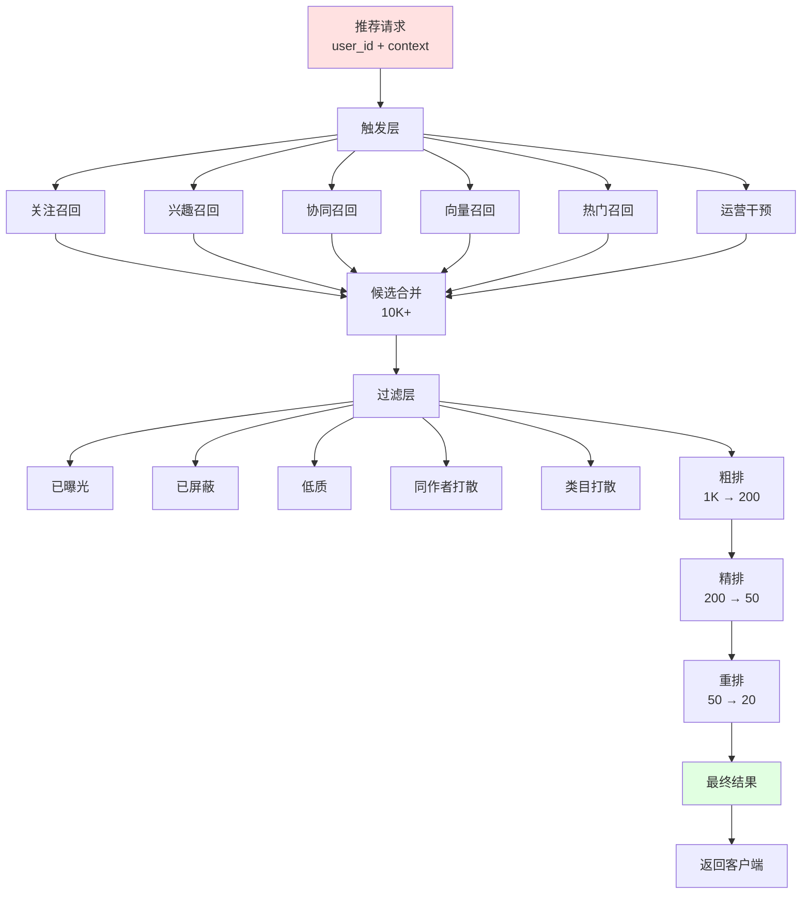
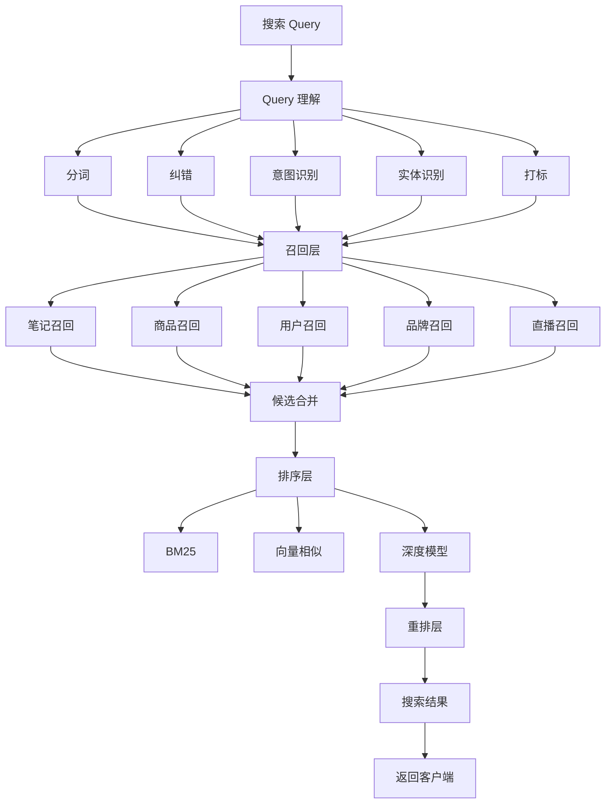
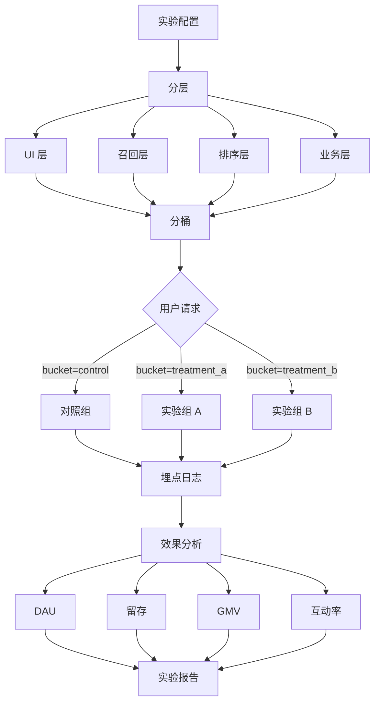
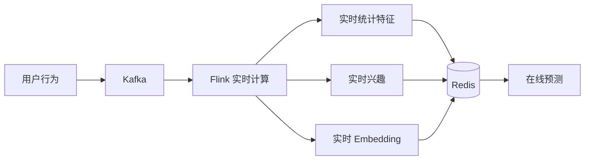

# 03 小红书推荐系统与搜索

## 3.1 推荐系统总览

小红书推荐系统是支撑"种草"业务的核心引擎，承担了从内容生产到消费分发的关键链路。日均处理百亿次推荐请求，撮合亿级用户与亿级笔记的精准匹配。

### 3.1.1 推荐系统演进

```
┌────────────────────────────────────────────────────────┐
│               小红书推荐系统演进                         │
├────────────────────────────────────────────────────────┤
│                                                        │
│  V1 (2014-2016): 协同过滤时代                          │
│  ├── 基于物品的协同过滤 (Item-CF)                     │
│  ├── 基于用户的协同过滤 (User-CF)                     │
│  └── 简单加权和打散                                   │
│                                                        │
│  V2 (2017-2019): 双塔召回 + LR 排序                    │
│  ├── 双塔模型召回（YouTube DNN）                       │
│  ├── 逻辑回归 (LR) 排序                                │
│  ├── GBDT 排序 (XGBoost)                              │
│  └── 多路召回 + 加权融合                                │
│                                                        │
│  V3 (2020-2022): 深度学习排序时代                     │
│  ├── DeepFM / xDeepFM                                │
│  ├── DIN (Deep Interest Network)                      │
│  ├── DIEN (Deep Interest Evolution Network)            │
│  ├── 多目标学习 (MMoE / PLE)                          │
│  └── 序列推荐 (Transformer / SASRec)                  │
│                                                        │
│  V4 (2023-2025): 大模型 + 多模态时代                   │
│  ├── 多模态召回（CLIP 改造）                          │
│  ├── 大模型特征 (LLM Embedding)                        │
│  ├── 长序列建模 (LSTM + Attention)                    │
│  ├── 生成式推荐 (LLM-based Ranking)                   │
│  └── 实时学习 (Online Learning)                       │
│                                                        │
└────────────────────────────────────────────────────────┘
```

### 3.1.2 推荐系统整体架构



## 3.2 召回层

召回是从亿级笔记库中快速找出用户可能感兴趣的千级候选，是推荐系统的"宽口径"。

### 3.2.1 多路召回策略

```python
class RecallService:
    """小红书多路召回服务"""
    
    def __init__(self):
        # 1. 关注召回（基于关注关系）
        self.follow_recall = FollowRecall()
        
        # 2. 兴趣召回（基于类目偏好）
        self.interest_recall = InterestRecall()
        
        # 3. 协同召回（基于 User-CF / Item-CF）
        self.collab_recall = CollaborativeRecall()
        
        # 4. 向量召回（基于双塔模型）
        self.vector_recall = VectorRecall()
        
        # 5. 热门召回（基于热度榜单）
        self.hot_recall = HotRecall()
        
        # 6. 运营召回（活动、置顶）
        self.operation_recall = OperationRecall()
        
        # 7. 地理召回（附近的人/事）
        self.geo_recall = GeoRecall()
    
    def recall(self, user_id, context):
        """多路召回 + 合并"""
        all_candidates = set()
        
        # 关注召回（最高优先级）
        follow_items = self.follow_recall.recall(
            user_id, 
            limit=200
        )
        all_candidates.update(follow_items)
        
        # 兴趣召回（基于用户兴趣画像）
        interest_items = self.interest_recall.recall(
            user_id,
            interest_categories=context['top_interests'],
            limit=500
        )
        all_candidates.update(interest_items)
        
        # 协同召回（基于相似用户行为）
        collab_items = self.collab_recall.recall(
            user_id,
            limit=300
        )
        all_candidates.update(collab_items)
        
        # 向量召回（基于双塔模型）
        vector_items = self.vector_recall.recall(
            user_id,
            limit=500
        )
        all_candidates.update(vector_items)
        
        # 热门召回（兜底）
        hot_items = self.hot_recall.recall(
            category=context.get('preferred_category'),
            limit=100
        )
        all_candidates.update(hot_items)
        
        # 运营干预（活动、置顶）
        op_items = self.operation_recall.recall(
            user_id,
            active_operations=context.get('active_operations', [])
        )
        all_candidates.update(op_items)
        
        return list(all_candidates)
```

### 3.2.2 双塔召回模型

双塔模型是小红书最核心的召回方式之一，通过 User Tower 和 Item Tower 分别产出 embedding，然后在向量空间做最近邻检索。

```python
import torch
import torch.nn as nn

class TwoTowerModel(nn.Module):
    """双塔召回模型"""
    
    def __init__(self, user_feature_dim, item_feature_dim, embedding_dim=128):
        super().__init__()
        
        # User Tower
        self.user_tower = nn.Sequential(
            nn.Linear(user_feature_dim, 512),
            nn.ReLU(),
            nn.BatchNorm1d(512),
            nn.Dropout(0.2),
            nn.Linear(512, 256),
            nn.ReLU(),
            nn.Linear(256, embedding_dim),
            nn.L2Normalization(dim=-1)  # L2 归一化
        )
        
        # Item Tower
        self.item_tower = nn.Sequential(
            nn.Linear(item_feature_dim, 512),
            nn.ReLU(),
            nn.BatchNorm1d(512),
            nn.Dropout(0.2),
            nn.Linear(512, 256),
            nn.ReLU(),
            nn.Linear(256, embedding_dim),
            nn.L2Normalization(dim=-1)
        )
    
    def forward(self, user_features, item_features):
        """前向：分别得到 user 和 item 的 embedding"""
        user_emb = self.user_tower(user_features)
        item_emb = self.item_tower(item_features)
        return user_emb, item_emb
    
    def compute_similarity(self, user_emb, item_emb):
        """计算相似度（点积或余弦）"""
        return torch.matmul(user_emb, item_emb.t())


class TwoTowerTrainer:
    """双塔模型训练器"""
    
    def __init__(self, model):
        self.model = model
        self.optimizer = torch.optim.Adam(model.parameters(), lr=1e-3)
        self.criterion = nn.BCEWithLogitsLoss()
    
    def train_step(self, batch):
        """单步训练"""
        # batch: 用户特征、正样本 item 特征、负样本 item 特征
        user_features = batch['user_features']
        pos_item_features = batch['pos_item_features']
        neg_item_features = batch['neg_item_features']
        
        # 编码
        user_emb, pos_item_emb = self.model(user_features, pos_item_features)
        _, neg_item_emb = self.model(user_features, neg_item_features)
        
        # 正样本得分
        pos_score = torch.sum(user_emb * pos_item_emb, dim=-1)
        
        # 负样本得分（in-batch negatives + 难负样本）
        neg_score = torch.sum(user_emb * neg_item_emb, dim=-1)
        
        # 损失
        labels = torch.cat([
            torch.ones_like(pos_score),
            torch.zeros_like(neg_score)
        ])
        scores = torch.cat([pos_score, neg_score])
        loss = self.criterion(scores, labels)
        
        # 反向传播
        self.optimizer.zero_grad()
        loss.backward()
        self.optimizer.step()
        
        return loss.item()
```

### 3.2.3 向量召回引擎

双塔产出的 embedding 需要高性能的向量检索引擎，小红书自研了基于 Faiss + HNSW 的分布式向量检索系统：

```python
class VectorRetrievalEngine:
    """向量检索引擎"""
    
    def __init__(self):
        # HNSW 索引（高精度）
        self.hnsw_index = hnswlib.Index(
            space='cosine',
            dim=128
        )
        self.hnsw_index.init_index(
            max_elements=10_000_000,  # 1000 万笔记
            ef_construction=200,
            M=16
        )
        
        # 二跳索引（基于用户行为聚类）
        self.cluster_index = ClusterBasedIndex()
    
    def build_index(self, items):
        """构建索引"""
        embeddings = []
        ids = []
        for item in items:
            embedding = self.compute_item_embedding(item)
            embeddings.append(embedding)
            ids.append(item.note_id)
        
        self.hnsw_index.add_items(embeddings, ids)
    
    def search(self, user_embedding, top_k=500, ef=100):
        """向量检索"""
        self.hnsw_index.set_ef(ef)  # ef 越大越精确
        
        labels, distances = self.hnsw_index.knn_query(
            user_embedding,
            k=top_k
        )
        
        return [
            {'note_id': labels[0][i], 'distance': distances[0][i]}
            for i in range(top_k)
        ]
    
    def two_hop_recall(self, user_id, user_embedding):
        """二跳召回：先找相似用户，再找相似用户感兴趣的笔记"""
        
        # 第一跳：找相似用户（基于 User Embedding）
        similar_users = self.user_index.search(user_embedding, k=50)
        
        # 第二跳：找这些相似用户最近喜欢的笔记
        candidate_notes = set()
        for similar_user in similar_users:
            recent_likes = self.get_user_recent_actions(
                similar_user.user_id,
                action_type='like',
                limit=20
            )
            candidate_notes.update([action.note_id for action in recent_likes])
        
        return list(candidate_notes)
```

### 3.2.4 序列召回

序列召回考虑用户的历史行为序列，能更好地捕捉用户兴趣的动态变化：

```python
class SequentialRecall(nn.Module):
    """基于 Transformer 的序列召回模型"""
    
    def __init__(self, vocab_size, embedding_dim=128, num_heads=4, num_layers=2):
        super().__init__()
        
        # Item Embedding
        self.item_embedding = nn.Embedding(vocab_size, embedding_dim)
        self.position_embedding = nn.Embedding(1000, embedding_dim)
        
        # Transformer Encoder
        encoder_layer = nn.TransformerEncoderLayer(
            d_model=embedding_dim,
            nhead=num_heads,
            dim_feedforward=512,
            dropout=0.1,
            batch_first=True
        )
        self.transformer = nn.TransformerEncoder(
            encoder_layer,
            num_layers=num_layers
        )
        
        # 输出
        self.output = nn.Linear(embedding_dim, vocab_size)
    
    def forward(self, item_sequence):
        """输入：用户行为序列（item_id 列表）
        输出：下一个可能交互的 item 概率分布"""
        
        seq_len = item_sequence.size(1)
        positions = torch.arange(seq_len, device=item_sequence.device)
        
        # Embedding
        item_emb = self.item_embedding(item_sequence)
        pos_emb = self.position_embedding(positions)
        
        x = item_emb + pos_emb
        
        # Transformer 编码
        x = self.transformer(x)
        
        # 取最后一个位置作为用户兴趣表示
        user_interest = x[:, -1, :]
        
        # 预测下一个 item
        logits = self.output(user_interest)
        
        return logits
```

## 3.3 排序层

排序层是推荐系统最核心的部分，从千级候选中精排到百级，再重排到最终展示的几十条。

### 3.3.1 粗排

粗排要求"快而准"，通常使用轻量级模型（如双塔 + 点积）：

```python
class CoarseRanker(nn.Module):
    """粗排模型：双塔结构 + 多目标"""
    
    def __init__(self, feature_dim=512, embedding_dim=128):
        super().__init__()
        
        # 共享底层
        self.shared = nn.Sequential(
            nn.Linear(feature_dim, 256),
            nn.ReLU(),
            nn.Linear(256, 128)
        )
        
        # 多目标输出
        self.click_head = nn.Linear(128, 1)
        self.like_head = nn.Linear(128, 1)
        self.collect_head = nn.Linear(128, 1)
    
    def forward(self, features):
        shared = self.shared(features)
        
        click_pred = torch.sigmoid(self.click_head(shared))
        like_pred = torch.sigmoid(self.like_head(shared))
        collect_pred = torch.sigmoid(self.collect_head(shared))
        
        # 加权融合
        final_score = (
            0.2 * click_pred +
            0.3 * like_pred +
            0.5 * collect_pred
        )
        
        return final_score
```

### 3.3.2 精排（多目标学习）

精排使用更复杂的深度模型，并同时优化多个目标。

**DIN (Deep Interest Network)** 是小红书精排的核心模型之一，引入注意力机制来动态建模用户兴趣：

```python
class DINModel(nn.Module):
    """DIN 模型：动态兴趣建模"""
    
    def __init__(self, user_feature_dim, item_feature_dim, 
                 hist_seq_len=50, embedding_dim=64):
        super().__init__()
        
        # Embedding 层
        self.item_embedding = nn.Embedding(item_feature_dim, embedding_dim)
        self.category_embedding = nn.Embedding(1000, embedding_dim)
        
        # 用户特征
        self.user_dense = nn.Linear(user_feature_dim, 64)
        
        # 候选 item
        self.candidate_item_emb = nn.Embedding(item_feature_dim, embedding_dim)
        self.candidate_category_emb = nn.Embedding(1000, embedding_dim)
        
        # 注意力网络
        self.attention = nn.Sequential(
            nn.Linear(4 * embedding_dim, 64),
            nn.ReLU(),
            nn.Linear(64, 32),
            nn.ReLU(),
            nn.Linear(32, 1)
        )
        
        # 输出层
        self.output = nn.Sequential(
            nn.Linear(8 * embedding_dim + 64, 256),
            nn.ReLU(),
            nn.Dropout(0.2),
            nn.Linear(256, 64),
            nn.ReLU(),
            nn.Linear(64, 1),
            nn.Sigmoid()
        )
    
    def forward(self, user_features, hist_items, hist_categories, 
                target_item, target_category):
        """DIN 前向"""
        batch_size = user_features.size(0)
        
        # 用户 dense 特征
        user_dense = self.user_dense(user_features)
        
        # 历史序列 embedding
        hist_item_emb = self.item_embedding(hist_items)  # (B, L, D)
        hist_cat_emb = self.category_embedding(hist_categories)  # (B, L, D)
        hist_combined = torch.cat([hist_item_emb, hist_cat_emb], dim=-1)  # (B, L, 2D)
        
        # 候选 item embedding
        target_item_emb = self.candidate_item_emb(target_item)  # (B, D)
        target_cat_emb = self.candidate_category_emb(target_category)  # (B, D)
        target_combined = torch.cat([target_item_emb, target_cat_emb], dim=-1)  # (B, 2D)
        
        # 注意力：每个历史 item 与候选 item 的相关性
        target_expanded = target_combined.unsqueeze(1).expand(
            -1, hist_combined.size(1), -1
        )  # (B, L, 2D)
        
        # 拼接 [hist, target, hist*target, hist-target]
        att_input = torch.cat([
            hist_combined, target_expanded,
            hist_combined * target_expanded,
            hist_combined - target_expanded
        ], dim=-1)  # (B, L, 8D)
        
        att_scores = self.attention(att_input).squeeze(-1)  # (B, L)
        att_weights = torch.softmax(att_scores, dim=-1)  # (B, L)
        
        # 加权求和得到用户兴趣表示
        user_interest = torch.sum(
            att_weights.unsqueeze(-1) * hist_combined,
            dim=1
        )  # (B, 2D)
        
        # 拼接所有特征
        all_features = torch.cat([
            user_interest, target_combined, user_dense
        ], dim=-1)
        
        # 输出预测
        output = self.output(all_features)
        return output


class DIENModel(nn.Module):
    """DIEN 模型：兴趣进化网络"""
    
    def __init__(self, ...):
        super().__init__()
        # 兴趣抽取层 (GRU)
        self.interest_gru = nn.GRU(...)
        
        # 兴趣进化层 (AUGRU)
        self.evolution_augru = AUGRU(...)
        
        # 注意力
        self.attention = nn.Sequential(...)
        
        # 输出
        self.output = nn.Sequential(...)
    
    def forward(self, hist_items, target_item):
        """DIEN 前向"""
        # 1. 兴趣抽取：GRU 提取每一步的兴趣
        interest_states, _ = self.interest_gru(hist_items)
        
        # 2. 兴趣进化：AUGRU 根据目标 item 进化兴趣
        target_emb = self.embed(target_item)
        att_scores = self.attention(interest_states, target_emb)
        
        evolution_output, _ = self.evolution_augru(
            interest_states, 
            att_scores
        )
        
        # 3. 输出
        output = self.output(evolution_output, target_emb)
        return output
```

### 3.3.3 多任务学习

小红书精排的核心创新之一是多任务学习（Multi-Task Learning, MTL），同时优化点击、点赞、收藏、评论、分享、转化等多个目标。

```python
class PLEModel(nn.Module):
    """PLE (Progressive Layered Extraction) 模型"""
    
    def __init__(self, feature_dim, num_tasks=5, num_experts=8):
        super().__init__()
        
        # 共享专家
        self.shared_experts = nn.ModuleList([
            nn.Sequential(
                nn.Linear(feature_dim, 256),
                nn.ReLU(),
                nn.Linear(256, 64)
            ) for _ in range(num_experts)
        ])
        
        # 任务专属专家
        self.task_experts = nn.ModuleList([
            nn.ModuleList([
                nn.Sequential(
                    nn.Linear(feature_dim, 256),
                    nn.ReLU(),
                    nn.Linear(256, 64)
                ) for _ in range(num_experts)
            ]) for _ in range(num_tasks)
        ])
        
        # 任务门控
        self.task_gates = nn.ModuleList([
            nn.Sequential(
                nn.Linear(feature_dim, num_experts + num_experts),
                nn.Softmax(dim=-1)
            ) for _ in range(num_tasks)
        ])
        
        # 任务塔
        self.task_towers = nn.ModuleList([
            nn.Sequential(
                nn.Linear(64, 32),
                nn.ReLU(),
                nn.Linear(32, 1),
                nn.Sigmoid()
            ) for _ in range(num_tasks)
        ])
    
    def forward(self, features):
        """PLE 前向"""
        task_outputs = []
        
        for task_idx in range(len(self.task_towers)):
            # 共享专家输出
            shared_outputs = [e(features) for e in self.shared_experts]
            
            # 任务专属专家输出
            task_outputs_experts = [
                e(features) for e in self.task_experts[task_idx]
            ]
            
            # 门控融合
            all_experts = shared_outputs + task_outputs_experts
            gate_weights = self.task_gates[task_idx](features)
            
            task_input = sum(
                w * e for w, e in zip(gate_weights, all_experts)
            )
            
            # 任务塔
            task_output = self.task_towers[task_idx](task_input)
            task_outputs.append(task_output)
        
        return task_outputs
```

### 3.3.4 重排（Re-rank）

重排关注的是"用户感知"层面的体验，包括多样性、新鲜度、避免信息茧房等。

```python
class ReRanker:
    """重排服务"""
    
    def rerank(self, candidates, user_id, context):
        """重排主逻辑"""
        ranked = []
        
        # 1. 多样性约束
        # 同类目笔记不能连续出现
        diverse_items = self.diversity_filter(
            candidates,
            max_consecutive_same_category=2
        )
        
        # 2. 创作者打散
        # 同一创作者的笔记不能连续出现
        scattered_items = self.author_scatter(
            diverse_items,
            max_consecutive_same_author=1
        )
        
        # 3. 新鲜度加权
        # 给新发布笔记额外加分
        freshness_boosted = self.freshness_boost(scattered_items)
        
        # 4. 探索 vs 利用（E&E）
        # 10% 流量给探索性内容
        final_items = self.explore_exploit(
            freshness_boosted,
            explore_ratio=0.1
        )
        
        # 5. 商业化插入
        # 在合适位置插入广告
        final_items = self.insert_ads(final_items, user_id)
        
        return final_items
    
    def diversity_filter(self, candidates, max_consecutive_same_category):
        """多样性过滤"""
        result = []
        category_count = {}  # 当前连续出现次数
        
        for item in candidates:
            cat = item.category_l1
            count = category_count.get(cat, 0)
            
            if count < max_consecutive_same_category:
                result.append(item)
                category_count[cat] = count + 1
            else:
                # 当前类别连续次数过多，跳过该 item
                continue
            
            # 重置其他类别的计数
            category_count = {cat: category_count[cat]}
        
        return result
```

## 3.4 搜索系统

小红书的搜索是"种草"链路的核心入口之一，承担了"主动搜索 + SEO 重地"的双重角色。

### 3.4.1 搜索架构



### 3.4.2 Query 理解

```python
class QueryUnderstanding:
    """Query 理解服务"""
    
    def __init__(self):
        # 分词器（基于 BERT + CRF）
        self.tokenizer = BertTokenizerCRF()
        
        # 纠错模型
        self.corrector = BertCorrector()
        
        # 意图分类
        self.intent_classifier = IntentClassifier(
            intents=[
                'navigation',  # 导航意图
                'transaction', # 交易意图
                'information', # 信息意图
                'entertainment', # 娱乐意图
                'discovery',   # 发现意图
            ]
        )
        
        # NER 模型
        self.ner_model = BertNERModel(
            entity_types=[
                'brand',     # 品牌
                'product',   # 产品
                'person',    # 人物
                'location',  # 地点
                'category',  # 类目
                'hashtag',   # 话题
            ]
        )
    
    def understand(self, query):
        """Query 理解主流程"""
        result = {}
        
        # 1. 纠错
        corrected = self.corrector.correct(query)
        result['corrected_query'] = corrected
        
        # 2. 分词
        tokens = self.tokenizer.tokenize(corrected)
        result['tokens'] = tokens
        
        # 3. 意图识别
        intent = self.intent_classifier.predict(corrected)
        result['intent'] = intent
        
        # 4. NER
        entities = self.ner_model.extract(corrected)
        result['entities'] = entities
        
        # 5. Query 改写
        rewritten_queries = self.rewrite(corrected, intent, entities)
        result['rewritten_queries'] = rewritten_queries
        
        return result
    
    def rewrite(self, query, intent, entities):
        """Query 改写：扩展同义词、改写长尾"""
        rewritten = [query]
        
        # 同义词扩展
        for token in self.tokenizer.tokenize(query):
            synonyms = self.get_synonyms(token)
            for synonym in synonyms:
                rewritten.append(query.replace(token, synonym))
        
        # 实体扩展
        for entity in entities:
            # 加上品牌的所有产品
            if entity.type == 'brand':
                products = self.get_brand_products(entity.value)
                for product in products:
                    rewritten.append(query.replace(entity.value, product))
        
        return rewritten
```

### 3.4.3 笔记召回

```python
class NoteRecallService:
    """笔记召回服务"""
    
    def __init__(self):
        # ES 索引
        self.es_client = Elasticsearch(['es-cluster'])
        self.index_name = 'notes_v3'
        
        # 向量索引
        self.vector_index = VectorRetrievalEngine()
    
    def recall(self, query, intent, entities, limit=1000):
        """笔记召回"""
        candidates = {}
        
        # 1. BM25 召回（基于 ES）
        bm25_results = self.bm25_recall(query, limit)
        for note_id, score in bm25_results:
            candidates[note_id] = {'bm25_score': score}
        
        # 2. 向量召回
        query_embedding = self.encode_query(query)
        vector_results = self.vector_index.search(query_embedding, top_k=limit)
        for result in vector_results:
            note_id = result['note_id']
            if note_id in candidates:
                candidates[note_id]['vector_score'] = 1 - result['distance']
            else:
                candidates[note_id] = {'vector_score': 1 - result['distance']}
        
        # 3. 实体召回（基于标签）
        for entity in entities:
            entity_notes = self.get_notes_by_entity(entity, limit=200)
            for note_id in entity_notes:
                if note_id in candidates:
                    candidates[note_id]['entity_match'] = True
                else:
                    candidates[note_id] = {'entity_match': True}
        
        # 4. 意图相关性
        if intent == 'transaction':
            # 交易意图：优先商品笔记
            for note_id in candidates:
                candidates[note_id]['intent_boost'] = self.get_transaction_boost(note_id)
        
        return candidates
    
    def bm25_recall(self, query, limit):
        """BM25 召回"""
        body = {
            'query': {
                'multi_match': {
                    'query': query,
                    'fields': [
                        'title^3',          # 标题权重 3
                        'content^1',        # 内容权重 1
                        'tags^2',           # 标签权重 2
                        'category_l2^1.5',  # 类目权重 1.5
                    ],
                    'type': 'best_fields',
                }
            },
            'size': limit,
        }
        
        result = self.es_client.search(index=self.index_name, body=body)
        return [(hit['_id'], hit['_score']) for hit in result['hits']['hits']]
```

### 3.4.4 商品搜索

小红书的商品搜索是电商的核心入口，承担了"种草到拔草"的关键转化：

```python
class ProductSearchService:
    """商品搜索服务"""
    
    def search(self, query, user_id, context):
        """商品搜索"""
        # 1. Query 理解
        query_info = self.qu_service.understand(query)
        
        # 2. 商品召回
        product_candidates = self.product_recall(query_info, limit=2000)
        
        # 3. 商品过滤（库存、上下架、价格区间）
        filtered_candidates = self.product_filter(product_candidates, context)
        
        # 4. 商品排序（CTR + CVR + GMV）
        ranked_products = self.product_rank(
            filtered_candidates,
            user_id,
            context
        )
        
        # 5. 个性化重排
        final_products = self.product_rerank(ranked_products, user_id)
        
        return final_products
    
    def product_rank(self, candidates, user_id, context):
        """商品排序：多目标模型"""
        features = self.extract_product_features(candidates, user_id, context)
        
        # ESMM 模型：CTR + CVR
        with torch.no_grad():
            ctr = self.ctr_model(features)
            cvr = self.cvr_model(features)
        
        # 综合打分 = CTR * CVR * 价格权重
        scores = ctr * cvr * features['price_weight']
        
        # 排序
        ranked = sorted(
            zip(candidates, scores),
            key=lambda x: x[1],
            reverse=True
        )
        
        return [product for product, _ in ranked]
```

### 3.4.5 搜索排序模型

```python
class SearchRankModel(nn.Module):
    """搜索精排模型"""
    
    def __init__(self, text_dim=768, feature_dim=256, embedding_dim=128):
        super().__init__()
        
        # Query 编码
        self.query_encoder = BertModel.from_pretrained('bert-base-chinese')
        
        # 文档编码
        self.doc_encoder = BertModel.from_pretrained('bert-base-chinese')
        
        # 特征融合
        self.fusion = nn.Sequential(
            nn.Linear(768 * 3 + feature_dim, 512),
            nn.ReLU(),
            nn.Dropout(0.2),
            nn.Linear(512, 256),
            nn.ReLU(),
        )
        
        # 多目标输出
        self.relevance_head = nn.Linear(256, 1)
        self.ctr_head = nn.Linear(256, 1)
        self.cvr_head = nn.Linear(256, 1)
    
    def forward(self, query_text, doc_text, doc_features):
        """搜索精排前向"""
        
        # Query 编码
        query_emb = self.query_encoder(query_text).pooler_output
        
        # 文档编码
        doc_emb = self.doc_encoder(doc_text).pooler_output
        
        # 双向交互
        interaction = query_emb * doc_emb
        
        # 特征融合
        all_features = torch.cat([
            query_emb, doc_emb, interaction, doc_features
        ], dim=-1)
        
        fused = self.fusion(all_features)
        
        # 多目标
        relevance = torch.sigmoid(self.relevance_head(fused))
        ctr = torch.sigmoid(self.ctr_head(fused))
        cvr = torch.sigmoid(self.cvr_head(fused))
        
        return {
            'relevance': relevance,
            'ctr': ctr,
            'cvr': cvr,
            'final_score': relevance * 0.4 + ctr * 0.3 + cvr * 0.3
        }
```

## 3.5 A/B 测试平台

小红书自研 A/B 测试平台（代号 RedAB），是推荐系统迭代的基础设施。



```python
class ABTestPlatform:
    """A/B 测试平台"""
    
    def __init__(self):
        self.experiments = {}  # experiment_id -> config
    
    def get_bucket(self, user_id, experiment_id):
        """获取用户分桶"""
        config = self.experiments[experiment_id]
        
        # 1. 检查用户是否符合实验条件
        if not self.match_user(user_id, config.user_filter):
            return 'control'
        
        # 2. 检查是否已经分过桶（一致性）
        cached_bucket = self.get_cached_bucket(user_id, experiment_id)
        if cached_bucket:
            return cached_bucket
        
        # 3. 哈希分桶
        hash_input = f"{user_id}:{experiment_id}:{config.salt}"
        hash_value = int(hashlib.md5(hash_input.encode()).hexdigest(), 16)
        bucket_value = hash_value % 100
        
        # 4. 累计分布
        cumulative = 0
        for bucket_name, ratio in sorted(config.buckets.items()):
            cumulative += ratio * 100
            if bucket_value < cumulative:
                self.cache_bucket(user_id, experiment_id, bucket_name)
                return bucket_name
        
        return 'control'
    
    def analyze(self, experiment_id):
        """实验效果分析"""
        config = self.experiments[experiment_id]
        
        # 1. 收集数据
        metrics_data = self.collect_metrics(
            experiment_id, 
            config.metrics
        )
        
        # 2. 统计检验（t 检验、z 检验）
        results = {}
        for metric in config.metrics:
            control_values = metrics_data[metric]['control']
            treatment_values = metrics_data[metric]['treatment']
            
            t_stat, p_value = scipy.stats.ttest_ind(
                control_values,
                treatment_values
            )
            
            results[metric] = {
                'control_mean': np.mean(control_values),
                'treatment_mean': np.mean(treatment_values),
                'lift': (np.mean(treatment_values) - np.mean(control_values)) / np.mean(control_values),
                'p_value': p_value,
                'is_significant': p_value < 0.05
            }
        
        return results
```

## 3.6 实时特征与在线学习

### 3.6.1 实时特征 Pipeline



### 3.6.2 在线学习

```python
class OnlineLearningService:
    """在线学习服务：FTRL"""
    
    def __init__(self):
        # FTRL 模型
        self.model = FTRLModel(
            alpha=0.1,
            beta=1.0,
            l1=1.0,
            l2=1.0
        )
    
    def update(self, features, label):
        """在线更新模型参数"""
        # 1. 预测
        pred = self.model.predict(features)
        
        # 2. 计算损失
        loss = self.log_loss(label, pred)
        
        # 3. 更新参数
        self.model.update(features, label)
        
        return loss
    
    def predict(self, features):
        """在线预测"""
        return self.model.predict(features)
```

## 3.7 推荐系统评估指标

```python
class RecommendationMetrics:
    """推荐系统评估指标"""
    
    @staticmethod
    def precision_at_k(actual, predicted, k=10):
        """Precision@K"""
        predicted_top_k = predicted[:k]
        hits = len(set(actual) & set(predicted_top_k))
        return hits / k
    
    @staticmethod
    def recall_at_k(actual, predicted, k=10):
        """Recall@K"""
        predicted_top_k = predicted[:k]
        hits = len(set(actual) & set(predicted_top_k))
        return hits / len(actual) if actual else 0
    
    @staticmethod
    def ndcg_at_k(actual, predicted, k=10):
        """NDCG@K"""
        dcg = 0
        idcg = 0
        for i, p in enumerate(predicted[:k]):
            if p in actual:
                dcg += 1 / np.log2(i + 2)
        for i in range(min(len(actual), k)):
            idcg += 1 / np.log2(i + 2)
        return dcg / idcg if idcg else 0
    
    @staticmethod
    def diversity(recommended_list):
        """多样性"""
        categories = set()
        for item in recommended_list:
            categories.add(item.category_l1)
        return len(categories) / len(recommended_list)
    
    @staticmethod
    def coverage(total_items, recommended_items):
        """覆盖率"""
        return len(recommended_items) / len(total_items)
    
    @staticmethod
    def business_metrics():
        """业务指标"""
        return {
            'CTR': '点击率',
            'Engagement_Rate': '互动率',
            'Dwell_Time': '人均停留时长',
            'Retention': '次日/7日/30日留存',
            'GMV': '电商 GMV',
            'Conversion_Rate': '转化率',
        }
```

## 3.8 小结

小红书的推荐与搜索系统是其商业引擎的核心：

1. **多路召回**：关注 + 兴趣 + 协同 + 向量 + 热门 + 运营 + 地理
2. **双塔召回**：User Tower + Item Tower + HNSW 向量检索
3. **序列召回**：Transformer 建模用户兴趣演化
4. **多目标精排**：MMoE/PLE 同时优化点击/点赞/收藏/评论/分享
5. **DIN/DIEN**：动态兴趣建模
6. **搜索**：Query 理解 + 多路召回 + 精排 + 商品搜索
7. **A/B 测试**：RedAB 平台支撑快速迭代
8. **实时学习**：FTRL 在线更新模型

对自身业务的启示：

- **TikTok Shop**：双塔召回 + DIN 兴趣建模 + 商品搜索
- **AI 直播**：实时特征 + 在线学习，让推荐随直播实时变化
- **跨境电商**：Query 理解 + 多语言搜索