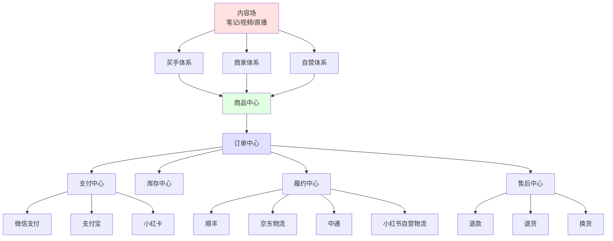
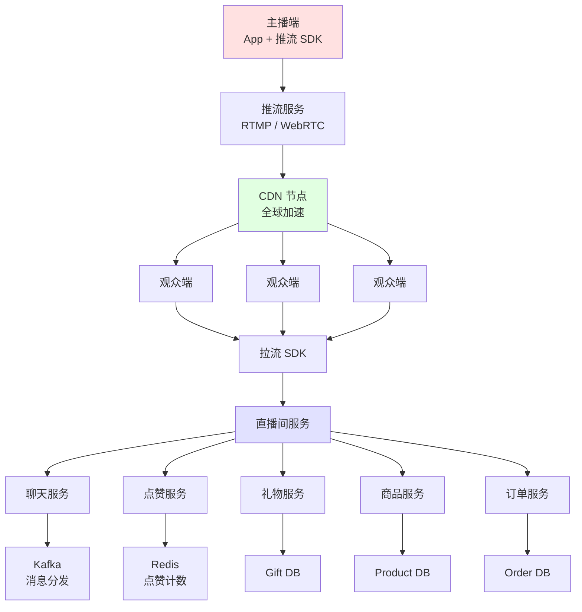
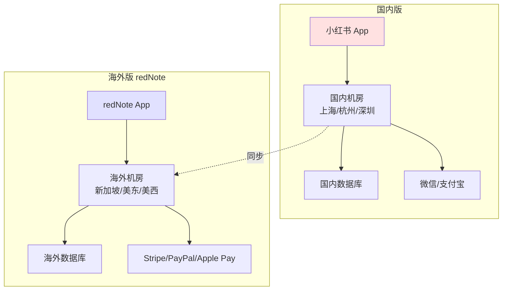
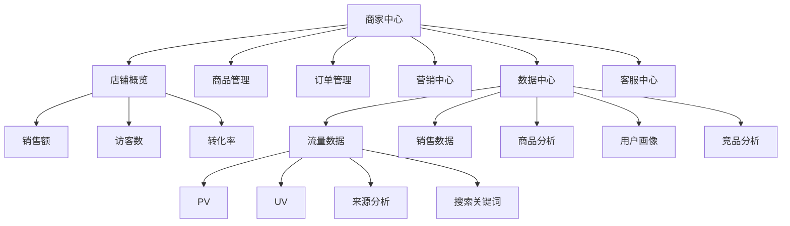

# 04 小红书电商闭环与买手制

## 4.1 电商业务全景

小红书电商业务从 2014 年的"福利社"起步，经过近 10 年演进，到 2024 年 GMV 突破 1000 亿 RMB（公司公开信），形成了"内容场 + 电商场"双场协同的独特闭环。区别于传统电商，小红书的电商是"种草到拔草"的内容驱动型电商。

### 4.1.1 电商业务演进

```
┌────────────────────────────────────────────────────────┐
│                小红书电商业务演进                        │
├────────────────────────────────────────────────────────┤
│                                                        │
│  2014-2017: 福利社时代                                 │
│  ├── 自营跨境电商                                       │
│  ├── 保税仓 + 海外直邮                                   │
│  └── 弱关联：内容与电商割裂                              │
│                                                        │
│  2018-2020: 笔记挂车时代                                │
│  ├── 笔记可以挂商品链接                                  │
│  ├── 第三方店铺接入                                      │
│  └── 关联度提升，但转化率低                              │
│                                                        │
│  2021-2023: 闭环电商时代                                │
│  ├── 切断淘宝外链                                       │
│  ├── 自建商品库                                          │
│  ├── 直播电商起步                                       │
│  └── GMV 突破百亿                                       │
│                                                        │
│  2023-2025: 买手制电商时代                              │
│  ├── 买手选品 + 买手直播                                 │
│  ├── 5万+ 买手规模                                      │
│  ├── GMV 突破千亿                                       │
│  └── 跨境 redNote 美国市场爆发                          │
│                                                        │
└────────────────────────────────────────────────────────┘
```

### 4.1.2 电商业务架构



## 4.2 种草到拔草链路

种草（Content Marketing）到拔草（Purchase）是小红书电商的核心链路，区别于传统电商的"先有需求再搜索"模式，小红书创造了一种"激发需求 → 满足需求"的新模式。

### 4.2.1 种草链路

```
┌────────────────────────────────────────────────────────┐
│                 种草 → 拔草完整链路                       │
├────────────────────────────────────────────────────────┤
│                                                        │
│  1. 内容触达（种草）                                   │
│     笔记/视频/直播 → 用户主动浏览 → 兴趣激发            │
│                            ↓                            │
│  2. 兴趣沉淀（收藏/点赞/评论）                          │
│     收藏夹 → 标签 → 个性化推送                          │
│                            ↓                            │
│  3. 决策辅助（搜索 + 测评）                              │
│     主动搜索 → 多篇笔记对比 → 信任建立                  │
│                            ↓                            │
│  4. 转化触发（买手直播/商品卡）                          │
│     进入购买页 → 商品详情 → 加购 → 下单                  │
│                            ↓                            │
│  5. 售后服务（物流 + 售后）                              │
│     物流跟踪 → 收货确认 → 评价/晒单                     │
│                            ↓                            │
│  6. 内容反哺（晒单笔记）                                │
│     用户晒单 → 新种草内容 → 循环                         │
│                                                        │
└────────────────────────────────────────────────────────┘
```

### 4.2.2 内容场到电商场的桥接

```python
class ContentToCommerceBridge:
    """内容到电商的桥接服务"""
    
    def __init__(self):
        # 商品识别服务
        self.product_recognizer = ProductRecognizer()
        
        # 商品挂载服务
        self.product_linker = ProductLinker()
        
        # 转化追踪服务
        self.conversion_tracker = ConversionTracker()
    
    def link_products_to_note(self, note_id):
        """笔记挂载商品：从笔记内容识别商品 → 关联商品库"""
        
        # 1. 获取笔记内容
        note = self.get_note(note_id)
        
        # 2. 内容识别商品（基于 NER + 多模态）
        candidate_products = self.product_recognizer.recognize(note)
        # 返回候选商品列表（含置信度）
        
        # 3. 商品匹配（精确匹配 + 模糊匹配）
        matched_products = self.match_products(candidate_products)
        
        # 4. 商品审核（合规 + 价格 + 库存）
        approved_products = self.audit_products(matched_products)
        
        # 5. 写入商品挂载关系
        for product in approved_products:
            self.link_product_to_note(note_id, product.product_id)
        
        return approved_products
    
    def conversion_tracking(self, user_id, note_id, product_id, action):
        """转化追踪"""
        # 记录用户从内容到电商的行为路径
        conversion_path = {
            'user_id': user_id,
            'note_id': note_id,
            'product_id': product_id,
            'action': action,  # view / collect / add_to_cart / purchase
            'timestamp': datetime.now(),
        }
        
        # 写入 Kafka，供下游消费
        self.kafka_producer.send('conversion_events', conversion_path)
        
        # 实时更新笔记 → 商品 → 转化的归因
        self.update_attribution(conversion_path)
```

## 4.3 买手制电商

买手制是小红书电商的核心创新，也是与抖音、淘宝、拼多多差异化的关键。

### 4.3.1 买手制 vs 传统电商

| 维度 | 传统电商 | 小红书买手制 |
|------|---------|-------------|
| 选品 | 商家自营 | 买手精选 |
| 流量 | 搜索 + 广告 | 内容 + 信任 |
| 转化 | 比价 + 促销 | 信任 + 故事 |
| 复购 | 平台驱动 | 买手驱动 |
| KOL 关系 | 弱合作 | 深度绑定 |
| 客单价 | 高中低都有 | 中高为主 |
| 决策路径 | 短 | 长（种草到拔草） |

### 4.3.2 买手体系架构

```mermaid
graph TB
    Buyer[买手]
    
    Buyer --> Profile[买手画像]
    Buyer --> Selection[选品中心]
    Buyer --> Live[直播中心]
    Buyer --> Data[数据中心]
    
    Profile --> Followers[粉丝画像]
    Profile --> Style[风格定位]
    Profile --> Influence[影响力指数]
    
    Selection --> ProductPool[商品池]
    Selection --> Recommend[选品推荐]
    Selection --> Sample[样品申请]
    
    Live --> PreLive[直播前]
    Live --> OnLive[直播中]
    Live --> PostLive[直播后]
    
    Live --> PreLive1[预热笔记]
    Live --> PreLive2[预约]
    Live --> PreLive3[选品脚本]
    
    Live --> OnLive1[互动]
    Live --> OnLive2[商品讲解]
    Live --> OnLive3[优惠发放]
    
    Live --> PostLive1[回放]
    Live --> PostLive2[数据复盘]
    Live --> PostLive3[粉丝沉淀]
    
    Data --> SalesData[销售数据]
    Data --> EngagementData[互动数据]
    Data --> LiveData[直播数据]
    
    style Buyer fill:#ffe1e1
```



### 4.3.3 买手分级体系

```python
class BuyerLevelSystem:
    """买手分级体系"""
    
    LEVELS = {
        'L1': {
            'name': '青铜买手',
            'follower_required': 100,
            'commission_rate': 0.05,
            'support': ['基础培训', '通用选品'],
            'requirements': {
                'note_quality_score': 60,
                'monthly_live_hours': 10,
                'monthly_gmv': 1000
            }
        },
        'L2': {
            'name': '白银买手',
            'follower_required': 1000,
            'commission_rate': 0.08,
            'support': ['进阶培训', '专属选品', '运营对接'],
            'requirements': {
                'note_quality_score': 70,
                'monthly_live_hours': 30,
                'monthly_gmv': 10000
            }
        },
        'L3': {
            'name': '黄金买手',
            'follower_required': 10000,
            'commission_rate': 0.12,
            'support': ['高级培训', '品牌合作', '流量扶持'],
            'requirements': {
                'note_quality_score': 80,
                'monthly_live_hours': 50,
                'monthly_gmv': 100000
            }
        },
        'L4': {
            'name': '钻石买手',
            'follower_required': 100000,
            'commission_rate': 0.15,
            'support': ['品牌定制', '官方活动', '流量倾斜'],
            'requirements': {
                'note_quality_score': 85,
                'monthly_live_hours': 80,
                'monthly_gmv': 1000000
            }
        },
        'L5': {
            'name': '王者买手',
            'follower_required': 1000000,
            'commission_rate': 0.20,
            'support': ['战略合作', '独家货源', '首页推荐'],
            'requirements': {
                'note_quality_score': 90,
                'monthly_live_hours': 100,
                'monthly_gmv': 10000000
            }
        }
    }
    
    def evaluate_buyer(self, buyer_id):
        """评估买手等级"""
        stats = self.get_buyer_stats(buyer_id)
        
        current_level = 'L1'
        for level, config in self.LEVELS.items():
            req = config['requirements']
            if (stats['follower_count'] >= config['follower_required'] and
                stats['note_quality_score'] >= req['note_quality_score'] and
                stats['monthly_live_hours'] >= req['monthly_live_hours'] and
                stats['monthly_gmv'] >= req['monthly_gmv']):
                current_level = level
        
        return current_level
    
    def calculate_commission(self, buyer_id, order_amount):
        """计算佣金"""
        level = self.evaluate_buyer(buyer_id)
        rate = self.LEVELS[level]['commission_rate']
        return order_amount * rate
```

### 4.3.4 买手直播技术栈

买手直播是小红书电商的核心场景，技术栈涉及音视频、互动、电商、推荐等多个领域：



### 4.3.5 买手直播互动

```python
class LiveInteractiveService:
    """直播间互动服务"""
    
    def __init__(self):
        self.chat_service = ChatService()
        self.gift_service = GiftService()
        self.product_service = ProductService()
        self.engagement_analyzer = EngagementAnalyzer()
    
    def on_user_enter(self, user_id, room_id):
        """用户进入直播间"""
        # 1. 发送欢迎语
        welcome_msg = self.generate_welcome(user_id, room_id)
        self.chat_service.send_system_message(room_id, welcome_msg)
        
        # 2. 推荐相关商品（基于用户兴趣 + 直播间商品）
        related_products = self.product_service.recommend_for_user(
            user_id, room_id
        )
        return related_products
    
    def on_product_click(self, user_id, room_id, product_id):
        """用户在直播间点击商品"""
        # 1. 记录行为
        self.kafka_producer.send('live_product_events', {
            'user_id': user_id,
            'room_id': room_id,
            'product_id': product_id,
            'action': 'click',
            'timestamp': datetime.now()
        })
        
        # 2. 推送商品详情卡片
        product = self.product_service.get_product(product_id)
        self.push_product_card(user_id, product)
        
        # 3. 给主播提示（购买意向用户）
        buyer_intent = self.engagement_analyzer.calculate_buyer_intent(
            user_id, room_id, product_id
        )
        if buyer_intent > 0.7:
            self.notify_anchor_high_intent_user(room_id, user_id)
    
    def on_purchase(self, user_id, room_id, order_id):
        """用户在直播间下单"""
        # 1. 实时播报
        self.chat_service.send_purchase_broadcast(room_id, user_id, order_id)
        
        # 2. 触发优惠（限时优惠）
        self.trigger_flash_sale(room_id, user_id)
        
        # 3. 提升主播热度
        self.boost_anchor_popularity(room_id)
```

### 4.3.6 直播带货推荐

```python
class LiveCommerceRecommender:
    """直播带货推荐"""
    
    def recommend_products_for_anchor(self, anchor_id, context):
        """为买手推荐选品"""
        
        # 1. 获取买手画像
        buyer_profile = self.get_buyer_profile(anchor_id)
        
        # 2. 获取商品池
        product_pool = self.get_product_pool(
            categories=buyer_profile['preferred_categories']
        )
        
        # 3. 商品打分
        scored_products = []
        for product in product_pool:
            score = self.score_product(product, buyer_profile, context)
            scored_products.append((product, score))
        
        # 4. 排序取 Top N
        scored_products.sort(key=lambda x: x[1], reverse=True)
        
        return [p for p, _ in scored_products[:50]]
    
    def score_product(self, product, buyer_profile, context):
        """商品打分"""
        score = 0
        
        # 类目匹配
        if product.category_l1 in buyer_profile['preferred_categories']:
            score += 0.3
        
        # 价格带匹配
        price_diff = abs(product.price - buyer_profile['avg_price'])
        if price_diff < buyer_profile['avg_price'] * 0.3:
            score += 0.2
        
        # 佣金率
        score += product.commission_rate * 0.15
        
        # 历史表现
        if product.category in buyer_profile['best_selling_categories']:
            score += 0.2
        
        # 季节性 + 热点
        if self.is_seasonally_relevant(product, context):
            score += 0.1
        
        # 库存
        if product.stock > 100:
            score += 0.05
        
        return min(score, 1.0)
```

## 4.4 商品中心

商品中心是电商业务的"心脏"，承载商品 SPU/SKU、库存、价格、属性等核心数据。

### 4.4.1 商品数据模型

```sql
-- SPU (Standard Product Unit)
CREATE TABLE product_spu (
    spu_id BIGINT UNSIGNED PRIMARY KEY,
    spu_code VARCHAR(64),
    title VARCHAR(255),
    brand_id BIGINT,
    category_l1 VARCHAR(32),
    category_l2 VARCHAR(32),
    category_l3 VARCHAR(32),
    
    -- 商品属性
    attributes JSON,  -- 多维度属性：颜色/尺寸/材质
    
    -- 图片
    main_image VARCHAR(512),
    images JSON,
    video_url VARCHAR(512),
    
    -- 商品描述
    description TEXT,
    highlights JSON,  -- 卖点
    
    -- 价格
    min_price DECIMAL(10, 2),  -- 最低 SKU 价格
    max_price DECIMAL(10, 2),  -- 最高 SKU 价格
    
    -- 状态
    status TINYINT,  -- 0:草稿 1:上架 2:下架 3:删除
    
    -- SEO
    seo_title VARCHAR(255),
    seo_keywords VARCHAR(500),
    seo_description TEXT,
    
    -- 统计
    sales_count BIGINT DEFAULT 0,
    view_count BIGINT DEFAULT 0,
    collect_count BIGINT DEFAULT 0,
    comment_count BIGINT DEFAULT 0,
    rating DECIMAL(3, 2),  -- 评分
    
    -- 时间
    created_at TIMESTAMP,
    updated_at TIMESTAMP,
    listed_at TIMESTAMP,
    
    KEY idx_brand_category (brand_id, category_l1, category_l2),
    KEY idx_status_sales (status, sales_count DESC)
) ENGINE=InnoDB;

-- SKU (Stock Keeping Unit)
CREATE TABLE product_sku (
    sku_id BIGINT UNSIGNED PRIMARY KEY,
    spu_id BIGINT UNSIGNED NOT NULL,
    sku_code VARCHAR(64),
    spec_values JSON,  -- 具体规格值：红色/M码
    
    -- 价格
    price DECIMAL(10, 2),
    original_price DECIMAL(10, 2),
    
    -- 库存
    stock INT DEFAULT 0,
    locked_stock INT DEFAULT 0,
    
    -- 图片
    image VARCHAR(512),
    
    -- 条码
    barcode VARCHAR(64),
    
    -- 重量体积（用于物流）
    weight DECIMAL(10, 2),
    volume DECIMAL(10, 2),
    
    KEY idx_spu (spu_id)
) ENGINE=InnoDB;
```

### 4.4.2 商品搜索

```python
class ProductSearchService:
    """商品搜索"""
    
    def __init__(self):
        # ES 商品索引
        self.es = Elasticsearch(['es-product'])
        self.index_name = 'products_v2'
    
    def build_index(self):
        """创建商品索引 mapping"""
        mapping = {
            'settings': {
                'number_of_shards': 10,
                'number_of_replicas': 2,
                'analysis': {
                    'analyzer': {
                        'ik_smart_pinyin': {
                            'type': 'custom',
                            'tokenizer': 'ik_smart',
                            'filter': ['pinyin_filter']
                        }
                    }
                }
            },
            'mappings': {
                'properties': {
                    'spu_id': {'type': 'long'},
                    'title': {
                        'type': 'text',
                        'analyzer': 'ik_max_word',
                        'fields': {
                            'pinyin': {'type': 'text', 'analyzer': 'ik_smart_pinyin'}
                        }
                    },
                    'brand_name': {'type': 'keyword'},
                    'category_l1': {'type': 'keyword'},
                    'category_l2': {'type': 'keyword'},
                    'category_l3': {'type': 'keyword'},
                    'tags': {'type': 'keyword'},
                    'price': {'type': 'double'},
                    'sales_count': {'type': 'long'},
                    'rating': {'type': 'float'},
                    'images': {'type': 'keyword'},
                    'status': {'type': 'byte'},
                    'created_at': {'type': 'date'},
                    'updated_at': {'type': 'date'},
                    'embedding': {
                        'type': 'dense_vector',
                        'dims': 768
                    }
                }
            }
        }
        
        self.es.indices.create(index=self.index_name, body=mapping)
    
    def search(self, query, filters, sort, page=1, size=20):
        """商品搜索"""
        body = {
            'query': {
                'function_score': {
                    'query': {
                        'bool': {
                            'must': [
                                {
                                    'multi_match': {
                                        'query': query,
                                        'fields': [
                                            'title^3',
                                            'tags^2',
                                            'brand_name^1.5',
                                            'category_l2'
                                        ],
                                        'type': 'best_fields'
                                    }
                                }
                            ],
                            'filter': filters,
                            'must_not': [
                                {'term': {'status': 3}}
                            ]
                        }
                    },
                    'functions': [
                        {
                            'field_value_factor': {
                                'field': 'sales_count',
                                'factor': 0.1,
                                'modifier': 'log1p',
                                'missing': 0
                            }
                        },
                        {
                            'gauss': {
                                'created_at': {
                                    'origin': 'now',
                                    'scale': '30d',
                                    'decay': 0.5
                                }
                            }
                        }
                    ],
                    'score_mode': 'sum',
                    'boost_mode': 'sum'
                }
            },
            'sort': sort,
            'from': (page - 1) * size,
            'size': size
        }
        
        return self.es.search(index=self.index_name, body=body)
```

## 4.5 订单与履约

### 4.5.1 订单生命周期

```
┌────────────────────────────────────────────────────────┐
│                    订单状态机                            │
├────────────────────────────────────────────────────────┤
│                                                        │
│  INIT ─→ UNPAID ─→ PAID ─→ SHIPPED ─→ RECEIVED ─→ FINISHED
│                │           │            │              │
│                ↓           ↓            ↓              │
│             CANCELED   REFUNDING    REFUNDED        │
│                                                        │
│  - INIT: 订单初始化                                    │
│  - UNPAID: 待支付（30 分钟超时）                       │
│  - PAID: 已支付                                        │
│  - SHIPPED: 已发货                                     │
│  - RECEIVED: 已收货                                    │
│  - FINISHED: 已完成（确认收货 7 天后）                  │
│  - CANCELED: 已取消                                    │
│  - REFUNDING: 退款中                                   │
│  - REFUNDED: 已退款                                    │
│                                                        │
└────────────────────────────────────────────────────────┘
```

### 4.5.2 分布式订单创建

```python
class OrderService:
    """订单服务"""
    
    def create_order(self, user_id, items, address, coupon_id=None):
        """创建订单（分布式事务）"""
        
        with distributed_transaction() as tx:
            # 1. 锁定库存（防止超卖）
            for item in items:
                success = self.inventory_service.lock_stock(
                    sku_id=item.sku_id,
                    quantity=item.quantity
                )
                if not success:
                    raise OutOfStockError(item.sku_id)
            
            # 2. 计算价格（商品 + 优惠 + 运费）
            price_detail = self.price_service.calculate(
                items, coupon_id, address
            )
            
            # 3. 创建订单
            order = Order(
                order_id=generate_order_id(),
                user_id=user_id,
                items=items,
                address=address,
                price_detail=price_detail,
                status='UNPAID',
                expire_at=datetime.now() + timedelta(minutes=30)
            )
            self.order_dao.insert(order)
            
            # 4. 冻结优惠券
            if coupon_id:
                self.coupon_service.lock_coupon(coupon_id, order.order_id)
            
            # 5. 创建支付单
            payment = self.payment_service.create_payment(
                order_id=order.order_id,
                amount=price_detail.final_amount,
                user_id=user_id
            )
        
        return order, payment
    
    def on_payment_success(self, order_id, payment_id):
        """支付成功回调"""
        with distributed_transaction() as tx:
            # 1. 更新订单状态
            order = self.order_dao.get(order_id)
            order.status = 'PAID'
            order.payment_id = payment_id
            order.paid_at = datetime.now()
            self.order_dao.update(order)
            
            # 2. 扣减冻结库存
            for item in order.items:
                self.inventory_service.confirm_stock(
                    sku_id=item.sku_id,
                    quantity=item.quantity
                )
            
            # 3. 创建发货单
            shipment = self.shipment_service.create_shipment(order)
            
            # 4. 触发发货（异步）
            self.async_ship(shipment)
            
            # 5. 结算佣金（买手）
            self.commission_service.calculate_commission(order)
            
            # 6. 发送消息（Kafka）
            self.kafka_producer.send('order_events', {
                'order_id': order_id,
                'event': 'paid',
                'amount': order.price_detail.final_amount,
                'timestamp': datetime.now()
            })
```

### 4.5.3 履约系统

```python
class FulfillmentService:
    """履约服务"""
    
    def __init__(self):
        # 物流公司适配器
        self.carriers = {
            'SF': ShunfengAdapter(),
            'JD': JDLogisticsAdapter(),
            'ZTO': ZhongtongAdapter(),
            'YTO': YuantongAdapter(),
            'RED': RedLogisticsAdapter(),  # 小红书自营物流
        }
    
    def ship_order(self, shipment):
        """发货"""
        # 1. 选择物流公司（基于地址、成本、时效）
        carrier = self.select_carrier(shipment)
        
        # 2. 创建物流订单
        waybill = self.carriers[carrier].create_waybill(shipment)
        
        # 3. 拣货任务下发
        self.wms_service.create_pick_task(shipment, waybill)
        
        # 4. 监控物流状态
        self.start_tracking(waybill)
        
        return waybill
    
    def select_carrier(self, shipment):
        """智能选择物流公司"""
        # 基于：地址、成本、时效、库存
        strategies = [
            (self.score_by_speed, 0.4),
            (self.score_by_cost, 0.3),
            (self.score_by_quality, 0.3),
        ]
        
        carrier_scores = {}
        for carrier_name in self.carriers:
            total_score = 0
            for score_fn, weight in strategies:
                score = score_fn(carrier_name, shipment)
                total_score += score * weight
            carrier_scores[carrier_name] = total_score
        
        return max(carrier_scores, key=carrier_scores.get)
```

## 4.6 跨境电商 redNote

redNote（小红书海外版）是 2025 年中国互联网出海的现象级产品，特别是美国市场。

### 4.6.1 redNote 美国市场爆发

2025 年 1 月，TikTok 在美国面临禁令风险，redNote 在 1 月 14 日单日新增用户 300 万+，登上美国 App Store 总榜第一。

**关键数据**：

| 指标 | 数据 | 时间 |
|------|------|------|
| 单日新增用户 | 300 万+ | 2025-01-14 |
| 美国 DAU 峰值 | 3000 万+ | 2025-01-19 |
| 7 天新增 | 1000 万+ | 2025-01-13 ~ 01-20 |
| 美国 App Store 排名 | 总榜 #1 | 2025-01-14 起 |

### 4.6.2 海外版技术架构差异



### 4.6.3 海外版核心差异

| 维度 | 国内版 | 海外版 redNote |
|------|--------|---------------|
| 内容审核 | 中国法规 | 当地法规（FCC、COPPA、GDPR） |
| 支付 | 微信/支付宝 | Stripe/PayPal/Apple Pay |
| 数据中心 | 国内 | 海外（新加坡、美东、美西） |
| 推荐算法 | 中文 NLP | 多语言 NLP（英、西、葡、日、韩） |
| 搜索 | 中文搜索 | 多语言搜索 + 跨语言检索 |
| 创作者 | 国内 KOL | 当地 KOL + 海外华人 |
| 内容形态 | 图文 + 短视频 | 短视频为主（更接近 TikTok） |
| 商业化 | 完整电商 | 广告为主，电商起步 |

### 4.6.4 多语言 NLP

```python
class MultilingualNLP:
    """多语言 NLP 服务"""
    
    def __init__(self):
        # 多语言 BERT
        self.bert = mBERT.from_pretrained('bert-base-multilingual-cased')
        
        # 跨语言 Sentence Embedding
        self.labse = LaBSE.from_pretrained('sentence-transformers/LaBSE')
        
        # 多语言翻译
        self.translator = MarianMTModel.from_pretrained('Helsinki-NLP/opus-mt')
    
    def detect_language(self, text):
        """语言检测"""
        # 基于 fasttext langdetect
        import fasttext
        model = fasttext.load_model('lid.176.ftz')
        prediction = model.predict(text)
        return prediction[0][0].replace('__label__', '')
    
    def get_multilingual_embedding(self, text):
        """跨语言 Embedding（不同语言同语义应该接近）"""
        # LaBSE 输出 768 维向量
        embedding = self.labse.encode(text)
        return embedding
    
    def cross_language_search(self, query, target_languages=['en', 'es', 'pt', 'ja']):
        """跨语言搜索"""
        # 1. 检测查询语言
        source_lang = self.detect_language(query)
        
        # 2. 翻译成所有目标语言
        all_queries = [query]
        for target_lang in target_languages:
            if target_lang != source_lang:
                translated = self.translator.translate(query, target_lang)
                all_queries.append(translated)
        
        # 3. 多语言搜索
        all_results = []
        for q in all_queries:
            results = self.search(q)
            all_results.extend(results)
        
        # 4. 去重 + 排序
        unique_results = self.dedup_and_rank(all_results)
        return unique_results
```

### 4.6.5 海外合规

```python
class ComplianceService:
    """合规服务"""
    
    REGULATIONS = {
        'GDPR': {  # 欧盟
            'user_rights': [
                'right_to_access',       # 访问权
                'right_to_rectification', # 更正权
                'right_to_erasure',      # 删除权（被遗忘权）
                'right_to_portability',  # 数据可携权
                'right_to_object',       # 反对权
            ],
            'consent_required': True,
            'data_retention_days': 365,
        },
        'CCPA': {  # 加州
            'user_rights': [
                'right_to_know',         # 知情权
                'right_to_delete',       # 删除权
                'right_to_opt_out',      # 退出销售权
            ],
        },
        'COPPA': {  # 美国儿童
            'min_age': 13,
            'parental_consent_required': True,
        }
    }
    
    def check_compliance(self, user_id, region, action):
        """合规检查"""
        regulation = self.REGULATIONS.get(region)
        if not regulation:
            return {'compliant': True}
        
        # 检查用户是否同意
        if regulation.get('consent_required'):
            consent = self.get_user_consent(user_id)
            if not consent or not consent.get(action):
                return {'compliant': False, 'reason': 'consent_required'}
        
        # 检查数据保留期限
        retention_days = regulation.get('data_retention_days')
        if retention_days:
            user_age_days = self.get_user_data_age_days(user_id)
            if user_age_days > retention_days:
                return {'compliant': False, 'reason': 'data_expired'}
        
        return {'compliant': True}
    
    def delete_user_data(self, user_id):
        """GDPR 删除权：删除用户所有数据"""
        with distributed_transaction() as tx:
            # 1. 删除笔记
            self.note_dao.delete_by_user(user_id)
            
            # 2. 删除评论
            self.comment_dao.delete_by_user(user_id)
            
            # 3. 删除订单（脱敏而非删除，保留财务凭证）
            self.order_dao.anonymize_by_user(user_id)
            
            # 4. 删除行为日志
            self.behavior_log_dao.delete_by_user(user_id)
            
            # 5. 删除账号
            self.user_dao.delete(user_id)
            
            # 6. 记录删除日志（合规审计）
            self.audit_log.record_deletion(user_id, datetime.now())
```

## 4.7 营销工具

小红书的营销工具是电商业务的"加速器"，包含优惠券、限时折扣、满减、买手专享等。

### 4.7.1 优惠券系统

```python
class CouponService:
    """优惠券服务"""
    
    def create_coupon(self, coupon_config):
        """创建优惠券"""
        coupon = Coupon(
            coupon_id=generate_id(),
            coupon_type=coupon_config['type'],  # AMOUNT / DISCOUNT
            discount_value=coupon_config['value'],
            min_amount=coupon_config.get('min_amount', 0),
            
            # 使用范围
            applicable_products=coupon_config.get('applicable_products'),
            applicable_categories=coupon_config.get('applicable_categories'),
            
            # 时间
            valid_from=coupon_config['valid_from'],
            valid_to=coupon_config['valid_to'],
            
            # 数量限制
            total_quantity=coupon_config.get('total_quantity'),
            per_user_limit=coupon_config.get('per_user_limit', 1),
            
            # 分发方式
            distribution_method=coupon_config.get('distribution_method'),
        )
        
        self.coupon_dao.insert(coupon)
        return coupon
    
    def claim_coupon(self, user_id, coupon_id):
        """领取优惠券"""
        with distributed_transaction() as tx:
            # 1. 检查库存
            coupon = self.coupon_dao.get(coupon_id)
            if coupon.claimed_quantity >= coupon.total_quantity:
                raise OutOfStockError('coupon')
            
            # 2. 检查用户领取数量
            user_claimed = self.user_coupon_dao.count_by_user(user_id, coupon_id)
            if user_claimed >= coupon.per_user_limit:
                raise LimitExceededError('user_coupon_limit')
            
            # 3. 发放优惠券
            user_coupon = UserCoupon(
                user_id=user_id,
                coupon_id=coupon_id,
                status='UNUSED',
                valid_from=coupon.valid_from,
                valid_to=coupon.valid_to
            )
            self.user_coupon_dao.insert(user_coupon)
            
            # 4. 增加领取数
            coupon.claimed_quantity += 1
            self.coupon_dao.update(coupon)
        
        return user_coupon
```

### 4.7.2 价格计算引擎

```python
class PriceCalculationEngine:
    """价格计算引擎"""
    
    def calculate(self, items, coupon=None, user_id=None, address=None):
        """计算订单价格"""
        
        # 1. 商品原始金额
        items_amount = sum(item.price * item.quantity for item in items)
        
        # 2. 活动优惠
        promotion_discount = self.calculate_promotion_discount(items)
        
        # 3. 优惠券
        coupon_discount = 0
        if coupon:
            coupon_discount = self.calculate_coupon_discount(
                items, coupon, items_amount - promotion_discount
            )
        
        # 4. 会员折扣
        member_discount = 0
        if user_id:
            member_level = self.member_service.get_level(user_id)
            member_discount = self.calculate_member_discount(
                items_amount, member_level
            )
        
        # 5. 运费
        shipping_fee = self.calculate_shipping_fee(items, address)
        
        # 6. 税费
        tax = self.calculate_tax(items_amount - promotion_discount - coupon_discount, address)
        
        # 7. 最终金额
        final_amount = (
            items_amount
            - promotion_discount
            - coupon_discount
            - member_discount
            + shipping_fee
            + tax
        )
        
        return {
            'items_amount': items_amount,
            'promotion_discount': promotion_discount,
            'coupon_discount': coupon_discount,
            'member_discount': member_discount,
            'shipping_fee': shipping_fee,
            'tax': tax,
            'final_amount': max(0.01, final_amount)
        }
```

## 4.8 风控与反作弊

电商风控是小红书的生命线，涉及刷单、反欺诈、资金安全等多个维度。

### 4.8.1 刷单识别

```python
class FraudDetectionService:
    """刷单识别服务"""
    
    def detect_fake_order(self, order):
        """识别虚假订单"""
        risk_score = 0
        reasons = []
        
        # 1. 用户行为特征
        user_history = self.get_user_history(order.user_id)
        
        # 1.1 账号年龄
        if user_history.register_days < 7:
            risk_score += 30
            reasons.append('new_account')
        
        # 1.2 历史购买
        if user_history.purchase_count_30d > 50:
            risk_score += 25
            reasons.append('excessive_purchases')
        
        # 1.3 历史退款
        if user_history.refund_rate > 0.3:
            risk_score += 20
            reasons.append('high_refund_rate')
        
        # 2. 订单特征
        # 2.1 收货地址（异常地址）
        if self.is_abnormal_address(order.address):
            risk_score += 20
            reasons.append('abnormal_address')
        
        # 2.2 下单时间
        if order.created_at.hour in [2, 3, 4, 5]:  # 凌晨下单
            risk_score += 10
            reasons.append('late_night_order')
        
        # 2.3 金额异常（整数金额）
        if order.amount == int(order.amount):
            risk_score += 10
            reasons.append('round_amount')
        
        # 3. 设备特征
        device = self.get_device_info(order.user_id)
        if device.is_emulator:
            risk_score += 30
            reasons.append('emulator')
        
        # 4. 关系图特征
        if self.is_in_fraud_cluster(order.user_id):
            risk_score += 30
            reasons.append('fraud_cluster')
        
        # 5. 决策
        if risk_score >= 80:
            action = 'block'  # 拦截
        elif risk_score >= 60:
            action = 'manual_review'  # 人工审核
        elif risk_score >= 40:
            action = 'observe'  # 观察
        else:
            action = 'pass'  # 放行
        
        return {
            'risk_score': risk_score,
            'reasons': reasons,
            'action': action
        }
```

### 4.8.2 退款风控

```python
class RefundRiskService:
    """退款风控"""
    
    def evaluate_refund(self, refund_request):
        """评估退款风险"""
        risk_score = 0
        reasons = []
        
        # 1. 用户历史退款
        user = self.get_user(refund_request.user_id)
        if user.refund_count_30d > 5:
            risk_score += 30
            reasons.append('excessive_refunds')
        
        # 2. 商品品类风险
        high_risk_categories = ['手机', '数码', '奢侈品']
        if refund_request.category_l1 in high_risk_categories:
            risk_score += 20
            reasons.append('high_risk_category')
        
        # 3. 退款原因
        suspicious_reasons = ['不想要了', '买错了', '其他']
        if refund_request.reason in suspicious_reasons:
            risk_score += 15
            reasons.append('vague_reason')
        
        # 4. 金额
        if refund_request.amount > 1000:
            risk_score += 10
            reasons.append('high_amount')
        
        # 5. 决策
        if risk_score >= 70:
            return {'action': 'reject', 'score': risk_score, 'reasons': reasons}
        elif risk_score >= 40:
            return {'action': 'manual_review', 'score': risk_score, 'reasons': reasons}
        else:
            return {'action': 'approve', 'score': risk_score, 'reasons': reasons}
```

## 4.9 数据看板与运营

### 4.9.1 商家中心



### 4.9.2 买手数据看板

```python
class BuyerDashboard:
    """买手数据看板"""
    
    def get_dashboard_data(self, buyer_id, time_range='7d'):
        """获取买手数据"""
        return {
            # 销售概览
            'sales_overview': {
                'total_gmv': self.get_total_gmv(buyer_id, time_range),
                'order_count': self.get_order_count(buyer_id, time_range),
                'avg_order_value': self.get_aov(buyer_id, time_range),
                'refund_rate': self.get_refund_rate(buyer_id, time_range),
            },
            # 直播数据
            'live_overview': {
                'live_count': self.get_live_count(buyer_id, time_range),
                'live_duration_hours': self.get_live_duration(buyer_id, time_range),
                'avg_viewers': self.get_avg_viewers(buyer_id, time_range),
                'peak_viewers': self.get_peak_viewers(buyer_id, time_range),
                'live_gmv': self.get_live_gmv(buyer_id, time_range),
            },
            # 笔记数据
            'note_overview': {
                'note_count': self.get_note_count(buyer_id, time_range),
                'total_views': self.get_total_views(buyer_id, time_range),
                'total_likes': self.get_total_likes(buyer_id, time_range),
                'total_collects': self.get_total_collects(buyer_id, time_range),
                'top_notes': self.get_top_notes(buyer_id, time_range, limit=10),
            },
            # 粉丝数据
            'follower_overview': {
                'total_followers': self.get_follower_count(buyer_id),
                'new_followers': self.get_new_followers(buyer_id, time_range),
                'follower_demographics': self.get_follower_demographics(buyer_id),
                'follower_interests': self.get_follower_interests(buyer_id),
            },
            # 商品数据
            'product_overview': {
                'top_selling_products': self.get_top_products(buyer_id, time_range),
                'product_conversion_rate': self.get_product_cvr(buyer_id, time_range),
            }
        }
```

## 4.10 财务与结算

### 4.10.1 结算体系

```python
class SettlementService:
    """结算服务"""
    
    def calculate_buyer_settlement(self, buyer_id, period='monthly'):
        """计算买手结算单"""
        # 1. 获取结算周期内的订单
        orders = self.get_orders_in_period(buyer_id, period)
        
        total_gmv = sum(order.final_amount for order in orders)
        total_commission = 0
        
        # 2. 计算佣金
        for order in orders:
            commission_rate = self.get_commission_rate(buyer_id)
            commission = order.final_amount * commission_rate
            total_commission += commission
        
        # 3. 扣除退款
        refunds = self.get_refunds_in_period(buyer_id, period)
        total_refund = sum(refund.amount for refund in refunds)
        total_commission -= total_refund * 0.1  # 退款的佣金扣回
        
        # 4. 扣除平台服务费
        platform_fee = total_gmv * 0.005  # 0.5% 平台费
        
        # 5. 扣除税费
        tax = total_commission * 0.08  # 8% 个人所得税（简化）
        
        # 6. 实际结算金额
        actual_settlement = total_commission - platform_fee - tax
        
        return {
            'period': period,
            'total_gmv': total_gmv,
            'total_commission': total_commission,
            'platform_fee': platform_fee,
            'tax': tax,
            'actual_settlement': actual_settlement,
            'order_count': len(orders),
            'refund_amount': total_refund,
        }
```

## 4.11 小结

小红书电商的独特之处：

1. **种草到拔草闭环**：内容激发需求 → 电商满足需求
2. **买手制核心**：与抖音、淘宝差异化的关键
3. **买手直播**：选品 + 信任 + 故事化营销
4. **跨境 redNote**：2025 年出海现象级产品
5. **多语言 NLP**：跨语言搜索 + 跨语言 Embedding
6. **风控体系**：刷单识别 + 退款风控 + 资金安全
7. **完整电商基础设施**：商品、订单、履约、支付、营销、售后

对自身业务的启示：

- **TikTok Shop**：买手制 + 内容驱动电商，可借鉴
- **AI 直播平台**：AI 买手主播是未来趋势
- **跨境电商**：redNote 美国市场策略 + 多语言 NLP