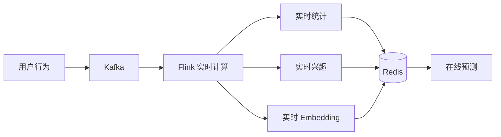

# 05 小红书可借鉴清单

## 5.1 总览

本文档从跨境电商 TikTok Shop 运营者 + AI 直播平台开发者的双重视角，整理从小红书技术架构、产品机制、运营打法中可以借鉴的核心要点。每个要点都包含"小红书做法 → 自身业务借鉴方式 → 落地路径"三部分。

## 5.2 借鉴维度全景

```mermaid
graph TB
    XHS[小红书可借鉴维度]
    
    XHS --> Tech[技术架构]
    XHS --> Content[内容机制]
    XHS --> Recommendation[推荐与搜索]
    XHS --> Ecommerce[电商闭环]
    XHS --> Community[社区运营]
    XHS --> Compliance[合规风控]
    XHS --> CrossBorder[跨境出海]
    XHS --> Operations[运营策略]
    
    Tech --> T1[多活容灾]
    Tech --> T2[中台化]
    Tech --> T3[实时特征]
    Tech --> T4[多模态 AI]
    
    Content --> C1[双 Feed 设计]
    Content --> C2[创作工具]
    Content --> C3[标签体系]
    Content --> C4[内容审核]
    
    Recommendation --> R1[多目标学习]
    Recommendation --> R2[序列召回]
    Recommendation --> R3[Query 理解]
    Recommendation --> R4[SEO 重地]
    
    Ecommerce --> E1[买手制]
    Ecommerce --> E2[种草拔草]
    Ecommerce --> E3[内容场到电商场]
    
    Community --> Cm1[社区氛围]
    Community --> Cm2[水军识别]
    Community --> Cm3[创作者激励]
    
    Compliance --> Co1[GDPR 合规]
    Compliance --> Co2[多语言 NLP]
    Compliance --> Co3[内容审核]
    
    CrossBorder --> CB1[redNote 美国市场]
    CrossBorder --> CB2[本地化运营]
    
    Operations --> O1[数据驱动]
    Operations --> O2[A/B 测试]
    Operations --> O3[数据看板]
    
    style XHS fill:#ffe1e1
```



## 5.3 对 TikTok Shop 的可借鉴清单

### 5.3.1 借鉴一：买手制替代纯 KOL

**小红书做法**：
- 5 万+ 专业买手，选品 + 内容 + 服务一体化
- 买手与粉丝深度绑定，复购率高
- 佣金分层（5%-20%）激励买手

**TikTok Shop 现状**：
- 主要依赖头部 KOL，腰部达人流失严重
- 达人选品与店铺选品割裂
- KOL 复购率低

**借鉴方案**：

```
TikTok Shop 借鉴买手制：
1. 设立"金牌选品师"角色，介于商家和达人之间
2. 选品师负责挖掘商品、匹配达人、跟踪转化
3. 平台给予选品师稳定分成（区别于达人一次性坑位费）
4. 培养 1 万+ 选品师，覆盖腰部商品
```

**落地路径**：

| 阶段 | 时间 | 任务 |
|------|------|------|
| 试点 | M1-M2 | 招募 100 名选品师，运营 1000 个商品 |
| 推广 | M3-M6 | 扩展到 1000 名选品师，覆盖 5 万个商品 |
| 规模化 | M6-M12 | 选品师 1 万+，覆盖 50 万商品 |

### 5.3.2 借鉴二：双列 Feed + 单列沉浸

**小红书做法**：
- 双列瀑布流：高密度浏览，适合种草
- 单列沉浸：强转化，适合深度消费
- 用户可切换两种模式

**TikTok Shop 现状**：
- 主要为单列沉浸（TikTok 风格）
- 缺乏浏览型入口

**借鉴方案**：

```
TikTok Shop 增加双列 Feed：
1. 独立"逛逛"Tab，类似小红书发现页
2. 双列展示商品 + 视频 + 直播切片
3. 通过算法平衡"逛"和"买"的转化
4. 给品牌商家更多曝光机会
```

**落地路径**：

- 阶段一：增加"逛逛"Tab（独立页面）
- 阶段二：Tab 与推荐融合（双列 + 单列混合）
- 阶段三：A/B 测试转化效果

### 5.3.3 借鉴三：种草 → 拔草闭环

**小红书做法**：
- 用户浏览笔记 → 收藏 → 后续推送 → 转化
- 收藏夹作为"种草蓄水池"
- 7-30 天转化窗口期

**TikTok Shop 现状**：
- 用户主要在直播/短视频内即时转化
- 缺乏长期种草路径

**借鉴方案**：

```python
# TikTok Shop 借鉴"收藏夹 + 长期推送"

class PlantingToPurchaseService:
    """种草到拔草服务"""
    
    def on_user_collect(self, user_id, product_id):
        """用户收藏商品时"""
        # 1. 记录收藏事件
        self.kafka_producer.send('collect_events', {
            'user_id': user_id,
            'product_id': product_id,
            'timestamp': datetime.now()
        })
        
        # 2. 加入"种草蓄水池"
        self.add_to_planting_pool(user_id, product_id)
        
        # 3. 调度后续推送（1/3/7/15/30 天）
        for day in [1, 3, 7, 15, 30]:
            self.scheduler.schedule(
                callback=self.send_planting_reminder,
                when=datetime.now() + timedelta(days=day),
                args=(user_id, product_id)
            )
    
    def send_planting_reminder(self, user_id, product_id):
        """发送种草提醒"""
        # 1. 检查用户是否已购买
        if self.has_purchased(user_id, product_id):
            return
        
        # 2. 检查商品是否有优惠
        product = self.product_service.get_product(product_id)
        if product.has_coupon or product.is_flash_sale:
            # 推送带优惠的种草提醒
            self.push_notification(
                user_id=user_id,
                template='planting_reminder_with_coupon',
                params={'product': product}
            )
```

**落地路径**：

- 阶段一：增加"想购买"功能（区别于"收藏"）
- 阶段二：建立"种草"独立标签
- 阶段三：调度推送 + 优惠激活

### 5.3.4 借鉴四：笔记挂车 vs 视频挂车

**小红书做法**：
- 笔记内可挂多个商品链接
- 商品以卡片形式展示
- 不强制跳转，用户可继续浏览

**TikTok Shop 现状**：
- 主要为视频挂车（小黄车）
- 强制跳转影响完播

**借鉴方案**：

```
TikTok Shop 增加"软挂车"：
1. 视频内商品以小卡片形式展示（非强制跳转）
2. 视频下方显示商品橱窗
3. 用户可看完视频再决定是否购买
4. 通过商品卡片点击率反推视频种草效果
```

### 5.3.5 借鉴五：搜索作为种草转化入口

**小红书做法**：
- 搜索是 SEO 重地，商家优化关键词获得自然流量
- 搜索结果混合笔记、商品、品牌
- 搜索 + 推荐双引擎

**TikTok Shop 现状**：
- 搜索权重低，主要依赖推荐
- 商家缺少 SEO 运营意识

**借鉴方案**：

```python
# TikTok Shop 强化搜索

class TikTokShopSearch:
    """TikTok Shop 搜索"""
    
    def search(self, query, user_id):
        """搜索商品"""
        # 1. 召回：笔记 + 视频 + 商品 + 直播切片
        candidates = self.recall_all_sources(query)
        
        # 2. 排序：CTR + CVR + GMV
        ranked = self.rank_with_business_goal(candidates)
        
        # 3. 混合展示：内容 + 商品
        result = self.mix_content_and_product(ranked)
        
        return result
    
    def merchant_seo_tool(self, merchant_id):
        """商家 SEO 工具"""
        return {
            'keyword_suggestions': self.get_keyword_suggestions(merchant_id),
            'competitor_keywords': self.get_competitor_keywords(merchant_id),
            'ranking_tracking': self.get_ranking_tracking(merchant_id),
            'optimization_tips': self.get_seo_tips(merchant_id),
        }
```

### 5.3.6 借鉴六：数据看板对商家的赋能

**小红书做法**：
- 创作者中心、商家中心、买手中心三类数据看板
- 包含流量、销售、粉丝画像、竞品分析
- 支持第三方数据工具接入

**TikTok Shop 现状**：
- 数据看板相对基础
- 商家依赖第三方工具（如 FastMoss）

**借鉴方案**：

```
TikTok Shop 商家数据中台：
1. 增加"商品热度榜"
2. 增加"竞品对标"
3. 增加"粉丝画像"
4. 增加"达人合作分析"
5. 开放 API 给第三方数据工具
```

## 5.4 对 AI 直播平台的可借鉴清单

### 5.4.1 借鉴一：AI 数字人多模态

**小红书做法**：
- 数字人主播在买手直播中应用
- 数字人 + 真人结合
- 多模态审核（音频 + 视频 + 文字）

**AI 直播平台现状**：
- 数字人技术逐步成熟
- 多模态实时审核是核心需求

**借鉴方案**：

```python
# AI 直播平台多模态审核（基于小红书经验）

class LiveStreamingMultimodalAudit:
    """直播多模态审核"""
    
    def __init__(self):
        # 文本审核（弹幕/评论）
        self.text_auditor = TextAuditor()
        
        # 音频审核（语音内容）
        self.audio_auditor = AudioAuditor()
        
        # 视频审核（实时画面）
        self.video_auditor = VideoAuditor()
        
        # 多模态融合
        self.fusion_model = MultimodalFusionModel()
    
    def audit_realtime(self, frame, audio_chunk, comments):
        """实时审核一帧"""
        # 1. 各模态独立审核
        text_result = self.text_auditor.audit_batch(comments)
        audio_result = self.audio_auditor.audit_chunk(audio_chunk)
        video_result = self.video_auditor.audit_frame(frame)
        
        # 2. 多模态融合决策
        final_result = self.fusion_model.fuse(
            text=text_result,
            audio=audio_result,
            video=video_result
        )
        
        # 3. 实时处置
        if final_result.is_violation:
            self.handle_violation(final_result)
        
        return final_result
    
    def handle_violation(self, result):
        """违规处置"""
        if result.risk_level >= 90:
            # 高风险：直接中断直播
            self.streaming_service.stop_stream()
            self.notify_moderator(result)
        elif result.risk_level >= 70:
            # 中风险：警告主播
            self.notify_anchor(result)
            self.apply_warning_action()
        elif result.risk_level >= 50:
            # 低风险：记录但不中断
            self.log_violation(result)
```

### 5.4.2 借鉴二：实时推荐 + 实时反馈

**小红书做法**：
- 推荐随用户实时行为调整
- 直播推荐 + 实时反馈
- 在线学习模型（FTRL）

**AI 直播平台借鉴**：

```python
# AI 直播实时推荐

class LiveRecommender:
    """直播实时推荐"""
    
    def recommend_realtime(self, user_id, context):
        """实时推荐直播间/商品"""
        # 1. 实时特征
        realtime_features = self.extract_realtime_features(user_id)
        
        # 2. 实时召回（关注主播 + 同类目 + 相似用户）
        candidates = self.recall_realtime(user_id, realtime_features)
        
        # 3. 在线学习排序
        scores = self.online_model.predict(candidates, realtime_features)
        
        # 4. 重排
        ranked = self.rerank(candidates, scores)
        
        return ranked
    
    def on_user_action(self, user_id, action):
        """用户实时行为反馈"""
        # 在线学习：FTRL 模型增量更新
        self.online_model.update(
            features=self.extract_features(user_id, action),
            label=1 if action in ['enter', 'follow', 'purchase'] else 0
        )
        
        # 实时调整用户兴趣
        self.user_interest_realtime.update(user_id, action)
```

### 5.4.3 借鉴三：内容审核流水线

**小红书做法**：
- 审核四道防线：机审 + 人审 + 复审 + 申诉
- 机审拦截 99.5%，人审兜底
- 审核 SLA：秒级机审、分钟级人审

**AI 直播平台借鉴**：

```
AI 直播审核体系：

机审（毫秒级）：
- 文本弹幕：敏感词 + BERT 分类
- 音频流：ASR + 敏感词
- 视频流：抽帧 + CV 模型 + 多模态大模型
- 直播间综合判断

人审（分钟级）：
- 高风险直播间复审
- 举报复核
- 申诉处理

应急机制：
- 直播中断 / 主播警告 / 限流 / 警告
```

### 5.4.4 借鉴四：双 Feed 流设计

**小红书做法**：
- 双列瀑布流（浏览型）+ 单列沉浸（消费型）
- 不同 Feed 走不同算法

**AI 直播平台借鉴**：

```
AI 直播双 Feed：

1. 逛逛 Feed（双列）
   - 直播间卡片列表
   - 高密度浏览
   - 强种草
   
2. 沉浸 Feed（单列）
   - 全屏直播
   - 深度消费
   - 强转化

算法：
- 双列：多样性 + 探索
- 单列：相关性 + 完播
```

### 5.4.5 借鉴五：精细化标签体系

**小红书做法**：
- 60+ 一级类目
- 1000+ 二级类目
- 50000+ 三级类目
- 用户画像基于标签 + Embedding 双重表示

**AI 直播平台借鉴**：

```python
# AI 直播标签体系

class LiveTaggingSystem:
    """直播标签体系"""
    
    HIERARCHY = {
        'L1': ['娱乐', '游戏', '电商', '教育', '体育', '生活'],
        'L2': {  # 二级 100+
            '娱乐': ['音乐', '舞蹈', '脱口秀', '综艺', '明星'],
            '游戏': ['MOBA', 'FPS', 'RPG', '休闲', '棋牌'],
            '电商': ['美妆', '服饰', '食品', '数码', '家居'],
            # ...
        },
        'L3': {  # 三级 1000+
            '电商/美妆': ['护肤', '彩妆', '香水', '美甲', '美发'],
            # ...
        }
    }
    
    def tag_live_room(self, room_id):
        """直播标签预测"""
        # 基于主播历史 + 实时内容 + 用户反馈
        # 多模态标签预测
        pass
```

### 5.4.6 借鉴六：内容场到电商场的桥接

**小红书做法**：
- 内容场（笔记/视频）→ 电商场（商品）的桥接
- 商品识别 + 商品挂载 + 转化追踪

**AI 直播平台借鉴**：

```python
class LiveCommerceBridge:
    """直播到电商的桥接"""
    
    def on_product_mention(self, room_id, product_name):
        """主播提到商品"""
        # 1. 商品识别（语音 + 文字 + 图像）
        product = self.product_recognizer.recognize(product_name)
        
        # 2. 自动挂购物车
        self.add_to_cart(room_id, product)
        
        # 3. 触发推送（对感兴趣的用户）
        self.push_to_interested_users(room_id, product)
    
    def track_conversion(self, user_id, room_id, product_id):
        """转化归因"""
        # 写入归因链路：直播间 → 商品 → 转化
        self.attribution_service.track(
            user_id, room_id, product_id, 'purchase'
        )
```

### 5.4.7 借鉴七：地理召回（LBS）

**小红书做法**：
- 附近的人/事/店
- 地理 + 兴趣混合召回

**AI 直播平台借鉴**：

```python
class GeoRecall:
    """地理召回"""
    
    def recall_nearby(self, user_id, user_location):
        """附近直播召回"""
        # 1. 附近主播（地理距离）
        nearby_anchors = self.geo_index.search_nearby(
            user_location, radius_km=50
        )
        
        # 2. 兴趣匹配（结合用户兴趣）
        interest_matched = self.interest_filter(
            nearby_anchors, user_id
        )
        
        return interest_matched
```

## 5.5 对跨境电商的可借鉴清单

### 5.5.1 借鉴一：redNote 美国市场策略

**小红书做法**：
- 2025-01 TikTok 禁令恐慌，redNote 7 天新增 1000 万美国用户
- 不依赖 ASO，依赖内容传播（TikTok 用户自发推荐）
- 双语界面 + 多语言 NLP

**TikTok Shop 借鉴**：

```
借鉴点：
1. 跨境市场不要押注单一渠道
2. 内容传播 > 付费投放
3. 多语言是基础设施，不是后期改造
4. 当地法规（COPPA、GDPR）必须前置
```

### 5.5.2 借鉴二：多语言 NLP

**小红书 redNote 做法**：
- 多语言 BERT（mBERT）
- 跨语言 Sentence Embedding（LaBSE）
- 跨语言搜索

**跨境电商借鉴**：

```python
# 多语言搜索与推荐

class MultilingualEcommerce:
    """多语言跨境电商"""
    
    def __init__(self):
        self.labse = LaBSE()
        self.mbert = mBERT()
        self.translator = MarianMT()
    
    def cross_language_product_search(self, query, target_languages):
        """跨语言商品搜索"""
        # 1. 检测语言
        source_lang = self.detect_language(query)
        
        # 2. 翻译到所有目标语言
        all_queries = self.translate_to_all(query, source_lang, target_languages)
        
        # 3. 多语言检索
        results = self.multi_language_search(all_queries)
        
        # 4. 跨语言 Embedding 排序
        query_emb = self.labse.encode(query)
        results = self.rerank_by_embedding(results, query_emb)
        
        return results
```

### 5.5.3 借鉴三：本地化合规

**小红书做法**：
- GDPR（欧盟）：数据可携、被遗忘权
- CCPA（加州）：知情权、退出销售权
- COPPA（美国儿童）：13 岁以下需家长同意

**借鉴方案**：

```
跨境电商合规清单：

1. 用户同意管理
   - 隐私政策多语言版本
   - Cookie 同意弹窗
   - 营销邮件订阅确认

2. 数据生命周期
   - 欧盟用户数据保留 ≤ 365 天
   - 用户主动删除支持
   - 数据导出（可携权）

3. 儿童保护
   - 13 岁以下禁止注册
   - 13-17 岁家长同意
   - 内容过滤

4. 内容审核
   - 当地法规适配
   - 当地宗教、文化敏感词库
   - 当地广告法合规
```

## 5.6 通用技术架构借鉴

### 5.6.1 借鉴一：中台化思路

**小红书做法**：
- 用户中心、内容中心、商品中心、订单中心、支付中心
- 数据中台：特征平台、画像、标签
- AI 中台：ML 平台、模型市场、A/B 测试

**借鉴方案**：

```
中台建设路径：

阶段一：业务中台（6 个月）
- 用户中心
- 内容中心
- 支付中心
- 消息中心

阶段二：数据中台（6 个月）
- 数据仓库
- 特征平台
- 用户画像
- 标签系统

阶段三：AI 中台（6 个月）
- ML 平台
- 模型市场
- A/B 测试平台
- AB 实验管理
```

### 5.6.2 借鉴二：异地多活

**小红书做法**：
- 三地五中心（上海、杭州、深圳、北京 + 海外）
- 单元化架构
- DRC 数据同步
- GSLB 流量调度

**借鉴方案**：

```
异地多活架构：

1. 数据中心选型
   - 主中心：用户核心分布区
   - 同城灾备：5km 范围
   - 异地灾备：500km 范围
   - 异地多活：1000km 范围

2. 流量调度
   - GSLB（基于地理位置 + 健康检查）
   - DNS 智能解析
   - 故障自动切换

3. 数据同步
   - Binlog 同步（MySQL）
   - 增量同步（HBase、ES）
   - 异步复制（最终一致性）

4. 单元化
   - 按用户 ID 分片
   - 每个单元独立运行
   - 故障隔离
```

### 5.6.3 借鉴三：实时特征 Pipeline

**小红书做法**：
- Kafka + Flink + Redis 实时计算
- 实时统计特征（点击率、转化率）
- 实时用户兴趣（最近 N 次行为）

**借鉴方案**：



### 5.6.4 借鉴四：A/B 测试平台

**小红书做法**：
- RedAB 自研 A/B 平台
- 分层实验（UI 层、召回层、排序层、业务层）
- 自动分流 + 显著性检验

**借鉴方案**：

```python
# 自研 A/B 测试平台

class ABTestPlatform:
    """A/B 测试平台"""
    
    def __init__(self):
        self.experiments = {}
        self.bucket_cache = RedisCache()
    
    def get_bucket(self, user_id, experiment_id):
        """分桶"""
        exp = self.experiments[experiment_id]
        
        # 一致性 hash 分桶
        hash_key = f"{user_id}:{experiment_id}:{exp.salt}"
        bucket_value = int(hashlib.md5(hash_key.encode()).hexdigest(), 16) % 100
        
        # 累计分布
        cumulative = 0
        for bucket_name, ratio in sorted(exp.buckets.items()):
            cumulative += ratio * 100
            if bucket_value < cumulative:
                return bucket_name
        
        return 'control'
    
    def analyze(self, experiment_id):
        """分析"""
        return {
            'ttest': scipy.stats.ttest_ind,
            'ztest': proportions_ztest,
            'effect_size': cohens_d,
            'confidence_interval': bootstrap_ci,
        }
```

### 5.6.5 借鉴五：多模态 AI 能力

**小红书做法**：
- 文本 embedding（BERT）
- 图像 embedding（CLIP 改造）
- 视频 embedding（自研）
- 多模态融合

**借鉴方案**：

```python
# 多模态能力封装

class MultimodalAI:
    """多模态 AI 能力"""
    
    def __init__(self):
        # 文本
        self.text_model = SentenceTransformer('paraphrase-multilingual-MiniLM-L12-v2')
        
        # 图像
        self.image_model = CLIPModel.from_pretrained('openai/clip-vit-base-patch32')
        
        # 视频
        self.video_model = TimeSformer.from_pretrained('facebook/timesformer-base-finetuned-k400')
        
        # 音频
        self.audio_model = Wav2Vec2Model.from_pretrained('facebook/wav2vec2-base-960h')
        
        # 多模态融合
        self.fusion_model = MultimodalFusionModel()
    
    def encode_multimodal(self, text=None, image=None, video=None, audio=None):
        """多模态编码"""
        embeddings = []
        if text:
            embeddings.append(self.text_model.encode(text))
        if image:
            embeddings.append(self.image_model.encode_image(image))
        if video:
            embeddings.append(self.video_model.encode_video(video))
        if audio:
            embeddings.append(self.audio_model.encode_audio(audio))
        
        # 融合
        return self.fusion_model.fuse(embeddings)
```

## 5.7 借鉴优先级矩阵

按"业务影响力 + 实施难度"对所有借鉴点做优先级排序：

```
                  高业务影响力
                       |
            ★买手制    |    ★双 Feed
            ★种草拔草  |    ★A/B 测试
            ★多模态审核 |    ★实时推荐
            ★多语言NLP |    ★标签体系
                       |
   低实施难度 ────────┼──────── 高实施难度
                       |
            ★双 Feed   |    ★异地多活
            ★数据看板  |    ★中台化
            ★SEO 工具  |    ★实时特征
            ★创作工具  |    ★多模态AI
                       |
                  低业务影响力
```

### 5.7.1 第一优先级（立即启动）

| 借鉴点 | 业务影响力 | 实施难度 | 启动时间 |
|--------|----------|---------|----------|
| 数据看板对商家赋能 | 高 | 低 | M1 |
| SEO 工具 | 中高 | 低 | M1 |
| 创作工具升级 | 中 | 中 | M2 |
| 双 Feed 设计 | 高 | 中 | M3 |

### 5.7.2 第二优先级（季度规划）

| 借鉴点 | 业务影响力 | 实施难度 | 启动时间 |
|--------|----------|---------|----------|
| 买手制（选品师角色） | 高 | 中 | Q3 |
| 种草拔草闭环 | 高 | 中 | Q3 |
| 多模态审核 | 高 | 中 | Q3 |
| 实时推荐 | 高 | 中 | Q3 |

### 5.7.3 第三优先级（年度规划）

| 借鉴点 | 业务影响力 | 实施难度 | 启动时间 |
|--------|----------|---------|----------|
| 异地多活 | 高 | 高 | 年度 |
| 中台化 | 高 | 高 | 年度 |
| 实时特征 Pipeline | 中高 | 高 | 年度 |
| 多模态 AI 平台 | 中高 | 高 | 年度 |
| 多语言 NLP | 中 | 高 | 年度 |

## 5.8 实施路线图

### 5.8.1 6 个月路线（M1-M6）

```
M1（数据驱动）：
  - 商家数据中台 V1
  - SEO 工具 V1
  - 流量分析工具

M2（内容升级）：
  - 创作工具 V2
  - 笔记挂车优化
  - 标签体系 V1

M3（双 Feed）：
  - 双 Feed 设计 + 上线
  - 多目标排序 V1

M4（买手制试点）：
  - 选品师角色设立
  - 100 名选品师试点
  - 选品师数据看板

M5（种草拔草）：
  - "想购买"功能
  - 收藏夹推送
  - 长期转化追踪

M6（多模态审核）：
  - 文本 + 音频 + 视频审核 V1
  - 风控规则 V1
```

### 5.8.2 12 个月路线（M7-M12）

```
M7-M8（实时推荐）：
  - 实时特征 Pipeline
  - 在线学习模型
  - A/B 测试平台 V1

M9-M10（中台化）：
  - 用户中心中台化
  - 内容中心中台化
  - 支付中心中台化

M11-M12（多语言 + 多模态）：
  - 多语言 NLP V1
  - 多模态 AI 平台 V1
  - 跨境合规框架
```

## 5.9 风险与避坑

### 5.9.1 不能照搬的方面

| 方面 | 小红书做法 | 不能照搬的原因 |
|------|----------|--------------|
| UI 风格 | 大量文字 + 表情符号 | TikTok 用户偏好简洁 |
| 内容调性 | 精致、生活化 | TikTok 用户偏好娱乐化 |
| 商业化 | 买手制 | 美国市场信任基础不同 |
| 社区氛围 | 真实、分享 | TikTok 是娱乐而非生活 |
| 内容审核 | 严格 | 跨境审核成本高 |

### 5.9.2 需要本地化的方面

| 方面 | 本地化方向 |
|------|----------|
| 推荐算法 | 各国用户兴趣差异大 |
| 内容审核 | 各国法规差异大 |
| 支付 | 各国支付习惯不同 |
| 物流 | 各国物流体系不同 |
| 营销 | 各国节日、文化不同 |

### 5.9.3 投入产出比警示

借鉴的投入产出比需要仔细评估：

- **小红书的成功有其特定历史背景**：用户基数、社区氛围、内容生态
- **TikTok 的成功也有其特定背景**：字节算法、视频化、年轻用户
- **简单复制往往失败**：需要深度本地化
- **建议先小规模实验**：验证可行性后再大规模投入

## 5.10 小结

小红书的可借鉴清单涵盖了从技术架构、内容机制、推荐搜索、电商闭环、社区运营到合规风控的全方位。每个借鉴点都需要结合自身业务特点做适配，不能简单照搬。

### 5.10.1 核心启示

1. **买手制是兴趣电商的关键**：区别于传统电商的差异化打法
2. **种草拔草闭环是新模式**：内容激发需求 + 电商满足需求
3. **双 Feed 适应不同场景**：浏览型 + 沉浸型并存
4. **多模态 AI 是基础设施**：文本、图像、视频、音频融合
5. **中台化是规模化的必由之路**：避免重复造轮子
6. **合规前置是出海的前提**：不要等出问题时再补救

### 5.10.2 立即行动项

1. 设计商家数据看板（基于现有数据）
2. 增加 SEO 工具（基于现有搜索）
3. 试点"想购买"功能（基于现有收藏功能）
4. 优化创作工具（基于现有工具）

### 5.10.3 持续投入项

1. 多模态 AI 能力建设
2. 实时推荐与在线学习
3. 中台化基础设施
4. 跨境合规体系

## 参考资料

- [小红书技术博客](https://www.infoq.cn/profile/B07B7B0D6B7C3A8E)
- [晚点对话毛文超](https://www.latepost.com/)
- [小红书电商 GMV 千亿](https://www.36kr.com/)
- [redNote 美国爆发](https://www.sensortower.com/)
- [GDPR 合规指南](https://gdpr.eu/)
- [多语言 NLP 实践](https://github.com/facebookresearch/LASER)
- [SIGIR 2023 推荐论文](https://sigir.org/)
- [KDD 2024 推荐论文](https://kdd.org/)