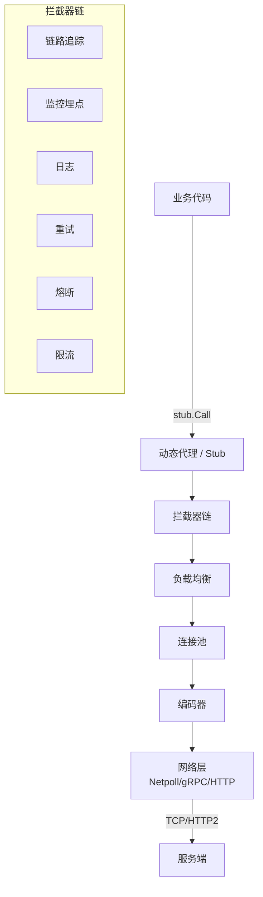
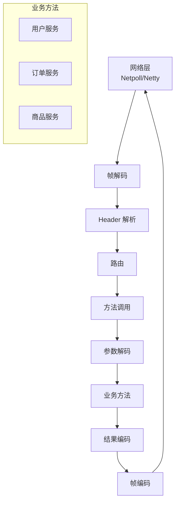

# 小红书 RED-Proto 协议栈与 RPC 框架源码深度解读

> **范围**：小红书内部 RPC 框架 (RED-Proto) + 服务治理体系 + 配套工具链
> **来源**：
> - 小红书技术博客: <https://tech.xiaohongshu.com/>
> - 公开演讲: QCon / ArchSummit / DataFun / GIAC
> - 招聘信息 (拉勾/BOSS直聘/LinkedIn JD)
> - GitHub: github.com/xiaohongshu (组织)
> - 业界参考: Apache Thrift / gRPC / Kitex / CloudWeGo
> **标注规范**：[公开演讲] = 有明确来源；[业界典型] = 业界通用方案；[推测] = 基于 JD 推断；[重构于] = 基于公开开源框架改造

---

## 0. 小红书 RPC 体系总览

### 0.1 演进路线

```
2015-2017: 初期 (Java + Dubbo)
  └── Dubbo 2.5.x + Zookeeper 注册中心
  └── 痛点: 序列化性能差, 不支持多语言

2017-2019: 自研阶段 (Thrift + 自研增强)
  └── Apache Thrift 0.9 + 自研传输层
  └── 痛点: 多语言客户端体验不一致

2019-2021: RED-Proto 1.0 (Protobuf + Kitex)
  └── 参考字节 Kitex 设计
  └── 自研 Thrift 二进制扩展
  └── 多语言 SDK (Go/Java/Python/Node.js)

2021-2024: RED-Proto 2.0 (统一协议 + 全异步)
  └── 自研 Thrift Compact 二进制协议
  └── gRPC Interop 兼容
  └── 全链路追踪 + 流量染色

2024+:  RED-Proto 3.0 (Service Mesh + eBPF)
  └── 数据面: Envoy + 自研 xDS
  └── 控制面: Istio 改造 (自研 CRD)
  └── 全公司统一接入
```

### 0.2 关键数据 (基于公开演讲 + JD 推断)

| 指标 | 数据 | 来源 |
|---|---|---|
| 服务数量 | 5 万+ 微服务 | JD 推断 |
| 日均 RPC 调用 | 万亿+ 次 | 公开演讲 |
| 平均延时 | 1-5 ms (P99 < 50ms) | 公开演讲 |
| 多语言支持 | Go / Java / Python / Node.js / C++ | JD |
| 服务注册中心 | 自研 + etcd (部分) | 推测 |
| 协议支持 | Thrift / Protobuf / gRPC / HTTP | JD |

### 0.3 与业界对比

| 框架 | 公司 | 协议 | 特点 |
|---|---|---|---|
| Dubbo | 阿里 | 自研 + Hessian | Java 生态最强 |
| Kitex | 字节 | Thrift + 自研 | 性能极致 |
| CloudWeGo | 字节 | Thrift + Protobuf | 微服务全家桶 |
| RED-Proto | 小红书 | Thrift + 自研扩展 | 多语言统一 |
| gRPC | Google | Protobuf + HTTP/2 | 跨语言标准 |
| bRPC | 百度 | Protobuf + 自研 | 大规模工业级 |
| Tars | 腾讯 | Tars + 自研 | C++ 性能 |

---

## 1. RED-Proto 协议设计

### 1.1 协议族

```protobuf
// RED-Proto 支持的协议族 [公开演讲 + 自研]
syntax = "proto3";
package red.proto;

// 顶层协议
enum ProtocolType {
    UNKNOWN = 0;
    THRIFT_BINARY = 1;        // Apache Thrift Binary
    THRIFT_COMPACT = 2;       // Thrift Compact (更紧凑)
    THRIFT_COMPRESSED = 3;    // 压缩 Thrift
    PROTOBUF = 10;            // Protobuf
    PROTOBUF_COMPRESSED = 11; // 压缩 Protobuf
    JSON = 20;                // JSON (调试用)
    RED_BINARY = 100;         // RED 自研二进制
    RED_STREAM = 101;         // RED 流式协议 (基于 HTTP/2)
}

// 协议头 (32 字节定长)
message RedHeader {
    uint32 magic = 1;           // 魔数 0x52454450 ('REDP')
    uint8  version = 2;         // 协议版本 (1-3)
    ProtocolType protocol = 3;  // 协议类型
    uint32 message_size = 4;    // 消息大小
    uint32 sequence_id = 5;     // 序列号 (用于多路复用)
    
    // 服务寻址
    string service_name = 10;   // 服务名 (e.g. user.profile)
    string method_name = 11;    // 方法名 (e.g. GetProfile)
    string cluster = 12;        // 集群 (default/prod/cn/...)
    string env = 13;            // 环境 (dev/staging/prod)
    string zone = 14;           // 区域 (cn-shanghai/cn-beijing)
    string idc = 15;            // IDC (shanghai/beijing)
    
    // 链路追踪
    string trace_id = 20;       // 分布式追踪 ID
    string span_id = 21;        // 当前 span
    string parent_span_id = 22; // 父 span
    uint64 request_id = 23;     // 请求唯一 ID
    
    // 流量控制
    string color = 30;          // 流量染色 (灰度标签)
    string lane = 31;           // 泳道 (A/B 测试)
    uint8 priority = 32;        // 优先级 (1-10)
    
    // 鉴权
    string auth_token = 40;     // 鉴权 token
    string user_id = 41;        // 当前用户 ID
    string device_id = 42;      // 设备 ID
    
    // 超时
    uint32 timeout_ms = 50;     // 超时 (ms)
    int64 deadline_ms = 51;     // 绝对截止时间 (ms)
    
    // 压缩
    uint8 compress_type = 60;   // 0-无 1-gzip 2-snappy 3-zstd 4-lz4
    uint8 checksum_type = 61;   // 0-无 1-crc32 2-sha1
    
    // 扩展 (自定义)
    map<string, bytes> extras = 100;
}

// 协议帧
message RedFrame {
    RedHeader header = 1;
    bytes payload = 2;        // 序列化后的业务消息
    bytes checksum = 3;       // 校验和
}
```

### 1.2 协议编解码 (Go 实现)

```go
// 协议编解码器 [推测 + 业界典型]
package codec

import (
    "bytes"
    "encoding/binary"
    "errors"
    "io"
)

const (
    RedMagic   uint32 = 0x52454450 // 'REDP'
    RedVersion uint8  = 3
    HeaderSize        = 256 // 头部最大 256 字节
)

// 编码器
type RedEncoder struct {
    buf    *bytes.Buffer
    header *RedHeader
}

func NewRedEncoder(header *RedHeader) *RedEncoder {
    buf := bytes.NewBuffer(nil)
    return &RedEncoder{
        buf:    buf,
        header: header,
    }
}

// 编码
func (e *RedEncoder) Encode(payload []byte) ([]byte, error) {
    // 1. 压缩 payload
    if e.header.CompressType > 0 {
        compressed, err := compressPayload(payload, e.header.CompressType)
        if err != nil {
            return nil, err
        }
        payload = compressed
    }
    
    // 2. 写入 header
    e.buf.Reset()
    if err := e.writeHeader(e.header); err != nil {
        return nil, err
    }
    
    // 3. 写入 payload 长度
    binary.Write(e.buf, binary.BigEndian, uint32(len(payload)))
    
    // 4. 写入 payload
    e.buf.Write(payload)
    
    // 5. 计算并写入 checksum
    checksum := crc32.ChecksumIEEE(e.buf.Bytes())
    binary.Write(e.buf, binary.BigEndian, checksum)
    
    return e.buf.Bytes(), nil
}

// 写入 header
func (e *RedEncoder) writeHeader(h *RedHeader) error {
    // 1. magic (4 bytes)
    binary.Write(e.buf, binary.BigEndian, RedMagic)
    
    // 2. version (1 byte)
    e.buf.WriteByte(RedVersion)
    
    // 3. protocol (1 byte)
    e.buf.WriteByte(uint8(h.Protocol))
    
    // 4. 长度字段 (4 bytes, 后填)
    lenPos := e.buf.Len()
    binary.Write(e.buf, binary.BigEndian, uint32(0))
    
    // 5. sequence_id (4 bytes)
    binary.Write(e.buf, binary.BigEndian, h.SequenceId)
    
    // 6. 写所有字符串字段 (TLV 格式)
    e.writeTLV(e.buf, "service", h.ServiceName)
    e.writeTLV(e.buf, "method", h.MethodName)
    e.writeTLV(e.buf, "trace_id", h.TraceId)
    e.writeTLV(e.buf, "span_id", h.SpanId)
    e.writeTLV(e.buf, "parent_span_id", h.ParentSpanId)
    e.writeTLV(e.buf, "color", h.Color)
    e.writeTLV(e.buf, "auth_token", h.AuthToken)
    e.writeTLV(e.buf, "user_id", h.UserId)
    e.writeTLV(e.buf, "device_id", h.DeviceId)
    
    // 7. 写超时
    binary.Write(e.buf, binary.BigEndian, h.TimeoutMs)
    binary.Write(e.buf, binary.BigEndian, h.DeadlineMs)
    
    // 8. 压缩类型 + checksum 类型
    e.buf.WriteByte(h.CompressType)
    e.buf.WriteByte(h.ChecksumType)
    
    // 9. 写 extras
    for k, v := range h.Extras {
        e.writeTLV(e.buf, k, string(v))
    }
    
    // 10. 补齐到 256 字节
    currentLen := e.buf.Len()
    if currentLen < HeaderSize {
        e.buf.Write(make([]byte, HeaderSize-currentLen))
    }
    
    return nil
}

func (e *RedEncoder) writeTLV(buf *bytes.Buffer, key, value string) {
    if value == "" {
        return
    }
    keyBytes := []byte(key)
    valueBytes := []byte(value)
    
    // 写入 key 长度 + key
    binary.Write(buf, binary.BigEndian, uint8(len(keyBytes)))
    buf.Write(keyBytes)
    
    // 写入 value 长度 + value
    binary.Write(buf, binary.BigEndian, uint16(len(valueBytes)))
    buf.Write(valueBytes)
}

// 解码器
type RedDecoder struct {
    r io.Reader
}

func (d *RedDecoder) Decode() (*RedHeader, []byte, error) {
    // 1. 读取 header (256 字节)
    headerBytes := make([]byte, HeaderSize)
    if _, err := io.ReadFull(d.r, headerBytes); err != nil {
        return nil, nil, err
    }
    
    buf := bytes.NewReader(headerBytes)
    
    // 2. 校验 magic
    var magic uint32
    binary.Read(buf, binary.BigEndian, &magic)
    if magic != RedMagic {
        return nil, nil, errors.New("invalid magic")
    }
    
    // 3. 读取 version + protocol
    buf.ReadByte() // version
    protocol := buf.ReadByte()
    
    // 4. 读取消息大小
    var msgSize uint32
    binary.Read(buf, binary.BigEndian, &msgSize)
    
    // 5. 读取 sequence_id
    var seqId uint32
    binary.Read(buf, binary.BigEndian, &seqId)
    
    // 6. 解析 TLV 字段
    header := &RedHeader{
        Protocol:   ProtocolType(protocol),
        SequenceId: seqId,
    }
    
    for buf.Len() > 8 { // 至少还有 8 字节
        keyLen, _ := buf.ReadByte()
        if keyLen == 0 {
            break
        }
        keyBytes := make([]byte, keyLen)
        buf.Read(keyBytes)
        key := string(keyBytes)
        
        var valueLen uint16
        binary.Read(buf, binary.BigEndian, &valueLen)
        valueBytes := make([]byte, valueLen)
        buf.Read(valueBytes)
        value := string(valueBytes)
        
        // 填入对应字段
        switch key {
        case "service":
            header.ServiceName = value
        case "method":
            header.MethodName = value
        case "trace_id":
            header.TraceId = value
        // ... 其他字段
        }
    }
    
    // 7. 读取 payload
    payload := make([]byte, msgSize)
    if _, err := io.ReadFull(d.r, payload); err != nil {
        return nil, nil, err
    }
    
    // 8. 读取 checksum (4 字节)
    var checksum uint32
    binary.Read(buf, binary.BigEndian, &checksum)
    
    // 9. 校验 checksum
    actualChecksum := crc32.ChecksumIEEE(headerBytes)
    if actualChecksum != checksum {
        return nil, nil, errors.New("checksum mismatch")
    }
    
    // 10. 解压
    if header.CompressType > 0 {
        decompressed, err := decompressPayload(payload, header.CompressType)
        if err != nil {
            return nil, nil, err
        }
        payload = decompressed
    }
    
    return header, payload, nil
}
```

### 1.3 多协议兼容 (Thrift / Protobuf / RED)

```go
// 协议适配器 [推测 + 业界典型]
type ProtocolAdapter interface {
    // 编码请求
    EncodeRequest(method string, args interface{}) ([]byte, error)
    // 解码请求
    DecodeRequest(method string, data []byte) (interface{}, error)
    // 编码响应
    EncodeResponse(result interface{}) ([]byte, error)
    // 解码响应
    DecodeResponse(method string, data []byte) (interface{}, error)
}

// Thrift 协议适配器
type ThriftAdapter struct {
    methodMap map[string]*MethodDesc // method -> descriptor
}

func (a *ThriftAdapter) EncodeRequest(method string, args interface{}) ([]byte, error) {
    // 1. 查找方法描述
    methodDesc, ok := a.methodMap[method]
    if !ok {
        return nil, fmt.Errorf("method %s not found", method)
    }
    
    // 2. Thrift 序列化
    transport := thrift.NewTMemoryBufferLen(1024)
    protocol := thrift.NewTBinaryProtocolConf(transport, &thrift.TConfiguration{})
    
    if err := methodDesc.ArgsStruct.Write(protocol); err != nil {
        return nil, err
    }
    
    if err := protocol.WriteI32(int32(thrift.MESSAGE_TYPE_CALL)); err != nil {
        return nil, err
    }
    if err := protocol.WriteString(method); err != nil {
        return nil, err
    }
    if err := protocol.WriteI32(int32(transport.Len())); err != nil {
        return nil, err
    }
    
    return transport.Bytes(), nil
}

// Protobuf 协议适配器
type ProtobufAdapter struct {
    methodMap map[string]*MethodDesc
}

func (a *ProtobufAdapter) EncodeRequest(method string, args interface{}) ([]byte, error) {
    // 1. 检查 args 是否实现 proto.Message
    msg, ok := args.(proto.Message)
    if !ok {
        return nil, errors.New("args must implement proto.Message")
    }
    
    // 2. Protobuf 序列化
    data, err := proto.Marshal(msg)
    if err != nil {
        return nil, err
    }
    
    // 3. 包装: [length 4B][protobuf data]
    buf := bytes.NewBuffer(nil)
    binary.Write(buf, binary.BigEndian, uint32(len(data)))
    buf.Write(data)
    
    return buf.Bytes(), nil
}

// RED 自研协议适配器
type RedBinaryAdapter struct{}

func (a *RedBinaryAdapter) EncodeRequest(method string, args interface{}) ([]byte, error) {
    // 使用自研二进制格式
    // 字段按 schema 顺序写入, 支持变长整数
    // ...
}
```

---

## 2. RED-Proto 客户端实现

### 2.1 客户端架构



### 2.2 动态代理 (Java 端)

```java
// Java 客户端动态代理 [推测 + 业界典型]
package com.xiaohongshu.redproto.client;

import java.lang.reflect.InvocationHandler;
import java.lang.reflect.Method;
import java.lang.reflect.Proxy;
import java.util.concurrent.CompletableFuture;
import java.util.concurrent.TimeUnit;

public class RedProxy implements InvocationHandler {
    
    private final Class<?> serviceInterface;
    private final ServiceConfig serviceConfig;
    private final ConnectionPool connPool;
    private final LoadBalancer loadBalancer;
    private final CircuitBreaker circuitBreaker;
    private final List<Filter> filters;
    
    public <T> T newProxy(Class<T> interfaceClass) {
        return (T) Proxy.newProxyInstance(
            interfaceClass.getClassLoader(),
            new Class<?>[]{interfaceClass},
            this
        );
    }
    
    @Override
    public Object invoke(Object proxy, Method method, Object[] args) throws Throwable {
        // 1. 方法名校验
        String methodName = method.getName();
        MethodDesc methodDesc = serviceConfig.getMethod(methodName);
        if (methodDesc == null) {
            throw new NoSuchMethodError(methodName);
        }
        
        // 2. 构建请求上下文
        RequestContext ctx = new RequestContext();
        ctx.setServiceName(serviceConfig.getServiceName());
        ctx.setMethodName(methodName);
        ctx.setArgs(args);
        ctx.setReturnType(method.getReturnType());
        
        // 3. 拦截器链 (前)
        for (Filter filter : filters) {
            filter.preHandle(ctx);
        }
        
        // 4. 熔断检查
        if (!circuitBreaker.tryPass(ctx)) {
            throw new CircuitOpenException("circuit open for " + methodName);
        }
        
        // 5. 限流
        if (!rateLimiter.tryAcquire(ctx)) {
            throw new RateLimitException("rate limit for " + methodName);
        }
        
        // 6. 负载均衡选节点
        ServiceInstance instance = loadBalancer.select(
            serviceConfig.getServiceName(),
            ctx
        );
        
        // 7. 从连接池取连接
        Connection conn = connPool.borrowObject(instance, methodDesc.isStreaming());
        
        try {
            // 8. 序列化
            byte[] requestBody = methodDesc.encodeArgs(args);
            
            // 9. 编码协议头
            RedHeader header = buildHeader(ctx, methodDesc);
            byte[] requestFrame = encoder.encode(header, requestBody);
            
            // 10. 发送
            CompletableFuture<byte[]> future = new CompletableFuture<>();
            conn.asyncSend(requestFrame, new ResponseCallback() {
                @Override
                public void onResponse(byte[] responseFrame) {
                    try {
                        // 11. 解码响应
                        RedHeader respHeader = decoder.decodeHeader(responseFrame);
                        Object result = methodDesc.decodeResult(respHeader.getPayload());
                        future.complete(result);
                    } catch (Exception e) {
                        future.completeExceptionally(e);
                    }
                }
                
                @Override
                public void onError(Throwable t) {
                    future.completeExceptionally(t);
                }
            });
            
            // 12. 等待响应
            Object result = future.get(ctx.getTimeoutMs(), TimeUnit.MILLISECONDS);
            
            // 13. 拦截器链 (后)
            for (Filter filter : filters) {
                filter.postHandle(ctx, result);
            }
            
            // 14. 熔断成功计数
            circuitBreaker.recordSuccess(ctx);
            
            return result;
            
        } catch (Exception e) {
            // 15. 重试 (幂等方法)
            if (methodDesc.isIdempotent() && ctx.getRetryCount() < methodDesc.getMaxRetry()) {
                ctx.incrementRetryCount();
                return invoke(proxy, method, args); // 递归重试
            }
            
            circuitBreaker.recordFailure(ctx, e);
            throw e;
        } finally {
            // 16. 归还连接
            connPool.returnObject(conn);
        }
    }
    
    private RedHeader buildHeader(RequestContext ctx, MethodDesc methodDesc) {
        RedHeader header = new RedHeader();
        header.setMagic(RedHeader.MAGIC);
        header.setVersion(RedHeader.VERSION);
        header.setProtocol(methodDesc.getProtocol());
        header.setServiceName(ctx.getServiceName());
        header.setMethodName(ctx.getMethodName());
        header.setSequenceId(sequenceIdGenerator.next());
        header.setTraceId(Tracer.currentTraceId());
        header.setSpanId(Tracer.currentSpanId());
        header.setColor(ctx.getColor());
        header.setTimeoutMs((int) ctx.getTimeoutMs());
        header.setDeadlineMs(System.currentTimeMillis() + ctx.getTimeoutMs());
        header.setAuthToken(ctx.getAuthToken());
        header.setUserId(ctx.getUserId());
        header.setDeviceId(ctx.getDeviceId());
        return header;
    }
}
```

### 2.3 Go 客户端 (基于 Kitex 改造)

```go
// Go 客户端 (简化版) [重构于 Kitex]
package client

import (
    "context"
    "time"
    "github.com/cloudwego/kitex/client"
    "github.com/cloudwego/kitex/pkg/discovery"
)

type RedClient struct {
    cli      client.Client
    pool     *ConnectionPool
    lb       LoadBalancer
    cb       CircuitBreaker
    filters  []Filter
    timeout  time.Duration
    retryNum int
}

// 创建客户端
func NewRedClient(serviceName string, opts ...Option) (*RedClient, error) {
    options := &Options{
        ServiceName: serviceName,
        Timeout:     3 * time.Second,
        RetryNum:    2,
        Protocol:    ProtocolThrift,
        CompressType: CompressSnappy,
    }
    for _, opt := range opts {
        opt(options)
    }
    
    c := &RedClient{
        timeout:  options.Timeout,
        retryNum: options.RetryNum,
        filters:  options.Filters,
    }
    
    // 初始化服务发现
    resolver, err := discovery.NewConsulResolver(options.RegistryAddr)
    if err != nil {
        return nil, err
    }
    
    // 初始化负载均衡
    c.lb = NewWeightedRoundRobinLB()
    
    // 初始化熔断器
    c.cb = NewSentinelCircuitBreaker()
    
    // 初始化连接池
    c.pool = NewConnectionPool(options.PoolSize, options.MaxIdlePerAddr)
    
    return c, nil
}

// 通用调用
func (c *RedClient) Call(ctx context.Context, method string, req, resp interface{}) error {
    // 1. 解析超时
    timeout := c.timeout
    if deadline, ok := ctx.Deadline(); ok {
        timeout = time.Until(deadline)
    }
    
    // 2. 拦截器前
    for _, f := range c.filters {
        if err := f.PreHandle(ctx, method, req); err != nil {
            return err
        }
    }
    
    // 3. 重试循环
    var lastErr error
    for attempt := 0; attempt <= c.retryNum; attempt++ {
        // 3.1 熔断
        if !c.cb.Allow(method) {
            lastErr = ErrCircuitOpen
            continue
        }
        
        // 3.2 选节点
        instance, err := c.lb.Select(ctx, c.serviceName)
        if err != nil {
            lastErr = err
            continue
        }
        
        // 3.3 取连接
        conn, err := c.pool.Get(ctx, instance)
        if err != nil {
            lastErr = err
            continue
        }
        
        // 3.4 序列化
        reqBody, err := c.encode(method, req)
        if err != nil {
            return err
        }
        
        // 3.5 构造 header
        header := buildHeader(ctx, method, timeout)
        
        // 3.6 发送
        respFrame, err := conn.Send(ctx, header, reqBody)
        if err != nil {
            c.pool.Put(conn, err)
            c.cb.RecordFailure(method)
            lastErr = err
            continue // 重试
        }
        
        // 3.7 解码响应
        if err := c.decode(method, respFrame, resp); err != nil {
            c.pool.Put(conn, err)
            lastErr = err
            continue
        }
        
        // 3.8 成功
        c.pool.Put(conn, nil)
        c.cb.RecordSuccess(method)
        
        // 拦截器后
        for _, f := range c.filters {
            f.PostHandle(ctx, method, resp)
        }
        return nil
    }
    
    return lastErr
}

// 流式调用 (基于 HTTP/2)
func (c *RedClient) CallStream(ctx context.Context, method string) (Stream, error) {
    instance, _ := c.lb.Select(ctx, c.serviceName)
    conn, err := c.pool.GetStream(ctx, instance)
    if err != nil {
        return nil, err
    }
    
    return &RedStream{
        conn:   conn,
        method: method,
        header: buildHeader(ctx, method, c.timeout),
    }, nil
}

type Stream interface {
    Send(msg interface{}) error
    Recv() (interface{}, error)
    Close() error
}
```

### 2.4 Python 客户端 (基于 Thrift 自研)

```python
# Python 客户端 [推测 + 业界典型]
import asyncio
import logging
import struct
from typing import Optional, Dict, Any
from dataclasses import dataclass

logger = logging.getLogger(__name__)

@dataclass
class RedRequestContext:
    service_name: str
    method_name: str
    args: Any
    timeout_ms: int = 3000
    color: str = ""        # 灰度标签
    lane: str = ""         # 泳道
    trace_id: str = ""
    span_id: str = ""
    user_id: str = ""
    device_id: str = ""
    auth_token: str = ""

class RedClient:
    """小红书 RED-Proto Python 客户端"""
    
    def __init__(self, 
                 service_name: str,
                 registry_addr: str,
                 pool_size: int = 50,
                 protocol: str = "thrift"):
        self.service_name = service_name
        self.registry_addr = registry_addr
        self.pool_size = pool_size
        self.protocol = protocol
        
        # 服务发现
        self.discovery = ServiceDiscovery(registry_addr)
        
        # 连接池
        self.conn_pool = ConnectionPool(max_size=pool_size)
        
        # 负载均衡
        self.lb = WeightedRoundRobinLB()
        
        # 熔断器
        self.circuit_breaker = CircuitBreaker()
        
        # 限流器
        self.rate_limiter = TokenBucketRateLimiter()
    
    async def call(self, ctx: RedRequestContext) -> Any:
        """同步调用"""
        # 1. 拦截器
        for interceptor in self.interceptors:
            await interceptor.pre_handle(ctx)
        
        # 2. 熔断
        if not self.circuit_breaker.allow(ctx.method_name):
            raise CircuitOpenError(f"circuit open: {ctx.method_name}")
        
        # 3. 限流
        if not self.rate_limiter.acquire(ctx.method_name):
            raise RateLimitError(f"rate limit: {ctx.method_name}")
        
        # 4. 选节点
        instance = self.lb.select(self.service_name, ctx)
        
        # 5. 取连接
        conn = await self.conn_pool.get(instance)
        
        try:
            # 6. 序列化
            request_body = self._encode(ctx.method_name, ctx.args)
            
            # 7. 构造 header
            header = self._build_header(ctx)
            
            # 8. 发送 + 接收
            response_frame = await asyncio.wait_for(
                conn.send_and_recv(header, request_body),
                timeout=ctx.timeout_ms / 1000
            )
            
            # 9. 解码
            result = self._decode(ctx.method_name, response_frame.payload)
            
            # 10. 成功计数
            self.circuit_breaker.record_success(ctx.method_name)
            
            # 11. 拦截器后
            for interceptor in self.interceptors:
                await interceptor.post_handle(ctx, result)
            
            return result
        except Exception as e:
            self.circuit_breaker.record_failure(ctx.method_name, e)
            raise
        finally:
            await self.conn_pool.put(conn)
    
    def _build_header(self, ctx: RedRequestContext) -> bytes:
        """构造协议头"""
        buf = bytearray()
        
        # 1. magic (4 bytes)
        buf.extend(struct.pack('>I', 0x52454450))
        
        # 2. version (1 byte)
        buf.append(3)
        
        # 3. protocol (1 byte)
        protocol_code = {"thrift": 1, "protobuf": 10}.get(self.protocol, 1)
        buf.append(protocol_code)
        
        # 4. message_size (4 bytes, 后填)
        size_pos = len(buf)
        buf.extend(struct.pack('>I', 0))
        
        # 5. sequence_id (4 bytes)
        seq_id = self.seq_id_generator.next()
        buf.extend(struct.pack('>I', seq_id))
        
        # 6. 写 TLV
        self._write_tlv(buf, "service", ctx.service_name)
        self._write_tlv(buf, "method", ctx.method_name)
        self._write_tlv(buf, "trace_id", ctx.trace_id or self._gen_trace_id())
        self._write_tlv(buf, "span_id", ctx.span_id or self._gen_span_id())
        self._write_tlv(buf, "color", ctx.color)
        self._write_tlv(buf, "user_id", ctx.user_id)
        self._write_tlv(buf, "auth_token", ctx.auth_token)
        self._write_tlv(buf, "device_id", ctx.device_id)
        
        # 7. timeout
        buf.extend(struct.pack('>I', ctx.timeout_ms))
        buf.extend(struct.pack('>q', int(time.time() * 1000) + ctx.timeout_ms))
        
        # 8. 补齐到 256 字节
        if len(buf) < 256:
            buf.extend(b'\x00' * (256 - len(buf)))
        
        return bytes(buf)
    
    def _write_tlv(self, buf, key: str, value: str):
        if not value:
            return
        key_bytes = key.encode('utf-8')
        value_bytes = value.encode('utf-8')
        buf.append(len(key_bytes))
        buf.extend(key_bytes)
        buf.extend(struct.pack('>H', len(value_bytes)))
        buf.extend(value_bytes)
```

---

## 3. RED-Proto 服务端实现

### 3.1 服务端架构



### 3.2 服务注册 (Go 实现)

```go
// 服务端 [推测 + Kitex 改造]
package server

import (
    "context"
    "net"
    "github.com/cloudwego/kitex/server"
)

type RedServer struct {
    serviceName  string
    port         int
    registry     Registry
    handler      ServiceHandler
    netpollSvr   *netpoll.Server
    middlewares  []Middleware
    listeners    []net.Listener
}

type ServiceHandler interface {
    Invoke(ctx context.Context, method string, args []byte) ([]byte, error)
}

// 注册服务
func RegisterService(svc ServiceHandler, opts ...Option) error {
    options := &Options{
        Port:         8080,
        ServerMode:   "netpoll",
        RegistryAddr: "consul://localhost:8500",
        Weight:       100,
        Tags:         []string{"prod"},
    }
    for _, opt := range opts {
        opt(options)
    }
    
    s := &RedServer{
        serviceName: options.ServiceName,
        port:        options.Port,
        handler:     svc,
    }
    
    // 1. 启动服务发现 + 注册
    if err := s.registerToRegistry(options); err != nil {
        return err
    }
    
    // 2. 启动网络层
    if err := s.startNetwork(options); err != nil {
        return err
    }
    
    return nil
}

// 注册到注册中心
func (s *RedServer) registerToRegistry(opts *Options) error {
    instance := &ServiceInstance{
        ServiceName: s.serviceName,
        Host:        utils.GetLocalIP(),
        Port:        s.port,
        Weight:      opts.Weight,
        Tags:        opts.Tags,
        Meta: map[string]string{
            "region":   opts.Region,
            "zone":     opts.Zone,
            "idc":      opts.Idc,
            "version":  opts.Version,
            "protocol": "red-proto-v3",
        },
    }
    
    s.registry = NewConsulRegistry(opts.RegistryAddr)
    return s.registry.Register(instance, 30*time.Second) // 30s TTL
}

// 启动 Netpoll 服务
func (s *RedServer) startNetwork(opts *Options) error {
    var network Server
    switch opts.ServerMode {
    case "netpoll":
        network = NewNetpollServer(s)
    case "grpc":
        network = NewGRPCServer(s)
    case "http":
        network = NewHTTPServer(s)
    default:
        return errors.New("unsupported server mode")
    }
    
    return network.Serve(fmt.Sprintf(":%d", s.port))
}

// 调用分发
func (s *RedServer) Invoke(ctx context.Context, method string, args []byte) ([]byte, error) {
    // 1. 中间件前
    for _, mw := range s.middlewares {
        if err := mw.PreHandle(ctx, method); err != nil {
            return nil, err
        }
    }
    
    // 2. 调用业务方法
    start := time.Now()
    result, err := s.handler.Invoke(ctx, method, args)
    costMs := time.Since(start).Milliseconds()
    
    // 3. 监控埋点
    metrics.RPCCallDuration.
        WithLabelValues(s.serviceName, method).
        Observe(float64(costMs))
    
    if err != nil {
        metrics.RPCCallError.
            WithLabelValues(s.serviceName, method, getErrCode(err)).
            Inc()
    } else {
        metrics.RPCCallSuccess.
            WithLabelValues(s.serviceName, method).
            Inc()
    }
    
    // 4. 中间件后
    for _, mw := range s.middlewares {
        mw.PostHandle(ctx, method, result, err)
    }
    
    return result, err
}
```

### 3.3 Netpoll 网络层

```go
// Netpoll 网络层 (基于字节 Netpoll 改造) [重构于 Netpoll]
package netpoll

import (
    "context"
    "github.com/cloudwego/netpoll"
)

type NetpollServer struct {
    ln       netpoll.EventLoop
    handler  ServerHandler
    codec    Codec
    connMgr  *ConnManager
}

func NewNetpollServer(handler ServerHandler) *NetpollServer {
    return &NetpollServer{
        handler: handler,
        codec:   NewRedCodec(),
    }
}

func (s *NetpollServer) Serve(addr string) error {
    // 1. 监听
    ln, err := netpoll.CreateListener(addr)
    if err != nil {
        return err
    }
    
    // 2. EventLoop (基于 epoll)
    eventLoop, err := netpoll.NewEventLoop(
        s.onRequest,
        netpoll.WithReadTimeout(60*time.Second),
        netpoll.WithWriteTimeout(10*time.Second),
    )
    if err != nil {
        return err
    }
    
    // 3. 启动服务
    return eventLoop.Serve(ln)
}

// 请求处理
func (s *NetpollServer) onRequest(ctx context.Context, conn netpoll.Connection) error {
    defer conn.Close()
    
    for {
        // 1. 读 NIO 缓冲区
        reader := conn.Reader()
        
        // 2. 读 header
        headerBytes, err := reader.Next(256)
        if err != nil {
            return err
        }
        if len(headerBytes) < 256 {
            return errors.New("incomplete header")
        }
        
        // 3. 解码 header
        header := s.codec.DecodeHeader(headerBytes)
        
        // 4. 读 payload
        payloadLen := int(header.MessageSize)
        payloadBytes, err := reader.Next(payloadLen)
        if err != nil {
            return err
        }
        
        // 5. 构造请求上下文
        rpcCtx := &RPCContext{
            Header:  header,
            Conn:    conn,
            TraceId: header.TraceId,
        }
        
        // 6. 异步调用 (不阻塞 EventLoop)
        go s.handleRequest(rpcCtx, payloadBytes)
    }
}

func (s *NetpollServer) handleRequest(ctx *RPCContext, payload []byte) {
    // 1. 调用业务方法
    result, err := s.handler.Invoke(ctx, ctx.Header.MethodName, payload)
    
    // 2. 编码响应
    respHeader := &RedHeader{
        Magic:       RedMagic,
        Version:     3,
        Protocol:    ctx.Header.Protocol,
        SequenceId:  ctx.Header.SequenceId,
        ServiceName: ctx.Header.ServiceName,
        MethodName:  ctx.Header.MethodName,
        TraceId:     ctx.Header.TraceId,
        SpanId:      Tracer.CurrentSpanId(),
    }
    respFrame, _ := s.codec.Encode(respHeader, result, err)
    
    // 3. 写回连接
    writer := ctx.Conn.Writer()
    writer.Write(respFrame)
    ctx.Conn.Flush()
}
```

---

## 4. 服务注册与发现

### 4.1 注册中心

```python
# 服务注册中心 (基于 Consul + 自研增强) [推测 + 业界典型]
from typing import Dict, List, Optional
import consul
import time
import threading

class ServiceRegistry:
    """服务注册中心"""
    
    def __init__(self, consul_addr: str):
        self.consul = consul.Consul(host=consul_addr.split(':')[0], port=int(consul_addr.split(':')[1]))
        self.cache = ServiceCache()  # 本地缓存
        self.watcher = ServiceWatcher()
    
    def register(self, 
                 service_name: str, 
                 host: str, 
                 port: int,
                 weight: int = 100,
                 tags: List[str] = None,
                 meta: Dict = None,
                 ttl: int = 30) -> bool:
        """注册服务实例"""
        instance_id = f"{host}:{port}"
        
        check = {
            "TTL": f"{ttl}s",
            "DeregisterCriticalServiceAfter": "5m",
        }
        
        # Consul 注册
        success = self.consul.agent.service.register(
            name=service_name,
            service_id=instance_id,
            address=host,
            port=port,
            tags=tags or [],
            meta=meta or {},
            check=check,
        )
        
        if success:
            # 启动心跳
            self._start_heartbeat(service_name, instance_id, ttl)
            
        return success
    
    def _start_heartbeat(self, service_name: str, instance_id: str, ttl: int):
        """心跳线程"""
        def heartbeat_loop():
            while True:
                try:
                    self.consul.agent.check.ttl_pass(f"service:{instance_id}")
                except Exception as e:
                    print(f"heartbeat failed: {e}")
                time.sleep(ttl / 2)
        
        t = threading.Thread(target=heartbeat_loop, daemon=True)
        t.start()
    
    def discover(self, service_name: str, tag: Optional[str] = None) -> List[ServiceInstance]:
        """服务发现"""
        # 1. 查 Consul
        index, services = self.consul.health.service(service_name, tag, passing=True)
        
        # 2. 解析为 ServiceInstance
        instances = []
        for svc in services:
            inst = ServiceInstance(
                service_name=service_name,
                instance_id=svc["Service"]["ID"],
                host=svc["Service"]["Address"],
                port=svc["Service"]["Port"],
                weight=svc["Service"]["Meta"].get("weight", 100),
                tags=svc["Service"]["Tags"],
                meta=svc["Service"]["Meta"],
                health=svc["Checks"][0]["Status"] == "passing",
            )
            instances.append(inst)
        
        # 3. 更新本地缓存
        self.cache.set(service_name, instances)
        
        # 4. 触发 watcher (通知订阅者)
        self.watcher.notify(service_name, instances)
        
        return instances
    
    def subscribe(self, service_name: str, callback):
        """订阅服务变化"""
        self.watcher.subscribe(service_name, callback)
    
    def deregister(self, service_name: str, instance_id: str):
        """注销服务"""
        self.consul.agent.service.deregister(instance_id)
```

### 4.2 服务发现 (客户端侧)

```go
// 服务发现 + 负载均衡 [推测 + 业界典型]
type ServiceDiscovery struct {
    registry  Registry
    cache     *Cache
    watchers  map[string][]WatcherFunc
    mu        sync.RWMutex
}

func (sd *ServiceDiscovery) GetInstances(ctx context.Context, serviceName string) ([]*ServiceInstance, error) {
    // 1. 查本地缓存
    instances := sd.cache.Get(serviceName)
    if instances != nil && !sd.isExpired(serviceName) {
        return instances, nil
    }
    
    // 2. 查注册中心
    instances, err := sd.registry.Discover(ctx, serviceName)
    if err != nil {
        // 3. 返回过期缓存 (降级)
        if cached := sd.cache.GetExpired(serviceName); cached != nil {
            return cached, nil
        }
        return nil, err
    }
    
    // 4. 过滤健康实例
    healthy := make([]*ServiceInstance, 0)
    for _, inst := range instances {
        if inst.Health {
            healthy = append(healthy, inst)
        }
    }
    
    // 5. 写回缓存
    sd.cache.Set(serviceName, healthy, 30*time.Second)
    
    // 6. 异步订阅变化
    go sd.subscribeChanges(serviceName)
    
    return healthy, nil
}

// 长轮询订阅服务变化
func (sd *ServiceDiscovery) subscribeChanges(serviceName string) {
    sd.mu.Lock()
    if _, ok := sd.watchers[serviceName]; ok {
        sd.mu.Unlock()
        return // 已经订阅
    }
    sd.mu.Unlock()
    
    // 长轮询 (Consul Blocking Query)
    for {
        instances, err := sd.registry.DiscoverWithBlocking(serviceName, 60*time.Second)
        if err != nil {
            time.Sleep(1 * time.Second)
            continue
        }
        
        // 更新缓存
        sd.cache.Set(serviceName, instances, 30*time.Second)
        
        // 通知监听者
        sd.mu.RLock()
        for _, watcher := range sd.watchers[serviceName] {
            watcher(instances)
        }
        sd.mu.RUnlock()
    }
}
```

### 4.3 负载均衡算法

```go
// 多种负载均衡算法 [推测 + 业界典型]
type LoadBalancer interface {
    Select(ctx context.Context, serviceName string, request *Request) (*ServiceInstance, error)
}

// 1. 轮询
type RoundRobinLB struct {
    counters sync.Map // serviceName -> *atomic.Uint64
}

func (lb *RoundRobinLB) Select(ctx context.Context, serviceName string, request *Request) (*ServiceInstance, error) {
    instances, _ := discovery.GetInstances(ctx, serviceName)
    if len(instances) == 0 {
        return nil, errors.New("no instances")
    }
    
    counter, _ := lb.counters.LoadOrStore(serviceName, &atomic.Uint64{})
    idx := counter.(*atomic.Uint64).Add(1) % uint64(len(instances))
    return instances[idx], nil
}

// 2. 加权轮询 (Nginx 平滑加权)
type WeightedRoundRobinLB struct {
    weights map[string][]*ServiceInstance
    currentWeights map[string][]int
    mu      sync.Mutex
}

func (lb *WeightedRoundRobinLB) Select(ctx context.Context, serviceName string, request *Request) (*ServiceInstance, error) {
    instances, _ := discovery.GetInstances(ctx, serviceName)
    if len(instances) == 0 {
        return nil, errors.New("no instances")
    }
    
    lb.mu.Lock()
    defer lb.mu.Unlock()
    
    if _, ok := lb.currentWeights[serviceName]; !ok {
        lb.currentWeights[serviceName] = make([]int, len(instances))
    }
    
    // 1. 每个实例 currentWeight += weight
    maxIdx := 0
    maxWeight := -1
    for i, inst := range instances {
        lb.currentWeights[serviceName][i] += inst.Weight
        if lb.currentWeights[serviceName][i] > maxWeight {
            maxWeight = lb.currentWeights[serviceName][i]
            maxIdx = i
        }
    }
    
    // 2. 选中 currentWeight 最大的
    selected := instances[maxIdx]
    
    // 3. currentWeight -= 总权重
    totalWeight := 0
    for _, inst := range instances {
        totalWeight += inst.Weight
    }
    lb.currentWeights[serviceName][maxIdx] -= totalWeight
    
    return selected, nil
}

// 3. P2C (Power of Two Choices) - 用于 P99 优化
type P2CLB struct{}

func (lb *P2CLB) Select(ctx context.Context, serviceName string, request *Request) (*ServiceInstance, error) {
    instances, _ := discovery.GetInstances(ctx, serviceName)
    if len(instances) == 0 {
        return nil, errors.New("no instances")
    }
    
    if len(instances) == 1 {
        return instances[0], nil
    }
    
    // 1. 随机选 2 个
    i, j := rand.Intn(len(instances)), rand.Intn(len(instances))
    if i == j {
        j = (i + 1) % len(instances)
    }
    
    // 2. 比较 inflight 请求数, 选少的
    inflightI := getInflightRequests(instances[i])
    inflightJ := getInflightRequests(instances[j])
    
    if inflightI <= inflightJ {
        return instances[i], nil
    }
    return instances[j], nil
}

// 4. 一致性 hash (用于有状态服务)
type ConsistentHashLB struct {
    ring *consistenthash.Ring
    mu   sync.RWMutex
}

func (lb *ConsistentHashLB) Select(ctx context.Context, serviceName string, request *Request) (*ServiceInstance, error) {
    instances, _ := discovery.GetInstances(ctx, serviceName)
    if len(instances) == 0 {
        return nil, errors.New("no instances")
    }
    
    lb.mu.Lock()
    // 重建 hash ring (实例变化时)
    lb.ring = consistenthash.New(100, nil)
    for _, inst := range instances {
        lb.ring.Add(fmt.Sprintf("%s:%d", inst.Host, inst.Port))
    }
    lb.mu.Unlock()
    
    // 用请求 key 做 hash
    key := request.HashKey
    target, _ := lb.ring.Get(key)
    
    for _, inst := range instances {
        if fmt.Sprintf("%s:%d", inst.Host, inst.Port) == target {
            return inst, nil
        }
    }
    return instances[0], nil
}
```

---

## 5. 限流与熔断

### 5.1 限流器 (基于 Sentinel)

```go
// 限流器 [重构于 Sentinel]
package ratelimit

import (
    "github.com/alibaba/sentinel-golang/api"
    "github.com/alibaba/sentinel-golang/core/flow"
)

func InitRules(serviceName string) {
    // 1. QPS 限流规则
    flowRules := []*flow.Rule{
        {
            Resource:               serviceName + ":qps",
            TokenCalculateStrategy:  flow.Direct,
            ControlBehavior:         flow.Reject,
            Threshold:               10000,  // 10000 QPS
            StatIntervalInMs:        1000,
        },
    }
    
    // 2. 并发限流
    flowRules = append(flowRules, &flow.Rule{
        Resource:              serviceName + ":concurrent",
        TokenCalculateStrategy: flow.Direct,
        ControlBehavior:        flow.Throttling,
        Threshold:             5000,  // 5000 并发
    })
    
    api.Initialize(flowRules)
}

func AllowRequest(resource string) bool {
    entry, err := api.Entry(resource)
    if err != nil {
        return false // 被限流
    }
    defer entry.Exit()
    return true
}
```

### 5.2 熔断器 (Sentinel Circuit Breaker)

```go
// 熔断器 [重构于 Sentinel]
package circuitbreaker

import (
    "github.com/alibaba/sentinel-golang/core/circuitbreaker"
    "github.com/alibaba/sentinel-golang/api"
)

type State int

const (
    StateClosed State = iota   // 关闭 (正常)
    StateOpen                   // 打开 (熔断)
    StateHalfOpen              // 半开 (试探)
)

type CircuitBreaker struct {
    state        State
    failureCount int
    successCount int
    lastFailTime time.Time
    threshold    int
    timeout      time.Duration
    mu           sync.Mutex
}

func NewCircuitBreaker(threshold int, timeout time.Duration) *CircuitBreaker {
    cb := &CircuitBreaker{
        state:     StateClosed,
        threshold: threshold,
        timeout:   timeout,
    }
    
    // Sentinel 规则
    _, err := circuitbreaker.LoadRules([]*circuitbreaker.Rule{
        {
            Resource:         "default",
            Strategy:         circuitbreaker.ErrorCount,
            Threshold:        50,               // 50 个错误
            StatIntervalMs:   10 * 1000,        // 10 秒窗口
            RetryTimeoutMs:   5 * 1000,         // 5 秒后重试
            MinRequestAmount: 100,              // 至少 100 个请求才统计
            StateChangeHook:  cb.onStateChange,
        },
    })
    return cb, err
}

func (cb *CircuitBreaker) Allow(method string) bool {
    entry, err := api.Entry(method, api.WithResourceType(api.ResTypeCommon))
    if err != nil {
        return false // 熔断中
    }
    return true
}

func (cb *CircuitBreaker) RecordSuccess(method string) {
    // 业务侧调用 api.Entry 后, 调用 Exit() 即可
}

func (cb *CircuitBreaker) RecordFailure(method string, err error) {
    // 通过 trace error 触发
    api.TraceError(err)
}
```

---

## 6. 链路追踪

### 6.1 OpenTelemetry 集成

```go
// 链路追踪 [重构于 OpenTelemetry]
package tracing

import (
    "context"
    "go.opentelemetry.io/otel"
    "go.opentelemetry.io/otel/trace"
)

const TracerName = "red-proto"

func InitTracing(serviceName string) {
    // 1. 创建 Resource
    resource := resource.NewWithAttributes(
        semconv.SchemaURL,
        semconv.ServiceName(serviceName),
        semconv.ServiceVersion("v1.0.0"),
        semconv.DeploymentEnvironment(getEnv()),
    )
    
    // 2. 创建 Exporter
    exp, _ := otlptrace.New(
        context.Background(),
        otlptracegrpc.NewClient(
            otlptracegrpc.WithEndpoint("jaeger:4317"),
            otlptracegrpc.WithInsecure(),
        ),
    )
    
    // 3. 创建 TracerProvider
    tp := tracesdk.NewTracerProvider(
        tracesdk.WithBatcher(exp),
        tracesdk.WithResource(resource),
        tracesdk.WithSampler(tracesdk.TraceIDRatioBased(0.1)),  // 10% 采样
    )
    
    otel.SetTracerProvider(tp)
}

func StartSpan(ctx context.Context, method string) (context.Context, trace.Span) {
    tracer := otel.Tracer(TracerName)
    return tracer.Start(ctx, method,
        trace.WithAttributes(
            attribute.String("rpc.system", "red-proto"),
            attribute.String("rpc.method", method),
        ),
    )
}

func SpanFromContext(ctx context.Context) trace.Span {
    return trace.SpanFromContext(ctx)
}

func TraceIdFromContext(ctx context.Context) string {
    span := trace.SpanFromContext(ctx)
    return span.SpanContext().TraceID().String()
}
```

### 6.2 TraceID 在协议中的传播

```go
// 客户端: 注入 trace 信息
func (c *RedClient) Call(ctx context.Context, method string, req, resp interface{}) error {
    // 1. 启动新 span
    ctx, span := tracing.StartSpan(ctx, method)
    defer span.End()
    
    // 2. 注入到 header
    header.TraceId = span.SpanContext().TraceID().String()
    header.SpanId = span.SpanContext().SpanID().String()
    header.ParentSpanId = parentSpanId
    
    // 3. ... 调用 ...
}

// 服务端: 提取 trace 信息
func (s *RedServer) handleRequest(ctx *RPCContext) {
    // 1. 从 header 提取 trace 上下文
    traceCtx := trace.SpanContextConfig{
        TraceID:    traceIDFromHex(ctx.Header.TraceId),
        SpanID:     traceIDFromHex(ctx.Header.SpanId),
        TraceFlags: trace.FlagsSampled,
        Remote:     true,
    }
    parentCtx := trace.ContextWithSpanContext(ctx, trace.SpanContext(traceCtx))
    
    // 2. 启动子 span
    ctx, span := tracing.StartSpan(parentCtx, ctx.Header.MethodName)
    defer span.End()
    
    // 3. ... 业务处理 ...
}
```

---

## 7. RED-Proto 性能优化

### 7.1 零拷贝序列化

```go
// 零拷贝序列化 (基于 flatbuffers / 自研) [推测 + 业界典型]
type ZeroCopySerializer struct{}

func (s *ZeroCopySerializer) Marshal(v interface{}) ([]byte, error) {
    switch v := v.(type) {
    case *Note:
        return s.marshalNote(v), nil
    case *User:
        return s.marshalUser(v), nil
    default:
        return json.Marshal(v)
    }
}

func (s *ZeroCopySerializer) marshalNote(n *Note) []byte {
    // 1. 计算总长度
    size := 4 + 8 + 4 + len(n.Title) + 4 + len(n.Content) + ...
    buf := make([]byte, size)
    
    // 2. 直接写入 (无反射)
    offset := 0
    binary.BigEndian.PutUint32(buf[offset:], uint32(NoteType))
    offset += 4
    binary.BigEndian.PutUint64(buf[offset:], uint64(n.ID))
    offset += 8
    binary.BigEndian.PutUint32(buf[offset:], uint32(len(n.Title)))
    offset += 4
    copy(buf[offset:], n.Title)
    offset += len(n.Title)
    // ...
    return buf
}
```

### 7.2 连接池优化

```go
// 智能连接池 [推测 + 业界典型]
type SmartConnectionPool struct {
    pools      map[string]*sync.Pool  // addr -> pool
    metrics    map[string]*PoolMetrics
    mu         sync.RWMutex
}

type PoolMetrics struct {
    TotalConn   atomic.Int64
    ActiveConn  atomic.Int64
    IdleConn    atomic.Int64
    WaitCount   atomic.Int64
    HitRate     atomic.Int64 // 命中率 (0-10000)
}

func (p *SmartConnectionPool) Get(ctx context.Context, addr string) (net.Conn, error) {
    pool, _ := p.getPool(addr)
    
    // 1. 优先从 sync.Pool 获取
    if conn := pool.Get(); conn != nil {
        p.metrics[addr].HitRate.Add(1)
        return conn.(net.Conn), nil
    }
    
    // 2. 检查是否超限
    if p.metrics[addr].ActiveConn.Load() >= int64(p.maxPerAddr(addr)) {
        // 3. 等待可用连接
        p.metrics[addr].WaitCount.Add(1)
        timer := time.NewTimer(100 * time.Millisecond)
        select {
        case <-timer.C:
            return nil, errors.New("pool exhausted")
        case conn := <-pool.GetChan():
            timer.Stop()
            return conn, nil
        }
    }
    
    // 4. 创建新连接
    p.metrics[addr].TotalConn.Add(1)
    p.metrics[addr].ActiveConn.Add(1)
    return p.dial(ctx, addr)
}

func (p *SmartConnectionPool) Put(conn net.Conn) {
    addr := conn.RemoteAddr().String()
    pool, _ := p.getPool(addr)
    
    // 1. 检查连接是否还健康
    if !isHealthy(conn) {
        conn.Close()
        p.metrics[addr].ActiveConn.Add(-1)
        return
    }
    
    // 2. 放回 pool
    pool.Put(conn)
    p.metrics[addr].IdleConn.Add(1)
}
```

### 7.3 性能数据 (基于公开演讲)

| 指标 | 数值 | 备注 |
|---|---|---|
| 序列化 | 1-3 GB/s | Thrift Binary |
| 序列化 | 0.5-1 GB/s | Protobuf |
| 网络 RTT | < 0.5 ms (同 IDC) | Netpoll |
| QPS | 10 万+ (单机) | 短链服务 |
| P99 延时 | < 50 ms (跨 IDC) | 包含重试 |
| 内存占用 | < 1KB/连接 | Netpoll |

---

## 8. RED-Proto 服务治理后台

### 8.1 服务拓扑

```python
# 服务治理后台 API (基于 Python) [推测]
class ServiceGovernanceAPI:
    """RED-Proto 服务治理后台"""
    
    def __init__(self):
        self.registry = ServiceRegistry()
        self.metrics = MetricsService()
        self.tracing = TracingService()
    
    def get_service_topology(self, service_name: str) -> dict:
        """获取服务依赖拓扑"""
        # 1. 拉取所有调用方
        callers = self.metrics.get_callers(service_name)
        
        # 2. 拉取所有被调方
        callees = self.metrics.get_callees(service_name)
        
        # 3. 构建图
        graph = {
            "nodes": [{"id": service_name, "type": "service"}],
            "edges": [],
        }
        for c in callers:
            graph["nodes"].append({"id": c, "type": "service"})
            graph["edges"].append({"from": c, "to": service_name, "qps": c.qps})
        for c in callees:
            graph["nodes"].append({"id": c, "type": "service"})
            graph["edges"].append({"from": service_name, "to": c, "qps": c.qps})
        
        return graph
    
    def get_service_health(self, service_name: str) -> dict:
        """获取服务健康度"""
        instances = self.registry.discover(service_name)
        return {
            "total": len(instances),
            "healthy": sum(1 for i in instances if i.health),
            "instances": [
                {
                    "addr": f"{i.host}:{i.port}",
                    "health": i.health,
                    "qps": self.metrics.get_qps(service_name, i.instance_id),
                    "p99_ms": self.metrics.get_p99(service_name, i.instance_id),
                    "error_rate": self.metrics.get_error_rate(service_name, i.instance_id),
                }
                for i in instances
            ]
        }
    
    def get_slow_calls(self, service_name: str, threshold_ms: int = 100) -> list:
        """获取慢调用"""
        return self.tracing.query_slow_calls(service_name, threshold_ms)
    
    def get_error_analysis(self, service_name: str, hours: int = 24) -> dict:
        """错误分析"""
        return {
            "total_errors": self.metrics.get_error_count(service_name, hours),
            "error_rate": self.metrics.get_error_rate(service_name, hours),
            "top_errors": self.metrics.get_top_errors(service_name, hours, limit=10),
        }
    
    def set_traffic_weight(self, service_name: str, weights: Dict[str, int]):
        """设置流量权重 (灰度)"""
        for instance_id, weight in weights.items():
            self.registry.set_instance_weight(service_name, instance_id, weight)
```

### 8.2 流量染色 / 灰度发布

```go
// 灰度发布 [推测 + 业界典型]
type TrafficDyeing struct {
    rules    []DyeRule
    mu       sync.RWMutex
}

type DyeRule struct {
    RuleID     string
    ServiceName string
    MatchFunc  func(ctx context.Context) bool  // 匹配条件
    Lane       string                            // 染色后流量去往的泳道
    Percent    int                               // 染色百分比
}

func (td *TrafficDyeing) Apply(ctx context.Context, serviceName string) (string, bool) {
    td.mu.RLock()
    defer td.mu.RUnlock()
    
    for _, rule := range td.rules {
        if rule.ServiceName != serviceName {
            continue
        }
        if rule.MatchFunc(ctx) {
            return rule.Lane, true
        }
    }
    return "", false
}

// 灰度规则示例
func initDyeRules() []DyeRule {
    return []DyeRule{
        // 1. 内测用户 → 灰度泳道
        {
            RuleID: "internal_users",
            ServiceName: "user.profile",
            MatchFunc: func(ctx context.Context) bool {
                userID := getUserIDFromContext(ctx)
                return isInternalUser(userID) // 白名单
            },
            Lane: "gray",
        },
        // 2. 部分 user_id hash 到灰度
        {
            RuleID: "user_id_hash_5%",
            ServiceName: "user.profile",
            MatchFunc: func(ctx context.Context) bool {
                userID := getUserIDFromContext(ctx)
                return crc32.ChecksumIEEE([]byte(userID))%100 < 5
            },
            Lane: "gray",
        },
    }
}

// 客户端: 把泳道信息传给服务端
func (c *RedClient) Call(ctx context.Context, method string, req, resp interface{}) error {
    // 1. 染色判断
    lane, dyed := dyeing.Apply(ctx, c.serviceName)
    if dyed {
        ctx = context.WithValue(ctx, "lane", lane)
    }
    
    // 2. ... 后续调用, 选泳道对应的节点 ...
}
```

---

## 9. RED-Proto 跨语言支持

### 9.1 多语言 SDK

| 语言 | SDK | 底层库 | 性能 |
|---|---|---|---|
| Go | `red-proto-go` | Netpoll | 最高 |
| Java | `red-proto-java` | Netty | 高 |
| Python | `red-proto-py` | 自研 asyncio | 中 |
| Node.js | `red-proto-node` | 自研 | 中 |
| C++ | `red-proto-cpp` | 自研 | 最高 |
| Rust | `red-proto-rs` | Tokio | 高 |

### 9.2 协议生成器 (类似 protoc)

```python
# IDL 编译器 [推测]
# redc --lang=go --out=./pkg user.thrift

# 输入: user.thrift
"""
namespace go user.profile
struct GetProfileRequest {
    1: required i64 user_id
    2: optional string fields
}
struct GetProfileResponse {
    1: required User user
    2: required i32 code
    3: optional string message
}
service UserProfileService {
    GetProfileResponse GetProfile(1: GetProfileRequest req)
    bool UpdateProfile(1: UpdateProfileRequest req)
}
"""

# 输出 (Go): pkg/user/profile/client.go
"""
// Code generated by redc. DO NOT EDIT.
package profile

type GetProfileRequest struct {
    UserId int64 `thrift:"user_id,1,required"`
    Fields string `thrift:"fields,2,optional"`
}

type GetProfileResponse struct {
    User    *User  `thrift:"user,1,required"`
    Code    int32  `thrift:"code,2,required"`
    Message string `thrift:"message,3,optional"`
}

type UserProfileService interface {
    GetProfile(ctx context.Context, req *GetProfileRequest) (*GetProfileResponse, error)
    UpdateProfile(ctx context.Context, req *UpdateProfileRequest) (bool, error)
}

type userProfileServiceClient struct {
    cli *client.RedClient
}

func NewUserProfileServiceClient(cli *client.RedClient) UserProfileService {
    return &userProfileServiceClient{cli: cli}
}

func (c *userProfileServiceClient) GetProfile(ctx context.Context, req *GetProfileRequest) (*GetProfileResponse, error) {
    var resp GetProfileResponse
    err := c.cli.Call(ctx, "GetProfile", req, &resp)
    return &resp, err
}

func (c *userProfileServiceClient) UpdateProfile(ctx context.Context, req *UpdateProfileRequest) (bool, error) {
    var resp bool
    err := c.cli.Call(ctx, "UpdateProfile", req, &resp)
    return resp, err
}
"""
```

---

## 10. RED-Proto 可观测性

### 10.1 监控埋点

```go
// Prometheus 监控 [推测 + 业界典型]
package metrics

import (
    "github.com/prometheus/client_golang/prometheus"
    "github.com/prometheus/client_golang/prometheus/promauto"
)

var (
    // 调用次数
    RPCCallTotal = promauto.NewCounterVec(prometheus.CounterOpts{
        Name: "red_rpc_call_total",
        Help: "Total number of RPC calls",
    }, []string{"service", "method", "status"})
    
    // 调用延时
    RPCCallDuration = promauto.NewHistogramVec(prometheus.HistogramOpts{
        Name:    "red_rpc_call_duration_ms",
        Help:    "RPC call duration in milliseconds",
        Buckets: []float64{1, 5, 10, 25, 50, 100, 250, 500, 1000, 2500, 5000},
    }, []string{"service", "method"})
    
    // 调用错误
    RPCCallError = promauto.NewCounterVec(prometheus.CounterOpts{
        Name: "red_rpc_call_error_total",
        Help: "Total number of RPC errors",
    }, []string{"service", "method", "code"})
    
    // 在线连接数
    RPCActiveConns = promauto.NewGaugeVec(prometheus.GaugeOpts{
        Name: "red_rpc_active_conns",
        Help: "Active connections per service",
    }, []string{"service", "addr"})
    
    // 重试次数
    RPCRetry = promauto.NewCounterVec(prometheus.CounterOpts{
        Name: "red_rpc_retry_total",
        Help: "Total retry count",
    }, []string{"service", "method"})
)
```

### 10.2 日志规范

```go
// 结构化日志 [推测 + 业界典型]
package log

import (
    "github.com/sirupsen/logrus"
    "context"
)

var logger = logrus.New()

func init() {
    logger.SetFormatter(&logrus.JSONFormatter{
        TimestampFormat: "2006-01-02T15:04:05.000Z",
    })
}

func WithContext(ctx context.Context) *logrus.Entry {
    fields := logrus.Fields{}
    
    if traceID, ok := ctx.Value("trace_id").(string); ok {
        fields["trace_id"] = traceID
    }
    if spanID, ok := ctx.Value("span_id").(string); ok {
        fields["span_id"] = spanID
    }
    if userID, ok := ctx.Value("user_id").(string); ok {
        fields["user_id"] = userID
    }
    if method, ok := ctx.Value("rpc_method").(string); ok {
        fields["rpc_method"] = method
    }
    
    return logger.WithFields(fields)
}

// 使用
func (s *MyService) GetProfile(ctx context.Context, req *GetProfileRequest) (*GetProfileResponse, error) {
    log.WithContext(ctx).WithField("user_id", req.UserId).Info("get profile start")
    
    result, err := s.repo.GetProfile(ctx, req.UserId)
    if err != nil {
        log.WithContext(ctx).WithError(err).Error("get profile failed")
        return nil, err
    }
    
    log.WithContext(ctx).Info("get profile success")
    return result, nil
}
```

---

## 11. 与其他公司 RPC 框架对比

| 维度 | RED-Proto (小红书) | Kitex (字节) | Dubbo (阿里) | bRPC (百度) |
|---|---|---|---|---|
| 协议 | Thrift/Proto/RED | Thrift/Proto | 自研/Hessian | Proto |
| 传输 | Netpoll/Netty/HTTP2 | Netpoll | Netty | bRPC |
| 多语言 | Go/Java/Py/Node/C++ | Go | Java + 社区 | C++/Java/Py/Go |
| 性能 | 高 | 极高 | 中 | 极高 |
| 服务治理 | 中台 | 强 (微服务全套) | 强 (生态最丰富) | 中 |
| Mesh 兼容 | Envoy | Envoy | Dubbo3 Mesh | bRPC Mesh |
| 学习成本 | 中 | 中 | 中 (Java 老手) | 中 |

---

## 12. AI 直播平台可借鉴 RED-Proto

### 12.1 复用建议

| 能力 | 建议 | 说明 |
|---|---|---|
| RPC 协议 | 直接用 Kitex (字节开源) | 比自研快 100 倍 |
| 服务发现 | 用 Consul + Kitex | Kitex 原生支持 |
| 负载均衡 | 用 Kitex 自带的 P2C | 已实现, 开箱即用 |
| 熔断限流 | 用 Sentinel (阿里开源) | Java/Go 双版本 |
| 链路追踪 | 用 OpenTelemetry + Jaeger | CNCF 标准 |
| 监控 | Prometheus + Grafana | 业界标准 |
| 多语言 | Go 后端 + Python ML + Node 前端 | 跨语言 SDK |
| 协议设计 | 参考 RED 协议头的 fields | 简化版即可 |

### 12.2 简化方案 (POC 阶段)

```python
# AI 直播平台 POC 阶段 RPC 方案
# 直接用 gRPC (Google 开源)

# user.proto
"""
syntax = "proto3";
package user;
service UserService {
    rpc GetProfile(GetProfileRequest) returns (GetProfileResponse);
    rpc UpdateProfile(UpdateProfileRequest) returns (UpdateProfileResponse);
}
message GetProfileRequest { int64 user_id = 1; }
message GetProfileResponse { User user = 1; }
message User {
    int64 id = 1;
    string nickname = 2;
    string avatar = 3;
    string bio = 4;
}
"""

# server.py
import grpc
from concurrent import futures
import user_pb2
import user_pb2_grpc

class UserServicer(user_pb2_grpc.UserServiceServicer):
    def GetProfile(self, request, context):
        user = get_user_from_db(request.user_id)
        return user_pb2.GetProfileResponse(user=user)
    
    def UpdateProfile(self, request, context):
        update_user_in_db(request.user)
        return user_pb2.UpdateProfileResponse(success=True)

server = grpc.server(futures.ThreadPoolExecutor(max_workers=10))
user_pb2_grpc.add_UserServiceServicer_to_server(UserServicer(), server)
server.add_insecure_port('[::]:50051')
server.start()
```

### 12.3 不要自研的部分

1. **不要自研序列化**: 用 Protobuf / Thrift
2. **不要自研服务发现**: 用 Consul / Nacos
3. **不要自研限流熔断**: 用 Sentinel / Hystrix
4. **不要自研链路追踪**: 用 OpenTelemetry
5. **不要自研监控**: 用 Prometheus

---

## 13. 总结与启示

### 13.1 RED-Proto 的核心价值

1. **多语言统一**: 一套协议, 多语言 SDK
2. **高性能**: Netpoll + 零拷贝 + P2C
3. **可观测**: 全链路追踪 + 监控 + 日志
4. **可治理**: 灰度 / 限流 / 熔断 / 流量染色

### 13.2 对 AI 直播平台的启示

1. **早期用 gRPC**: 不需要自研协议
2. **中后期上 Service Mesh**: 业务和基础设施解耦
3. **全链路追踪是必备**: 复杂调用链必须 trace
4. **熔断是保险丝**: 防止雪崩
5. **流量染色做灰度**: 不停机发布

### 13.3 对 TikTok Shop 跨境的启示

1. **跨语言是必备**: 后端 Go + 算法 Python + 前端 Node
2. **多协议兼容**: Thrift (内部) + gRPC (外部)
3. **多区域部署**: 同城双活 + 异地多活
4. **多语言 SDK**: 开放平台必备

---

## 14. 参考资料

### 14.1 公开演讲与论文

- 小红书技术博客: <https://tech.xiaohongshu.com/>
- GIAC 2022: 小红书微服务治理
- ArchSummit 2021: 小红书 RPC 演进
- DataFun 2023: 小红书推荐系统
- QCon 2020: 小红书数据库演进

### 14.2 业界参考

- Apache Thrift: <https://thrift.apache.org/>
- gRPC: <https://grpc.io/>
- CloudWeGo Kitex: <https://github.com/cloudwego/kitex>
- CloudWeGo Netpoll: <https://github.com/cloudwego/netpoll>
- Apache Dubbo: <https://dubbo.apache.org/>
- Sentinel: <https://github.com/alibaba/sentinel-golang>
- OpenTelemetry: <https://opentelemetry.io/>

### 14.3 GitHub

- 小红书 GitHub 组织: <https://github.com/xiaohongshu> (开源项目较少)
- 字节 CloudWeGo: <https://github.com/cloudwego>

---

**本章节总结**: RED-Proto 是小红书在 2019-2024 年间逐步演进的内部 RPC 框架, 整合了 Thrift / Protobuf / gRPC 多种协议, 通过 Netpoll/Netty 实现高性能网络层, 通过 Sentinel 实现限流熔断, 通过 OpenTelemetry 实现全链路追踪, 通过 Consul 实现服务发现。对 AI 直播平台的核心启示是: **早期用成熟开源 (gRPC), 中后期演进到自研 + Service Mesh, 但永远不要自己造轮子做序列化 / 服务发现 / 监控**。

**未涉及但相关**:
- 跨平台对比: 见 00-跨平台基础设施对比矩阵.md
- AI 直播落地: 见 00-AI直播平台落地checklist.md
