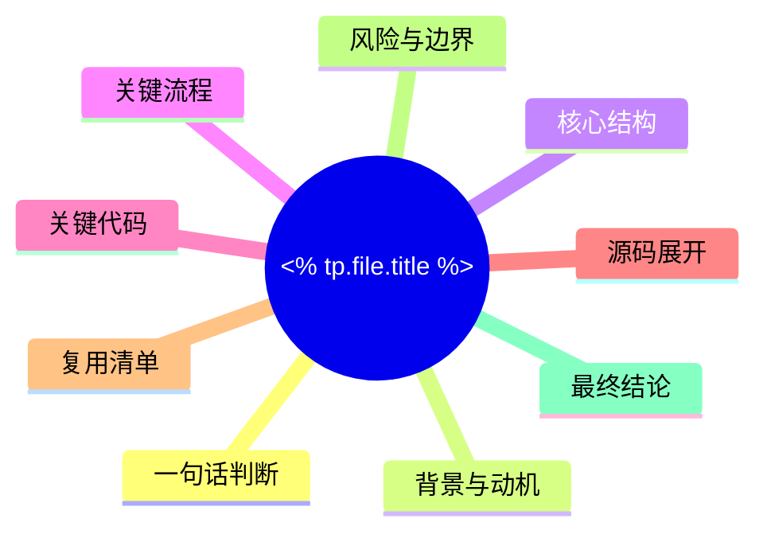

# 🎯 <% tp.file.title %>

> 这是一份单笔记深度分析模板。目标不是“写很多”，而是“写完整”。

## 0. 先做判断

- 一句话判断：
- 它的真实价值：
- 它最适合的人：
- 它最不适合的人：
- 是否值得继续深挖源码：
- 是否值得直接复用：

## 1. 树状图



## 2. 背景与动机

- 它想解决什么问题：
- 旧方案为什么不够好：
- 它默认面向谁：
- 它的设计目标：

## 3. 文字描述

- 先用中文讲清楚它是什么。
- 再讲清楚它为什么存在。
- 再讲清楚它在系统里的位置。

## 4. 代码解析

### 4.1 入口

- 文件：
- 函数：
- 作用：
- 输入：
- 输出：

```text
```

### 4.2 核心逻辑

- 文件：
- 函数：
- 作用：
- 为什么是核心：

```text
```

## 5. 源码

> 源码默认全部展开，不折叠。  
> 如果一份文件太长，就继续往下贴，不要省略。

### 5.1 文件清单

- 文件 1：
- 文件 2：
- 文件 3：

### 5.2 源码正文

```text
```

## 6. 运行与验证

- 怎么跑：
- 怎么验证：
- 成功标准：
- 失败标准：
- 最小 smoke test：

## 7. 复用与反例

- 可以抄走的：
- 不能照搬的：
- 最容易踩坑的：

## 8. 最终结论

- 一句话总结：
- 三句话总结：
- 值得不值得：

## 9. 行动清单

- [ ] 看懂判断
- [ ] 看懂树状图
- [ ] 看懂代码
- [ ] 看懂源码
- [ ] 写出复用点
