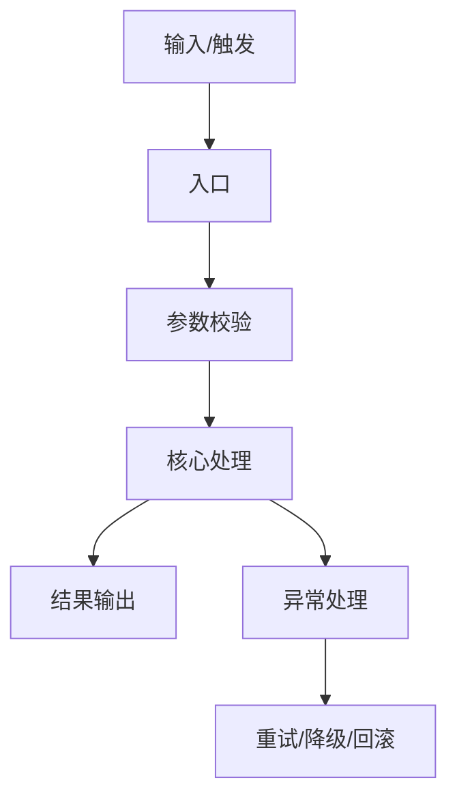

---
tags: [template, second-brain, analysis, meaningful]
type: meaningful-analysis
created: "{{date}}"
status: "draft"
title: "{{title}}"
source_url: ""
source_type: ""
focus: ""
audience: ""
language: "zh-CN"
template_version: "3.0"
---

# {{title}}

> 这份模板的目标不是写得更长，而是让每一段都能回答一个真实问题：
> 它是什么，为什么存在，值不值得继续看，能不能复用，风险在哪，下一步怎么做。

## 0. 先做判断

- 一句话判断：
- 这份内容解决的核心问题：
- 它最适合的人：
- 它最不适合的人：
- 你现在该不该继续看：
- 你看完后最可能得到什么：
- 你最可能踩的坑：
- 最终价值是知识、代码、方法，还是参考素材：

## 1. 元信息

- 标题：
- 来源类型：
- 来源链接：
- 原始语言：
- 主题领域：
- 发布时间：
- 最近更新时间：
- 作者/维护者：
- 许可证/版权：
- 规模：
- 关键标签：
- 当前成熟度：
- 是否活跃：
- 是否值得深挖源码：
- 是否值得直接落地：

## 2. 背景与动机

- 这个东西先前出现在哪个场景：
- 它当时暴露了什么问题：
- 原来人们怎么做：
- 原来做法为什么不够好：
- 它为什么在这个时间点出现：
- 它想替代什么：
- 它不想替代什么：
- 它默认的用户是谁：
- 它默认的使用前提是什么：
- 它背后的设计动机是什么：

## 3. 一句话解释

- 用最简单的话解释它：
- 用比喻解释它：
- 用开发者语言解释它：
- 用产品语言解释它：
- 用一句话说清它和同类方案的不同：

## 4. 树状图

```mermaid
mindmap
  root(({{title}}))
    一句话结论
    背景与动机
    核心概念
    系统结构
    关键流程
    关键代码
    数据与依赖
    运行与验证
    风险与边界
    可复用点
    反例与警告
    最终判断
```

## 5. 核心概念

- 概念 1：
  - 它是什么：
  - 它解决什么：
  - 它和别的概念的关系：
  - 它的边界：
- 概念 2：
  - 它是什么：
  - 它解决什么：
  - 它和别的概念的关系：
  - 它的边界：
- 概念 3：
  - 它是什么：
  - 它解决什么：
  - 它和别的概念的关系：
  - 它的边界：

## 6. 系统结构

### 6.1 总体结构

- 第一层模块：
- 第二层模块：
- 第三层模块：
- 入口：
- 中枢：
- 辅助模块：
- 输出端：
- 外部依赖：

### 6.2 结构判断

- 为什么这样分层：
- 为什么不是另一种分法：
- 哪些模块是骨架：
- 哪些模块是皮肤：
- 哪些模块删掉就跑不起来：
- 哪些模块只是优化：

## 7. 关键流程

### 7.1 从输入到输出

- 输入来自哪里：
- 谁触发：
- 先做什么：
- 中间经过哪些状态：
- 哪一步最关键：
- 输出到哪里：
- 哪一步最容易出错：

### 7.2 调用链

- 用户触发点：
- 入口函数：
- 第一跳：
- 第二跳：
- 核心处理：
- 收尾动作：
- 错误处理：
- 退出条件：

### 7.3 Mermaid 流程图



## 8. 关键代码

> 这一部分不追求全，而追求“最能说明本质”。每一段代码都要回答：为什么这样写，如果删掉会发生什么。

### 8.1 入口代码

- 文件：
- 函数/类：
- 职责：
- 输入：
- 输出：
- 依赖：
- 错误路径：

```text
```

### 8.2 核心逻辑

- 文件：
- 函数/类：
- 职责：
- 关键条件：
- 关键状态：
- 为什么它是核心：

```text
```

### 8.3 设计模式

- 用到了什么模式：
- 为什么用这个模式：
- 它解决了什么重复问题：
- 如果不用会怎样：
- 是否过度设计：

```text
```

### 8.4 异常与边界

- 空值：
- 空文件：
- 网络失败：
- 权限失败：
- 超时：
- 重试：
- 降级：
- 回滚：
- 日志：
- 告警：

```text
```

## 9. 运行与验证

- 怎么启动：
- 怎么检查它真的跑起来：
- 最小可复现步骤：
- smoke test：
- 成功标准：
- 失败标准：
- 怎么定位问题：
- 哪些日志最重要：

```bash
# 启动

# 验证

# 观察日志
```

## 10. 数据与依赖

- 直接依赖：
- 间接依赖：
- 外部服务：
- 认证/权限：
- 配置项：
- 环境变量：
- 可能失效的环节：
- 版本敏感点：

## 11. 深度解释

- 它真正解决了什么硬问题：
- 它把哪些复杂度转移了出去：
- 它把哪些复杂度留在了内部：
- 它的设计代价是什么：
- 它的长期维护成本是什么：
- 它为什么可能更好：
- 它为什么可能更糟：

## 12. 适用边界

- 适合的规模：
- 不适合的规模：
- 适合的团队：
- 不适合的团队：
- 适合的性能要求：
- 不适合的性能要求：
- 适合的演进阶段：
- 不适合的演进阶段：

## 13. 代码和源码

> 源码默认完整展开，不折叠。  
> 如果太长，就按“文件 -> 模块 -> 函数 -> 片段”拆开。

### 13.1 文件清单

- 文件 1：
- 文件 2：
- 文件 3：
- 文件 4：
- 文件 5：

### 13.2 源码文件 1

```text
```

### 13.3 源码文件 2

```text
```

### 13.4 关键片段说明

- 片段 1 为什么重要：
- 片段 2 为什么重要：
- 片段 3 为什么重要：
- 哪些地方必须原样保留：
- 哪些地方可以抽象成伪代码：

## 14. 比较与参照

- 传统方案：
- 同类开源方案：
- 商业方案：
- 更轻量方案：
- 更强方案：
- 这份内容在你项目里的对应位置：
- 哪些可以直接迁移：
- 哪些只能借鉴思想：

## 15. 复用清单

- 可以直接抄走的结构：
- 可以直接抄走的代码：
- 可以直接抄走的命名：
- 可以直接抄走的流程：
- 可以直接抄走的测试：
- 可以直接抄走的指标：
- 可以直接抄走的配置：
- 不建议抄走的部分：

## 16. 反例与警告

- 最容易误读的地方：
- 最容易夸大的地方：
- 最容易忽略的地方：
- 最容易踩坑的地方：
- 看起来对其实错的地方：
- 看起来复杂其实没必要的地方：

## 17. 深度判断

- 它的真正创新点：
- 它的真正成本：
- 它的真正风险：
- 它的真正优势：
- 它能不能替代旧方案：
- 替代成本有多高：
- 它会不会昙花一现：
- 它的长期价值：
- 它现在处于什么阶段：
- 值不值得在项目里借鉴：
- 借鉴时最该保留什么：
- 借鉴时最该避免什么：

## 18. 最终结论

- 一句话总结：
- 三句话总结：
- 如果只记一个判断：
- 如果只记三个点：
- 如果只做一件事：
- 后续最值得看的下一篇/下一份源码：

## 19. 行动清单

- [ ] 看完一句话结论
- [ ] 读完背景与动机
- [ ] 看懂树状图
- [ ] 跟着流程走一遍
- [ ] 打开关键代码核对
- [ ] 看完源码清单
- [ ] 记录可复用点
- [ ] 记录反例与警告
- [ ] 写下最终判断

## 20. 个人备忘

- 我最容易忘记的点：
- 我以后再看时最想先问的问题：
- 这份内容对我当前项目的启发：
- 这份内容对我当前决策的影响：
