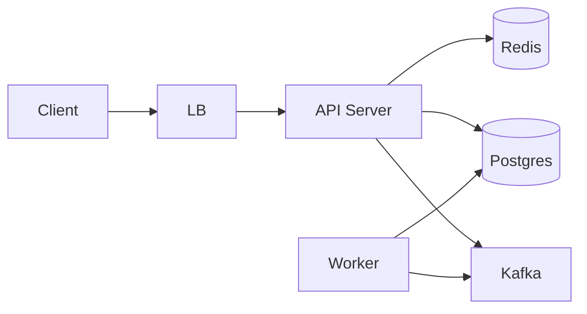

# 开源项目深度解析｜{{title}}

> 创建于 {{date}}｜目标：14 步吃透 1 个开源项目，从"看代码"到"偷过来用"
> 流程：点状解析 → 思维导图 → 落地模板 → 反例警示

## 项目元信息

| 字段 | 值 |
|------|-----|
| 项目名 | {{title}} |
| 仓库 URL | |
| 主语言 | |
| License | |
| Stars | |
| Last commit | |
| 解析难度 | ⭐~⭐⭐⭐⭐⭐ |
| 状态 | 0/14 完成 |

## 进度追踪

- [ ] 0. 解析前准备
- [ ] 1. 开发计划书（Charter）
- [ ] 2. 项目框架（Skeleton）
- [ ] 3. 项目画像（Profile）
- [ ] 4. 架构设计（Architecture）
- [ ] 5. 代码深度解析（带 WHY）⭐
- [ ] 6. 运行机制（Bring It Up）
- [ ] 7. 演进历史（Time Travel）
- [ ] 8. 质量保障（How It Doesn't Break）
- [ ] 9. 生态依赖（Map of the World）
- [ ] 10. 生产实践（Battle-Tested）
- [ ] 11. 社区文化（People & Process）
- [ ] 12. 教训总结（Steal / Avoid）
- [ ] 13. 学习卡片（Cheat Sheet）

---

## 0. 解析前的 5 个准备

**[点状解析]**：拿到仓库后先做 5 件不起眼但极重要的事，避免后面返工。

**[思维导图]**
```
解析前准备
├── 0.1 克隆仓库（--depth 1 瘦身）
├── 0.2 建 _analysis 子目录（13 个分类）
├── 0.3 写问题清单（5 问）
├── 0.4 速查表（meta 信息）
└── 0.5 锁定 commit（避免中途漂移）
```

**[落地模板]**
```bash
# 0.1 克隆
git clone --depth 1 https://github.com/<org>/<repo>.git
cd <repo>

# 0.2 建 13 个分类目录
mkdir -p _analysis/{plan,framework,profile,arch,code,run,history,quality,deps,prod,community,lesson,extract}

# 0.3 问题清单
cat > _analysis/00-questions.md <<'EOF'
1. 这个项目解决什么真实问题？谁在用？
2. 为什么用这种语言/架构，而不是另一种？
3. 核心数据流是什么？钱/请求/事件怎么走？
4. 哪 3 个文件是"骨架"，删掉就跑不起来？
5. 最容易踩的坑是什么？怎么避？
EOF

# 0.4 速查表
echo "REPO=$REPO  STAR=  LANG=  LICENSE=  LAST_COMMIT=" > _analysis/summary.txt

# 0.5 锁定 commit
git rev-parse HEAD > _analysis/locked-commit.txt
```

**[反例警示]**
- ❌ 没用 `--depth 1` → 大仓库拉半天还失败
- ❌ 目录没分类 → 文件全堆一起 = 第二次重做
- ❌ 没锁 commit → 写到一半上游 push 了你不知道

---

## 1. 开发计划书（Project Charter）

**[点状解析]**：仿企业立项文档，把项目当成"我要复刻的产品"来写，10 分钟判断"值不值得学"。

**[思维导图]**
```
开发计划书（Charter）
├── 1.1 项目名 + 一句话定位
├── 1.2 核心问题（用户痛点）
├── 1.3 目标用户（个人/团队/企业）
├── 1.4 商业模式（赞助/SaaS/捐赠）
├── 1.5 关键里程碑（v0.1/v1.0/当前）
├── 1.6 团队规模（1/5-10/50+）
├── 1.7 当前状态（活跃/维护/归档）
└── 1.8 复刻难度（⭐~⭐⭐⭐⭐⭐）
```

**[落地模板]**
```bash
# 1.1 拉元信息
gh repo view <org>/<repo> --json name,description,stargazerCount,forkCount,
  createdAt,pushedAt,licenseInfo,primaryLanguage,languages
gh api repos/<org>/<repo>/topics
```

输出 → 写入本节：

| 字段 | 内容 |
|------|------|
| 项目名 | |
| 一句话定位 | |
| 核心问题 | （用户痛点） |
| 目标用户 | 个人 / 团队 / 企业 |
| 商业模式 | 赞助 / SaaS / 商业版 / 捐赠 |
| 关键里程碑 | v0.1 / v1.0 / 当前版本 |
| 团队规模 | 1 / 5-10 / 50+ |
| 当前状态 | 活跃 / 维护 / 归档 |
| 复刻难度 | ⭐~⭐⭐⭐⭐⭐ |

**[反例警示]**
- ❌ 只看 star 数就开干 → 1 万 star 的玩具项目不值得学 1 个月
- ❌ 不看 license → GPL-3.0 商用直接踩坑
- ❌ 不看 pushedAt → 仓库 3 年没动了 = 学了也用不上

---

## 2. 项目框架（Repo Skeleton Map）

**[点状解析]**：不读代码，先看"目录怎么长"。约定 > 约定俗成：99% 的项目按语言惯例布局。

**[思维导图]**
```
项目框架
├── 2.1 顶层结构（tree -L 2）
├── 2.2 配置入口（Makefile/package.json/go.mod）
├── 2.3 代码入口（main.*/app.*/server.*/cli.*）
├── 2.4 文档位置（docs/README/CHANGELOG）
├── 2.5 测试位置（test/tests/*_test.*）
└── 2.6 部署相关（deploy/k8s/docker）
```

**[落地模板]**
```bash
# 2.1 顶层结构
ls -la
tree -L 2 -I 'node_modules|.git|vendor|dist|build' > _analysis/framework/tree-l2.txt
tree -L 3 -I 'node_modules|.git|vendor|dist|build|test|tests' > _analysis/framework/tree-l3.txt

# 2.2 配置入口
ls -la | grep -E '(Makefile|package.json|go.mod|Cargo.toml|pyproject|setup.py|pom.xml|build.gradle|composer.json|Gemfile|Rakefile)'

# 2.3 代码入口
find . -maxdepth 2 -type f \( -name 'main.*' -o -name 'app.*' -o -name 'server.*' -o -name 'index.*' -o -name 'cli.*' \) | grep -v node_modules | grep -v vendor

# 2.4 文档
ls docs/ 2>/dev/null; cat README.md | head -50

# 2.6 部署
ls deploy/ k8s/ manifests/ charts/ docker-compose* Dockerfile* 2>/dev/null
```

**[按语言惯例速查]**
- Go: `cmd/` + `internal/` + `pkg/`
- Node: `src/` + `lib/` + `bin/`
- Python: `package_name/` + `tests/`
- Rust: `src/` + `benches/` + `examples/`
- Java: `src/main/java` + `src/test/java`
- PHP: `app/` + `config/` + `routes/`
- Ruby: `lib/` + `app/` + `spec/`

**[反例警示]**
- ❌ 上来就 `cat main.go` → 找不到入口
- ❌ 忽略 vendor/node_modules → 看 10 万行依赖以为项目很大
- ❌ 错过 docs/ → 错过作者的"自述"

---

## 3. 项目画像（Profile）

**[点状解析]**：用 5 个数字量化"这个项目长什么样"，5 分钟形成判断。

**[思维导图]**
```
项目画像
├── 3.1 代码量（cloc）
├── 3.2 语言占比（linguist）
├── 3.3 贡献者活跃度
├── 3.4 提交节奏（git log --since）
└── 3.5 依赖图（直接 + 间接）
```

**[落地模板]**
```bash
# 3.1 代码量
cloc . --not-match-d='(node_modules|vendor|dist|build|test)' --quiet | tail -n 5

# 3.2 语言占比
github-linguist  # 或 cloc --csv

# 3.3 贡献者活跃度
gh api repos/<org>/<repo>/contributors | jq -r '.[].login' | head -20
gh api 'repos/<org>/<repo>/stats/participation' | jq '.all | add'

# 3.4 提交节奏
git log --since='2 years ago' --pretty='%Y-%m' | sort | uniq -c | tail -24

# 3.5 依赖图
cat go.mod | head -50
cat package.json | jq '.dependencies, .devDependencies'
```

输出 → 写入本节：

| 维度 | 数据 | 含义 |
|------|------|------|
| 总代码行 | | |
| 主语言占比 | | |
| 贡献者 | | |
| 月均提交 | | |
| 直接依赖 | | |
| 间接依赖 | | |

**[反例警示]**
- ❌ cloc 包含测试 → 把数字虚高 2 倍
- ❌ 只看 contributors 总数 → 1 人贡献 90% = 伪活跃
- ❌ 忽略 indirect deps → 漏洞扫描时漏一半

---

## 4. 架构设计（Architecture Deep Dive）

**[点状解析]**：架构是"项目的骨骼图"。4+1 视图标准：逻辑、进程、部署、开发、场景。

**[思维导图]**
```
架构设计
├── 4.1 部署图（节点 + 容器 + 网络）
├── 4.2 组件图（服务 + 依赖 + 协议）
├── 4.3 4+1 视图
│   ├── 4.3.1 逻辑视图（类/模块）
│   ├── 4.3.2 进程视图（进程/线程）
│   ├── 4.3.3 部署视图（机器/容器）
│   ├── 4.3.4 开发视图（包/目录）
│   └── 4.3.5 场景视图（用户故事序列）
└── 4.4 关键设计决策 ADR（每组件一份）
```

**[落地模板]**
```bash
# 4.1 找部署描述
ls deploy/ docs/architecture/ 2>/dev/null
find . -iname '*architecture*' -o -iname '*design*' | head

# 4.2 抓核心服务/进程
docker ps            # docker-compose 项目

# 4.3 找端口/协议声明
grep -rE ':(80|443|3306|5432|6379|8080|9090|27017)\b' --include='*.go' --include='*.py' --include='*.yaml' -l . | head
```

组件图（Mermaid）：


关键设计决策 ADR 模板：
```markdown
## ADR-001: 为什么用 XXX 而不是 YYY
- 状态：已采纳
- 背景：
- 决策：
- 理由：
- 代价：
- 替代：
```

**[反例警示]**
- ❌ 只画一个总图 → 看不清细节
- ❌ 没有 ADR → 不知道为什么这样设计
- ❌ 忽略部署视图 → 上线才发现问题

---

## 5. 代码深度解析（带 WHY）⭐ 重点

**[点状解析]**：每读一个文件，必须回答"这段代码为什么这样写"。这是与普通"读源码"最大的区别。

**[思维导图]**
```
代码深度解析
├── 5.1 找骨架代码（删了就崩）
│   ├── 5.1.1 引用最多的文件
│   ├── 5.1.2 最大文件
│   └── 5.1.3 核心入口
├── 5.2 单文件分析卡（每个核心文件一张）
├── 5.3 设计模式识别清单
├── 5.4 反模式 / 坑位识别
└── 5.5 性能关键路径
```

### 5.1 找骨架代码

```bash
# 5.1.1 找被引用最多的文件
git ls-files | xargs -I{} sh -c 'echo "$(grep -rl "{}" --include="*.go" --include="*.py" --include="*.ts" 2>/dev/null | wc -l) {}"' 2>/dev/null \
  | sort -rn | head -20

# 5.1.2 找最大文件
find . -type f \( -name '*.go' -o -name '*.py' -o -name '*.ts' \) -not -path '*/test/*' -not -path '*/vendor/*' \
  -exec wc -l {} \; | sort -rn | head -20

# 5.1.3 找核心入口
cat cmd/server/main.go
cat src/index.ts
cat package_name/__main__.py
```

### 5.2 单文件分析卡（每个核心文件一张）

```markdown
## 文件：xxx/xxx.go

### 职责（What）

### 关键类型

### 核心流程

### 关键代码段
```go
// 关键代码
```

### 为什么这样写（WHY）❗

### 可优化点

### 借鉴价值
```

### 5.3 设计模式识别清单

```bash
# 找单例
grep -rn 'sync.Once' --include='*.go' .

# 找工厂
grep -rnE 'func New[A-Z][a-zA-Z]*\(' --include='*.go' . | head

# 找观察者/回调
grep -rn 'chan.*func' --include='*.go' .
grep -rn 'EventEmitter\|on(\|emit(' --include='*.ts' . | head

# 找中间件/装饰器
grep -rnE 'middleware|decorator|@.*wrap' --include='*.py' --include='*.ts' . | head
```

| 模式 | 出现位置 | 解决什么问题 |
|------|----------|--------------|
| Factory | | |
| Observer | | |
| Middleware | | |
| Pool | | |

### 5.4 反模式 / 坑位识别

```bash
# 找 panic
grep -rn 'panic(' --include='*.go' . | grep -v _test | head

# 找裸 goroutine
grep -rn 'go func' --include='*.go' . | head

# 找全局可变状态
grep -rn 'var.*=.*make\|var.*=.*new' --include='*.go' . | grep -v _test | grep -v func

# 找大锁
grep -rnE 'sync\.Mutex|Lock\(\)|RLock' --include='*.go' . | head

# 找 magic number
grep -rnE '\b[0-9]{4,}\b' --include='*.go' --include='*.py' . | grep -v _test | head
```

### 5.5 性能关键路径

```bash
grep -rnE 'sync\.Pool|mmap|sendfile|io.Copy|bufio' --include='*.go' . | head
```

每个热点回答 3 问：
1. 为什么这里是热点？
2. 作者用了什么技巧？
3. 自己项目能不能复用？

**[反例警示]**
- ❌ 只看 What 不看 Why → 抄过来不理解，下次不会变通
- ❌ 跳过测试代码 → 错过"作者怎么自测"的精华
- ❌ 忽略 vendor/ 依赖代码 → 失去"作者如何用 std lib"的线索

---

## 6. 运行机制（Bring It Up）

**[点状解析]**：跑起来才算真正开始。光看代码是幻觉。

**[思维导图]**
```
运行机制
├── 6.1 找启动脚本（Makefile/run/serve）
├── 6.2 本地起服务（make run / docker compose up）
├── 6.3 端到端 smoke test（curl / httpie）
├── 6.4 看进程/线程/连接（ps / /proc）
└── 6.5 关键路径 trace（日志/链路追踪）
```

**[落地模板]**
```bash
# 6.1 找启动脚本
ls -la | grep -E 'Makefile|run|start|serve'
cat Makefile | grep -A2 -E '^(run|start|dev|serve):'

# 6.2 本地起服务
make run 2>&1 | tee _analysis/run/stdout.log &
SERVER_PID=$!
sleep 5

# 6.3 端到端 smoke test
curl -sS http://localhost:8080/health
curl -sS http://localhost:8080/api/v1/version

# 6.4 看进程/线程/连接
ps -p $SERVER_PID -o pid,pcpu,pmem,rss,vsz,comm
ls /proc/$SERVER_PID/fd | wc -l
cat /proc/$SERVER_PID/status | grep Threads

# 6.5 关键路径 trace
curl -sS -H 'X-Trace: yes' http://localhost:8080/api/xxx | jq .
tail -f _analysis/run/stdout.log
kill $SERVER_PID
```

| 指标 | 数值 |
|------|------|
| 启动耗时 | |
| 首屏响应 | |
| p99 延迟 | |
| 内存占用 | |
| 打开 fd | |
| 线程数 | |
| 关键日志 | |

**[反例警示]**
- ❌ 跳过 smoke test → 代码看懂了一跑就崩
- ❌ 不看 /proc/PID/fd → 资源泄漏查不出
- ❌ 不打 trace → 链路黑盒

---

## 7. 演进历史（Time Travel）

**[点状解析]**：看一个项目的"人生"，比看它"现在"更能学到东西。

**[思维导图]**
```
演进历史
├── 7.1 看里程碑（releases / tags）
├── 7.2 找改名/移动/删除
├── 7.3 灵魂人物（shortlog）
├── 7.4 关键 issue / PR
└── 7.5 破坏性变更（BREAKING CHANGES）
```

**[落地模板]**
```bash
# 7.1 里程碑
git log --oneline --decorate --graph | head -100
gh release list --limit 20

# 7.2 改名/移动/删除
git log --diff-filter=R --summary | grep -E '^ rename' | head
git log --diff-filter=D --summary | grep -E '^ delete' | head

# 7.3 灵魂人物
git shortlog -sn --all | head -20
gh api repos/<org>/<repo>/contributors?per_page=100 | jq -r '.[] | "\(.contributions)\t\(.login)"'

# 7.4 关键 issue / PR
gh issue list --state closed --limit 30 --search 'label:design sort:created-asc'
gh pr list --state merged --search 'is:pr sort:created-asc' --limit 30

# 7.5 破坏性变更
git log --grep='BREAKING' --oneline | head
gh api repos/<org>/<repo>/releases | jq -r '.[] | select(.prerelease==false) | "\(.tag_name): \(.name)"'
```

| 阶段 | 时间 | 关键 PR/Issue | 学到的事 |
|------|------|---------------|----------|
| v0.x 原型 | | | |
| v1.0 稳定 | | | |
| v2.0 重写 | | | |
| 现状 | | | |

**[反例警示]**
- ❌ 只看 master 分支 → 错过"为什么不这么写"的讨论
- ❌ 忽略 v1 → v2 的 commit → 错过"推翻重来的理由"
- ❌ 不看 issue → 错过设计权衡

---

## 8. 质量保障（How It Doesn't Break）

**[点状解析]**：测试 + CI + Lint + 性能基准，4 道防线。

**[思维导图]**
```
质量保障
├── 8.1 测试覆盖（单测/集成/E2E/模糊）
├── 8.2 CI 配置（.github/workflows/）
├── 8.3 Lint / Format
├── 8.4 性能回归（benchmark）
└── 8.5 静态分析
```

**[落地模板]**
```bash
# 8.1 测试覆盖
find . -name '*_test.*' -o -name '*.test.*' -o -name 'test_*.py' | grep -v node_modules | wc -l
go test -cover ./... 2>&1 | tail
npm run coverage 2>&1 | tail
pytest --cov=package_name 2>&1 | tail

# 8.2 CI
ls .github/workflows/
cat .github/workflows/ci.yml | head -50

# 8.3 Lint
ls .golangci* .eslint* .prettier* .flake8 pyproject.toml 2>/dev/null
grep -A5 'lint\|format' Makefile | head

# 8.4 模糊测试 / 性能回归
grep -rn 'go-fuzz\|quickcheck\|hypothesis\|fast-check\|k6' --include='*.go' --include='*.py' --include='*.ts' . | head
find . -name 'bench*' -o -name '*_bench.go' -o -name 'benchmark*.py' | head

# 8.5 静态分析
go vet ./...
mypy .
eslint .
```

| 维度 | 数据 |
|------|------|
| 单测覆盖 | |
| 集成测试 | |
| E2E | |
| CI 平台 | |
| Lint 工具 | |
| 模糊测试 | |
| 性能基准 | |

**[反例警示]**
- ❌ 只看覆盖率不看断言质量 → 100% 覆盖但测了空函数
- ❌ 没 CI → 本地能跑别人拉下来崩
- ❌ 没模糊测试 → parser 永远有边角 case 没覆盖

---

## 9. 生态依赖（Map of the World）

**[点状解析]**：依赖图 = 项目的"供应链"。一个 GPL 依赖毁掉整个商业版。

**[思维导图]**
```
生态依赖
├── 9.1 直接依赖（go.mod / package.json）
├── 9.2 关键依赖（被引用最多的）
├── 9.3 依赖健康度（star/last push/license）
├── 9.4 License 合规
└── 9.5 安全公告（CVE）
```

**[落地模板]**
```bash
# 9.1 直接依赖
cat go.mod package.json pyproject.toml Cargo.lock 2>/dev/null | head -100

# 9.2 关键依赖
grep -rl '"github.com/xxx/yyy"' --include='*.go' . | wc -l

# 9.3 依赖健康度
for dep in $(grep -oE '"[a-z0-9._/-]+"' go.sum 2>/dev/null | head); do
  echo "=== $dep ==="
  gh api repos/$dep --jq '.stargazerCount, .licenseInfo.spdxId, .pushedAt' 2>/dev/null
done

# 9.4 License
cat LICENSE

# 9.5 安全公告
gh api graphql -f query='{ repository(owner:"<org>", name:"<repo>") { vulnerabilityAlerts(first:10) { nodes { advisory { summary severity } } } } }'
```

| 依赖 | 用途 | 风险 | 替代品 |
|------|------|------|--------|
| | | | |

**[反例警示]**
- ❌ 只看直接依赖 → 漏掉间接 GPL
- ❌ 不看 license → 上线后被法务叫停
- ❌ 不看 pushedAt → 用了一个已死 3 年的库

---

## 10. 生产实践（Battle-Tested）

**[点状解析]**：生产里踩过的坑比文档里写得多。看项目在 K8s 怎么部署、怎么监控、怎么降级。

**[思维导图]**
```
生产实践
├── 10.1 K8s 部署（manifests / helm）
├── 10.2 监控埋点（prometheus / otel）
├── 10.3 降级 / 限流（circuit / rate / retry）
├── 10.4 配置中心（viper / consul / etcd）
└── 10.5 谁在生产用（KubeCon / 案例）
```

**[落地模板]**
```bash
# 10.1 K8s
ls deploy/k8s/ manifests/ charts/ 2>/dev/null
find . -name '*.yaml' -path '*k8s*' -o -name 'helm*' | head

# 10.2 监控埋点
grep -rnE 'prometheus|opentelemetry|datadog' --include='*.go' --include='*.py' --include='*.ts' . | head
grep -rn 'metrics\|tracing\|logger' --include='*.go' . | head

# 10.3 降级/限流
grep -rnE 'circuit.?break|rate.?limit|throttle|backoff|retry' --include='*.go' --include='*.py' . | head

# 10.4 配置中心
grep -rnE 'viper|consul|nacos|etcd' --include='*.go' . | head
```

| 实践 | 项目里怎么做的 | 我能不能抄 |
|------|----------------|------------|
| 配置热更新 | | |
| 优雅停服 | | |
| 限流 | | |
| 链路追踪 | | |
| 健康检查 | | |
| 结构化日志 | | |

**[反例警示]**
- ❌ 只看 README 怎么跑 → 上线发现没考虑 K8s readiness
- ❌ 没看优雅停服 → K8s 滚动更新丢请求
- ❌ 没看链路追踪 → 出问题查不到是哪个服务慢

---

## 11. 社区文化（People & Process）

**[点状解析]**：项目能不能长寿，10% 看代码，90% 看人。

**[思维导图]**
```
社区文化
├── 11.1 治理模式（BDFL/委员会/公司）
├── 11.2 RFC / 设计文档（proposals）
├── 11.3 维护者结构（核心 + 贡献者）
├── 11.4 沟通渠道（slack / mailing list）
└── 11.5 议题活跃度（open/closed ratio）
```

**[落地模板]**
```bash
# 11.1 治理
cat GOVERNANCE.md CONTRIBUTING.md CODE_OF_CONDUCT.md 2>/dev/null
ls -la | grep -iE 'govern|conduct|contrib|charter|roadmap'

# 11.2 RFC
find . -iname 'rfc*' -o -iname 'design*' -o -iname 'proposal*' | head

# 11.3 维护者
gh api repos/<org>/<repo>/collaborators --jq '.[].login'
cat MAINTAINERS.md 2>/dev/null

# 11.4 沟通
grep -rE 'slack|discord|mailing list' README.md | head

# 11.5 议题活跃度
gh api 'search/issues?q=repo:<org>/<repo>+is:open' --jq '.total_count'
gh api 'repos/<org>/<repo>/issues?state=closed&since=2025-01-01&per_page=1' --jq '.[0].closed_at'
```

| 维度 | 数据 | 含义 |
|------|------|------|
| 治理模式 | | |
| 维护者 | | |
| RFC 流程 | | |
| 开放 issue | | |
| 关闭率 | | |
| 会议 | | |

**[反例警示]**
- ❌ 只看代码不看人 → 投奔了一个 BDFL 跑路项目
- ❌ 不看 issue 响应 → 这个项目其实已死
- ❌ 不看 RFC → 错过"为什么改 API"的讨论

---

## 12. 教训总结（What To Steal / What To Avoid）

**[点状解析]**：所有 11 步的最终落点。偷 3 个、避 3 个、画出 7 天复刻路线。

**[思维导图]**
```
教训总结
├── 12.1 必偷的 3 件事
├── 12.2 必避的 3 个坑
├── 12.3 7 天复刻路线图
└── 12.4 给项目打分（5 维）
```

### 12.1 必偷的 3 件事
1.
2.
3.

### 12.2 必避的 3 个坑
1.
2.
3.

### 12.3 7 天复刻路线图
```
- D1: 跑起来 → curl put/get，混个脸熟
- D2: 读 xxx → 画状态机
- D3: 读 xxx → 理解持久化
- D4: 读 xxx → 理解 RPC
- D5: 单测 + benchmark 复现
- D6: 自己写个 200 行的 mini-xxx
- D7: 写一篇博客把上面 5 天串起来
```

### 12.4 项目打分卡（5 维）

| 维度 | 1 分 | 3 分 | 5 分 | 实际 |
|------|------|------|------|------|
| 代码质量 | 凑合 | 工业级 | 教科书 | |
| 文档完整 | 没有 | 有 README | 完整 + RFC | |
| 社区活跃 | 死了 | 有 issue 响应 | 繁荣 | |
| 设计优雅 | 能用 | 合理 | 艺术 | |
| 可借鉴 | 抄不抄无所谓 | 部分可抄 | 必抄 | |

**[反例警示]**
- ❌ 只偷不避 = 抄了坑过来
- ❌ 7 天路线图没坚持 = 学了就忘
- ❌ 不打分 = 不知道学完值不值

---

## 13. 学习卡片（Your Personal Cheat Sheet）

**[点状解析]**：所有解析的最终交付物 = 一张属于自己的"学习卡片"。

**[思维导图]**
```
学习卡片
├── 13.1 一句话价值
├── 13.2 3 个核心洞察
├── 13.3 5 段必读代码
├── 13.4 1 个反模式
├── 13.5 1 个可复用模式
└── 13.6 马上能用的 3 件事（TODO）
```

### 《{{title}}》学习卡片

#### 一句话价值
> （用 1 句话说清楚这个项目"为什么值得学"）

#### 3 个核心洞察
1. ...
2. ...
3. ...

#### 5 段必读代码
1. `path/to/file:line` — 一句话
2. ...
3. ...
4. ...
5. ...

#### 1 个反模式
- ...

#### 1 个可复用模式
- ...

#### 我能马上用的 3 件事
1. [ ] ...
2. [ ] ...
3. [ ] ...

**[反例警示]**
- ❌ 没卡片 = 看完就忘
- ❌ 没 TODO = 不会真的用
- ❌ 一句话价值说不清 = 还没真懂

---

## 14. 项目特点速查

按类型选看，解析时优先看这些：

### 后端基础架构（etcd/redis/nginx）
- ☐ **Raft 实现**（etcd）：状态机 + 持久化 + 快照
- ☐ **单线程事件循环**（redis）：epoll + 内存池 + AOF/RDB
- ☐ **master/worker 进程模型**（nginx）：配置热更新 + 优雅升级
- ☐ **zero-copy**（nginx sendfile/kafka）：减少内核态切换
- ☐ **LRU + 淘汰策略**（redis）：内存管理

### 分布式系统（k8s/tikv）
- ☐ **controller 模式**（k8s）：声明式 + reconcile loop
- ☐ **scheduler 框架**（k8s）：plugin 链 + 过滤打分
- ☐ **Multi-Raft**（tikv）：分片并行 + 范围分裂
- ☐ **operator 模式**（k8s）：CRD + 自定义控制器

### Web 全栈（next.js/django）
- ☐ **SSR/SSG/ISR**（next.js）：同构 + 缓存策略
- ☐ **ORM 实现**（django）：懒加载 + select_related
- ☐ **middleware 链**（fastapi/django）：洋葱模型
- ☐ **plugin 机制**（django）：可插拔应用

### 数据库（postgres/clickhouse）
- ☐ **查询优化器**（postgres）：RBO + CBO
- ☐ **MVCC**（postgres/clickhouse）：多版本并发
- ☐ **WAL**（postgres）：预写日志
- ☐ **列存**（clickhouse）：向量化 + 压缩

### 编程语言（go/rust）
- ☐ **goroutine 调度**（go runtime）：G-M-P 模型
- ☐ **GC**（go）：三色标记 + 写屏障
- ☐ **所有权系统**（rust）：borrow checker
- ☐ **宏系统**（rust）：声明宏 + 过程宏
- ☐ **逃逸分析**（go）：栈分配 vs 堆分配

### AI 工程（pytorch/llama.cpp/vllm）
- ☐ **计算图**（pytorch）：autograd + 动态图
- ☐ **量化**（llama.cpp）：Q4_K_M 量化
- ☐ **PagedAttention**（vllm）：KV cache 内存管理
- ☐ **CUDA kernel**（vllm）：tiling + shared memory
- ☐ **模型并行**（megatron-deepspeed）：TP/PP/DP

### 运维可观测性（prometheus/loki）
- ☐ **TSDB**（prometheus）：block + 压缩 + 倒排
- ☐ **查询引擎**（prometheus）：promql 优化
- ☐ **日志流水线**（loki）：label 索引 + 对象存储
- ☐ **trace 采样**（tempo）：tail-based sampling

### 工具效率（ripgrep/fd/bat）
- ☐ **Rust 性能优化**（ripgrep）：Aho-Corasick + SIMD + mmap
- ☐ **并行**（ripgrep）：rayon + 工作窃取
- ☐ **cli 设计**（fd）：argparse 哲学

### 安全网络（wireguard/tailscale）
- ☐ **Noise 协议**（wireguard）：现代加密握手
- ☐ **DERP 中继**（tailscale）：NAT 穿透
- ☐ **ACL 引擎**（tailscale）：基于标签的策略

---

## 🏷️ 标签

`#开源项目` `#深度解析` `#{{title}}` `#{{language}}`

## 🔗 关联笔记

- [[开源项目深度解析体系]]
- [[每日开源项目抓取任务]]
- [[Obsidian-Dev-Template-System]]
