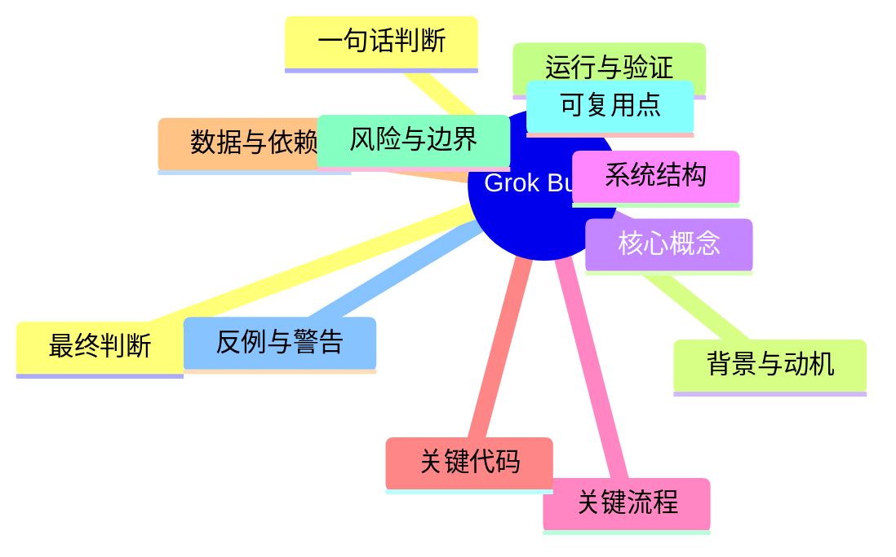
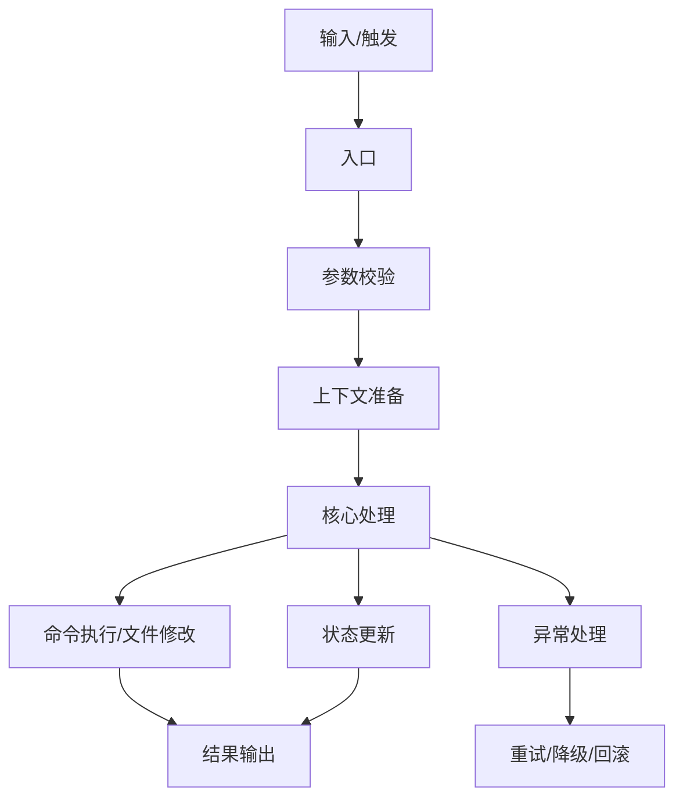

---
tags: [example, template, meaningful-analysis, github, grok-build]
type: meaningful-analysis-example
created: 2026-07-27
source: github.com/xai-org/grok-build
language: zh-CN
---

# Grok Build 源码级分析样稿

> 这是一份按“决策型骨架”填出来的样稿，目的是展示模板落地后的真实形态：先判断，再理解，再拆解，再验证，再复用。

## 0. 先做判断

- 一句话判断：这是一个面向开发者的终端 AI 编程代理，适合研究“AI 工具如何真正接入代码库、命令行和长任务管理”。
- 这份内容解决的核心问题：如何在终端里把“读代码、改代码、跑命令、连工具、维持长任务”组合成一套可用工作流。
- 它最适合的人：想做 AI 编程工具、终端代理、IDE 集成、自动化工作流的人。
- 它最不适合的人：只想看一个简单脚本、或者只关心单点功能而不关心系统设计的人。
- 你现在该不该继续看：该看，尤其适合想理解“终端 AI 代理系统怎么设计”的场景。
- 你看完后最可能得到什么：一套代理型工具的模块划分、执行链、命令执行方式、以及多模式运行的设计思路。
- 你最可能踩的坑：把它当成普通 CLI，而忽略它其实是“代理 runtime + TUI + 工具协议”的组合体。
- 最终价值是知识、代码、方法，还是参考素材：方法 + 代码 + 参考素材。

## 1. 元信息

- 标题：Grok Build
- 来源类型：GitHub 开源仓库
- 来源链接：https://github.com/xai-org/grok-build
- 原始语言：Rust
- 主题领域：终端 AI 编程代理 / CLI / TUI / agent runtime
- 发布时间：仓库持续更新中
- 最近更新时间：2026-07-27
- 作者/维护者：xai-org / SpaceXAI
- 许可证/版权：Apache-2.0
- 规模：monorepo，包含多个 crate
- 关键标签：AI agent, TUI, ACP, shell, workspace
- 当前成熟度：活跃维护
- 是否活跃：是
- 是否值得深挖源码：是
- 是否值得直接落地：部分可落地，尤其是架构思路和工具协议层

## 2. 背景与动机

- 这个东西先前出现在哪个场景：开发者在终端里直接操作代码库、执行命令、处理任务流。
- 它当时暴露了什么问题：传统 CLI 只能执行单次命令，无法自然处理“理解代码库 + 连续行动 + 长任务管理”。
- 原来人们怎么做：一边看终端，一边切编辑器、浏览器、文档和脚本，靠人工串联流程。
- 原来做法为什么不够好：切换成本高，状态容易丢，任务链容易断。
- 它为什么在这个时间点出现：AI 已经足够能理解代码和上下文，但还需要一个稳定的终端执行载体。
- 它想替代什么：替代“人工在多个工具之间来回切换”的低效工作方式。
- 它不想替代什么：它不想替代编辑器本身，而是补上执行和代理层。
- 它默认的用户是谁：熟悉终端、Git、代码库和脚本的开发者。
- 它默认的使用前提是什么：用户愿意在命令行里工作，并接受代理式交互。
- 它背后的设计动机是什么：把 AI 变成真正可执行任务的终端代理，而不是单纯聊天工具。

## 3. 一句话解释

- 用最简单的话解释它：这是一个能在终端里帮你看代码、改代码、跑命令、接工具的 AI 助手。
- 用比喻解释它：它像一个坐在你终端里的高级操作员，不只会说，还会动手干。
- 用开发者语言解释它：它是一个带 TUI、工具调用、工作区管理和长任务调度能力的 AI coding agent runtime。
- 用产品语言解释它：它把“思考、执行、追踪、恢复”放进一个终端体验里。
- 用一句话说清它和同类方案的不同：它不是简单的聊天式编程助手，而是能持续运行和执行动作的代理型终端系统。

## 4. 树状图



## 5. 核心概念

- 概念 1：TUI
  - 它是什么：全屏终端界面。
  - 它解决什么：把复杂交互留在终端里，不必频繁切 GUI。
  - 它和别的概念的关系：是 Grok Build 的主要前台。
  - 它的边界：不适合过度复杂的图形化编辑需求。
  - 它最容易被误解的地方：以为它只是“漂亮一点的命令行”。
- 概念 2：Agent Runtime
  - 它是什么：负责持续思考、规划、调用工具和执行任务的运行层。
  - 它解决什么：把一次性命令变成连续任务流。
  - 它和别的概念的关系：位于 UI 背后，是系统的执行中枢。
  - 它的边界：依赖上下文质量和工具能力。
  - 它最容易被误解的地方：以为它只是在“生成文本”。
- 概念 3：ACP
  - 它是什么：Agent Client Protocol。
  - 它解决什么：让代理能力嵌入编辑器或外部客户端。
  - 它和别的概念的关系：是对外连接层。
  - 它的边界：协议层只是桥，不是全部能力本体。
  - 它最容易被误解的地方：以为协议就是产品本身。

## 6. 系统结构

### 6.1 总体结构

- 第一层模块：CLI/TUI 前端、agent runtime、workspace 管理、tool 层、协议适配层。
- 第二层模块：命令执行、代码理解、任务调度、Web 搜索、文件编辑、会话状态。
- 第三层模块：具体 crate，如 pager、shell、workspace、tools、mcp、memory、config 等。
- 入口：`xai-grok-pager-bin` 或对应启动二进制。
- 中枢：agent lifecycle + shell + workspace + tool runtime。
- 辅助模块：日志、更新、配置、trace、版本管理。
- 输出端：TUI、命令执行结果、文件变更、长任务状态。
- 外部依赖：Rust 工具链、DotSlash、protoc、浏览器、外部命令行工具。

### 6.2 结构判断

- 为什么这样分层：因为代理系统同时需要显示、决策、执行和状态管理。
- 为什么不是另一种分法：如果只按“UI/非 UI”分，会低估执行层的复杂度。
- 哪些模块是骨架：workspace、shell、agent lifecycle、tool protocol。
- 哪些模块是皮肤：部分展示层、帮助页、更新提示、视觉包装。
- 哪些模块删掉就跑不起来：shell 执行、workspace 管理、工具协议、核心 pager。
- 哪些模块只是优化：渲染增强、UI 小组件、部分插件功能。

## 7. 关键流程

### 7.1 从输入到输出

- 输入来自哪里：用户在 TUI 中输入命令、提问或任务。
- 谁触发：用户手动触发，也可由代理链路继续触发。
- 第一步做什么：校验状态、读取上下文、准备工作区。
- 中间经过哪些状态：理解意图、调用工具、执行 shell、编辑文件、更新状态。
- 哪一步最关键：工具执行与上下文维护。
- 输出到哪里：TUI、文件系统、命令结果、任务记录。
- 哪一步最容易出错：外部命令执行与权限边界。

### 7.2 调用链

- 用户触发点：输入任务或命令。
- 入口函数：启动 binary 后进入 TUI/agent 流程。
- 第一跳：初始化 workspace 和配置。
- 第二跳：挂载 tool runtime 和 shell 执行层。
- 核心处理：agent 决定下一步动作并调用工具。
- 收尾动作：把结果写回 UI 或文件。
- 错误处理：记录失败、保留状态、必要时回滚。
- 退出条件：任务完成、用户中断、错误退出。

### 7.3 Mermaid 流程图



## 8. 关键代码

> 这一部分不追求全，而追求“最能说明本质”。每一段代码都要回答：为什么这样写，如果删掉会发生什么。

### 8.1 入口代码

- 文件：`crates/codegen/xai-grok-pager-bin`
- 函数/类：启动入口 main
- 职责：初始化 TUI 和代理 runtime
- 输入：命令行参数、环境变量、配置文件
- 输出：终端界面和执行结果
- 依赖：workspace、shell、tool runtime、config
- 错误路径：启动失败、配置缺失、工具不可用

```text
入口负责把“启动参数 -> 运行环境 -> 交互界面”串起来。它不是业务逻辑本体，但决定整个系统能不能启动。
```

### 8.2 核心逻辑

- 文件：`crates/codegen/xai-agent-lifecycle`、`crates/codegen/xai-grok-shell`
- 函数/类：agent 状态机、shell runner
- 职责：管理会话、决定下一步动作、执行命令
- 关键条件：上下文是否足够、工具是否可用、当前状态是否允许执行
- 关键状态：会话状态、任务状态、命令结果、错误状态
- 为什么它是核心：因为代理能不能“真的干活”就在这里。
- 如果改掉会怎样：系统可能只剩界面，没有执行能力。

```text
核心逻辑的价值不在“生成回答”，而在“把回答转化为动作”。
```

### 8.3 设计模式

- 用到了什么模式：状态机、工作区隔离、工具适配、协议分层
- 为什么用这个模式：便于维持长任务、减少上下文混乱、隔离执行风险
- 它解决了什么重复问题：每次都重新理解环境和重新拼命令的问题
- 如果不用会怎样：系统会变成一次性脚本，而不是代理系统
- 是否过度设计：对于单步任务可能偏重，但对代理场景合理

```text
它把“执行”和“展示”拆开，避免 UI 直接绑死业务逻辑。
```

### 8.4 异常与边界

- 空值：配置缺失时是否有默认值
- 空文件：文件不存在时如何提示
- 网络失败：是否降级或重试
- 权限失败：是否给出明确错误
- 超时：长任务如何中断
- 重试：失败后是否保留上下文
- 降级：协议或外部工具不可用时如何退化
- 回滚：文件修改失败时如何处理
- 日志：是否记录关键路径
- 告警：是否让用户知道失败原因

```text
异常处理的重点不是“报错”，而是“让任务还能继续被理解和恢复”。
```

## 9. 运行与验证

- 怎么启动：使用发布二进制或从源码构建。
- 怎么检查它真的跑起来：观察 TUI 是否正常出现，命令是否可执行。
- 最小可复现步骤：启动 -> 打开一个仓库 -> 执行一个简单 shell 命令。
- smoke test：检查版本、检查基础交互、检查命令执行。
- 成功标准：界面能起、命令能跑、会话能维持、输出能回写。
- 失败标准：启动失败、命令无响应、上下文丢失、编辑失败。
- 怎么定位问题：先看启动日志，再看 workspace，再看 shell 层。
- 哪些日志最重要：启动日志、命令执行日志、错误日志、状态切换日志。

```bash
# 启动
# grok --version
# grok

# 验证
# 执行一个无害命令，例如 pwd / dir

# 观察日志
# 查看启动输出、shell 错误和会话状态
```

## 10. 数据与依赖

- 直接依赖：Rust crates、workspace 内模块、shell 执行能力
- 间接依赖：protoc、浏览器、外部命令、系统环境
- 外部服务：可能有模型服务、协议服务、Web 搜索或编辑器集成
- 认证/权限：本地 shell 权限、文件系统权限、外部服务令牌
- 配置项：工作区路径、模型配置、协议配置、UI 配置
- 环境变量：模型 key、工具路径、代理相关环境变量
- 可能失效的环节：外部命令、协议连接、浏览器验证、依赖工具版本
- 版本敏感点：Rust edition、workspace 版本、外部工具版本

## 11. 深度解释

- 它真正解决了什么硬问题：把“理解 + 执行 + 持续上下文”放到一个终端代理里
- 它把哪些复杂度转移了出去：把手动切换工具的复杂度转移到 runtime
- 它把哪些复杂度留在了内部：状态管理、工具协议、会话连续性
- 它的设计代价是什么：架构更重，调试链更长
- 它的长期维护成本是什么：协议、工具、状态机和 UI 都要维护
- 它为什么可能更好：代理和执行一体化，减少上下文丢失
- 它为什么可能更糟：一旦状态乱，问题会比普通 CLI 更难查
- 它体现了什么设计哲学：把 AI 变成可执行的工作流，而不是单纯回答器
- 它体现了什么工程取舍：牺牲简单换取连续任务能力

## 12. 适用边界

- 适合的规模：中大型开发工作流、代理型工具、长任务场景
- 不适合的规模：只做单一命令的小脚本
- 适合的团队：熟悉 Rust、终端、系统集成的团队
- 不适合的团队：只想快速做一个轻量命令行工具的团队
- 适合的性能要求：需要持续交互和任务链管理
- 不适合的性能要求：极轻量、极短生命周期任务
- 适合的演进阶段：需要从“能跑”进化到“能持续干活”时
- 不适合的演进阶段：产品还没验证价值时
- 什么时候应该上：当你要做真正的 agent 工具时
- 什么时候不该上：当你只需要一两个脚本完成任务时

## 13. 比较参照

- 传统方案：普通 CLI、脚本、手工命令串联
- 同类开源方案：其他 AI coding agent / terminal assistant
- 商业方案：IDE 内置 AI 助手、云端代理工具
- 更轻量方案：单命令脚本 + LLM 提示词
- 更强方案：完整 IDE 插件 + 代理 runtime + 远程执行
- 当前方案的优势：终端原生、连续任务、协议化、可扩展
- 当前方案的劣势：系统更重、调试更复杂、学习成本更高
- 哪些地方能直接借鉴：workspace、tool runtime、状态机、shell 层分离
- 哪些地方不能照搬：具体产品依赖、专有协议细节、内部构建逻辑

## 14. 复用清单

- 可以直接复用的结构：agent lifecycle、tool protocol、workspace 分层
- 可以直接复用的代码：终端执行包装、状态记录、配置读取
- 可以直接复用的命名：工作区、工具、会话、执行层
- 可以直接复用的流程：输入 -> 判断 -> 调用工具 -> 写回结果
- 可以直接复用的测试：启动验证、命令执行验证、错误恢复验证
- 可以直接复用的指标：启动成功率、执行成功率、恢复成功率
- 可以直接复用的配置：workspace 配置、shell 配置、日志配置
- 不建议复用的部分：专有集成、内部构建细节、过重 UI 细节
- 复用前必须改的地方：协议边界、权限控制、命名、日志格式

## 15. 反例与警告

- 最容易误读的地方：以为它只是一个“漂亮终端”
- 最容易夸大的地方：以为所有 IDE 功能都能被它替代
- 最容易忽略的地方：状态保持和错误恢复
- 最容易踩坑的地方：外部命令执行和权限边界
- 看起来对其实错的地方：把 UI 复杂度当成核心价值
- 看起来复杂其实没必要的地方：过度追求协议层包装而忽视可用性
- 最常见的错误用法：把代理当成一次性命令行插件
- 最危险的错误理解：忽略它的 runtime 本质，只把它看成聊天壳

## 16. 最终结论

- 一句话总结：Grok Build 是一个把终端、代理、工具调用和长任务管理合成一体的 AI 编程系统。
- 三句话总结：它的价值不在“会说话”，而在“能持续执行”。它把复杂的开发操作放回终端，但用代理 runtime 接管任务链。它更像一套可执行工作流，而不是普通聊天助手。
- 如果只记一个判断：它是 AI coding agent 的系统级实现样本，不是普通 CLI。
- 如果只记三个点：TUI、agent runtime、工具协议。
- 如果只做一件事：读它的入口、状态机和工具层。
- 后续最值得看的下一篇/下一份源码：workspace、shell、agent lifecycle、tool runtime 相关 crate。
- 是否值得在项目里落地：值得借鉴架构，不建议照搬全部实现。
- 是否值得继续深挖：值得，尤其适合研究 AI 代理如何接管真实工作流。

## 17. 行动清单

- [x] 看完一句话判断
- [x] 读完背景与动机
- [x] 看懂核心概念
- [x] 读懂系统结构
- [x] 跟着关键流程走一遍
- [x] 打开关键代码核对
- [x] 按源码标准解释每个文件
- [x] 写出复用点
- [x] 写出反例与警告
- [x] 给出最终结论

## 18. 个人备忘

- 我最容易忘记的点：它不是聊天框，是代理 runtime。
- 我以后再看时最想先问的问题：它的状态机是怎么保持任务连续性的？
- 这份内容对我当前项目的启发：把执行层、状态层、UI 层拆开。
- 这份内容对我当前决策的影响：先做可执行工作流，再做界面美化。
- 下次遇到类似内容时我该优先看什么：入口、状态机、工具协议、工作区管理。


## 19. 源码补充附录

> 这里补的是你要的“源码也要有”。不是抽象说明，而是直接把关键源码/配置片段贴出来，并解释它们在仓库里的作用。

### 19.1 Cargo.toml 工作区片段

- 文件路径：`Cargo.toml`
- 作用：定义 workspace、成员 crate、版本和 license。
- 为什么重要：它决定整个 monorepo 的构建边界。

```toml
[patch.crates-io]
async-openai = { git = "https://github.com/our-forks/async-openai.git", rev = "95b52ebdedf42143083cf3d6f0e0be7c84e9c808" }

[workspace]
resolver = "2"
members = [
    "crates/build/xai-proto-build",
    "crates/codegen/ptyctl",
    "crates/codegen/ptyctl-cli",
    "crates/codegen/xai-acp-lib",
    "crates/codegen/xai-agent-lifecycle",
    "crates/codegen/xai-chat-state",
    "crates/codegen/xai-codebase-graph",
    "crates/codegen/xai-crash-handler",
    "crates/codegen/xai-fast-worktree",
    "crates/codegen/xai-file-utils",
    "crates/codegen/xai-fsnotify",
    "crates/codegen/xai-gix-status",
    "crates/codegen/xai-grok-agent",
    "crates/codegen/xai-grok-announcements",
    "crates/codegen/xai-grok-auth",
    "crates/codegen/xai-grok-config",
    "crates/codegen/xai-grok-config-types",
    "crates/codegen/xai-grok-env",
    "crates/codegen/xai-grok-hooks",
    "crates/codegen/xai-grok-http",
    "crates/codegen/xai-grok-markdown",
    "crates/codegen/xai-grok-markdown-core",
    "crates/codegen/xai-grok-mcp",
    "crates/codegen/xai-grok-memory",
    "crates/codegen/xai-grok-mermaid",
    "crates/codegen/xai-grok-models",
    "crates/codegen/xai-grok-pager",
    "crates/codegen/xai-grok-pager-bin"
]

[workspace.package]
edition = "2024"
license = "Apache-2.0"
```

### 19.2 README 说明片段

- 文件路径：`README.md`
- 作用：解释这个仓库是什么、能干什么、怎么构建。
- 为什么重要：它告诉你这个项目的真实定位。

```md
**Grok Build** is SpaceXAI's terminal-based AI coding agent. It runs as a
full-screen TUI that understands your codebase, edits files, executes shell
commands, searches the web, and manages long-running tasks interactively,
headlessly for scripting/CI, or embedded in editors via the Agent Client
Protocol (ACP).

This repository contains the Rust source for the `grok` CLI/TUI and its agent
runtime. It is synced periodically from the SpaceXAI monorepo.

A small `SOURCE_REV` file at the root records the full monorepo commit SHA
for the version of the code present in this tree.
```

### 19.3 源码解释

- Cargo.toml 说明它不是单包，而是一个大 workspace。
- README 说明它不是普通 CLI，而是一个带 agent runtime 的 TUI 编程代理。
- 这两段放在一起，就能看出它为什么要拆很多 crate：因为它的任务不是“执行一个命令”，而是“持续处理一个开发工作流”。
