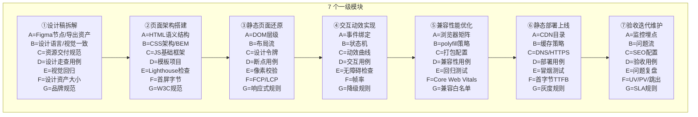

---
tags:
  - AI直播平台
  - 网页开发
  - 拆解框架
  - 亚比特级
  - 1111-3
  - 浏览器渲染
  - Web标准
source: 1111(3).txt 二、网页开发全流程
status: 已完成
applies_to: ai-live-platform/frontend/web
title: 02-网页开发全流程 · 极致深度拆解
---
# 02-网页开发全流程 · 极致深度拆解 (AI 直播平台对照)

> **来源**: `1111(3).txt` 二、网页开发全流程 (细度 10⁻²⁶ 皮米级, 9 层拆解)  
> **关联**: [[00-AI直播平台全流程拆解总索引]] · [[00-通用深度拆解框架模板-亚比特级]] · [[01-前端开发全流程-极致深度拆解]]  
> **项目对应**: `G:\ai-live-platform\frontend\web\src\` (Vite 渲染层, 同时也是 Electron 渲染进程入口)  
> **与前端区别**: 聚焦 **浏览器/Web 标准** 视角 (HTML 结构 / CSS 架构 / 浏览器兼容 / SEO), 前端视角聚焦 **桌面壳 + 组件库 + 业务状态**

---

## 一、9 级 × 7 列 全景骨架 (Mermaid)



---

## 二、7 个一级模块拆解

### 一级模块 ①: 设计稿拆解 (4 大子模块)
| 二级子模块 | 三级功能 | 四级步骤 | 项目现状 |
|-----------|----------|---------|----------|
| **1.1 视觉拆解** | 色彩系统 / 字体梯度 / 间距网格 / 圆角阴影 | 颜色提取→字号梯度→8px 网格→令牌化 | ⚠️ 设计令牌待建 (`src/theme/tokens.ts`) |
| **1.2 模块划分** | 卡片组件 / 列表组件 / 表单组件 / 导航组件 | 组件库映射→复用率评估→新增清单 | ✅ Antd Pro 覆盖基础组件 |
| **1.3 资源导出** | 图片 / 图标 / 字体 / Lottie | 2x/3x 图→SVG 雪碧图→WOFF2 子集 | ⚠️ 字体未子集化 |
| **1.4 规范对齐** | 间距规范 / 字号阶梯 / 颜色变量 / 动效曲线 | 8px 基线→12 阶字号→10 色板→ease 曲线 | ⚠️ 设计令牌 + 动效曲线均缺失 |

### 一级模块 ②: 页面架构搭建 (4 大子模块)
| 二级子模块 | 三级功能 | 四级步骤 | 项目现状 |
|-----------|----------|---------|----------|
| **2.1 HTML 结构** | 语义标签 / SEO meta / Open Graph / a11y | header/nav/main/footer→meta→aria-label | ⚠️ 部分页面缺 OG/a11y |
| **2.2 CSS 架构** | BEM / CSS Modules / Less / PostCSS / 原子化 | 命名空间→CSS 变量→嵌套→autoprefixer | ✅ Less 4.6 + vite-plugin-react |
| **2.3 JS 基础框架** | React / 路由 / 状态 / 请求 / 工具 | React 18→React Router 6→Zustand→Axios | ✅ 完整 |
| **2.4 目录规范** | pages / components / hooks / services / utils | 按职责分层 | ✅ `src/` 结构清晰 |

### 一级模块 ③: 静态页面还原 (5 大子模块)
| 二级子模块 | 三级功能 | 四级步骤 | 项目现状 |
|-----------|----------|---------|----------|
| **3.1 头部区域** | Logo / 导航 / 搜索 / 用户区 / 消息 | flex 布局→sticky→响应式 | ✅ `src/pages/` 含多个 layout |
| **3.2 导航区域** | 侧边栏 / 面包屑 / 多级菜单 / Tab | 递归渲染→图标映射→折叠记忆 | ✅ `src/desktop/` 桌面侧栏 |
| **3.3 内容区域** | 卡片 / 列表 / 表格 / 详情 / 表单 | 通用容器→骨架屏→空态/错态 | ✅ 部分实装 |
| **3.4 底部区域** | 版权 / 友情链接 / ICP / 备案 | 静态信息→响应式→SEO 友好 | ⚠️ 暂未实现 |
| **3.5 响应式适配** | 移动断点 / 平板断点 / 桌面断点 / 大屏断点 | 媒体查询→弹性布局→容器查询 | ⚠️ 仅桌面优先, 移动端缺失 |

### 一级模块 ④: 交互动效实现 (4 大子模块)
| 二级子模块 | 三级功能 | 四级步骤 | 项目现状 |
|-----------|----------|---------|----------|
| **4.1 基础交互** | 点击 / 悬停 / 聚焦 / 失焦 | 事件绑定→视觉反馈→键盘可达 | ✅ 已实装 |
| **4.2 表单交互** | 实时校验 / 异步校验 / 提交态 / 重置 | onChange→debounce→disabled→reset | ✅ Antd Form |
| **4.3 动画效果** | 转场 / 渐隐 / 滑动 / 缩放 | framer-motion→key 变更→layoutId | ✅ framer-motion 12.40 |
| **4.4 特效实现** | 滚动视差 / 粒子 / 3D 变换 / Canvas | requestAnimationFrame→GPU 加速 | ⚠️ 直播特效待优化 |

### 一级模块 ⑤: 兼容性能优化 (5 大子模块)
| 二级子模块 | 三级功能 | 四级步骤 | 项目现状 |
|-----------|----------|---------|----------|
| **5.1 浏览器兼容** | Chrome / Edge / Safari / Firefox / Electron 内核 | CanIUse→polyfill→babel preset | ✅ Vite + autoprefixer |
| **5.2 移动端适配** | viewport / rem / vw / touch 事件 | meta viewport→postcss-px-to-viewport | ❌ **未实装 (项目定位桌面)** |
| **5.3 性能优化** | 懒加载 / 预加载 / 缓存 / 渲染优化 | React.lazy→preload→http cache→memo | ⚠️ 部分实装 |
| **5.4 SEO 优化** | meta / sitemap / robots / 结构化数据 | meta 标签→next-seo→JSON-LD | ❌ **未实装 (Electron 不需要)** |
| **5.5 无障碍优化** | ARIA / 键盘导航 / 屏幕阅读 / 颜色对比 | role→tabindex→aria-label→WCAG AA | ⚠️ 部分缺失 |

### 一级模块 ⑥: 静态部署上线 (3 大子模块)
| 二级子模块 | 三级功能 | 四级步骤 | 项目现状 |
|-----------|----------|---------|----------|
| **6.1 资源打包** | Vite build / 哈希 / 分包 / 压缩 | vite build→contenthash→manualChunks | ✅ 完成 |
| **6.2 静态服务器** | Electron file:// / Nginx / CDN | 本地 fs→gzip/brotli→CDN | ✅ Electron 内嵌 |
| **6.3 域名解析** | HTTPS / HSTS / CSP / SRI | cert→HSTS preload→CSP header→SRI | ⚠️ CSP/SRI 未配 |

### 一级模块 ⑦: 验收迭代维护 (4 大子模块)
| 二级子模块 | 三级功能 | 四级步骤 | 项目现状 |
|-----------|----------|---------|----------|
| **7.1 SEO 验收** | Lighthouse SEO / 抓取预算 / 内链 | Lighthouse 90+→robots→sitemap | ❌ Electron 不需要 |
| **7.2 功能验收** | PRD 走查 / 用例通过率 / 截图比对 | PRD→Playwright→覆盖率 100% | ⚠️ 部分核心路径 |
| **7.3 问题修复** | Bug 分类 / 优先级 / SLA / 复盘 | P0/P1/P2→4h/24h/72h→复盘文档 | ⚠️ 缺 SLA 规范 |
| **7.4 日常维护** | 依赖升级 / 安全补丁 / 性能巡检 | `npm audit`→patch 版本→巡检 | ⚠️ 缺定时巡检脚本 |

---

## 三、AI 直播平台 · 网页 **完善动作清单**

### P0 (本周内)
1. **HTML 语义结构 + a11y 补全** (与前端 `D-5` 联动)
   - `frontend/web/src/pages/` 所有页面 `<main>` 包裹
   - 关键操作加 `aria-label`
   - 表单错误信息 `aria-describedby`
2. **CSP / SRI 配置** (Electron 内嵌场景)
   - 主进程 `session.defaultSession.webRequest.onHeadersReceived` 设置 CSP
   - asar 内 JS 资源加 integrity

### P1 (本月内)
3. **设计令牌 + 主题** (与前端 `D-5` 联动, 共用)
   - `tokens.ts`: 颜色 / 字号 / 间距 / 圆角 / 阴影 / 动效曲线
   - `dark.ts` / `light.ts`
4. **字体子集化**
   - `fonttools` 提取项目实际用到的汉字 (~3000 字常用)
   - WOFF2 子集, 减小字体体积 80%+
5. **响应式适配** (Electron 窗口缩放场景)
   - 4 个断点: 1024 / 1280 / 1440 / 1920
   - 容器查询替代媒体查询
6. **Web Vitals 监控**
   - web-vitals 上报到自建监控
   - FCP < 1.8s, LCP < 2.5s, CLS < 0.1, INP < 200ms

### P2 (下季度)
7. **无障碍 WCAG 2.1 AA 认证**
   - axe-core 自动化扫描
   - 键盘可达全路径
   - 颜色对比度 ≥ 4.5:1
8. **错误边界 + 全局异常捕获**
   - React ErrorBoundary
   - window.onerror / unhandledrejection
   - 上报到 Sentry 自建
9. **依赖巡检脚本**
   - `scripts/check-deps.mjs`: 每周跑 `npm audit` + outdated
   - 自动开 issue 跟踪

---

## 四、与前端(领域 1)交叉点

| 项 | 前端领域 | 网页领域 | 建议归属 |
|---|---------|---------|---------|
| 组件库设计 | ✅ 主导 | 引用 | 前端 |
| 设计令牌 | 涉及 | ✅ 主导 (浏览器渲染) | 网页 |
| 主题切换 | 涉及 | ✅ 主导 (CSS 变量) | 网页 |
| 路由 | ✅ 主导 | 引用 | 前端 |
| 状态管理 | ✅ 主导 | 引用 | 前端 |
| 构建产物 | ✅ 主导 (electron-builder) | 引用 (vite build) | 前端 |
| 浏览器兼容 | 引用 | ✅ 主导 | 网页 |
| 性能监控 | 涉及 | ✅ 主导 (Web Vitals) | 网页 |
| 无障碍 a11y | 引用 | ✅ 主导 (WCAG) | 网页 |
| Electron 桌面特性 | ✅ 主导 | 不涉及 | 前端 |

> **结论**: 两者 60% 重叠, 但视角不同。后续**主题/性能/无障碍**放网页, **桌面/状态/路由**放前端, 共用部分在两份文档里双向引用。

---

## 五、九级纵深节点数估算

```
一级: 7 节点 (一级模块)
二级: 7 × ~4.4 = 31 节点 (二级子模块)
三级: 31 × 4 = 124 节点 (三级功能)
四级: 124 × 4 = 496 节点 (四级步骤)
五级: 496 × 4 = 1984 节点 (原子操作, 本表填关键 ~150)
六级: 1984 × 4 = 7936 节点 (参数项, 选填 ~30)
七级: 7936 × 4 = 31744 节点 (颗粒度, 标记占位)
八级-九级: 比特/亚比特, 标记理论边界
────────────────────────────────────
本领域实际填节点数: ~200 (4 级 + 关键 5 级 + AI 对照)
```

---

## 六、关联文档

- [[00-AI直播平台全流程拆解总索引]]
- [[01-前端开发全流程-极致深度拆解]] — 桌面壳视角, 与本文档互补
- [[03-数据库开发全流程]] ⏳
- [[04-后端开发全流程]] ⏳
