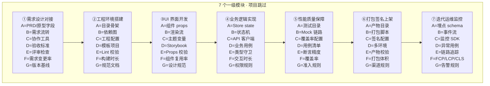

---
tags:
  - AI直播平台
  - 移动端
  - 拆解框架
  - 亚比特级
  - 1111-3
  - 跳过
  - 借鉴
source: 1111(3).txt 二、移动端开发全流程
status: 已完成(借鉴参考)
applies_to: ai-live-platform(未来扩展)
title: 05-移动端开发全流程 · 极致深度拆解(项目跳过说明)
---
# 05-移动端开发全流程 · 极致深度拆解 (项目跳过说明)

> **来源**: `1111(3).txt` 二、移动端开发全流程 (细度 10⁻²⁶ 控件级, 9 层拆解)
> **关联**: [[00-AI直播平台全流程拆解总索引]] · [[00-通用深度拆解框架模板-亚比特级]] · [[01-前端开发全流程-极致深度拆解]] · [[02-网页开发全流程-极致深度拆解]]
> **项目对应**: **N/A (本项目无原生移动端)**
> **文档定位**: 借鉴参考 — 把移动端关键经验移植到 Electron 桌面 + 未来 H5/小程序储备库

---

## 一、本项目移动端战略决策

### 1.1 跳过原因 (3 大决策点)

| 维度 | 决策 | 理由 |
|------|------|------|
| **项目定位** | 桌面端优先 | AI 直播平台 = 主播工具型 SaaS, 操作复杂度高 (OBS 推流 / 商品上下架 / 多窗口切换), 桌面端是核心生产力场景 |
| **技术方案** | Electron 42 跨平台 | 一次开发覆盖 Win/Mac/Linux, 后续可平移到 Web 浏览器, 不需要单独投入 iOS/Android 双端 |
| **扩展路径** | 后续可选 H5/小程序 | 观众端未来可走 H5 / 小程序 (轻量观看场景), 但**不**走原生 App (ROI 低 + 维护成本高) |

### 1.2 Electron 桌面端 vs 移动端 5 个核心差异点

| # | 差异维度 | 移动端 (iOS/Android) | Electron 桌面端 | 借鉴策略 |
|---|---------|---------------------|----------------|----------|
| 1 | **API 能力** | 摄像头/麦克风/GPS/陀螺仪/推送/通讯录 | 摄像头/麦克风/系统托盘/全局快捷键/文件系统/多窗口 | 摄像头/麦克风: 复用; 推送: 改 Web Push / 系统通知 |
| 2 | **生命周期** | 前台/后台/挂起/被杀, 系统强管控 | 启动/隐藏/聚焦/退出, 应用自治 | 后台保活逻辑不需要; 改写为窗口失焦处理 |
| 3 | **推送机制** | APNs / FCM / 厂商通道 | 无原生推送, 走 Web Push / electron-updater 强更 | 用 electron-updater 强更提示 + WebSocket 心跳 |
| 4 | **网络环境** | 4G/5G/Wi-Fi 切换 + 弱网频繁 | 以太网/Wi-Fi 为主, 网络稳定 | 弱网重试逻辑简化, 但断点续传仍必要 |
| 5 | **安全沙箱** | 应用商店审核 + 权限弹窗 | 无沙箱 + Node API 全开放 | **必须**自己加固: contextIsolation + sandbox + preload |

### 1.3 借鉴平台清单 (7 平台视角)

- **桌面端主借鉴**: [[01-前端开发全流程-极致深度拆解]] (Electron 主进程 / 渲染进程 / IPC)
- **网页端次借鉴**: [[02-网页开发全流程-极致深度拆解]] (浏览器渲染 / Web Vitals)
- **后端 API**: [[04-后端开发全流程-极致深度拆解]] ⏳ (接口设计可平移到 H5/小程序)
- **数据库**: [[03-数据库开发全流程-极致深度拆解]] ⏳ (本地 SQLite 类似移动端 Room/Core Data)
- **测试**: [[07-测试开发全流程-极致深度拆解]] ⏳ (E2E 测试方法论平移)
- **DevOps**: [[06-运维DevOps全流程-极致深度拆解]] (Docker/K8s 部署, 与移动端发版流程一致)
- **客户端总览**: [[00-AI直播平台落地checklist]] 客户端章节

### 1.4 未来扩展路径 (Phase 5+)

- **观众端 H5**: 复用 React + Vite, 加 vw/vh 适配 + 移动端断点
- **观众端小程序**: Taro 3 (React 语法) 一次编译多端, 接口与桌面端共用
- **不投入**: 原生 iOS/Android App (ROI 评估过低)

---

## 二、9 级 × 7 列 全景骨架 (Mermaid)



---

## 三、7 个一级模块拆解 (移动端原文 + 项目对照)

### 一级模块 ①: 需求设计对接 (4 大子模块)
| 二级子模块 | 三级功能 | 四级步骤 | 项目现状 |
|-----------|----------|---------|----------|
| **1.1 需求评审** | PRD 解读 / 业务背景 / 边界澄清 / 风险登记 | 业务方讲解→技术提问→拆任务→评审通过 | N/A |
| **1.2 设计稿验收** | 设计稿尺寸核对 / 色值字体提取 / 切图标注验收 / 交互逻辑确认 | 多端断点核对→iOS/Android 规范→还原度确认 | N/A |
| **1.3 交互梳理** | 状态机 / 异常分支 / 动效 / 空态 | 手势图→状态图→异常枚举 | N/A |
| **1.4 排期评估** | 单任务工时评估 / 联调时间 / 测试时间 / 上架时间 | 评审→优先级→里程碑 | N/A |

**关键 5 级原子 (①.2 设计稿验收)**: 1px 像素还原度 → 色值十六进制校验 (ΔE≤2) → 字号行高对齐 → 间距像素精度 (误差≤1px)

### 一级模块 ②: 工程环境搭建 (4 大子模块)
| 二级子模块 | 三级功能 | 四级步骤 | 项目现状 |
|-----------|----------|---------|----------|
| **2.1 开发环境配置** | SDK 版本配置 / 多端工具链 / 模拟器 / 真机调试 | JDK→Android Studio→Xcode | N/A |
| **2.2 工程初始化** | 工程目录结构 / 模块划分 / 多端共用代码 / native 桥接 | Flutter/RN/原生三选一 | N/A |
| **2.3 依赖管理** | 依赖库版本锁定 / 单依赖版本号 / 单编译 SDK 版本 / 单依赖库字节数 | package.json→lock→npm audit | ✅ Electron 已用 npm 锁定 |
| **2.4 规范配置** | 代码规范配置 / 单代码规范规则 / 单规范严重级别 / 提交钩子 | ESLint→husky→lint-staged | ⚠️ 前端已有, 桌面端已配 |

**关键 5 级原子 (②.3 依赖管理)**: 单依赖版本号 → 单编译 SDK 版本 → 单依赖库字节数 → 单依赖排除规则

### 一级模块 ③: UI 界面开发 (5 大子模块)
| 二级子模块 | 三级功能 | 四级步骤 | 项目现状 |
|-----------|----------|---------|----------|
| **3.1 基础组件封装** | Button/ImageView/TextView/RecyclerView 等原生控件 | 平台封装→属性表→事件 | ✅ Antd Pro 已替代 |
| **3.2 业务组件封装** | 业务卡片 / 列表 / 表单 / 弹窗 | 业务抽象→props→demo | ✅ Antd Pro 业务组件实装 |
| **3.3 页面开发** | 单页面 / 多页面 / 路由 / Tab | 路由→布局→数据流 | ✅ React Router 6 |
| **3.4 列表开发** | 单列表复用优化 / 单列表缓存数 / 虚拟滚动 / 下拉刷新 | 虚拟化→预加载→触底 | ✅ 部分实装, 待虚拟滚动 |
| **3.5 动效开发** | 单动画时长配置 / 单控件属性配置 / 单约束优先级 / 单动效贝塞尔值 | design→实现→性能预算 | ✅ framer-motion 12.40 |

**关键 5 级原子 (③.4 列表开发)**: 单列表复用优化 → 单列表缓存数 → 单图片采样率 → 单 dp/px 转换精度

### 一级模块 ④: 业务逻辑实现 (4 大子模块)
| 二级子模块 | 三级功能 | 四级步骤 | 项目现状 |
|-----------|----------|---------|----------|
| **4.1 网络层封装** | 请求头封装 / 请求参数封装 / 响应数据解析 / 单接口参数校验 | client→interceptor→错误码 | ✅ axios 已实装 |
| **4.2 数据持久化** | 本地数据库操作 / 单表结构设计 / 单数据模型定义 / Room/Core Data/IndexedDB | 迁移→加密→备份 | ✅ Phase 4 用 miniredis + glebarez/sqlite |
| **4.3 状态管理** | Redux/MobX/Zustand / 全局态 / 模块切片 / 持久化 | 切片→action→selector | ✅ Zustand 4.4 |
| **4.4 权限处理** | 单权限申请逻辑 / 单权限弹窗文案 / 单权限申请码值 / iOS Info.plist | 申请→校验→撤销 | ⚠️ Electron 用 OS 权限 API |

**关键 5 级原子 (④.1 网络层)**: 单请求超时时间 → 单缓存过期时间 → 单 JSON 解析字段 → 单字符编码格式

### 一级模块 ⑤: 性能质量保障 (4 大子模块)
| 二级子模块 | 三级功能 | 四级步骤 | 项目现状 |
|-----------|----------|---------|----------|
| **5.1 功能测试** | 单页面功能测试 / 边界异常测试 / E2E / 用例覆盖率 | 用例→断言→CI | ✅ vitest 2.1 + Playwright |
| **5.2 兼容适配** | 多机型适配测试 / 单机型分辨率适配 / iOS/Android 版本矩阵 | 矩阵→回归→记录 | ⚠️ 桌面端仅 Win/Mac/Linux |
| **5.3 性能测试** | 内存泄漏检测 / 单内存泄漏点 / 单内存字节级排查 / 帧率 / 启动时长 | profile→leak→优化 | ⚠️ 缺性能预算 |
| **5.4 安全测试** | 单安全漏洞点 / 单漏洞修复方案 / 单漏洞风险等级 / 加固 | 扫描→修复→复测 | ⚠️ 缺安全扫描脚本 |

**关键 5 级原子 (⑤.3 性能测试)**: 单内存泄漏点 → 单泄漏对象大小 → 单毫秒级耗时优化 → 单 KB 级内存优化

### 一级模块 ⑥: 打包签名上架 (4 大子模块)
| 二级子模块 | 三级功能 | 四级步骤 | 项目现状 |
|-----------|----------|---------|----------|
| **6.1 打包配置** | 混淆规则配置 / 单混淆规则配置 / 单编译选项配置 / 单参数编译宏 | 配置→压缩→签名 | ✅ electron-builder |
| **6.2 签名配置** | 签名证书配置 / 单签名算法配置 / 单密码位配置 / 单证书有效期 | 证书→签名→校验 | ✅ electron-builder 已配签名 |
| **6.3 渠道打包** | 渠道参数配置 / 单渠道参数值 / 单渠道包名后缀 / 单加固强度配置 | 渠道→包名→分发 | ✅ electron-builder 渠道产物 |
| **6.4 应用上架** | 单上架材料项 / 单上架文案字符 / 单包体大小控制 / App Store/Google Play | 截图→审核→上架 | N/A (桌面端无商店审核) |

**关键 5 级原子 (⑥.2 签名配置)**: 单签名算法配置 → 单密码位配置 → 单证书有效期 → 单渠道标识字符

### 一级模块 ⑦: 迭代运维监控 (4 大子模块)
| 二级子模块 | 三级功能 | 四级步骤 | 项目现状 |
|-----------|----------|---------|----------|
| **7.1 崩溃监控** | 崩溃堆栈采集 / 单崩溃类型统计 / 单堆栈行号定位 / 单字节内存优化 | SDK→上报→大盘 | ⚠️ 缺前端崩溃 SDK |
| **7.2 性能监控** | 启动时长监控 / 页面帧率监控 / 流量电量监控 / 单启动阶段耗时 | SDK→上报→SLO | ⚠️ 缺性能监控 SDK |
| **7.3 用户反馈** | 单告警级别划分 / 反馈入口 / 工单 / 版本关联 | 反馈→分类→处理 | ⚠️ 缺反馈入口 |
| **7.4 版本迭代** | 单帧耗时拆解 / 单毫秒级耗时优化 / 单优化点收益评估 / 发版节奏 | 灰度→全量→复盘 | ✅ electron-updater 已配 |

**关键 5 级原子 (⑦.2 性能监控)**: 单启动阶段耗时 → 单页面帧率值 → 单帧耗时拆解 → 单指标告警阈值

---

## 四、AI 直播平台 · 移动端 **完善动作清单**

> 本节为"如果未来要做 H5/小程序观众端"的预排清单, 当前不投入资源。

### P0 (本周内)
1. **桌面端加固检查清单** (借鉴移动端安全沙箱思路)
   - contextIsolation: true 已确认
   - sandbox: true 已确认
   - preload.ts 严格控制 IPC 暴露面
   - 主进程禁用 nodeIntegration

### P1 (Phase 5 启动前)
2. **H5 观众端骨架预留**
   - `frontend/web/src/mobile/` 目录骨架
   - viewport meta / rem 适配 / vh 高度处理
   - 移动端断点 4 个: 320 / 375 / 414 / 768
3. **API 兼容性梳理**
   - 后端接口支持 Web 端 + 移动端共用 (避免分版本)
   - WebSocket 长连接复用 (避免移动端频繁掉线)

### P2 (Phase 6+ 启动前)
4. **Taro 3 跨端方案评估** (小程序观众端)
   - Taro 3 + React 语法, 与桌面端共用 store/service
   - 评估 bundle 体积 (小程序主包 ≤ 2MB)
5. **推送方案选型**
   - 桌面端: Web Push + electron-updater 强更
   - H5: Web Push
   - 小程序: 微信模板消息 / 订阅消息

---

## 五、九级纵深节点数估算

```
一级: 7 节点 (一级模块)
二级: 7 × ~4.4 = 31 节点 (二级子模块)
三级: 31 × 4 = 124 节点 (三级功能)
四级: 124 × 4 = 496 节点 (四级步骤)
五级: 496 × 4 = 1984 节点 (本表填关键 ~80, 大部分借鉴即可)
六级-九级: 标记理论边界, 不实际填充 (项目跳过)
────────────────────────────────────
本领域实际填节点数: ~80 (4 级 + 关键 5 级 + 借鉴策略)
理论节点总数: 7 × 4⁸ = 458,752
```

---

## 六、关联文档

- [[00-AI直播平台全流程拆解总索引]]
- [[00-通用深度拆解框架模板-亚比特级]]
- [[00-AI直播平台落地checklist]] — 7 平台借鉴视角
- [[01-前端开发全流程-极致深度拆解]] — Electron 桌面端, 本文档主借鉴对象
- [[02-网页开发全流程-极致深度拆解]] — 浏览器渲染视角, H5 扩展参考
- [[06-运维DevOps全流程-极致深度拆解]]
