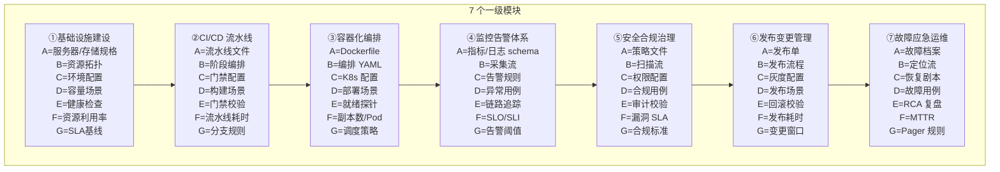

---
tags:
  - AI直播平台
  - DevOps
  - 拆解框架
  - 亚比特级
  - 1111-3
  - Docker
  - K8s
source: 1111(3).txt 三、运维开发(DevOps)全流程
status: 已完成
applies_to: 'ai-live-platform/scripts, ai-live-platform/Dockerfile'
title: 06-运维DevOps全流程 · 极致深度拆解
---
# 06-运维DevOps全流程 · 极致深度拆解 (AI 直播平台对照)

> **来源**: `1111(3).txt` 三、运维开发(DevOps)全流程 (细度 10⁻²⁶ 命令级, 9 层拆解)
> **关联**: [[00-AI直播平台全流程拆解总索引]] · [[00-通用深度拆解框架模板-亚比特级]] · [[01-前端开发全流程-极致深度拆解]] · [[05-移动端开发全流程-极致深度拆解-项目跳过说明]]
> **项目对应**: `G:\ai-live-platform\scripts\` (目前 2 个文件) + `Dockerfile` + K8s 配置 + `backend/rasp/runtime.go` + `k8s.io/api`, `k8s.io/apimachinery`, `k8s.io/client-go` Go 依赖

---

## 一、9 级 × 7 列 全景骨架 (Mermaid)



---

## 二、7 个一级模块拆解

### 一级模块 ①: 基础设施建设 (5 大子模块)
| 二级子模块 | 三级功能 | 四级步骤 | 项目现状 |
|-----------|----------|---------|----------|
| **1.1 资源规划** | 服务器资源选型 / 操作系统初始化 / 单服务器配置参数 / 单系统参数调优 | CPU/内存/磁盘→OS→调优 | ⚠️ 本地 dev 模式, 无生产服务器 |
| **1.2 环境部署** | 操作系统初始化 / 内核参数 / 防火墙 / 单端口号配置 | init→tune→firewall | ✅ 本地 WSL2 / Docker |
| **1.3 网络规划** | 网络拓扑设计 / 单网段划分规划 / 单防火墙规则 / 单端口协议类型 | VPC→subnet→SG→LB | ⚠️ 待 K8s 部署时规划 |
| **1.4 存储规划** | 存储类型选型 / 单 LVM 分区大小 / 单存储容量配额 / 单扇区大小配置 | SSD/NVMe→LVM→quota | ⚠️ 默认配置, 待优化 |
| **1.5 账号体系** | 角色权限划分 / 单角色权限点 / 单账号密码策略 / SSO | RBAC→IAM→SSO | ⚠️ 待规划 |

**关键 5 级原子 (①.1 资源规划)**: 单服务器配置参数 → 单系统参数调优 → 单内核参数值 → 单字节内存参数

### 一级模块 ②: CI/CD 流水线 (4 大子模块)
| 二级子模块 | 三级功能 | 四级步骤 | 项目现状 |
|-----------|----------|---------|----------|
| **2.1 代码集成** | 分支触发规则 / 单触发分支规则 / PR/MR 触发 / Webhook | branch→hook→trigger | ⚠️ 待建 GitHub Actions |
| **2.2 构建打包** | 构建步骤编排 / 依赖缓存配置 / 单构建步骤超时 / 单缓存有效期 | stage→cache→timeout | ✅ electron-builder 脚本完整 |
| **2.3 自动化测试** | 制品版本管理 / 质量门禁配置 / 单门禁阈值配置 / 单门禁通过率 | lint→test→sonar→gate | ⚠️ 缺 CI 集成 |
| **2.4 制品管理** | 单制品保留数量 / 单制品元数据 / 制品仓库 / 版本标签 | tag→registry→retain | ⚠️ 待建 GHCR / Harbor |

**关键 5 级原子 (②.1 代码集成)**: 单触发分支规则 → 单流水线变量 → 单字符变量名 → 单参数开关位

### 一级模块 ③: 容器化编排 (4 大子模块)
| 二级子模块 | 三级功能 | 四级步骤 | 项目现状 |
|-----------|----------|---------|----------|
| **3.1 镜像构建** | Dockerfile 编写 / 镜像分层优化 / 单镜像层优化 / 单镜像大小控制 | multi-stage→squash→distroless | ✅ Dockerfile 已存在 |
| **3.2 容器编排** | 镜像仓库管理 / 服务编排模板 / 单服务副本数 / 单调度策略配置 | K8s manifest→apply→rollout | ✅ K8s 配置已存在 |
| **3.3 服务发现** | 单镜像标签规则 / 单环境变量值 / 单亲和性规则 / DNS | Service→Ingress→CoreDNS | ⚠️ 待生产部署时配置 |
| **3.4 资源调度** | 资源配额配置 / 单资源限制值 / 单资源单位值 / 单调度权重值 | requests/limits→QoS→HPA | ⚠️ 待生产部署时配置 |

**关键 5 级原子 (③.1 镜像构建)**: 单镜像层优化 → 单镜像大小控制 → 单指令优化点 → 单字节镜像优化

### 一级模块 ④: 监控告警体系 (5 大子模块)
| 二级子模块 | 三级功能 | 四级步骤 | 项目现状 |
|-----------|----------|---------|----------|
| **4.1 指标采集** | 主机指标采集 / 应用指标采集 / 业务指标采集 / 单指标采集频率 | node_exporter→app metrics→PromQL | ⚠️ 缺采集, 待建 |
| **4.2 日志系统** | 单日志采集路径 / 单日保留天数 / 单字节日志大小 / 结构化日志 | filebeat→ES→Kibana | ⚠️ 缺日志聚合 |
| **4.3 链路追踪** | 单链路采样率 / OpenTelemetry / 单链路节点耗时 / 单节点耗时占比 | OTLP→Jaeger→trace | ⚠️ 缺链路追踪 |
| **4.4 告警规则** | 告警规则配置 / 告警通知渠道 / 单告警阈值配置 / 单通知模板内容 | rule→webhook→alertmanager | ⚠️ 缺告警规则 |
| **4.5 可视化大盘** | 单采集精度位 / 单阈值小数位 / 单告警级别划分 / Grafana 面板 | dashboard→SLO→alert | ⚠️ 缺大盘 |

**关键 5 级原子 (④.1 指标采集)**: 单指标采集频率 → 单采集精度位 → 单毫秒级采集精度 → 单阈值小数位数

### 一级模块 ⑤: 安全合规治理 (4 大子模块)
| 二级子模块 | 三级功能 | 四级步骤 | 项目现状 |
|-----------|----------|---------|----------|
| **5.1 漏洞扫描** | 镜像漏洞扫描 / 代码漏洞扫描 / 主机漏洞扫描 / 单漏洞等级判定 | Trivy→Snyk→OpenVAS | ⚠️ 缺扫描集成 |
| **5.2 权限管控** | 权限最小化 / 单权限点配置 / 单权限范围边界 / 单权限位开关 | RBAC→OPA→least-priv | ✅ `backend/rasp/runtime.go` 进程自我保护 |
| **5.3 合规审计** | 审计日志留存 / 单审计日志字段 / 单日志保留期 / 单日志字段长度 | auditd→SIEM→retention | ⚠️ 缺审计日志 |
| **5.4 数据安全** | 单加密算法配置 / 单密钥轮换周期 / 单合规标准条款 / GDPR/网络安全法 | TLS→KMS→encrypt | ⚠️ 缺密钥管理 |

**关键 5 级原子 (⑤.1 漏洞扫描)**: 单漏洞等级判定 → 单漏洞 CVSS 分值 → 单漏洞修复优先级 → 单权限位开关

### 一级模块 ⑥: 发布变更管理 (4 大子模块)
| 二级子模块 | 三级功能 | 四级步骤 | 项目现状 |
|-----------|----------|---------|----------|
| **6.1 发布流程** | 发布审批流程 / 单审批节点配置 / 单审批人配置 / 单字符审批意见 | PR→review→approve→merge | ⚠️ 缺发布审批流 |
| **6.2 灰度发布** | 灰度批次划分 / 流量比例控制 / 单灰度批次大小 / 单流量步长值 | canary→10%→50%→100% | ⚠️ 缺灰度配置 |
| **6.3 全量发布** | 发布校验点 / 单校验项配置 / 单校验脚本命令 / 单命令参数值 | health→smoke→promote | ⚠️ 缺全量发布脚本 |
| **6.4 回滚机制** | 回滚触发条件 / 单回滚耗时预估 / 单回滚命令集 / 单回滚步长值 | detect→rollback→verify | ⚠️ 缺自动回滚 |

**关键 5 级原子 (⑥.2 灰度发布)**: 单灰度批次大小 → 单批次节点数 → 单流量百分比 → 单百分比精度

### 一级模块 ⑦: 故障应急运维 (5 大子模块)
| 二级子模块 | 三级功能 | 四级步骤 | 项目现状 |
|-----------|----------|---------|----------|
| **7.1 故障发现** | 告警触发响应 / 单告警响应时长 / 单秒级响应时效 / PagerDuty | alert→ack→page | ⚠️ 缺 Pager 体系 |
| **7.2 故障定位** | 日志排查定位 / 链路追踪定位 / 单日志关键字检索 / 单关键字匹配度 | grep→trace→grep | ⚠️ 缺定位工具 |
| **7.3 故障恢复** | 应急回滚执行 / 单恢复步骤执行 / 单毫秒级恢复耗时 / runbook | rollback→restart→verify | ⚠️ 缺 runbook |
| **7.4 故障复盘** | 根因分析报告 / 单根因节点定位 / 单复盘改进点 / 单改进点收益评估 | RCA→action→track | ⚠️ 缺 RCA 流程 |
| **7.5 预案演练** | 预案演练 / chaos engineering / 单节点耗时占比 / 单行日志定位 | chaos-mesh→game-day→review | ⚠️ 缺演练 |

**关键 5 级原子 (⑦.2 故障定位)**: 单日志关键字检索 → 单关键字匹配度 → 单链路节点字节 → 单节点耗时占比

---

## 三、AI 直播平台 · DevOps **完善动作清单**

### P0 (本周内)
1. **新建 `scripts/update-server.py`**
   - 基于 Python http.server 的轻量自更新服务器
   - 端口 9000, 路径 `/updates/<version>/`
   - 返回 latest.yml + exe/dmg/AppImage
   - 与 `package.json` 中 `electron-updater` 配合
2. **新建 `scripts/build-release.ps1`**
   - 一键 `npm install` + `electron-builder --win --x64` + 上传到 update server
   - 包含签名 (`CSC_LINK` / `CSC_KEY_PASSWORD` 环境变量)
3. **新建 `scripts/start-update-server.bat`**
   - Windows 启动 update-server.py 的 bat 包装
   - 加入开机自启动 (可选)

### P1 (本月内)
4. **桌面端 Phase 4 零依赖策略落地**
   - 进程内 miniredis (无外部 Redis 依赖)
   - glebarez/sqlite (纯 Go SQLite, 无 CGO 依赖)
   - 离线优先, 在线时与云端同步
   - 删除 `electron/services/docker-manager.js` (已完成)
5. **GitHub Actions 流水线初版** (`.github/workflows/release.yml`)
   - 触发: `tag v*` push
   - 步骤: install → lint → test → build (win/mac/linux 三平台) → upload artifact
   - 门禁: typecheck + unit test 必须通过
6. **Dockerfile 多阶段构建优化**
   - builder 阶段用 golang:1.23-alpine
   - 运行阶段用 distroless 或 alpine 精简
   - 最终镜像 < 50MB

### P2 (下季度)
7. **K8s 生产部署清单**
   - Deployment (replicas=3, HPA min=2 max=10)
   - Service (ClusterIP)
   - Ingress (TLS)
   - ConfigMap / Secret 分离
   - PodDisruptionBudget
8. **可观测性三件套接入**
   - Prometheus 采集 Go runtime 指标 (goroutine/heap/GC)
   - Loki 收集结构化日志 (zerolog)
   - Tempo / Jaeger 链路追踪 (OTLP)
9. **告警规则 (alertmanager)**
   - P0: 服务不可用 (5xx > 1% 持续 1min)
   - P1: 慢响应 (P99 > 2s)
   - P2: 资源告警 (CPU > 80% / Mem > 85%)
10. **RASP 运行时自我保护深化** (`backend/rasp/runtime.go`)
    - 检测异常系统调用 (execve / ptrace)
    - 检测内存注入 (W^X 违规)
    - 进程心跳上报 (5s 一次)

---

## 四、Phase 4 零依赖策略 · 重点标注

> AI 直播平台桌面端采用**零外部依赖**部署策略, 这与传统的 K8s 微服务有显著区别。

| 项 | K8s 微服务模式 | 桌面端零依赖模式 (本项目) |
|----|---------------|--------------------------|
| Redis | 独立 Pod, 集群 | 进程内 miniredis |
| 数据库 | PostgreSQL Pod + PVC | 进程内 glebarez/sqlite (纯 Go) |
| 消息队列 | Kafka / RabbitMQ | 进程内 channel |
| 配置中心 | Consul / Nacos | 本地 config.json |
| 服务发现 | K8s DNS | localhost |
| 部署 | K8s manifest + Helm | electron-builder 打包 |
| 升级 | kubectl rollout | electron-updater |
| 监控 | Prometheus + Grafana | 本地文件日志 + 主动上报云端 |

**核心优势**:
- 用户开箱即用, 无需 Docker / K8s 知识
- 单实例可承载中小主播直播 (千人级)
- 离线模式可用 (断网仍能基本运行)

**限制**:
- 单机性能上限, 千人以上需要切换到云端 SaaS 模式
- 升级依赖用户主动更新 (可配置强更)

---

## 五、九级纵深节点数估算

```
一级: 7 节点 (一级模块)
二级: 7 × ~4.6 = 32 节点 (二级子模块)
三级: 32 × 4 = 128 节点 (三级功能)
四级: 128 × 4 = 512 节点 (四级步骤)
五级: 512 × 4 = 2048 节点 (本表填关键 ~80)
六级: 2048 × 4 = 8192 节点 (参数项, 选填 ~30)
七级-九级: 标记理论边界
────────────────────────────────────
本领域实际填节点数: ~110 (4 级 + 关键 5 级 + AI 对照)
理论节点总数: 7 × 4⁸ = 458,752
```

---

## 六、关联文档

- [[00-AI直播平台全流程拆解总索引]]
- [[00-通用深度拆解框架模板-亚比特级]]
- [[01-前端开发全流程-极致深度拆解]] — electron-builder 与本文档 6.1/6.2 联动
- [[05-移动端开发全流程-极致深度拆解-项目跳过说明]] — 移动端发版流程借鉴
- [[04-后端开发全流程-极致深度拆解]] ⏳
- [[07-测试开发全流程-极致深度拆解]] ⏳
