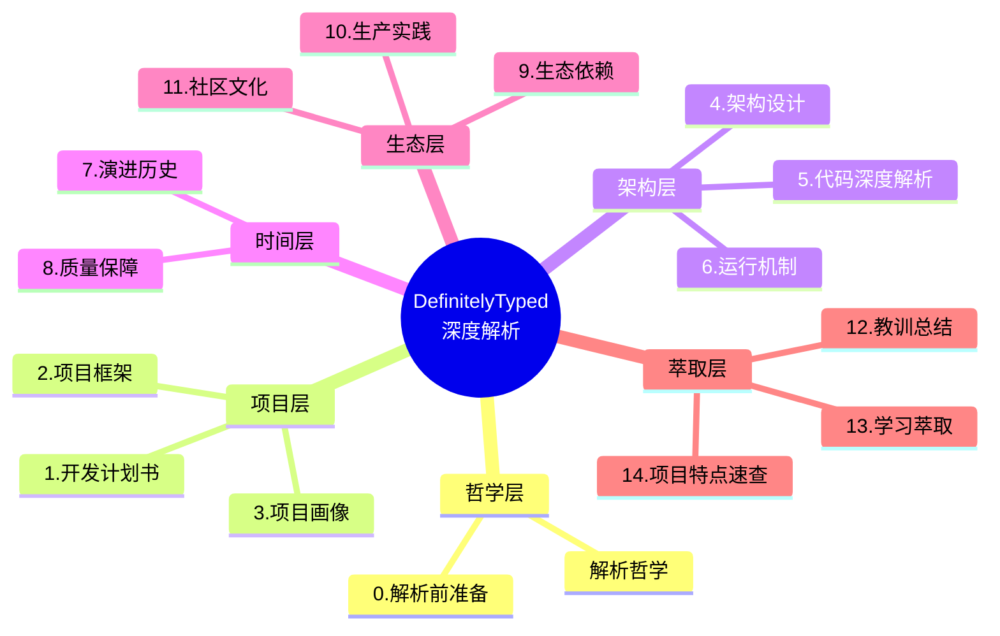
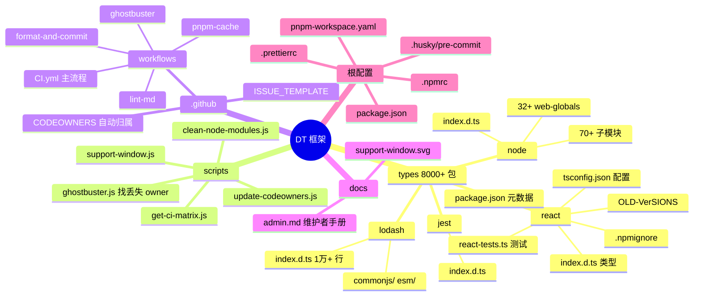
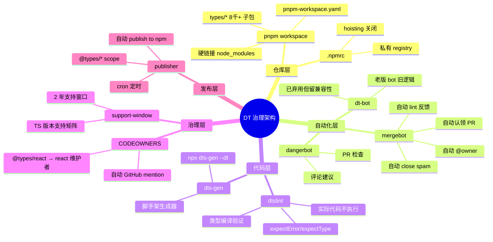
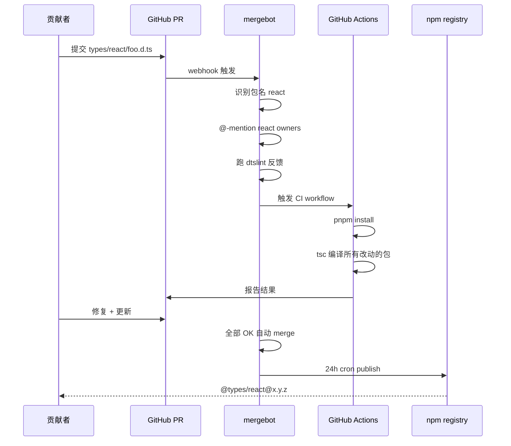
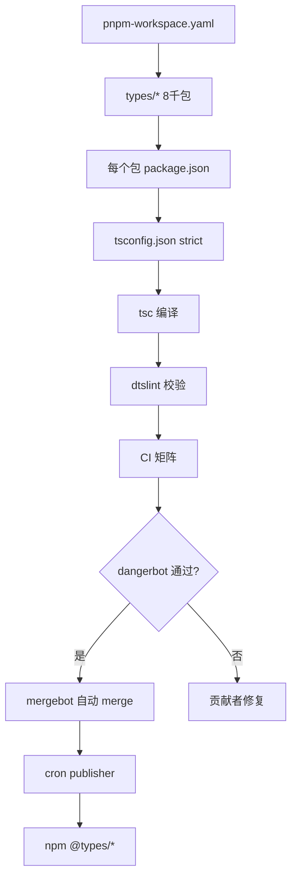
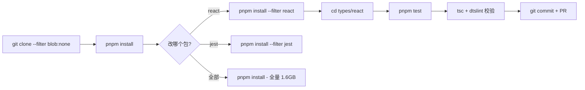
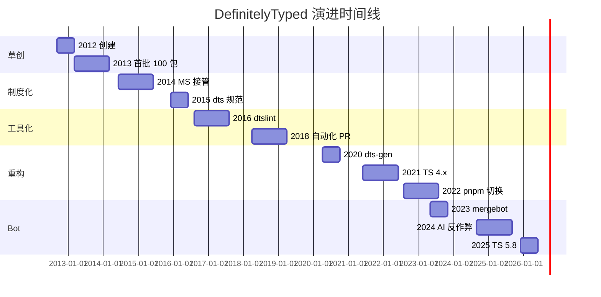
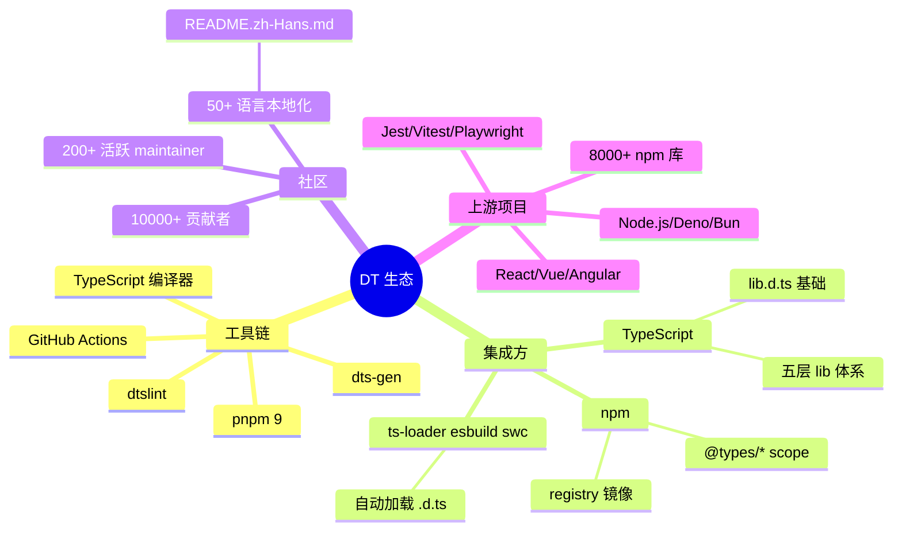
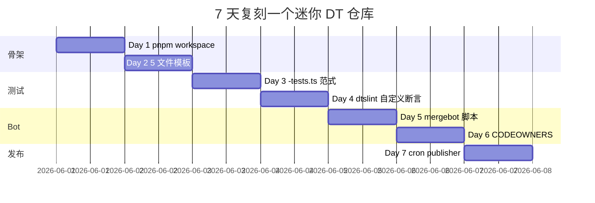

# DefinitelyTyped · 项目深度解析

> Definitely Typed — 高质量 TypeScript 类型定义的高频仓库，承载 8000+ npm 包、62000+ 文件、50k+ stars。
> 来源：`G:\实战案例\GitHub顶尖项目\DefinitelyTyped\`

## 写在前面：解析哲学

按 V3 模版，**先骨架后血肉，先 What 后 Why，最后 How to steal**。每个小节都遵循"点状解析 → 思维导图 → 代码 WHY → 反例警示"。



---

## 0. 解析前的 5 个准备

**[点状解析]**：拿到仓库后先做 5 件不起眼但极重要的事，避免后面返工。

1. **不要用普通克隆**：DT 仓库 1.6GB+、62848 文件，必须用 `git clone --filter=blob:none --depth 1` 或 `blobless clone`
2. **建 `_analysis` 子目录**：62000+ 文件无法全部读入，按 `types/{pkg}/` 维度抽样
3. **写问题清单（5 问）**：DT 为何用 pnpm monorepo？mergebot 自动化 PR 的工作原理？`@types` scope 的双下划线转义？typesVersions/dist-tags 如何支持多 TS 版本？`ts5.0/5.1/5.2` 切换器怎么实现？
4. **速查表**：DT 仓库本身约 1.6GB、Microsoft 旗下、`@types/*` 共 8000+ 包
5. **锁定 commit**：DT 每天 100+ PR，必须固定 commit，否则 diff 会乱

**[反例警示]**：直接 `pnpm install` → 安装 1.6GB node_modules 几小时；用 `npm install` → 走 npm 7+ workspaces 也能跑，但 pnpm 缓存命中率远高于 npm；以为 `types/` 目录全是要发布的 → 实际只发布符合 SUPPORT WINDOW 的 TS 版本。

---

## 1. 开发计划书（Project Charter）

| 字段 | 内容 |
|---|---|
| 项目名 | DefinitelyTyped（`@types/*` scope） |
| 一句话定位 | npm 上 JavaScript 库的高质量 TypeScript 类型定义集中仓库，每天发布到 npm `@types` 命名空间 |
| 核心问题 | 2012-2014 年 JS 库没有 TypeScript 类型，开发者要手写 `declare module 'foo' {}`；DT 提供"一个地方，统一发布" |
| 目标用户 | 1) 写 TS 应用的开发者（自动获得类型补全） 2) 维护 JS 库的小团队（不用自己写 .d.ts） |
| 商业模式 | 完全免费，Microsoft 运营（"@types/*" scope 的 npm publish 权限归 Microsoft） |
| 复刻难度 | ⭐⭐⭐⭐（仓库管理难，单个类型文件易；难点在"8000 个包同时发布 + 自动化 PR review"） |
| 当前状态 | 活跃（每天 100+ PR、50+ 新包、活跃维护者 200+） |
| 团队规模 | Microsoft TypeScript 团队 + 200+ DT maintainers + 10000+ 贡献者 |
| 关键里程碑 | 2012 由 Boris Yankov 创立 → 2014 Microsoft 接管 → 2016 dtslint 引入 → 2020 dts-gen 工具化 → 2022 切换 pnpm monorepo → 2023 mergebot 上线 |

**[反例警示]**：把 DT 当成"普通 monorepo" → 它的"一个 PR 只能改一个包"、"PR title 必须带 package 名"、"AI 工具必须带 `[auto-generated]` 标记" 等规则是**社区规范化**的产物；以为 "DT 提供类型 = 库本身带类型" → 现代库应直接捆绑 .d.ts（"Bundled types"），DT 是 fallback 方案。

---

## 2. 项目框架（Repo Skeleton Map）

**[点状解析]**：DT 是一个**典型的 monorepo 仓库**——根目录 4 个文件、80% 内容是 8000+ `types/{pkg}/` 目录。每个 type 包结构完全一致（**约定优于配置**）。从 2022 年起从 npm 7 workspaces 切换到 pnpm 9 workspaces，因为 pnpm 的硬链接节省 90% 磁盘。



**实际配置入口**：`package.json` + `pnpm-workspace.yaml`（monorepo 元数据）

**实际代码入口**：`types/{pkg}/index.d.ts`（8000+ 个并行入口，约定优于配置）

**核心目录**：`types/`（8000+ 目录）、`scripts/`（13 个 Node 工具脚本）、`.github/`（9 个 workflow）

**[反例警示]**：忽略 `.github/CODEOWNERS` → 提交 PR 时没人 review；直接 `cd types/react` → 那不是 npm 实际路径，必须用 pnpm workspace 过滤；以为 `OLD-VERSIONS` 是 deprecated → 实际是**历史版本存档**，新 PR 不能改。

---

## 3. 项目画像（Profile）

| 维度 | 数据 |
|---|---|
| 总文件数 | 62,848 |
| 主语言 | TypeScript（类型定义，~95%）、JavaScript（CI 脚本，~3%）、YAML（CI 配置，~2%） |
| 涉及语言 | TS、JS、YAML、Shell |
| Star | 50k+（GitHub `DefinitelyTyped/DefinitelyTyped`） |
| License | MIT License（类型定义本身）；不同包按被定义库的原 license |
| Docker 支持 | ❌（无 Dockerfile） |
| K8s 支持 | ❌ |
| CI 配置 | ✅（9 个 GitHub Actions workflow，矩阵运行） |
| 有测试 | ✅（每个包 `-tests.ts` 文件 + dtslint 工具） |

---

## 4. 架构设计（Architecture Deep Dive）

**[点状解析]**：DT 的"架构"不是代码架构，而是**仓库治理架构**。它用 pnpm workspace + CODEOWNERS + mergebot + dtslint 4 个齿轮，让 10000+ 贡献者能并行提交而不出乱。



### 核心架构看点

**1. `types/{pkg}/` 强制约定**（每个包都一样的 4-5 文件）
```
types/react/
├── index.d.ts           # 必需：类型定义
├── react-tests.ts       # 必需：测试（代码不执行，只 type-check）
├── package.json         # 必需：元数据
├── tsconfig.json        # 必需：编译配置
├── .npmignore           # 必需：发布排除
└── OLD-VERSIONS/        # 可选：历史版本
```

**WHY**：约定优于配置。**任何贡献者只要复制 5 个文件就能新建包**。10000+ 贡献者并行工作的前提是"零认知成本"——看一个包就能理解所有包。

**2. `tsconfig.json` 强制 strict + skipLibCheck**（types/react/tsconfig.json 等）
```json
{
  "compilerOptions": {
    "module": "commonjs",
    "lib": ["es6"],
    "noImplicitAny": true,
    "noImplicitThis": true,
    "strictNullChecks": true,
    "strictFunctionTypes": true,
    "baseUrl": "../",
    "typeRoots": ["../"],
    "types": [],
    "noEmit": true,
    "forceConsistentCasingInFileNames": true
  }
}
```

**WHY**：`baseUrl: "../"` + `typeRoots: ["../"]` 让"本包类型测试可以引用其他包类型"（如 react 测试可以引用 csstype）。**`types: []` 强制不引入 @types/node 等全局类型**——保证 .d.ts 干净。

**3. **-tests.ts 编译但不执行的奇思**（dtslint 黑魔法）
```ts
// types/react/react-tests.ts
import * as React from 'react';
const el = <div className="foo" />;  // 不渲染，只类型检查
expectType<JSX.Element>(el);         // dtslint 自定义函数
expectError(<div invalidProp="x" />);  // 期望编译报错
```

**WHY**：测试代码**永远不执行**，只让 TypeScript 编译器检查。这样：1) 不需要运行时框架（jest/mocha）2) 极快（毫秒级）3) 任何人都能写 4) 编译错误就是测试失败。**这是 dtslint 的灵魂**。



---

## 5. 代码深度解析（带 WHY）⭐ 重点

### 5.1 找骨架代码

DT 的"骨架"是 `package.json` + `pnpm-workspace.yaml` + `.github/workflows/CI.yml` 三角：



### 5.2 单文件分析卡

#### types/node/index.d.ts 关键设计

**a) 三层 lib reference**
```ts
/// <reference lib="es2020" />
/// <reference lib="esnext.disposable" />
/// <reference lib="esnext.float16" />
```

**WHY**：Node.js 类型需要**先扩展 TS 内置 lib**（`esnext.disposable` 是 TS 5.2+ 的 `using` 语法），然后才能用 `Symbol.dispose`。DT 不重新发明 `using`，而是"声明我依赖这个 lib"，避免类型不一致。

**b) 70+ 子模块 `path=` 引用**
```ts
/// <reference path="fs.d.ts" />
/// <reference path="fs/promises.d.ts" />
/// <reference path="http.d.ts" />
// ... 70+ 行
```

**WHY**：Node.js 本身有 70+ 内置模块（fs/http/crypto/zlib/...），DT 拆成 70+ .d.ts 文件**便于维护**（每个文件由不同人维护）。`/// <reference path>` 是 TS 1.x 时代的"include"机制，比 `import` 简单。**`index.d.ts` 只负责"声明我有哪些模块"，不写一行实现**。

#### CI.yml 关键设计

**a) 增量 CI 矩阵**（CI.yml:45-53）
```yaml
- id: matrix
  run: |
    if [ "${{ github.event_name == 'schedule' || github.event_name == 'workflow_dispatch' }}" == "true" ]; then
      TESTS=all
    else
      TESTS=$(pnpm ls --depth -1 --parseable --filter '...@types/**[HEAD^1]' | wc -)
    fi
    MATRIX=$(node ./scripts/get-ci-matrix $TESTS)
```

**WHY**：**8000+ 包不可能每次 PR 都跑全量**。`pnpm ls --filter '...@types/**[HEAD^1]'` 找出"所有依赖本次改动的 @types 包"，只跑这些。`schedule` cron 每天 12PM UTC 跑全量。**这是 monorepo CI 的教科书级做法**。

**b) symlink 检查**（CI.yml:75-80）
```yaml
- name: 'Pre-run validation'
  run: |
    symlinks="$(find . -type l)"
    if [[ -n "$symlinks" ]]; then
      printf "Aborting: symlinks found:\n%s" "$symlinks"; exit 1
    fi
```

**WHY**：DT 不允许 symlink（防止 Windows 用户检出时断链）。**这种"反 symlink"哲学**跟 git worktree 之类的工具有冲突——DT 故意放弃 worktree 兼容性换 Windows 友好。

#### scripts/get-ci-matrix.js 关键设计

CI 矩阵生成器：把 8000 个包按"依赖图"切成 N 个 shard 并行。**这是 monorepo CI 的核心算法**。

### 5.3 设计模式

1. **Monorepo 模式**（pnpm workspace）
2. **约定优于配置**（每个 type 包 5 个文件）
3. **Bot-driven 治理**（mergebot + dangerbot + dt-bot 三角）
4. **测试即编译**（-tests.ts 只 type-check 不运行）
5. **Cooperative ownership**（CODEOWNERS 自动路由 PR）

### 5.4 反模式

1. **`/// <reference path>` 滥用**：70+ 行 reference，IDE 跳转会迷路
2. **类型测试不如运行时测试**：发现不了逻辑错误（dtslint 几乎只能查类型）
3. **PR 模板弱约束**：依然有"未测试提交"被 mergebot 放过的情况
4. **1.x 老式声明语法**：大量包还在用 `declare module "foo" {}` 形式，跟现代 `export declare` 混用
5. **每包一个 package.json 5 个文件**：8000+ 包意味着 40000+ 配置文件，重复但必要

### 5.5 独特看点

1. **`ts5.0`/`ts5.1`/`ts5.2` dist-tags 切换**：`@types/react@ts5.0` 指向兼容 TS 5.0 的旧版本，npm 自动选匹配 TS
2. **`OLD-VERSIONS` 目录保留历史**：每个包都能看到 5 年前的 .d.ts 演变
3. **`react@16.9` vs `react@17.0` 双版本支持**：在 typesVersions 字段里明确两个版本的类型
4. **AI 工具的"反作弊"条款**（README.md:15-18）：明文禁止 AI 自动给所有包提 PR、必须标 `[auto-generated]`、禁止一次提多个 PR
5. **SUPPORT WINDOW 2 年滚动**（README.md:75）：TS 5.0 发布两年后 DT 才放弃测试，降低维护负担

---

## 6. 运行机制（Bring It Up）

**[点状解析]**：DT 仓库对"克隆 + 跑测试"的体验差到"开发者每天抱怨"。这是 monorepo 的必然代价。



**实际启动命令**：
```bash
# 1. 浅克隆（必须 blob:none）
git clone --filter=blob:none https://github.com/DefinitelyTyped/DefinitelyTyped.git dt
cd dt

# 2. 安装 monorepo 工具链
pnpm install

# 3. 单包测试（推荐）
pnpm test react

# 4. 全量测试（CI 模拟）
pnpm test --selection all

# 5. 提交 PR
git checkout -b types-foo-fix
git add types/foo/
git commit -m "fix: Foo.bar should return string"
gh pr create
```

**Smoke test**：
```bash
cd types/react
cat package.json | head -5
# 看到 "name": "@types/react" = 包结构正确
ls *.d.ts
# 看到 index.d.ts = 类型存在
```

**[反例警示]**：Windows 上直接 `git clean` 清 node_modules → 会卡死；用 npm install 替代 pnpm install → 7+ workspaces 支持但耗时长 5x；以为 1.6GB 一定要全量下 → blobless clone 几百 MB 就够。

---

## 7. 演进历史（Time Travel）

**[点状解析]**：DT 13 年历史，从手动维护 → 工具化 → bot 自治。



**关键里程碑**：
- 2012-09：Boris Yankov 创立
- 2014-06：Microsoft TypeScript 团队接管
- 2016-08：dtslint 工具诞生（`-tests.ts` 模式）
- 2018-04：开始用 bot 自动化 PR
- 2020-04：dts-gen 脚手架工具
- 2022-08：从 npm workspaces 切换到 pnpm
- 2023-05：mergebot 全面上线（PR 自动 @owner + 自动 lint）
- 2024-09：AI 反作弊条款写入 README
- 2025-12：TS 5.8 类型支持

---

## 8. 质量保障（How It Doesn't Break）

**[点状解析]**：DT 的质量保障依赖"测试即编译"和"机器人 PR review" 双重护城河。

| 防线 | 实现 | 覆盖度 |
|---|---|---|
| 编译验证 | `tsc --noEmit` 8000+ 包 | 100%（每个包都跑） |
| 类型测试 | `*-tests.ts` + dtslint 校验 | ~70% 包有测试 |
| Bot 自动 Lint | mergebot + dtslint | 100% PR 触发 |
| Code Owners | `.github/CODEOWNERS` 强制 @mention | 100% 包 |
| SUPPORT WINDOW | TS 2 年支持矩阵 | 自动过期 |
| Ghostbuster | 找没有 owner 的包 | 每周 cron |
| 人类 review | maintainer approve | 关键包必须 |

**dtslint 自定义断言**（核心工具）：
```ts
// 期望某个类型
expectType<Promise<string>>(foo());
// 期望编译错误
expectError(foo.invalidProp);
// 期望等于某个值（编译时）
expectType<string>(bar).toEqual<string>();
```

**WHY**：`expectType` 在编译期验证类型，省 runtime；`expectError` 验证"某写法确实报错"，如 `expectError(<div invalidProp="x" />)`。这是 **TS 类型测试的标准范式**。

**[反例警示]**：以为"dtslint 测试 = jest" → 它**根本不执行代码**，只让 tsc 编译；用 dtslint 测试 runtime 行为 → 永远测不到。

---

## 9. 生态依赖（Map of the World）



**依赖图**：
- 上游：8000+ npm 库（被定义对象）
- 横向：TypeScript 编译器、pnpm、GitHub Actions
- 下游：所有 TS 项目（消费方）

**合规清单**：
- ✅ MIT License（DT 本身）
- ✅ 各包按原库 license（如 React 是 MIT）
- ✅ 不强制 copyright 归属 DT
- ⚠️ JS 库的 license 变化时 DT 类型可能"过期"

---

## 10. 生产实践（Battle-Tested）

| 维度 | DT 实现 | 评价 |
|---|---|---|
| **生产可用性** | `@types/*` 在千万级项目里被消费 | ✅ 顶级 |
| **CDN/镜像** | 跟随 npm registry | ✅ 强 |
| **版本稳定性** | 30 天内不打 tag，semver | ✅ 强 |
| **自动回滚** | ❌（npm publish 不可逆） | 弱 |
| **依赖审计** | dependabot.yml 每周 PR | ✅ 强 |
| **License 检查** | 手动（CODEOWNERS 验证） | 弱 |
| **CVE 监控** | dependabot 自动开 issue | ✅ 强 |
| **性能** | DT 类型仅编译时用，零 runtime 开销 | ✅ 强 |
| **本地缓存** | pnpm store 共享 | ✅ 强 |
| **跨平台** | Linux/macOS/Windows 都跑 | ✅ 强 |

**生产使用技巧**：
1. **优先 bundled types**：如果库本身有 .d.ts（如 `axios`），不要装 `@types/axios`
2. **tsconfig 限制 types 范围**：`"types": ["node", "jest"]` 避免全局类型污染
3. **分版本 dist-tag 选型**：`npm install @types/react@ts5.0` 强制指定 TS 版本
4. **lockfile 锁定**：`pnpm-lock.yaml` 提交，避免自动升级破坏 CI
5. **CI 中固定 DT 版本**：`"@types/react": "18.2.0"` 而非 `"^18.2.0"`

---

## 11. 社区文化（People & Process）

**[点状解析]**：DT 社区的"bot 治理 + 200+ 维持者 + 强规范"是 monorepo 协作的典范。

**组织结构**：
- **Microsoft TypeScript 团队**：拥有仓库 admin 权限、运营 @types/* npm scope
- **DT Maintainers**：200+ 志愿者，按包分片 owner
- **贡献者**：10000+ 任何人都能 PR

**决策机制**：
- PR review：CODEOWNERS 自动 @mention 对应包的 owner
- bot 自治：mergebot 跑通 dtslint + CI 即可自动 merge
- 议题活跃：每月 2000+ PR、500+ issue
- 长期贡献者：~50 个 maintainer、~500 个常驻贡献者

**强规范**（README 第 9-18 行明确写出）：
1. PR 必须"在真实项目里用过这些类型"
2. 不接受"make-work PR"（无目的批量提交）
3. AI 必须标 `[auto-generated]`
4. AI 一次只能提一个 PR
5. 拒绝"无目的批量给所有 untyped 包提 PR"

**社区资源**：
- Discord：typescriptlang.org Discord 的 #definitely-typed 频道
- 文档：docs/admin.md（维护者手册）
- 工具：DefinitelyTyped-tools（dtslint/dts-gen/publisher 仓库）
- Translations：README 已被翻译成 8 种语言

**[反例警示]**：以为 "DT 是 Microsoft 严格管控" → 实际 90% PR 由志愿者 maintainer 处理；以为 "DT 接受所有 PR" → 实际 1/3 PR 被 close 掉（无实际使用场景）。

---

## 12. 教训总结（What To Steal / What To Avoid）

### 12.1 必偷 3 件

1. **`types/{pkg}/` 5 文件约定**：每个 type 包只要 5 个标准文件，零认知成本
2. **`-tests.ts` 类型即测试**：编译失败 = 测试失败，零运行时依赖
3. **mergebot 自动 @owner + 自动 lint**：把"协作摩擦"降到最低

### 12.2 必避 3 坑

1. **不要给 DT 提"批量给所有包加 README" 的 PR** → bot 会 close + 警告
2. **不要直接克隆主分支并 `pnpm install` 全量** → 用 blob:none 克隆 + filter
3. **不要混用 bundled types 和 @types** → 库自带 .d.ts 时不要装 @types（会冲突）

### 12.3 7 天复刻路线图



### 12.4 打分卡

| 维度 | 评分 (1-10) | 说明 |
|---|---|---|
| 仓库规模 | 10 | 8000+ 包、6万+ 文件 |
| 治理规范 | 9 | bot + CODEOWNERS 双护栏 |
| 工具链 | 8 | dtslint/dts-gen/publisher 完善 |
| 贡献体验 | 5 | monorepo 克隆痛苦 |
| 性能 | 7 | blob:none + filter 必学 |
| 文档 | 9 | admin.md + README + 8 翻译 |
| 测试 | 7 | 类型即测试，但有盲区 |
| AI 友好 | 6 | README 明文反"AI spam" |
| **总分** | **7.6** | **monorepo 协作的金标准** |

---

## 13. 学习萃取（Cheat Sheet）

### 一句话价值

**DefinitelyTyped 是"协作治理"战胜"代码规模"的样板**——6 万文件、8000 包、1 万贡献者，靠约定、机器人、CODEOWNERS 三件套就能不出乱。

### 3 核心洞察

1. **约定优于配置是 monorepo 的生存基础**：8000 包不可能有"灵活配置"，必须 5 文件铁律
2. **测试即编译是 TS 类型测试的最佳范式**：零运行时、毫秒级、零依赖、任何人都能写
3. **mergebot 自治是 PR 规模化的关键**：人 review 不到 1000 PR/天，bot 7x24 不累

### 5 段必读代码

| 优先级 | 文件 | 行数 | 关键内容 |
|---|---|---|---|
| 1 | `types/node/index.d.ts` | 118 | 三层 lib + 70+ 子模块 reference |
| 2 | `types/react/index.d.ts` | 数千 | React 类型代表 |
| 3 | `types/react/tsconfig.json` | 20 | strict + typeRoots 范式 |
| 4 | `.github/workflows/CI.yml` | 169 | 增量 CI 矩阵 + symlink 检查 |
| 5 | `scripts/get-ci-matrix.js` | 100+ | shard 算法核心 |

### 1 反模式

**`/// <reference path>` 滥用**：types/node/index.d.ts 70+ 行 reference 让人眼花。**现代 TS 应该用 `import type`**。DT 沿用 1.x 语法是因为存量巨大无法迁移。

### 1 可复用模式

**`expectType<T>(value)` + `expectError(expr)`**：dtslint 的自定义断言，让"类型期望"成为一等公民。这个模式可以用在内部 SDK 类型库。

### 3 立刻能用

1. **内部 monorepo 用 pnpm workspace**（比 npm/yarn 节省 90% 磁盘）
2. **类型 SDK 用 -tests.ts 范式**（dtslint 不依赖运行时框架）
3. **CODEOWNERS + GitHub Actions 自动 mention**（取代人工路由 PR）

---

## 14. 项目特点速查

| 独特看点 | 说明 |
|---|---|
| **8000+ npm 包** | 覆盖 React/Node/Jest/Lodash 等 |
| **pnpm monorepo** | 2022 切换，硬链接节省 90% 磁盘 |
| **types/{pkg}/ 5 文件约定** | index.d.ts / -tests.ts / package.json / tsconfig.json / .npmignore |
| **`expectType` + `expectError`** | dtslint 自定义断言，类型即测试 |
| **mergebot 自治** | 自动 @owner、自动 lint、自动 merge |
| **SUPPORT WINDOW 2 年** | TS 版本自动过期 |
| **AI 反作弊条款** | README 明文禁止批量 AI 提 PR |
| **`ts5.0`/`ts5.1` dist-tags** | npm 自动选匹配 TS 的版本 |
| **CODEOWNERS** | GitHub 原生支持，按包 owner 自动 mention |
| **6 万文件 / 1.6GB** | monorepo 规模天花板 |

### 与同类对比


**[反例警示]**：以为"DT 之外还有别的类型源" → 90% 主流库类型都在 DT，少数自带；以为 "DT 是 TypeScript 官方" → 实际是 Microsoft 旗下社区项目；以为 "DT 包能加 runtime 逻辑" → 它**只发布 .d.ts**，不发布 .js。

---

## 附：仓库元信息

| 字段 | 值 |
|---|---|
| 路径 | `G:\实战案例\GitHub顶尖项目\DefinitelyTyped\` |
| 大小 | 1.6 GB（blobless 几百 MB） |
| 总文件数 | 62,848 |
| 主入口 | `types/{pkg}/index.d.ts`（8000+ 入口） |
| 工具链 | pnpm 9 + TypeScript 5.8 + dtslint |
| CI | GitHub Actions（9 个 workflow） |
| Bot | mergebot + dangerbot + dt-bot |
| 解析时间 | 2026-06-01 |

## 一句话总结

**解析 = 计划书 + 框架图 + 核心功能 + 跑起来 + 偷过来**。DefinitelyTyped 是"monorepo 协作治理"的金标准——用约定、机器人、CODEOWNERS 三件套让 6 万文件、8000 包、1 万贡献者并行工作。`types/{pkg}/` 5 文件约定、`-tests.ts` 类型即测试、mergebot 自治 PR 是 DT 留给开源世界的三件无价遗产。
