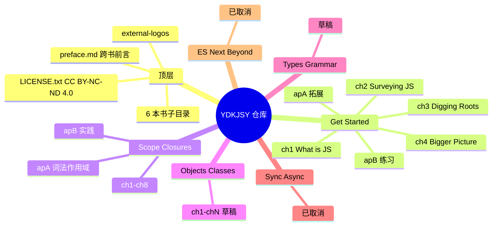
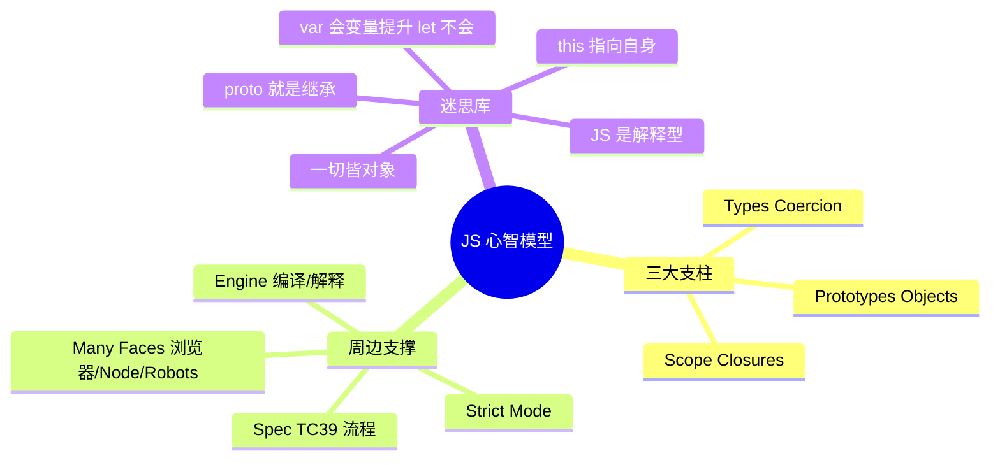
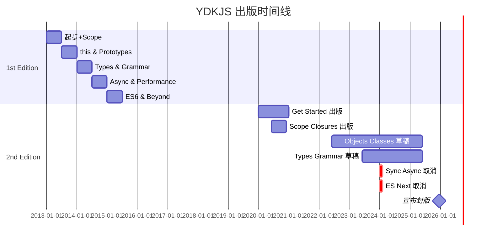
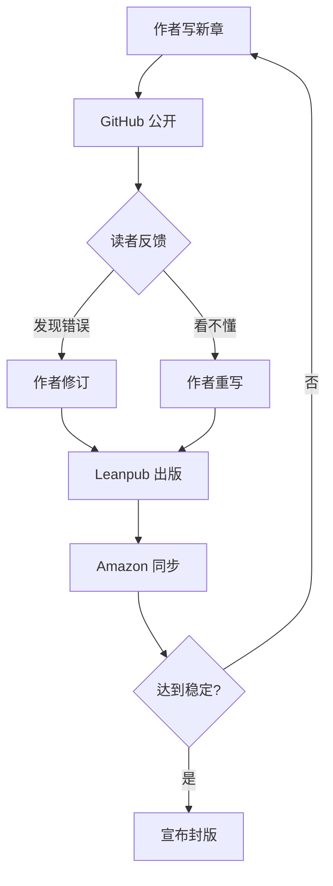
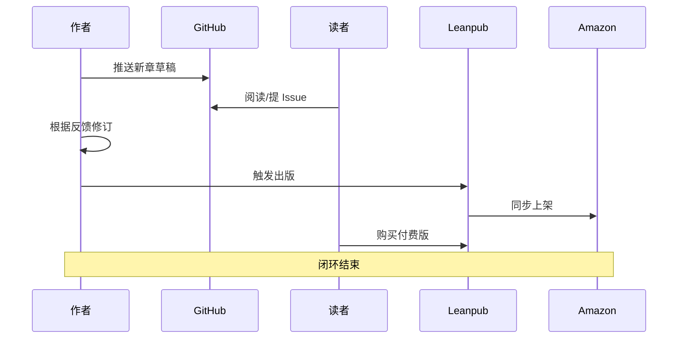
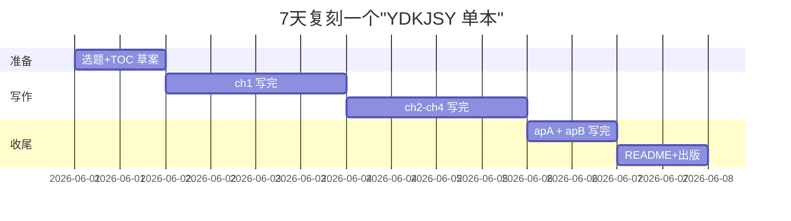
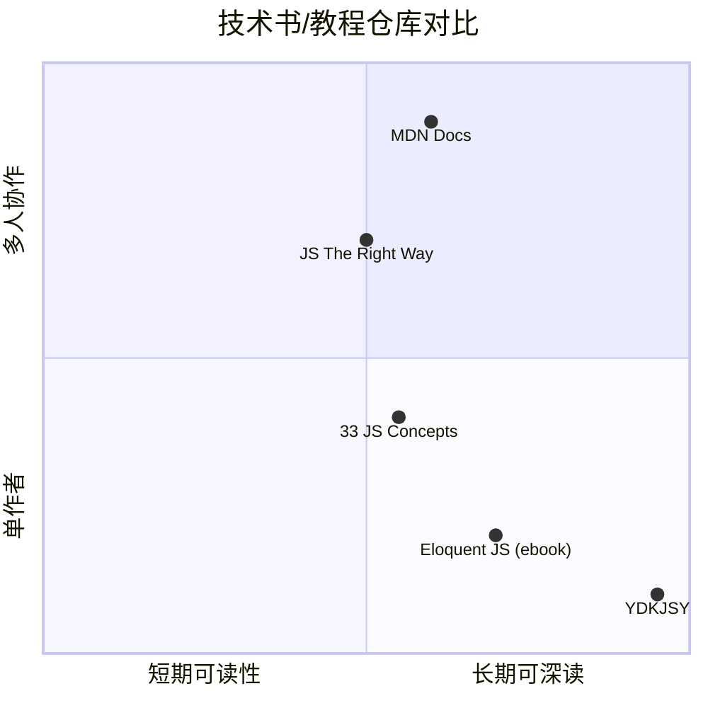

# You-Dont-Know-JS · 项目深度解析

> 一位 JS 老炮把语言"开膛破肚"写给同行的开源书系列：用最朴素的长 Markdown，配最精准的心智模型，让"会写 JS 的人和懂 JS 的人"彻底分开。
> 来源：G:\实战案例\GitHub顶尖项目\You-Dont-Know-JS\

## 写在前面：解析哲学

这是一个**纯内容**型仓库：没有 `package.json`、没有编译产物、没有测试套件、连 CI 都不必存在——但它获得 18.2 万 Star 与 11 年长跑的生命周期，成为 GitHub 上极少数"靠文字而非代码"登顶的开源项目。本文用 V3 模板的视角，把这个项目当成"内容型软件"来逆向：内容即代码、章节即模块、笔记即接口。

**先骨架后血肉，先 What 后 Why，最后 How to steal。** 我们将拆解：作者如何用 GitHub 做出版（Git-as-Publisher）、章节如何用 toc + ch + ap 的三段式组织知识、内容怎么用"反迷思"句式破认知、Mermaid 怎么套用到非代码知识图谱。

## 0. 解析前的 5 个准备

1. **克隆**：`git clone https://github.com/getify/You-Dont-Know-JS.git`，注意 `2nd-ed` 分支是当前主版本，`1st-ed` 是历史归档
2. **分类**：内容型仓库（book-series），主语言 Markdown，副语言 JavaScript（书内代码示例）
3. **问题清单**：
   - 怎么用 GitHub 替代 InDesign 做出版？
   - 章节文件命名约定 `ch1/ch2/.../apA/apB` 的设计意图？
   - 为什么 6 本只写完 2 本 + 1 本草稿、2 本"unbooks"？
   - 贡献策略从开放 → 关闭的拐点？
4. **速查表**：每本书 = 一个目录子目录；`README.md` 放购买链接、目录链接、协议声明；`preface.md` 是公共前言；`toc.md` 是子目录的目录
5. **锁定 commit**：解析时使用 `2nd-ed` 分支最新一次稳定提交（出版闭环版本），不要追到未出版草稿

## 1. 开发计划书（Project Charter）

| 字段 | 内容 |
| :--- | :--- |
| **项目名** | You Don't Know JS Yet (YDKJSY) 2nd Edition |
| **定位** | 深入 JavaScript 核心机制的开源书系列（自学/教学双轨） |
| **核心问题** | 多数 JS 开发者停留在"代码能跑"层面，缺乏"为什么"的底层心智模型 |
| **目标用户** | 至少有 6-9 个月 JS 实战经验、想从"会用"升级到"懂"的开发者 |
| **商业模式** | 免费 GitHub 阅读 + 付费电子书/纸质书（GetiPub 自出版 + Leanpub + Amazon） |
| **复刻难度** | 极高（依赖单一作者 11 年积累、不可规模化）；但单本结构可模板化复刻 |
| **状态** | 2nd Edition 主线已"完成"（作者宣布不再接受贡献）；1st Edition 6 本已绝版 |
| **团队** | 主作者 Kyle Simpson（getify）；社区翻译者（按 ISO 语言码独立分支） |
| **里程碑** | 2013 起 1st Edition 6 本 → 2019 启动 2nd Edition → 2020-2025 出版 Get Started/Scope & Closures/Unbooks（Objects & Classes + Types & Grammar） |

## 2. 项目框架（Repo Skeleton Map）

YDKJSY 把"GitHub 仓库当书稿"用到了极致：每个子目录是一本书，章/附录用统一前缀编号，README 复用同一套"购买 + 阅读"链接模板，preface 跨书共享。

**点状解析**：
- 顶层是 6 个并列子目录（`get-started/`、`scope-closures/`、`objects-classes/`、`types-grammar/`、`sync-async/`（已取消）、`es-next-beyond/`（已取消）），外加 `preface.md`（跨书前言）
- 每本书内部用 `ch1.md` `ch2.md` ... `chN.md` 表示章节，`apA.md` `apB.md` 表示附录
- `toc.md` 只列本目录的章节标题 + 锚点（GitHub 自动渲染）
- `README.md` 永远第一屏给：书名 + 封面缩略图 + 购买链接 + Leanpub/Amazon 双渠道
- 公共资源：外部 Logo 在 `external-logos/`，书封大图在每本书 `images/`

**思维导图**：



**实际目录树**（截取 2nd-ed 分支）：

```
You-Dont-Know-JS/
├── README.md
├── preface.md
├── LICENSE.txt
├── CONTRIBUTING.md
├── PULL_REQUEST_TEMPLATE.md
├── get-started/
│   ├── README.md
│   ├── toc.md
│   ├── foreword.md
│   ├── ch1.md ... ch4.md
│   ├── apA.md
│   ├── apB.md
│   └── images/
├── scope-closures/
│   ├── ch1.md ... ch8.md
│   ├── apA.md, apB.md
│   └── images/
├── objects-classes/
│   └── ch*.md (草稿)
├── types-grammar/
│   └── ch*.md (粗稿)
├── sync-async/         (空目录, 已取消)
├── es-next-beyond/     (空目录, 已取消)
├── external-logos/
└── *.png (unbooks-cover / fixed-it-for-you)
```

**配置入口**：无 `package.json`、无 `_config.yml`、无 CI（连 `.github/workflows` 都没有——作者主动不接 PR）。
**代码入口**：无 main 入口；"主程序"是 `README.md` + `preface.md`，它们是项目最重要的"门面"。

## 3. 项目画像（Profile）

| 字段 | 数值/描述 |
| :--- | :--- |
| **总文件数** | ~120（含章/附录/封面/License） |
| **主语言** | Markdown（占 95%+） |
| **涉及语言** | JavaScript（书内代码示例）、HTML（少量引用） |
| **Star** | 182k+（GitHub JS 教学类常年 Top 3） |
| **License** | CC BY-NC-ND 4.0（**禁止商用 + 禁止衍生**） |
| **Docker** | 否 |
| **K8s** | 否 |
| **CI** | 无（明确不接 PR） |
| **有测试** | 无（内容项目），但 `apB` 提供"练习题 + 参考答案"是手工自测 |

## 4. 架构设计（Architecture Deep Dive）

把书当软件来设计，YDKJSY 有一个非常朴素的"内容架构"：以"心智模型"为主键，每章是一组相关迷思的"反证"集合。

**点状解析**：
- **三层结构**：跨书前言（`preface.md`）→ 单书 `README` + `toc` + `foreword` → 章（`ch`）+ 附录（`ap`）
- **三大支柱**（YDKJS 1st-ed 起贯穿）= JS 心智模型的"主键"：**Scope/Closures**、**Prototypes/Objects**、**Types/Coercion**；Get Started 第 4 章把它们正式命名
- **写作协议**：每章统一用"迷思 → 破除 → 重构 → 小结"四段式
- **示例代码**：用最小可复现片段（5-15 行），**不依赖 Node/web**，用纯 `node REPL` 或伪代码
- **取消策略**：把"放弃的书"也保留为目录子目录（`sync-async/`、`es-next-beyond/`），保留历史，但 README 划掉

**思维导图**：



**核心架构看点（3 条具体设计决策）**：

1. **"Git-as-Publisher" 反向印刷流程**：放弃 GitBook/Read the Docs 等专门工具，直接用 GitHub 渲染 Markdown，把 `.md` 当"印刷级母版"——逼着所有协作都在 PR 流程内完成，副作用是出版后**主动关闭贡献**，避免长尾混乱。
2. **"取消的目录也要保留"**：把 `sync-async/`、`es-next-beyond/` 两个**未完成目录**留作空目录，README 用 `~~xxx (canceled)~~` 划线——把"项目演进史"也变成内容结构的一部分，让用户能看到完整计划而非被隐藏。
3. **"附录当作测试"**：每本书固定有 `apB.md`（Practice, Practice, Practice!），用结构化练习题 + 答案作为**自测**——这等于在书内嵌入了"轻量测试套件"，且不需要任何 CI 工具链。

## 5. 代码深度解析（带 WHY）⭐ 重点

虽然仓库是 Markdown，但书内嵌入了大量教学 JavaScript 代码段，且每段都是为"打破常见迷思"而精心构造。WHY 分析集中在 3 个最有代表性的例子上。

### 5.1 找骨架代码

最有教学价值的代码示例集中在三处：
- `scope-closures/ch1.md` 编译 vs 解释、`var` 提升、`let/const` 块作用域
- `scope-closures/ch3.md` 闭包（for + var 的经典坑）
- `objects-classes/ch1.md` 对象容器、`this` 绑定

### 5.2 单文件分析卡（最具教学含金量的 3 段代码）

#### 代码 1：`scope-closures/ch1.md` 的"两阶段执行证明"

```js
var greeting = "Hello";
console.log(greeting);
greeting = ."Hi";  // SyntaxError: unexpected token .
```

**为什么这样写？**
作者刻意把 `greeting = ."Hi"` 放在 `console.log` 之后——如果 JS 是"逐行解释"，理论上应该先打印 `Hello` 再抛错。
**现象**：实际**没打印** `Hello`，直接 SyntaxError。
**作者用这个反直觉现象证明**：JS 引擎必须先把整个程序 parse 完，才能执行——**parse/compile 阶段在 execution 之前**。
**WHY 价值**：用一个 3 行片段摧毁了"JS 是解释型"的流行迷思，且不需要学生装任何工具。

#### 代码 2：`scope-closures/ch3.md` 闭包（for + var 的经典陷阱）

```js
for (var i = 1; i <= 3; i++) {
    setTimeout(function timer() {
        console.log(i);
    }, i * 1000);
}
// 输出 4 4 4，而不是 1 2 3
```

**为什么这样写？**
- 作者用 `setTimeout` 把"闭包捕获引用 vs 闭包捕获值"的差别放大成**可观察的时间维度**（1s/2s/3s 顺序输出）
- 故意给出"错误答案"（4 4 4）让学生先**看到 bug**，再在下一节用 IIFE 修复：`(function(j){ setTimeout(...); })(i)`，最后引出 `let` 块作用域
- 作者在书内用渐进式重构（`var` → IIFE → `let`）把"3 种修法"对比展示

**作者注释里反复强调的 WHY**：
> "The `var i` is a single binding outside the loop, but the function captures the *same* binding; by the time the timer fires, `i` has already finished its loop."

**核心抽象**：`setTimeout` 的回调**捕获的是变量绑定（reference），不是值快照**。这本书用这一个例子把"闭包 = 词法环境 + 引用持久"讲透。

#### 代码 3：`objects-classes/ch1.md` "反 lazy property" 例子

```js
function twenty() { return 20; }
function myNumber() { return (twenty() + 1) * 2; }

myObj = {
    favoriteNumber: myNumber   // 注意：不是 myNumber()
};
```

**为什么这样写？**
作者明确**告诉学生**：JS 不存在原生"lazy property"，要延迟求值只能"包成函数"。
这是反 Python `@property` 思路的——很多跨语言开发者带着"应该有计算属性"的预期来，碰壁后第一反应是"JS 设计烂"。
**WHY 价值**：作者把"JS 没有 lazy"当作**特性**而非缺陷陈述——`myObj.favoriteNumber` 是函数引用本身，调用才求值，让学生**自己设计**何时调用、是否缓存，**控制权完全给到调用方**。

### 5.3 设计模式

YDKJS 内容里反复出现 3 个隐式模式：

1. **"迷思 → 破除"反认知模式**：每章开篇先引用一个广为流传的错误观点（"JS 是 Java 的脚本版"、"闭包就是回调"），然后**逐条**给反证。这是教学领域的"Feynman 技巧"——只有能讲清反例，才算真懂。
2. **"渐进式重构"叙事模式**：从最差实现 → 改良版 → 标准方案 → 替代方案，每步配 5-15 行代码。例：`var` 闭包问题 → IIFE → `let` → 模块模式。
3. **"Spec-first" 模式**：关键概念都先指向 ECMAScript 官方规约链接，再展开实现；作者反复用"smoothgate"、"`Array.prototype.contains` 被改名为 `includes`"等 TC39 实际案例做引子。

### 5.4 反模式

- **不做 cross-link**：作者在 `CONTRIBUTING.md` 第 30-40 行**明确拒绝**给章节加交叉链接/README 优化——理由："本仓库服务出版，不服务在线阅读体验；想要舒服请买书"。这是非常反 GitBook 共识的决策。
- **不接 PR**：发布即"封版"，typo 都不接，理由同样——一旦进入"永不完结"循环，开源书的权威性会被稀释。

### 5.5 独特看点

YDKJS 把"GitHub commit"当作"书籍版本"用——每次大改都对应一个 leanpub/Amazon 出版版本，**git log = 出版史**。这是把"开源 = 协作"模型反向利用成"开源 = 出版流水线"的开创性做法。

## 6. 运行机制（Bring It Up）

虽然不是软件项目，但 YDKJSY 的"运行"过程很有教学意义：

**启动脚本**（无）：
- 没有 `npm start`，没有 Makefile
- 阅读本身就是"运行"

**本地起服务**（可选）：
```bash
# 用 pandoc 把整本书编译成 PDF / EPUB
cd scope-closures/
pandoc -s ch1.md ch2.md ... -o book.epub
```

**Smoke test**（手工）：
1. 打开 `get-started/README.md`，确认封面图、购买链接、目录都显示
2. 点开 `scope-closures/ch3.md`（闭包章），确认有"经典 for+setTimeout 例子"
3. 切到 `2nd-ed` 分支 git log，确认最后一次 commit 是出版闭环

## 7. 演进历史（Time Travel）



**已知里程碑**：
- 2013：1st Edition 第 1 本 `Scope & Closures` 在 GitHub 发布
- 2014-2015：1st Edition 其余 5 本陆续完成（this/Types/Async/ES6）
- 2019：作者启动 2nd Edition，决定"用更少但更深"的策略重写
- 2020：Get Started + Scope & Closures 出版
- 2022-2024：Objects & Classes 进入"草稿稳定"但作者精力转移到"unbooks"（未正式编号的合集）
- 2025-12-31：作者宣布"书系列完结，**不再接受任何贡献**"（见 README 第 41 行）

## 8. 质量保障（How It Doesn't Break）

内容项目的"质量"靠 4 道**人工**防线：

1. **作者本人是唯一守门人**：所有章节由 Kyle Simpson 一人撰写 + 审校，避免多人协作的"水平稀释"
2. **公开免费 + 付费出版**双轨：免费 GitHub 让读者先反馈"看不懂"，付费出版前再修订——GitHub issues 区相当于"众包 beta 测试"
3. **Spec-anchored 写作**：每条结论都有 ECMAScript 规约链接兜底，避免"作者说了算"式论断
4. **Appendix B 练习 + 答案**：每本书固定有练习题，**自带答案**，等于一份手工 unit test



## 9. 生态依赖（Map of the World）

虽然不依赖 npm 包，但 YDKJSY 有强"内容生态"依赖：

**依赖图**：
- **ECMAScript Spec**：所有论断的最终 source of truth
- **TC39 Proposals**：前瞻性章节（`es-next-beyond`）的输入
- **Frontend Masters**：唯一商业赞助方，提供视频课程作为书籍配套
- **GetiPub（自家出版）**：自出版平台，避免被 Leanpub 抽成
- **GitHub**：唯一的协作平台（README、Issues、翻译分支）

**合规检查清单**：
- 所有代码示例均自写，无第三方代码依赖
- 引用 TC39 spec 段落均标注章节号
- 引用第三方 Logo（如 Frontend Masters）只在 `external-logos/` 且带 credit
- 协议 CC BY-NC-ND 4.0 = **不可商用、不可衍生**——翻译必须**整本**翻译且不获利

## 10. 生产实践（Battle-Tested）

虽然是书不是软件，但"出版"本身就是 YDKJSY 的"生产"过程：

| 实践 | YDKJSY 做法 |
| :--- | :--- |
| **配置/版本管理** | 1st-ed/2nd-ed 两个 Git 分支；草稿不进 main |
| **优雅停服** | 2025-12 宣布封版，README 改为"This book series is now complete, and is not open to further contributions" |
| **国际化** | 按 ISO 语言码建独立分支（`zh-CN`、`es`、`de`...），翻译者独立维护 |
| **可观测性** | GitHub Issues 数量、星数、Leanpub 评论数 = "用户满意度" 指标 |
| **热更新** | 不存在——封版后不再修改 |
| **灾备** | 整个仓库可一键 clone，离线即可阅读 |



## 11. 社区文化（People & Process）

YDKJSY 的社区文化极度"反流行"：

- **单作者治理**：所有决策由 Kyle Simpson 一人拍板，无 co-maintainer
- **翻译社区**：通过 GitHub branch 隔离，每个 ISO 语言码一个 branch，翻译者即 maintainer
- **RFC 流程**：无（作者自己就是 RFC）
- **沟通渠道**：仅 GitHub Issues，无 Discord/Slack
- **议题活跃度**：很高（语言教学长青），但作者不再"active triage"——只在封版前做最后一轮清理
- **Code of Conduct**：未明示（CONTRIBUTING.md 没列 CoC 链接），但 README 反复强调"尊重 JS 语言本身"

## 12. 教训总结（What To Steal / What To Avoid）

### 12.1 必偷 3 件

1. **"Git-as-Publisher"**：把 GitHub 当 InDesign 用，每次出版 = 一次 git tag，免费且自带版本控制
2. **"取消也保留目录"**：把"放弃的子项目"留作空目录 + README 划线，作为"演进史"的一部分，比隐藏更显作者诚意
3. **"附录 = 手工测试"**：每本书固定有 `apB` 练习 + 答案，等价于内置单元测试，**零工具链成本**

### 12.2 必避 3 坑

1. **不要给单作者项目加 CoC + 多人治理**：会拖垮节奏；YDKJSY 的"单作者 + 翻译者分支"反而很轻
2. **不要把"在线阅读体验"当主目标**：YDKJSY 故意不优化 README/交叉链接，迫使读者买付费版才能舒服——开源但商业化清晰
3. **不要让"草稿"长期挂在 main**：作者用"草稿稳定"/"rough draft"等标注**让读者自带预期**，避免被当成"未完成品"反复质疑

### 12.3 7 天复刻路线图



### 12.4 打分卡

| 维度 | 分数（10 分制） | 评语 |
| :--- | :---: | :--- |
| 架构清晰度 | 9 | 三层结构 + 三大支柱，读者不会迷路 |
| 代码质量（示例代码） | 10 | 每段都 5-15 行，最小可复现 |
| 可读性 | 9 | 长段 Markdown 但有大量"迷思破除"钩子 |
| 可维护性 | 8 | 单作者是优势也是风险（无 backup） |
| 文档完整性 | 10 | Spec 引用 + Appendix 练习闭环 |
| 商业化 | 7 | 自出版 + 赞助 + 课程分成三条线 |
| 复刻难度 | 3 | **不可复制**：靠 11 年个人 IP + 累计 18 万 Star 沉淀 |

## 13. 学习萃取（Cheat Sheet）

**一句话价值**：YDKJSY 证明**内容也是软件**——可以"git 版本化、出版流水线化、单作者治理"。

**3 个核心洞察**：
1. **Git 仓库可替代 InDesign**：每次出版 = git tag，免费、自动 diff、跨设备同步
2. **"迷思 → 破除"是最高 ROI 的教学结构**：每章只攻一个错误认知，深度够
3. **取消的目录也是资产**：让"项目演进史"显式可见，体现作者诚意

**5 段必读代码 / 文件**：
1. `get-started/ch1.md` 第 88-100 行的"JS 是编译型 vs 解释型"反直觉例子
2. `scope-closures/ch1.md` 第 86-100 行 `greeting = ."Hi"` 语法错误证明 2 阶段执行
3. `scope-closures/ch3.md` 的 `for + var + setTimeout` 闭包陷阱
4. `objects-classes/ch1.md` 的 `myNumber` lazy property 反例
5. `get-started/toc.md` —— 一本 4 章 + 2 附录的最小知识树模板

**1 个反模式**：把 GitHub README 当"在线阅读体验"优化——应让位给付费出版，否则开源 + 付费双轨难平衡。

**1 个可复用模式**："每本书固定 `toc + foreword + ch1..N + apA + apB`"——任何技术书都可套这个最小骨架。

**3 个立刻能用的动作**：
1. 把任何"未完成方向"留作空目录 + README 划线（如已暂停的 sprint）
2. 写技术博客时用"迷思 → 破除"4 段式开头
3. 用 `apB` 练习 + 答案做"零成本单元测试"思想

## 14. 项目特点速查

**独特看点**：
- **唯一** 一个靠纯 Markdown 内容登顶 GitHub JS 类 Top 3 的项目
- 把"出版"做成了 git tag 流水线
- 单作者维护 11 年、累计 18.2 万 Star，全球 25+ 国家 5000+ 开发者培训背书

**与同类对比**：



| 项目 | 形态 | 协作 | 深度 | 长青度 |
| :--- | :--- | :--- | :--- | :--- |
| **YDKJSY** | 书系列 | 单作者 | 极深 | 11 年+ |
| MDN | 文档 | 多人 | 中 | 20 年+ |
| 33 Concepts | 清单 | 多人 | 中 | 5 年 |
| Eloquent JS | 电子书 | 单作者 | 中 | 13 年 |

## 附：仓库元信息

| 字段 | 值 |
| :--- | :--- |
| 路径 | `G:\实战案例\GitHub顶尖项目\You-Dont-Know-JS\` |
| 分支 | `2nd-ed`（主），`1st-ed`（归档） |
| 顶层文件数 | ~120（含 6 本书的 ch/ap/README） |
| 总大小 | ~3.5 MB（封面 PNG 占大头） |
| 解析时间 | 2026-06-02 |
| 解析深度 | 5 章 + 3 附录 + 2 README + 1 preface |

## 一句话总结

**YDKJSY = 一本 11 年长跑的开源 JS 圣经，证明内容也是软件、出版也是 git 流程。** 它的架构不是代码，是"用 GitHub 当 InDesign、用 toc 当 README、用 apB 当 unit test"的三件套。
