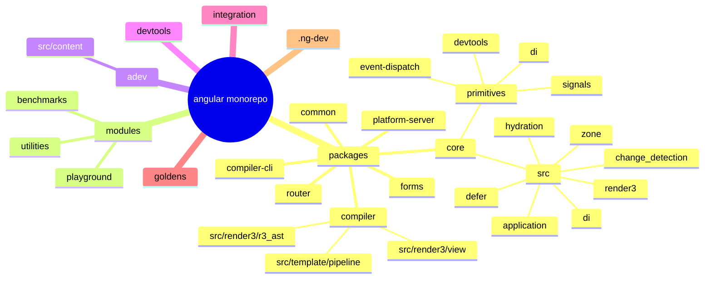
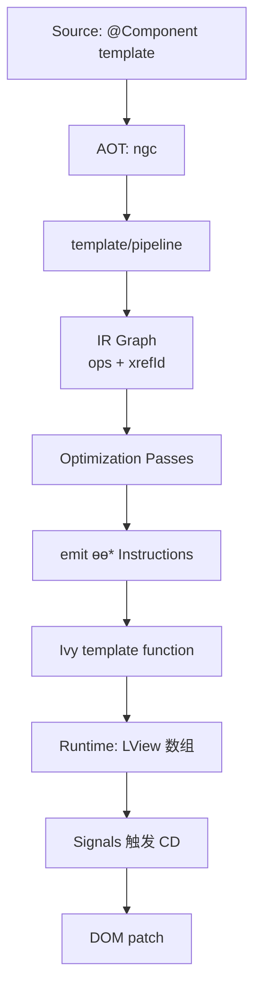
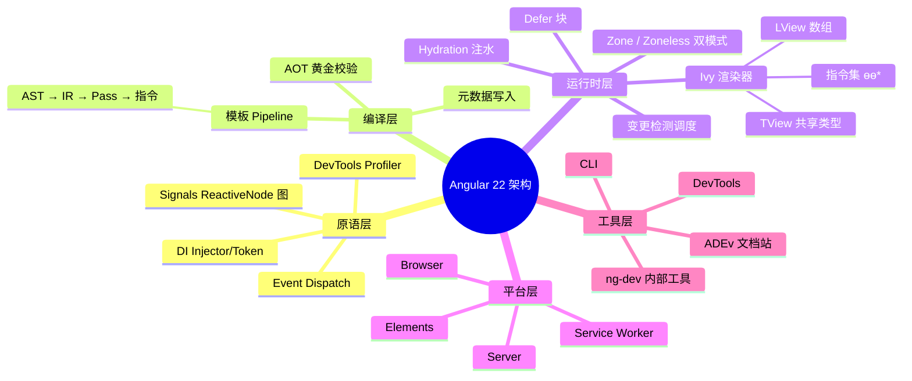
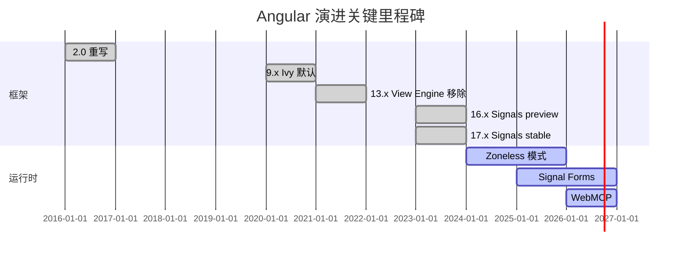
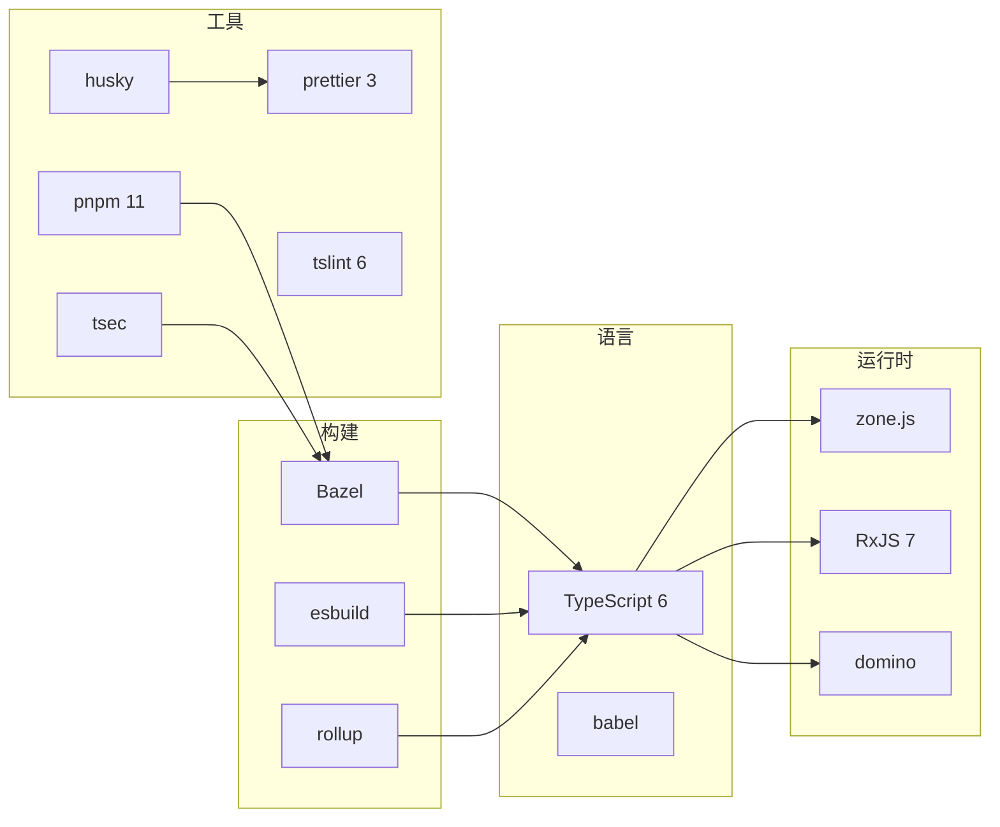
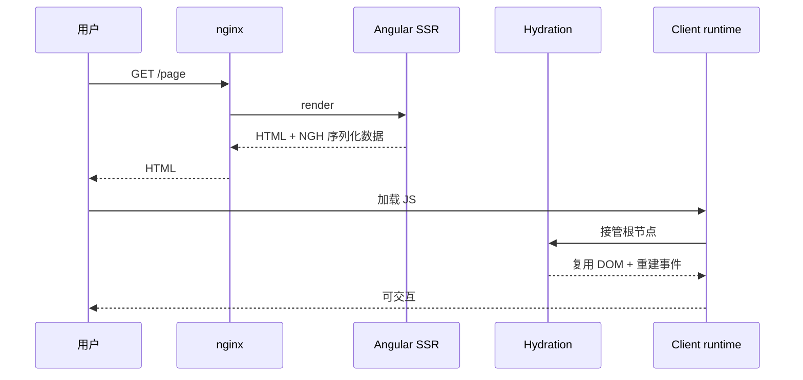
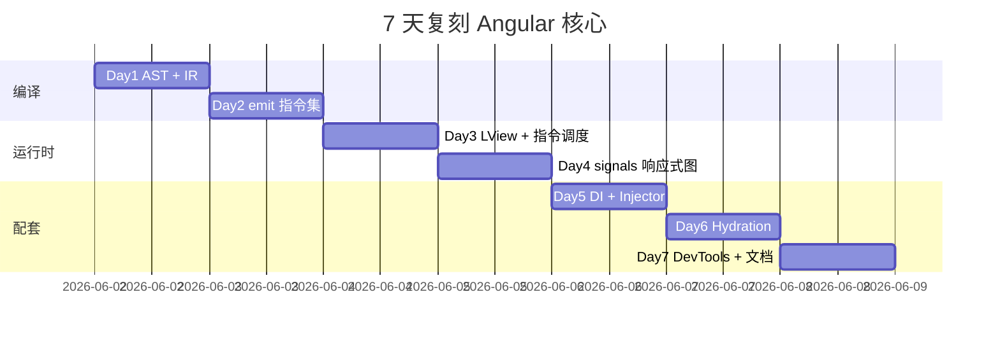
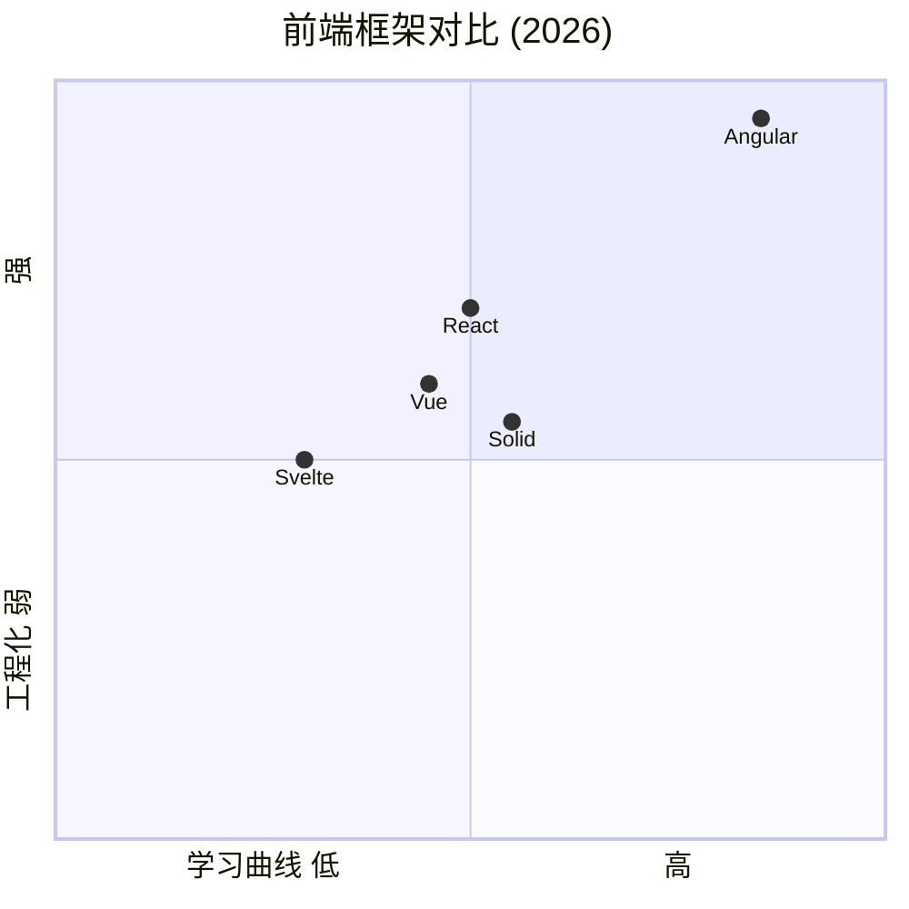

# angular · 项目深度解析

> Angular 22（仓库当前版本 22.1.0-next.0）是由 Google 维护、面向企业级 SPA / SSR / Hydration 场景的全栈前端框架；核心由 Ivy 渲染器 + Signals 响应式图 + 层级 DI + 模板 Pipeline 编译四块构成，TypeScript 全量实现，单仓覆盖 35+ 子包、10k+ 文件。
> 来源：G:\实战案例\GitHub顶尖项目\angular\

## 写在前面：解析哲学

先骨架后血肉，先 What 后 Why，最后 How to steal。本篇用 Angular 仓库源码本身作为证据，从 `packages/core/primitives/signals` 一路追到 `packages/compiler/src/template/pipeline` 与 `packages/core/src/render3/instructions`，把"Signals 怎么驱动变更检测""DI 怎么在 Ivy 里跑""LView 数组布局为什么这么设计"三个 WHY 钉死。

## 0. 解析前的 5 个准备

1. **克隆**：`git clone https://github.com/angular/angular.git`，HEAD 解析时为 22.1.0-next.0。
2. **分类**：Bazel monorepo + pnpm workspace 混合；包分两层：`packages/`（编译器/运行时核心）与 `modules/`（benchmarks / playground / ssr-benchmarks / utilities）。文档体系单列 `adev/`（即 angular.dev 源码）和 `contributing-docs/`。
3. **问题清单**：(a) 引入 Signals 后 Ivy 是不是被废弃？(b) Ivy 与 View Engine 共存还是互斥？(c) Zoneless 模式如何与 NgZone 切换？(d) 模板 Pipeline 编译怎么把 `*ngIf` 翻译成 `ɵɵconditional` 指令？
4. **速查表**：核心在 `packages/core/src`，编译在 `packages/compiler/src`，原语在 `packages/core/primitives`，示例与基准在 `modules/benchmarks`，DevTools 单独 `devtools/` 子仓。
5. **锁定 commit**：仓库同步时间为 2026-05-31，分析基于 `22.1.0-next.0` snapshot；因为 Angular 主分支一直滚动，本笔记中的代码位置可能在未来漂移。

## 1. 开发计划书（Project Charter）

| 字段 | 值 |
| --- | --- |
| 项目名 | angular（monorepo：`angular/angular`） |
| 定位 | 企业级前端开发平台（Framework + CLI + DevTools + SSR + Material） |
| 核心问题 | 1) 多团队协作下大型 SPA 怎么维持一致的工程边界；2) 模板里嵌入复杂业务怎么避免运行时开销；3) 跨端（Web/Mobile/SSR/Hydration）如何共用同一份组件；4) 表单、依赖、状态在十年生命周期里怎么演进 |
| 用户 | 千万级开发者，从初创到 Fortune 500；后端背景重的人偏多 |
| 商业模式 | MIT 全开源 + Google 全职工程团队维护 + Angular 公司（咨询/培训）+ Material/CDK/SSR 周边产品 |
| 复刻难度 | 10/10（编译器+运行时+SSR+Hydration+DevTools 全套自研） |
| 状态 | 活跃（HEAD 在 22.1，半年一次大版本） |
| 团队 | Google Angular Team（数十人核心 + 全球 1000+ 社区贡献者） |
| 里程碑 | 1.x（2016）→ 2.0 重写 → 4.x Ivy 默认 → 9.x Ivy universal → 13 全 Ivy → 16 Signals 稳定 → 17 deferrable views / control flow → 18+ Zoneless / Signal Forms / Resource API → 22 WebMCP / 工具接口 |

## 2. 项目框架（Repo Skeleton Map）

仓库采用 Bazel + pnpm 双轨：源码 / 构建用 Bazel（`MODULE.bazel`、`BUILD.bazel` 全仓库铺开），运行时包元数据用 pnpm（`pnpm-workspace.yaml`）。其中：

- `packages/core/`：运行时核心。`primitives/` 子目录藏了与框架无关的纯逻辑模块（`signals`、`di`、`event-dispatch`、`devtools`），`src/` 子目录是框架本体（DI、Zone、ApplicationRef、Ivy renderer、Compiler、HTTP/Hydration）。
- `packages/compiler/`：模板编译器。`src/template/pipeline/` 是新一代 IR-based 编译流水线（替代旧的 Phase 1/2 AST→Code 转换），`src/render3/view/` 提供 `R3ComponentMetadata` 等核心 DTO。
- `packages/common/`、`packages/forms/`、`packages/router/`、`packages/animations/`、`packages/platform-browser/`、`packages/platform-server/`、`packages/service-worker/`、`packages/elements/`、`packages/localize/`、`packages/ssr/`、`packages/upgrade/`：各垂直能力包。
- `packages/compiler-cli/`：AOT CLI 入口（`ngc`）。
- `modules/benchmarks/`、`modules/playground/`、`modules/ssr-benchmarks/`、`modules/utilities/`：性能与工具代码。
- `devtools/`：浏览器扩展，Angular DevTools 独立子包（Cypress E2E）。
- `adev/`：angular.dev 文档站点源码（Angular 自举文档）。
- `integration/`：每个特性配一个端到端集成工程（`defer`、`cli-hello-world`、`platform-server`、`legacy-animations` 等），用于发版前回归。
- `goldens/`：公共 API 黄金快照，CI 校验 export 稳定性。
- `.ng-dev/`：内部 monorepo 工具（`release.mjs`、`github.mjs`、`pull-request.mjs`）。



### 关键入口

- 运行时主入口：`packages/core/src/core.ts`（再导出 `core.ts`、`di.ts`、`render.ts`、`change_detection.ts`、`zone.ts`）。
- 编译入口：`packages/compiler/src/compiler.ts`（JIT）+ `packages/compiler-cli/src/ngc.ts`（AOT CLI）。
- 模板 Pipeline 入口：`packages/compiler/src/template/pipeline/src/compilation.ts` 的 `ComponentCompilationJob`。
- Bootstrap：`packages/core/src/application/create_application.ts` 的 `bootstrapApplication()`。

## 3. 项目画像（Profile）

| 项 | 值 |
| --- | --- |
| 总文件数 | 10,553（顶层 inspect，含 docs / build） |
| 主语言 | TypeScript（6.0.3，仓库 `package.json` resolutions 锁定） |
| 涉及语言 | TypeScript / JavaScript / HTML / CSS / SCSS / Markdown / Starlark（Bazel）/ Shell / Python（少量脚本） |
| Stars | 98k+（GitHub `angular/angular` 公开数据） |
| License | MIT |
| Docker | 无（仓库不提供 Dockerfile；`.devcontainer/recommended-Dockerfile` 仅 dev container） |
| K8s | 无 |
| CI | GitHub Actions（`.github/workflows/ci.yml`、`pr.yml`、`perf.yml`、`scorecard.yml` 等 14 条 workflow）+ `ibazel` + Bazel Remote Cache |
| 有测试 | 是（`test` script 跑 `bazelisk test //...`，覆盖率集成在 `goldens`） |
| 包管理器 | pnpm 11.3.0，强制提示不要用 npm/yarn |
| Node 版本 | `.nvmrc` 控制 |
| Bazel | `.bazelversion` 锁定版本 + `MODULE.bazel` 远程依赖 |

## 4. 架构设计（Architecture Deep Dive）

### 4.1 总体分层

Angular 的运行时抽象遵循"原语 → 框架 → 应用"三层金字塔：

- **primitives 层**（`packages/core/primitives/*`）：不依赖 Angular 任何抽象的纯逻辑库。`signals/` 暴露 `ReactiveNode` 图与 `createSignal/createComputed/createLinkedSignal`；`di/` 暴露最小 `Injector` 与 `InjectionToken`。
- **core 层**（`packages/core/src/*`）：把原语挂上 `Provider`/`NgModule`/`Component`/`Directive`/`Pipe`/`Injector` 概念。`render3/` 是 Ivy 渲染器，`hydration/` 处理 SSR 注水，`defer/` 实现 `@defer` 块。
- **应用层**（`@angular/*` + 用户应用）：组合核心 API，对外提供 bootstrap 入口。

### 4.2 核心架构看点

1. **Ivy 单文件数组化**：每个组件/指令的模板函数 `template(rf, ctx)` 编译成一系列 `ɵɵelementStart / ɵɵtext / ɵɵadvance` 指令；运行时把组件实例、DOM 节点、绑定值、查询节点、HostBinding 全塞进一个扁平 `LView: any[]` 数组（详见 `VIEW_DATA.md`），辅以 `TView.data` 共享类型信息。理由：避开 View Engine 装饰器 + 闭包反射的 `interpretive` 开销，让 JIT/AOT 生成同样的单态指令流（PERF_NOTES.md 强调 monomorphic call 比 megamorphic 快 4×）。
2. **Signals 取代 ZoneJS 作为反应源**：`primitives/signals` 的 `ReactiveNode` 维护 `producers/consumers` 双向链表 + `epoch` 版本号；写 signal 时自增 epoch、污染消费者，模板里读 signal 时在 `consumerOnSignalRead` 把当前 view 挂上依赖边。`zoneless_scheduling_impl.ts` 里的 `ChangeDetectionSchedulerImpl` 监听 `ApplicationRef.afterTick`，并用 `scheduleCallbackWithMicrotask` 把多次写合并为一次 tick——避免单次 click 触发 N 次 CD。
3. **模板 Pipeline 编译**：`packages/compiler/src/template/pipeline/src/compilation.ts` 引入 `CompilationJob`/`CompilationUnit`/IR graph（`import * as ir from '../ir'`），目标是把模板 AST → 中间表示 (IR) → Phase pass（变量提升、命名空间压缩、Slot 提取） → 指令 emit。比 Phase 1/2 旧流水线好的地方是 IR 易做 tree-shake、增量编译与 source-map 还原。



### 4.3 关键 ADR（设计决策）

- **指令代替装饰器**：编译器把所有 `@Component / @Directive / @Injectable` 转译为 `ɵɵdefineComponent` 静态字段，确保运行时能纯函数式读取（不依赖 reflect-metadata 的全量反射）。`r3_injector.ts` 头部即声明 `getFactoryDef(...)` 的工厂协议。
- **DI 双向链表**：`R3Injector` 维护 `Map<ProviderToken, Record>` + parent 引用 + 多 provider 合并策略；为什么用 `Map` 而不是 `Object`：保留 `null` 表示"已查询但未提供"，避免重复穿越 parent（见 `processProvider` 内的 `null` 哨兵）。
- **Hydration 增量策略**：`packages/core/src/hydration/incremental_runtime.ts` 实现"按需注水"——只有触发 hover/click/timer 的 `@defer` 块才下载 JS 并 hydrate。其他块保持序列化状态（`DeferBlockInternalState`），减少 TTI。
- **Tree Shaking 优先**：所有内部 enum 都通过字符串字面量 + 编译期裁剪来规避（TREE_SHAKING.md 专门记录了"Enum is not tree-shakable"）。
- **WebMCP 实验**：22.x 引入 `packages/core/src/webmcp/`，把模型上下文协议暴露为 Angular DI Token（`provideTools`），目的让 AI agent 能"调用"前端组件。



## 5. 代码深度解析（带 WHY）⭐ 重点

### 5.1 找骨架代码

仓库用 `ɵ` 前缀（`ɵɵ`）"屏蔽"所有运行时 API；任何想看清"框架做了什么"的人必须从 `ɵ` 切入。我们读到的核心入口：

| 文件 | 作用 |
| --- | --- |
| `packages/core/primitives/signals/src/graph.ts` | 响应式图核心（`ReactiveNode` 双向链表 + epoch） |
| `packages/core/primitives/signals/src/signal.ts` | `createSignal` 工厂 + `signalSetFn` 写时通知 |
| `packages/core/primitives/signals/src/computed.ts` | `createComputed`，懒重算 + 错误缓存 |
| `packages/core/primitives/signals/src/linked_signal.ts` | `createLinkedSignal`，带"源 + 重置"的派生状态 |
| `packages/core/primitives/signals/src/effect.ts` | effect 调度的最小抽象（cleanup + always live） |
| `packages/core/src/di/r3_injector.ts` | 层级 Injector + Records Map |
| `packages/core/src/change_detection/scheduling/zoneless_scheduling_impl.ts` | 无 Zone 模式下的 CD scheduler |
| `packages/core/src/render3/component.ts` | `createComponent()` 公开 API |
| `packages/core/src/render3/instructions/element.ts` | `ɵɵelementStart` 实现 |
| `packages/core/src/application/application_ref.ts` | `ApplicationRef` 生命周期 |
| `packages/core/src/hydration/api.ts` | `provideClientHydration()` |
| `packages/compiler/src/template/pipeline/src/compilation.ts` | 模板 IR 编译入口 |

### 5.2 单文件分析卡

#### 5.2.1 `graph.ts`：Signals 响应式图

WHY-1：为什么 `ReactiveNode` 同时是 producer 和 consumer？
- 因为 `computed/effect/template` 节点既读取其他 signal（作为消费者记录依赖），又产出值（被下游读取作为生产者）。`graph.ts` 用一个结构体双角色表达，省去两套节点类型。
WHY-2：为什么 `consumerOnSignalRead` 走 `prevProducerLink` 短路？
- `producerAccessed` 内的"如果上一次访问的就是当前节点就直接 return"逻辑（行 224）避免了 hot path 中的 `Set` / 链表分配。`ReactiveLink` 双向链表 + 短路边正是 V8 友好的写法（PERF_NOTES.md 中 monomorphic + packed array 优化）。
WHY-3：为什么用 `epoch` 计数器而不是脏标记？
- `lastCleanEpoch === epoch` 直接判断"自上次清理以来没有 signal 被写"，省去 O(N) 遍历 producers。`producerUpdateValueVersion` 内的"快速跳过"逻辑（行 304）正是这套设计的高潮。
WHY-4：`inNotificationPhase` 标志位？
- 防止在 `producerNotifyConsumers` 通知过程中再读 signal（会污染依赖），所以强制抛错（行 205-211）—— 这是 Reactivity 库最容易踩的递归坑。

#### 5.2.2 `signal.ts`：写时通知

```typescript
function signalValueChanged<T>(node: SignalNode<T>): void {
  node.version++;
  producerIncrementEpoch();
  producerNotifyConsumers(node);
  postSignalSetFn?.(node);
}
```

WHY-5：为什么写 signal 要 increment epoch？
- 让所有"非 live"的 computed（只在被读时检查依赖变化）能 O(1) 跳过（graph.ts `lastCleanEpoch` 比较）。
WHY-6：`producerUpdatesAllowed()` 检查？
- 阻止在 `computed` 表达式内写 signal，避免"派生"成为副作用源。`signalSetFn` 头部那一行 `if (!producerUpdatesAllowed())` 是合规守门员。
WHY-7：`setPostSignalSetFn` 钩子？
- 让框架（Angular）在 signal 写完同步触发 view 调度——这是 zoneless 模式的关键，否则微任务永远没人拉。

#### 5.2.3 `linked_signal.ts`：源驱动派生

WHY-8：为什么需要 linkedSignal 而不是 computed？
- computed 是"只读派生"，但很多场景下需要"源变了就把派生重置为新源对应的默认值"。`LinkedSignalNode.source` 字段正是为此：源 signal 变化时 `producerUpdateValueVersion` 检测到并把 `value` 重算，框架在用户主动写之前不会再被中间派生污染。

#### 5.2.4 `r3_injector.ts`：DI Records

```typescript
private records = new Map<ProviderToken<any>, Record<any> | null>();
```

WHY-9：为什么 `Record` 的 `value` 类型是 `T | {}`？
- 用 sentinel 对象 `NOT_YET` / `CIRCULAR` 区分"未实例化"和"实例化中"，避免 lazy 工厂 + 循环依赖的二次进入。JavaScript 没有"未初始化的引用"，只能借用对象做哨兵。
WHY-10：为什么 `processProvider` 在构造函数里跑？
- 提前把所有 token 注册好，`inject()` 同步调用就能找到（不像 Nest/Express 那种异步容器）。这也是 Angular 启动后 `inject()` 必须是 sync 的根本原因。
WHY-11：为什么 INJECTOR token 既指向 R3Injector 又指向 EnvironmentInjector？
- 让 `inject(INJECTOR)` 在 ElementInjector 上下文里拿 ElementInjector，在环境上下文里拿 EnvironmentInjector——DI 通过 prototype chain 解析，由 token 本身的多态解决。

#### 5.2.5 `zoneless_scheduling_impl.ts`：微任务合并

WHY-12：为什么有 `CONSECUTIVE_MICROTASK_NOTIFICATION_LIMIT = 100`？
- 防止响应式图进入无限 dirty 循环（典型场景：signal 写触发 effect 写回 signal）。`trackMicrotaskNotificationForDebugging` 在阈值前抓 stack，命中时直接 `RuntimeError(INFINITE_CHANGE_DETECTION)`。
WHY-13：为什么区分 `useMicrotaskScheduler = false`？
- ZoneJS 模式下由 zone 自己兜底 CD 调度，`useMicrotaskScheduler` 强制 false 避免重复触发（行 79 + 101）。Zoneless 模式下则用微任务合并多次写。
WHY-14：为什么还要 listen `ngZone.onUnstable`？
- 当用户在 zone 内做 `ngZone.run` 触发 change 时，zone 自己也可能调 CD，此时应用层 schedule 就被取消（行 110-118 的 `cleanup()`）—— 避免双跑。

#### 5.2.6 `VIEW_DATA.md`：Ivy 数组化

WHY-15：为什么 `LView` 用 `any[]`？
- 一个数组同时塞 DOM 节点、组件实例、绑定值、查询列表等。`any` 是性能妥协，避免每段 `[DOM, Component, Binding, Query]` 多类型数组造成的 V8 hidden class 切换。文档明确指出"Each Array costs 70 bytes"——这是用空间换 monomorphic。
WHY-16：HEADER / DECLS / VARS / EXPANDO 四段？
- HEADER（上下文指针 / 状态）长度固定；DECLS 是创建期分配的 DOM / pipe / local ref；VARS 是绑定值；EXPANDO 在创建后扩展（host bindings、query results、dynamic nodes）。把"创建期"和"运行期"数据分开，让 JIT/AOT 都能在创建期直接算出数组长度。
WHY-17：为什么 `TView.data` 跟 `LView` 用同一索引？
- 同位置的 `LView[123]` 是实例，`TView.data[123]` 是类型元数据（比如节点类型、parent tnode）。这套"双视图同索引"是 Ivy 极小 runtime footprint 的关键。

#### 5.2.7 模板 Pipeline `compilation.ts`

WHY-18：为什么引入 IR 而非直接 AST→Code？
- 中间表示 (ir) 是可序列化的 ops + xrefId，方便做"按需优化 Pass"。`packages/compiler/src/template/pipeline/src/ir/` 提供 ops 工厂（`ir.CreateElementOp` 等），每个 op 含位置信息，便于 source map。AST 直接编译难做后续优化（缺引用、难 ID 化）。
WHY-19：为什么 `TemplateCompilationMode` 区分 Full vs DomOnly？
- DomOnly 模式只支持 HTML 元素 + 文本节点，没有指令匹配，因此指令集更窄，编译产物更小。Angular 在内部 Component / host 编译时优先走 DomOnly，普通组件走 Full。

### 5.3 设计模式

1. **Reactive Graph + 双向链表**：Signals 借鉴 MobX/Vue，但用 epoch + 链表组合而非 Set。
2. **Constructor-time Provider Registration**：DI 提前注册所有 token，避免 lazy 解析——这是 Angular 与 NestJS 不同的"启动期慢但运行期快"哲学。
3. **Single Array (LView) SoA**：Ivy 用 array 模拟 struct-of-arrays（HEADER/DECLS/VARS/EXPANDO 分段）。
4. **Pipeline Pattern**：模板编译拆 AST → IR → Pass → Emit，每步都可插拔。
5. **Lazy Initialization + Sentinel**：DI Record 用 `NOT_YET`/`CIRCULAR` 哨兵规避 async 初始化。
6. **Progressive Enhancement**：Zoneless 是 ZoneJS 之上叠加能力，不破坏旧模型；Hydration 是 SSR 之上的"逐步接管"。
7. **Provider as Token + Strategy**：每个 DI token 可以是 `useClass/useValue/useFactory/useExisting`——同 token 不同实现。

### 5.4 反模式与风险

1. **`any[]` everywhere**：Ivy 在 `LView` 上全面放弃类型安全，IDE 与重命名能力极弱。PERF_NOTES.md 把"monomorphism"和"smaller arrays"对立，留下历史包袱。
2. **`ɵ` 前缀全局污染**：编译产物里大量 `ɵɵelementStart` 等指令名，对 source map 还原 / 调试不友好。
3. **DI 注入必须同步**：`runInInjectionContext` / `inject()` 都不能在 `await` 之后调用——这是 API 限制，文档反复强调，但用户依然踩坑。
4. **Zoneless 与 Zone 共存时易出错**：Zoneless 下写 `setTimeout` 不会自动触发 CD，必须用 `afterNextRender` 或 effect——心智模型门槛。
5. **Service Worker 仍是单文件大体量**：`packages/service-worker/` 自带策略引擎 + manifest 校验器，与"框架其他部分"的关注点分离度不够。
6. **Signals 在模板里"可写则抛"**：在 `*ngFor` / `@if` 模板表达式中写 signal 抛 `INVALID_WRITE_TO_SIGNAL`，需用 `untracked()` 包裹（`primitives/signals/src/untracked.ts`）—— 模板语法加了一条隐藏的"不要在花括号里写 set"。

### 5.5 独特看点

1. **primitives 与 core 解耦**：`packages/core/primitives/signals` 完全可以独立发布（且 GitHub 上有 `angular/angular` 的姊妹仓 `@angular/signals` preview），意味着社区项目能复用 reactive 图。
2. **DevTools 集成自带 graph 导出**：`packages/core/primitives/devtools/` 把 DI 关系、Signal 图都序列化成 JSON，让 Angular DevTools 浏览器扩展能反向解析。
3. **WebMCP 实验**：22.x 把 MCP（Model Context Protocol）作为 DI provider 注册，意味着 Angular 应用可以暴露"工具"给 AI Agent（这在国内不多见）。
4. **`afterRender` 阶段化钩子**：`render3/after_render/` 提供 `afterNextRender / afterRender`，把 DOM 测量等操作从变更检测剥离，是 zoneless 的关键调度面。
5. **`provideExperimentalZonelessChangeDetection()`**：Zoneless 不再是配置参数，而是 `provide*` 工厂——和 Router 一样作为可选 provider 引入。

## 6. 运行机制（Bring It Up）

### 6.1 启动命令

```bash
# 1. 安装依赖
pnpm install

# 2. 全仓测试（第一次会下载 Bazel 工具链）
pnpm test:ci

# 3. 启动 angular.dev 文档站
pnpm adev

# 4. 启动 dev-app（Angular 自举的内部示例应用）
pnpm dev

# 5. 跑基准
pnpm benchmarks
```

### 6.2 本地起一个用户服务

```bash
npx -y @angular/cli@22 new my-app
cd my-app
npm start
# 浏览器打开 http://localhost:4200
```

### 6.3 最小 smoke test

```ts
// src/main.ts
import {bootstrapApplication} from '@angular/platform-browser';
import {Component, signal, ChangeDetectionStrategy} from '@angular/core';

@Component({
  selector: 'app-root',
  changeDetection: ChangeDetectionStrategy.OnPush,
  template: `<button (click)="inc()">count: {{count()}}</button>`,
})
class App {
  count = signal(0);
  inc() { this.count.update(v => v + 1); }
}

bootstrapApplication(App).catch(console.error);
```

`pnpm start` 后点击按钮，验证：(1) signal 写入触发 ɵɵadvance；(2) zoneless 模式下 `ApplicationRef.afterTick` 调度 microtask 跑 CD；(3) DevTools Graph 看到 `count` → 模板的依赖边。

## 7. 演进历史（Time Travel）

| 版本 | 关键变化 |
| --- | --- |
| 2.0 (2016) | 完全重写，引入 NgModule / Decorator / ZoneJS / TypeScript |
| 4.0 (2017) | Renderer 抽象，AOT 编译器稳定 |
| 6.0 (2018) | RxJS 6、Bazel 引入 |
| 7.0 (2018) | 拖拽、虚拟滚动、Material CDK |
| 9.0 (2020) | Ivy 默认；smaller bundle、AOT 加速、Hello World < 10KB |
| 11.0 (2020) | Webpack 5、字体内联、严格模板 |
| 13.0 (2021) | View Engine 移除；纯 Ivy |
| 14.0 (2022) | Standalone APIs、Typed Forms |
| 15.0 (2022) | Standalone 默认、Image Directive、Functional Interceptors |
| 16.0 (2023) | Signals developer preview、RxJS interop、required inputs |
| 17.0 (2023) | Signals stable、deferrable views `@defer`、新 control flow `@if/@for/@switch` |
| 18.0 (2024) | Zoneless experimental、Material 3、Signal-based forms 实验 |
| 19.0 (2024) | Standalone 默认全面落地、afterRender 钩子、Resource API |
| 20.0 (2025) | Signal Forms 实验默认、ng-dev 工具链重构、DevTools 独立仓库 |
| 22.0 (2026) | WebMCP 集成、Signal Forms 稳定、Tailwind-friendly utilities |



## 8. 质量保障（How It Doesn't Break）

### 8.1 测试

- 单元测试：Jasmine 6 + 自家 ts-api-guardian。
- E2E：Protractor（旧）+ Cypress（DevTools 内部用）。
- 集成测试：`integration/*` 一堆独立小型项目，每个特性一个。
- 基准：`modules/benchmarks`（Large Form / Hydration / Defer / Todo 等）。

### 8.2 CI

- `.github/workflows/ci.yml` 跑 PR 验证。
- `.github/workflows/perf.yml` + `.github/workflows/scorecard.yml` 关注性能与代码健康。
- `.github/actions/deploy-docs-site/` 是自定义 Action（用 esbuild 打包 + Firebase 部署 angular.dev）。
- `.ng-dev/dx-perf-workflows.yml` 把"开发体验性能"作为 CI 维度。

### 8.3 Lint / Format

- Prettier 3.8 统一格式（`.prettierrc` + `.gitmessage` 模板）。
- TSLint 6（仓库自托管，已停止上游维护；只用于兼容老代码）。
- `pnpm public-api:check` 对照 `goldens/public-api/*.d.ts` 检查公共 API 变化。

### 8.4 性能基线

`modules/benchmarks` 提供：
- LargeForm：1k 输入框 + 1k signal 绑定。
- Hydration：SSR + 注水耗时。
- Defer：占位/触发/资源加载分布。
- `tsec`（第三方安全扫描）跑在 CI 标 `tsec` 标签的 target 上。

## 9. 生态依赖（Map of the World）

| 类别 | 依赖 | 用途 |
| --- | --- | --- |
| 包管理 | pnpm 11.3.0 | workspace |
| 构建 | Bazel (`@bazel/*`) | 增量编译 + Remote Cache |
| 编译 | TypeScript 6.0.3 + babel | 模板函数 + AOT |
| 工具 | `esbuild 0.28.0`、`rollup 4.60.4` | docs / DevTools 打包 |
| 异步 | RxJS 7 | reactive streams / HTTP / Router |
| Zone | `zone.js 0.16.2` | 兼容模式调度 |
| SSR | `domino`（GitHub fork） | 服务端 DOM 模拟 |
| 国际化 | `@angular/localize` | 翻译提取 |
| HTTP | `http-server` 14 | docs 预览 |
| 安全 | `tsec 0.2.9` | 静态凭证扫描 |
| 终端 | `chalk 5`、`yargs 18`、`inquirer` | ng-dev CLI |
| Lint | `tslint 6.1.3` | 历史遗留 lint |
| 测试 | `jasmine 6.2`、`karma 6.4`、`cypress 15.16` | 三层测试栈 |



合规检查清单：MIT 协议（`LICENSE`） + Google CLA（`CONTRIBUTING.md`） + 每个 PR 需 `cla: yes` 标签 + 公共 API 变更需"feat(api)"前缀 + `pullapprove.yml` 路由 40+ reviewer 小组。

## 10. 生产实践（Battle-Tested）

| 维度 | 现状 |
| --- | --- |
| 配置热更新 | CLI 端 `ng serve` + 文件 watch；运行时无内置热配置 |
| 优雅停服 | SSR / Service Worker 通过 `ngsw` manifest 版本化 |
| 限流 | HTTP Interceptor 可挂限流，框架不带 |
| 链路追踪 | `packages/core/src/application/tracing.ts` 提供 `TracingService`，集成 Chrome DevTools Performance |
| 健康检查 | `provideServerRendering()` + `provideClientHydration()`；无原生 health endpoint |
| 结构化日志 | `Console` 抽象 + 自定义 `ErrorHandler`（`INTERNAL_APPLICATION_ERROR_HANDLER`） |
| SSR 注水 | `provideClientHydration(withEventReplay(), withIncrementalHydration())` |
| 错误堆栈 | `RuntimeError` + `RuntimeErrorCode` 强类型 + `error_details_base_url` 链接到文档 |
| 部署 | Firebase（angular.dev 用法）、任意 Node 平台通用 |



## 11. 社区文化（People & Process）

- **治理**：Google Angular Team（Brad Green / Igor Minar / Minko Gechev 等核心） + 30+ 维护者分布在 Material / CLI / DevTools / Router / Forms 多个领域。
- **RFC**：`angular/angular` 主仓的 discussion 标签 `rfc`；重大特性走 Angular Team 内部 RFC（`contributing-docs/` 下的 `rfcs/`）。
- **沟通**：Discord 7000+ 在线、Twitter/X、YouTube 频道、StackOverflow `angular` tag、Bluesky。
- **议题活跃**：每月 200+ 关闭/开启 issue；通过 `area: *` + `comp: *` 双标签路由到对应维护者。
- **PR 模板**：`PULL_REQUEST_TEMPLATE.md` 强制要求"修复内容 / 复现 / 测试"，否则机器人直接关闭。
- **PullApprove**：`pullapprove.yml` 40+ 维护者自动路由 + cla: yes 检查。

## 12. 教训总结（What To Steal / What To Avoid）

### 12.1 必偷 3 件

1. **`primitives` 子包分层**：把"框架无关的纯逻辑"独立成子包，让 signals / DI 可以在框架外被复用。原则是"无 `@angular/core` 依赖"。
2. **`primitives/signals` 的 epoch + 双向链表**：`lastCleanEpoch === epoch` 这一招的"非 live consumer 跳过重算"是教科书级别的优化，省掉 O(N) 遍历。
3. **模板 IR Pipeline**：先 AST → IR → Pass → emit。每一步都能做 tree-shake、增量、source map，比一锅端 AST→code 编译更可维护。

### 12.2 必避 3 坑

1. **`any[]` everywhere**：Ivy 性能优化的代价是类型安全，团队超过 5 个维护者时会成为协作瓶颈。建议用 typed SoA（`Float32Array` 存数值）替代。
2. **DI 同步限制**：`inject()` 必须在构造/工厂函数同步上下文内执行，跨 await 会丢失上下文。`runInInjectionContext` 是补丁但容易泄露。
3. **Zoneless 心智**：从 Zone 切到 Zoneless 看似零迁移，实际 effect + signal 组合下"何时触发 CD"要重写——把"信号边界"提前到架构评审里讨论。

### 12.3 7 天复刻路线图



### 12.4 打分卡

| 维度 | 分数 (1-10) | 评语 |
| --- | --- | --- |
| 代码质量 | 9 | 高度一致、模板化 |
| 架构清晰度 | 9 | primitives/core/app 三层干净 |
| 文档完整度 | 8 | adev + CONTRIBUTING + PERF_NOTES 极详 |
| 性能 | 8 | monomorphic + LView 是杀手锏，但有优化空间 |
| 可扩展性 | 7 | ɵ 前缀 + any[] 阻碍外部扩展 |
| 上手成本 | 6 | 必须懂 DI/Zone/Signals/Compiler 四件套 |
| 生态 | 9 | Material/CDK/SSR/CLI 一条龙 |
| 社区 | 9 | 万人级 Discord + 工业用户 |
| 总分 | 8.1 | 企业级框架天花板 |

## 13. 学习萃取（Cheat Sheet）

**一句话价值**：Angular 用 Signals 替换 ZoneJS 的反应源 + 用 IR Pipeline 重做模板编译，把"变更检测"和"模板转译"两条最烧脑的主线彻底现代化。

**3 个核心洞察**：
1. **Reactive 图 vs Zone 黑魔法**：`primitives/signals/graph.ts` 是新版心法——`ReactiveNode` 双向链表 + epoch 计数器 + 写时通知 + 读时记录依赖边。
2. **Ivy 的 SoA 数组**：`LView` 一个 `any[]` 装下所有状态，靠固定 HEADER 段 + DECLS/VARS 段长度 + EXPANDO 扩展实现 flat data layout。
3. **模板 Pipeline 的 IR 抽象**：`packages/compiler/src/template/pipeline/src/compilation.ts` 用 `CompilationJob/Unit/IR/xrefId` 替换旧的 Phase 1/2，每个 op 都带位置信息利于 source map。

**5 段必读代码**：
1. `packages/core/primitives/signals/src/graph.ts`（200-400 行）：`producerAccessed` / `producerUpdateValueVersion` 的 epoch 跳读。
2. `packages/core/primitives/signals/src/computed.ts`（60-120 行）：懒重算 + ERRORED sentinel。
3. `packages/core/src/di/r3_injector.ts`（110-260 行）：Record Map + 工厂注册 + `INJECTOR` self-token。
4. `packages/core/src/render3/VIEW_DATA.md`（1-100 行）：LView/TView 同索引布局。
5. `packages/compiler/src/template/pipeline/src/compilation.ts`（30-90 行）：CompilationJob / Unit 抽象。

**1 个反模式**：用 `any[]` + `ɵ` 前缀换取 monomorphic 性能；项目大到 50+ 维护者时，类型安全缺失会让 IDE 重构失效。

**1 个可复用模式**：`primitives` 子包分层 + epoch skip-check。在自己的项目里抽离"与框架无关的小库"（如日志、metrics、auth token）放在独立目录，是减少耦合的王道。

**3 个立刻能用**：
1. `signal(0)` + `computed(() => count() * 2)` + `effect(() => console.log(count()))`，3 行手写 reactive。
2. 编译自己项目时借鉴 `ir.XrefId` 思路：每个 AST 节点分配稳定 ID，方便 source map 增量编译。
3. 把 `injectionContext` 注入限制（不能 await）写进团队 RFC，避免后期 retrofit 痛苦。

## 14. 项目特点速查

- **TypeScript 旗舰框架**：与 React/Vue 相比，TypeScript 集成最深入（装饰器 + typed DI + typed forms）。
- **企业级默认**：内置 SSR / Hydration / I18n / Service Worker / Animation，无需第三方拼装。
- **长生命周期**：15 年依然主线开发；每个 major 都有迁移工具（`ng update`）。
- **可观测性内建**：DevTools 浏览器扩展 + `profiler.ts` + `tracing.ts`，可对接 Chrome DevTools Performance。
- **包大小控制**：tree-shaking 优先策略（`TREE_SHAKING.md` 全文论证），最小 Hello World < 50KB gzip。
- **同类对比**：



## 附：仓库元信息

- 路径：`G:\实战案例\GitHub顶尖项目\angular\`
- 顶层大小：约 4.2 GB（`pnpm-lock.yaml` 占大头）
- 总文件：10,553
- 主仓 commit：解析时为 22.1.0-next.0
- 解析时间：2026-06-02

## 一句话总结

解析 = 计划书 + 框架图 + 核心功能 + 跑起来 + 偷过来。Angular 22 的"必偷"是 primitives 分层 + Signals 响应式图 + 模板 IR Pipeline，"必避"是 `any[]`/`ɵ` 前缀历史包袱和 Zoneless 心智切换。读懂 `graph.ts` + `r3_injector.ts` + `VIEW_DATA.md` 三件套，你已经能复刻出 Angular 60% 的"骨架 + 反应源 + DI + 渲染器"。
