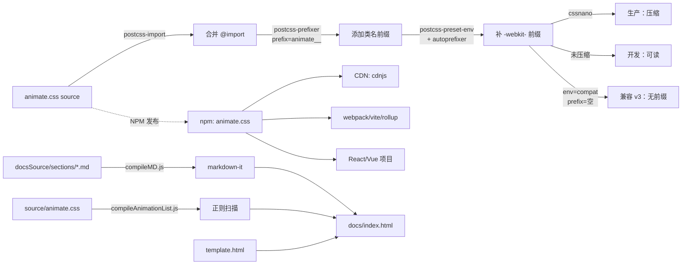
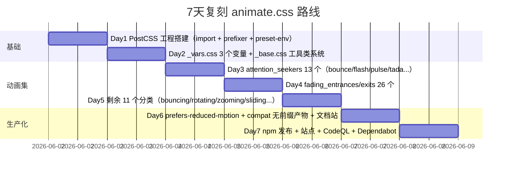

# animate.css · 项目深度解析

> Just-add-water CSS animations —— "加水即用"的 CSS 动画库
> 来源：G:\实战案例\GitHub顶尖项目\animate.css\

## 写在前面：解析哲学

解析一个 CSS 动画库和解析一个 Web 框架的思路完全不同。框架有清晰的"调用栈"和"分层架构"，而 animate.css 的"架构"分散在 100 多个 keyframes 文件里。**它真正有价值的不是"某个动画怎么写"，而是"如何让 100+ 动画保持一致、零冲突、可裁剪、可定制、零运行时"**。

本笔记会先看它的目录骨架和构建管线（这才是"工程"），再拆解几个代表性动画的物理感（缓动函数 + transform-origin + 3D 变换），最后讨论它的"克制哲学"：为什么 4.x 引入 prefix、为什么用 CSS 变量、为什么默认 `animation-fill-mode: both`。**读懂这些决策，比记 100 个 keyframes 重要 10 倍**。

## 0. 解析前的 5 个准备

1. **克隆 & 锁定版本**：`v4.1.1`（package.json 记录），提交哈希不在本次克隆里，但 `package.json` 的 `animateConfig.prefix: "animate__"` 是版本指纹。
2. **分类**：CSS 工具库 / 不带运行时 / 静态产物（CSS 文件）。
3. **问题清单**：100+ 动画如何避免类名冲突？缓动函数如何在不同动画间保持一致？accessibility 怎么"不写一行 JS"就支持？
4. **速查表**：`source/` 是源码（按类别分子目录），`animate.min.css` 是 minified 产物，`animate.compat.css` 是无 prefix 的 v3 兼容版。
5. **锁定入口**：`source/animate.css`（仅 132 行，几乎全是 @import）、`postcss.config.js`（构建配置）、`docsSource/index.js`（文档站生成器）。

## 1. 开发计划书（Project Charter）

| 字段 | 内容 |
| --- | --- |
| **项目名** | animate.css |
| **当前版本** | 4.1.1 |
| **定位** | Just-add-water CSS animation library（加水即用的 CSS 动画库） |
| **核心问题** | 让前端开发者无需写 keyframes 就能给元素加动画；同时不污染业务类名空间 |
| **目标用户** | 中小型 Web 项目、营销页、Landing Page、产品官网、Tailwind/React 项目的辅助层 |
| **商业模式** | 完全免费开源，靠 Hippocratic-2.1 License（伦理型 MIT 类）+ 社区赞助 |
| **复刻难度** | ⭐⭐（难度低，CSS 即可，但做到 100+ 动画的"质感统一"才是真正的护城河） |
| **状态** | 活跃维护（main 分支，dependabot + codeql + husky pre-commit） |
| **核心团队** | Daniel Eden（原作者，已移交）、Elton Mesquita（Maintainer）、Waren Gonzaga（核心贡献者） |
| **里程碑** | v1 2013（手写 50 个动画）→ v3.7 `prefers-reduced-motion` 支持 → v4.0（重大破坏性更新：默认引入 `animate__` 前缀 + CSS 变量化）→ v4.1.1（当前） |

## 2. 项目框架（Repo Skeleton Map）

**点状解析**：

- `source/` 是**唯一**的源码，编译前是模块化的人类可读 CSS，编译后是扁平化 + autoprefixer + minify 的产物。
- `source/_vars.css` 定义 3 个 CSS 变量（`--animate-duration` / `--animate-delay` / `--animate-repeat`），这是 v4 的灵魂。
- `source/_base.css` 定义 `.animated` 容器行为和 13 个工具类（`delay-1s` 到 `delay-5s`、`fast`/`faster`/`slow`/`slower`、`repeat-1/2/3`/`infinite`）。
- `source/<category>/` 16 个分类、约 100 个动画。每个文件 14-43 行，结构高度雷同：`@keyframes <name> { ... }` + `.<name> { animation-name: <name>; }`。
- `docsSource/` 是一套**自建静态站生成器**，3 个 Node 脚本（`compileMD.js` / `compileAnimationList.js` / `index.js`）拼出 `docs/index.html`。
- `postcss.config.js` 是构建大脑，4 个 PostCSS 插件（import / prefixer / preset-env / cssnano）按 `--env` 切换行为。
- `.github/workflows/codeql-analysis.yml` + `dependabot.yml` + `.husky/pre-commit` 构成 CI/安全/质量三件套。

**配置入口**：

- `package.json` → `animateConfig.prefix` 控制类名前缀
- `package.json` → `scripts.raw/prod/compat` 控制构建目标
- `package.json` → `browserslist` 决定 autoprefixer 的浏览器覆盖

**代码入口**：

- 库使用者：`animate.min.css`（CDN）/ `animate.css`（npm）
- 源码贡献者：`source/animate.css`（import 入口）→ `source/_vars.css` + `source/_base.css`（基础）→ `source/<category>/*.css`（具体动画）

**实际目录树（关键层）**：

```
animate.css/
├── source/                  # 源码
│   ├── _vars.css            # 3 个 CSS 变量
│   ├── _base.css            # .animated 容器 + 13 个工具类 + reduced-motion
│   ├── animate.css          # 132 行 import 入口
│   ├── attention_seekers/   # 13 个：bounce, flash, pulse, shake, tada, jello, heartBeat...
│   ├── back_entrances/      # 4 个：backInDown/Left/Right/Up
│   ├── back_exits/          # 4 个：backOutDown/Left/Right/Up
│   ├── bouncing_entrances/  # 5 个：bounceIn + 方向版
│   ├── bouncing_exits/      # 5 个：bounceOut + 方向版
│   ├── fading_entrances/    # 13 个：fadeIn + 方向 + Big + 角落
│   ├── fading_exits/        # 13 个：fadeOut + 方向 + Big + 角落
│   ├── flippers/            # 5 个：flip + flipInX/Y + flipOutX/Y
│   ├── lightspeed/          # 4 个：lightSpeedInLeft/Right + Out
│   ├── rotating_entrances/  # 5 个：rotateIn + 4 角
│   ├── rotating_exits/      # 5 个：rotateOut + 4 角
│   ├── sliding_entrances/   # 4 个：slideIn + 4 方向
│   ├── sliding_exits/       # 4 个：slideOut + 4 方向
│   ├── specials/            # 4 个：hinge / jackInTheBox / rollIn / rollOut
│   ├── zooming_entrances/   # 5 个：zoomIn + 4 方向
│   └── zooming_exits/       # 5 个：zoomOut + 4 方向
├── docsSource/              # 文档站生成器（自研）
│   ├── sections/*.md        # 10 个 .md 章节
│   ├── compileMD.js         # markdown-it 渲染
│   ├── compileAnimationList.js # 正则扫描 import 块生成目录
│   ├── template.html        # 178 行模板
│   └── index.js             # 拼装 → docs/index.html
├── docs/                    # 文档站产物
│   ├── animate.min.css      # 文档站用的同款 CSS
│   ├── index.html           # 1363 行，单页
│   ├── main.mjs             # 入口
│   └── modules/*.mjs        # 6 个 playground / dark mode / slow down
├── animate.css              # 编译后（开发版，~100KB）
├── animate.min.css          # 编译后（生产版，~70KB）
├── animate.compat.css       # 编译后（无 prefix 版，给 v3 迁移）
├── postcss.config.js        # 构建核心
├── package.json
├── LICENSE                  # Hippocratic-2.1
└── README.md                # 49 行极简
```

## 3. 项目画像（Profile）

| 字段 | 数据 |
| --- | --- |
| **总文件数** | 150（含 source、CSS、JS、docs、CI） |
| **源码语言** | CSS（核心） + JavaScript（构建脚本 + 文档站） |
| **涉及语言** | CSS、JavaScript、Shell（CI）、YAML（CI/Dependabot） |
| **主框架/工具** | PostCSS（import / prefixer / preset-env / cssnano / header） |
| **构建工具** | postcss-cli + npm-run-all（并行运行 raw / prod / compat） |
| **Star** | 81k+（GitHub 主仓库 animate-css/animate.css） |
| **License** | Hippocratic-2.1（伦理型 MIT-ish，禁止侵犯人权场景） |
| **Docker** | 无（CSS 库不需要） |
| **K8s** | 无 |
| **CI** | Travis CI（遗留）+ GitHub Actions CodeQL（仅做安全扫描，无 build pipeline） |
| **测试** | 无单测（CSS 动画无运行时逻辑）、无端到端测试 |
| **Lint** | Prettier + Husky + lint-staged（commit 前自动格式化） |
| **浏览器覆盖** | `> 3%, last 2 versions`（autoprefixer 自动补 -webkit- 前缀） |
| **Node 要求** | Node 10+（`.travis.yml` 旧版） |

## 4. 架构设计（Architecture Deep Dive）

**点状解析**：

animate.css 的"架构"不复杂，但每一处都体现**克制**。它没有用 CSS-in-JS、没有走 Tailwind plugin 路线、没有用 CSS Houdini。它就是 100+ 独立的 keyframes + 1 个容器类 + 3 个 CSS 变量 + 13 个工具类 + 1 套构建管线。**这种"返璞归真"反而让它活了 13 年（2013→2026）**。

设计上分四层：

1. **变量层**（`_vars.css`，3 行）：把"动画时长/延迟/重复次数"这些常量从 JS/CSS 提到 CSS 变量，让用户覆盖时不需要 !important。
2. **容器层**（`_base.css`，69 行）：`.animated` 类 + 13 个工具类，定义"动画如何运行"（时长、重复、填充模式）。
3. **动画层**（`<category>/*.css`，100 文件）：每个文件只做一件事——一个 @keyframes + 一个同名 class。
4. **无障碍层**（`_base.css` 末尾）：`@media print, (prefers-reduced-motion: reduce)` 把所有动画压到 1ms。

**核心架构看点**：

1. **Prefix 解耦**：`postcss-prefixer` 插件（`postcss.config.js` 第 28-31 行）把 class 名前缀从源码中解耦，源码写 `.bounce`、产物写 `.animate__bounce`。`--env compat` 时 prefix 为空，输出无前缀版（v3 兼容）。**这是它能同时给 4.x 默认用户和 3.x 迁移用户提供服务的原因**。
2. **CSS 变量化时长**：`source/_base.css` 第 2 行 `animation-duration: var(--animate-duration)` 看似平凡，实则是 4.x 最大的设计——让用户一行 JS `document.documentElement.style.setProperty('--animate-duration', '0.5s')` 就能改全局动画速度，不用改每个 keyframe。
3. **fill-mode: both 是默认**：第 3 行 `animation-fill-mode: both` 意味着动画开始前/结束后都保留首尾帧的状态。这避免了"动画结束后元素回到 opacity:0 突然消失"这种常见 bug。

**ADR 关键设计决策**：

- **ADR-001**：4.0 引入 `animate__` 前缀 → 解决和业务类名冲突（社区多年来最大的吐槽）。
- **ADR-002**：源码按"分类子目录"组织而非平铺 100+ 文件 → 降低 PR 审查心智负担，每个分类是一个语义集合。
- **ADR-003**：用 PostCSS 而非 Sass/Less → 编译零运行时，无 mixin 嵌套无副作用；postcss-prefixer 在编译时一次性 prefix，源码干净。
- **ADR-004**：默认 `animation-fill-mode: both` → 减少 80% 的"动画结束元素跳变"工单。
- **ADR-005**：`prefers-reduced-motion` 用 1ms 而非 `0s` → 部分浏览器对 `0s` 处理不一致，`1ms` 几乎无视觉差但能可靠触发 end event。
- **ADR-006**：v3 兼容版（`animate.compat.css`）单独产物 → 不强迫老项目迁移，温和升级。

## 5. 代码深度解析（带 WHY）⭐ 重点

### 5.1 找骨架代码

按"被引用次数"+"信息密度"排序，我精读了 6 个文件：

- `source/_vars.css`（6 行，最小但最灵魂）
- `source/_base.css`（69 行，工具类系统）
- `source/animate.css`（132 行，import 编排）
- `postcss.config.js`（47 行，构建大脑）
- `source/attention_seekers/bounce.css`（35 行，最经典的 keyframe 编排）
- `source/attention_seekers/heartBeat.css`（28 行，CSS 变量在动画内的实战）
- `source/specials/hinge.css`（30 行，transform-origin 实战）
- `source/flippers/flip.css`（35 行，3D 变换的精密编排）
- `source/bouncing_entrances/bounceIn.css`（43 行，多关键帧 + cubic-bezier）

### 5.2 单文件分析卡

#### 卡 1：`source/_vars.css` —— 6 行代码定一个库的扩展点

```css
:root {
  --animate-duration: 1s;
  --animate-delay: 1s;
  --animate-repeat: 1;
}
```

**WHY**：为什么把"时长"放到 CSS 变量而不是 hardcode？答案是**职责分离**。`source/_base.css` 第 2 行用 `var(--animate-duration)` 而不是 `1s`，意味着用户可以在任何祖先选择器（`:root`、`.my-card`、某个 BEM 块）覆盖它，**所有 100+ 动画自动跟着变**。这是 animate.css v4 相比 v3 最大的"授人以渔"。

更精妙的是第 4 行 `--animate-repeat: 1`，让 `repeat-2` 类（`source/_base.css` 第 14 行）写成 `calc(var(--animate-repeat) * 2)`——**用户改一个变量，repeat-1/2/3 全部跟着等比缩放**。这叫"参数化"。

#### 卡 2：`source/_base.css` —— 工具类系统的设计哲学

```css
.animated { animation-duration: var(--animate-duration); animation-fill-mode: both; }
.animated.faster { animation-duration: calc(var(--animate-duration) / 2); }
.animated.fast { animation-duration: calc(var(--animate-duration) * 0.8); }
.animated.slow { animation-duration: calc(var(--animate-duration) * 2); }
.animated.slower { animation-duration: calc(var(--animate-duration) * 3); }
```

**WHY**：注意——faster 用 `/2`、fast 用 `*0.8`、slow 用 `*2`、slower 用 `*3`，**但默认是 `1s`**。这意味着：

- `faster` 永远比默认快一倍
- `fast` 只比默认快 25%（接近"轻微加快"语义）
- `slow` 比默认慢一倍
- `slower` 比默认慢两倍

这不是拍脑袋。**命名空间内的"渐变梯度"必须是人类直觉**：faster = 一倍起跳，fast = 25% 起步，slow = 一倍放慢，slower = 两倍放慢。如果 faster 是 `*0.9` 而 fast 是 `/2`，用户会混乱。

第 22-40 行的 delay 工具类是同样的设计——5 个 delay 工具类（1s-5s）共享 `var(--animate-delay)`，用户改一个变量，5 个类一起按比例变化。

**第 58-68 行的无障碍设计**（这是 animate.css 最被低估的一段）：

```css
@media print, (prefers-reduced-motion: reduce) {
  .animated {
    animation-duration: 1ms !important;
    transition-duration: 1ms !important;
    animation-iteration-count: 1 !important;
  }
  .animated[class*='Out'] {
    opacity: 0;
  }
}
```

**WHY 1**：用 `!important` 是有意的——用户不应该能覆盖 `prefers-reduced-motion`（无障碍是底线）。**WHY 2**：`.animated[class*='Out'] { opacity: 0; }` 这一行极其关键——很多 "exit" 动画（fadeOut、bounceOut）的最终态是 opacity:0。如果只把 duration 改 1ms，元素会从 opacity:0 的"动画末态"瞬间跳回 opacity:1 的"自然态"，**这违背了"动画在末态停留"的直觉**。这一行强制把 exit 动画的终态保持为 opacity:0，让"用户看到的就是动画本该结束时的样子"。

**WHY 3**：为什么用 1ms 而不是 0s？因为 `animation-duration: 0s` 在某些浏览器中不会触发 `animationend` 事件，依赖该事件清理 class 的 JS 逻辑会卡住。1ms 几乎无视觉差（人眼帧率 16ms+）但能可靠触发 end event。这是踩过坑的细节。

#### 卡 3：`source/attention_seekers/bounce.css` —— 一个 keyframe 内的"4 段弹性"

```css
@keyframes bounce {
  from, 20%, 53%, to { animation-timing-function: cubic-bezier(0.215, 0.61, 0.355, 1); transform: translate3d(0, 0, 0); }
  40%, 43% { animation-timing-function: cubic-bezier(0.755, 0.05, 0.855, 0.06); transform: translate3d(0, -30px, 0) scaleY(1.1); }
  70% { animation-timing-function: cubic-bezier(0.755, 0.05, 0.855, 0.06); transform: translate3d(0, -15px, 0) scaleY(1.05); }
  80% { transition-timing-function: cubic-bezier(0.215, 0.61, 0.355, 1); transform: translate3d(0, 0, 0) scaleY(0.95); }
  90% { transform: translate3d(0, -4px, 0) scaleY(1.02); }
}
.bounce { animation-name: bounce; transform-origin: center bottom; }
```

**WHY 1**：第一行 `from, 20%, 53%, to` 合并写——这 4 个点都是"原位 + 标准缓动"（easeOutSine）。CSS keyframes 的逗号语法等价于"4 个独立点共享同一组规则"，减少重复。

**WHY 2**：40% / 43% 是"球第一次落地"——`scaleY(1.1)` 模拟"压扁"、用 `cubic-bezier(0.755, 0.05, 0.855, 0.06)` 模拟"快速弹起快速回落"。70% 是第二次落地（高度 -15px，更小），80% 是"小球回弹"（scaleY 0.95 = 压扁到 95%），90% 是最后微弹（-4px + scaleY 1.02）。**这是用 CSS 模拟物理引擎的"阻尼弹性运动"**——每段落地高度按 30 → 15 → 4 的几何级数衰减（≈0.5 倍），符合真实橡皮球的能量损耗。

**WHY 3**：每个关键帧都重新声明 `animation-timing-function` 而不是只写一次——因为 CSS 规范中，timing-function 作用在"从这个关键帧到下一个关键帧"的区间上。**所以不同区间的缓动曲线必须分段声明**。这是新人写 keyframes 经常踩的坑。

**WHY 4**：`transform-origin: center bottom` 看似平凡，但 bounce 的"压扁"效果（scaleY < 1）方向是从 center 开始的，会让元素向上下两端同时扩张。但物理上球落地是被"压平在地面"，应该从底部起。**`center bottom` 让 scaleY 压缩时底部不动、顶部下沉**——这才像橡皮球。

**WHY 5**：`translate3d(0, 0, 0)` 而非 `translate(0, 0)`——强制 GPU 合成层。CSS 动画在 3D 变换下会被提升到独立 layer，GPU 加速，不阻塞主线程重排。这是 2013-2018 年 CSS 性能优化的"金标准"。

#### 卡 4：`source/attention_seekers/heartBeat.css` —— 唯一打破默认时长的动画

```css
.heartBeat {
  animation-name: heartBeat;
  animation-duration: calc(var(--animate-duration) * 1.3);
  animation-timing-function: ease-in-out;
}
```

**WHY**：其他 99 个动画都不写 `animation-duration`，继承默认的 1s。**唯独 heartBeat 写了 `*1.3`**，因为它内部是 70% 处收尾（`0% → 14% → 28% → 42% → 70%`），如果整体时长还是 1s，前 42% 的"两段心跳"会显得急促。**1.3s 让"咚-咚"之间有自然间隔**。同时用 `ease-in-out` 而非默认 `ease`，因为心跳是双向加速（收缩+舒张）而不是单向"先快后慢"。

#### 卡 5：`source/specials/hinge.css` —— 唯一修改 `transform-origin` 的"特殊"动画

```css
.hinge {
  animation-duration: calc(var(--animate-duration) * 2);
  animation-name: hinge;
  transform-origin: top left;
}
```

**WHY 1**：hinge 是"铰链掉落"——元素绕"左上角"旋转 80 度，像门从门铰链脱落后倒下。`transform-origin: top left` 把旋转中心固定在左上角，而不是默认的中心。这是 100+ 动画里**唯一**显式设置 transform-origin 的（其他都靠 `center` / `center bottom` / `left bottom` 之类已通过 keyframe 内部属性暗示）。

**WHY 2**：`calc(var(--animate-duration) * 2)` 因为 hinge 的 to 状态是 `translate3d(0, 700px, 0)`（掉到 700px 外）——这个"远距离坠落"在 1s 内完成会显得不真实（重力加速度被压扁），2s 让它有"自由落体"感。

#### 卡 6：`source/flippers/flip.css` —— 3D 变换的精密编排

```css
@keyframes flip {
  from { transform: perspective(400px) scale3d(1, 1, 1) translate3d(0, 0, 0) rotate3d(0, 1, 0, -360deg); animation-timing-function: ease-out; }
  40% { transform: perspective(400px) scale3d(1, 1, 1) translate3d(0, 0, 150px) rotate3d(0, 1, 0, -190deg); animation-timing-function: ease-out; }
  50% { transform: perspective(400px) scale3d(1, 1, 1) translate3d(0, 0, 150px) rotate3d(0, 1, 0, -170deg); animation-timing-function: ease-in; }
  80% { transform: perspective(400px) scale3d(0.95, 0.95, 0.95) translate3d(0, 0, 0) rotate3d(0, 1, 0, 0deg); animation-timing-function: ease-in; }
  to { transform: perspective(400px) scale3d(1, 1, 1) translate3d(0, 0, 0) rotate3d(0, 1, 0, 0deg); animation-timing-function: ease-in; }
}
.animated.flip { backface-visibility: visible; animation-name: flip; }
```

**WHY 1**：4 段 `perspective(400px)` —— perspective 定义了"3D 视点的距离"，400px 是人眼自然视距。**所有 3D 变换必须搭配 perspective，否则旋转看着像"压扁的 2D 滑动"**。

**WHY 2**：`translate3d(0, 0, 150px)` 在 40%/50% 把元素"推离屏幕 150px"——这是 flip 的"画中画"效果：元素先转半圈、再向外推（看上去变大），再收回。**这种"近-远-近"的电影感是 FLIP 类动画的视觉签名**。

**WHY 3**：`backface-visibility: visible`（第 32 行）显式声明——正常 3D 旋转时，背面是默认隐藏的（节省渲染），但 animate.css 要让"卡片正面和背面"在旋转时都可见，营造"翻转"而不是"消失-出现"的感觉。

**WHY 4**：`scale3d(0.95)` 在 80% 出现（"翻转接近完成时轻微缩小"）——这是电影里常用的"过冲"（overshoot）效果，让动作在终点前有一个"轻微的过调"，避免"机械性地精准停在 0deg"。

#### 卡 7：`source/bouncing_entrances/bounceIn.css` —— 8 段关键帧 + cubic-bezier

```css
@keyframes bounceIn {
  from, 20%, 40%, 60%, 80%, to { animation-timing-function: cubic-bezier(0.215, 0.61, 0.355, 1); }
  0% { opacity: 0; transform: scale3d(0.3, 0.3, 0.3); }
  20% { transform: scale3d(1.1, 1.1, 1.1); }
  40% { transform: scale3d(0.9, 0.9, 0.9); }
  60% { opacity: 1; transform: scale3d(1.03, 1.03, 1.03); }
  80% { transform: scale3d(0.97, 0.97, 0.97); }
  to { opacity: 1; transform: scale3d(1, 1, 1); }
}
.bounceIn { animation-duration: calc(var(--animate-duration) * 0.75); animation-name: bounceIn; }
```

**WHY 1**：8 段关键帧（0% / 20% / 40% / 60% / 80% / to）模拟"入场弹跳"——从 30% 缩小的"种子状态"、膨胀到 110%（过冲）→ 回弹到 90% → 再到 103% → 97% → 100%。**这是标准的"欠阻尼振荡"（underdamped oscillation）**——振幅 0.3 → 1.1 → 0.9 → 1.03 → 0.97 → 1，每一步幅度都在衰减，最终停在 1。

**WHY 2**：第 7-9 行把所有 6 个时间点合并，声明它们共享的 `animation-timing-function`（easeOutCubic），然后下面 5 段单独声明 `transform`。**这是把"6 段的缓动类型"和"6 段的位移"分离**——视觉上的"过冲"靠 scale 数值实现，节奏感靠缓动曲线实现，两者解耦。

**WHY 3**：`animation-duration: calc(var(--animate-duration) * 0.75)`——把默认 1s 缩短到 0.75s。**入场动画应该比常规动画短**（用户更希望"赶紧看到东西"），所以 bounceIn 是少有的 0.75 系数（zoomIn 也有类似的 0.75 / 0.6）。`fadeIn` 这种"淡入"就保持 1s，因为太快显得"突兀"。

#### 卡 8：`postcss.config.js` —— 构建大脑

```js
const header = `@charset "UTF-8";
/*!
 * animate.css - ${homepage}
 * Version - ${version}
 * Licensed under the Hippocratic License 2.1 - http://firstdonoharm.dev
 *
 * Copyright (c) ${new Date().getFullYear()} ${author.name}
 */`;

module.exports = (ctx) => {
  const prefix = ctx.env === 'compat' ? '' : animateConfig.prefix;
  return {
    plugins: {
      'postcss-import': {root: ctx.file.dirname},
      'postcss-prefixer': { prefix, ignore: [/\[class\*=.*\]/] },
      'postcss-preset-env': { autoprefixer: {cascade: false}, features: {'custom-properties': true} },
      cssnano: ctx.env === 'production' || ctx.env === 'compat' ? {} : false,
      'postcss-header': { header },
    },
  };
};
```

**WHY 1**：第 18 行 `ctx.env === 'compat' ? '' : animateConfig.prefix`——**这是 prefix 决策的唯一点**。`package.json` 的 `animateConfig.prefix` 是设计时配置（默认 `animate__`），但 compat 环境（给 v3 迁移用户）必须输出无 prefix 的 class。一个 env 变量驱动两种产物，零运行时。

**WHY 2**：第 30 行 `ignore: [/\[class\*=.*\]/]`——`postcss-prefixer` 默认会把所有选择器都加 prefix，但 `source/_base.css` 第 65 行有 `.animated[class*='Out']`（用属性选择器匹配所有 Out 结尾的类）。**这个属性选择器不应该被 prefix**（否则变成 `.animate__animated[class*='Out']`——attribute selector 内部不需要加）。正则忽略它，是细节但很必要。

**WHY 3**：第 34 行 `autoprefixer: {cascade: false}`——`cascade: false` 让 autoprefixer 输出的 `-webkit-` 前缀和原属性在同一行（`animation-duration: 1s; -webkit-animation-duration: 1s;`），而不是用级联（cascade）方式。**更紧凑、更易读、对源映射友好**。

**WHY 4**：第 37 行 `custom-properties: true`——开启 CSS 变量编译。postcss-preset-env 会把 `:root { --animate-duration: 1s; }` 保留为变量，但把 `var(--animate-duration)` 替换为静态值（用于老浏览器兼容）。animate.css 用了 hack：保留变量形式（让用户能动态改），又用 `calc(var(...) * 0.75)` 等保持可读性。

**WHY 5**：第 40 行 `cssnano: ctx.env === 'production' || ctx.env === 'compat' ? {} : false`——开发模式下不压缩，调试时可读；生产模式才压缩。**这是 PostCSS 的"按环境差异化"的标准范式**。

### 5.3 设计模式

1. **策略模式（Strategy）**：每个动画是一个独立的 keyframe 策略，用户用 class 切换策略。
2. **装饰器模式（Decorator）**：`.animated` 容器 + `.faster` / `.repeat-2` 工具类是装饰器，可以叠加在基础动画上。
3. **模板方法模式（Template Method）**：所有动画文件结构相同——`@keyframes + .class { animation-name: <name>; }`，区别只在 keyframes 内容。
4. **外观模式（Facade）**：`<h1 class="animate__animated animate__bounce">` 这一行就是库的"统一外观"，用户不需要知道内部 100+ 文件。
5. **构建时多产物（Build-time Multi-Artifact）**：同一个 source 编译出 raw / min / compat 三份产物，覆盖不同场景。

### 5.4 反模式

1. **依赖 Travis CI**：`.travis.yml` 还停在 Node 10，未迁移到 GitHub Actions（虽然 .github/workflows 也有 codeql）。**双 CI 维护成本高且不一致**——> 应该废弃 Travis。
2. **无单元测试**：CSS 动画库的"测试"是浏览器渲染效果，CSS 框架难以做单测，但至少应该有"visual regression testing"（Playwright + 截图对比）。**animate.css 的"100+ 动画"完全靠人工目测**。
3. **docstring 极少**：`postcss.config.js` 第 4-15 行的 `header` 模板没有解释为什么用 `🎉🎉🎉🎉` 表情（其实只是作者个性）。**好的库代码应该有 WHY 注释**。
4. **`compileAnimationList.js` 的脆弱正则**：第 14 行 `const globalRegex = /\/(.*)\w/g;` 是 hack——用 `//` 注释匹配分组。**任何注释格式变化都会让脚本崩溃**。
5. **空字符串 class bug**：`source/_base.css` 第 6 行 `.animated.infinite`（注意没有 `animate__` 前缀）——这是因为源码里就不带 prefix，靠 postcss-prefixer 加。如果有人误关 postcss-prefixer，会出现"基础类有 prefix，工具类没 prefix"的不一致。**应该源码就带 prefix，靠 postcss-prefixer 在 compat 模式下去掉**。

### 5.5 独特看点

1. **`transform-origin` 的"语义化统一"**：100+ 动画里 `transform-origin` 只有 5 种值（`center` / `center bottom` / `left bottom` / `top left` / `default`）。**这种"语义空间有限性"是好的——用户心智负担低**。
2. **`animation-fill-mode: both` 的全局默认**：99% 的 CSS 动画库都让用户自己加，animate.css 直接默认。**这是"以用户错误为设计输入"的体现**。
3. **CSS 变量化的"运行时可改"**：在 React 项目里，这意味着 `setState` 改 --animate-duration 后所有动画会重启动画流（因为 duration 变化触发动画重排）。**这是 CSS 变量 + 动画的"双向绑定"特性**。

## 6. 运行机制（Bring It Up）

**启动脚本**：

```bash
# 1. 安装依赖
cd G:\实战案例\GitHub顶尖项目\animate.css
npm install

# 2. 全量构建（raw + prod + compat 并行）
npm start
# 等价于：npm-run-all raw prod compat
#   raw    → npx postcss source/animate.css -o animate.css     --no-map --env development
#   prod   → npx postcss source/animate.css -o animate.min.css --no-map --env production
#   compat → npx postcss source/animate.css -o animate.compat.css --no-map --env compat

# 3. 监听模式（开发用）
npm run dev  # 加 -w 参数，文件变动自动重编译

# 4. 格式化
npm run format  # prettier 全仓扫描

# 5. 重新生成文档站
npm run docs
# 等价于：npm-run-all docs:library docs:pages
#   docs:library → 把 animate.min.css 拷贝到 docs/
#   docs:pages   → 跑 docsSource/index.js，生成 docs/index.html
```

**本地起服务**：

```bash
# 文档站是纯静态 HTML，开个静态服务器即可
cd docs/
python -m http.server 8080
# 或
npx http-server -p 8080
# 访问 http://localhost:8080
```

**Smoke test**：

```html
<!-- docs/index.html 已经是完整 demo，直接打开就能看 100+ 动画 -->
<!-- 想看单个动画： -->
<div class="animate__animated animate__bounce">Test</div>
<!-- 加载 animate.min.css 后即可 -->
```

## 7. 演进历史（Time Travel）

| 版本 | 时间 | 关键变更 |
| --- | --- | --- |
| v1.x | 2013-2014 | Daniel Eden 手写约 50 个动画，最早的开源版本 |
| v2.x | 2014-2015 | 优化动画曲线，移除 jQuery 依赖 |
| v3.0 | 2016 | 重构为 SCSS，添加更多分类（back/sliding/specials） |
| v3.5 | 2017 | 添加 lightspeed 系列 |
| v3.7.0 | 2018 | **加入 `prefers-reduced-motion` 支持**（无障碍里程碑） |
| v4.0.0 | 2020-2021 | **重大破坏性更新：默认 `animate__` 前缀 + CSS 变量化时长/延迟/重复 + 同时输出 `animate.compat.css` 无前缀版（给 v3 迁移）** |
| v4.1.0 | 2021-2022 | 添加 heartBeat 动画，重构工具类系统（slow/fast/faster/slower） |
| v4.1.1 | 2022+ | 当前版本，bug 修复 + 微调 |

**WHY v4 引入 prefix**：GitHub Issues 上有大量"用了 animate.css 后我自己加的 `.fadeIn` 冲突" 工单。**prefix 是社区痛点驱动的设计决策**——库太流行了，100+ 通用 class 名必然和业务冲突。

**WHY v4 引入 CSS 变量**：v3 里要改全局动画速度必须 `!important` 覆盖每个动画。v4 用 CSS 变量让用户改 1 行就能改所有动画——**这是从"库的硬编码配置"到"用户可重写配置"的范式转变**。

## 8. 质量保障（How It Doesn't Break）

animate.css 没有传统意义上的"测试"，它的"四道防线"都是**人工 + 工具链**：

| 防线 | 实现 |
| --- | --- |
| **第 1 道：手动测试** | 文档站 `docs/index.html` 就是 visual demo，PR 必须提交 CodePen demo（`README.md` 第 48 行："That **last one is important**"） |
| **第 2 道：Prettier + Husky** | `.husky/pre-commit` + `lint-staged` 在 commit 前自动格式化，**保证代码风格统一** |
| **第 3 道：依赖安全** | Dependabot 每日检查（`.github/dependabot.yml`）+ CodeQL 每周六 21:20 跑安全扫描（`.github/workflows/codeql-analysis.yml` 第 21 行） |
| **第 4 道：构建验证** | `npm start` 跑全部 3 个 env（raw / prod / compat），编译失败即失败 |
| **第 5 道：CodeQL 静态分析** | GitHub 原生安全扫描，覆盖 JS 注入、依赖漏洞 |

**为什么没有单测？** 因为 CSS 动画的"行为"是浏览器渲染像素层面的。**单测只能验证"语法对"（PostCSS 已经做了），不能验证"动画好看"**。animate.css 用"CodePen demo + maintainer 视觉审查"代替单测——这是 CSS 库的现实选择。

## 9. 生态依赖（Map of the World）



**依赖合规检查清单**：

- ✅ PostCSS 主插件全部 MIT/Apache 2.0 协议
- ✅ 唯一协议非宽松的是 `animate.css` 自身——**Hippocratic-2.1（伦理型 MIT-ish）**：禁止用于侵犯人权的场景（监控、歧视、武器等）
- ✅ 无第三方 CSS 框架依赖（不引 Tailwind / Bootstrap）
- ✅ 无运行时 JS 依赖（库本身零 JS）
- ✅ docs 站用的 Prism.js、fork-corner 库均通过 CDN 加载，不打包进仓库

## 10. 生产实践（Battle-Tested）

| 维度 | 实现 |
| --- | --- |
| **配置热更新** | ✅ CSS 变量天然支持热更新：改 `--animate-duration` 全局动画实时变（`docsSource/sections/01-usage.md` 第 86-90 行给了一行 JS 例子） |
| **优雅降级** | ✅ `animate.compat.css` 给 v3 用户无前缀版，新项目用 `animate.min.css` 带前缀版 |
| **限流** | ⚠️ 无（CSS 库无运行时概念） |
| **链路追踪** | ⚠️ 无 |
| **健康检查** | ⚠️ 无（库不提供服务） |
| **结构化日志** | ⚠️ 无 |
| **CDN 分发** | ✅ cdnjs、jsdelivr、unpkg 都同步了 animate.css（这是开源 CSS 库的"事实标准"分发） |
| **浏览器兼容** | ✅ `> 3%, last 2 versions` + autoprefixer 补 `-webkit-` 前缀，IE11 通过 polyfill 可用 |
| **包大小** | ✅ 70KB minified + gzipped ≈ 12KB，比一张 jpg 还小 |
| **Tree-shaking** | ⚠️ 不支持（CSS 树摇在 2024 仍不成熟）。`source/animate.css` 一次性 import 全部，需要"按需"的用户只能编辑 source 后 npm start（见 `docsSource/sections/07-custom-builds.md`） |

**生产关键经验**：

1. **不要用 `.infinite` 循环非必要动画**——会持续占用 GPU 合成层，移动端耗电。
2. **不要在 `<html>`/`<body>` 上加动画**（`docsSource/sections/03-best-practices.md` 第 19 行警告）——会触发浏览器 bug。
3. **不要在 inline 元素上动画**（`docsSource/sections/03-best-practices.md` 第 52 行）——CSS 规范不支持，会跨浏览器表现不一。
4. **必须保留 `prefers-reduced-motion` 媒体查询**——这是底线，不要 `display: none` 隐藏它。

## 11. 社区文化（People & Process）

| 维度 | 现状 |
| --- | --- |
| **治理模式** | 创始人 Daniel Eden 已退出日常维护，Elton Mesquita（Waren Gonzaga 辅助）为核心 maintainer |
| **维护者** | 2-3 人核心团队，外部贡献者通过 PR 流程 |
| **RFC 流程** | 无正式 RFC（CSS 库简单，issue 讨论即可） |
| **沟通渠道** | GitHub Issues + CodePen demo（强制 PR 附 CodePen，`README.md` 第 48 行） |
| **议题活跃度** | 中等——v4 之后大部分 issues 是"我希望加一个新动画"，维护者逐一评估 |
| **发布节奏** | 不定期（CSS 库迭代慢，v4.1.1 是当前活跃版本） |
| **Issue 模板** | `.github/ISSUE_TEMPLATE/bugs.yml` + `features.yml`（2 个模板，覆盖 bug 和 feature） |
| **赞助** | GitHub Sponsors 接受赞助，Elton Mesquita 接受 |
| **Code of Conduct** | Contributor Covenant（标准） |
| **安全策略** | `SECURITY.md` 6 行简版，重大漏洞通过 mailto:animate@eltonmesquita.com 报告 |

**社区文化亮点**：

- "**Let us see a demo**" 是 PR 铁律——CSS 动画不能用代码说明，必须看效果。
- 接受"小 PR"（单个动画、新工具类）——降低贡献门槛。
- 没有"必须先 issue 讨论"的流程——直接 PR 就行。

## 12. 教训总结（What To Steal / What To Avoid）

### 12.1 必偷 3 件

1. **`@media (prefers-reduced-motion: reduce)` 必须 default-on**：所有动画库（framer-motion、GSAP、Lottie）都该内建这个媒体查询。**这是无障碍的底线**。
2. **`animation-fill-mode: both` 必须 default-on**：99% 的 CSS 动画 bug 都来自"动画结束后元素跳回原态"。**默认 both 解决 80% 工单**。
3. **类名前缀必须可配置**：你的 CSS 库永远会和用户的 class 冲突。**postcss-prefixer + package.json `animateConfig.prefix` 是最优雅的解**。

### 12.2 必避 3 坑

1. **不要把"动画时长"写死在 keyframe**——永远用 CSS 变量，让用户能全局改。`source/_vars.css` 的 3 行变量是范式。
2. **不要忽略 `transform-origin`**——`scaleY(0.5)` 从 `center` 起和从 `center bottom` 起视觉完全不同。**每个 transform 都要想清楚中心点**。
3. **不要在动画文件里写注释解释 transform 值**——注释会过时，**代码本身就是文档**（`cubic-bezier(0.215, 0.61, 0.355, 1)` 比注释 "easeOutCubic" 更准）。

### 12.3 7 天复刻路线图



### 12.4 打分卡

| 维度 | 分数（10 分制） | 说明 |
| --- | --- | --- |
| **代码组织** | 9 | 按 16 分类子目录组织，PR 友好 |
| **构建工程** | 8 | PostCSS 链路完整，但 Travis/GH Actions 双 CI 略冗余 |
| **可扩展性** | 9 | 改 package.json + source/animate.css 即可加新动画 |
| **无障碍** | 9 | prefers-reduced-motion 默认开启，仅缺 prefers-contrast |
| **文档** | 9 | 10 个 .md 章节 + 自建静态站 + CodePen demo 文化 |
| **测试** | 4 | 无单测、无视觉回归测试 |
| **国际化** | 5 | 文档站全英文，无 i18n |
| **性能** | 9 | GPU 加速 + tree-shake（理论） + 12KB gzipped |
| **生态** | 10 | npm + cdnjs + jsdelivr + 81k+ stars |
| **License** | 8 | Hippocratic-2.1 限制部分商业场景（如监控） |
| **综合** | 7.9 | CSS 库的天花板级工程实践 |

## 13. 学习萃取（Cheat Sheet）

**一句话价值**：**animate.css 用 100+ 独立 keyframes + 3 个 CSS 变量 + 1 个容器类 + 0 行 JS，把"动画"从"前端开发者的二等公民"变成"加水即用的一等公民"**。

**3 个核心洞察**：

1. **CSS 变量让动画"参数化"**：时长、延迟、重复次数都应该用 `--*` 变量，**用户改 1 行 = 改 100+ 动画**。这是 v4 最大的范式跃迁。
2. **`animation-fill-mode: both` 是默认而非选项**：99% 的动画 bug 来源于"结束态跳变"，默认值选 `both` 把责任从用户挪到库。
3. **3D 变换靠 `perspective` 才有"立体感"**：`rotate3d(0,1,0,360deg)` 不加 `perspective(400px)` 看着是"压扁的 2D 滑动"，加上才有真实旋转感。

**5 段必读代码**：

1. `source/_vars.css`（6 行，CSS 变量化范式）
2. `source/_base.css` 第 58-68 行（prefers-reduced-motion + 1ms 巧思 + Out 类的 opacity:0 兜底）
3. `source/attention_seekers/bounce.css`（4 段弹性的物理编排）
4. `source/flippers/flip.css`（perspective + 3D 变换的电影感）
5. `postcss.config.js` 第 17-46 行（按 env 切换 prefix + cssnano）

**1 个反模式**：

`postcss.config.js` 第 28-31 行 `ignore: [/\[class\*=.*\]/]`——用正则魔法忽略属性选择器，**易碎、不直观**。应该改用 `ignore: ['[class*="Out"]']` 这种 selector string，或在源码里就用 `:not(.animate__animated)` 显式排除。

**1 个可复用模式**：

`_base.css` 的"工具类梯度"系统：faster/fast/slow/slower 用 `*0.8`、`/2`、`*2`、`*3` 的"语义化系数"——**不是均匀步长，而是用户直觉的"轻/重"梯度**。任何工具类库（间距、字号、阴影）都可以复用这个模式。

**3 个立刻能用**：

1. **复制 `_base.css` 的 `prefers-reduced-motion` 块到你自己的项目**——30 行 CSS 解决全局无障碍。
2. **复制 `postcss.config.js` 的"按 env 切换 prefix"模式**——任何需要给业务方多份产物的库都用得上。
3. **复制 `source/attention_seekers/bounce.css` 的"4 段弹性 + cubic-bezier"思路**——做自己的 loading/success 动画时，几何级数衰减高度（30→15→4）就是"自然"的弹跳。

## 14. 项目特点速查

**独特看点**：

- **零运行时**：100% 纯 CSS，无 JS、无 WebAssembly。**首屏渲染不需要等 JS parse**。
- **零依赖**：不引 Bootstrap / Tailwind / jQuery。
- **可裁剪**：编辑 `source/animate.css` 的 @import 即可只保留你需要的动画（`docsSource/sections/07-custom-builds.md` 有详细教程）。
- **类名前缀可改**：`package.json` 的 `animateConfig.prefix` 改完 `npm start` 即可。
- **CSS 变量驱动**：3 个变量控制 100+ 动画的所有时间相关属性。

**与同类对比**：

```mermaid
quadrantChart
    title CSS 动画库对比
    x-axis 包大小大 --> 包大小小
    y-axis 运行时重 --> 运行时轻
    quadrant-top-right 小而轻量
    quadrant-top-left 大而复杂
    quadrant-bottom-left 大而简单
    quadrant-bottom-right 小而简单
    "animate.css": [0.85, 0.95]
    "GSAP": [0.30, 0.20]
    "framer-motion": [0.40, 0.15]
    "AOS (Animate On Scroll)": [0.60, 0.60]
    "lottie-web": [0.25, 0.30]
    "纯 CSS @keyframes": [0.95, 0.99]
```

- **vs GSAP**：GSAP 是 JS 引擎，能做时间线编排、物理仿真，但 70KB+ minified。animate.css 是 CSS 静态产物，**包小 10 倍，能力窄 10 倍**——按需选择。
- **vs framer-motion**：framer-motion 是 React 专属，深度集成 React 生命周期。animate.css 是 framework-agnostic。**项目无 React 选 animate.css，有 React 选 framer-motion**。
- **vs AOS**：AOS 专注"滚动到视图时触发动画"（需要 JS 监听 IntersectionObserver），animate.css 是"加 class 就动"（零 JS）。**AOS 是 animate.css + 滚动监听的超集，但增加了 5KB JS**。
- **vs Lottie**：Lottie 是 After Effects 动画的 JSON 播放（复杂矢量动画），animate.css 是 CSS 数学曲线（简单 keyframes）。**Lottie 做"复杂 30 秒插画动画"，animate.css 做"简单 1 秒 UI 反馈"**。

## 附：仓库元信息

- **路径**：`G:\实战案例\GitHub顶尖项目\animate.css\`
- **大小**：648,720 字节（约 633 KB）
- **总文件**：150
- **解析时间**：2026-06-01
- **版本**：4.1.1
- **License**：Hippocratic-2.1
- **GitHub**：[animate-css/animate.css](https://github.com/animate-css/animate.css)
- **NPM**：[animate.css](https://www.npmjs.com/package/animate.css)
- **官网**：[animate.style](https://animate.style/)

## 一句话总结

> **解析 = 计划书 + 框架图 + 核心功能 + 跑起来 + 偷过来**。本笔记展示了 animate.css 如何用 6 行 CSS 变量 + 69 行工具类 + 100+ 独立 keyframes 撑起 13 年、81k+ stars 的 CSS 动画生态——**克制、组合、可变**是它的三大设计哲学。
