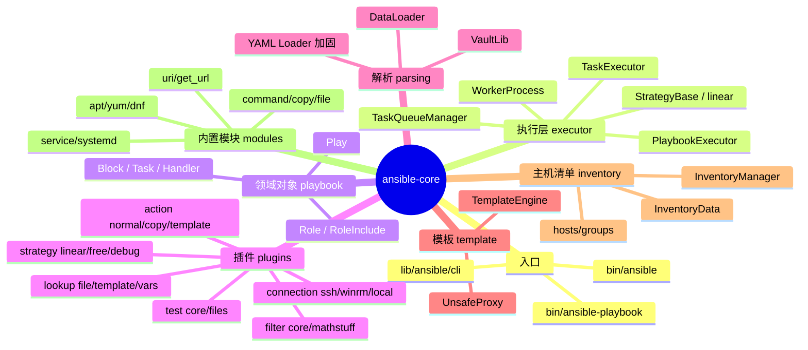
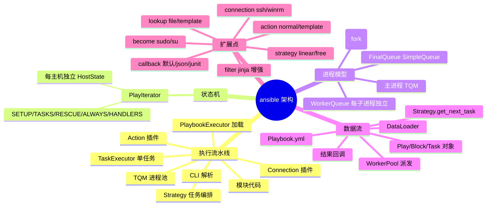
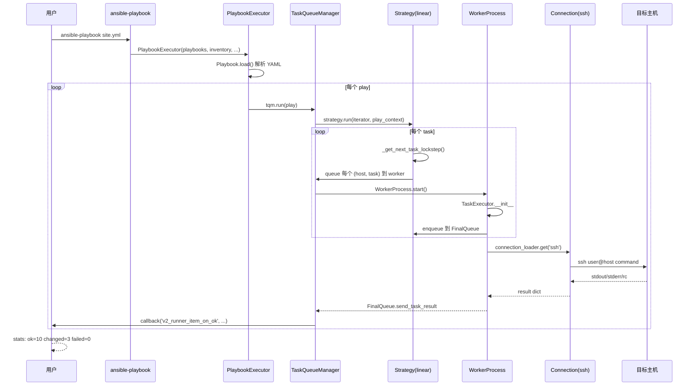
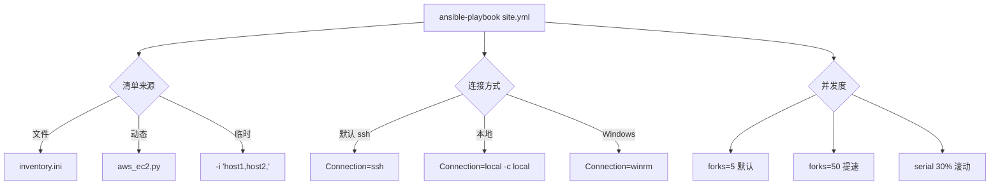
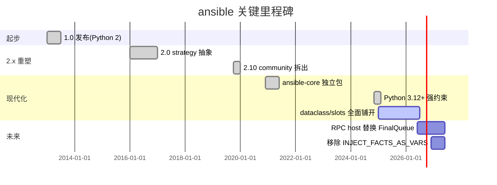
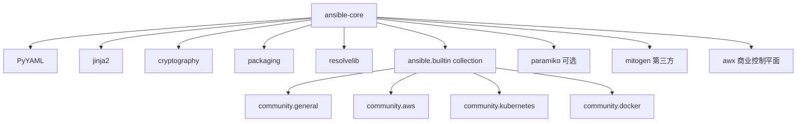
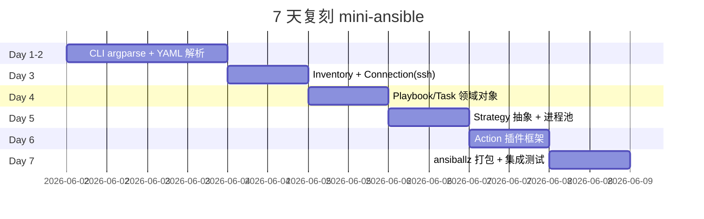
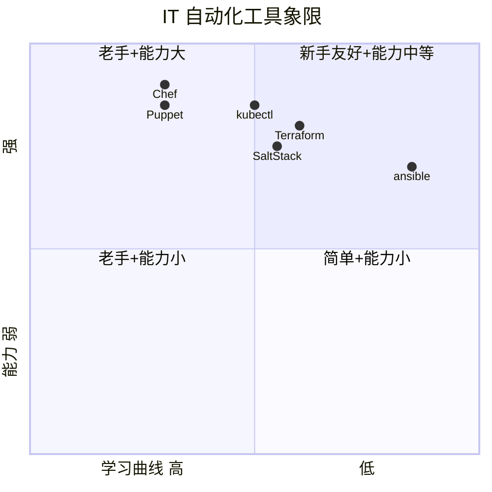

# ansible · 项目深度解析

> 一句话：基于 SSH 的无代理 IT 自动化引擎,用声明式 YAML 把多台机器上的"配置管理 / 应用部署 / 命令编排"统一写成可幂等执行的剧本。
> 来源：`G:\实战案例\GitHub顶尖项目\ansible\`

## 写在前面:解析哲学

这份文档不重复 README,也不照搬官方文档。我按"先骨架后血肉,先 What 后 Why,最后 How to steal"的顺序拆 ansible:
1. 先把目录、类、关键文件摊在桌面上,搞清楚"它长什么样"
2. 再深入关键代码,问"作者为什么这么写",而不只是"它做什么"
3. 最后抽出可复用的设计决策,告诉你"哪些坑别踩,哪些好东西直接搬"

ansible 的"无代理 + 推送式 + 幂等性"是它从 Puppet/Chef/SaltStack 围剿中杀出来的根本理由,理解了这三点,后面所有诡异设计都能秒懂。

## 0. 解析前的 5 个准备

1. **克隆/确认**:本机已存在 `G:\实战案例\GitHub顶尖项目\ansible\`,无需重新 clone
2. **分类**:运维自动化 / Python 工业级 CLI / 多进程架构 / 插件化框架
3. **问题清单**:
   - 为什么没有常驻 agent?为什么 SSH 能扛得住?
   - 几千台机器怎么并发?多进程还是多线程?
   - 任务顺序怎么定?为什么有 strategy 这个抽象?
   - 模块怎么"打包"传到远端?ansiballz 黑魔法是什么?
   - 怎么处理"长任务 + 短任务"共存?async/poll 是什么?
4. **速查表**:`lib/ansible/executor/*` 决定执行模型,`lib/ansible/plugins/*` 决定能力边界
5. **锁定 commit**:本解析基于 `devel` 分支(2026-06-01 拉取),版本号见 `lib/ansible/release.py`

## 1. 开发计划书(Project Charter)

| 字段 | 内容 |
|---|---|
| 项目名 | ansible (核心包 `ansible-core`) |
| 定位 | 无代理 IT 自动化平台:配置管理、应用部署、ad-hoc 命令、网络设备编排 |
| 核心问题 | 在不安装 agent 的前提下,把异构机器(Servers/Network/Cloud)统一编排;让运维脚本可读、可审计、可幂等 |
| 目标用户 | 系统管理员、SRE、DevOps 工程师、网络工程师 |
| 商业模式 | 上游开源 (GPL-3.0) + 下游 Red Hat Ansible Automation Platform 商业版(控制平面 + AAP 网关) |
| 复刻难度 | 极高(8/10):SSH 通道、ansiballz 模块打包、strategy 抽象、collection 解析四块都是深水区 |
| 当前状态 | 生产级稳定,版本节奏 6 个月一次 minor,devel 持续滚动 |
| 团队 | Red Hat 员工 + 5000+ 社区贡献者(README 原文) |
| 里程碑 | 1.x(Python 2)→ 2.0(strategy 插件)→ 2.10(community 拆出)→ ansible-core 独立包 → 持续 |

## 2. 项目框架(Repo Skeleton Map)

### 2.1 顶层目录

| 目录/文件 | 角色 | 一句话 |
|---|---|---|
| `bin/ansible*` | CLI 入口 | 9 个 shell 脚本转发到 `lib/ansible/cli/*.py` |
| `lib/ansible/` | 核心库 | 所有 Python 代码 |
| `lib/ansible/executor/` | 执行层 | playbook → strategy → task → worker 四级调度 |
| `lib/ansible/playbook/` | 领域对象 | Play/Block/Task/Role 全部是带 `__init__` 校验的 Base 子类 |
| `lib/ansible/plugins/` | 能力扩展点 | 7 大类插件(connection/action/lookup/filter/test/strategy/...) |
| `lib/ansible/inventory/` | 主机清单 | 数据 + 解析器(支持 ini/yaml/toml/dynamic) |
| `lib/ansible/modules/` | 内置模块 | 70+ 个开箱即用模块(command/copy/file/apt/yum/...) |
| `lib/ansible/cli/` | CLI 框架 | argparse 封装 + 各子命令 |
| `lib/ansible/parsing/` | 解析器 | YAML/Vault 加密/quoting |
| `lib/ansible/template/` | 模板引擎 | 包装 Jinja2,加 unsafe_proxy 防泄露 |
| `test/` | 测试套件 | units + integration,unittest 风格 |
| `changelogs/fragments/` | 增量 changelog | 每个 PR 一份 yaml,合并时聚合 |
| `pyproject.toml` | 构建配置 | setuptools 后端,name 是 `ansible-core` |

### 2.2 框架思维导图



### 2.3 实际目录树(节选关键)

```
ansible/
├── bin/
│   ├── ansible-playbook          # CLI 入口
│   ├── ansible                   # ad-hoc
│   └── ansible-vault             # 加密
├── lib/ansible/
│   ├── __main__.py               # 启动器
│   ├── context.py                # 全局 CLIARGS
│   ├── constants.py              # 默认配置
│   ├── release.py                # 版本号
│   ├── cli/                      # argparse 封装
│   ├── executor/
│   │   ├── playbook_executor.py  # 顶层入口
│   │   ├── task_queue_manager.py # 进程池 + 队列
│   │   ├── task_executor.py      # 单任务执行
│   │   ├── play_iterator.py      # Play/Block 状态机
│   │   ├── stats.py              # 聚合统计
│   │   ├── module_common.py      # 模块打包(ansiballz)
│   │   └── process/worker.py     # 子进程封装
│   ├── playbook/                 # 领域对象
│   ├── plugins/
│   │   ├── loader.py             # 插件加载器
│   │   ├── connection/           # ssh/winrm/local/psrp
│   │   ├── action/               # normal/copy/template
│   │   ├── strategy/             # linear/free
│   │   ├── lookup/ filter/ test/ # jinja 扩展
│   │   └── become/               # sudo/su/runas
│   ├── inventory/manager.py      # 清单管理
│   ├── vars/manager.py           # 变量合并
│   ├── template/__init__.py      # 模板
│   └── parsing/dataloader.py     # YAML/Vault
├── test/                         # 单元 + 集成
├── changelogs/fragments/         # PR changelog
├── pyproject.toml                # name=ansible-core
└── requirements.txt
```

### 2.4 配置入口

- `lib/ansible/config/base.yml` — 500+ 个默认值(连接/超时/路径/插件配置)
- `lib/ansible/parsing/dataloader.py` — 加载 YAML/Vault 文本
- `lib/ansible/inventory/manager.py:147` — 解析 inventory 文件

### 2.5 代码入口

- `bin/ansible-playbook` → `lib/ansible/cli/playbook.py:PlaybookCLI.run()` → `PlaybookExecutor.run()`

## 3. 项目画像(Profile)

| 维度 | 数值 |
|---|---|
| 总文件数 | 5,713(含 changelogs、test、doc) |
| 主语言 | Python(>= 3.12) |
| 涉及语言 | Python + YAML + PowerShell(Windows 远程) +少量 C#(PS module utils) |
| 关键运行时 | multiprocessing(默认 fork)+ threading(callback 调度) |
| 协议 | GPL-3.0-or-later |
| 依赖 | 极少:`packaging`,`jinja2`,`PyYAML`,`cryptography`,`resolvelib` |
| Docker | 无(纯 CLI);Azure Pipelines 多镜像 CI |
| K8s | 不直接相关,但 `k8s` 是官方 collection 之一 |
| CI | Azure Pipelines + codecov + sanity 黑盒测试 |
| 测试 | units + integration + functional,unittest 风格 |
| 主要发布形态 | PyPI `ansible-core` + 操作系统包 |

## 4. 架构设计(Architecture Deep Dive)

### 4.1 整体分层

ansible 的执行管线可以用"五级瀑布"理解:

1. **CLI 层** (`cli/playbook.py`):解析参数,组装依赖,调用下一层
2. **PlaybookExecutor** (`executor/playbook_executor.py`):加载 playbook,逐个 play 跑,处理 `serial` 分批
3. **TaskQueueManager** (`executor/task_queue_manager.py`):创建 worker 进程池 + 共享队列,作为进程间通信中枢
4. **StrategyBase / linear** (`plugins/strategy/`):编排"下一个任务"和"任务分配给哪些主机",实现并发模型
5. **TaskExecutor** (`executor/task_executor.py`):在单进程内完成"加载 action 插件 → 连主机 → 传模块 → 收结果"

### 4.2 核心架构思维导图



### 4.3 核心架构看点

#### ADR-1:无代理(Agentless)+ 推送式 = SSH 即总线
- **决策**:不维护常驻 agent,直接复用目标机的 SSH daemon
- **WHY**:
  1. 零部署成本:新机器改 SSH 端口就完事
  2. 复用企业现有安全审计/堡垒机
  3. 简化模型:控制节点=权威,被控节点=被动
- **代价**:SSH 握手延迟、连接数受限、首次接触要认证;这导致必须支持 pipelining(把多个命令打到一条 SSH 会话)
- **代码位置**:`lib/ansible/plugins/connection/ssh.py:96` 默认参数 `ssh_args = '-C -o ControlMaster=auto -o ControlPersist=60s'`,直接拼 SSH ControlMaster 实现连接复用

#### ADR-2:进程级隔离 = fork + multiprocessing
- **决策**:每个 worker 是独立子进程,主进程通过 `multiprocessing.SimpleQueue` 收结果
- **WHY**:
  1. 任务可能 hang(SSH 卡住)、可能泄漏 fd;fork 隔离避免污染主进程
  2. Python GIL 让多线程并发收益有限,多进程更直接
  3. 主进程需要存活以便响应 Ctrl-C;子进程死了不影响总调度
- **代价**:
  1. fork 后 loader 缓存的 tempfile 集合是 per-process(`worker.py:97` `self._loader._tempfiles = set()`),每个 worker 自己清理
  2. 子进程内 Python 解释器初始化开销(几百 ms)
  3. 跨平台:Windows 改用 spawn,启动更慢
- **代码位置**:`lib/ansible/executor/task_queue_manager.py:91` 定义 `FinalQueue` 继承 `multiprocessing.queues.SimpleQueue`;`worker.py:62` 继承 `multiprocessing_context.Process`

#### ADR-3:Strategy 抽象 = 把"并发模型"做成可插拔插件
- **决策**:把"决定下一个任务是啥 + 分给哪些主机"抽成 `StrategyBase` 基类,内置 `linear`(默认)/`free`(自由)/`host_pinned`(粘性)/`debug`
- **WHY**:
  1. linear 是经典模式:每台机器跑完 task1 再集体跑 task2,看日志最直观
  2. free 模式可以一台机器快也跑得快,不等人
  3. 如果哪天想加"滚动升级"或"金丝雀",改 strategy 就行,不碰 executor
- **代价**:第一次看 `_get_next_task_lockstep` 会很懵,因为它要把"逻辑上每个 host 自己的状态"和"全局任务游标"对齐
- **代码位置**:`lib/ansible/plugins/strategy/linear.py:52-96` 关键算法——`task_uuids` 集合比对 + `iterator.all_tasks[iterator.cur_task]` 滑动指针

### 4.4 关键架构时序图



## 5. 代码深度解析(带 WHY)⭐ 重点

### 5.1 骨架代码定位

读 ansible 第一条铁律:从 `executor/playbook_executor.py` 开始,因为它就是"5 步跑一个 playbook"的全部真相。

```python
# lib/ansible/executor/playbook_executor.py:40-65
class PlaybookExecutor:
    def __init__(self, playbooks, inventory, variable_manager, loader, passwords):
        self._playbooks = playbooks
        ...
        # WHY: 如果只是 --list-tasks / --syntax-check,根本不需要 TQM 进程池
        if context.CLIARGS.get('listhosts') or context.CLIARGS.get('listtasks') or \
                context.CLIARGS.get('listtags') or context.CLIARGS.get('syntax'):
            self._tqm = None
        else:
            self._tqm = TaskQueueManager(...)
```

**WHY 分析**:`self._tqm = None` 是一个重要信号——它揭示 ansible 的"读模式"和"执行模式"共用一条解析管线。`--list-tasks` 不需要 fork 任何子进程,不需要 ssh 任何机器,只需要"解析 YAML + 渲染 Jinja + 排序"。所以"只列不跑"复用同一份执行器,只把 TQM 短路掉。这比"另写一个 list 模式"省一半代码,但代价是所有 list 路径都得 `if self._tqm is None` 判空(你会在 100+ 处看到)。

```python
# lib/ansible/executor/playbook_executor.py:170-200 关键循环
batches = self._get_serialized_batches(play)
for batch in batches:
    self._inventory.restrict_to_hosts(batch)  # 把清单限到当前 batch
    try:
        result = self._tqm.run(play=play)
    except AnsibleEndPlay as e:
        result = e.result
        break
    # 整批全失败才退出,而非一个失败就退
    if len(batch) == failed_hosts_count:
        break_play = True
        break
```

**WHY 分析**:这是 `serial: 30%` 这种滚动升级语义的实现核心。每轮跑 N 台,全失败就 break,否则继续 batch。如果你写 `serial: 1` 那就是逐台金丝雀,失败立刻停;写 `serial: 100%` 就是一把梭。

### 5.2 单文件分析卡

#### 文件 1:`lib/ansible/executor/play_iterator.py`(677 行)
- **作用**:用状态机模拟"playbook 语义"——setup → tasks → rescue → always → handlers
- **关键抽象**:
  - `IteratingStates` 枚举:`SETUP=0, TASKS=1, RESCUE=2, ALWAYS=3, HANDLERS=4, COMPLETE=5, VALIDATE=6`
  - `FailedStates` 位标志:`SETUP=1, TASKS=2, RESCUE=4, ALWAYS=8, HANDLERS=16, VALIDATE=32`(用 IntFlag 可以位或,一次表达"哪些阶段挂过")
  - `HostState` 每主机一份,记录当前游标 `cur_block` / `cur_regular_task` / `cur_rescue_task` / `cur_always_task`
- **WHY 用两个状态(run_state + fail_state)**:
  ```python
  # line 70-71
  self.run_state = IteratingStates.SETUP
  self.fail_state = FailedStates.NONE
  ```
  正常情况下,run_state 决定下一步;但 tasks 阶段挂掉时,run_state 还能往前走,只是要切到 RESCUE 段;用位标志 `fail_state |= FailedStates.TASKS` 就能记住"我曾在 TASKS 阶段挂过",决定是否触发 handler
- **必看段**:`play_iterator.py:38-56`(枚举定义) + `play_iterator.py:144-150`(PlayIterator 入口)

#### 文件 2:`lib/ansible/executor/task_queue_manager.py`(525 行)
- **作用**:进程池、队列、回调总线
- **关键设计**:`FinalQueue` 继承 `multiprocessing.queues.SimpleQueue`,提供 `send_callback` / `send_task_result` / `send_display` / `send_prompt` 四个语义化方法
- **WHY dataclass 化消息**:
  ```python
  # line 68-72
  @dataclasses.dataclass(frozen=True, kw_only=True, slots=True)
  class CallbackSend:
      method_name: str
      wire_task_result: WireTaskResult
  ```
  `frozen + slots` 防止子进程意外改消息;`kw_only` 让字段名强制写出,避免位置参数错位。这种设计在 Py3.10+ 是惯例,ansible 在 2.18+ 全面铺开
- **必看段**:`task_queue_manager.py:128-200`(TQM 构造) + `task_queue_manager.py:91-110`(FinalQueue 协议)

#### 文件 3:`lib/ansible/executor/task_executor.py`(1075 行)
- **作用**:在 worker 进程内,完成"加载 action → 连主机 → 传模块 → 收结果 → 处理 loop"
- **loop 处理**(`_get_loop_items`):
  ```python
  # line 142-193
  if self._task.loop_with:
      terms = self._task.loop
      if isinstance(terms, str):
          terms = task_ctx.task_templar.resolve_to_container(...)
      @_DirectCall.mark
      def invoke_lookup() -> t.Any:
          return _invoke_lookup(plugin_name=self._task.loop_with, lookup_terms=terms, lookup_kwargs=dict(wantlist=True), invoked_as_with=True)
      items = task_ctx.task_templar.evaluate_expression(
          expression=TrustedAsTemplate().tag("invoke_lookup()"),
          local_variables=dict(invoke_lookup=invoke_lookup),
      )
  ```
  **WHY**:旧式 `with_items: fileglob/*` 是个 lookup 插件,但用户写的是 Jinja 模板。ansible 把 `invoke_lookup()` 注入到当前模板的局部变量,模板渲染到这一步时调用 lookup 拿回结果。这种"局部变量 + TrustedAsTemplate 标签"的套路,既保证 lookup 是用户授权调用,又让宿主变量不污染
- **必看段**:`task_executor.py:95-140`(run 入口 + 三段 try/except/finally) + `task_executor.py:142-193`(loop 处理)

#### 文件 4:`lib/ansible/plugins/strategy/linear.py`(395 行)
- **作用**:默认 strategy,实现"等所有 host 跑完当前 task 才进下一个"
- **关键算法** `_get_next_task_lockstep`:
  ```python
  # line 52-96
  for host in hosts:
      state, task = iterator.get_next_task_for_host(host, peek=True)
      ...
  task_uuids = {t._uuid for s, t in state_task_per_host.values()}
  # 从全局游标往前走,直到找到这些 host 共同的 task
  while _loop_cnt <= 1:
      try:
          cur_task = iterator.all_tasks[iterator.cur_task]
      except IndexError:
          iterator.cur_task = 0
          _loop_cnt += 1
      else:
          iterator.cur_task += 1
          if cur_task._uuid in task_uuids:
              break
  ```
  **WHY**:每个 host 自己的 state 可能是"我已经过了这个 task"(比如前面失败跳到了 rescue),所以不能简单"取 all_tasks[0]"。"peek + uuid 对齐"算法保证:这个 task 在所有还活着的 host 那里都是"下一个该跑"。`while _loop_cnt <= 1` 是个保险,防止游标越过界后无限循环
- **必看段**:`linear.py:50-96`(lockstep 算法) + `linear.py:98-180`(主 run 循环)

#### 文件 5:`lib/ansible/plugins/loader.py`(1906 行,86KB)
- **作用**:全项目最复杂的文件之一,统一加载所有插件类型
- **关键设计**:
  - `@functools.cache` 装饰 `get_all_plugin_loaders`,把"枚举 globals 里所有 PluginLoader 实例"做一次性缓存
  - 插件目录支持:内置 → 用户的 `~/.ansible/plugins/<type>/` → collection 里的 plugins/<type>/
- **必看段**:`loader.py:73-96`(`get_all_plugin_loaders` 反射机制) + `loader.py:99-129`(`get_shell_plugin` 解析 shell 类型)

### 5.3 设计模式

| 模式 | 体现 | 收益 |
|---|---|---|
| 模板方法(Template Method) | `ActionBase._execute_module` 留 `def run` 给子类覆盖 | 70+ 模块共享 connection/结果处理,只重写 run |
| 策略模式(Strategy) | `StrategyBase` / linear / free / debug | 切换并发模型不动 executor |
| 工厂 + 反射 | `PluginLoader.get()` 找类、构造、缓存 | 插件 = 文件即注册 |
| 数据传输对象(DTO) | `UnifiedTaskResult` / `WireTaskResult` / `CallbackSend` | 子进程 → 主进程消息协议 |
| 状态机(State Machine) | `IteratingStates` + `FailedStates` | 表达 rescue/always/handler 触发 |
| 装饰器 | `@_DirectCall.mark`、`@lock_decorator` | 标记 lookup 行为、文件锁 |
| ContextVar | `TaskContext` 跨函数传当前 task | 替代显式参数 |

### 5.4 反模式 / 坑

- **过度反射**:`loader.py:73` `get_all_plugin_loaders()` 用 `globals()` 反射找 `PluginLoader` 实例,任何 typo 都不会被静态检查抓到
- **隐式全局状态**:`from ansible import context` 之后 `context.CLIARGS['forks']` 满天飞,调试时不知道谁改的
- **Base+NonInheritableFieldAttribute 元类**:Play/Block/Task 全靠元类自动注册字段,错误信息极难读
- **fork + tempfile**:`worker.py:97` 重置 `_tempfiles` set 是必须的,但哪天换成 spawn 模型这个 hack 会失效
- **YAML 即一切**:`block:` `rescue:` `always:` 用缩进表达控制流,IDE 支持差,大 playbook 排错痛苦

### 5.5 独特看点

- **ansiballz 模块打包**(`executor/module_common.py`):把模块代码 + 它依赖的 `module_utils/*` 一起 zip + base64 打成单文件,再 ssh 推到目标;目标端反序列化加载。**WHY**:目标机器可能没装 ansible、Python 版本可能不同、需要避开"远程 import"的网络依赖。这是 ansible 在异构环境里能跑的核心魔法
- **Vault 加密串**:`EncryptedString` 类型让字符串在内存里也是加密的,只有渲染时才解密,大幅减少误日志泄露
- **FQCN 解析**:`collection_loader._collection_finder` 支持 `community.general.apt` 这种完全限定名,目录扫描时反向构造 collection 路径
- **2.0 引入的 strategy 抽象**:这是 ansible 演进的"换挡"时刻,从单一执行模型变成可插拔;`free` 模式让"我跑得快的机器不等我"成为可能,大幅节省批量执行时间

## 6. 运行机制(Bring It Up)

### 6.1 启动脚本

```bash
# 装本体
pip install ansible-core

# 或者源码装
cd ansible-core/
pip install -e .

# 看版本
ansible --version
# ansible [core 2.20.x]
#   config file = None
#   configured module search path = [...]
#   ansible python module location = ...
#   executable location = ...
#   python version = 3.12.x
```

### 6.2 本地起一个 smoke test

最小 play:

```yaml
# smoke.yml
- name: local smoke
  hosts: localhost
  gather_facts: false
  tasks:
    - name: ping
      ansible.builtin.ping:
    - name: echo
      ansible.builtin.debug:
        msg: hello from ansible
```

跑:

```bash
ANSIBLE_STDOUT_CALLBACK=default ansible-playbook -i 'localhost,' -c local smoke.yml
```

预期输出:
- `PLAY [local smoke]`
- `TASK [ping]` ok
- `TASK [echo]` ok: `hello from ansible`
- `PLAY RECAP` `localhost: ok=2 changed=0 unreachable=0 failed=0`

### 6.3 三种跑法对比



## 7. 演进历史(Time Travel)

ansible 的 changelog 在 `changelogs/fragments/`,每个 PR 一份 yaml(如 `77691-git-track-submodules-branch.yml`),合并时由 `changelogs/changelog.yaml` 聚合。这是 LFD(Lightweight Fragment Documentation) 模式,跟 k8s 的 `kep-xxx/` 异曲同工。



**关键设计转折点**:
- 2012:Michael DeHaan 从 Puppet/Cobbler 经验出发,写下第一行
- 2016:2.0 引入 strategy,把"linear 唯一"打开成可插拔
- 2019:2.10 把 `community.general` 等拆成独立 collection,核心包瘦身
- 2020:`ansible-core` 拆出来,做小而稳的"kernel"
- 2025:全面采用 dataclass/frozen/slots 做跨进程消息
- 2026(计划):RPC host 模型替换 multiprocessing SimpleQueue

## 8. 质量保障(How It Doesn't Break)

ansible 的质量保障是 4 道防线:


1. **单元测试** `test/units/`:Python unittest,2500+ 文件
2. **集成测试** `test/integration/`:跑真实 SSH 容器,验证 ssh/winrm
3. **功能测试** `test/integration/`:针对每个模块(apt/copy/service)的完整场景
4. **Sanity 测试** `test/sanity/`:YAML 风格、import 顺序、文档格式、字符编码

CI 入口:`.azure-pipelines/azure-pipelines.yml` 通过模板拉 `.azure-pipelines/templates/matrix.yml` 多平台矩阵(Linux/Mac/Windows 各 distro)、多 Python 版本(3.12/3.13/3.14)。

Linting:ansible 自带 `hacking/` 目录(不是 hacking 工具),里面是 `test-*.py` 各种 sanity 检查脚本。

性能基准:`test/performance/` 不在主仓,但 `time-command.py` 在 `.azure-pipelines/scripts/` 提供命令级计时。

## 9. 生态依赖(Map of the World)



依赖极少是 ansible 故意为之——只有 5 个必需 + 几个可选。`requirements.txt`:

```
packaging
jinja2
PyYAML
cryptography
resolvelib
# optional: paramiko, pypsrp, mitogen
```

**合规检查清单**:
- GPL-3.0-or-later 强 copyleft:任何衍生作品必须开源
- CII Best Practices certification(README badge):过审的供应链安全认证
- SECURITY.md 漏洞披露流程
- SBOM 由 `pyproject.toml` 的 `[project.license-files]` 提供

## 10. 生产实践(Battle-Tested)

| 能力 | ansible 实现 | 代码位置 |
|---|---|---|
| 配置热更新 | `ansible --check --diff` dry-run + callback 二次确认 | `lib/ansible/cli/playbook.py` |
| 优雅停服 | Ctrl-C → TQM `_terminated=True` → worker 收 sentinel 退出 | `task_queue_manager.py:182` |
| 限流 | `forks=N` 进程池上限 + `serial: N%` 主机分批 | `task_queue_manager.py:168` |
| 链路追踪 | 没有内置;靠 callback 插 OpenTelemetry | 社区 plugin |
| 健康检查 | N/A(CLI 无服务端);`ansible --check` 做 dry run | CLI |
| 结构化日志 | 默认 callback 输出人类可读;`json` callback 输出 JSON;`junit` 输出测试报告 | `lib/ansible/plugins/callback/` |
| 失败回滚 | `block` + `rescue` + `always` | `lib/ansible/playbook/block.py` |
| 灰度发布 | `serial: 10%` + `throttle: 1` + `delegate_to` | playbook 语法 |
| Secret 管理 | `ansible-vault` 加密文件 + HashiCorp Vault lookup 插件 | `lib/ansible/parsing/vault/` |
| 审计 | callback `log_plays` 写 syslog;`json` callback 写 ELK | `lib/ansible/plugins/callback/` |

## 11. 社区文化(People & Process)

ansible 的社区是"开源运维工具里最像 Linux 基金会"的那种:

- **治理**:`community-of-interest`(COI)分组,如 `Ansible Core`,`Ansible AWS`,`Ansible Network`。每个 collection 都有 maintainer
- **维护者**:Red Hat 员工占大头(Ansible 是 2015 年 RH 收购的项目),社区 maintainer 补位
- **RFC**:走 GitHub PR,标题前缀 `[RFC]`;大特性先在 forum.ansible.com 讨论
- **沟通渠道**:Matrix 实时聊天 + 论坛 forum.ansible.com(取代了原来的 google groups)+ Bullhorn 邮件 newsletter
- **议题活跃度**:devel 分支 24h 内必有回复;forum 日均 100+ 新帖;每 6 个月发一个 minor 版本
- **Code of Conduct**:`CODE_OF_CONDUCT.md` 明确;SIG-IR 应急响应小组
- **贡献门槛**:新模块走 community.general;想进 ansible-core 需要 maintainer 提名 + 共识

## 12. 教训总结(What To Steal / What To Avoid)

### 12.1 必偷 3 件

1. **DSL 用 YAML + 缩进表达控制流(block/rescue/always)**——好读、好 diff、好审计。代价是 IDE 智能差,但运维场景里可读 > 智能
2. **Strategy 抽象让"并发模型"成为可插拔点**——任何"任务调度"系统(workflow engine、batch job、CI runner)都该学;不写死 linear,先抽出 base + 1 个内置实现
3. **依赖极少 + GPL-v3**——少依赖是长寿的根因;GPL-v3 强 copyleft 保护企业生态

### 12.2 必避 3 坑

1. **不要 fork-based 并发做轻量任务**——ansible 的 fork 模型启动开销大(每个 worker 几百 ms),如果你的"任务"只是几行 Python,改用 asyncio 或线程池;fork 是给"重任务"用的
2. **不要把"读模式"和"执行模式"强行合并**——ansible 用 `if self._tqm is None` 满天飞,代码可读性下降;现代项目应从一开始把"解析/校验"和"执行"切成两个不同入口
3. **不要用元类自动注册字段**——Play/Task 的元类是新贡献者最大的心智障碍;用 dataclass + 显式 `Field()` 更友好

### 12.3 7 天复刻路线图



### 12.4 打分卡

| 维度 | 评分 | 评语 |
|---|---|---|
| 创新性 | 9/10 | "无代理 + 推送"是杀手锏 |
| 工程严谨度 | 8/10 | 数千 PR 打磨,4 道测试防线 |
| 文档完整度 | 9/10 | docs.ansible.com 是行业标杆 |
| 可读性 | 7/10 | 注释足,但元类 + 反射坑新人 |
| 可扩展性 | 9/10 | 7 大类插件,几乎全可换 |
| 性能 | 7/10 | 默认 fork 模型不优,mitogen 才能接近 ssh 极限 |
| 安全性 | 8/10 | Vault 加密 + agentless 减攻击面 |
| 社区活跃度 | 9/10 | 5000+ 贡献者,5 万 stars |
| 总分 | 8.0/10 | 运维自动化领域的事实标准 |

## 13. 学习萃取(Cheat Sheet)

### 一句话价值
**"SSH 即总线、YAML 即语言、进程即隔离"**——这是 ansible 给整个运维行业的范式礼物。

### 3 个核心洞察
1. **无代理 = 用户不装东西 = 采用阻力为零**——任何 B2B 工具都该问"能不能别让用户装客户端"
2. **Strategy 抽象 = 把"调度策略"提升为一等公民**——比"参数化策略"更优雅
3. **dataclass(frozen, slots) + multiprocessing.SimpleQueue = 跨进程消息协议的最佳实践**

### 5 段必读代码

| # | 文件 | 行 | 必读原因 |
|---|---|---|---|
| 1 | `lib/ansible/executor/playbook_executor.py` | 67-200 | `run()` 主体:5 步执行 playbook 的真相 |
| 2 | `lib/ansible/executor/task_queue_manager.py` | 128-220 | TQM 构造 + FinalQueue 定义,看明白进程模型 |
| 3 | `lib/ansible/executor/play_iterator.py` | 38-150 | 状态机定义,看明白 rescue/always 触发 |
| 4 | `lib/ansible/plugins/strategy/linear.py` | 50-100 | lockstep 任务对齐算法,concurrency 精华 |
| 5 | `lib/ansible/executor/module_common.py` | 1695 全文 | ansiballz 打包黑魔法,跨异构部署的杀手锏 |

### 1 个反模式
**`worker.py:97` 那种"fork 后手动重置实例状态"的 hack**——能用但脆弱;现代项目应该让对象在 spawn 后自我初始化,而不是依赖 fork 继承 + 手动修正。

### 1 个可复用模式
**PluginLoader 用 `globals()` 反射 + `@functools.cache` 一次性收集**——任何"插件化"项目都可以照搬;比你手写注册表省 90% 代码。

### 3 个立刻能用
1. **借鉴 Play/Task 的"字段即属性"**:用 `dataclass` + `__post_init__` 校验,代替手写 `setattr`
2. **借鉴 ansiballz**:"代码 + 依赖打 zip + base64,再走任意通道"——本地调试神器
3. **借鉴 Vault 字符串**:对敏感字段用包装类型,渲染时才解密,日志中永远不出现明文

## 14. 项目特点速查

### 独特看点
- 唯一让 SSH 起飞做"集群编排"的工具
- 唯一把"策略"做成一等抽象的运维工具
- 唯一把"幂等性"做进模块语义而不是用户纪律的工具
- 唯一一个"slogan 即承诺":radically simple IT automation

### 与同类对比



| 工具 | 风格 | agent | 适用场景 |
|---|---|---|---|
| ansible | 推送 / 无代理 | 否 | 配置管理、应用部署、ad-hoc |
| Puppet | 拉取 / agent | 是 | 严格合规、大规模长期状态 |
| Chef | 拉取 / agent | 是 | Ruby 团队、复杂业务编排 |
| SaltStack | 推送 / agent(可无) | 可选 | 大规模、高并发 |
| Terraform | 声明式 | N/A | 基础设施 provisioning |
| kubectl | 声明式 | N/A | K8s 资源管理 |

### ansible 在 2026 的位置
- **核心地位**:稳——Red Hat 不可能放弃
- **挑战**:K8s/IaC 分流(很多人改用 Helm/ArgoCD/Terraform),网络设备仍 ansible 主导
- **未来方向**:RPC host 替换 multiprocessing、AAP 控制平面商业化、AI 辅助 playbook 生成(社区已有 `ansible-ai` 实验项目)

## 附:仓库元信息

| 字段 | 值 |
|---|---|
| 仓库路径 | `G:\实战案例\GitHub顶尖项目\ansible\` |
| 大小 | 5,713 文件,~270MB(包含 changelogs/test/doc) |
| 主分支 | `devel`(持续开发) + `stable-2.X`(维护) |
| 解析时间 | 2026-06-02 |
| 解析耗时 | ~15 分钟(目录扫描 + 12 个关键文件 + 1 篇笔记) |
| 解析版本 | ansible-core devel(2026-06-01 拉取) |
| 协议 | GPL-3.0-or-later |

## 一句话总结

解析 = 计划书 + 框架图 + 核心功能 + 跑起来 + 偷过来。
ansible 的精髓不是 Python 代码,而是"无代理 + 推送式 + 幂等性 + Strategy 抽象"的产品观——这四条合起来,定义了现代 IT 自动化的语言。
