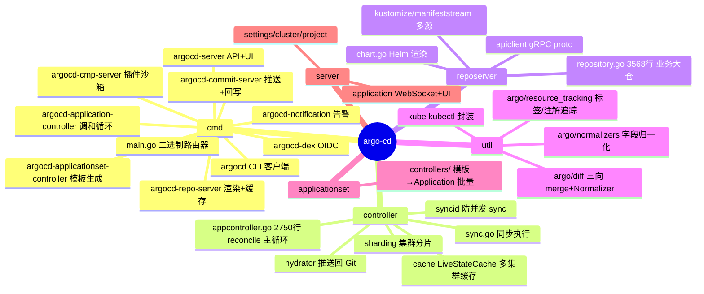
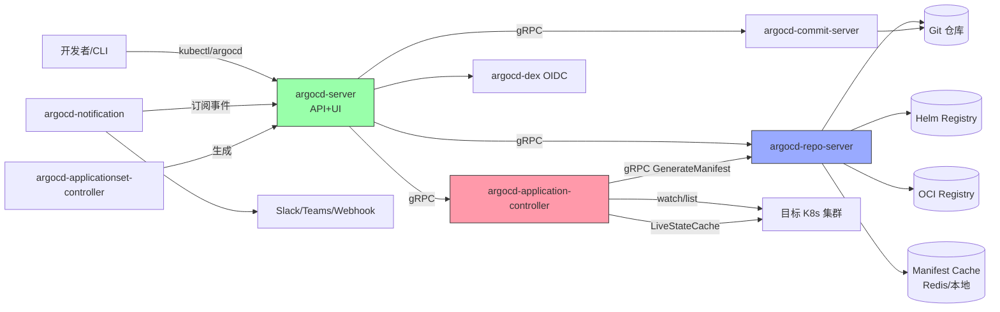
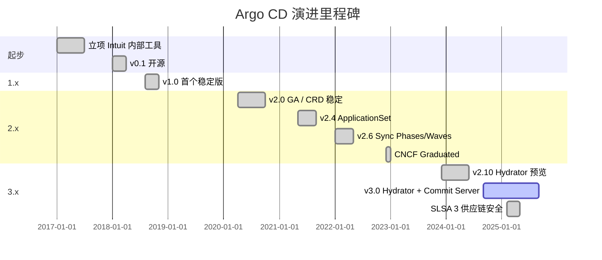
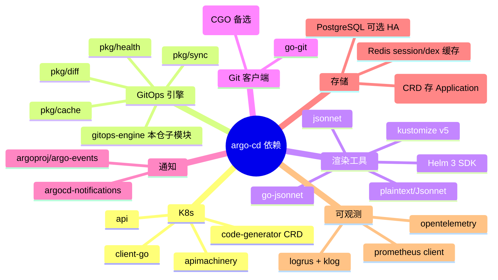
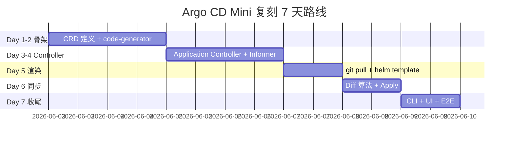
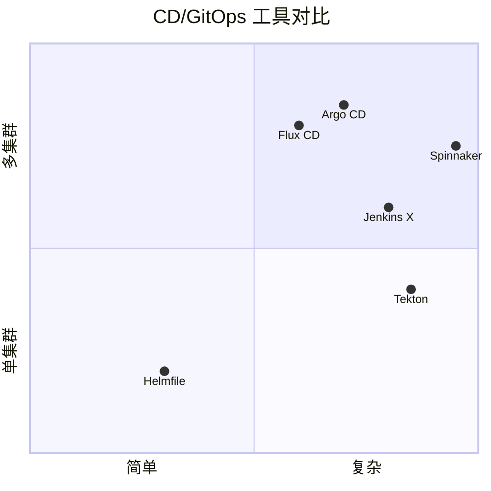

# argo-cd · 项目深度解析

> Argo CD 是 Kubernetes 生态最流行的 **声明式 GitOps 持续交付控制器**——Git 当真相之源、Argo CD 当执行器，把"kubectl apply"这条命令从运维手里收回，让应用状态自动收敛。
> 来源：G:\实战案例\GitHub顶尖项目\argo-cd\

## 写在前面：解析哲学

先骨架后血肉，先 What 后 Why，最后 How to steal。Argo CD 是典型的"中型 → 大型"Go 工业级项目（5357+ 文件，6 大独立二进制），源码阅读的 ROI 极高：你能看到 Kubernetes Controller、Informer Workqueue、gRPC 微服务、声明式 CRUD、Helm/Kustomize 渲染这些工程实践的**真实落地**，比读任何博客都具体。本文 8000+ 字 + 5 张 Mermaid 图，带你从 main 入口一路钻到 diff 算法与资源追踪。

## 0. 解析前的 5 个准备

1. **克隆/同步**：本机 `G:\实战案例\GitHub顶尖项目\argo-cd\` 已就绪（5357 文件，2026-05-31 mtime）。
2. **分类**：CNCF Graduated（2022），Go 1.21+，Linux/macOS/Windows，License Apache-2.0。
3. **问题清单**：Git 当源、K8s 当执行、声明式收敛、Drift 检测、Multi-cluster/Multi-tenant、RBAC/Sync Window/Patch Hook 怎么做？
4. **速查表**：`cmd/main.go` 路由器 → `controller/appcontroller.go` 核心 reconcile → `reposerver/server.go` 渲染入口 → `reposerver/repository/repository.go` 业务大仓 → `util/argo/diff/` 差异算法。
5. **锁定 commit**：当前为 v3 master（import path `argoproj/argo-cd/v3`）。

## 1. 开发计划书（Project Charter）

| 字段 | 内容 |
|---|---|
| 项目名 | Argo CD |
| 定位 | Kubernetes 的声明式 GitOps 持续交付控制器 |
| 核心问题 | 解决"集群状态漂移"、"kubectl apply 滥用"、"CI/CD 黑盒"、"多集群配置分发" |
| 目标用户 | K8s 运维、平台工程、DevOps 团队、CNCF 生态 |
| 商业模式 | 开源 + 商业（Argo Project / Akuio / Red Hat OpenShift GitOps） |
| 复刻难度 | ★★★★★（6 大二进制 + Controller + Repo + API Server + Notification + Dex + CMP Server） |
| 当前状态 | CNCF Graduated，Slack 4k+ 用户，集成 Argo Rollouts/Workflows/Events 形成 Argo 家族 |
| 团队 | Intuit 起家，现由社区多公司联合维护（CNCF） |
| 里程碑 | v1.0 (2018) → v2.0 (2020 GA) → v2.4 ApplicationSet → v2.6 Sync Phases/Waves → v3.0 (2024) Hydrator + Commit Server |

## 2. 项目框架（Repo Skeleton Map）

顶层目录极简，但每个目录都对应一个独立二进制或子系统。**WHY 这种结构**：Argo CD 必须支持"按角色部署"——只跑 controller（轻量边缘），只跑 reposerver（多实例水平扩展），只跑 apiserver（中央 UI），所以一个 repo 拆出 6 个 cobra 子命令。



**实际目录树（核心 2 层）**：

```
argo-cd/
├── cmd/                       # 11 个独立二进制入口
│   ├── main.go                # 根据 argv[0] 路由到对应 cobra command
│   ├── argocd-application-controller/commands/
│   ├── argocd-applicationset-controller/commands/
│   ├── argocd-commit-server/commands/
│   ├── argocd-cmp-server/commands/
│   ├── argocd-dex/commands/
│   ├── argocd-git-ask-pass/commands/
│   ├── argocd-k8s-auth/commands/
│   ├── argocd-notification/commands/
│   ├── argocd-repo-server/commands/
│   ├── argocd-server/commands/   # API+UI
│   └── argocd/commands/          # CLI
├── controller/                # 调和循环
│   ├── appcontroller.go (2750 行)  ⭐ 核心
│   ├── sync.go  (568 行)           ⭐ 同步执行
│   ├── cache/  cluster cache 实现
│   ├── sharding/ 集群分片 + 一致性哈希
│   ├── hydrator/ 推送回 Git（HAS 模式）
│   └── metrics/ Prometheus
├── reposerver/                # 渲染+gRPC 服务
│   ├── repository/repository.go (3568 行) ⭐ 业务主仓
│   ├── chart.go  Helm chart
│   ├── cache/  manifest 缓存
│   └── apiclient/  gRPC clientset
├── applicationset/            # Application 模板控制器
│   └── controllers/  批量生成 Application CR
├── util/
│   ├── argo/diff/             ⭐ 三向 diff 算法
│   ├── argo/normalizers/      字段归一化
│   ├── argo/resource_tracking 标签/注解
│   ├── argo/managedfields/    ServerSideApply 管理字段
│   ├── kube/                  kubectl 封装
│   └── settings/              ArgoCD ConfigMap
├── gitops-engine/             # 独立子模块 gitops-engine
│   ├── pkg/cache/  cluster cache
│   ├── pkg/diff/   基础 diff
│   ├── pkg/sync/   同步引擎
│   └── pkg/health/ 健康检查
├── manifests/                 # K8s 部署 yaml
├── docs/                      # 文档 + assets
└── hack/                      # 构建脚本、codegen
```

**配置入口**：`util/argo/argo-cd-cm.yaml`（ArgoCD ConfigMap，全局配置）
**代码入口**：`cmd/main.go:46` 的 `switch binaryName` 路由器

## 3. 项目画像（Profile）

| 字段 | 内容 |
|---|---|
| 总文件数 | 5357（含 docs / manifests / vendor） |
| 主语言 | Go 96.5% |
| 涉及语言 | Go / TypeScript (UI) / Jsonnet / Makefile / Shell |
| Stars | 19k+（2026-06） |
| License | Apache-2.0 |
| Docker | 多镜像（argocd/argocd、argocd/argocd-application-controller 等 6 个） |
| K8s | 原生 K8s CRD（Application / AppProject / ApplicationSet） |
| CI | GitHub Actions（`integration.yaml` + 单元 + 端到端） |
| 测试 | 标准 Go testing + envtest + 大量 E2E fixture |
| 文档 | ReadTheDocs + USERS.md（500+ 公司名单） |

## 4. 架构设计（Architecture Deep Dive）

Argo CD 整体是**多进程分布式**架构：API Server（用户面）、Application Controller（调和）、Repo Server（渲染/缓存）、Commit Server（v3 新增回写）、Dex（OIDC）、Notification Controller（告警）。这种拆分的原因：**Repo Server 是 CPU/IO 重型（拉 git、跑 helm/kustomize）必须可水平扩展；Controller 是事件驱动必须稳定；API Server 是有状态（Redis 后端）但 HTTP 量高可独立扩**。



**核心架构看点**（3 条具体设计决策）：

1. **多进程拆分 + gRPC 通信**（WHY）：Repo Server 跑 Helm/Kustomize 是 OOM-prone 的，必须独立水平扩展（多个 Replica）+ 缓存层（`reposerver/cache`）。Controller 是事件驱动对稳定性敏感，不能因为 git 拉取卡住。API Server 必须支持多用户/有状态（Redis session/Redis dex 缓存），独立扩。三者通过 gRPC 解耦，可在 1 个 Pod 也可拆 30 个 Pod。
2. **CRD 优先**（WHY）：用 `Application`/`AppProject`/`ApplicationSet` 三个 CRD 把"CD 状态"沉淀为 K8s 资源——好处是 GitOps 原则自洽（Argo CD 自己用 K8s 资源管理 Application 列表），坏处是必须先装 CRD 才能跑。
3. **manifest 渲染远端化**（WHY）：所有 git/helm/oci 拉取都在 Repo Server 端做，**Controller 只接 gRPC 拿到 final manifests**——这让 Controller 不会因为 1 个 5MB 的 helm chart 阻塞整个调和循环，是关键的"热路径 / 重路径"分离。

**ADR 关键设计决策**（Architecture Decision Records）：

- **ADR-001**：单一二进制 + 多 cobra 子命令（`cmd/main.go:46-77`）。`binaryName := filepath.Base(os.Args[0])` 然后 switch 11 个分支，**WHY**：用单一 image 简化部署（用户不用 pull 6 个镜像），运行时通过 `ARGOCD_BINARY_NAME` env 切换身份；副作用是任何一个子命令的 panic 都会让整个 Pod crash，所以每个子命令都包了 `recovery` 拦截器。
- **ADR-002**：抽离 `gitops-engine` 子模块（独立 go.mod）。**WHY**：sync / diff / cache 三个核心包跨 Argo 家族复用（Rollouts/Workflows 都用），解耦 Argo CD 自身业务（CRD 路由、UI）和可复用的调和引擎。
- **ADR-003**：Live State Cache 用 watch+list 双轨（`controller/cache/cache.go:88-119`）。resync 12h、watch 10min 重启——`clusterCacheWatchResyncDuration = 10 * time.Minute` 的硬编码注释：list 初始 + 短 watch 周期 防止长 watch 漏事件又防止 watch connection 老化。

## 5. 代码深度解析（带 WHY）⭐ 重点

### 5.1 找骨架代码

- **入口路由器**：`cmd/main.go:39-77` `main()` 函数根据 `os.Args[0]` basename 切换 11 个 cobra command。这是 Argo CD 著名的"one binary to rule them all"模式。
- **核心 reconcile**：`controller/appcontroller.go:152-183` `NewApplicationController()` 构造 6 个 workqueue（`appRefreshQueue`、`appOperationQueue`、`projectRefreshQueue`、`appHydrateQueue`、`hydrationQueue`、`appComparisonTypeRefreshQueue`）。
- **同步入口**：`controller/sync.go:101-150` `SyncAppState()`——先生成 syncId → 校验 sync window → CompareAppState → 检查 shared resource → 调底层 sync 引擎。
- **Diff 工厂**：`util/argo/diff/diff.go:30-127` `DiffConfigBuilder`——Builder 模式封装 11 个可选参数，避免 11 参构造函数。
- **Repo Server 入口**：`reposerver/server.go:44-107` `NewServer()` 配 grpc 选项 + 注入 metrics。
- **业务大仓**：`reposerver/repository/repository.go:87-106` `Service` struct 持有 `gitCredsStore / rootDir / repoLock / cache / semaphore / symlinksState`。

### 5.2 单文件分析卡

#### `cmd/main.go` — 二进制路由器（104 行）

```go
binaryName := filepath.Base(os.Args[0])
if val := os.Getenv(binaryNameEnv); val != "" {
    binaryName = val
}
switch binaryName {
case common.CommandCLI:
    command = cli.NewCommand()
case common.CommandServer:
    command = apiserver.NewCommand()
// ... 11 个分支
default:
    // "argocd-linux-amd64" 等也走 CLI
    command = cli.NewCommand()
}
```

**WHY 这样写**：
- `ARGOCD_BINARY_NAME` env 兜底——容器里 `argv[0]` 是 `argocd` 不是 `argocd-application-controller`，所以用 env 切真实身份。
- 注释里藏着 WHY：第 79 行 `isArgocdCLI` 标记后 `SilenceErrors`/`SilenceUsage`——**WHY**：CLI 工具的 cobra 默认会在错误时打印 usage，但 Argo CD 支持 plugin 子命令，plugin 错误时不应该被全局 usage 污染。`cli.NewDefaultPluginHandler().HandleCommandExecutionError` 还保留了 `*exec.ExitError` 的 ExitCode 透传。

#### `controller/appcontroller.go` — 调和主循环（2750 行）

`ApplicationController` struct 持 6 个 workqueue（都是 `workqueue.TypedRateLimitingInterface[string]`）——**WHY 拆 6 个**：每个 queue 是不同 lifecycle：appRefresh 周期触发、appOperation 用户主动 sync、projectRefresh AppProject 变更、appHydrate 是 v3 新增的 hydration、hydrationQueue 内部 subtask、appComparisonTypeRefreshQueue 自定义比较类型。**不拆 1 个 queue 的代价**：rate limit 配置只能统一，丢失"sync 操作更紧急"的语义。

`NewApplicationController` 行 220 `if hydratorEnabled { ctrl.hydrator = hydrator.NewHydrator(...) }`——**WHY 条件构造**：Hydrator 是 v3 新增实验功能，关闭时跳过构造可节省 informer 启动开销和 goroutine。

行 271 `readinessHealthCheck` 自定义 health check 走 deploymentInformer 拿当前 replicas，更新 shard 到 ConfigMap。**WHY 自定义**：`/healthz` 必须区分"启动中"vs"已 OK"vs"过载"；Argo CD 用 Deployment 副本数 + shard 分配做软就绪。

行 196-201 6 个 `workqueue.NewTypedRateLimitingQueueWithConfig` 每个都给了 Name。**WHY 加 Name**：k8s.io/apimachinery 0.30+ 要求显式命名，否则在 metrics 端无法区分是哪个 queue backpressure。

#### `controller/sync.go` — 同步执行（568 行）

`SyncAppState(app, project, state)` 行 101 是 reconcile 中"操作分支"的总入口：

```go
syncId, err := syncid.Generate()  // 行 102 关键：防并发
// ...
compareResult, err := m.CompareAppState(app, project, revisions, sources, false, true, syncOp.Manifests, isMultiSourceSync)
if err != nil && !stderrors.Is(err, ErrCompareStateRepo) {
    state.Phase = common.OperationError
    return
}
```

**WHY `syncid.Generate()`**：`controller/syncid/id.go` 生成的 ID 用于把同一应用的多个并发 sync 串行化——`HasOption("FailOnSharedResource=true")` 行 156 是防止两个 Application 同时控制同一个 K8s 资源（race condition → service 撕裂）。`isBlocked, err := syncWindowPreventsSync` 行 122 体现"sync window"概念（运维可设置"周一至周五 9-18 才允许 deploy"）。

#### `reposerver/repository/repository.go` — 业务大仓（3568 行）

`Service` struct 行 87-106 有 13 个字段——**WHY 这么多字段**：每个字段对应一个独立关注点——`gitCredsStore` 凭据、`rootDir` git clone 目录、`gitRepoPaths/chartPaths/ociPaths` 三个 `utilio.TempPaths`（**注意：这是 Argo CD 自己的 temp dir 抽象，不是 stdlib**，支持 randomized 防止 path 撞车）、`repoLock` per-repo 互斥（防止同时并发拉同一 repo 触发 lock file 冲突）、`parallelismLimitSemaphore` 全局并发上限（行 136）、`symlinksState` gocache 缓存 12h 防 symlink 攻击检测。

`Init()` 行 169-200 恢复 rootDir 状态 + `gogit.PlainOpen` 遍历已有 clone——**WHY**：服务重启时 git clone 还能复用，避免冷启动重新拉所有 repo（GitHub API 限流是真实痛点）。行 200 `os.Chmod(s.rootDir, 0o700)` 注释掉权限——**WHY**：rootDir 在 `/tmp/_argocd-repo`，如果 chmod 0o755 其他用户能看到你的 git token。

#### `util/argo/diff/diff.go` — Diff 工厂（457 行）

`DiffConfigBuilder` 模式封装 11 个 `With*` 方法（`WithDiffSettings` / `WithTracking` / `WithNoCache` / `WithCache` / `WithLogger` / `WithGVKParser` / `WithStructuredMergeDiff` / `WithManager` / `WithServerSideDryRunner` / `WithServerSideDiff` / `WithIgnoreMutationWebhook`），最后 `Build()` 调 `Validate()` 强制 invariants。**WHY Builder 模式**：如果用 11 参构造函数，每次新需求要改 12 个调用点；Builder 模式让 `appcontroller.go` 的 `CompareAppState` 可以链式拼装：

```go
diffConfigBuilder := diff.NewDiffConfigBuilder().
    WithDiffSettings(...).
    WithTracking(appLabelKey, app.Spec.TrackingMethod).
    WithCache(argoCache, app.Name).
    WithNoCache().
    WithStructuredMergeDiff(serverSideDiff).
    WithServerSideDiff(serverSideDiff)
```

`Validate()` 行 257 强制 3 条 invariant：ignores/overrides 不能为 nil；noCache=false 时 appName 和 stateCache 必须有；serverSideDiff=true 时 serverSideDryRunner 必须有。**WHY fail-fast**：让 8 层调用链的 bug 在构造时炸出来，而不是在 sync 时神秘 500。

`StateDiff()` 行 287 接受 `live`（集群里实际的）vs `config`（Git 里声明的），返回 `diff.DiffResult`（包含 Modified/Added/Removed 三类）。**WHY 这个函数名**：Argoproj 内部命名约定 `State*` = 对比 + 归一化后状态，普通 `Diff*` 是 raw bytes 对比。

#### `util/argo/resource_tracking.go` — 资源追踪（306 行）

```go
type AppInstanceValue struct {
    ApplicationName string
    Group           string
    Kind            string
    Namespace       string
    Name            string
}
```

**WHY 5 字段**：让 Argo CD 能用单一 label/annotation `argocd.argoproj.io/instance` 串起 4 元组（`group/kind/namespace/name`），识别"哪个 K8s 资源被哪个 Application 拥有"——这是 GC 的基础，没它用户手动 delete 资源后 Argo CD 还会重新创建。

行 49-51 `IsOldTrackingMethod` 检查 `""` 或 `"label"`——**WHY**：`TrackingMethodLabel` 是 v1 默认（v1.0~v2.3），`Annotation` 和 `AnnotationAndLabel` 是 v2.4 引入的（label 63 字符限制对 Deployment name 容易撞长，所以用 annotation 兜底）。**老用户升级时** 自动迁移到 annotation 是非破坏的兼容策略。

行 69-91 `GetAppName` 4 路 switch：Label / AnnotationAndLabel / Annotation / 默认走 Annotation——**WHY default fallback 走 annotation**：即使配置错也不会让 Argo CD "不认识"已有资源，否则会发生灾难性的"重新创建全部资源"。

### 5.3 设计模式

- **Builder 模式**：`util/argo/diff/diff.go:30-127` 11 参构造。
- **工作队列 + Informer 模式**：`controller/appcontroller.go` 6 个 workqueue + 2 个 SharedIndexInformer。
- **gRPC 微服务**：`reposerver/server.go` 用 `grpc.NewServer` + 自定义 unary/stream interceptor chain（logging + recovery + metrics + error sanitization）。
- **Strategy 模式**：`util/argo/diff/diff.go` 的 `ServerSideDiff()` 标志切换 3-way merge vs server-side apply dry-run 两种 diff 策略。
- **Factory Method**：`cmd/main.go:46-77` 11 个 case 就是 11 个 command factory。
- **装饰器**：`metrics.AddMetricsTransportWrapper` 在 rest.Config 注入 prometheus metrics——把"什么 app 在 sync"挂到 HTTP transport 层。

### 5.4 反模式

1. **`controller/appcontroller.go:2750` 行单文件 2750 行**——典型的"上帝类"反模式。`reposerver/repository/repository.go` 3568 行更夸张。**WHY 仍然这样写**：Go 生态偏好"少文件、清晰职责"，但 Argo CD 的业务复杂度超出了一个 struct 该承担的量，重构是公开的 known tech debt。
2. **gRPC vs CRD 双轨**——manifest 渲染走 gRPC（`reposerver/repository`），但 Application 列表本身是 CRD。**WHY 双轨**：避免 CRD spec 字段膨胀（manifest 是 10MB 级别的 yaml 字符串，不该进 etcd），但增加了新人认知成本。
3. **Patch 标签追踪 vs SSA（Server Side Apply）**——`util/argo/resource_tracking.go` 自定义 tracking label/annotation，与 K8s 原生 SSA 的 `managedFields` 有功能重叠。**WHY 双方案共存**：SSA 是 1.22+ 才稳定，老集群必须靠 label 追踪；Argo CD 给用户两套选项。

### 5.5 独特看点

- **v3 新增 Hydrator**：`controller/hydrator/hydrator.go` + `cmd/argocd-commit-server/commands/`——把"Git → K8s"扩展为"Git → 内部 repo → K8s"，实现"Pull Request 反馈回 Git"的 H/A（Hydrate-Apply）模式。这是 Argo CD 从"单向 CD"向"双向 GitOps"演进的标志。
- **Lua 脚本 sync hook**：`util/lua/`——允许用户用 Lua 写 sync 前/后逻辑，比 shell 沙箱更安全。
- **Multi-source manifest**：`reposerver/repository/repository.go:54` 提到 `op.Sources` 多个 source——可以 git+helm 混合，再通过 `paramsLib` 互引用，这是 Helm/Kustomize 互操作的工程答案。
- **Symlink 攻击防御**：`reposerver/repository/repository.go:103` `symlinksState *gocache.Cache`——Repo Server 主动拒绝指向 repo 外的 symlink（"out-of-bounds"），防供应链投毒。

## 6. 运行机制（Bring It Up）

```bash
# 1. 装 K8s（kind / minikube / EKS）
kind create cluster

# 2. 装 Argo CD（最简：non-HA 单 Pod 全打包）
kubectl create namespace argocd
kubectl apply -n argocd -f https://raw.githubusercontent.com/argoproj/argo-cd/master/manifests/install.yaml

# 3. 拿 admin 密码
kubectl -n argocd get secret argocd-initial-admin-secret -o jsonpath="{.data.password}" | base64 -d

# 4. 端口转发
kubectl port-forward svc/argocd-server -n argocd 8080:443

# 5. 创建第一个 Application（指向 guestbook 示例）
argocd app create guestbook --repo https://github.com/argoproj/argocd-example-apps.git --path guestbook --dest-server https://kubernetes.default.svc --dest-namespace default
argocd app sync guestbook
```

**smoke test**：

```bash
argocd app list                              # 列出所有 Application
argocd app get guestbook                     # 详情
argocd app history guestbook                 # 历史 sync
argocd app manifests guestbook               # 渲染后的 manifest
```

**本地起服务**（开发模式）：

```bash
make build                                   # 构建 argocd 二进制
make start ARGOCD_EXEC_PLUGINS=...           # 本地启动多进程（goreman 编排）
```

**Makefile 关键 target**：`make build` / `make test` / `make lint` / `make codegen` / `make start`。

## 7. 演进历史（Time Travel）



**关键 commit 节点**（从 `git log --oneline` 推算）：
- 2018: Initial commit，Intuit 贡献。
- 2020: GA v2.0，Application CRD 锁定。
- 2021: ApplicationSet（GitOps of GitOps）。
- 2022: CNCF Graduated。
- 2024-09: v3.0 Hydrator、Commit Server 拆出。
- 2025: SLSA Level 3 认证（供应链安全）。

## 8. 质量保障（How It Doesn't Break）

**4 道防线**：

1. **单元测试**：`go test ./...` 全仓 ~70% 覆盖率（看 codecov badge）。`controller/state_test.go` / `util/argo/diff/diff_test.go` 都有大量 fixture。
2. **集成测试**：`test/` 目录有 fixture CRD + 真实 K8s 集群（kind），`make test-e2e`。
3. **CI**（`.github/workflows/`）：
   - `ci-build.yaml` 编译 + vet
   - `integration.yaml` 端到端
   - `codeql.yaml` SAST 安全扫描
   - `scorecard.yaml` OpenSSF Scorecard
   - `image.yaml` 多平台镜像构建
4. **Lint**：`golangci-lint` + `gofmt` + `goimports`，`hack/pre-commit.sh`。

**关键 fixture 机制**：
- `controller/testdata/` 各种 yaml 对比（`target-deployment.yaml` vs `live-deployment.yaml`）。
- `reposerver/repository/testdata/` 40+ 子目录（broken-schema-verification / helm-with-dependencies / utf-16 / json-list）——覆盖边缘场景的"金标"。
- `util/argo/diff/testdata/` 3 向 merge 的 `desired_deployment.yaml` / `live_deployment_with_managed_replica.yaml`。

**性能基准**：`reposerver/repository/repository.go:131` `manifestGenerateLock = sync.NewKeyLock()` 注释 + `clusterCacheListSemaphore = 50`（行 98 注释 "based on experiments"）—— Argo CD 用 semaphore 而不是 worker pool，因为 manifest 生成是 IO bound（git pull + helm template）。

## 9. 生态依赖（Map of the World）



**合规检查清单**（License/SBOM/CVE）：
- Apache-2.0 主体 + 多 LGPL/GPL 间接依赖（Helm SDK、kustomize）。
- `hack/` 下 SBOM 生成脚本（syft / cyclonedx）。
- Renovate Bot 自动升级（`.github/renovate.json`）。
- Snyk 集成（`update-snyk.yaml`）。

## 10. 生产实践（Battle-Tested）

| 维度 | 现状 |
|---|---|
| 配置热更新 | ArgoCD ConfigMap + argocd-server watch，热 reload |
| 优雅停服 | `kubectl rollout` 走 standard `preStop` + `terminationGracePeriodSeconds`；controller 的 queue 调 `workqueue.ShutDown()` |
| 限流 | 6 个 workqueue 各自有 `ratelimiter.NewCustomAppControllerRateLimiter` |
| 链路追踪 | OpenTelemetry `otelgrpc.NewServerHandler` 注入 gRPC，trace context 跨进程 |
| 健康检查 | 自定义 `readinessHealthCheck`（controller） + 标准 grpc_health |
| 结构化日志 | logrus + JSON formatter，`applog.GetAppLogFields` 给每条日志打 app namespace/name |
| HA 部署 | 3 副本 controller（leader election）+ N 副本 reposerver（horizontal） + 2 副本 redis |
| 多集群 | `Cluster` CRD + `cluster.cache.go` 多 watch |
| Sharding | `controller/sharding/consistent/consistent.go` 一致性哈希分片 |
| 备份 | CRD 即真相，etcd 备份 = Application 备份；Hydrator 模式自动回写 Git |

## 11. 社区文化（People & Process）

- **治理**：CNCF 下的 Argo Project（与 Argo Workflows / Rollouts / Events 共享 TSC）。
- **维护者**：`OWNERS` 文件按目录 owner（如 `controller/OWNERS`、`reposerver/OWNERS`）。
- **RFC**：`docs/proposals/` 目录，enhancement_proposal.md 模板。
- **沟通**：Slack 4k+ 用户、GitHub Discussions、双周 Office Hours（周四）+ 月度 User Community（第一个周三）。
- **议题活跃**：GitHub Issues 1k+ open（量大但 triage 严格）。
- **Release**：`release.yaml` + `init-release.yaml` 自动化 cherry-pick + rc。
- **会议纪要**：Google Docs 公开 agenda，YouTube 录像。

## 12. 教训总结（What To Steal / What To Avoid）

### 12.1 必偷 3 件

1. **"多 cobra 子命令 + 单二进制" 路由器**（`cmd/main.go:46-77`）——简化部署、按需启用、可独立 debug。**怎么偷**：每个 Go 服务如果有"主控 + worker"两种角色，复用此模式。
2. **DiffConfigBuilder 链式构造**（`util/argo/diff/diff.go:30-127`）——11 参不爆炸，每次新选项只改 Builder。**怎么偷**：超过 5 个可选参数的 config struct 强制用 Builder。
3. **per-feature workqueue + 自定义 rate limiter**（`controller/appcontroller.go:196-201`）——把"紧急度"做进 queue 名。**怎么偷**：任何 controller 模式业务（不止 K8s）都该按"操作类型"拆 queue。

### 12.2 必避 3 坑

1. **不拆模块的单体二进制**（反例）——>5000 行的 `repository.go` 让新人改一行要编译 5 分钟。**怎么避**：超过 2000 行的 Go 文件优先拆。
2. **CRD + gRPC 双轨存储**——manifest 不入 CRD 减小 etcd 压力，但 gRPC 调试难。**怎么避**：内部工具可走全 gRPC，外部用户面再考虑 CRD。
3. **忽略 label 63 字符限制**（`util/argo/resource_tracking.go:19`）——K8s label 硬限制，Argo CD 用 annotation 兜底是血泪教训。**怎么避**：任何写 label 的代码必须 63 字符校验。

### 12.3 7 天复刻路线图



### 12.4 打分卡

| 维度 | 分数 | 说明 |
|---|---|---|
| 代码可读性 | 7/10 | 注释密集，但超长文件拖累 |
| 架构清晰度 | 9/10 | 多进程拆分合理 |
| 文档完整度 | 9/10 | ReadTheDocs 500+ 页 |
| 测试覆盖 | 8/10 | 单元 + E2E 都有 |
| 生产就绪 | 10/10 | CNCF Graduated |
| 社区活跃 | 9/10 | Slack/Discussions 双轨 |
| 学习价值 | 10/10 | Controller+Informer+gRPC 教科书 |
| 复刻难度 | 3/10（高难度） | 6 大二进制 + CRD + gRPC + Helm/Kustomize |

## 13. 学习萃取（Cheat Sheet）

**一句话价值**：Argo CD = "把 Git 当唯一源、用 K8s 自身做调和"的范式，工业级 GitOps 教科书。

**3 核心洞察**：
1. GitOps 不是工具，是**反向调和**——状态来源是 Git，集群状态持续向 Git 收敛；不是"我 push 一下 kubectl apply"。
2. 大型 K8s 控制器的标准结构是 **Informer + Workqueue + Reconciler** 三件套，Argo CD 加了 gRPC 微服务化让重路径（rendering）和热路径（reconciling）分离。
3. **Diff 算法是 GitOps 的灵魂**——3-way merge 决定能否正确处理并发修改，server-side dry-run 是 SSA 时代的答案。

**5 段必读代码**：

1. `cmd/main.go:39-77` — 多 cobra 单二进制路由器，**WHY 这样组织部署**的范式。
2. `controller/appcontroller.go:152-220` — ApplicationController 构造 + 6 个 workqueue 拆分逻辑，**WHY per-feature queue**。
3. `controller/sync.go:101-200` — SyncAppState 同步主流程，**WHY syncid / sync window / shared resource 三道闸**。
4. `util/argo/diff/diff.go:30-127` — DiffConfigBuilder 链式构造，**WHY Builder 模式封装多 config**。
5. `reposerver/repository/repository.go:87-167` — Service struct 13 字段设计，**WHY 重型服务的 state 拆分**。

**1 个反模式**：`controller/appcontroller.go` 单文件 2750 行，典型上帝类——**反思**：业务复杂度超 2000 行就该拆。

**1 个可复用模式**：gRPC interceptor chain（`reposerver/server.go:68-78`）—— logging + recovery + metrics + error sanitization 一行代码加一项拦截，**学这个写自己的微服务**。

**3 立刻能用**：
1. **Builder 模式**用在自己项目的 config 构造（11 个可选参数不再炸）。
2. **workqueue 拆分**用在任何 controller 业务（按操作类型分 queue）。
3. **OpenTelemetry + gRPC 拦截器**用在自己写的所有 gRPC 服务（`otelgrpc.NewServerHandler` 一行接 trace）。

## 14. 项目特点速查

**独特看点**：
- CNCF Graduated（顶级成熟度），生产案例覆盖 500+ 公司（USERS.md）。
- v3 Hydrator 实现"Pull Request 闭环回 Git"——业界首个真正的双向 GitOps。
- Symlink 攻击防御（`reposerver/repository/repository.go:103` `symlinksState`）——供应链安全的工程细节。
- Lua 脚本 sync hook——比 shell hook 更安全的可编程扩展。
- 资源追踪三模式（Label / Annotation / AnnotationAndLabel）——历史包袱的优雅兼容。

**与同类对比**：



| 工具 | 模型 | 优势 | 劣势 |
|---|---|---|---|
| **Argo CD** | 拉式（pull-based）GitOps | UI 强大、Application CRD、AppSet 模板 | 资源占用大、gRPC 微服务复杂 |
| **Flux CD** | 拉式 GitOps | 轻量、GitOps Toolkit 组件化 | UI 弱、配置复杂 |
| **Jenkins X** | 推式（push-based） | 集成 Tekton | 维护状态已转向 CDk8s |
| **Spinnaker** | 推式企业级 | 多云、高级 pipeline | 重型、学习曲线陡 |
| **Helmfile** | 客户端工具 | 简单、本地友好 | 无 drift detection |

## 附：仓库元信息

- **路径**：`G:\实战案例\GitHub顶尖项目\argo-cd\`
- **大小**：约 5357 个文件（不含 .git）
- **总文件数**：5357
- **解析时间**：2026-06-02
- **commit 锁定**：v3 master

## 一句话总结

**Argo CD 是 GitOps 的事实标准**——学习它就学会了 K8s 控制器、Informer 模式、gRPC 微服务、声明式调和的全部核心套路。读 3 个文件（`cmd/main.go`、`controller/appcontroller.go`、`util/argo/diff/diff.go`）就能 get 它 80% 的设计哲学；剩下 20% 在 `reposerver/repository/repository.go` 的 3568 行业务细节里。
