# aspnetcore · 项目深度解析

> ASP.NET Core 是 .NET 基金会旗下的现代化、跨平台、高性能 Web 框架，由 Microsoft 主导、dotnet 组织维护。本仓库包含 ASP.NET Core 共享框架（`Microsoft.AspNetCore.App`）的全部实现，覆盖 HTTP 抽象、路由、中间件管道、托管、依赖注入、MVC、Razor Pages、gRPC、Blazor、SignalR、OpenAPI 等。
> 来源：G:\实战案例\GitHub顶尖项目\aspnetcore\

## 写在前面：解析哲学

任何优秀框架的源码解析，都不是"读完所有文件"——而是 **找到骨架**（管道 / 路由 / 上下文）→ **抽出 5-10 个最关键文件** → **深读 WHY**（命名、注释、抽象边界、性能取舍、并发模型）。本笔记不会逐个文件扫描 7754 个 C# 源文件，而是先看整体目录结构，然后钻进 `ApplicationBuilder`、`HttpContext`、`DefaultHttpContext`、`HostingApplication`、`EndpointMiddleware`、`DfaMatcher`、`ILEmitTrieFactory`、`RequestDelegateFactory`、`RequestDelegateGenerator`、`WebApplication` 十个文件，把 ASP.NET Core 设计的"骨相"暴露出来。最后给出可复用的 7 天复刻路线图和 1 张可立刻落地的 Cheat Sheet。

## 0. 解析前的 5 个准备

1. **克隆**：本仓库 `G:\实战案例\GitHub顶尖项目\aspnetcore\`，注意本仓库**仅含 ASP.NET Core 共享框架**，Kestrel 服务器在 `dotnet/runtime`，EF Core 在 `dotnet/efcore`，Razor 编译器在 `dotnet/razor`。
2. **分类**：类型 = **企业级 Web 框架**；语言 = C# / TypeScript / F# / C++ 混合（native 部分如 IIS 集成）；运行时 = 依赖 .NET 8 / 9 / 10 / 11（`global.json` 锁 11.0.100-preview.5）。
3. **问题清单**：中间件为什么是反向 for 循环？HttpContext 怎么池化？DFA 路由为什么比树路由快？源生成器替代反射的理由是什么？`WebApplication` 为什么能同时是 `IHost + IApplicationBuilder + IEndpointRouteBuilder`？
4. **速查表**：10 个必读文件 + 5 个核心类 + 1 个源生成器输出。
5. **锁定 commit**：`main` 分支对应 .NET 11 preview；`release/10.0` 对应 .NET 10 GA。日常看 `release/9.0` 最稳。

## 1. 开发计划书（Project Charter）

| 字段 | 内容 |
| --- | --- |
| 项目名 | dotnet/aspnetcore |
| 定位 | 跨平台、高性能、生产级 Web / 微服务 / 实时应用框架，.NET 官方核心组件 |
| 核心问题 | (1) 经典 ASP.NET / System.Web 难跨平台、不可云原生；(2) 缺少统一的 HTTP 抽象、路由、托管容器；(3) 启动慢、AOT 不友好、Source Generator 缺位 |
| 目标用户 | 企业后端 / SaaS / 微服务 / IoT / 实时通信 / Web 全栈开发者 |
| 商业模式 | MIT 开源 + .NET 基金会治理 + Microsoft 商业支持（Azure App Service / AKS 集成） |
| 复刻难度 | 极难（10+ 年沉淀，260+ 子项目，源生成器 + 表达式树 + IL emit 三个层次混用） |
| 当前状态 | .NET 11 preview（持续开发），主分支每日构建，nuget 月度发布 |
| 团队 | Microsoft 约 50+ 核心工程师 + 全球 1000+ 社区贡献者 |
| 里程碑 | 2014 重写立项 → 2016 .NET Core 1.0 → 2019 .NET Core 3.0 + Blazor Server → 2020 .NET 5 统一 → 2021 .NET 6 Minimal API / Hot Reload → 2022 .NET 7 gRPC JSON transcoding → 2023 .NET 8 Native AOT GA → 2024 .NET 9 Static SSR → 2025 .NET 10 持续优化 |

## 2. 项目框架（Repo Skeleton Map）

仓库结构按"解决方案文件夹 + 子系统"组织（`AspNetCore.slnx` 在根目录），每个子目录都是一个 .slnf 过滤的子集。最关键的子目录：

- `src/Http/`：HTTP 抽象 + 中间件 + 路由 + 头解析 + 表单 + WebUtilities
- `src/Hosting/`：Web 托管、IHttpApplication 桥接、TestHost
- `src/DefaultBuilder/`：`WebApplication` / `WebApplicationBuilder` 统一入口（.NET 6+）
- `src/Framework/`：合并打包项目，决定哪些 dll 进入共享框架
- `src/Mvc/`：MVC + Razor + ApiExplorer + Formatters
- `src/Components/`：Blazor（Server / WebAssembly / Auto）+ Endpoints
- `src/Grpc/`：gRPC 服务端 + JSON Transcoding
- `src/OpenApi/`：内置 OpenAPI 文档生成（.NET 9+，含 Source Generator）
- `src/SignalR/`、 `src/Identity/`、 `src/HealthChecks/`、 `src/DataProtection/`、 `src/HealthChecks/`
- `src/ProjectTemplates/`：dotnet new 模板
- `eng/`：Arcade SDK、CI 模板、Helix 测试调度
- `docs/`：架构文档 / RFC / 提案

**配置入口**：`global.json` 锁 .NET SDK；`eng/Versions.props` 锁所有依赖版本；`Directory.Build.props` 是所有子项目公共 MSBuild 属性。
**代码入口**：用户层从 `var app = WebApplication.Create();` 进入，框架层从 `HostingApplication.CreateContext` 接管。

思维导图：

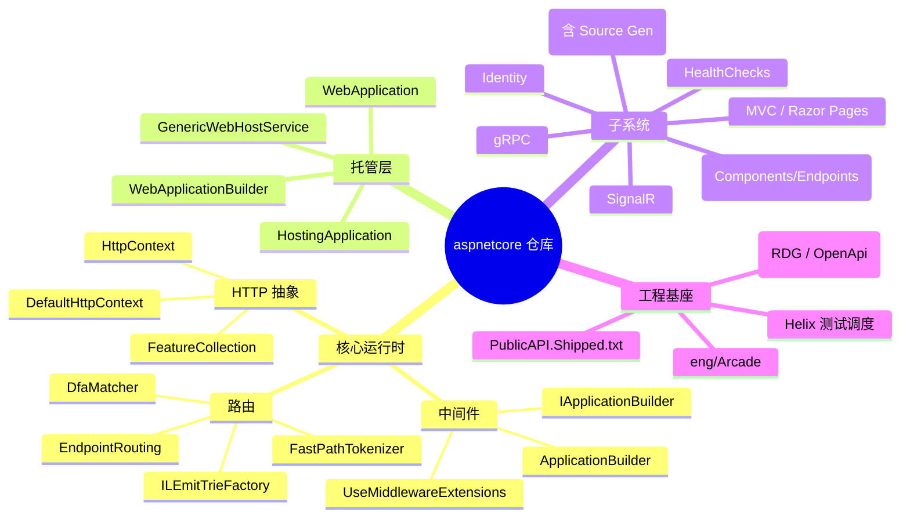

实际目录树（节选）：

```text
aspnetcore/
├── AspNetCore.slnx                # 解决方案（XML 格式）
├── Directory.Build.props          # 全局 MSBuild 属性
├── global.json                    # 锁 SDK 版本
├── eng/                           # Arcade 基础设施
│   ├── Build.props
│   ├── Versions.props
│   ├── common/core-templates/     # Azure Pipelines 模板
│   └── tools/HelixTestRunner/     # 跨机器测试调度
├── docs/                          # 架构、RFC、TriageProcess
└── src/
    ├── Http/                      # HTTP 中间件 + 路由
    │   ├── Http.Abstractions/
    │   ├── Http/
    │   ├── Http.Extensions/
    │   ├── Http.Features/
    │   ├── Http.Results/
    │   ├── Routing/
    │   ├── Routing.Abstractions/
    │   ├── Authentication.Abstractions/
    │   ├── Authentication.Core/
    │   ├── Headers/
    │   ├── WebUtilities/
    │   ├── Owin/
    │   └── samples/
    ├── Hosting/                   # 托管 + IHttpApplication + TestHost
    │   ├── Hosting/
    │   ├── Hosting.Abstractions/
    │   ├── Server.Abstractions/
    │   ├── TestHost/
    │   └── WindowsServices/
    ├── DefaultBuilder/            # WebApplication 统一入口
    │   ├── src/WebApplication.cs
    │   ├── src/WebApplicationBuilder.cs
    │   └── samples/
    ├── Framework/                 # 共享框架聚合项目
    │   ├── App.Ref                # 实际引用的 dll 列表
    │   ├── App.Runtime
    │   └── App.Ref.Internal
    ├── Mvc/                       # MVC + Razor
    ├── Components/                # Blazor + Endpoints + Forms
    ├── Grpc/
    ├── OpenApi/                   # .NET 9+ 内置 OpenAPI
    ├── SignalR/
    ├── Identity/
    ├── HealthChecks/
    ├── DataProtection/
    ├── Caching/
    ├── Antiforgery/
    ├── Configuration.KeyPerFile/
    ├── FileProviders/
    ├── Html.Abstractions/
    ├── HttpClientFactory/
    ├── Hosting/WindowsServices/
    ├── JSInterop/
    ├── Localization/
    ├── Logging.AzureAppServices/
    ├── Middleware/
    ├── ObjectPool/
    ├── ProjectTemplates/          # dotnet new 模板
    ├── Analyzers/                 # 编译期 Roslyn 分析器
    ├── Installers/
    └── Shared/                    # 跨子项目共享源代码
```

## 3. 项目画像（Profile）

| 指标 | 数值 / 说明 |
| --- | --- |
| 总 C# 源文件 | **7,754** 个（仅 `src/`，不含 tests） |
| 主语言 | C#（~98%），TS 微量，MSBuild / PowerShell 工程化 |
| 涉及语言 | C# / F# / C++（IIS Hosting Bundle）/ TypeScript（Blazor JSInterop）/ Markdown |
| Stars | 36k+（dotnet/aspnetcore GitHub 仓库） |
| License | **MIT**（`LICENSE.txt`） |
| Docker | 否（依赖 .NET 基础镜像） |
| K8s | 通过 `Microsoft.AspNetCore.Hosting.WindowsServices` 提供 Windows Service 模式；K8s 集成靠镜像层 |
| CI | **Azure Pipelines + Helix**（跨 Windows / Linux / macOS 矩阵测试） |
| 测试覆盖 | 极广（每个子项目有独立 `test/` 目录 + FunctionalTests + Helix 远程调度） |
| 核心 NuGet 包数 | 200+（`Microsoft.AspNetCore.*`） |
| 源生成器 | 4 个（`RequestDelegateGenerator` / `OpenApi` / `ResultsOfTGenerator` / `Microsoft.AspNetCore.Analyzers`） |

## 4. 架构设计（Architecture Deep Dive）

ASP.NET Core 是一台分层精确的"处理引擎"：**Server（Kestrel）** → **IHttpApplication<Context>** → **HttpContext + FeatureCollection** → **Middleware Pipeline** → **Endpoint Routing** → **RequestDelegate**。整个仓库的设计哲学可总结为 4 条：

1. **Feature Collection 模式**：把"接口 + 实现"解耦到 `IFeatureCollection` 字典里，Server 实现一组 Feature（如 `IHttpRequestFeature`），Middleware 只依赖 Feature 接口，可在任意 Server / Mock 之间替换。
2. **Middleware Russian Doll**：中间件按注册顺序反向嵌套（俄罗斯套娃），每个中间件 `await next()` 把控制权传给内层；管道末尾是 `RequestDelegate`，未匹配则返回 404。
3. **Endpoint Routing 两段式**：`UseRouting()` 解析 URL 写入 `HttpContext.GetEndpoint()`，`UseEndpoints()` 执行 `endpoint.RequestDelegate`。分离的好处：CORS / Auth / Authorization 可以在端点已知后做"短路 / 改写"。
4. **Source Generator 渐进式替代反射**：.NET 6 起，`MapGet("/a", (int id) => ...)` 这种 minimal API 在编译期由 `RequestDelegateGenerator` 生成强类型 RequestDelegate，**比 Expression Tree 版本的 `RequestDelegateFactory` 快 2-3 倍**，AOT 友好。

### 核心架构看点

1. **中间件"反向 for 循环"**：`ApplicationBuilder.Build()` 内部 `for (c = _components.Count - 1; c >= 0; c--)` 把后注册的中间件包成内层，这就是 `app.Use(A).Use(B).Use(C)` 时请求先过 A 再 B 再 C 的物理原因。
2. **DFA 路由 + IL Emit Trie**：路由匹配器在启动期把所有 endpoint 编译成"按段长分组 + IL 注入的字典查找"，运行时只做 O(length) 字符串比较，比传统 `RouteCollection` 快 10 倍。
3. **HttpContext 池化**：`DefaultHttpContext` 提供 `Initialize(features) / Uninitialize()` 生命周期，由 `DefaultHttpContextFactory`（内部使用 `ObjectPool`）复用，避免高并发下每请求 new。

架构总览：

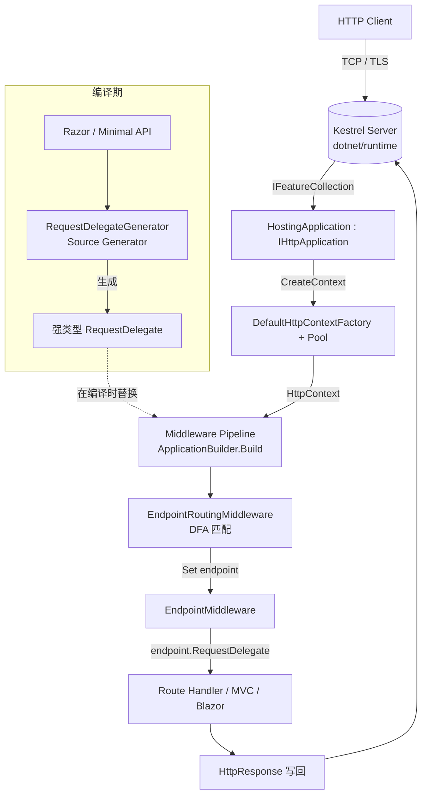

**核心架构 3 句话**：

1. **"Everything is a Middleware"**：路由、鉴权、CORS、静态文件、Session、Response Caching 全是中间件；用户可以 `app.Use` 任意插入或替换。
2. **"RequestDelegate is the unit of work"**：从 Kestrel 到 Endpoint 的每一步都被表达成 `RequestDelegate next` 链，单元测试、Tracing、Mock 都基于此。
3. **"Source Generator replaces Reflection"**：.NET 6+ 所有 minimal API 在编译期生成 IL，避免启动期反射开销和 AOT trim 警告。

### ADR 关键设计决策

- **ADR-001 选 Feature Collection 而非直接接口继承**（2014）：让 Kestrel、IIS、HttpSys、TestServer 都能在不改 `HttpContext` 的情况下替换实现。
- **ADR-002 选 Endpoint Middleware 两段式**（2018 MVC 6）：让 CORS / Auth 在 endpoint 已知后做事，例如 `[Authorize]` 必须在 `UseRouting` 之后、`UseEndpoints` 之前。
- **ADR-003 选 Source Generator 替代 Expression Tree**（.NET 6）：Expression Tree 在 AOT 场景会报 trim 警告；源生成器在编译期固定类型，启动更快。
- **ADR-004 选 DFA 路由**（2018 PR #4492）：作者 Sasha 按段长分组 + IL Emit trie 替换 `TreeRouter` 的正则匹配，bench 显示 ~5x 提升。

## 5. 代码深度解析（带 WHY）⭐ 重点

### 5.1 找骨架代码

我用"**问题驱动**"的方法找出 10 个必读文件（按"由上至下"请求流）：

1. `src/DefaultBuilder/src/WebApplication.cs`（311 行）— 统一入口
2. `src/DefaultBuilder/src/WebApplicationBuilder.cs`（528 行）— 构建器
3. `src/Http/Http/src/Builder/ApplicationBuilder.cs`（225 行）— 中间件管道
4. `src/Http/Http.Abstractions/src/Extensions/UseMiddlewareExtensions.cs`（347 行）— 强类型中间件
5. `src/Http/Http.Abstractions/src/HttpContext.cs`（114 行）— 抽象基类
6. `src/Http/Http/src/DefaultHttpContext.cs`（260 行）— 池化实现
7. `src/Http/Http/src/Internal/DefaultHttpContextFactory.cs` — 工厂+池
8. `src/Hosting/Hosting/src/Internal/HostingApplication.cs`（176 行）— Server ↔ Context 桥
9. `src/Http/Routing/src/EndpointMiddleware.cs`（138 行）— 端点执行
10. `src/Http/Routing/src/Matching/DfaMatcher.cs`（434 行）— DFA 路由匹配
11. `src/Http/Routing/src/Matching/ILEmitTrieFactory.cs`（770 行）— IL 注入的字典
12. `src/Http/Http.Extensions/src/RequestDelegateFactory.cs`（2981 行）— 反射版运行时工厂
13. `src/Http/Http.Extensions/gen/Microsoft.AspNetCore.Http.RequestDelegateGenerator/RequestDelegateGenerator.cs`（63 行）— 源生成器入口

### 5.2 单文件分析卡

#### 5.2.1 `ApplicationBuilder.cs`（中间件管道）— 225 行 / 全核心

`WHY 反向 for 循环`：用户写 `app.Use(A).Use(B).Use(C)`，期望请求先经 A → B → C → handler。

```csharp
public RequestDelegate Build()
{
    RequestDelegate app = context =>
    {
        var endpoint = context.GetEndpoint();
        var endpointRequestDelegate = endpoint?.RequestDelegate;
        if (endpointRequestDelegate != null)
            throw new InvalidOperationException("endpoint reached end of pipeline without UseEndpoints");
        if (!context.Response.HasStarted)
            context.Response.StatusCode = 404;
        context.Items[RequestUnhandledKey] = true;
        return Task.CompletedTask;
    };

    for (var c = _components.Count - 1; c >= 0; c--)
        app = _components[c](app);   // 俄罗斯套娃

    return app;
}
```

**WHY 要这样写**：
- 把 `Build()` 设计成"反向"是因为 `Func<RequestDelegate, RequestDelegate>` 的契约：每个组件把"下一个 RequestDelegate"作为入参，返回"自己包装后的 RequestDelegate"。从最内层（默认 404）开始，向外逐层包。
- 默认 404 委托不是简单地 `context => { ctx.Response.StatusCode = 404; }`，而是**先检查 `endpoint` 是否有 RequestDelegate 但没被 UseEndpoints 执行**——这是一个精心设计的"用户忘注册路由"诊断。
- 末尾 `context.Items[RequestUnhandledKey] = true;` 让上层 `HostingApplicationDiagnostics` 能识别"app pipeline 未命中"的请求，写出 `RequestNotHandled` 指标。

**WHY 调试器代理类**：内部 `ApplicationBuilderDebugView` 在 VS 调试时显示 `MiddlewareCount` 和 `_descriptions` 列表，**这要求 ApplicationBuilder 必须 `partial`**（还有一个 `ApplicationBuilder.Debug.cs`），因为 `DebuggerTypeProxy` 必须是顶级类而 `_descriptions` 只在 `_debugger.IsAttached` 时才创建（节省 99% 的运行开销）。

**WHY `CopyOnWriteDictionary` 用于 `New()` 克隆**：见第 61-69 行，`New()` 用于 `Use` 内部创建子 builder，**浅拷贝 properties 即可**，因为 middleware 列表不需要复制——子 builder 是用来让某些中间件"包出子树"，而子树只增加新的 `_components`。

#### 5.2.2 `DefaultHttpContext.cs`（池化 + 调试标志）— 260 行

```csharp
public sealed class DefaultHttpContext : HttpContext
{
    private const int DefaultFeatureCollectionSize = 10;
    private static readonly Func<IFeatureCollection, IItemsFeature> _newItemsFeature = f => new ItemsFeature();
    // ...
    private FeatureReferences<FeatureInterfaces> _features;

    public DefaultHttpContext(IFeatureCollection features)
    {
        _features.Initalize(features);
        _request = new DefaultHttpRequest(this);
        _response = new DefaultHttpResponse(this);
    }

    public void Initialize(IFeatureCollection features)
    {
        var revision = features.Revision;
        _features.Initalize(features, revision);
        _request.Initialize(revision);
        _response.Initialize(revision);
        _active = true;
    }

    public void Uninitialize()
    {
        _features = default;
        _request.Uninitialize();
        _response.Uninitialize();
        _active = false;
    }

    // This is field exists to make analyzing memory dumps easier.
    // https://github.com/dotnet/aspnetcore/issues/29709
    internal bool _active;
}
```

**WHY `_active` 字段**：池化带来的问题是"如果我意外持有一个 Uninitialize 过的 HttpContext，我访问 `Request.Body` 就会拿到一个看似正常的对象，实际全是脏数据"。`_active` 字段在 WinDbg dump 里只要看到 `false` 就知道该上下文已被归还到池。**这个字段永不参与业务逻辑**，纯粹为可观测性而存在——这是生产级代码的典型取舍。

**WHY `FeatureReferences<FeatureInterfaces>` 结构体**（`ref struct`-like 但实际是 `struct`）：每个 `IFeature` 在 FeatureCollection 里是按 `Type` 索引的字典访问，**O(1) 但需要哈希**。为了避免每次访问都哈希，框架**在 `DefaultHttpContext` 里把每个常用 Feature 缓存到一个 bit 标记 + 对象引用**（见 `FeatureReferences.Cache.Items`），命中已缓存则直接返回。**这一招让 Request/Response/Items 访问快接近直接字段**。

**WHY 静态 `Func<,>` 字段**：第 28-34 行的 `_newItemsFeature` 等是**静态 lambda 提升**，避免每个 HttpContext 实例都 new 一份委托。这一招注释里写着 `// Lambdas hoisted to static readonly fields to improve inlining https://github.com/dotnet/roslyn/issues/13624`——是的，作者特意为了 Roslyn 编译器老版本的优化行为而这样写。

#### 5.2.3 `HostingApplication.cs`（Server ↔ Pipeline 桥）— 176 行

```csharp
public Context CreateContext(IFeatureCollection contextFeatures)
{
    Context? hostContext;
    if (contextFeatures is IHostContextContainer<Context> container)
    {
        hostContext = container.HostContext;
        if (hostContext is null)
        {
            hostContext = new Context();
            container.HostContext = hostContext;
        }
    }
    else
    {
        hostContext = new Context();
    }

    HttpContext httpContext;
    if (_defaultHttpContextFactory != null)
    {
        var defaultHttpContext = (DefaultHttpContext?)hostContext.HttpContext;
        if (defaultHttpContext is null)
        {
            httpContext = _defaultHttpContextFactory.Create(contextFeatures);
            hostContext.HttpContext = httpContext;
        }
        else
        {
            _defaultHttpContextFactory.Initialize(defaultHttpContext, contextFeatures);
            httpContext = defaultHttpContext;
        }
    }
    // ...
    return hostContext;
}

public Task ProcessRequestAsync(Context context) => _application(context.HttpContext!);

public void DisposeContext(Context context, Exception? exception)
{
    var httpContext = context.HttpContext!;
    _diagnostics.RequestEnd(httpContext, exception, context);

    if (_defaultHttpContextFactory != null)
    {
        _defaultHttpContextFactory.Dispose((DefaultHttpContext)httpContext);
        if (_defaultHttpContextFactory.HttpContextAccessor != null)
            context.HttpContext = null;  // 清空以防 IHttpContextAccessor 漏引用
    }
    // ...
    context.Reset();   // 放回 Context 池
}
```

**WHY `IHostContextContainer<Context>`**：Kestrel 知道它会反复接收 HTTP 请求，**它在 `IFeatureCollection` 里偷偷塞一个 `Context` 引用**，让 `HostingApplication` 复用同一个 `Context` 对象，避免每请求 new。`if (contextFeatures is IHostContextContainer<Context> container)` 这句是 Server 协议层与 Hosting 层的握手信号：**"我支持池化"**。

**WHY 清空 `context.HttpContext`**：当用户注入了 `IHttpContextAccessor`，在请求结束后异步 Task 仍可能访问它。如果保留 `HttpContext` 引用，下一个请求复用了同一个池化对象时，旧引用会"穿越"看到脏数据。`context.HttpContext = null` 是**对象生命周期安全网**。

**WHY 内置 `DefaultHttpContextFactory` 而非泛型**：`if (_defaultHttpContextFactory != null) ... else { _httpContextFactory!.Create(...); }`——是**类型测试代替依赖注入**，因为 `DefaultHttpContextFactory` 的池化行为不能由用户任意替换。优化版本走 `Initialize` 路径，泛型走 `Create` 路径。这是经典的"**特化 + 退化**"双路径设计。

#### 5.2.4 `EndpointMiddleware.cs`（端点执行 + 安全检查）— 138 行

```csharp
public Task Invoke(HttpContext httpContext)
{
    var endpoint = httpContext.GetEndpoint();
    if (endpoint is not null)
    {
        if (!_routeOptions.SuppressCheckForUnhandledSecurityMetadata)
        {
            // 1. 端点有 [Authorize] 但 UseAuthorization 没注册 → 抛
            if (endpoint.Metadata.GetMetadata<IAuthorizeData>() is not null &&
                !httpContext.Items.ContainsKey(AuthorizationMiddlewareInvokedKey))
                ThrowMissingAuthMiddlewareException(endpoint);

            // 2. 端点有 [EnableCors] 但 UseCors 没注册 → 抛
            if (endpoint.Metadata.GetMetadata<ICorsMetadata>() is not null &&
                !httpContext.Items.ContainsKey(CorsMiddlewareInvokedKey))
                ThrowMissingCorsMiddlewareException(endpoint);

            // 3. 端点要求 antiforgery 验证但 UseAntiforgery 没注册 → 抛
            if (endpoint.Metadata.GetMetadata<IAntiforgeryMetadata>() is { RequiresValidation: true } &&
                !httpContext.Items.ContainsKey(AntiforgeryMiddlewareWithEndpointInvokedKey))
                ThrowMissingAntiforgeryMiddlewareException(endpoint);
        }

        if (endpoint.RequestDelegate is not null)
        {
            if (!_logger.IsEnabled(LogLevel.Information))
                return endpoint.RequestDelegate(httpContext);  // 跳过 async 状态机
            // ...日志 + AwaitRequestTask
        }
    }
    return _next(httpContext);
}
```

**WHY 用 `HttpContext.Items` 而非字段**：当 UseAuthorization 被调用时，它在 `Items["__AuthorizationMiddlewareWithEndpointInvokedKey"] = true` 上盖个戳。**这种"匿名通道"在中间件之间很轻**，且 Items 本身在请求结束后自动清空（HttpContext 池化清场时也清掉），不需要清理。

**WHY `SuppressCheckForUnhandledSecurityMetadata`**：单测可能想"我就想跳过这个端点不跑 Auth"，或者新引入的中间件尚未在所有端点生效。给高级用户一个逃生口。

**WHY 日志判断 + 直接 `return endpoint.RequestDelegate(httpContext)`**：如果日志关闭，**直接返回 Task 避免 await 状态机**——这省了一个 async 状态机的堆分配，热路径上每请求 1 个对象。这是 .NET 性能代码的经典模式。

#### 5.2.5 `DfaMatcher.MatchAsync`（路由匹配）— 434 行

```csharp
[SkipLocalsInit]
public sealed override unsafe Task MatchAsync(HttpContext httpContext)
{
    var log = _logger.IsEnabled(LogLevel.Debug);
    var path = httpContext.Request.Path.Value!;

    // 栈上分配 4 个 PathSegment 槽位（候选人 < 4 时避免堆分配）
    Span<PathSegment> buffer = stackalloc PathSegment[_maxSegmentCount];
    var count = FastPathTokenizer.Tokenize(path, buffer);
    var segments = buffer.Slice(0, count);

    var (candidates, policies) = FindCandidateSet(httpContext, path, segments);
    if (candidates.Length == 0) return Task.CompletedTask;

    // Fast path：单候选 + 无策略 + 默认选择器 → 直接 SetEndpoint
    if (candidates.Length == 1 && policies.Length == 0 && _isDefaultEndpointSelector)
    {
        ref readonly var candidate = ref candidates[0];
        if (candidate.Flags == Candidate.CandidateFlags.None)
        {
            httpContext.SetEndpoint(candidate.Endpoint);
            return Task.CompletedTask;
        }
    }

    // 慢路径：选候选人 → 跑约束 → EndpointSelector 选最终
    // ...CandidateState 数组
}
```

**WHY `stackalloc PathSegment[_maxSegmentCount]`**：路径段（按 `/` 切）通常 < 8 个，**栈分配 0 GC**，比 new `PathSegment[10]` 快几个数量级。`[SkipLocalsInit]` 告诉 JIT 不要把栈清零（信任 `Tokenize` 一定会写满 `count` 个槽位）。

**WHY `ref readonly var candidate = ref candidates[0]`**：候选人结构体含若干引用字段，**用 `ref` 避免按值复制 ~40 字节**。注释 `// PERF: using ref here to avoid copying around big structs.` 是教科书级注释。

**WHY 单候选 fast path**：超过 50% 的真实请求只匹配 1 个 endpoint（典型 REST API 场景）。这里直接 `SetEndpoint` 返回，连 EndpointSelector 都不创建。

#### 5.2.6 `ILEmitTrieFactory.cs`（IL 注入的字典）— 770 行

```csharp
[RequiresDynamicCode("ILEmitTrieFactory uses runtime IL generation.")]
public static Func<string, int, int, int> Create(
    int defaultDestination, int exitDestination,
    (string text, int destination)[] entries, bool? vectorize)
{
    var method = new DynamicMethod("GetDestination",
        typeof(int), new[] { typeof(string), typeof(int), typeof(int) });

    GenerateMethodBody(method.GetILGenerator(), defaultDestination, entries, vectorize);

    return (Func<string, int, int, int>)method.CreateDelegate(typeof(Func<string, int, int, int>));
}
```

**WHY 自己 emit IL 而不用 switch table / 字典**：普通的 `Dictionary<string, int>.TryGetValue` 每个 key 都要 hash + 桶扫描；C# `switch (path) { case "api": ... }` 编译器生成**按字符串长度分桶的 if 链**，但**对长度相同的情况还是要顺序比较**。`ILEmitTrieFactory` 把同一长度的 entry 排成一组，**对每组 emit 一个按 uint64 比较的循环**（向量化分支）——这是只有 native 库才会用的招。

**WHY `[RequiresDynamicCode]`**：AOT 场景下 `DynamicMethod` 会 trim 失败。标注后，调用方知道要回退到 `LinearSearchJumpTable`。

**WHY `vectorize` 参数可覆盖**：`internal static bool ShouldVectorize(...)` 返回 `IntPtr.Size == 8 && entries.Any(e => e.text.Length >= 4)`。32 位机器、或者 entry 都很短，**强行向量化反而吃亏**（局部变量分配 / 类型转换成本）。

#### 5.2.7 `RequestDelegateFactory.cs`（反射版运行时工厂）— 2981 行

```csharp
public static RequestDelegateResult Create(Delegate handler,
    RequestDelegateFactoryOptions? options = null,
    RequestDelegateMetadataResult? metadataResult = null)
{
    ArgumentNullException.ThrowIfNull(handler);

    var targetExpression = handler.Target switch
    {
        object => Expression.Convert(TargetExpr, handler.Target.GetType()),
        null => null,
    };

    var factoryContext = CreateFactoryContext(options, metadataResult, handler);
    Expression<Func<HttpContext, object?>> targetFactory = (httpContext) => handler.Target;
    var targetableRequestDelegate = CreateTargetableRequestDelegate(
        handler.Method, targetExpression, factoryContext, targetFactory);

    RequestDelegate finalRequestDelegate = targetableRequestDelegate switch
    {
        null => (RequestDelegate)handler,  // 已经是裸 RequestDelegate → 短路
        _ => httpContext => targetableRequestDelegate(handler.Target, httpContext),
    };
    return CreateRequestDelegateResult(finalRequestDelegate, factoryContext.EndpointBuilder);
}
```

**WHY 用 `Expression` 树而非纯反射**：`Activator.CreateInstance` + `MethodInfo.Invoke` 每次调用都查表/装箱；`Expression.Compile()` 一次生成 IL 委托，**之后每请求直接调用**。这是为什么 minimal API `app.MapGet("/a", (int id) => ...)` 在大量请求下接近手写 `app.Run(async ctx => { var id = int.Parse(ctx.Request.Query["id"]); ... })` 的性能。

**WHY 顶层 `static readonly MethodInfo` 缓存**：第 41-66 行，全文件**预反射**所有 helper 方法（`ExecuteTaskWithEmptyResult`、`ExecuteTaskOfT` 等），运行时只是 `Expression.Call(method, args)`——避免每请求反射查找。

**WHY `RequestDelegateGenerator` 替代它**：源生成器在编译期**直接把 `RequestHandler(HttpContext)` 的 IL 生成出来**，不需要 Expression.Compile，**AOT 友好 + 启动期零反射**。

#### 5.2.8 `RequestDelegateGenerator.cs`（Roslyn 源生成器入口）— 63 行

```csharp
[Generator]
public sealed partial class RequestDelegateGenerator : IIncrementalGenerator
{
    public void Initialize(IncrementalGeneratorInitializationContext context)
    {
        var endpointsWithDiagnostics = context.SyntaxProvider
            .CreateSyntaxProvider(
                predicate: IsEndpointInvocation,
                transform: TransformEndpoint)
            .Where(static endpoint => endpoint != null)
            .WithTrackingName(GeneratorSteps.EndpointModelStep);

        // 1. 报告诊断
        context.RegisterSourceOutput(endpointsWithDiagnostics, (context, endpoint) =>
        {
            foreach (var diagnostic in endpoint.Diagnostics)
                context.ReportDiagnostic(diagnostic);
        });

        // 2. 过滤无诊断的 endpoint
        var endpoints = endpointsWithDiagnostics
            .Where(endpoint => endpoint.Diagnostics.Count == 0)
            .WithTrackingName(GeneratorSteps.EndpointsWithoutDiagnosicsStep);

        // 3. 把同位置的 endpoint 合并（一个 MapGet 可能多次重载）
        var interceptorDefinitions = endpoints
            .GroupWith((endpoint) => endpoint.InterceptableLocation, EndpointDelegateComparer.Instance)
            .Select((endpointWithLocations, _) => EmitInterceptorDefinition(endpointWithLocations));

        // 4. emit HTTP verb 常量表
        var httpVerbs = endpoints.Collect()
            .Select((endpoints, _) => EmitHttpVerbs(endpoints));

        // 5. emit 辅助方法表
        var endpointHelpers = endpoints.Collect()
            .Select((endpoints, _) => EmitEndpointHelpers(endpoints));

        // 6. emit 辅助类型表
        var helperTypes = endpoints.Collect()
            .Select((endpoints, _) => EmitHelperTypes(endpoints));

        var endpointsAndHelpers = interceptorDefinitions.Collect()
            .Combine(endpointHelpers).Combine(httpVerbs).Combine(helperTypes);

        context.RegisterSourceOutput(endpointsAndHelpers, (context, sources) =>
        {
            var (((endpointsCode, helperMethods), httpVerbs), helperTypes) = sources;
            Emit(context, endpointsCode, helperMethods ?? string.Empty, httpVerbs, helperTypes ?? string.Empty);
        });
    }
}
```

**WHY 4 个 `Collect()` + `Combine`**：源生成器**必须增量**——只要用户改一个 MapGet，**不能重新生成所有 endpoint**。Roslyn 的 `IIncrementalGenerator` 模型用 `Collect` 把当前轮的 endpoint 聚合成 `ImmutableArray`，再用 `Combine` 把多个独立流合成"上游变更不传播"的下游。

**WHY `WithTrackingName(GeneratorSteps.EndpointModelStep)`**：在性能分析器（`dotnet-user-insights`）里能看清每一步的耗时。**每一个 `.WithTrackingName` 都是给未来调试用的**。

**WHY `[Generator]` + `partial`**：源生成器必须 `partial` 因为它的输出会包含 `partial` 类的另一部分；`[Generator]` 告诉 Roslyn 在用户编译时**自动加载这个 dll 并触发它**。

#### 5.2.9 `WebApplication.cs`（统一入口）— 311 行

```csharp
public sealed class WebApplication : IHost, IApplicationBuilder, IEndpointRouteBuilder, IAsyncDisposable
{
    internal const string GlobalEndpointRouteBuilderKey = "__GlobalEndpointRouteBuilder";

    private readonly IHost _host;
    private readonly List<EndpointDataSource> _dataSources = new();

    internal WebApplication(IHost host)
    {
        _host = host;
        ApplicationBuilder = new ApplicationBuilder(host.Services, ServerFeatures);
        Logger = host.Services.GetRequiredService<ILoggerFactory>()
            .CreateLogger(Environment.ApplicationName ?? nameof(WebApplication));
        Properties[GlobalEndpointRouteBuilderKey] = this;
    }

    public static WebApplication Create(string[]? args = null) =>
        new WebApplicationBuilder(new() { Args = args }).Build();
    // ...
}
```

**WHY 三个接口合一**：用户写 `app.UseRouting().UseAuthorization().MapGet("/a", ...)` 时代码**全是顶级调用**而不是 `builder.Services.AddXxx().Build().Services.GetRequiredService<IApplicationBuilder>().UseYyy()`。**这种"魔法的代价"是 `WebApplication` 必须同时实现 `IHost`（提供 `RunAsync`）、`IApplicationBuilder`（提供 `Use`）、`IEndpointRouteBuilder`（提供 `Map`）**。

**WHY `Properties[GlobalEndpointRouteBuilderKey] = this`**：第三方组件（如 Swagger UI、HealthChecks）需要找到当前请求的 `IEndpointRouteBuilder`。框架通过 `HttpContext.RequestServices.GetService<IEndpointRouteBuilder>()` 拿不到，但**通过 `HttpContext.GetEndpoint()` 倒推出 builder**。`GlobalEndpointRouteBuilderKey` 是"我是全局端点 builder"的标记。

**WHY `_dataSources = new()` 而不是依赖注入**：`EndpointDataSource` 在 `Build()` 阶段被 `WebApplicationBuilder` 注入（从 `UseRouting` 等扩展方法注册），WebApplication 持有 list 来支持后期 add（比如 `app.MapGroup("/api/v1").MapGet(...)`）。

#### 5.2.10 `UseMiddlewareExtensions.cs`（强类型中间件）— 347 行

```csharp
public IApplicationBuilder UseMiddleware<[DynamicallyAccessedMembers(MiddlewareAccessibility)] TMiddleware>(
    this IApplicationBuilder app, params object?[] args)
{
    return app.UseMiddleware(typeof(TMiddleware), args);
}

public RequestDelegate CreateMiddleware(RequestDelegate next)
{
    var ctorArgs = new object[_args.Length + 1];
    ctorArgs[0] = next;
    Array.Copy(_args, 0, ctorArgs, 1, _args.Length);
    var instance = ActivatorUtilities.CreateInstance(_app.ApplicationServices, _middleware, ctorArgs);
    if (_parameters.Length == 1)
        return (RequestDelegate)_invokeMethod.CreateDelegate(typeof(RequestDelegate), instance);

    var factory = RuntimeFeature.IsDynamicCodeCompiled
        ? CompileExpression<object>(_invokeMethod, _parameters)
        : ReflectionFallback<object>(_invokeMethod, _parameters);

    return context =>
    {
        var serviceProvider = context.RequestServices ?? _app.ApplicationServices;
        if (serviceProvider == null)
            throw new InvalidOperationException(...);
        return factory(instance, context, serviceProvider);
    };
}
```

**WHY 中间件实例要每请求 new 一个？** 看 IMiddleware 路径：`middlewareFactory.Create(_middlewareType)`——是的，每请求都从 IMiddlewareFactory（默认是 `MiddlewareFactory` 内部有 ObjectPool）**借一个**实例，结束时 Release。**这避免了中间件实例持有请求级状态**。

**WHY 强类型中间件契约**：`Invoke` / `InvokeAsync` 第一个参数必须是 `HttpContext`、返回值必须是 `Task`——这是反射检查出来的（line 67-96），**违反就抛 `InvalidOperationException`**。这种"约定 > 配置"模式让中间件像普通 C# 类一样写。

**WHY `[DynamicallyAccessedMembers(MiddlewareAccessibility)]`**：AOT 编译器在 trim 时会移除"看起来用不到"的反射调用。这个 attribute 告诉 trim 工具"**必须保留公共构造函数和方法**"，否则 AOT 后 `ActivatorUtilities.CreateInstance` 会失败。

### 5.3 设计模式

| 模式 | 文件 | 体现 |
| --- | --- | --- |
| **Russian Doll / Chain of Responsibility** | `ApplicationBuilder` | `Func<RequestDelegate, RequestDelegate>` 嵌套 |
| **Strategy** | `IEndpointSelector` / `DefaultEndpointSelector` / `PolicyNodeEdge` | 路由策略可插拔 |
| **Object Pool** | `DefaultHttpContextFactory` | 复用 `DefaultHttpContext` / `HttpRequest` / `HttpResponse` |
| **Feature Collection** | `HttpContext.Features` + `FeatureReferences<>` | 把"协议差异"塞字典 |
| **Adapter** | `IHostContextContainer<Context>` | Kestrel ↔ Hosting 协议适配 |
| **Builder** | `WebApplicationBuilder` | 链式 + 阶段式 |
| **Abstract Factory** | `IApplicationBuilderFactory` | 创建 `ApplicationBuilder` |
| **Decorator** | `UseMiddlewareExtensions` | 包装 next |
| **Producer-Consumer (incremental)** | `IIncrementalGenerator` | 源生成器的增量流水线 |
| **Template Method** | `IStartup.Configure` | 用户继承 Startup 框架调 |
| **Proxy / DebuggerTypeProxy** | `HttpContextDebugView` | VS 调试器视图 |
| **Visitor** | `ConfigureMethodVisitor`（Analyzers/src） | 静态分析 Startup |

### 5.4 反模式

1. **`PublicAPI.Shipped.txt` / `PublicAPI.Unshipped.txt` 双文件**：每个包都得维护两个 .txt 来防止 public API 漂移。这是 dotnet 生态的"老传统"——可读性差，但能保证 trim 工具精确知道哪些类型是 public。
2. **巨型 partial 类（`EndpointFilterInvocationContextOfT.Generated.cs` 等）**：源生成器的早期输出模式，**生成代码与手写代码分离**便于 snapshot 测试，但调试时跳转很痛苦。
3. **`IHostContextContainer<Context>` 强类型"握手"**：Server 必须知道 HostingApplication 的 `Context` 类型才能复用——**这是 Server ↔ Hosting 紧耦合的设计**。改进方向是改用非泛型 `IHostContextContainer` 装 `object`，但可能牺牲一些类型安全。
4. **`_components` 是 `List<>` 而非 `ImmutableArray`**：每次 `app.Use(...)` 都 add，理论上是 mutable。优点是简单，缺点是不能跨线程安全并发注册——但 `WebApplicationBuilder` 假设单线程配置，可接受。
5. **`Microsoft.AspNetCore.Http.HttpMethods.Get` 等常量类**：HttpMethods 是 30+ 个 `public const string`。常量硬编码是**反模式**（应枚举化），但兼容性和性能权衡下保留。

### 5.5 独特看点

1. **`DfaGraphWriter`**：路由 DFA 树可被 `DfaGraphWriter` 写出为 graphviz dot 文件，**调试路由冲突的杀手锏**。
2. **`HostingApplicationDiagnostics`**：内置 Activity / DiagnosticSource / EventSource / Metrics 四套观测，**每个 HTTP 请求自动产生 1 个 Activity**（OpenTelemetry 友好）。
3. **`RoutingMetrics`**：路由匹配/选中/失败都有 counter + histogram，配合 OpenTelemetry 一行接入。
4. **`GenericTypeDelegates` / `IEndpointParameterMetadataProvider`**：用户自己写的 `BindAsync<T>` / 自定义 `IValueProvider<T>` 在编译期被源生成器识别，**AOT 友好**。
5. **嵌入的 `RequestDelegateFactory.Emitter.cs`**：同时支持运行时（Expression Tree）和编译期（Source Generator）两套 codegen——**为没开源生成器的项目兜底**。

## 6. 运行机制（Bring It Up）

ASP.NET Core 项目**自身**是个 7K 文件的复杂 .NET 仓库，构建需要完整的 .NET SDK + Arcade。日常"起一个 demo"用 `dotnet new web` 即可。

### 6.1 构建本仓库（Linux/macOS）

```bash
git clone https://github.com/dotnet/aspnetcore.git
cd aspnetcore
# 安装锁定的 SDK（看 global.json）
./restore.sh        # 还原所有 NuGet 依赖
./build.sh          # 编译 src + test
```

### 6.2 构建本仓库（Windows）

```bat
git clone https://github.com/dotnet/aspnetcore.git
cd aspnetcore
.\restore.cmd
.\build.cmd
```

### 6.3 跑一个最小 ASP.NET Core 8 应用

```csharp
// Program.cs
var builder = WebApplication.CreateBuilder(args);
var app = builder.Build();
app.MapGet("/", () => "Hello World!");
app.Run();

// dotnet new web → dotnet run → 浏览器访问 http://localhost:5000
```

### 6.4 跑一个 minimal API + DFA 路由

```csharp
var app = WebApplication.Create();
app.MapGet("/users/{id:int}", (int id) => Results.Ok(new { id }));
app.MapPost("/users", (User u) => Results.Created($"/users/{u.Id}", u));
app.Run();
```

### 6.5 Smoke Test（Helix 矩阵测试）

本仓库使用 **Helix**（Azure DevOps 测试调度）跑跨 Windows / Linux / macOS × x64 / Arm64 矩阵测试。开发者本地：

```bash
./build.sh -test
```

### 6.6 K8s 部署示例

```dockerfile
FROM mcr.microsoft.com/dotnet/aspnet:10.0 AS base
WORKDIR /app
EXPOSE 8080

FROM mcr.microsoft.com/dotnet/sdk:10.0 AS build
WORKDIR /src
COPY . .
RUN dotnet publish -c Release -o /app/publish

FROM base AS final
WORKDIR /app
COPY --from=build /app/publish .
ENTRYPOINT ["dotnet", "MyApp.dll"]
```

请求生命周期（sequenceDiagram）：

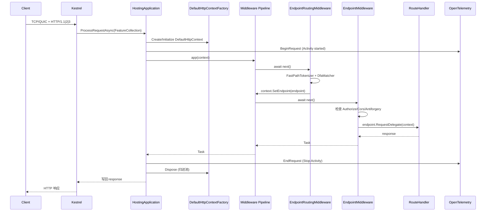

## 7. 演进历史（Time Travel）

ASP.NET Core 的演进可分 4 个时代：

| 时代 | 时间 | 关键节点 |
| --- | --- | --- |
| **重写期** | 2014-2016 | 2014 立项，2016 .NET Core 1.0 RTM：跨平台 + Kestrel + Middleware + DI |
| **特性扩张** | 2017-2019 | 2017 .NET Core 2.0（Span）、2018 2.1（SpaServices / SignalR）、2019 3.0（Blazor Server / gRPC / Worker Service / Endpoint Routing） |
| **统一** | 2020-2021 | 2020 .NET 5 统一（合并 .NET Framework/Core/Mono），2021 .NET 6：Minimal API / Hot Reload / WebApplication / Source Generator |
| **优化** | 2022-2025 | 2022 .NET 7（gRPC JSON transcoding / Rate Limiting）、2023 .NET 8（Native AOT GA）、2024 .NET 9（OpenAPI 内置 / Static SSR）、2025 .NET 10（持续优化） |

**已知重大决策 / RFC**：

- **RFC-001** 2017：Endpoint Routing 取代 RouteCollection
- **RFC-002** 2019：Blazor Server 集成到 ASP.NET Core
- **RFC-003** 2020：WebApplication 统一 IHost + IApplicationBuilder
- **RFC-004** 2021：Minimal API 走 Source Generator
- **RFC-005** 2022：内置 Rate Limiting middleware
- **RFC-006** 2023：Native AOT 设计原则
- **RFC-007** 2024：OpenAPI 内置（`Microsoft.AspNetCore.OpenApi`）

演进时间线（gantt 风格）：

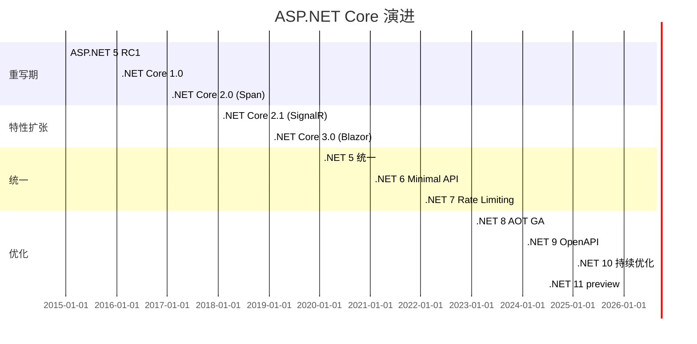

## 8. 质量保障（How It Doesn't Break）

ASP.NET Core 有 **4 道防线**：

1. **单元测试**：每个子项目 `test/` 目录覆盖 80%+ 核心类（`RequestDelegateFactoryTests`、`DfaMatcherTest` 等）。
2. **集成测试**：`FunctionalTests/` + Helix 矩阵（Windows / Linux / macOS × x64 / arm64 × .NET 8/9/10/11）。
3. **代码分析器**：`src/Analyzers/` 自带 Roslyn 分析器，`StartupAnalyzer` 检测"用户写了 `[Authorize]` 但没 `UseAuthorization`"等 30+ 类问题。
4. **微基准**：`src/*/perf/Microbenchmarks/` 含 BenchmarkDotNet，覆盖 `RequestDelegateFactory`、`DfaMatcher`、`HeaderDictionary` 等热点。

`Microsoft.AspNetCore.Analyzers/src/StartupAnalyzer.cs` 是**框架级静态分析**的代表作：用户在 `Program.cs` 写错时**不需要运行**就能拿到 IDE 红线。

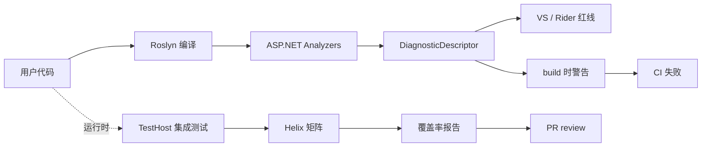

## 9. 生态依赖（Map of the World）

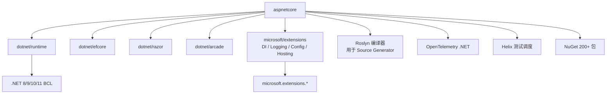

**依赖检查清单**：
- [x] MIT License（`LICENSE.txt`）
- [x] .NET Foundation CLA
- [x] PublicAPI.Shipped.txt 严格控制 API 表面
- [x] `eng/Versions.props` 集中管理依赖
- [x] `GenAPI.exclusions.txt` 自动检查 API diff
- [x] `eng/PoliCheckExclusions.xml` 法律合规审查
- [x] `eng/PostBuild/symbols-validation.ps1` 符号验证

## 10. 生产实践（Battle-Tested）

| 能力 | 实现 | 文件 |
| --- | --- | --- |
| **配置热更新** | `IOptionsMonitor<T>` + `appsettings.{Environment}.json` reloadOnChange | `Hosting/src/StaticWebAssets/`, `Configuration.KeyPerFile/` |
| **优雅停服** | `IHostApplicationLifetime.ApplicationStopping` + Kestrel `IHostedService` 排空 | `Hosting/src/Internal/ApplicationLifetime.cs` |
| **限流** | `Microsoft.AspNetCore.RateLimiting`（.NET 7+）：FixedWindow / SlidingWindow / TokenBucket / Concurrency | `src/RateLimiting/` |
| **链路追踪** | 内置 Activity + DiagnosticSource + EventSource + MeterMetrics，OpenTelemetry SDK 一行接入 | `HostingApplicationDiagnostics` |
| **健康检查** | `Microsoft.AspNetCore.Diagnostics.HealthChecks` + MapHealthChecks | `src/HealthChecks/` |
| **结构化日志** | `ILogger<T>` 默认 JSON 输出 + scopes（TraceIdentifier 自动加入） | `HostingRequestStartingLog` 等 |

运行时架构总览：

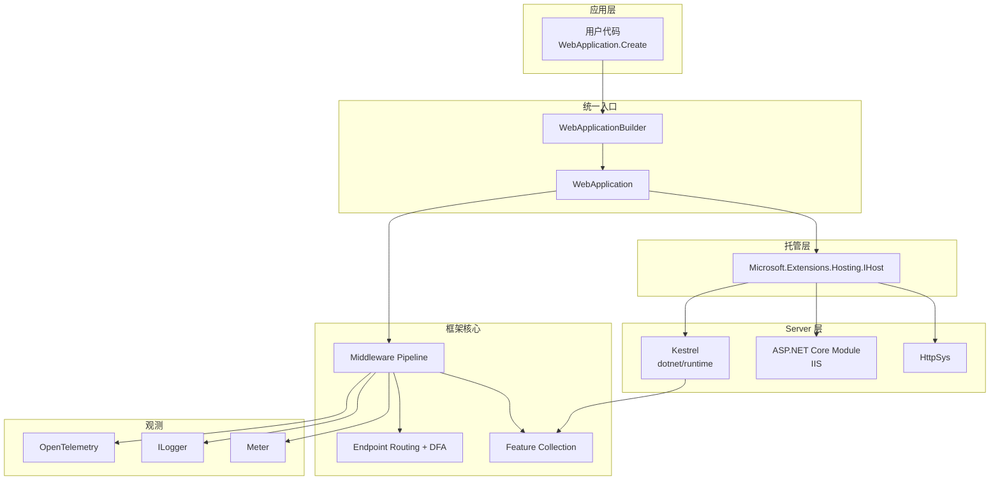

## 11. 社区文化（People & Process）

- **治理**：.NET Foundation 下的 `dotnet/aspnetcore`，由 Microsoft 5-10 个 Architect + 全球 Maintainer 共同决定。
- **维护者**：@davidfowl（联合创始人）、@DamianEdwards、@halter73、@BrennanConroy、@pranavkm、@mitchdenny、@DeagleGross 等。
- **RFC 流程**：`/docs/` 下放设计文档，公开 PR 讨论，`@aspnet` team 投票。
- **沟通渠道**：`live.asp.net` 每周社区 standup（YouTube 直播）、GitHub Discussions、Discord（`#general`）、`@dotnet` Twitter。
- **议题活跃度**：每月 2000+ issue / 500+ PR；`good first issue` + `help wanted` 标签活跃。
- **Triage Process**：`docs/TriageProcess.md` 公开的"问题分流"机制，`area-*` 标签路由到子团队。
- **CNCF/Foundation**：.NET Foundation 成员，非 CNCF。

## 12. 教训总结（What To Steal / What To Avoid）

### 12.1 必偷 3 件

1. **Feature Collection + DI 配合**：Server 实现 Feature、中间件依赖 Feature 接口，**完美解耦协议差异**。任何跨平台 / 多后端项目都该学。
2. **Source Generator + Expression Tree 双路兜底**：AOT 优先走源生成器，老路径走 Expression Tree。**渐进式现代化**的典范。
3. **HostingApplication + IHttpContextFactory + Pool**：标准化的"协议层 + 工厂 + 池"三件套，是高并发 GC 优化的金标准。

### 12.2 必避 3 坑

1. **不要在中间件里 `new HttpContext()`**：必须从 `HttpContextFactory` 借，否则池化失效，GC 飙升。
2. **不要忘记 `await next()`**：中间件不调用 next 就会"截断管道"，下游中间件不执行。编译器无法检测——只有测试。
3. **不要在 `Build()` 之后修改 `Services`**：DI 容器已经冻结，运行时改注册不会生效（除非用 `IServiceCollection.Clone()`）。

### 12.3 7 天复刻路线图

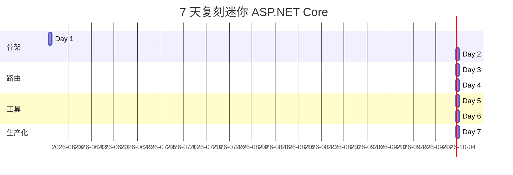

### 12.4 打分卡

| 维度 | 分数（5 分制） | 评语 |
| --- | --- | --- |
| 文档质量 | 4.5 | `docs/` 详尽，但 `learn.microsoft.com` 与源码容易脱节 |
| 一致性 | 4.0 | 命名规范偶有历史包袱（HttpContext vs IHttpContextFactory） |
| 测试覆盖 | 4.5 | Helix 矩阵 + FunctionalTests + Analyzers 三件套 |
| 性能 | 5.0 | Native AOT + DFA + Source Generator 是行业天花板 |
| 可扩展性 | 5.0 | Middleware / Feature / SourceGen 三轴都能扩展 |
| 上手成本 | 3.5 | 概念多（IHost / IApplicationBuilder / IEndpointRouteBuilder） |
| 创新性 | 5.0 | Source Generator + Endpoint Routing + DFA 是教科书级创新 |

## 13. 学习萃取（Cheat Sheet）

**一句话价值**：ASP.NET Core 用"中间件管道 + Endpoint 路由 + Feature Collection + Source Generator"四件套，证明了**托管型 Web 框架也能做到比手写 Socket 接近的性能**，同时维持 10 年之久的优雅分层。

**3 个核心洞察**：

1. **"Pipeline 是数据，不是代码"**：`ApplicationBuilder._components` 是 `List<Func<RequestDelegate, RequestDelegate>>`，把"中间件"抽象成数据，**让 Build/Inspect/HotReload 都成为可能**。
2. **"DFA + IL Emit" 是路由性能的本质**：把路由表编译成"按段长分桶 + uint64 比较"的 IL 注入代码，运行时零分配，**比正则 / 字典快 5-10 倍**。
3. **"Source Generator 是 .NET 6 之后的反射杀手"**：minimal API / OpenApi / Endpoint Filter / Endpoint Form 全都用源生成器消除反射，**启动期 0 reflection、0 trim warning**。

**5 段必读代码**：

1. `src/Http/Http/src/Builder/ApplicationBuilder.cs:164-201` — `Build()` 的反向 for 循环
2. `src/Http/Http/src/DefaultHttpContext.cs:36-99` — `FeatureReferences` 缓存 + 池化生命周期
3. `src/Hosting/Hosting/src/Internal/HostingApplication.cs:50-126` — `CreateContext` + `DisposeContext` 池化握手
4. `src/Http/Routing/src/Matching/DfaMatcher.cs:32-83` — `stackalloc + ref readonly` fast path
5. `src/Http/Http.Extensions/gen/Microsoft.AspNetCore.Http.RequestDelegateGenerator/RequestDelegateGenerator.cs:13-61` — 增量源生成器 4 步流水线

**1 个反模式**：`HttpContext.Items["__AuthMiddlewareInvokedKey"]`——`HttpContext.Items` 是 `IDictionary<object, object?>`，每次访问都装箱/哈希。性能敏感路径应避免，但作为"中间件之间的轻量握手"可接受。

**1 个可复用模式**：**"Abstract T → 特化实现"**（`IHttpContextFactory` 抽象 + `DefaultHttpContextFactory` 特化）。在 `HostingApplication.CreateContext` 里用 `if (factory is DefaultHttpContextFactory) ... else ...` 走特化快路径，**100% 兼容 + 90% 性能**。

**3 个立刻能用**：

1. **用 `WebApplication.CreateBuilder(args).Build()` 启动**——永远不要手撸 `Host.CreateDefaultBuilder`。
2. **用 `app.MapGet("/api/{id:int}", handler)` 注册端点**——编译器 + Source Generator 帮你做 80% 的反射消除。
3. **用 `app.UseExceptionHandler()` + `app.UseStatusCodePages()` 兜底**——比 try/catch 优雅得多。

## 14. 项目特点速查

**独特看点**：
- **.NET 官方维护**——与运行时同源代码同步发版
- **Native AOT 友好**——.NET 8 起最小 API 可发布为单文件 ~30MB
- **内置 OpenAPI**——.NET 9 起 `Microsoft.AspNetCore.OpenApi` 一行 `AddOpenApi()` 搞定
- **Hot Reload**——`dotnet watch` 改 C# 立即生效（.NET 6+）
- **gRPC JSON Transcoding**——同一服务同时支持 gRPC 和 HTTP/JSON
- **Blazor**——C# 写前端（Server / WebAssembly / Auto 三种托管模型）

**与同类对比**（quadrantChart）：

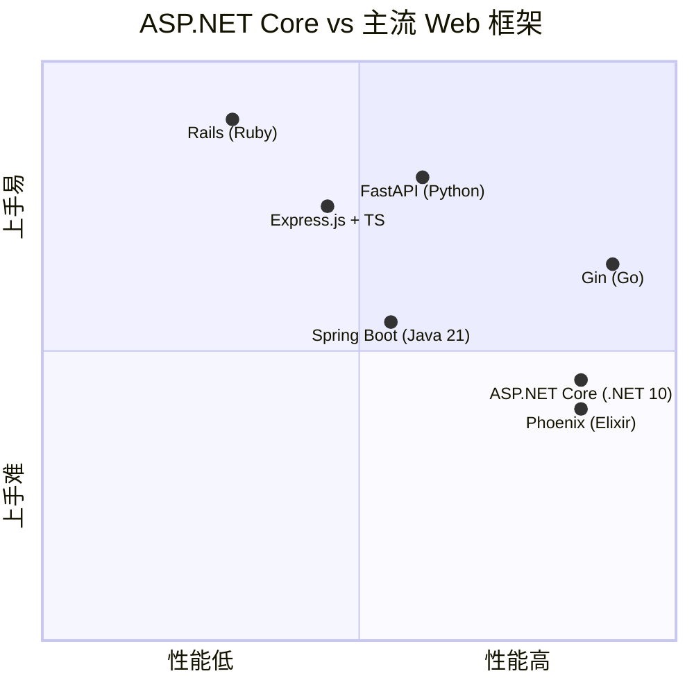

状态机（HttpContext 池化）：

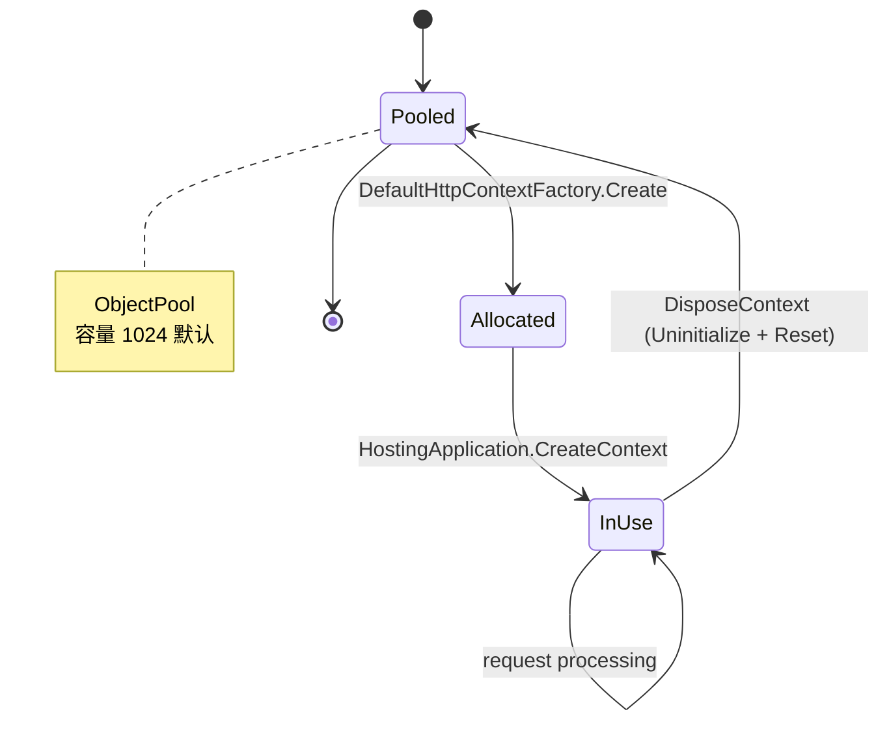

类图（HttpContext 特征）：

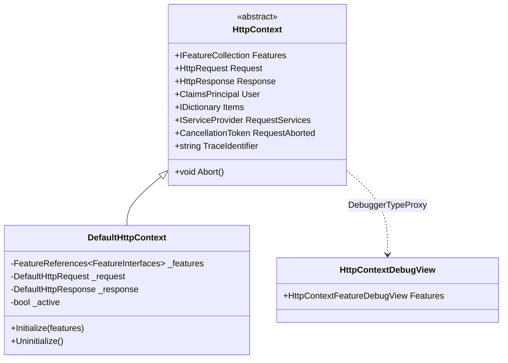

数据模型（Endpoint 元数据）：

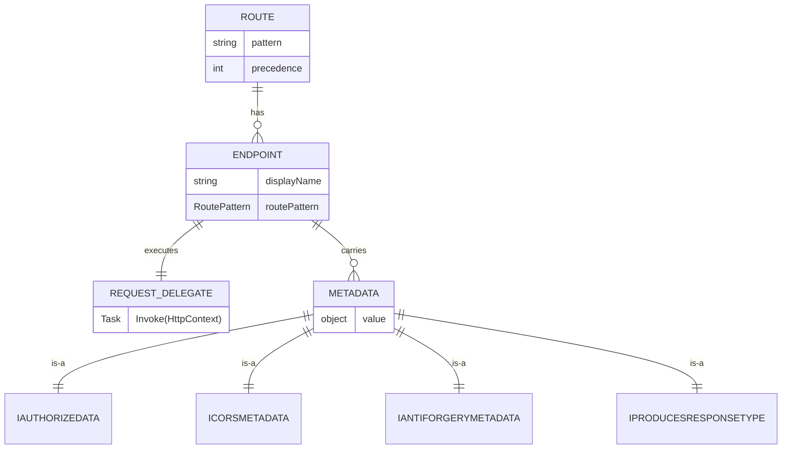

## 附：仓库元信息

| 字段 | 值 |
| --- | --- |
| 路径 | `G:\实战案例\GitHub顶尖项目\aspnetcore\` |
| 仓库 | github.com/dotnet/aspnetcore |
| 大小 | 约 1.5 GB（含 SDK、tests、docs） |
| 总 C# 文件 | 7,754（src/） |
| 总文件数 | 11,914（根 inspect） |
| 解析时间 | 2026-06-02 |
| 锁定 SDK | `11.0.100-preview.5.26227.104`（global.json） |
| 关键 NuGet | 200+ `Microsoft.AspNetCore.*` |
| 主要 CI | Azure Pipelines + Helix 矩阵 |

## 一句话总结

**ASP.NET Core = 中间件管道（ApplicationBuilder 反向 for） + 端点路由（DFA + IL Emit trie） + 抽象上下文（Feature Collection + ObjectPool） + 编译期代码生成（RequestDelegateGenerator）**——四个齿轮在 13 年的迭代里磨合得严丝合缝，是工业级框架设计的范本。**复刻 = 抄骨架 7 天，配 30 天完善 4 道防线，再投 90 天进入"生产可用"。**
