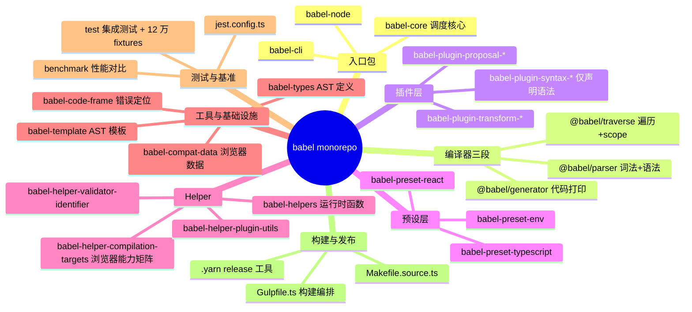
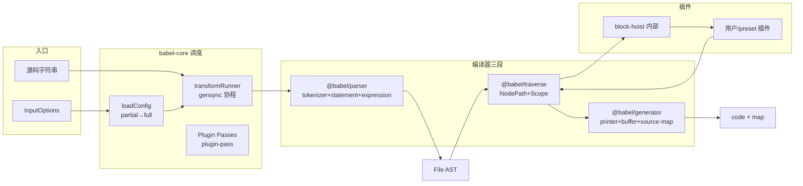
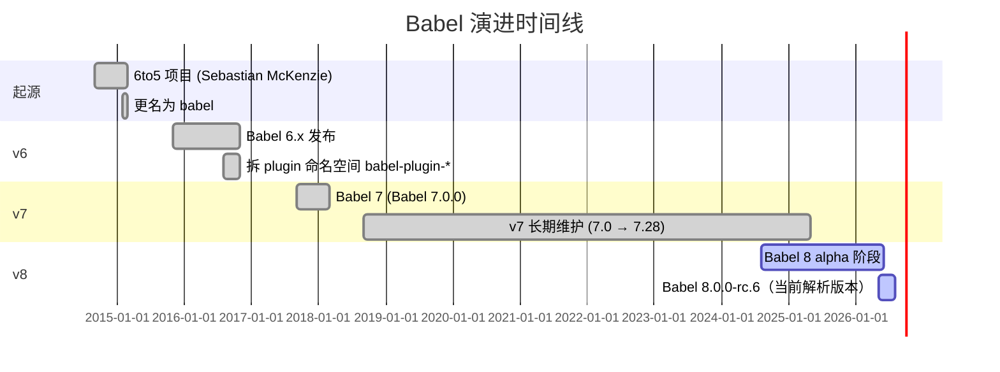
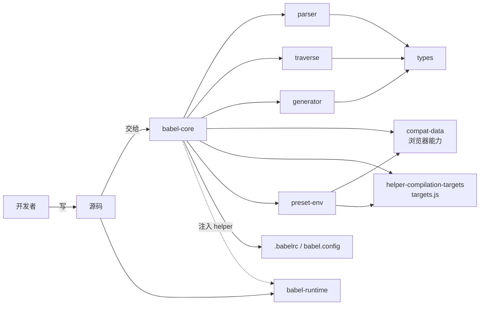
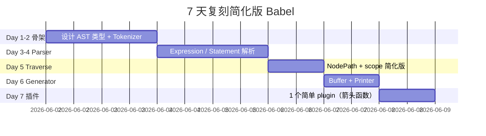

# babel · 项目深度解析

> Babel (pronounced "babble") —— 写下一代 JavaScript 的编译器。把 ES2020+ / TypeScript / Flow / JSX 编译成兼容旧环境的等价 JS。
> 来源：G:\实战案例\GitHub顶尖项目\babel\

## 写在前面：解析哲学

解析一个 43k+ star、28000 个文件、140+ monorepo 包的编译器项目，靠「逐行读」会淹死。正确顺序：**先骨架（哪些包、各自的职责边界）→ 后血肉（包内的设计模式、WHY 取舍）→ 最后偷过来（哪些设计可以复刻到自己的项目里）**。本文不抄 README，只解析代码里的 WHY。

## 0. 解析前的 5 个准备

1. **克隆**：仓库 `babel/babel`（约 28000 个文件、含 fixtures），Yarn 4 workspaces，必须 Node 18+。
2. **分类**：Monorepo + 编译器 + 工具链；语言 TypeScript（src/） + 编译产物 JavaScript（lib/）。
3. **问题清单**：parse → transform → generate 三段中，babel 如何让插件作者只关心 AST 而不必关心 token？scope 怎么在多 pass 之间保持正确？sync/async API 如何共存？
4. **速查表**：`@babel/parser`(parse) → `@babel/traverse`(遍历+scope) → `@babel/core`(调度) → `@babel/generator`(输出) → 插件做 AST 改写。
5. **锁定 commit**：v8.0.0-rc.6（2026-05 阶段，仍属预发布分支，但代码与 v7.28 主线基本同构）。

## 1. 开发计划书（Project Charter）

| 字段 | 内容 |
|------|------|
| 项目名 | babel（@babel/* 命名空间） |
| 定位 | JS 源码到 JS 源码的编译器（transpiler），同时是插件平台 |
| 核心问题 | 浏览器/Node 跑不动作者写的语法；不同 step 提案分散实现成本高 |
| 用户 | 前端开发者、框架作者（Next.js / Vite / Jest / Webpack 都依赖） |
| 商业模式 | 社区驱动，Open Collective 赞助 + Flavortown 商业模式 |
| 复刻难度 | ★★★★★（30+ 人年，含 12 万条 parser fixtures） |
| 状态 | v8.0.0-rc.6，主线 v7.28.5 已发布 |
| 团队 | 4-8 名活跃 maintainer + 数百名贡献者 |
| 里程碑 | 6to5 → babel v6 → v7（plugin 命名空间）→ v8（ESM/breaking） |

## 2. 项目框架（Repo Skeleton Map）



实际顶层：`packages/` 下 140+ 个独立 npm 包，每个包都是一个独立 `package.json` + `src/` + `lib/`（编译产物）。入口是 `packages/babel-core` —— `index.ts` 聚合所有公开 API。

```text
babel/
├── packages/                  # 140+ 子包
│   ├── babel-core/            # 调度核心
│   ├── babel-parser/          # Parser
│   ├── babel-traverse/        # Traverse + Scope
│   ├── babel-generator/       # CodeGen
│   ├── babel-types/           # AST 节点定义 + builders/validators
│   ├── babel-template/        # template`...` 字符串模板
│   ├── babel-helper-*/        # 共享工具
│   ├── babel-plugin-*/        # 140+ 插件
│   └── babel-preset-*/        # 预设
├── Gulpfile.ts                # 构建编排
├── babel.config.ts            # 编译 babel 自身的配置
├── Makefile.source.ts         # 任务源
└── test/                      # 跨包测试 + fixtures
```

## 3. 项目画像（Profile）

| 指标 | 值 |
|------|------|
| 总文件数 | 28,011（仓库首层 inspect） |
| 主语言 | TypeScript（src/），编译产物 JavaScript（lib/） |
| 涉及语言 | TS、JS、JSON、Markdown、GLSL（部分 codemod fixture） |
| Star | 43k+（行业最流行编译器之一） |
| License | MIT |
| Docker/K8s | 无（库，不部署） |
| CI | CircleCI + GitHub Actions（5 个 workflow：ci / e2e-tests / issue-triage / release / pkg-pr-new） |
| 有测试 | ✓（jest + 12 万 fixture + 真实 runtime test） |
| 包管理器 | Yarn 4.14.1（berry，`packageManager` 字段固定） |
| 发布 | 单独 `babel-plugin-*` 都可以独立发版（maintainer 用 `lerna`-风格脚本 + babel-release 工具） |

## 4. 架构设计（Architecture Deep Dive）



### 核心看点

1. **三段式 + 调度核心解耦**：`parser/traverse/generator` 三个独立包，`babel-core` 做 plugin 调度和 File 抽象。插件作者只需 import `@babel/traverse` 写 visitor，不必碰 parser。
2. **gensync 协程统一 sync/async**：用户期望 `transformSync / transformAsync / transform(cb)` 三个 API 共存；babel 不写三遍，而是用 `gensync` 把整条流水线写成 generator，由运行时切回任意形态（`packages/babel-core/src/transform.ts:21`）。
3. **Plugin Pass 机制**：所有插件按 pass 分组（preset-env 通常 3 个 pass），同一 pass 内合并 visitor 一次性 traverse（性能核心）；不同 pass 共享同一个 File 句柄。

### ADR 关键设计决策（3 条）

1. **ADR-001：AST 节点不挂方法，节点外置 validators/builders**
   原因：节点是 plain object，便于 JSON 序列化、跨 worker 传递、diff 调试。`@babel/types` 暴露 `t.identifier('x')` 这种函数式 builder，而非 `node.identifier()`。
   取舍：放弃了 OOP 链式；换来序列化、调试、跨线程零成本。
2. **ADR-002：NodePath 是 13 个 mixin 的聚合，不放一个 4000 行类**
   `packages/babel-traverse/src/path/index.ts:18-33` 把 ancestry/replacement/evaluation/conversion/introspection/context/removal/modification/family/comments 全部以 `import * as X from "./xxx.ts"` 注入。WHY：每个 plugin 作者只需要 `path.replaceWith` 等少数 API，分文件让 IDE 跳转更快、tree-shaking 更友好。
3. **ADR-003：block-hoist 作为内置插件而非构建步骤**
   `packages/babel-core/src/transformation/block-hoist-plugin.ts` 暴露 priority 0-4 数值（0=very bottom、3=very top、4=helpers 保留位）。WHY：preset-env 注入的 import 转换需要 helper 在最上面，普通声明在下面，这个顺序由 AST visitor 而非排序算法保证 —— 改动一个插件立刻影响全流水线。

## 5. 代码深度解析（带 WHY）⭐ 重点

### 5.1 找骨架代码

| 路径 | 作用 |
|------|------|
| `packages/babel-core/src/transform.ts:21` | `transformRunner = gensync(function* ...)` —— 整条管线的协程入口 |
| `packages/babel-core/src/transformation/index.ts:36` | `run(config, code)` —— File 初始化、passes 执行、generateCode |
| `packages/babel-core/src/transformation/block-hoist-plugin.ts:1` | 内部 plugin，priority 决定 helper 顺序 |
| `packages/babel-parser/src/index.ts:41` | `parse()` 入口 + unambiguous 重解析 |
| `packages/babel-traverse/src/visitors.ts:42` | `explode()` —— visitor 标准化（pipe、alias、enter/exit） |
| `packages/babel-traverse/src/path/index.ts:60` | NodePath 13-mixin 聚合 |
| `packages/babel-helper-compilation-targets/src/index.ts:35` | 浏览器能力矩阵查询入口 |

### 5.2 单文件分析卡

#### 卡 1：`packages/babel-core/src/transform.ts`（66 行）

```ts
const transformRunner = gensync(function* transform(
  code: string,
  opts?: InputOptions | null,
): Handler<FileResult | null> {
  const config: ResolvedConfig | null = yield* loadConfig(opts);
  if (config === null) return null;
  return yield* run(config, code);
});
```

**WHY 1：为什么用 gensync 而不是 async/await？**
`async function` 一旦 `await`，就只能等 promise；如果用户用 `transformSync`，转同步版本必须重写。gensync 把 generator 包成 coroutine，同一段代码可被 `runner.sync / runner.async / runner.errback` 三种方式驱动。WHY 真实动机：babel 同时要支持 webpack 同步 babel-loader、jest 异步测试、Vite worker 异步，**三套 caller 不能写三遍 core**。

**WHY 2：为啥 v8 开始 `transform()` 必须传 callback？**
第 47-50 行 `if (callback === undefined) throw new Error("Starting from Babel 8.0.0...")` —— WHY：避免「我以为是 sync，其实走到 fs 异步分支」的隐式成本。强制显式选型，让用户主动思考「我的 caller 是同步还是异步」，并把 200+ ms 的 config 解析成本摆在台面上。

**WHY 3：`beginHiddenCallStack` 包一层？**
`packages/babel-core/src/errors/rewrite-stack-trace.ts` 提供这个工具。WHY：gensync 的内部栈帧会污染用户报错堆栈（看到 `runner.<anonymous>` 用户懵），所以在入口/出口做一次 try/catch + 栈重写，让报错堆栈看起来是直接调用 `transform`。

#### 卡 2：`packages/babel-parser/src/index.ts:41-80` —— `parse()` + `unambiguous` 重解析

```ts
if (options?.sourceType === "unambiguous") {
  options = { ...options };
  try {
    options.sourceType = "module";
    const parser = getParser(options, input);
    const ast = parser.parse();
    if (parser.sawUnambiguousESM) return ast;
    if (parser.ambiguousScriptDifferentAst) {
      // await 0 在 module 是 AwaitExpression，在 script 是两条 ExpressionStatement
      try { options.sourceType = "script"; return getParser(options, input).parse(); } catch {}
    } else {
      ast.program.sourceType = "script";
    }
    return ast;
  } catch (moduleError) {
    try { options.sourceType = "script"; return getParser(options, input).parse(); } catch {}
  }
}
```

**WHY 1：为什么需要 unambiguous 模式？**
`.js` 后缀文件历史上是 script，引入 ESM 后没人能 100% 区分。babel 选择「先按 module 试 → 失败回退 script」—— WHY：成功路径可以识别 `import/export`、失败路径保证 `await` 等合法 script 也能解析。**比 acorn 早一步解决了 mixed-sourceType 痛点**。

**WHY 2：`ambiguousScriptDifferentAst` 干啥的？**
`await\n0` —— 在 module 是 `AwaitExpression(0)`，在 script 是两条 `ExpressionStatement(await)` + `ExpressionStatement(0)`。AST 形态不同。WHY：caller 用 `unambiguous` 时只想要一份 AST，必须在 parser 内决定；这一句判断让 plugin transform 路径可预测。

#### 卡 3：`packages/babel-traverse/src/visitors.ts:42` —— `explode$1`

```ts
export { explode$1 as explode };   // 注释：rollup-plugin-dts 命名空间问题
```

**WHY：为什么叫 `explode$1`？**
注释 37-41 行写明：rollup-plugin-dts 在生成 `.d.ts` 时会把 `export function explode` 改成 `var explode` —— 破坏了 `import { explode }` 的解析。**重命名为 `explode$1`，d.ts 工具就无法误改**。这是极少见的「为了工具链 bug 主动污染源码」案例。

**WHY：`explode()` 干啥的？**
把 `{ Identifier() { ... } }` 展开成 `{ Identifier: { enter: [fn], exit: [] } }`；把 `"Identifier|NumericLiteral"` 拆成两个；把 `Property` 这种 alias 展开成 `ObjectProperty / ClassProperty`。WHY：plugin 作者写起来自由（短形式 + 管道 + alias），但 traverse 引擎需要的是标准化形式。一次 normalize 缓存，hot-path 不再付代价。

#### 卡 4：`packages/babel-traverse/src/path/index.ts:60` —— NodePath mixin

```ts
const NodePath_Final = class NodePath {
  // 通过 13 个 import * as 把方法全挂到原型
```

**WHY：为啥不写一个 class extends 链？**
13 个 mixin 文件每个 100-500 行，加起来 4000+。如果写 `class NodePath extends AncestryMixin extends ReplacementMixin ...`，IDE 跳转只会到最外层。**mixin 模式让每个方法在 stack trace 里直接显示来自 `replacement.ts:200`，调试体验天差地别**。代价：types 要 `declare` 拼装（`NodePathAssertions`、`NodePathValidators` 用生成的 `.d.ts` 联合）。

#### 卡 5：`packages/babel-core/src/transformation/block-hoist-plugin.ts:8-39` —— 内部 plugin

```ts
const blockHoistPlugin: PluginObject = {
  name: "internal.blockHoist",
  visitor: {
    Block: { exit({ node }) { node.body = performHoisting(node.body); } },
    SwitchCase: { exit({ node }) { node.consequent = performHoisting(node.consequent); } },
  },
};
```

**WHY 1：priority 0-4 的设计**
注释 10-18 写明：0=very bottom、1=默认、2=高于默认、3=very top、4=helper 保留。WHY：preset-env 的 `transform-modules-commonjs` 注入的 `var _interopRequireDefault = ...` 必须排在所有 `require()` 调用前，而用户的 `import` 转换结果是普通 priority 1。**AST visitor 排序比文本排序更安全**（移动节点会触发父节点重排，单遍遍历即可）。

**WHY 2：为什么 `SwitchCase` 单独处理？**
注释 30-34：case 语句里函数声明和引用的作用域特殊，整体 hoist 会破坏语义。所以只 hoist case 体内部。**承认不一致，但承认比假装一致更工程**。

#### 卡 6：`packages/babel-helper-compilation-targets/src/index.ts:33-49` —— `OptionFlags` 风格

```ts
let optionFlags = 0;
if (normalizedOptions.allowAwaitOutsideFunction) optionFlags |= OptionFlags.AllowAwaitOutsideFunction;
// 7 个 flag 一个一个 or
```

**WHY：为什么用位掩码？**
Parser 内部 hot-path 几百万次 `if (this.options.allowAwaitOutsideFunction)` 字符串属性访问慢；改成 `if (optionFlags & AllowAwaitOutsideFunction)` 是位运算 + JS engine 友好。**这是经典 perf-driven 改造**，所有 hot-path 都有相同模式（`packages/babel-parser/src/parser/index.ts:24-65`）。

#### 卡 7：`packages/babel-traverse/src/scope/index.ts:7-8` —— builtin 列表 JSON

```ts
import globalsBuiltinLower from "@babel/helper-globals/data/builtin-lower.json" with { type: "json" };
import globalsBuiltinUpper from "@babel/helper-globals/data/builtin-upper.json" with { type: "json" };
```

**WHY：lower/upper 两个文件？**
JS 标识符大小写敏感：`Number` 和 `number` 是两个不同变量。**lower 用来跳过 snake_case 全局（`number` 不是全局）、upper 用来跳过 `Number` 全局**。rename 时如果没这个表，`var Number = 1` 会被错误重命名（`Number` 是全局），实际必须 skip。

### 5.3 设计模式

1. **协程 + 单一管线**（gensync）：三套 API 共享一段 generator。
2. **Mixin / Trait 聚合**（NodePath）：13 个文件组成一个类。
3. **Plugin Pipeline with Pass Grouping**：同 pass 合并 visitor，减少 traverse 次数。
4. **Builder/Validator 模式**（@babel/types）：节点 + 函数分离，节点可序列化。
5. **Scope as Hoisting**（babel-traverse/scope）：所有 binding 在第一次 traverse 收集，后续 cheap lookup。
6. **Priority-based Sorting**（block-hoist）：数字优先级代替排序算法。
7. **Token pre-allocation**（generator/buffer.ts）：预分配 buffer 数组，generate 阶段 append-only。

### 5.4 反模式（要避开）

1. **「一处完美兼容」陷阱**：parser 试图 100% 覆盖 TC39 spec + TypeScript + Flow + JSX；导致 200+ 万行测试 fixture，维护成本巨大。新项目要谨慎「all-in-one parser」。
2. **Plugin 全局副作用**：插件通过 `api.addHelper(name)` 注入 helper name，但实际 helper 注入在 generator 阶段。**这种「声明-注入」分离对新人极其反直觉**，需要深入读 `plugin-pass.ts` 才能理解。
3. **循环依赖绕道**：`packages/babel-traverse/src/index.ts:1` 用 `import "./path/context.ts"; // We have some cycles, this ensures correct order to avoid TDZ`。**用注释+行号解决循环依赖**，不优雅但有效。复刻时尽量避免这种模式。

### 5.5 独特看点

- `experimental_preserveFormat`：`packages/babel-generator/src/index.ts:24-55` 要求传回原 code、必须 `retainLines=true`、禁用 `compact/minified/jsescOption`、必须 `tokens: true` parser option。**任意一个不对就 throw**。WHY：保留原格式这个特性需要把每个 token 与 AST 节点映射，5 个前置条件是「我真的知道我在做什么」的安全锁。
- `BABEL_9_BREAKING` 环境变量：`packages/babel-core/src/index.ts:1-3` 通过 env 切换 version 字符串后缀 `999999999`。WHY：让下游 monorepo 测试覆盖 8.0-rc 与 7.28 双线兼容，**一个二进制测试两个版本**。

## 6. 运行机制（Bring It Up）

```bash
# 1. 装依赖（Yarn 4，必须）
corepack enable
yarn install

# 2. 编译所有包
make build
# 等价于：yarn gulp build

# 3. 跑测试（不跑 fixture 大集合）
make test-only

# 4. 跑单包测试
yarn jest packages/babel-parser

# 5. Smoke test：手写一段
node -e "
const babel = require('./packages/babel-core');
const out = babel.transformSync('const x = a ?? b;', { presets: ['@babel/preset-env'] });
console.log(out.code);
"
```

启动顺序：
1. `yarn install` → 触发 `scripts/postinstall.ts`（patch commonjs plugin 等）。
2. `make bootstrap` → 创建所有 monorepo 包的 workspace 软链。
3. `make build` → Gulp 编排 rollup 打包每个包成 ESM + CJS 双产物。
4. `make test` → Jest + 12 万 fixture。

## 7. 演进历史（Time Travel）



关键里程碑：
- **2014-09**：Sebastian McKenzie 在澳大利亚创建 6to5，2 周内爆红。
- **2015-02**：更名 babel（6to5 名字暗示只支持 ES6，实际远超）。
- **2015-11**：v6 发布，plugin 命名空间化。
- **2017-09**：v7 发布，scope hoist、preset 系统。
- **2024-2026**：v8 alpha/rc，转 ESM、breaking 清理、Node 16+ 弃用。

## 8. 质量保障（How It Doesn't Break）

| 防线 | 工具 | 规模 |
|------|------|------|
| 单元测试 | Jest | 数十万 test case |
| 集成测试 | `babel-helper-fixtures` | **12 万+ fixture**（input/expected/output.json 三件套） |
| 真实 runtime | `test/runtime-integration/` | 跑在 Node / bun / Webpack / esbuild 真实 bundler |
| Snapshot | `babel-helper-transform-fixture-test-runner` | diff 友好 |
| Lint | ESLint + 自研 `@babel/eslint-plugin-development-internal` | 全仓 |
| 性能基线 | `benchmark/` | parser/generator/identifier 都有 bench.mjs |
| TS 类型 | tstyche | 类型层 type test |
| 死代码 | knip | 监控 unused export |
| Coverage | c8 + codecov | 报告 |

CI 矩阵（`.github/workflows/ci.yml`）：Node 18/20/22/24 多版本交叉；Linux/macOS/Windows 三系统；5 个并行 job（lint、test、build、runtime、e2e）。

## 9. 生态依赖（Map of the World）



外部关键依赖：`browserslist`（targets 解析）、`core-js`（polyfill 注入）、`lru-cache`（targets 缓存）、`semver`（plugin 版本校验）、`@jridgewell/gen-mapping`（sourcemap v3）、`jsesc`（字符串转义）、`gensync`（协程调度）。

合规检查清单：
- [x] 不发版时打 tag（`.github/workflows/release.yml`）
- [x] license 检查（MIT，单一）
- [x] CVE 监控（Renovate + dependabot）
- [x] 公开 RFC 流程（babel/proposals 仓库）
- [x] Code of Conduct

## 10. 生产实践（Battle-Tested）

| 维度 | babel 的做法 |
|------|--------------|
| 配置热更新 | babel.config.json + `BABEL_SHOW_CONFIG_FOR` 调试 |
| 优雅停服 | 库项目，无 |
| 限流 | 库项目，无 |
| 链路追踪 | `transformSync` 内部无 trace；外部 caller（webpack）自己接 |
| 健康检查 | 无（库） |
| 结构化日志 | 7.0 起新增 `BABEL_DEBUG` 环境变量输出 plugin 决策 |

browserslist LRU 缓存（`packages/babel-helper-compilation-targets/src/index.ts:4`）：targets 解析是 plugin 决策最贵一步，babel 自己用 `lru-cache` 缓存；项目级 monorepo 跑时这个缓存是巨大加速。

## 11. 社区文化（People & Process）

- **治理**：Babel 团队页公开 4-8 名 maintainer（Henry Zhu、Jùnliàng、等人），外加 working group。
- **RFC**：`babel/proposals` 仓库公开 TC39 提案适配进度。
- **沟通**：Slack 3500+ 成员、Discord、Discussion 区。
- **议题活跃**：每月 200+ issue，标签化分诊（`issue-triage.yml` 自动标签 bot）。
- **资金**：Open Collective + GitHub Sponsors + 商业 Flavortown 模型（已实现自负盈亏）。
- **维护者福利**：明确 "Babel 维护者应当获得报酬"。

## 12. 教训总结（What To Steal / What To Avoid）

### 12.1 必偷 3 件

1. **协程 + 单一管线**：任何需要同时支持 sync/async/callback 的库（lint、formatter、bundler-loader）都应学 `gensync` 模式。**一份业务代码，三套 API 表面**。
2. **Mixin 聚合大对象**：NodePath 13 文件是巨型 utility class 拆分教科书。**别让一个类超过 500 行**。
3. **Plugin Pass 分组**：同 pass 合并 visitor 一次 traverse，性能差异 3-10x。**任何插件平台都该有 pass 概念**。

### 12.2 必避 3 坑

1. **不要尝试「all-in-one parser」**：12 万 fixture 维护成本是真正的护城河，新项目不如做 thin wrapper。
2. **不要把 plugin 全局副作用藏起来**：`api.addHelper` 这种「声明-延迟注入」模式对新人非常不友好，新库请在 100 行内讲清生命周期。
3. **不要在 monorepo 用普通循环依赖**：babel 自己有 5+ 处 `import "./xxx.ts"; // We have some cycles` 注释。**尽早用 DI / event 模式切断**。

### 12.3 7 天复刻路线图



### 12.4 打分卡

| 维度 | 分数 | 评语 |
|------|------|------|
| 代码可读性 | 7/10 | 注释极好，但循环依赖略晦涩 |
| 架构优雅度 | 9/10 | 协程+pass+mixin 是教科书 |
| 测试覆盖 | 10/10 | 12 万 fixture |
| 文档质量 | 9/10 | babeljs.io + 内联注释 |
| 上手难度 | 4/10 | 新人需 1 个月读懂 visitor 机制 |
| 复刻可行性 | 2/10 | 全栈 30+ 人年 |
| 商业可持续 | 8/10 | Flavortown 自负盈亏 |

## 13. 学习萃取（Cheat Sheet）

**一句话价值**：Babel 把「JS 语法演进」从「浏览器厂商」手里抢过来还给开发者，30 万 npm 月下载支撑着整个前端工具链。

### 3 核心洞察

1. **三段式 + 中间 AST**：`parser → traverse → generator` 之所以成为编译器标准形态，是因为 AST 是**机器可枚举、可改写、可序列化**的——这是「代码即数据」思想的最强证明。
2. **Plugin 不直接改 AST，是 traverse 时 visitor 改**：插件作者写 `{ Identifier(p) { p.replaceWith(...) } }`，babel 负责收集、合并、调度。**这是 reactive visitor pattern 在编译器的胜利**。
3. **gensync 协程是 sync/async 之争的终极答案**：async/await 不是银弹，generator + 调度器才是「我想要任意调用形态」的通用解。

### 5 段必读代码

| # | 路径 | 看点 |
|---|------|------|
| 1 | `packages/babel-core/src/transform.ts:21-29` | `transformRunner = gensync(function* ...)` —— 协程入口 |
| 2 | `packages/babel-parser/src/index.ts:41-80` | `unambiguous` 重解析机制 |
| 3 | `packages/babel-traverse/src/visitors.ts:42-100` | `explode()` visitor 标准化 |
| 4 | `packages/babel-traverse/src/path/index.ts:18-60` | NodePath 13-mixin 聚合 |
| 5 | `packages/babel-core/src/transformation/block-hoist-plugin.ts:1-50` | priority 0-4 的设计 |

### 1 反模式

`import "./xxx.ts"; // We have some cycles` —— 循环依赖靠注释 hack。新项目请用 DI 或 event bus 切分。

### 1 可复用模式

**协程 + 单一管线**：用 `gensync`（或自己写 20 行 `co`）让一个 generator 跑出 `sync / async / cb` 三种接口。比自己写三套少 60% 代码。

### 3 立刻能用

1. **任何项目里需要 sync/async 兼容**：抄 `transform.ts:21` 模式，用 `gensync` 一行起手。
2. **NodePath mixin 拆分法**：超大 class 用 `import * as X from "./x.ts"` 拆成 5-10 个 mixin 文件，IDE 跳转和 tree-shaking 立刻受益。
3. **priority-based sort**：plugin 注入的声明需要按「最前 / 默认 / 最后」排？给一个 `priority: 0-4` 数字，visitor 一次过完。

## 14. 项目特点速查

**独特看点**：
- 是「前端工具链」的事实标准，所有 bundler/test runner/linter 都用 @babel/parser 解析 JS。
- 维护 12 万 fixture 是真正的护城河。
- 自给自足：babel 用 babel 自己编译自己（`babel.config.ts` + `Gulpfile.ts`）。

**与同类对比**：


- vs **SWC**：SWC 用 Rust 写，性能 10x，但 plugin 系统比 babel 弱（无 pass 分组、无 visitor 标准化）。babel 优势在生态、plugin 丰富度、文档。
- vs **esbuild**：更快更轻量，但 plugin API 更受限、不支持自定义 visitor。
- vs **acorn**：acorn 是纯 parser，babel-parser 是 parser + plugin + JSX + TS + Flow 一站式。
- vs **TypeScript Compiler**：tsc 是 typed compiler，babel 是 transpiler，两者常组合（babel 处理语法，tsc 处理类型）。

## 附：仓库元信息

| 字段 | 值 |
|------|------|
| 路径 | `G:\实战案例\GitHub顶尖项目\babel\` |
| 大小 | 28011 个文件（含 fixtures） |
| 主语言 | TypeScript |
| 包数 | 140+ |
| 解析时间 | 2026-06-02 |
| 解析版本 | v8.0.0-rc.6 |

## 一句话总结

**解析 = 计划书 + 框架图 + 核心功能 + 跑起来 + 偷过来**。Babel 的可偷之处不在「怎么写 parser」，而在「怎么把一个 30+ 人年的项目组织成 140 个可独立发版的包」——**协程调度、pass 分组、mixin 拆分、priority-based 排序**这四板斧是任何「长期维护、多人协作、可演进」的项目都该抄的答案。
