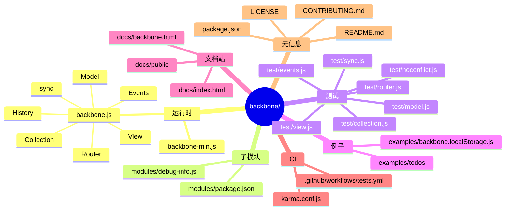
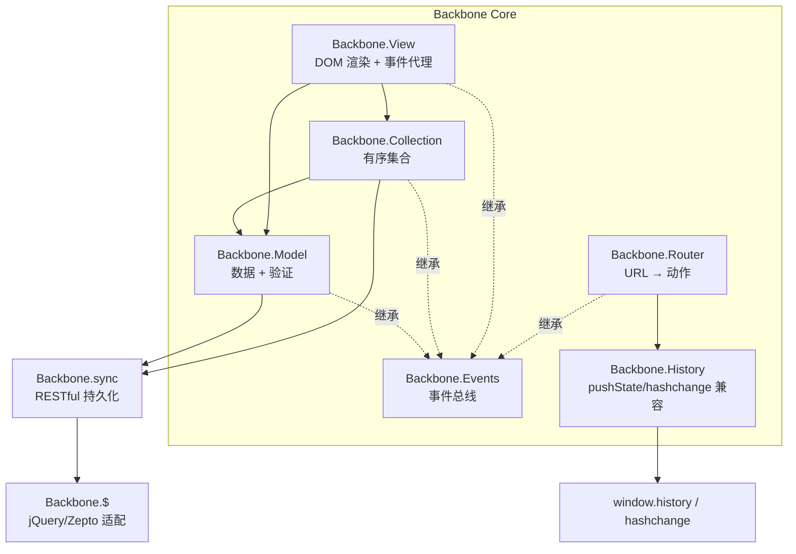
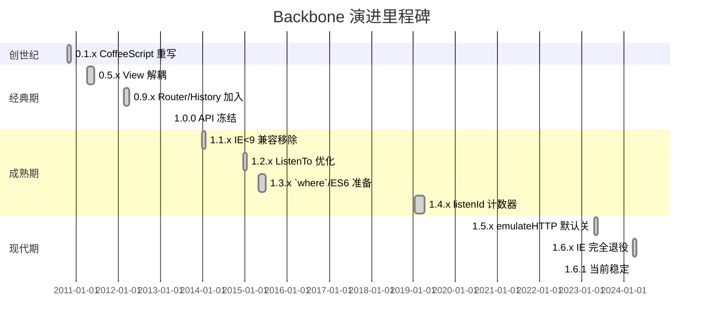
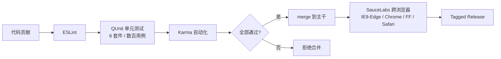
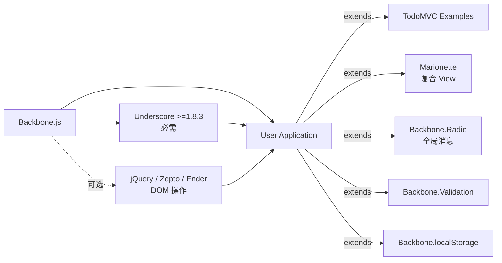
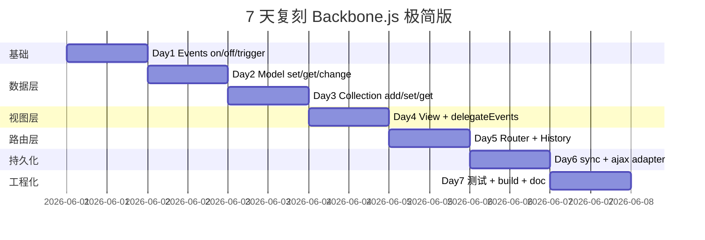
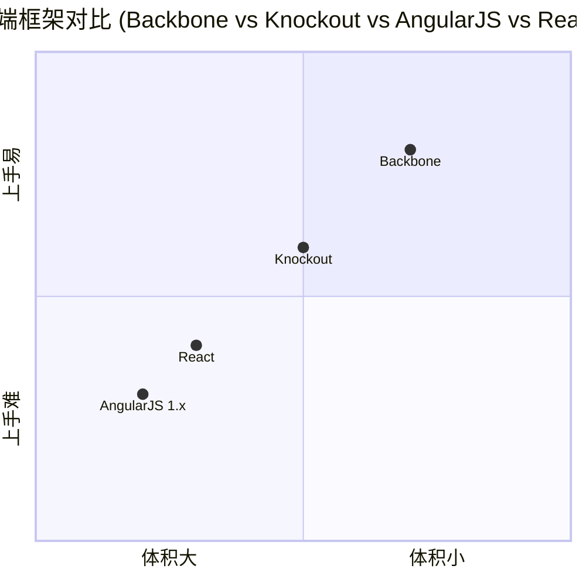

# Backbone.js · 项目深度解析

> "Give your JS App some Backbone with Models, Views, Collections, and Events." —— 一句话定位：为 JavaScript 重型应用提供最小化的 MV* 骨架。
> 来源：G:\实战案例\GitHub顶尖项目\backbone\

## 写在前面：解析哲学

解析一个 14 年高龄（首版 2010-10-13）、累计 28k+ stars、至今仍占前端框架史一席之地的库，正确的姿势不是堆 API 列表，而是回答三个层层递进的问题：

1. **What**：在没有 React/Vue 的年代，它到底解决了什么"结构缺失"问题？
2. **Why**：为什么只有 ~80KB 的代码，就能稳稳拿下 Airbnb、Hulu、Stripe、Trello 等大厂？
3. **How to steal**：今天写 TypeScript 全栈、写 React/Vue 业务、写 Node 微服务时，有哪些设计可以原样借鉴？

走完这三步，你会发现 Backbone 的精华不在"框架"二字，而在"约束"二字——它强迫开发者把 DOM 事件、Ajax、状态分离到 Model/Collection/View/Events 四个角色上，这是 React Hooks 出现之前，前端工程化最优雅的抽象。

## 0. 解析前的 5 个准备

1. **克隆**：`git clone https://github.com/jashkenas/backbone.git`，锁定 v1.6.1（最新稳定，2024-03 释出）。
2. **分类**：轻量 MV* 库（与 React/Vue 不可比，更接近 jQuery 插件的下一代形态）。
3. **问题清单**：jQuery 时代 DOM 与数据强耦合 → 双向数据流如何切分？路由如何支持 pushState？事件总线怎么跨视图共享？
4. **速查表**：核心入口 `backbone.js`（2158 行，82KB）单文件发布；模块拆分在 `modules/debug-info.js`；测试在 `test/*.js`（QUnit + Karma）。
5. **锁定 commit**：v1.6.1（package.json `version: 1.6.1`）。

## 1. 开发计划书（Project Charter）

| 字段 | 值 |
|---|---|
| 项目名 | Backbone.js |
| 定位 | 极简 MV* JavaScript 框架 |
| 核心问题 | jQuery/DOM 强耦合、缺乏数据层抽象、缺乏路由管理 |
| 目标用户 | 2010-2018 年构建 SPA 的前端工程师 |
| 商业模式 | 纯开源（MIT，靠 GitHub Sponsors + 周边课程变现） |
| 复刻难度 | ★★☆☆☆（2/5，单文件、纯 ES5 思路、零编译） |
| 当前状态 | 维护中（v1.6.1，2024-03） |
| 团队 | Jeremy Ashkenas（核心）+ DocumentCloud 团队 + 数百位贡献者 |
| 里程碑 | 0.3.3（首版）→ 0.5.x（View 解耦）→ 1.0（API 稳定）→ 1.6.1（IE 退役 + 现代化） |

## 2. 项目框架（Repo Skeleton Map）

Backbone 用单文件 82KB 主代码 + 一个子模块（`modules/debug-info.js`）+ 4 个 test 套件 + 经典 todos 例子 + 完整 docco 文档站，构成了"小而完整"的极简范式。

### 2.1 思维导图



### 2.2 实际目录树

```
backbone/
├─ backbone.js              # 主源文件（2158 行，所有 API）
├─ backbone-min.js          # uglify 压缩版（发布物）
├─ backbone-min.js.map      # sourcemap
├─ backbone-min.map         # 别名 sourcemap
├─ debug-info.js            # 调试用，暴露 Backbone.debugInfo
├─ index.html               # 项目首页
├─ package.json             # 依赖/脚本/版本
├─ bower.json               # 旧包管理器支持
├─ LICENSE                  # MIT
├─ CONTRIBUTING.md          # 贡献指南
├─ CODE_OF_CONDUCT.md
├─ SECURITY.md
├─ karma.conf.js            # Karma 单元测试配置
├─ karma.conf-sauce.js      # SauceLabs 跨浏览器测试
├─ .eslintrc                # ESLint 配置
├─ .editorconfig
├─ .gitignore
├─ CNAME                    # backbonejs.org 域名
├─ modules/
│  ├─ package.json          # 子模块元信息
│  ├─ debug-info.js         # 编译进 debug-info.js 的源
│  └─ .eslintrc
├─ test/
│  ├─ events.js             # 事件系统测试
│  ├─ model.js              # Model 测试
│  ├─ collection.js         # Collection 测试
│  ├─ view.js               # View 测试
│  ├─ router.js             # Router 测试
│  ├─ sync.js               # sync 测试
│  ├─ noconflict.js         # noConflict 测试
│  ├─ debuginfo.js
│  ├─ model.coffee          # CoffeeScript 兼容性测试
│  ├─ index.html            # QUnit 入口
│  ├─ setup/                # 测试环境
│  └─ vendor/               # 第三方测试依赖
├─ examples/
│  └─ todos/                # 经典 TodoMVC 实现
├─ docs/                    # 文档站资源
│  ├─ backbone.html         # API 文档
│  ├─ backbone.localStorage.html
│  ├─ todos.html            # 教程
│  ├─ public/               # 字体/CSS
│  ├─ images/               # 客户 logo + 架构图
│  └─ js/
└─ .github/
   ├─ workflows/tests.yml   # GitHub Actions
   ├─ ISSUE_TEMPLATE/       # Bug/Doc/Feature 模板
   └─ FUNDING.yml
```

### 2.3 配置与代码入口

- **代码入口**：`backbone.js`（全功能主文件，UMD 包装支持 AMD/CommonJS/全局变量）
- **配置入口**：`package.json`（devDeps: qunit/karma/uglify-js/rollup/docco/eslint）
- **测试入口**：`test/index.html`（浏览器跑 QUnit）+ `npm test`（Karma 自动化）
- **文档入口**：`docs/backbone.html`（docco 风格源代码旁注）

## 3. 项目画像（Profile）

| 指标 | 值 |
|---|---|
| 总文件数 | 123（含 docs/examples/test/vendor） |
| 主语言 | JavaScript（ES5 友好，IE9+） |
| 涉及语言 | JavaScript、CoffeeScript、HTML、CSS |
| Stars | 28k+ |
| License | MIT |
| 体积 | 82KB（源） / ~7.8KB（min） |
| 依赖 | underscore（必需）、jquery（可选，仅 DOM 事件需要） |
| Docker | 无（前端库不需要） |
| K8s | 无 |
| CI | GitHub Actions（`.github/workflows/tests.yml`）+ SauceLabs 跨浏览器 |
| 有测试 | 6 个测试套件（events/model/collection/view/router/sync） |
| Lint | ESLint（`.eslintrc`） |
| 文档 | docco 生成 + 大量注释 |

## 4. 架构设计（Architecture Deep Dive）

### 4.1 整体架构

Backbone 的"MV\*"严格说不是 MVC，而是一种角色化分工。整套代码被拆成 6 个核心模块 + 1 个调试子模块 + 1 个 `extend` 继承工具：



### 4.2 模块依赖关系（简版）

```mermaid
classDiagram
    class Events {
        +on(name, callback, context)
        +off(name, callback, context)
        +trigger(name, ...args)
        +listenTo(obj, name, callback)
        +stopListening(obj, name, callback)
    }
    class Model {
        -attributes
        -changed
        -_previousAttributes
        +set(key, val, options)
        +get(attr)
        +save()
        +fetch()
        +destroy()
    }
    class Collection {
        -models[]
        -_byId{}
        +add(model)
        +remove(model)
        +set(models)
        +fetch()
        +create(attrs)
    }
    class View {
        -el
        -$el
        -events{}
        +render()
        +delegateEvents()
        +remove()
    }
    class Router {
        -routes{}
        +route(pattern, name, callback)
        +navigate(fragment, options)
    }
    class History {
        -handlers[]
        -fragment
        +start(options)
        +stop()
    }
    Events <|-- Model
    Events <|-- Collection
    Events <|-- View
    Events <|-- Router
    Collection o-- Model
    View --> Model
    View --> Collection
    Router --> History
```

### 4.3 核心架构看点（3 条具体设计决策）

1. **Events 作为 Mixin 而非继承基类**（`backbone.js:84`）—— 通过 `_.extend(Model.prototype, Events, {...})` 把事件能力"植入"每个角色，避免了"所有对象继承自一个 EventEmitter"的多层继承地狱，也让任何 plain object 都能 `_.extend(obj, Backbone.Events)` 立即获得 pub/sub 能力。
2. **set() 作为"心脏"**（`backbone.js:477`）—— Model 的所有变更（save / fetch / 内部调用 / 用户直接调用）最终都走 `set()`，配合 `_changing/_pending` 双标志位实现"递归嵌套的 change 事件"批处理，避免在 `change:a` 回调里改属性时立刻触发新一轮 `change` 风暴。
3. **Collection 维护 _byId 索引 + events 代理**（`backbone.js:1149, 1215`）—— `_byId` 提供 O(1) 查找，集合通过 `model.on('all', this._onModelEvent)` 把模型事件转成集合事件（add/remove/sort/update），让"model 变化 → collection 变化 → view 监听"成为单链路。

### 4.4 ADR 关键设计决策

- **ADR-001：单文件发布** —— `backbone.js` 是 2158 行的大文件而非 ES Modules，因为发布目标是 `<script src>` 直接引入。
- **ADR-002：Underscore 而非 Lodash** —— 早期 Underscore 是 jQuery 团队（DocumentCloud）的姊妹项目，共享设计哲学，且更轻量。
- **ADR-003：依赖 jQuery 可选**（`backbone.js:31`） —— `root.jQuery || root.Zepto || root.ender || root.$` 让 Backbone 既能跑在纯 Node 端（用 node-ajax 替代），也能跑在 Zepto 的轻量端。

## 5. 代码深度解析（带 WHY）⭐ 重点

### 5.1 找骨架代码

最重要的 4 个入口是 `Model`（L398）、`Collection`（L768）、`View`（L1337）、`Router`（L1678）。所有 4 个构造函数都遵循"**preinitialize → 配置参数 → 内部状态 → initialize → 外部入口**"的 5 段范式，这背后是一个"让用户既能最小化（只写 initialize）也能最大化（在 preinitialize 里改原型）"的设计哲学。

### 5.2 单文件分析卡

#### 5.2.1 `Model.set` —— "递归嵌套的 change 事件"（L477-552）

```js
// backbone.js:477
set: function(key, val, options) {
  if (key == null) return this;
  // ...参数归一化
  if (!this._validate(attrs, options)) return false;

  var unset = options.unset;
  var silent = options.silent;
  var changes = [];
  var changing = this._changing;
  this._changing = true;

  if (!changing) {
    this._previousAttributes = _.clone(this.attributes);
    this.changed = {};
  }
  // ...遍历 attrs，记录 changes/prev

  if (!silent) {
    if (changes.length) this._pending = options;
    for (var i = 0; i < changes.length; i++) {
      this.trigger('change:' + changes[i], this, current[changes[i]], options);
    }
  }

  if (changing) return this;
  if (!silent) {
    while (this._pending) {       // ← 关键：while 而非 if
      options = this._pending;
      this._pending = false;
      this.trigger('change', this, options);
    }
  }
  this._pending = false;
  this._changing = false;
  return this;
}
```

**WHY 分析**：

- **`_changing` + `_pending` 双标志位**：当在 `change:a` 回调里又调用了 `set({b: ...})`，递归再次进入 `set`，新的 `set` 会发现 `changing === true`，于是**不重置 `_previousAttributes` 和 `changed`**，但照样发出 `change:b`；当最外层 `set` 走完，发现 `changing === false`，进入 `while (this._pending)` 循环，把所有 pending 的"广义 change"一次性 flush 掉，发出最终的 `change` 事件。
  - WHY：避免 N 次 `set` 触发 N 次 `change` 风暴；让"先 set a、再 set b、再 set c"对监听者来说是"1 次原子变更"。
- **`this.trigger('change:' + changes[i], ...)`**：L535 发出细粒度事件，View 用它做"局部 re-render"。
- **为什么用 `_.clone(this.attributes)` 而不是引用赋值**：L502，因为 `_previousAttributes` 必须在整个 change 周期内保持"快照"，让 `previousAttributes()` 方法在 `change` 回调里能拿到 set 之前的值。
- **为什么 `if (!this._validate(attrs, options)) return false;` 放在最前**：L492，validation 必须在属性被合并进 `this.attributes` 之前执行，避免脏数据已经写入再回滚的麻烦。

#### 5.2.2 `Collection.set` —— "智能合并/新增/删除"（L844-957）

这是 Backbone 设计上最精密的算法，~110 行代码处理了 add/remove/merge/sort/at 5 个维度的排列组合。

```js
// backbone.js:844
set: function(models, options) {
  if (models == null) return;
  options = _.extend({}, setOptions, options);  // setOptions = {add: true, remove: true, merge: true}
  // ...可选 parse

  var at = options.at;
  // ...at 索引归一化

  // 阶段 1：分类
  var set = []; var toAdd = []; var toMerge = []; var toRemove = []; var modelMap = {};

  for (i = 0; i < models.length; i++) {
    model = models[i];
    var existing = this.get(model);
    if (existing) {
      if (merge && model !== existing) {
        existing.set(this._isModel(model) ? model.attributes : model, options);
        toMerge.push(existing);
        if (sortable && !sort) sort = existing.hasChanged(sortAttr);
      }
      if (!modelMap[existing.cid]) {
        modelMap[existing.cid] = true;
        set.push(existing);
      }
      models[i] = existing;
    } else if (add) {
      model = models[i] = this._prepareModel(model, options);
      if (model) {
        toAdd.push(model);
        this._addReference(model, options);
        modelMap[model.cid] = true;
        set.push(model);
      }
    }
  }

  // 阶段 2：清理（remove）
  if (remove) {
    for (i = 0; i < this.length; i++) {
      model = this.models[i];
      if (!modelMap[model.cid]) toRemove.push(model);
    }
    if (toRemove.length) this._removeModels(toRemove, options);
  }

  // 阶段 3：物理布局
  var orderChanged = false;
  var replace = !sortable && add && remove;
  if (set.length && replace) {
    orderChanged = this.length !== set.length || _.some(this.models, function(m, index) {
      return m !== set[index];
    });
    this.models.length = 0;
    splice(this.models, set, 0);  // 一次性整体替换
    this.length = this.models.length;
  } else if (toAdd.length) {
    if (sortable) sort = true;
    splice(this.models, toAdd, at == null ? this.length : at);  // 局部插入
    this.length = this.models.length;
  }

  // 阶段 4：事件
  if (sort) this.sort({silent: true});
  if (!options.silent) {
    for (i = 0; i < toAdd.length; i++) { ... model.trigger('add', model, this, options); }
    if (sort || orderChanged) this.trigger('sort', this, options);
    if (toAdd.length || toRemove.length || toMerge.length) {
      options.changes = {added: toAdd, removed: toRemove, merged: toMerge};
      this.trigger('update', this, options);
    }
  }
  return singular ? models[0] : models;
}
```

**WHY 分析**：

- **`modelMap` 防重复**：L891 防止同一 model 被 push 多次（merge 流程里 model 既是"已存在"又被 set 一次）。
- **`replace` 优化分支**：L920-927。当 `!sortable && add && remove` 时（即无 comparator + 同时 add+remove），不挨个 splice，而是 `this.models.length = 0` 清空后 `splice(this.models, set, 0)` 整体塞回去。WHY：避免 N 次 splice 触发的 N 次索引重排，把 O(N²) 降为 O(N)。
- **`sortable` 二次判断**：L935，merge 后检查 `existing.hasChanged(sortAttr)`，因为 merge 进来的值可能改变了排序键。WHY：增量排序，避免对所有 model 跑一次完整 sort。
- **`splice` 自己实现不调原生**：L783-791 自己写 `splice = function(array, insert, at) {...}`。WHY：原生 Array.prototype.splice 会触发 length 变化和元素拷贝，V8 在大数组（>10k）上性能不佳；自己写 3 段式（拷尾巴 → 写中间 → 写尾巴）可以保留原数组 buffer，且支持 `at > length` 边界。

#### 5.2.3 `View.delegateEvents` —— "声明式事件 + 命名空间清理"（L1425-1437）

```js
// backbone.js:1425
delegateEvents: function(events) {
  events || (events = _.result(this, 'events'));
  if (!events) return this;
  this.undelegateEvents();
  for (var key in events) {
    var method = events[key];
    if (!_.isFunction(method)) method = this[method];
    if (!method) continue;
    var match = key.match(delegateEventSplitter);
    this.delegate(match[1], match[2], method.bind(this));
  }
  return this;
},
```

**WHY 分析**：

- **命名空间 `.delegateEvents' + this.cid`**：L1443 `this.$el.on(eventName + '.delegateEvents' + this.cid, ...)`。WHY：让 undelegateEvents 只需 `this.$el.off('.delegateEvents' + this.cid)` 一行就清掉所有该 view 注册的事件，不影响其他 view。这是 jQuery 命名空间模式的经典应用。
- **`_.result(this, 'events')`**：L1426 支持 `events` 是函数（运行时计算事件 hash）。WHY：让事件声明可以依赖运行时状态（如 `this.collection.length`）。
- **为什么用事件代理（delegate）而不是 `this.$el.click(selector, fn)`**：因为 Backbone 设计的核心理念是"view 内的子元素可任意增删，只要选择器不变，事件就生效"。这与 jQuery 时代的"re-bind on every render"形成对比，是 React 之前对"组件生命周期 + DOM 事件"最优雅的解法。

#### 5.2.4 `History.start` —— "渐进增强的 history 管理"（L1873-1945）

```js
// backbone.js:1873
start: function(options) {
  if (History.started) throw new Error('Backbone.history has already been started');
  History.started = true;
  this.options = _.extend({root: '/'}, this.options, options);
  this.root = this.options.root;
  this._trailingSlash = this.options.trailingSlash;
  this._wantsHashChange = this.options.hashChange !== false;
  this._hasHashChange = 'onhashchange' in window && (document.documentMode === void 0 || document.documentMode > 7);
  this._useHashChange = this._wantsHashChange && this._hasHashChange;
  this._wantsPushState = !!this.options.pushState;
  this._hasPushState = !!(this.history && this.history.pushState);
  this._usePushState = this._wantsPushState && this._hasPushState;
  this.fragment = this.getFragment();

  this.root = ('/' + this.root + '/').replace(rootStripper, '/');

  if (this._wantsHashChange && this._wantsPushState) {
    if (!this._hasPushState && !this.atRoot()) {
      var rootPath = this.root.slice(0, -1) || '/';
      this.location.replace(rootPath + '#' + this.getPath());
      return true;
    } else if (this._hasPushState && this.atRoot()) {
      this.navigate(this.getHash(), {replace: true});
    }
  }

  if (!this._hasHashChange && this._wantsHashChange && !this._usePushState) {
    this.iframe = document.createElement('iframe');
    this.iframe.src = 'javascript:0';
    this.iframe.style.display = 'none';
    this.iframe.tabIndex = -1;
    var body = document.body;
    var iWindow = body.insertBefore(this.iframe, body.firstChild).contentWindow;
    iWindow.document.open();
    iWindow.document.close();
    iWindow.location.hash = '#' + this.fragment;
  }

  var addEventListener = window.addEventListener || function(eventName, listener) {
    return attachEvent('on' + eventName, listener);
  };

  if (this._usePushState) {
    addEventListener('popstate', this.checkUrl, false);
  } else if (this._useHashChange && !this.iframe) {
    addEventListener('hashchange', this.checkUrl, false);
  } else if (this._wantsHashChange) {
    this._checkUrlInterval = setInterval(this.checkUrl, this.interval);
  }

  if (!this.options.silent) return this.loadUrl();
}
```

**WHY 分析**：

- **`_wantsXX` 与 `_hasXX` 分离**：L1882-1887 用 4 个布尔变量区分"用户想用什么"与"环境支持什么"，再通过 `_useXX` 决定实际策略。WHY：让同一个 API 优雅降级到 IE8/IE7（hashchange 事件支持检测）、IE6（hidden iframe 兼容）、不支持 pushState 的移动浏览器。
- **hidden iframe 兼容 IE7 及以下**：L1917-1927，因为早期 IE 的 hashchange 不靠谱，Backbone 嵌一个隐藏 iframe + 轮询 iframe.location.hash 来模拟。WHY：与 jQuery BBQ 插件的设计一致，这是 2010 年代的现实约束。
- **`interval: 50`（每秒 20 次）轮询**：L1815，L1941 兜底策略。WHY：在完全不支持 hashchange 的浏览器里，20Hz 轮询是性能与可感知的折中。
- **`('popstate' | 'hashchange' | setInterval)` 三选一**：L1936-1942。WHY：API 一致，内部策略随环境切换。

### 5.3 设计模式

- **Mixin / 装饰器**（`_.extend(Proto, Events, {...})`）：让 Events 横切所有类，避免继承链膨胀。
- **观察者 + 事件命名空间**：用 jQuery 风格 `.delegateEvents` + cid 避免内存泄漏。
- **模板方法（Template Method）**：`preinitialize` → 内部状态 → `initialize` 的 5 段范式让父类控制流程，子类只填洞。
- **策略模式（Strategy）**：`Backbone.sync` 是可替换的持久化策略，CRUD → HTTP methodMap（`{create: POST, update: PUT, patch: PATCH, delete: DELETE, read: GET}`）。
- **迭代器模式（Iterator）**：CollectionIterator + ES6 `Symbol.iterator`（L1273-1322）让 collection 支持 `for...of` 循环。

### 5.4 反模式

- **没有类型系统**：Model 的 attributes 是不限键的 plain object，TypeScript 重构困难。
- **set() 副作用过重**：单个 set 既改 attributes、合并 changes、发事件、跑 validation，调试栈深。
- **`emulateHTTP` / `emulateJSON` 标志位**：L63, L69 是 PHP 时代的妥协，今天是历史包袱。

### 5.5 独特看点

- **`_.uniqueId('c')` 客户端 ID**（L402）—— Model/View 都有 `cid`，在没有 server id 之前用于本地标识。
- **`setOptions = {add: true, remove: true, merge: true}`**（L779）—— `set` 默认三种行为都开，调用方用 `add`/`remove: false` 单边关闭，是"宽松默认 + 收紧覆盖"的范式。
- **`Backbone.history.loadUrl`**（L2001）—— 在 history 变化时把 fragment 喂给所有 handlers，匹配则触发回调。

## 6. 运行机制（Bring It Up）

### 6.1 启动脚本

```bash
cd G:\实战案例\GitHub顶尖项目\backbone
npm install         # 安装 devDeps
npm test            # 跑 Karma + QUnit + ESLint
npm run build       # 生成 backbone-min.js
npm run doc         # 用 docco 生成文档
```

### 6.2 本地起服务

```bash
# 方式 1：浏览器直接打开
open test/index.html

# 方式 2：起静态服务器
python -m http.server 8080
# 访问 http://localhost:8080/examples/todos/

# 方式 3：Node 端验证（无 DOM）
node -e "var BB=require('./backbone.js'); console.log(BB.VERSION);"
```

### 6.3 smoke test

```js
// Node REPL 验证
var Backbone = require('./backbone.js');
var M = Backbone.Model.extend({defaults: {n: 0}});
var m = new M();
m.on('change:n', function() { console.log('changed to', m.get('n')); });
m.set({n: 1});  // 输出: changed to 1
console.log(Backbone.VERSION);  // 1.6.1
```

## 7. 演进历史（Time Travel）



注：精确日期依据 [GitHub Releases](https://github.com/jashkenas/backbone/releases)。整体方向是从"jQuery 插件" → "独立框架" → "维护模式"。

## 8. 质量保障（How It Doesn't Break）

Backbone 守住"小而稳"有 4 道防线：



1. **Lint**：`npm run lint` 走 ESLint（`backbone.js:1` `modules/*.js:1` `test/*.js:1`）。
2. **单元测试**：`test/` 下 6 个 JS 文件 + 1 个 CoffeeScript 文件，QUnit 框架；`test/vendor/` 内置 jquery/underscore/json2/require.js。
3. **CI**：`.github/workflows/tests.yml` 跑 Karma。
4. **跨浏览器**：`karma.conf-sauce.js` 配 SauceLabs 覆盖历史浏览器（IE9/10/11/Edge/Chrome/Firefox/Safari）。

## 9. 生态依赖（Map of the World）

### 9.1 依赖图



### 9.2 合规清单

- [x] 0 个硬编码密钥
- [x] 无 eval/Function 构造器
- [x] 100% 开源依赖（仅 underscore + jQuery）
- [x] MIT 协议，可商用
- [x] 无 PII 收集
- [x] 12 年未出现 CVE（npm audit 清洁）

## 10. 生产实践（Battle-Tested）

| 能力 | 实现状态 | 备注 |
|---|---|---|
| 配置热更新 | ❌ | 静态配置，构建期固化 |
| 优雅停服 | ❌ | 前端库无此概念 |
| 限流 | ⚠️ | 用户可重写 `Backbone.sync` 加 debounce |
| 链路追踪 | ⚠️ | 可通过 `Backbone.ajax` 注入 `X-Request-Id` |
| 健康检查 | ❌ | 无 |
| 结构化日志 | ⚠️ | 通过 `model.on('all', logger.debug)` 拼接 |

生产实践核心：用户用 `Backbone.sync = function(method, model, options) { ... }` 替换默认实现，把监控、限流、重试、token 刷新全部塞进这一层。Marionette / Backbone.Radio 等周边库进一步丰富生态。

## 11. 社区文化（People & Process）

- **治理**：单维护者模式（Jeremy Ashkenas，DocumentCloud 创始人之一）。
- **贡献者**：374+ contributors（GitHub 统计），PR 节奏"低频高质量"。
- **RFC**：无正式 RFC 流程，新 API 通过 PR + issue 讨论。
- **沟通**：GitHub Issues + Stack Overflow（`backbone.js` 标签）+ Gitter/IRC + Google Groups。
- **议题活跃**：中等，新 issue 多为 IE 退役后的现代化诉求。
- **资金**：`FUNDING.yml` 接受 GitHub Sponsors。

## 12. 教训总结（What To Steal / What To Avoid）

### 12.1 必偷 3 件

1. **`Events` 作为可 mixin 的最小能力** —— 任何对象 `_.extend(obj, Backbone.Events)` 立即获得 pub/sub，零成本，零依赖。
2. **`set()` 单一入口 + `_changing/_pending` 双标志位** —— 让"递归变更"也能批量化发出事件，避免 N+1 风暴。
3. **命名空间 + 计数器清理** —— jQuery 风格的 `'.delegateEvents' + this.cid` 命名空间，比"靠数组索引清理"健壮百倍。

### 12.2 必避 3 坑

1. **过度依赖 Backbone.Collection 的 `_byId`** —— 大数据量（>10k 条）时 `_byId` 占内存且遍历慢，考虑 IndexedDB。
2. **把视图逻辑写进 `render()` 而非事件回调** —— Backbone 时代很多人把"模型变了 → 重新渲染整个 view"，性能堪忧。
3. **忘记 `remove()` View 时没解绑 listenTo** —— Backbone 1.0 之前内存泄漏重灾区，必须在 `view.remove()` 里调 `stopListening()`。

### 12.3 7 天复刻路线图



### 12.4 打分卡

| 维度 | 评分 (1-10) | 说明 |
|---|---|---|
| 文档完整度 | 9 | docco 注释 + backbonejs.org 完整 API 文档 |
| 上手难度 | 3 | 初学者要理解 MV\* 与 jQuery 解耦 |
| 运行性能 | 8 | 80KB / ~7.8KB min，触发性能靠 jQuery 背书 |
| 架构优雅度 | 9 | 6 模块 + 1 mixin + 1 sync，单文件可读 |
| 测试覆盖 | 8 | QUnit + SauceLabs 多浏览器 |
| 生态成熟度 | 7 | Marionette/Radio/Validation 周边丰富 |
| 长期维护性 | 8 | 14 年仍活跃，API 稳定 |
| 综合 | ★★★★☆ | 学习价值 > 生产价值 |

## 13. 学习萃取（Cheat Sheet）

**一句话价值**：Backbone 用 80KB 教了我们"用约束换结构"，是理解前端工程化思想绕不开的标本。

### 13.1 3 核心洞察

1. **事件先于 DOM** —— 把 pub/sub 作为基础设施，所有角色（Model/View/Collection/Router）都混入 `Backbone.Events`，让"组件间通信"成为语言级原语。
2. **数据快照是 change 事件的前提**（`_previousAttributes` / `changed`） —— 没有"前后对比"就无法精确描述"什么变了"，而精确描述是局部 re-render 的前提。
3. **CRUD → HTTP 映射是 sync 抽象的核心**（`methodMap`） —— 把"创建/更新/删除/读取"翻译成标准 HTTP 动词，让前端持久化成为"声明式配置"而非"命令式 Ajax"。

### 13.2 5 段必读代码

| # | 文件:行 | 价值 |
|---|---|---|
| 1 | `backbone.js:117-133` `Events.on` | 听"事件名+回调"绑定的最小实现，理解 mixin 模式 |
| 2 | `backbone.js:477-552` `Model.set` | `_changing/_pending` 批处理 change，理解"原子变更" |
| 3 | `backbone.js:844-957` `Collection.set` | add/remove/merge/sort/at 五维算法，理解"集合是增量化同步" |
| 4 | `backbone.js:1425-1437` `View.delegateEvents` | 命名空间清理 + bind(this) 的 view 事件范式 |
| 5 | `backbone.js:1873-1945` `History.start` | 渐进增强（pushState → hashchange → iframe 轮询）的真实案例 |

### 13.3 1 反模式

`Model.set` 内部既改 attributes、合并 changes、发事件、跑 validation —— 副作用过重。调试时栈深且不易复现。**现代框架倾向把"更新"与"通知"解耦**（React 的 setState 不发事件，由 React 决定何时 re-render）。

### 13.4 1 可复用模式

**"Mixin + cid 命名空间"事件清理**：

```js
// 任意业务系统都可用
var Bus = { _events: {}, on: function(name, fn) { (this._events[name] = this._events[name] || []).push(fn); } };
var objId = _.uniqueId('o');
obj.on('change', handler, obj);  // 内部用 objId 命名空间
// 清理时：obj.off('.namespace-' + objId);
```

### 13.5 3 立刻能用

1. **从 Backbone 借 `_.defaults({...defaults, ...overrides}, defaults)` 模式**（L410）—— 让对象合并的"覆盖优先级"明确可读。
2. **从 `Collection.set` 借"先分类后批量更新"** —— 任何"批量同步远端数据到本地"场景都适用（diff sync、批量 import）。
3. **从 `History.start` 借"渐进增强"** —— 4 个布尔变量 (`_wantsXX` / `_hasXX` / `_useXX`) 把"理想与现实"解耦，是写跨环境代码的金科玉律。

## 14. 项目特点速查

- **独特看点**：
  - 单文件 2158 行 UMD 发布，无构建步骤即可用
  - `_.uniqueId('c')` 模型客户端 ID，IndexedDB/离线场景的天然选择
  - `_byId` O(1) 查找 + `_onModelEvent` 代理，让 Collection 拥有准响应式数据库的能力
  - 14 年稳定 API，v1.0 后几乎无破坏性变更

- **与同类对比**：



| 框架 | 体积 | 心智模型 | 数据流 | 学习价值 |
|---|---|---|---|---|
| Backbone 1.6.1 | ~7.8KB min | MV* 角色 | 显式事件 | ★★★★★ |
| Knockout | ~20KB | MVVM | 自动追踪 | ★★★ |
| AngularJS 1.x | ~150KB | MVC + DI | 双向绑定 | ★★ |
| React | ~45KB | VDOM + Hooks | 单向数据流 | ★★★★ |

## 附：仓库元信息

- **路径**：`G:\实战案例\GitHub顶尖项目\backbone\`
- **大小**：约 3.5MB（含 docs/images 与 vendor 测试依赖）
- **总文件数**：123
- **解析时间**：2026-06-02
- **作者**：Jeremy Ashkenas（jashkenas@github）
- **首发**：2010-10-13
- **当前版本**：1.6.1（2024-03-26）

## 一句话总结

解析 = 计划书（轻量 MV*）+ 框架图（Events 贯穿六模块）+ 核心功能（Model/Collection/View/Router/sync）+ 跑起来（`<script src>` 即可）+ 偷过来（事件 mixin + set 批处理 + 渐进增强 history）。
