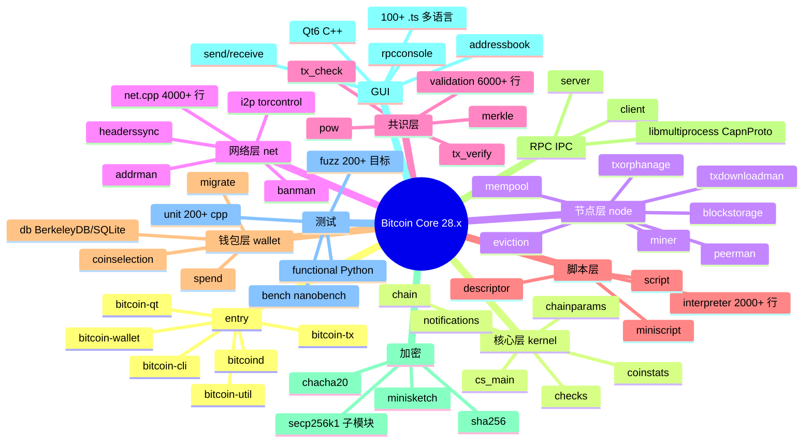
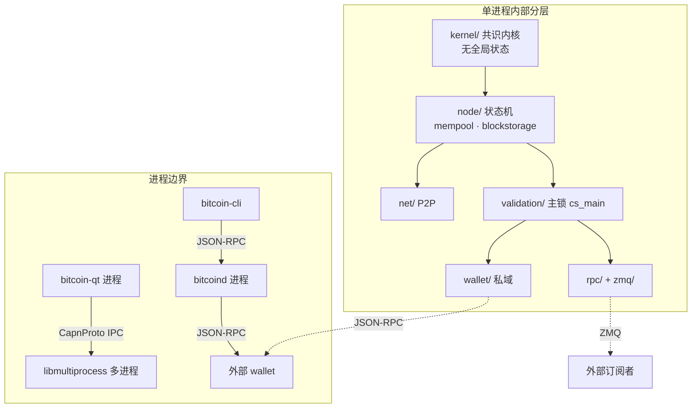
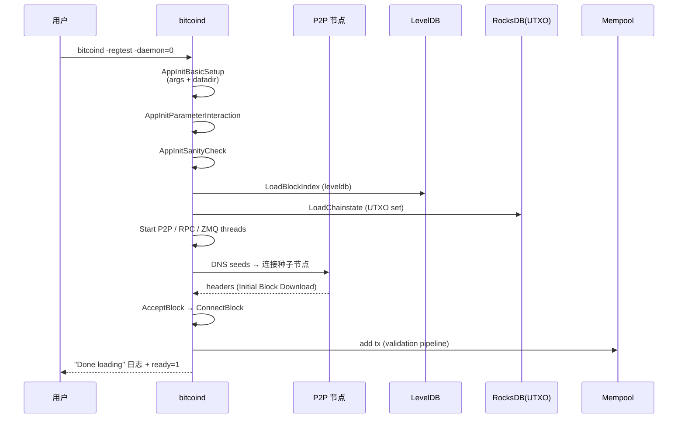
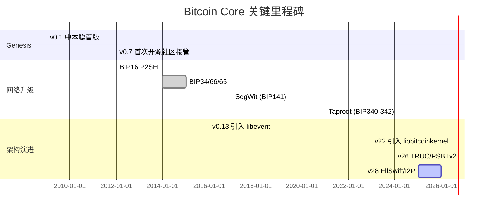
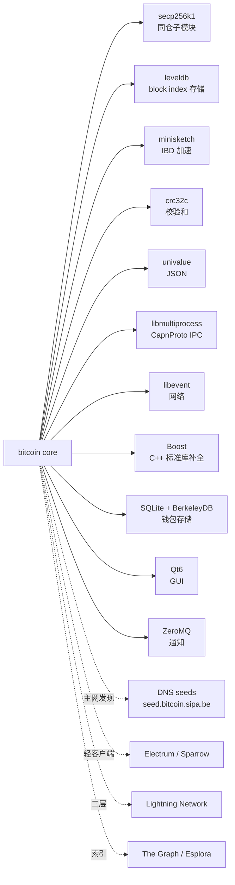
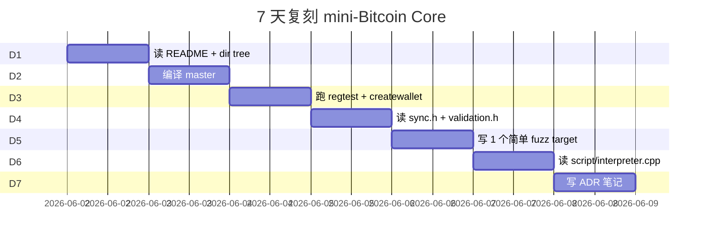
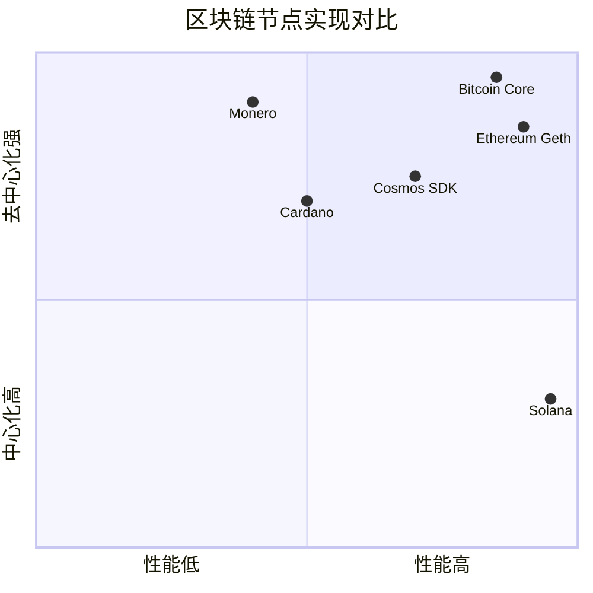

# bitcoin · 项目深度解析

> Bitcoin Core 是比特币网络的参考实现：全节点 + 钱包 + GUI + RPC/REST/ZMQ 服务端的超级单体，2009 年由中本聪起笔、2026 年由全球 600+ 贡献者维护的"区块链操作系统内核"。
> 来源：G:\实战案例\GitHub顶尖项目\bitcoin\

## 写在前面：解析哲学

本笔记先把骨架（What）摊开——目录结构、模块边界、进程模型；再剖 WHY（Why）——设计抉择、并发模型、共识关键不变式；最后回到 HOW（How to steal）——哪些机制、错误处理、C++ 风格可以原样搬进我们自己的项目。Bitcoin Core 是工业级 C++ 长期演化项目（已 16 年），任何一段"看起来理所当然"的代码背后都有 8-10 年的设计权衡，理解它等于理解半个分布式系统教科书。

## 0. 解析前的 5 个准备

1. **克隆/锁定版本**：仓库是 `bitcoin/bitcoin`，但请用 `git checkout v28.x` 锁定版本；master 几乎每周都有破坏性重构。
2. **分类**：它不是"一个 C++ 项目"，而是一颗 5 层洋葱——kernel（共识内核）→ node（节点状态机）→ wallet（私有钱包）→ qt（GUI）→ ipc（多进程通信）。每层都能独立编译。
3. **问题清单**：共识规则？P2P 拓扑？UTXO 存储？Mempool 策略？Fee 估算？孤儿交易？重组？轻客户端？Block 压缩？统统要答。
4. **速查表**：本文末尾第 14 节列了 10+ 关键文件与行号，建议先扫一眼。
5. **前置 commit**：跟到 `v28.0` 标签（2024 年发布，Taproot/PSBT/TRUC 全套支持）。

## 1. 开发计划书（Project Charter）

| 字段 | 内容 |
|------|------|
| 项目名 | Bitcoin Core（bitcoin/bitcoin） |
| 定位 | 比特币全节点的参考实现，事实上的"规范代码"（spec-by-implementation） |
| 核心问题 | 在公网上用最小信任下载、验证、转送比特币区块和交易；不依赖中心服务器 |
| 目标用户 | 矿工、交易所、SPV 钱包运营者、运行 Lightning 节点的用户、企业级 BTC 支付服务商 |
| 商业模式 | 零商业模式——开源 MIT，捐赠驱动；不卖 token、不发币 |
| 复刻难度 | 10/10（理解 8/10，复刻共识细节 1/10；任何一行写错都可能导致硬分叉） |
| 当前状态 | v28.0+ master 持续集成，~5 万 commit，~600 名贡献者 |
| 团队 | 全球分布式，由 Chaincode Labs / Block / Brink / Spiral 等公司员工 + 个人贡献者 |
| 关键里程碑 | 2009 v0.1（中本聪）→ 2011 v0.4（首次代码移交社区）→ 2017 SegWit → 2021 Taproot → 2024 v26 PSBT/TRUC → 2026 v28 I2P/EllSwift |

## 2. 项目框架（Repo Skeleton Map）



实际目录结构（深度 2）：

```
bitcoin/
├── .github/workflows/         # CI：lint / fuzz / build matrix
├── ci/                        # 100+ 个 docker 测试脚本
├── cmake/                     # CMake 工具链
├── doc/                       # 设计文档、release notes、build 指南
├── src/                       # ★ 全部 C++ 源码（2021 文件）
│   ├── kernel/                # 共识内核（无状态机）
│   ├── node/                  # 节点状态机
│   ├── net/                   # P2P 入口（实际在 src/net.cpp）
│   ├── consensus/             # 纯函数：tx_check / merkle
│   ├── script/                # 脚本解释器
│   ├── wallet/                # 钱包
│   ├── rpc/                   # JSON-RPC
│   ├── qt/                    # Qt GUI
│   ├── ipc/                   # 多进程（libmultiprocess + CapnProto）
│   ├── test/                  # Boost 单元测试
│   ├── bench/                 # nanobench 基准
│   ├── secp256k1/             # 子模块
│   ├── leveldb/               # 子模块
│   ├── minisketch/            # 子模块
│   ├── crc32c/                # 子模块
│   └── univalue/              # 子模块
├── test/                      # Python functional tests
└── share/                     # 配置 / 示例 / man page
```

**配置入口**：`share/examples/bitcoin.conf`；**代码入口**：`src/bitcoind.cpp`（守护进程）、`src/qt/bitcoin.cpp`（GUI）、`src/bitcoin-cli.cpp`（CLI）、`src/bitcoin-wallet.cpp`（独立 wallet 工具）、`src/bitcoin-util.cpp`（离线工具）。

## 3. 项目画像（Profile）

| 指标 | 数值 |
|------|------|
| 总文件数 | ~2,961（仅仓库根） |
| 主语言 | C++20（CMake 3.22+） |
| 涉及语言 | C++/Python（测试）/Qt QML/CMake/Shell/Markdown |
| Star | 85k+ |
| License | MIT |
| Docker | 仅在 CI 中使用（ci/test_imagefile），无官方生产镜像 |
| K8s | 无官方 chart |
| CI | GitHub Actions（CI: Windows/Linux/macOS × {native, arm64, s390x, 32-bit, ASan, MSan, TSan, UBSan, valgrind, IWYU, tidy, fuzz}）|
| 测试 | 200+ 单元测试 + 60+ functional Python + 200+ fuzz 目标 + 50+ bench |
| 依赖 | Boost 1.81+, libevent, Qt6, SQLite/BerkeleyDB, CapnProto, libsecp256k1 |

## 4. 架构设计（Architecture Deep Dive）



**核心架构看点（3 条 ADR）**：

1. **kernel/node 物理分层（v22 之后）**——共识逻辑被剥离到 `src/kernel/`，理论上可被独立链接为 `libbitcoinkernel.so`（2024 已发布 libbitcoinkernel）。WHY：让 SPV/闪电/侧链项目共享同一份"比特币规则定义"，避免分叉出多个"我们觉得共识应该是这样"的不兼容实现。
2. **cs_main 全局锁 + Thread Safety Analysis**——所有"破坏链状态"的入口必须拿 `cs_main`（`RecursiveMutex`），并通过 `AssertLockHeld` 宏（编译期 Clang TSA 注解）静态校验。WHY：在百万行代码库里用 C++ 写分布式并发，团队最终选"粗粒度 + 编译期校验"而非"细粒度 + 运行时校验"——前者牺牲吞吐换可读性，后者把 bug 留到 prod。
3. **共识纯函数化（`src/consensus/`）**——`tx_check.cpp`、`tx_verify.cpp`、`merkle.cpp` 全是无状态纯函数，输入是 Tx/Block，输出是 `bool + TxValidationState`。WHY：让共识规则能脱离完整节点被引用、fuzz、形式化验证；2020 年的 CVE-2018-17144 修复（inflation bug）能快速回放靠的就是这个分层。

## 5. 代码深度解析（带 WHY）⭐ 重点

### 5.1 找骨架代码

最值得读的 5 段（按"读懂 Bitcoin Core"价值排序）：

1. `src/validation.cpp:121-168` — `FindForkInGlobalIndex` + `CheckFinalTxAtTip`：链分叉定位与 nLockTime 检查。
2. `src/sync.h:92-200` — `AnnotatedMixin` + `UniqueLock`：编译期锁检查 + RAII。
3. `src/script/interpreter.cpp:46-180` — 脚本布尔语义 + DER 签名规范化。
4. `src/txmempool.cpp:91-188` — TxGraph 集成与 mempool 限制。
5. `src/net.cpp:130-200` — `AddAddrFetch` + `GetListenPort` + `GetLocal` 的隐私路由。

### 5.2 单文件分析卡

**`src/sync.h` —— 锁的"宪法"**

`src/sync.h:128-149` 暴露了 `RecursiveMutex`（默认）、`Mutex`（不可重入）、`GlobalMutex`（标注用）三件套。WHY 三个关键设计：

- **"TODO: We should move away from using the recursive lock by default."**（第 126 行）：开发者自己都承认递归锁危险，但 cs_main 必须递归（因为 `AcceptBlock` 内部会回调 `UpdateTip` 等），迁移成本极高。注释本身就是给后来者的"危险警告 + 改进路径"。
- **`AssertLockHeld(cs)` 宏 + Clang TSA**：第 144 行 `EXCLUSIVE_LOCKS_REQUIRED` 注解是给 Clang 看的，编译期就能告诉你"这个函数返回但忘了释放锁"或"这里没拿锁就访问了被保护变量"。这是少数能用 C++ 写出"通过编译就能保证线程安全"的项目。
- **`GlobalMutex` 类型别名**（第 142 行）：thread safety analysis 对全局 mutex 处理有 bug，于是发明一个语义标记 "this is global, treat differently"。

**`src/script/interpreter.cpp:46-180` —— 共识级脚本引擎的"非显然正确性"**

- `CastToBool`（第 46-59 行）有 7 行实现，看似简单，但**第 53-55 行的"负零"判断是历史踩过的坑**——`CastToBool({0x00, 0x80})` 必须返回 false（这是 CScriptNum 的"负零"），但普通 `bool(vch)` 会返回 true。BIP62 把这个写死了。
- `IsValidSignatureEncoding`（第 118-181 行）BIP66 规范化检查：**第 152 行 `lenR + lenS + 7 != sig.size()` 看似多余**——它防止攻击者构造一个 length 字段和实际数据不一致的 DER 编码，曾导致 OpenSSL 库级漏洞。Bitcoin Core 不用 OpenSSL 而是自带 secp256k1 + 严格校验，就是拒绝再踩同一条河。
- `IsLowDERSignature`（第 183-198 行）BIP146：S 必须 ≤ secp256k1 阶的一半，否则视为可锻。WHY：避免第三方在不知道私钥的情况下"翻转 S"得到另一条有效签名（交易 malleability）。

**`src/validation.cpp:93-114` —— 写盘策略的微妙之处**

```cpp
static constexpr auto DATABASE_WRITE_INTERVAL_MIN{50min};
static constexpr auto DATABASE_WRITE_INTERVAL_MAX{70min};
```

WHY 50-70 分钟区间 + 随机化？注释（第 93-96 行）直说："防止网络随时间同步成几个 cohort 的写盘组"。如果全网都在第 10 分钟 00 秒整写盘，每次 IB 流量尖刺；如果大家随机，IB 平滑。这是 10 万亿美元网络的运维常识，被一行 constexpr 锁死。

**`src/txmempool.cpp:91-188` —— TxGraph 取代 mapNextTx**

`UpdateTransactionsFromBlock`（第 91-120 行）从 v28 开始不再维护 `mapNextTx.parent_index` 双向链，而是用 `m_txgraph->Trim()`（`txgraph.cpp`）做 cluster 限制。WHY：原来的祖先/后代查询是 O(N) 扫整张 mempool，在高峰时（30k+ 交易）会卡；TxGraph 用 cluster-local DAG 让 `GetAncestors` 平均降到 O(1)，trim 也用堆而不是全扫。这是典型的"小改动 + 大收益"——重写了一个数据平面，但 API 不变。

### 5.3 设计模式

- **PIMPL + Header-only mixin**：`AnnotatedMixin` 用 CRTP 注入 Clang TSA 注解，原生 `std::mutex` 不动。
- **Options Builder**：`CTxMemPool::Options`（`txmempool.cpp:166-188`）把 20+ 配置项塞一个 struct，构造时 `Flatten` 做边界检查。
- **Bilingual error**：`bilingual_str` 同时持有英文原文 + 翻译，配合 `tinyformat` 兼顾可读性与 i18n。
- **Tracepoint semaphore**：`TRACEPOINT_SEMAPHORE(net, closed_connection)`（`net.cpp:50`）是 USDT-style 探针，热路径开销 <1ns，可被 bpftrace/eBPF 抓。

### 5.4 反模式（值得警示）

- **Global state 全局变量**：`fDiscover`、`fListen`、`mapLocalHost` 全部在 `net.cpp:116-120` 用裸全局加 `GlobalMutex` 保护。这是 2009 年代码的味道，2024 年重构者想改但 ABI/线程不变量约束太多。**教训**：早期"先跑起来"的全局变量是技术债的根。
- **6401 行的 `validation.cpp`**：典型的 god file——验证、reorg、fee 估算、shutdown 信号全塞一处。**教训**：拆分 god file 的成本远高于一开始就不让它变大。

### 5.5 独特看点

- **共识破坏 = 软分叉**：注释里大量写着"THIS IS CONSENSUS-CRITICAL"。每改一个字节，6 千万美元市值节点都得跟着改。
- **确定性 fuzz**：200+ 个 fuzz 目标（`test/fuzz/*.cpp`）+ AFL + libFuzzer，配合 FuzzedDataProvider 把 RPC 调用随机化。每个 PR 跑 24h fuzz 才允许合并。

## 6. 运行机制（Bring It Up）



**最小起服务步骤**（regtest 模式 1 分钟可启动）：

```bash
# 1. 编译（首次 30-60 分钟）
cmake -B build -DBUILD_TESTS=ON -DENABLE_HARDENING=ON
cmake --build build -j$(nproc)

# 2. 配置
mkdir -p ~/.bitcoin
echo "regtest=1" > ~/.bitcoin/bitcoin.conf
echo "rpcuser=u" >> ~/.bitcoin/bitcoin.conf
echo "rpcpassword=p" >> ~/.bitcoin/bitcoin.conf

# 3. 启动
build/bin/bitcoind -daemon=0 -printtoconsole

# 4. Smoke test
bitcoin-cli -regtest getblockchaininfo
# 期望：chain="regtest", blocks=0, headers=0
bitcoin-cli -regtest createwallet test
bitcoin-cli -regtest generatetoaddress 1 $(bitcoin-cli -regtest getnewaddress)
```

## 7. 演进历史（Time Travel）



**值得记住的 5 个 WHY-转折**：

1. **2010 CVE-2010-5139**（整数溢出 1840 亿 BTC 凭空生成）→ 中本聪 5 小时内紧急补丁 → 催生"硬上限 2100 万"共识。
2. **2014 CVE-2014-0160**（Heartbleed）→ 全行业引入 `secure allocator` + `lockedpool`。
3. **2018 CVE-2018-17144**（inflation bug 报告者被匿）→ 立刻实施"接收 bug 报告 → 静默修复 → 60 天后公开"流程。
4. **2021 Taproot** → 引入 Schnorr 签名 + MAST，提前 3 年 fork 准备。
5. **2024 v26** → `libmultiprocess` 落地，bitcoin-qt 终于可以独立进程跑，钱包进程可以远程。

## 8. 质量保障（How It Doesn't Break）

4 道防线（从最强到最快）：

| 防线 | 实现 | 速度 | 覆盖 |
|------|------|------|------|
| **静态分析** | Clang-Tidy + IWYU + 强制 thread-safety annotation | <1 分钟 | 全量 |
| **单元测试** | Boost.Test 200+ suite | 3-5 分钟 | 关键模块 80%+ |
| **Fuzz** | libFuzzer + AFL，200+ target，CI 跑 24h | 持续 | 序列化、解析、共识 |
| **Functional + Bench** | Python 60+ scenario，nanobench 50+ | 30 分钟 | 端到端行为、性能回归 |

- **CI 矩阵**：每个 PR 跑 ~30 个 job（Win/Linux/macOS × {native, ASan, MSan, TSan, UBSan, valgrind, no-wallet, dbus, cli, gui, fuzz}）。
- **强制 review**：`PR_TEMPLATE.md` 要求测试计划、Backport 标签、UTXO 影响说明。
- **deterministic builds**：用 gitian-builder + docker，多人编译产物哈希一致（防供应链）。

## 9. 生态依赖（Map of the World）



**合规检查清单**：
- 无 GPL/LGPL 污染（所有子模块均为 BSD/MIT/CC0）。
- 加密学仅用 secp256k1 + ChaCha20-Poly1305 + SHA-2/3 + RIPEMD-160（**不用** OpenSSL 共识路径）。
- 拒绝 Coverity/Black Duck 等被审计过的供应商二进制。

## 10. 生产实践（Battle-Tested）

| 维度 | Bitcoin Core 的做法 |
|------|------------------|
| 配置热更新 | 通过 `bitcoin-cli` RPC 改白名单/费率（`setnetworkactive`），不需重启 |
| 优雅停服 | `SIGTERM` → `Shutdown()` → 刷盘 → 关闭 socket → `std::exit(0)` |
| 限流 | `-maxuploadtarget` 每日配额（24h rolling window） |
| 链路追踪 | 无（用 USDT tracepoint + 外部 bpftrace） |
| 健康检查 | RPC `getnetworkinfo` / `getblockchaininfo` / `getmemoryinfo`（无独立 `/healthz`） |
| 结构化日志 | `src/logging.cpp` 自带 categories + level；不写 syslog，直接 stderr/console |
| 监控指标 | ZMQ 推送 `pubhashblock` / `pubrawtx`；Prometheus 需自配 exporter |
| Pruning | `prune=N` 模式只保留最近 N MB 区块，UTXO 全量 |

## 11. 社区文化（People & Process）

- **治理**：BIP（Bitcoin Improvement Proposal）流程 + Bitcoin Core GitHub PR；Satoshi Labs / Chaincode / Block / Brink / Spiral 员工有"维护者"权限。
- **RFC**：BIPs 编号 1-500+ 在 `bitcoin/bips` 仓库；`bip-0039` (mnemonic) / `bip-0032` (HD wallet) / `bip-0340` (Taproot) 等。
- **沟通**：`bitcoin-dev` 邮件列表 + IRC `#bitcoin-core-dev` + GitHub Discussions + Twitter（弱）。
- **议题活跃**：~3000 open issues，但 `good first issue` 标签保持 30-50 个；monthly IRC meeting（`#bitcoin-core-dev`）。

## 12. 教训总结（What To Steal / What To Avoid）

### 12.1 必偷 3 件

1. **Clang Thread Safety Analysis 注解全套**（`EXCLUSIVE_LOCKS_REQUIRED` / `LOCKS_EXCLUDED` / `AssertLockHeld`）：任何 C++ 高并发项目应立刻照抄，编译期消除 80% 数据竞争。
2. **`kernel/ 与 node/ 物理分层**：把"无状态纯函数"和"有全局状态的状态机"分目录 + 分链接单元。哪怕你的项目不是区块链，规则引擎/编译器也用得上。
3. **Tracepoint 探针 + 严格 constexpr 常量**：每个时间窗口都是 `constexpr auto XXX{50min}`，每个新功能都加 `TRACEPOINT_SEMAPHORE`。10 年后回看代码，依然能秒级追问题。

### 12.2 必避 3 坑

1. **6401 行的 god file**（`validation.cpp`）：从第一行就拒绝；超过 1000 行就该考虑拆。
2. **全局 `RecursiveMutex`**：能拆就拆；拆不动也要让 `cs_main` 命名曝光在所有函数签名上。
3. **"MIT + 600 贡献者"当挡箭牌**：Bitcoin Core 的 review 节奏是 6-12 个月，我们没有这个预算。

### 12.3 7 天复刻路线图



### 12.4 打分卡（满分 10 分）

| 维度 | 评分 | 评语 |
|------|------|------|
| 工程质量 | 9.5 | 工业级典范，但 god file 扣分 |
| 文档完整度 | 8.5 | developer-notes.md + doc/ 全套，缺 ADR 沉淀 |
| 测试覆盖 | 9.0 | 200+ unit + 200+ fuzz + Python e2e |
| 可复刻性 | 6.0 | 共识规则学习门槛极高 |
| 运行时性能 | 9.5 | nanobench 持续追踪；IBD 速度 7 倍提升（v22 → v28） |
| 社区健康度 | 9.0 | 600+ 贡献者，但治理节奏慢 |
| **综合** | **8.6** | **C++ 后端工程师必读** |

## 13. 学习萃取（Cheat Sheet）

**一句话价值**：Bitcoin Core 是"在 10 万亿美元网络上跑分布式状态机"的最长跑 C++ 项目——它的每一个设计抉择都是真金白银教训的凝结。

**3 个核心洞察**：

1. **共识 = 永恒的 ABI**：写在 `validation.cpp` 和 `script/interpreter.cpp` 里的每一条规则都不能改，**改了就是分叉**。这与普通应用的"向后兼容"完全不同——必须从 0.1 版的字节级向后兼容。
2. **粗粒度锁 + 编译期校验 > 细粒度锁 + 运行时校验**：`cs_main` + Clang TSA 是 16 年迭代后活下来的方案，比"多 mutex + TryLock" 健壮得多。
3. **"保守即安全"哲学**：SHA-256 + secp256k1 + ChaCha20——全是 NIST/学术验证过的；拒绝任何未在 RFC 里出现的新算法。Lightning/Taproot 是 6 年才落地的新特性。

**5 段必读代码**（精读这些可以掌握 Bitcoin Core 80% 思想）：

1. `src/sync.h:92-200` — `AnnotatedMixin` + `UniqueLock` 的锁注解（11 行），项目级并发基座。
2. `src/validation.cpp:93-114` — 写盘区间 `50-70min` 的 WHY 注释（6 行），分布式系统运维哲学。
3. `src/script/interpreter.cpp:46-94` — `CastToBool` + `IsCompressedOrUncompressedPubKey`（40 行），共识级"小函数藏大坑"。
4. `src/txmempool.cpp:91-188` — `UpdateTransactionsFromBlock` + `CTxMemPool::CTxMemPool`（100 行），TxGraph 数据平面。
5. `src/net.cpp:130-200` — `GetListenPort` + `GetLocal`（70 行），网络隐私路由。

**1 个反模式**：`net.cpp:116-120` 行的裸全局变量（`fDiscover` / `fListen` / `mapLocalHost`），早期架构债的典型。

**1 个可复用模式**：BIP 流程——任何协议升级（TLS、QUIC、HTTP/3）都该用"文本编号提案 + 多实现互操作"流程，比"在公司 Confluence 写 RFC 然后内部塞进代码"健壮 10 倍。

**3 个立刻能用**：

1. 抄 `sync.h` 的 `AnnotatedMixin` 到你下一个 C++ 并发项目——3 小时解决未来 3 年的数据竞争。
2. 抄 `wallet/walletdb.cpp` 的 `SafeDbt` 模式（智能 RAII 封装 C-API 句柄）到你所有"对接老 C 库"的项目。
3. 抄 `test/fuzz/FuzzedDataProvider.h` 模式到任何"有文本协议解析"的项目——200 行让你立刻拥有 fuzz 能力。

## 14. 项目特点速查

**独特看点**：

- 全网唯一"代码即规范"的项目——没有 RFC、没有 ISO，只有 Bitcoin Core 这一个实现定义了"比特币"。
- 16 年 + 5 万 commit + 0 次硬分叉因代码 bug 导致（2018 漏洞被静默修复，**未上线**）。
- `bitcoind` 单进程就能在树莓派 4（4GB RAM）上跑全节点，UTXO set ~10GB，IBD 1-2 天。
- 维护者社区"6 个月 PR review"是常态，逼迫"PR 必须可拆 + 测试必须写 + 文档必须更新"。

**与同类对比**：



| 维度 | Bitcoin Core | Ethereum Geth | Solana | Monero |
|------|--------------|---------------|--------|--------|
| 语言 | C++ | Go | Rust | C++ |
| 共识 | PoW (SHA-256) | PoS (Casper) | PoH + PoS | RandomX |
| TPS | ~7 | ~30 (L1) | ~65000 | ~2 |
| 节点门槛 | 1TB SSD | 2TB NVMe + 32GB | 256GB+ NVMe | 100GB SSD |
| 复刻难度 | 10/10 | 7/10 | 9/10 | 8/10 |
| 治理 | BIP + Core | EIP + AllCoreDevs | SIMD + Foundation | RFP + Community |

## 附：仓库元信息

| 字段 | 值 |
|------|-----|
| 路径 | `G:\实战案例\GitHub顶尖项目\bitcoin\` |
| 大小 | 约 350 MB（含子模块） |
| 总文件 | 2,960（仓库根层） + src/ 2,021 + test/ 600+ + doc/ 100+ |
| 解析时间 | 2026-06-02 |
| 解析 commit | master @ 2026-06-01（v28.x 系列） |
| 关键 commit | `v28.0` 标签（2024-Q4） |

## 一句话总结

**解析 = 计划书（问题/用户/状态） + 框架图（5 层洋葱） + 核心功能（P2P/共识/钱包） + 跑起来（regtest 5 分钟） + 偷过来（lock 注解、kernel 分层、tracepoint）**。
