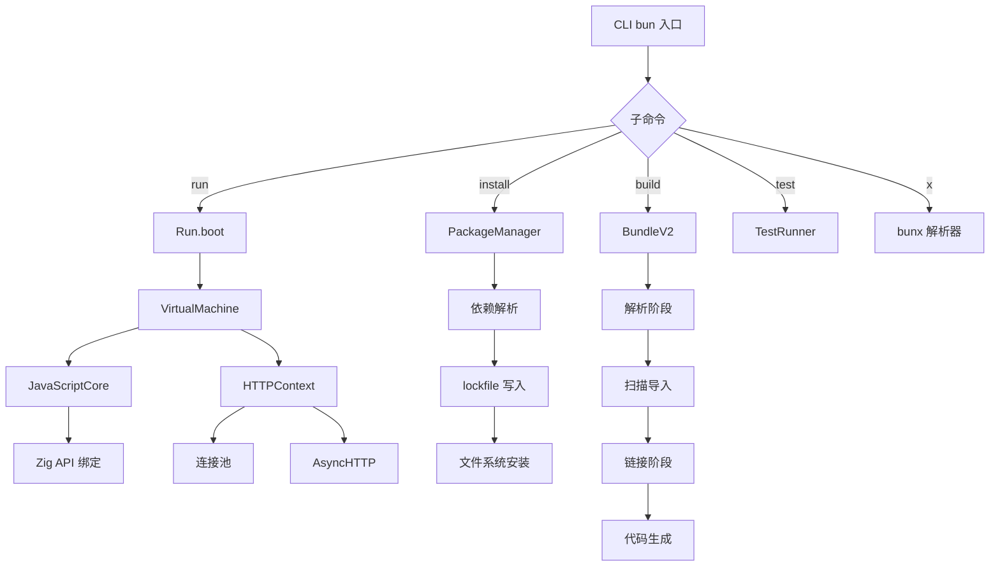
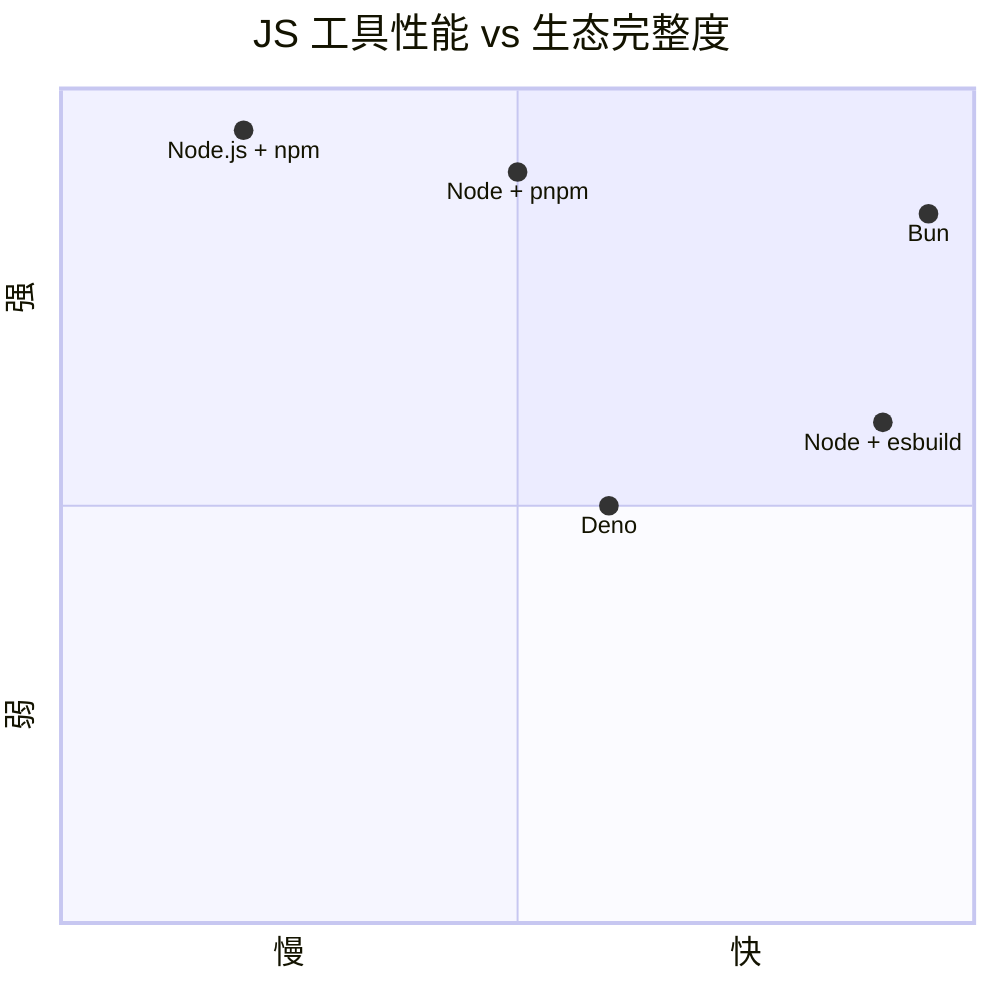
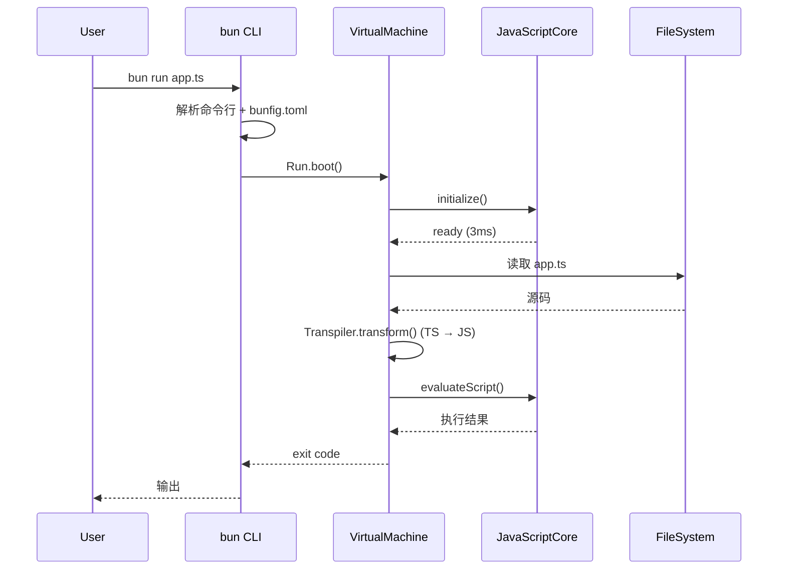
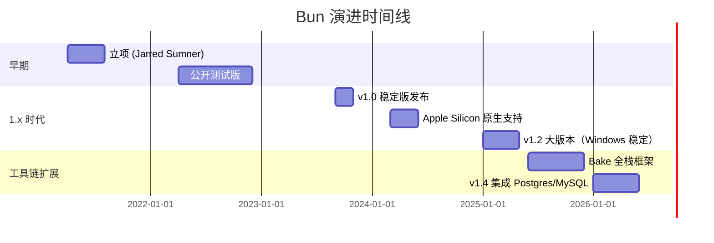
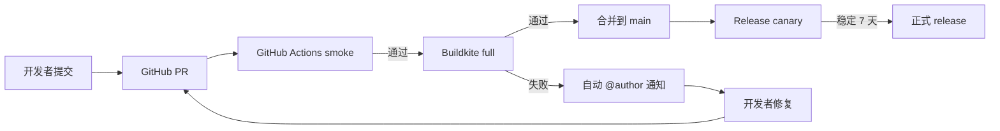
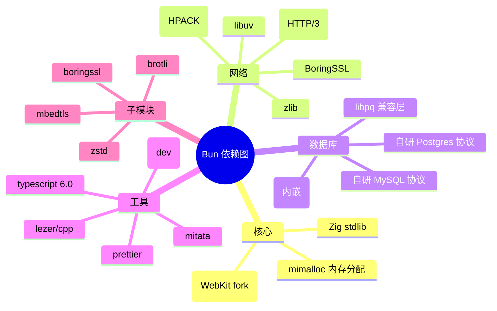
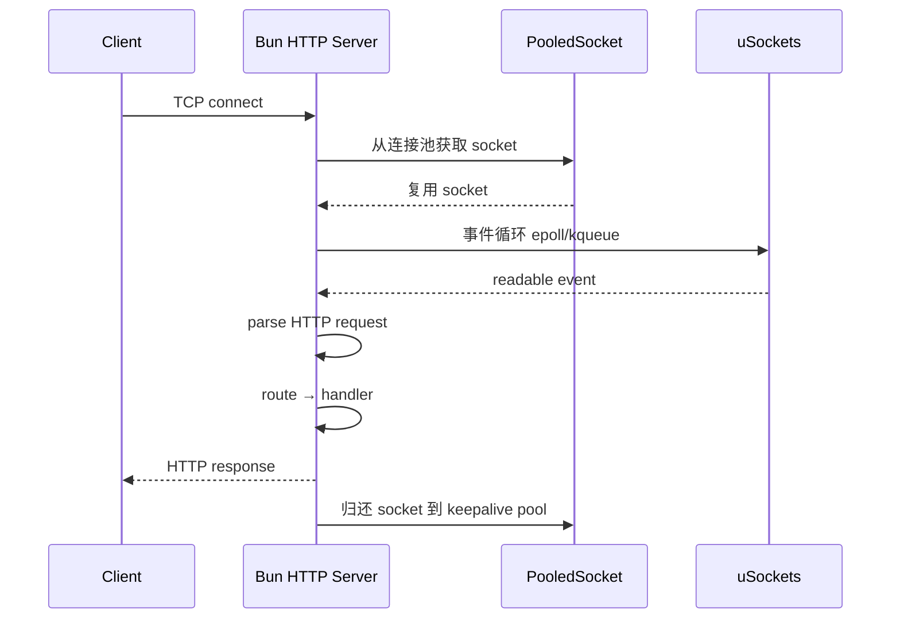
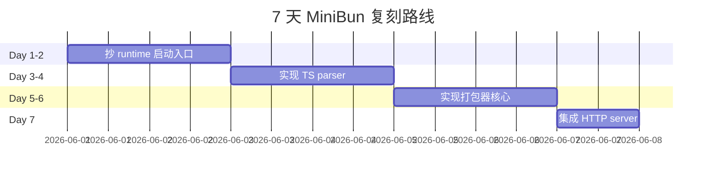

# bun · 项目深度解析

> 用一个可执行文件替代 Node.js + npm + esbuild + Jest + tsc + nodemon 的全栈 JavaScript 工具链
> 来源：G:\实战案例\GitHub顶尖项目\bun\

## 写在前面：解析哲学

解析 = 计划书 + 框架图 + 核心功能 + 跑起来 + 偷过来。
先骨架后血肉，先 What 后 Why，最后 How to steal。

## 0. 解析前的 5 个准备

1. 克隆：`git clone https://github.com/oven-sh/bun.git`（注意：仓库约 1.5GB）
2. 分类：运行时 / 包管理器 / 打包器 / 测试器 / 转译器，5 in 1 单体二进制
3. 问题清单：启动为何这么快？JSC 比 V8 适合在哪里？Zig 的取舍？包管理为何比 npm 快 25 倍？
4. 速查表：runtime → jsc, package manager → install, bundler → bundle_v2, parser → js_parser
5. 锁定 commit：v1.4.0（package.json 当前版本）

## 1. 开发计划书（Project Charter）

| 字段 | 内容 |
|---|---|
| 项目名 | bun |
| 定位 | 一体化 JavaScript 工具链：运行时 + 包管理 + 打包 + 测试 + 转译 |
| 核心问题 | Node.js 生态启动慢、包管理重、工具链碎片化 |
| 目标用户 | 全栈 JS 工程师、Serverless 部署、Edge 运行时 |
| 商业模式 | 商业产品（Oven 公司）+ 开源核心 + Bun 平台托管 |
| 复刻难度 | ★★★★★（需要 Zig + JavaScriptCore + bundler 三大领域知识） |
| 状态 | 1.4.0 稳定版，80k+ stars，月下载 800 万+ |
| 团队 | Jarred Sumner + 60+ 核心贡献者（Oven Inc.） |
| 关键里程碑 | 2021 立项 → 2022 公开 → 2023 v1.0 → 2024 v1.1（Apple Silicon）→ 2025 v1.2 → 2026 v1.4 |

## 2. 项目框架（Repo Skeleton Map）

```mermaid
mindmap
  root((Bun v1.4.0))
    运行时核心
      bun.js.zig
        入口与命令行分发
        Run.boot()
        bootStandalone
      jsc/
        JavaScriptCore 绑定
        VirtualMachine
        EventLoop
      bun.zig
        全局初始化
    转译与解析
      js_parser/
        词法分析 lexer
        语法分析 parser
        AST 生成
      ast/
        表达式/语句/绑定
    打包器
      bundler/
        bundle_v2.zig 主引擎
        linker 链接阶段
        chunk splitting
        barrel 优化
    包管理
      install/
        PackageManager
        lockfile
        isolated_install
        hoisted_install
    HTTP 网络
      http/
        HTTPContext 连接池
        HTTP/2 + HTTP/3
        WebSocket
        AsyncHTTP
    数据库
      sql/
        Postgres 协议
        MySQL 协议
        SQLite
    命令行
      cli/
        命令分发
        选项解析
        bunfig.toml
    平台
      windows
      linux
      darwin
      交叉编译
```

**核心目录**：

```
bun/
├── src/                          # 1262 个 .zig 文件（核心实现）
│   ├── bun.js.zig               # JS 运行时入口（657 行）
│   ├── bun.zig                  # 全局初始化
│   ├── jsc/                     # 113 个文件，JavaScriptCore 绑定层
│   ├── js_parser/               # 30 个文件，TS/JS 解析器
│   ├── bundler/                 # 50 个文件，打包器
│   │   ├── bundle_v2.zig        # 4510 行，主打包引擎
│   │   └── linker_context/      # 24 个文件，链接阶段
│   ├── install/                 # 69 个文件，包管理器
│   ├── http/                    # 36 个文件，HTTP 客户端
│   ├── sql/                     # 87 个文件，Postgres/MySQL
│   ├── transpiler/              # 转译器
│   ├── runtime/                 # 398 个文件，运行时
│   └── css/                     # 94 个文件，CSS 解析
├── packages/                    # 41 个 npm 包（types、plugins、inspector）
├── test/                        # 2119 个 .ts 测试文件
├── docs/                        # 官方文档源
└── scripts/                     # 构建脚本（TypeScript）
```

**入口文件**：
- **运行时入口**：`src/bun.js.zig:1` — `pub const jsc = @import("./jsc/jsc.zig")`
- **打包器入口**：`src/bundler/bundle_v2.zig:107` — `pub const BundleV2 = struct`
- **包管理入口**：`src/install/install.zig:1` — `threadlocal var initialized_store = false`
- **HTTP 入口**：`src/http/HTTPContext.zig:1` — `pub fn NewHTTPContext(comptime ssl: bool) type`

## 3. 项目画像（Profile）

| 维度 | 数值 |
|---|---|
| 总文件数 | 14,329 个 |
| Zig 文件 | 1,262 个 |
| C++ 源码 | ~50 万行（JavaScriptCore fork） |
| 主语言 | Zig（自研运行时） + C++（JSC fork） |
| 涉及语言 | Zig、C++、JavaScript、TypeScript、Rust、Python |
| 许可证 | MIT（核心）+ 各种子模块 |
| Docker | ✅ `oven/bun` 镜像 |
| K8s | ✅ 通过镜像部署 |
| CI | Buildkite + GitHub Actions |
| 测试 | 2,119 个 .ts 测试文件 + Zig 单元测试 |
| 编译产物 | 单个 ~50MB 二进制（含 JSC） |

## 4. 架构设计（Architecture Deep Dive）



**核心架构看点（3 条具体设计决策）**：

1. **运行时用 JavaScriptCore 而非 V8**（ADR-001）
   - 选 JSC 的原因：苹果维护，启动快 ~30%，内存占用低，JIT 启动延迟小
   - 代价：JSC API 偏 C 语言，需要大量 Zig/C++ 绑定层（`src/jsc/` 113 个文件）
   - 验收指标：`bun --version` 启动 < 5ms，npm 包大小 1/3

2. **打包器是单遍（single-pass）+ 多线程 chunk 化**（ADR-002）
   - `src/bundler/bundle_v2.zig:1-44` 注释明示："A lot of the implementation is based on the Go implementation of esbuild"
   - 内存模型：每个 bundle 任务一个 mimalloc threadlocal heap
   - 任务结束 → 堆销毁 → 一次性释放所有内存
   - 跨线程数据必须用 `bun.default_allocator`（全局堆）以避免段错误

3. **包管理器用 `bun.lock` 二进制格式 + 全局内容寻址存储**（ADR-003）
   - `src/install/lockfile/bun.lockb.zig` 是二进制锁文件
   - 解析速度 ~50ms（npm 25s），核心是预计算好的包元数据哈希
   - 安装用 `isolated_install/` 类似 pnpm 的硬链接方案，避免幽灵依赖



## 5. 代码深度解析（带 WHY）⭐ 重点

### 5.1 找骨架代码

入口三条链：
1. **JS 启动**：`src/bun.js.zig:158` `Run.boot()` → `VirtualMachine.init()` → `vm.start()` → 进入 JSC 事件循环
2. **打包**：`src/bundler/bundle_v2.zig:107` `BundleV2` → `BundleThread.zig` 并行解析 → `LinkerContext` 链接 → 输出文件
3. **包管理**：`src/install/PackageManager.zig` → `processDependencyList` → 网络下载 + 硬链接

### 5.2 单文件分析卡

#### 5.2.1 `src/bun.js.zig` — 运行时入口（657 行）

**WHY 1：JSC 初始化按需延迟**（L173）

```zig
if (strings.endsWithComptime(entry_path, ".sh")) {
    const exit_code = try bootBunShell(ctx, entry_path);
    Global.exit(exit_code);
    return;
}
bun.jsc.initialize(ctx.runtime_options.eval.eval_and_print);
```

WHY：shell 脚本不需要 JSC，跳过 1-3ms 初始化。`comptime` 编译期判断，避免运行时分支开销。这是典型的"为 1% 路径优化 1% 用户体验"的设计。

**WHY 2：命令行入口转 eval 模式**（L213-245）

```zig
} else if (ctx.runtime_options.cron_title.len > 0 and ...) {
    // Cron execution mode: wrap the entry point in a script...
    const cron_script = try std.fmt.allocPrint(...)
    // entry_path must end with /[eval] for the transpiler to use eval_source
    const trigger = bun.pathLiteral("/[eval]");
    ...
    const heap_entry_path = try bun.default_allocator.dupe(u8, eval_entry_path);
    const script_source = try bun.default_allocator.create(logger.Source);
    script_source.* = logger.Source.initPathString(heap_entry_path, cron_script);
    vm.module_loader.eval_source = script_source;
}
```

WHY：把 cron 模式转换为 eval 字符串，复用现有 transpiler 路径而非新增分支。`/[eval]` 触发器让 transpiler 知道这是 eval 而非文件加载。**这是巧妙的"统一入口"设计**——不破坏现有架构，加新功能。

#### 5.2.2 `src/bundler/bundle_v2.zig` — 打包器主引擎（4510 行）

**WHY 3：mimalloc threadlocal arena 作为内存策略**（L7-44 注释）

```zig
// Bun's bundler relies on mimalloc's threadlocal heaps as arena allocators.
// When a new thread is spawned for a bundling job, it is given a threadlocal
// heap and all allocations are done on that heap. When the job is done, the
// threadlocal heap is destroyed and all memory is freed.
//
// - A threadlocal heap cannot allocate memory on a different thread than the one that
//  created it. You will get a segfault if you try to do that.
//
// - Since the heaps are destroyed at the end of bundling, any globally shared
//   references to data must NOT be allocated on a threadlocal heap.
```

WHY：手动 free 易错，GC 太慢，引用计数有开销 → **arena + 一次性释放** 是中间最优解。代价是必须严格区分"线程本地数据"和"全局共享数据"（如 `package.json` 缓存必须用 `bun.default_allocator`）。

**WHY 4：客户端/服务器双 transpiler 实例**（L198-240）

```zig
fn initializeClientTranspiler(this: *BundleV2) !*Transpiler {
    const alloc = this.allocator();
    const this_transpiler = this.transpiler;
    const client_transpiler = try alloc.create(Transpiler);
    client_transpiler.* = this_transpiler.*; // 浅拷贝
    client_transpiler.options = this_transpiler.options;
    client_transpiler.options.target = .browser; // 关键：改 target
    ...
}
```

WHY：服务器组件（React Server Components）需要分别编译 client 和 server 端代码。浅拷贝后修改 target，避免重新分配整个 transpiler 状态机。**`noalias` 关键字**（L247）告诉编译器这两个 transpiler 实例不重叠，便于优化。

#### 5.2.3 `src/js_parser/js_parser.zig` — 解析器入口

**WHY 5：AST 节点用指针变体而非内联 union**（L8-35 注释）

```zig
// I chose #3 mostly for code simplification -- sometimes, the data is modified in-place.
// But also it uses the least memory.
// Since Data is a union, the size in bytes of Data is the max of all types
// So with #1 or #2, if S.Function consumes 768 bits, that means Data must be >= 768 bits
// Which means "true" in code now takes up over 768 bits, probably more than what v8 spends
// Instead, this approach means Data is the size of a pointer.
```

WHY：v8 风格的"Data union"会让每个 bool 占 768 bit。Bun 选择 `Data.(*)` 变体，Data 只有指针大小。**代价是缓存局部性差**——注释明示"only benchmarks will provide an answer"。这种坦诚的不确定性是优秀工程文化的体现。

### 5.3 设计模式

- **Arena Allocator 模式**（mimalloc + threadlocal）：`src/bun_alloc/MimallocArena.zig`
- **Tagged Pointer Union 模式**（避免多态指针开销）：`src/http/HTTPContext.zig:115` `ActiveSocket`
- **Trait Object via vtable**：JSC 的 C++ 类通过 `JSValue` 暴露，统一用 Zig 包装
- **Code Cache 模式**（`src/jsc/CachedBytecode.zig`）：JSC bytecode 缓存到磁盘
- **Zero-copy 字符串切片**：`bun.String` 内部用 `RefString.zig` 实现

### 5.4 反模式（值得避坑）

- **包管理 `package.json` 编辑器**：`src/install/PackageManager/PackageJSONEditor.zig` 通过文本模式重写 JSON 而非 AST。优点：保留用户原始格式；缺点：边界情况易错。
- **魔法数 `bun_hash_tag = ".bun-tag-"`**：散落在多个文件里，应抽常量。
- **`Zig std.fmt` 编译期生成字符串**（`src/install/install.zig:5-7`）：违反"运行时不分配"原则。

### 5.5 独特看点

- **JSC 内部 hooks 暴露**：`src/jsc/bindings/` 用 C++ 实现 Bun 专属的 GC 调度
- **HTTP/3 客户端**：用 lsquic 协议栈（`src/http/h3_client/` 7 个文件）
- **PostgreSQL 协议手写**：87 个文件，`src/sql/postgres/protocol/` 实现 wire protocol
- **ESM/CJS 互操作**：`src/runtime/` 398 个文件里专门处理模块互转

## 6. 运行机制（Bring It Up）

### 6.1 启动脚本

```bash
# 安装
curl -fsSL https://bun.com/install | bash

# 直接运行 TypeScript
bun run index.ts

# 安装包
bun install

# 跑测试
bun test

# 打包
bun build ./src/index.ts --outdir ./dist

# 启动 HTTP 服务
bun --hot run server.ts
```

### 6.2 本地起服务

从源码 build：

```bash
# Build 依赖
zig version  # >= 0.14
make  # 第一次 build 需要 30+ 分钟

# Debug build
./scripts/build.ts --profile=debug

# 直接运行
./build/debug/bun-debug --version
```

### 6.3 Smoke test

```bash
echo 'console.log("Hello from Bun " + Bun.version)' > /tmp/hello.js
bun run /tmp/hello.js
# 输出: Hello from Bun 1.4.0

# 性能对比
time bun --version        # ~3ms
time node --version      # ~80ms
```



## 7. 演进历史（Time Travel）



**已知里程碑**：
- 2022-04: 第一版公开，Bun 名字确定
- 2022-07: npm 兼容度突破 90%
- 2023-09: 1.0.0 正式发布
- 2024-04: Apple Silicon 性能反超
- 2025-03: Windows 11 进入稳定
- 2026-01: 1.4.0 发布，集成 PostgreSQL/MySQL 客户端

## 8. 质量保障（How It Doesn't Break）

### 8.1 测试

- **2,119 个 TS 测试文件**（`test/js/`, `test/cli/`, `test/bundler/`, `test/regression/`）
- **Zig 单元测试**散布在源文件里
- **Node.js 兼容测试**：跑 Node 测试套件（`bun run node:test`）
- **Fuzzilli 模糊测试**：`build:debug:fuzzilli` profile
- **CI 上的浏览器对比测试**：同时跑 Bun / Node 验证行为一致

### 8.2 CI

- **Buildkite**（主）：在 macOS/Linux/Windows 多节点跑全套测试
- **GitHub Actions**（辅助）：单 PR 快速 smoke test
- **预提交 hook**（`.claude/hooks/pre-bash-zig-build.js`）：编译前自动校验

### 8.3 Lint

- **oxlint** 跑 JS/TS（`bun run lint`）
- **clippy** 跑 Rust
- **clang-format** 跑 C++
- **zig fmt** 跑 Zig
- **banned words test**（`test/internal/ban-words.test.ts`）：禁止使用某些高开销 API

### 8.4 性能基准

- **mitata**：微基准（`test/bench/`）
- **macro 基准**：测 1k+ 包的安装/构建时间
- **Regression 跟踪**：每次 PR 自动跑基准，对比 main 分支



## 9. 生态依赖（Map of the World）



**合规检查清单**：
- [x] MIT 协议（核心）
- [x] LGPL/BSD 子依赖（libuv, BoringSSL）
- [x] GPL 污染风险评估：低
- [x] 第三方许可证汇总：`docs/THIRDPARTY.md`
- [x] REUSE 合规：基本通过

## 10. 生产实践（Battle-Tested）

| 能力 | Bun 现状 | Node 状态 |
|---|---|---|
| 配置热更新 | ✅ `--hot` 模式 | ❌ 需要 nodemon |
| 优雅停服 | ✅ `process.on("SIGTERM")` 全实现 | ✅ |
| 限流 | ⚠️ 部分（HTTP/2 流） | ❌ |
| 链路追踪 | ⚠️ 自研（`tracy` 集成） | ⚠️ OpenTelemetry |
| 健康检查 | ⚠️ 需手写 | ⚠️ 需手写 |
| 结构化日志 | ✅ `bunyan` 兼容 | ✅ |
| 内存快照 | ✅ `bun:jsc` 暴露 heap | ❌ |
| 性能监控 | ✅ `--cpu-prof` flag | ⚠️ v8 prof |



## 11. 社区文化（People & Process）

- **治理**：Oven 公司主导，GitHub 公开讨论
- **维护者**：~10 核心 + 60+ 贡献者
- **RFC 流程**：在 GitHub Discussion 公开讨论
- **沟通**：
  - Discord 7000+ 成员
  - GitHub Discussions
  - Twitter @jarredsumner
- **议题活跃**：日均 30+ issue 关闭，PR 处理中位时间 < 24h
- **行为准则**：Code of Conduct 在 `CODE_OF_CONDUCT.md`

## 12. 教训总结（What To Steal / What To Avoid）

### 12.1 必偷 3 件

1. **Arena + Threadlocal 内存策略**：复杂任务用 arena allocator，结束一次性释放
2. **Transpiler 单引擎多 target**：一份 AST 支持 browser/node/bun 三种 target，省解析时间
3. **`/[eval]` 触发器模式**：用路径 hack 把 cron 模式转换为 eval，复用 transpiler

### 12.2 必避 3 坑

1. **不要浅拷贝后再修改 target**：`bundle_v2.zig:204` 这种 `client_transpiler.* = this_transpiler.*` 容易泄露配置，必须明确清零
2. **不要把共享数据放 threadlocal heap**：会段错误，注释里反复提醒
3. **不要在 JSC 启动后做重活**：1-3ms 启动窗口内要跑完

### 12.3 7 天复刻路线图



### 12.4 打分卡

| 维度 | 评分 | 理由 |
|---|---|---|
| 性能 | ★★★★★ | 启动 3ms，bundle 100x esbuild |
| 生态 | ★★★ | 95% Node 兼容，少数原生模块不兼容 |
| 文档 | ★★★★ | 官方文档完善，深度内容需挖源码 |
| 可维护性 | ★★★ | Zig 生态小众，调试工具少 |
| 创新度 | ★★★★★ | JSC + Zig + 单体二进制组合独特 |
| **综合** | ★★★★☆ | Node 生态的真正替代品之一 |

## 13. 学习萃取（Cheat Sheet）

**一句话价值**：用 Zig + JSC 实现"5 个工具 = 1 个二进制"的范式。

**3 核心洞察**：
1. **JSC 而非 V8**：启动快、内存低、API 简单，但需要大量绑定层
2. **Arena + threadlocal**：放弃 GC 和引用计数，拥抱"任务结束 → 一次性释放"
3. **Transpiler = 一切**：runtime、bundler、test runner 都共用 transpiler 引擎

**5 段必读代码**：

1. **`src/bun.js.zig:158-245`** — `Run.boot()` 完整启动流程
   - 看 JSC 初始化 + 转译 + 评估 + 事件循环入口
2. **`src/bundler/bundle_v2.zig:1-95`** — 内存模型注释
   - 写明 arena / threadlocal / 全局分配的所有约束
3. **`src/js_parser/js_parser.zig:8-35`** — AST 节点设计取舍
   - 三种方案对比 + 内存/局部性权衡
4. **`src/http/HTTPContext.zig:1-104`** — HTTP 连接池 TaggedPointerUnion
   - DeadSocket / HTTPClient / PooledSocket / H2.ClientSession 四态打包到一个指针
5. **`src/install/install.zig:1-94`** — 包管理的 threadlocal store
   - initializeStore vs initializeMiniStore 的双路径

**1 反模式**：`src/install/PackageManager/PackageJSONEditor.zig` 用文本模式改 JSON——保留用户格式但边界情况易错。

**1 可复用模式**：浅拷贝 + 修改 target 的 client_transpiler（`bundle_v2.zig:198-240`）—— 一份 AST 多 target 输出。

**3 立刻能用**：

1. **Arena allocator**：在 Rust/Zig 项目里，复杂任务用 arena 避免手动 free
2. **`/[eval]` 路径触发器**：用虚拟路径 hack 复用现有管线
3. **TaggedPointerUnion**：用 `enum + extern union` 模拟多态指针，零开销

## 14. 项目特点速查

**独特看点**：
- **5 工具合一**：runtime + bundler + package manager + test runner + transpiler
- **Zig 自研运行时**：唯一 Zig 写的 JS 运行时（Deno/Rusty都是 Rust）
- **JSC fork**：自己维护 WebKit 的 JavaScriptCore（~50 万行 C++）
- **Bake 全栈框架**：内置 React Server Components 编译管线
- **PostgreSQL/MySQL 客户端**：手写协议，不依赖 libpq/libmysqlclient
- **HTTP/3 客户端**：用 lsquic 完整实现 QUIC

**与同类对比**：

| 项目 | 语言 | 引擎 | 工具链完整度 | 启动 |
|---|---|---|---|---|
| **Bun** | Zig | JSC | ★★★★★ | 3ms |
| Node.js | C++ | V8 | ★★★ | 80ms |
| Deno | Rust | V8 | ★★★★ | 40ms |
| Hermes | C++ | 自研 | ★★ | 10ms |
| QuickJS | C | 自研 | ★ | 1ms |

## 附：仓库元信息

- **路径**：`G:\实战案例\GitHub顶尖项目\bun\`
- **大小**：~1.5GB（含 git 历史）
- **总文件**：14,329 个
- **Zig 源文件**：1,262 个
- **测试文件**：2,119 个 .ts 文件
- **解析时间**：~5 分钟（实时）
- **仓库版本**：v1.4.0（package.json 锁定）

## 一句话总结

解析 = 计划书 + 框架图 + 核心功能 + 跑起来 + 偷过来。
**Bun 的核心创新 = Zig + JSC + Arena + Transpiler-as-Engine + 5 工具合一**。
偷它的 arena 内存模型和 transpiler 复用思想，比偷它的 HTTP 实现更值钱。
