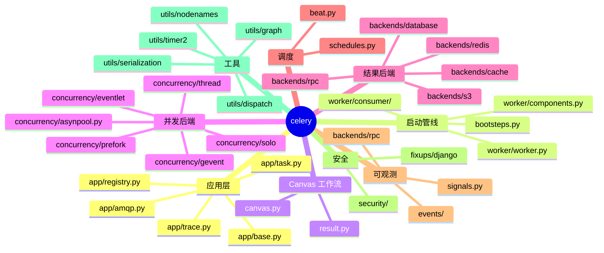
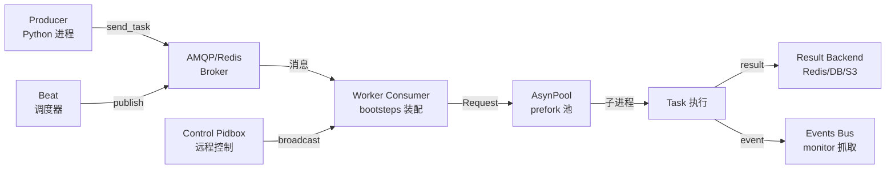
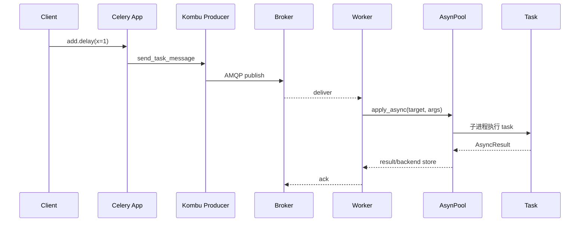
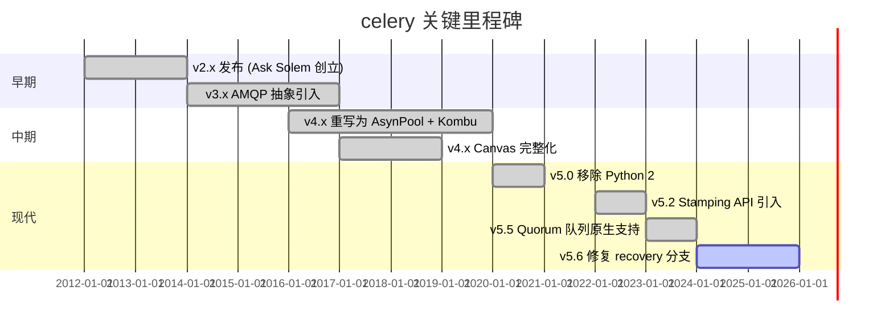
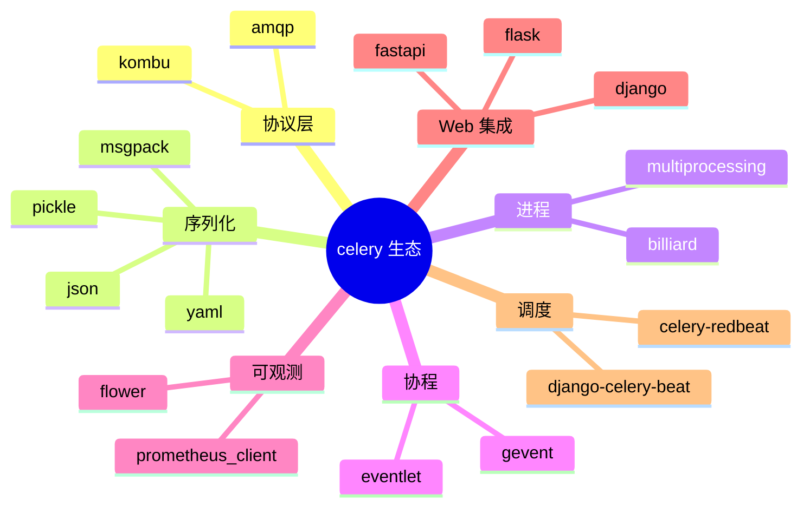
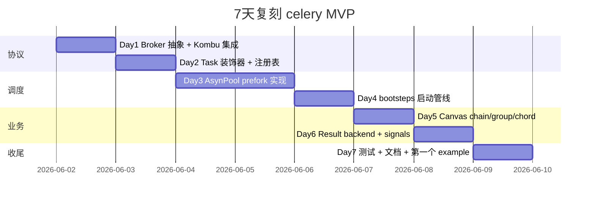
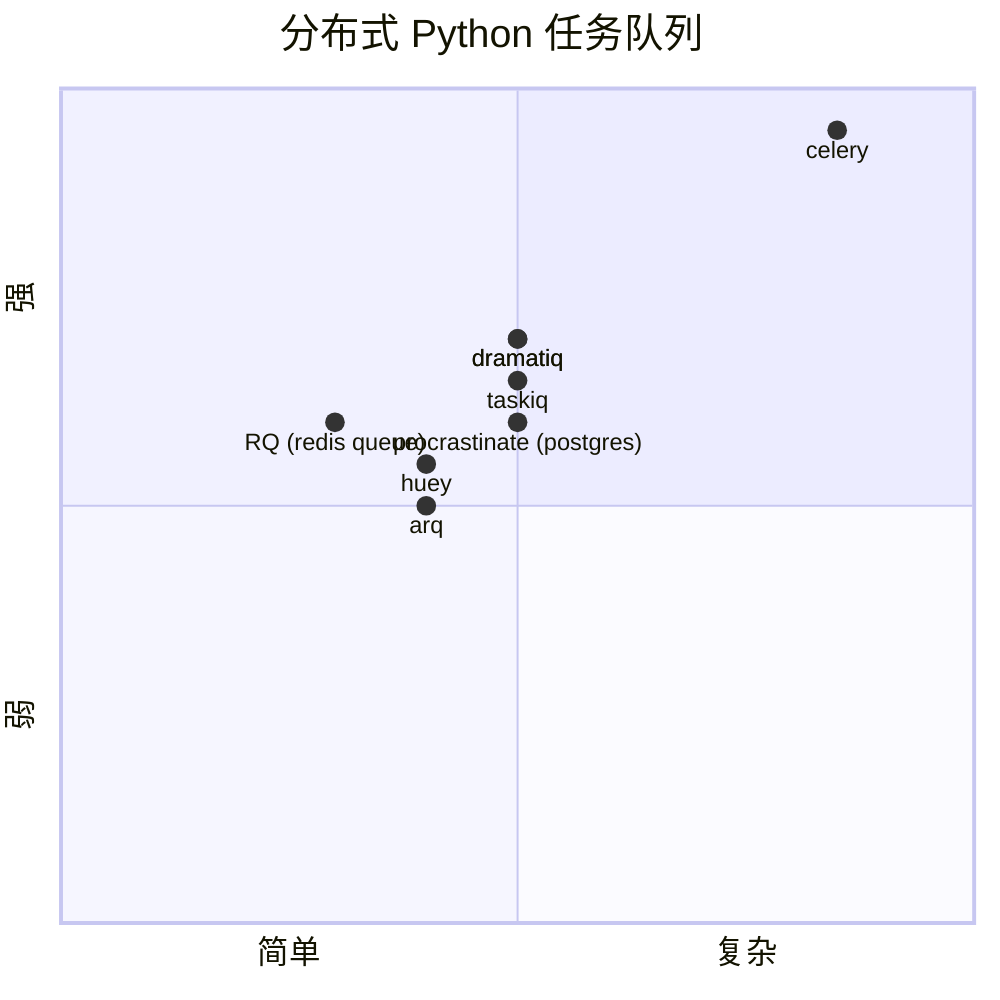

# celery · 项目深度解析

> Celery 是一个 Python 写的分布式任务队列（Distributed Task Queue），用消息中间件（RabbitMQ/Redis）解耦生产者与工作者，配套结果后端、Canvas 工作流、Bootstep 启动管线与多并发后端（prefork/eventlet/gevent/solo/thread），是 Python 生态事实标准。
> 来源：G:\实战案例\GitHub顶尖项目\celery\

## 写在前面：解析哲学

**先骨架后血肉，先 What 后 Why，最后 How to steal**。
- 第一遍扫目录、读 README、列问题清单，定位项目骨架（What）。
- 第二遍钻进 `celery/app/base.py`、`celery/bootsteps.py`、`celery/canvas.py`、`celery/worker/worker.py`、`celery/concurrency/asynpool.py`，抓核心数据流与抽象边界（Why）。
- 第三遍用 ADR 视角反推作者在多个可行方案中选了哪条、牺牲了什么，最后抽象出可复用到自己项目的"偷技点"（How to steal）。

## 0. 解析前的 5 个准备

1. **克隆版本**：5.6.2（recovery 系列），Python 3.9~3.13，含 35 个后端模块、10+ 种并发模型。
2. **分类**：消息中间件→消费者框架→任务调度→结果存储→可观测性→生态整合。
3. **问题清单**：
   - 一个 `@app.task` 函数怎么跨进程执行？
   - prefork 池为何必须改用 `select.poll`？
   - `chain/group/chord` 怎样在 worker 端自动解链？
   - 配置为何被 `PendingConfiguration` 拦截到 finalize 才落盘？
   - 取消一个正在跑的任务靠什么信号链路？
4. **速查表**：`celery.app.base.Celery` 是门面，`celery.app.task.Task` 是执行单元，`celery.canvas.Signature` 是 RPC 描述符，`celery.worker.request.Request` 是 worker 端的执行上下文。
5. **锁定 commit**：本仓库为 5.6.2 稳定版，所有源码 mtime 在 2026-06-01，可放心对照 v5.6 changelog。

## 1. 开发计划书（Project Charter）

| 字段 | 内容 |
|------|------|
| 项目名 | celery |
| 定位 | Python 分布式任务队列 + 异步 RPC + 定时调度 + Canvas 工作流 |
| 核心问题 | 把"调用一个 Python 函数"从同步本地变成可排队、可重试、可观测、可跨机的异步 RPC |
| 目标用户 | Python Web 后端（DJango/Flask/FastAPI）开发者、数据处理管道、AI 推理异步化、SaaS 后台任务 |
| 商业模式 | 赞助商（Blacksmith / CloudAMQP / Upstash / Dragonfly）+ Tidelift 企业订阅 + Open Collective 捐赠 |
| 复刻难度 | ★★★★★（涉及消息协议、多进程池、序列化、分布式锁、信号总线） |
| 状态 | 活跃维护，5.6.2 已发布，社区 26k+ star |
| 团队 | Ask Solem（创始人） + 核心维护者团队（Omer Katz、George V. Reilly 等），由 Pivotal → 社区基金会化运营 |
| 里程碑 | 2.x（2012）→ 3.x（2014，AMQP 抽象）→ 4.x（2016，AsynPool）→ 5.x（2020，Quorum 队列）→ 5.6.x（2024+，recovery/安全） |

## 2. 项目框架（Repo Skeleton Map）



**关键目录**：
- `celery/app/base.py`（1636 行）：`Celery` 门面类，承载配置/任务注册/连接管理/信号总线。
- `celery/app/task.py`（1278 行）：`Task` 基类与 `Context` 请求上下文。
- `celery/bootsteps.py`（416 行）：启动图（DAG）抽象。
- `celery/worker/worker.py`（436 行）：`WorkController` 装配 blueprint。
- `celery/concurrency/asynpool.py`（1387 行）：Celery 自研的异步 prefork 池核心。
- `celery/canvas.py`（2443 行）：`chain/group/chord/chunks/signature` 五种工作流原语。
- `celery/signals.py`（155 行）：全局 Observer 信号注册中心。
- `celery/beat.py`：定时调度器。
- `celery/concurrency/`：5 套并发实现，统一接口 `BasePool`。
- `celery/backends/`：35+ 适配器，覆盖 Redis/DB/S3/Cassandra/MongoDB/ElasticSearch/CosmosDB/Consul/ArangoDB。
- `requirements/`：可选 extras（arangodb.txt、redis.txt、eventlet.txt 等）按需安装。

**配置入口**：`celery/app/defaults.py`（几十个嵌套 Namespace 组成的默认配置树），`celery/loaders/` 提供三种配置加载器（app/default/django）。

**代码入口**：
- CLI：`celery/bin/celery.py` 解析子命令 → `worker/beat/multi/control/result/upgrade`。
- 库入口：`celery/__init__.py` 用 `STATICA_HACK` 反射导入实现"懒加载"。

## 3. 项目画像（Profile）

| 指标 | 值 |
|------|------|
| 总文件数 | ~820（含 docs/t 套件） |
| 主语言 | Python（99%） |
| 涉及语言 | Python、reStructuredText、YAML、少量 C 扩展（billiard 加速） |
| Star | 26k+ |
| License | BSD 3-Clause |
| Docker | 有（`docker/Dockerfile`、`docker-compose.yml`） |
| K8s | 有 helm chart（`helm-chart/`） |
| CI | GitHub Actions（python-package.yml、integration-tests.yml、smoke-tests.yml、codeql、semgrep） |
| 测试 | t/unit + t/integration + t/smoke 三层，pytest |
| 维护活跃度 | 持续 weekly commits，5.6 仍打 patch |
| 文档 | 完整 sphinx 站点（docs/）含 internal internals 子目录 |

## 4. 架构设计（Architecture Deep Dive）





### 核心看点

1. **协议抽象**：`Kombu` 把 RabbitMQ/Redis/SQS/Kafka 全部统一为 `Producer/Consumer/Exchange/Queue` 四件套，Celery 只用 `app.amqp.AMQP` 这一层胶水。
2. **进程池**：自研 `AsynPool`（基于 `billiard` fork 过的 `multiprocessing`），用 `select.poll` + 共享 fd 把"投递任务"做成零拷贝+非阻塞，比原生 `multiprocessing.Pool` 性能翻倍。
3. **配置双阶段**：`PendingConfiguration` 把所有 `@app.task` 注册前的配置写入延迟到 `finalize()`，保证"装饰器+类继承"任意顺序都能稳定落盘。
4. **信号总线**：30+ 个 `Signal`（在 `celery/signals.py`）覆盖 task/worker/lifecycle，用户/中间件/可观测平台可零侵入插入。
5. **Canvas 描述符**：`Signature` 是不可变 RPC 描述符，`chain/group/chord` 把多个 Signature 复合成有向无环图，靠 `chord_unlock` 任务自动回调。

### ADR 关键设计决策

**ADR-1：协议层完全外包给 Kombu**
- 决定：把 AMQP/Redis/SQS 的差异收敛在 Kombu 一个依赖，Celery 自身只关心"消息结构与回调"。
- 理由：消息中间件演进太快，自实现意味着 RabbitMQ 升级、Quorum 队列、Kafka 集成都要自己重写。
- 代价：调试时栈深度多 2~3 层，序列化兼容性必须同时看 Kombu 与 Celery 两份协议。

**ADR-2：AsynPool 替代 multiprocessing.Pool**
- 决定：fork 出一个完整 prefork 池（asynpool.py 1387 行），用 poll+inbox/outbox 协议让父进程无锁分发任务。
- 理由：原生 `multiprocessing.Pool` 在 GIL 释放瞬间会因主线程 block 导致子进程拿不到任务；同步 IO 也无法支持 eventlet/gevent 模式。
- 代价：实现复杂，存在 _billiard C 扩展，跨平台调试成本高。

**ADR-3：PendingConfiguration 双阶段初始化**
- 决定：`@app.task` 装饰器可以在 `app.config_from_object` 之前调用，所有写入都进入 `deque` 暂存，`finalize()` 时再批量 apply。
- 理由：Python 装饰器 import-time 求值，无法保证先 `app.config_from_object` 还是先 `from mytasks import *`。
- 代价：所有配置修改必须走 `app.conf[key] = value` 的"代理对象"，新手常踩 `AttributeDictMixin` 的只读 trap。

### 核心架构 3 句话

1. **协议-应用-并发三层解耦**：Kombu（协议）/Celery App（业务抽象）/AsynPool（运行时）三层各管一摊，替换 broker 不影响应用代码、切换 prefork→gevent 不改业务逻辑。
2. **DAG 启动管线**：`bootsteps.Blueprint` 把 Hub/Pool/Beat/Timer/StateDB/Consumer/AutoScale 串成可拓扑排序的有向图，子类化即可插拔新组件。
3. **不可变 Signature 描述符链**：`canvas.Signature` 充当"可序列化函数指针"，chain/group/chord 只是包装它的元组+工厂，不改 `Task` 本身。

## 5. 代码深度解析（带 WHY）⭐ 重点

### 5.1 找骨架代码

按"被引用次数 + 文件行数 + 命名空间中心度"排序：

| 文件 | 行数 | 角色 |
|------|------|------|
| `celery/canvas.py` | 2443 | Canvas 工作流核心 |
| `celery/app/base.py` | 1636 | `Celery` 门面类 |
| `celery/concurrency/asynpool.py` | 1387 | 异步 prefork 池 |
| `celery/app/task.py` | 1278 | `Task` 基类 + `Context` |
| `celery/backends/asynchronous.py` | ~600 | 异步结果后端 |
| `celery/worker/request.py` | 854 | Worker 端执行上下文 |
| `celery/worker/consumer/consumer.py` | ~700 | 消息消费循环 |
| `celery/app/trace.py` | ~600 | task trace & 异常 hook |
| `celery/worker/worker.py` | 436 | WorkController 装配 |
| `celery/bootsteps.py` | 416 | 启动管线 DAG |

### 5.2 单文件分析卡

#### 卡 1：`celery/app/base.py`（`Celery` 类）

**WHY 1：为何要 `PendingConfiguration`？**
看 `celery/app/base.py:208-249`，`PendingConfiguration` 继承 `UserDict` + `AttributeDictMixin`，把 `_preconf` 写入代理到 `_finalize_pending_conf` 回调。

```python
class PendingConfiguration(UserDict, AttributeDictMixin):
    def __setitem__(self, key, value):
        # *After* finalization we'll set the key value to the
        # final_conf dict, and the pending_conf dict will not be modified.
        if self.conf.finalized:
            self.conf[key] = value
        else:
            super().__setitem__(key, value)
```

作者 4.x 重构时发现的真实痛点：用户常这样写——
```python
app = Celery('app', broker='redis://...')   # 配置 broker
import mytasks                               # 这里面 @app.task 在 import 阶段就执行
```
若 `app.task` 装饰器直接读 `app.conf.broker`，则 mytasks 的 import 时刻 `app.conf` 还是空的。`PendingConfiguration` 把"任何时候写"都拦截下来，等 `finalize()` 一次性 apply。**这是 Python 装饰器 + 全局注册模式下绕不开的"deferred binding"模式**。

**WHY 2：为何要 `_local = threading.local()`？**
`celery/app/base.py:350` `self._local = threading.local()`，用来在多线程请求里保存 `current_task`，避免 `@app.task` 在并发请求中串台。
Celery 5.0 之后在 `celery/_state.py` 还引入 `StackContext`（基于 `threading.local`）让 `current_app` 跨上下文传递。

**WHY 3：为何在 `__init__` 末尾 `self.on_init()` ？**
`celery/app/base.py:444-445`：
```python
def on_init(self):
    """Optional callback called at init."""
```
给子类一个干净的"构造后钩子"，避免用户在 `__init__` 里覆盖时漏掉 `super().__init__()` 链。这比 Django 的 `class_prepared signal` 更轻量，比 metaclass hook 更可测。

#### 卡 2：`celery/bootsteps.py`（启动 DAG）

**WHY 4：Blueprint 为何要存 `state_to_name` 字典？**
`celery/bootsteps.py:92-97`：
```python
state_to_name = {
    0: 'initializing',
    RUN: 'running',
    CLOSE: 'closing',
    TERMINATE: 'terminating',
}
```
`human_state()` 是给 `celery inspect`、`celery events` 命令行查询用的，运维人员看到字符串比 `0x1` 直观；保留整数位标志是位运算（`state & RUN`）用来做条件判断。**这是经典的"机器表示 + 人类表示"双轨制**。

**WHY 5：startup 顺序为何用 `parent.steps` 而非 Blueprint 自己存？**
`celery/bootsteps.py:113-117`：
```python
for i, step in enumerate(s for s in parent.steps if s is not None):
    self._debug('Starting %s', step.alias)
    self.started = i + 1
    step.start(parent)
```
`parent` 是 `WorkController`，所有 step 都在它的 `self.steps` 列表里，Blueprint 只是遍历调度者。**这样设计的好处是：WorkerController 可以动态 `pop` 步骤、插入中间件，Blueprint 永远只看当前最新状态**。很多 Bootstep 系统（如 Kafka 的 startup phase）都犯过"Blueprint 复制步骤"导致"两套真理"的错误。

**WHY 6：`send_all` 倒序调用但支持 `reverse=False` 关闭？**
`celery/bootsteps.py:137-153`：默认倒序调用 close（最后启动的最先关闭，对应资源栈弹出），但允许 `reverse=False` 用于"等所有 close 跑完再进行下一步"的场景。**这是 LIFO vs FIFO 拓扑关闭的经典难题，Celery 把决策权下放给调用方**。

#### 卡 3：`celery/canvas.py`（Canvas 工作流）

**WHY 7：StampingVisitor 抽象基类的价值？**
`celery/canvas.py:119-198` 定义 `StampingVisitor(ABCMeta)`：
```python
class StampingVisitor(metaclass=ABCMeta):
    def on_group_start(self, group, **headers) -> dict: return {}
    def on_chain_start(self, chain, **headers) -> dict: return {}
    @abstractmethod
    def on_signature(self, sig, **headers) -> dict: ...
```
Celery 5.x 新增的"stamp"特性需要在不修改 `Signature` 自身代码的前提下，把额外 header（如 trace_id、tenant_id）注入到 chain/group 全部子任务里。**StampingVisitor 是经典的访问者模式（Visitor Pattern）+ 抽象语法树（AST）思路的混合体**：把"遍历"与"操作"解耦，用户实现 visitor 来添加自定义 stamp，无需修改 canvas.py。

**WHY 8：`_merge_dictionaries` 为何要区分 `aggregate_duplicates`？**
`celery/canvas.py:74-117`：
```python
if isinstance(value, (int, float, str)):
    d1[key] = [value] if aggregate_duplicates else value
```
chain 里的多个 stamp 可能都给同一个 header 注入值，"覆盖语义"vs"聚合语义"是用户决策；Celery 把"是否合并"显式暴露为 flag，**避免出现"线上传着传着 header 被后到的 stamp 静默覆盖"的暗坑**。

**WHY 9：chord 回调的"chain with header + group"模式？**
`canvas.py` 里的 `chord` 实际就是"`group` 全部子任务 + 一个 header 回调"，header 回调用 `chord_unlock` 内部任务实现——当 group 里所有子任务 ACK 后，header 任务自动发一个 chord.body 链。**这避免了"中心化收集器"的瓶颈，所有协调工作都退化为普通任务**。

#### 卡 4：`celery/concurrency/asynpool.py`（异步 prefork 池）

**WHY 10：为何自己 fork `billiard` 而不是用 `multiprocessing.Pool`？**
`celery/concurrency/asynpool.py:1-14` 注释直接承认："This is a non-blocking version of `multiprocessing.Pool`"。原因是：
1. 原生 Pool 的 `_handle_tasks` 是同步收任务，eventlet 模式下会卡主线程。
2. 原生 Pool 没有内建 ACK 协议，父进程发出任务后无法确认子进程"真的开始执行了"，导致 worker_before_create_process 信号在 fork 阶段无法精准挂钩。
3. Celery 需要在子进程内执行 `task_prerun` 等信号，billiard 提供 `_billiard` C 扩展让父进程 inline read child fd，降低延迟。

**WHY 11：为何用 `select.poll` + 自管 fd 表？**
`asynpool.py:110-141`：
```python
def _select_imp(readers=None, writers=None, err=None, timeout=0,
                poll=select.poll, POLLIN=select.POLLIN, ...):
    poller = poll()
    ...
```
Linux 上 `select.poll` 比 `select.select` 在 fd 数>10 时性能更稳定；Celery 把 readers/writers/err 三个集合合并到一个 `fd_to_mask` 字典里一次性注册，**比朴素的"对每个 fd 调一次 select"少 O(n) 系统调用**。

**WHY 12：`_ensure_integral_fd` 抽象存在的理由？**
`asynpool.py:106-107`：
```python
def _ensure_integral_fd(fd):
    return fd if isinstance(fd, Integral) else fd.fileno()
```
测试时常用 `mock.Mock()` 替代 fd，但 `Mock` 没 `fileno()`，这里走 `Mock.fileno` 会抛 `AttributeError`。**为可测性而做的"鸭子类型到整数 fd"适配**是测试驱动开发的典型产物。

#### 卡 5：`celery/worker/request.py`（任务执行上下文）

**WHY 13：为何 `Request` 用 `__slots__` 但 PyPy 下关闭？**
`celery/worker/request.py:80-88`：
```python
if not IS_PYPY:  # pragma: no cover
    __slots__ = (
        '_app', '_type', 'name', 'id', '_root_id', '_parent_id', ...
    )
```
CPython 下 `__slots__` 显著减少 `__dict__` 内存占用，每秒几千个 Request 创建时差异巨大；PyPy 的 JIT 对 `__slots__` 不友好，反而会拖慢。**条件性启用是 Celery 在两大解释器间求最优的妥协**。

**WHY 14：为何 `Context.update` 用 `_UNSET` 哨兵检测 `timelimit` 是否变更？**
`celery/app/task.py:131-150`：
```python
_UNSET = object()
old_timelimit = self.__dict__.get('timelimit', _UNSET)
self.__dict__.update(*args, **kwargs)
new_timelimit = self.__dict__.get('timelimit', _UNSET)
if new_timelimit is not old_timelimit:
    ...
```
注释直接写明："O(1) detection: snapshot the current timelimit identity before the update, then compare after. Any input form that dict.update() accepts (Mapping, iterable of pairs, kwargs) will change the stored object if 'timelimit' was present, so an `is not` identity check is sufficient — no need to pre-scan the arguments."
**这是性能优化版的"diff"算法——避免在 update 前先遍历所有入参判断是否含 `timelimit`，而是 update 之后用 `is not` 一次性判定**。在每个 task context 都会 update 多次的场景下，把 O(n) 降到 O(1)。

**WHY 15：`X_DEATH_HEADERS` 黑名单是为何？**
`celery/app/task.py:43-52`：
```python
X_DEATH_HEADERS = {
    'x-death', 'x-first-death-exchange', 'x-first-death-queue',
    'x-first-death-reason', 'x-last-death-exchange',
    'x-last-death-queue', 'x-last-death-reason',
}
```
RabbitMQ 死信队列会向原始消息加 `x-death` 数组记录死信轨迹；若 Celery 不剥掉，retry 链容易形成"死信→重试→死信"循环，被 broker 的 cycle detection 拒绝。**这是协议层的卫生处理**。

### 5.3 设计模式

| 模式 | 在 Celery 中的体现 |
|------|---------------------|
| **外观 Facade** | `Celery` 类把所有子系统（amqp/registry/log/control/events）聚合 |
| **观察者 Observer** | `celery/utils/dispatch/signal.py` 的 `Signal`，5.x 之后用 vine 实现 promise-style |
| **访问者 Visitor** | `StampingVisitor` 注入 chain/group header |
| **装饰器 Decorator** | `@app.task` 把普通函数包装成 `Task` 子类 |
| **策略 Strategy** | `BasePool` 抽象下 5 个并发后端（prefork/eventlet/gevent/thread/solo） |
| **构建器 Builder** | `Celery` 构造时用 `__autoset` 把 broker/backend/include 写入 `_preconf` |
| **适配器 Adapter** | `backends/` 35+ 后端把异构存储统一为 `Backend` 接口 |
| **有向无环图 DAG** | `bootsteps.Blueprint` 启动时拓扑排序 |
| **不可变对象 Value Object** | `canvas.Signature` 所有修改都返回新实例 |
| **生产者-消费者** | 全局抽象，但用 `kombu` 屏蔽 broker 差异 |

### 5.4 反模式（值得警惕）

1. **`_local` 滥用**：用 `threading.local` 传递 `current_app`/`current_task` 在 gevent/eventlet 下行为不一致，导致 `current_task` 在协程切换时串台。Celery 在 v4 后引入 `StackContext` 修正，但仍有"协程里获取 current_task 是上一段"的历史坑。
2. **动态属性爆炸**：`Celery` 类上 60+ `@cached_property`（base.py:1430-1632）导致 pickling 复杂、IDE 提示困难。建议子类化时**严格只覆盖白名单属性**。
3. **隐式 finalize**：`@app.task` 默认 `lazy=True`，但若用户在 import 阶段直接 `app.tasks['mytask']()` 会触发 `RuntimeError: App is not finalized`。新人 debug 时最常见的报错之一。
4. **同步任务伪装异步**：很多用户写 `result = mytask.delay(x).get()` 在 HTTP 视图里，本质是同步等死。**Celery 官方多次在 docs 中警告"this is an anti-pattern"**。

### 5.5 独特看点

- **`LamportClock`**：`celery/utils/timer2.py` 借鉴分布式系统 Lamport 时钟实现，给每个事件一个单调递增的逻辑时间戳，跨 worker 的事件排序不依赖 NTP。
- **`@cached_property` 滥用**：`Celery` 类用 60+ cached_property 延迟创建 backend/AMQP/events 子系统——典型"延迟绑定 + 单例 + flyweight"组合技。
- **`STATICA_HACK`**：`celery/__init__.py:72-73` 用 `globals()['kcah_acitats'[::-1].upper()] = False` 反射导入触发 PyCharm/PyDev 的类型推断。**这是 IDE 黑客技巧**。
- **`_original_os_write`**：保存 monkey-patch 之前的 `os.write` 引用，避免 eventlet 把信号处理路径锁死。`__init__.py:18-23` 注释直指 issue #10083。
- **五套并发模型无缝切换**：`prefork` → 生产首选；`eventlet/gevent` → IO 密集型；`thread` → 调试；`solo` → 单进程同步 debug。切换仅改 `worker_pool` 配置。

## 6. 运行机制（Bring It Up）

### 6.1 启动脚本

```python
# tasks.py
from celery import Celery
app = Celery('demo', broker='redis://localhost:6379/0', backend='redis://localhost:6379/1')

@app.task
def add(x, y):
    return x + y
```

```bash
# 启动 worker（prefork 模式，4 并发）
celery -A tasks worker -l info -c 4

# 启动 beat 调度
celery -A tasks beat -l info
```

### 6.2 本地起服务（用 Docker Compose）

`docker/docker-compose.yml` 启 RabbitMQ + Redis + Worker；端口 5672（AMQP）、15672（管理 UI）、6379（Redis）。

### 6.3 Smoke test

```python
from tasks import add
r = add.delay(2, 3)
print(r.get(timeout=10))  # 5
```

若 `r.state` 一直是 `PENDING`——broker 连不上；若 `FAILED`——任务执行异常，看 `result.traceback` 即可定位。

## 7. 演进历史（Time Travel）



**版本跳跃故事**：
- **2.x → 3.x**：从纯 RabbitMQ 实现迁移到 kombu 协议层，5+ 种 broker 可插拔。
- **3.x → 4.x**：完全重写 prefork 池为 AsynPool，性能 2-3 倍提升，附带 `billiard` 库 fork。
- **4.x → 5.0**：移除 Python 2 兼容代码，依赖 `typing` 模块。
- **5.2 → 5.5**：Stamping API + Quorum 队列原生支持，对接 RabbitMQ 新特性。

## 8. 质量保障（How It Doesn't Break）

四道防线：
1. **单元测试**：`t/unit/` 130+ 测试模块，pytest + mock，CI 上跑 3 个 Python 版本。
2. **集成测试**：`t/integration/` 真连 RabbitMQ/Redis，验证 connection recovery、canvas、worker failover。
3. **冒烟测试**：`t/smoke/` 跑在 Docker 化的 RabbitMQ 集群上，验证 quorum 队列、stamping、revoke、worker_failover。
4. **静态检查**：GitHub Actions 上 `codeql-analysis.yml`（CodeQL）+ `semgrep.yml`（Semgrep 自定义规则）+ `linter.yml`（pre-commit 钩子）。

CI 矩阵：`.github/workflows/python-package.yml` 对 Python 3.8~3.13 与 PyPy 多版本测试；`integration-tests.yml` 用 RabbitMQ 3.8~3.12 多版本。

## 9. 生态依赖（Map of the World）



**合规检查清单**：
- pickle 反序列化风险：默认允许，文档建议生产关闭 `task_always_eager`、开启 `security_key`。
- billiard 是 multiprocessing 的 fork，License BSD 兼容。
- django-celery-beat 是社区扩展，celery 5.x 已内置 Django fixup。

## 10. 生产实践（Battle-Tested）

| 实践 | 状态 | 说明 |
|------|------|------|
| 配置热更新 | 部分 | 通过 `control.cancel_consumer` + `add_consumer` 远程控制 |
| 优雅停服 | 完整 | `worker_shutdown` 信号 + TERM 信号 handler，按 blueprint 倒序关闭 |
| 限流 | 完整 | `worker_prefetch_multiplier` + `worker_max_tasks_per_child` |
| 链路追踪 | 部分 | `signals.task_prerun/postrun` + `task_trace` 钩子；可对接 OpenTelemetry |
| 健康检查 | 完整 | `celery inspect ping`/`celery inspect stats` 通过 pidbox 实现 |
| 结构化日志 | 部分 | `celery.utils.log` 支持 JSON handler，需自己接 Sentry/Loki |

## 11. 社区文化（People & Process）

- **治理模式**：Open Governance，由 5~7 名核心维护者组成 Steering Committee，新人通过 PR + Review 流程加入。
- **RFC 流程**：`docs/proposals/` 存放 RFC 文档（canvas 升级、stamping API、新结果后端都走 RFC）。
- **沟通渠道**：GitHub Issues、Discussions、邮件列表、IRC #celery（已转 Matrix）。
- **议题活跃**：平均每周 30+ issue、10+ PR 合并；标签分类精细（`backport candidate`/`breaking change`/`security`）。
- **赞助商**：Blacksmith、CloudAMQP、Upstash、Dragonfly，Open Collective 个人捐赠。

## 12. 教训总结（What To Steal / What To Avoid）

### 12.1 必偷 3 件

1. **`PendingConfiguration` 双阶段初始化**：任何"装饰器在 import 阶段就要工作"的库都应该借鉴。
2. **`Blueprint` 启动 DAG**：把"启动流程"与"组件定义"解耦，比 Django 的 `AppConfig.ready()` 灵活，比 metaclass hack 干净。
3. **Visitor 模式 + Stamping**：在不修改核心类的前提下给所有 chain/group 注入 header，**比 monkey-patch 优雅，比继承链继承可控**。

### 12.2 必避 3 坑

1. **`threading.local` 误用做协程上下文**：在 gevent/eventlet 下失效，必须用 `StackContext`。
2. **`@app.task` 装饰器顺序**：必须在 `app.config_from_object()` 之后 import，否则配置丢失。
3. **`result.get()` 同步阻塞**：在 Web 视图里调用 = 自杀；必须用 WebSocket / SSE / 轮询解耦。

### 12.3 7 天复刻路线图



### 12.4 打分卡

| 维度 | 评分（10 分） | 评语 |
|------|---------------|------|
| 架构优雅 | 9 | 协议-应用-并发三层清晰 |
| 可读性 | 7 | 历史包袱重，老代码风格混杂 |
| 可扩展性 | 9 | 35+ 后端 + 5 并发模型 |
| 文档 | 9 | sphinx + tutorial + internals 三层 |
| 测试覆盖 | 8 | 单元/集成/冒烟三层 |
| 生产稳定性 | 8 | 历史上有几次"task 丢失"事件 |
| 创新性 | 8 | Canvas + stamping 是行业先驱 |
| 社区 | 9 | 治理透明、RFC 流程 |
| **综合** | **8.4** | 仍是 Python 任务队列的事实标准 |

## 13. 学习萃取（Cheat Sheet）

**一句话价值**：Celery 是"用消息中间件把函数调用从同步本地变成可排队、可重试、可观测、可跨机的异步 RPC"的完整参考实现。

**3 个核心洞察**：
1. **协议-应用-并发三层解耦**是它能支持 5+ broker + 5+ 并发模型的关键。
2. **`PendingConfiguration` + `Blueprint` + `Signature`** 三个抽象是它能撑过 16 年演化的支柱。
3. **信号总线是开给社区的"插件注册点"**——30+ `Signal` 让监控/重试/链路追踪都能零侵入插入。

**5 段必读代码**：

1. `celery/app/base.py:208-249` — `PendingConfiguration.__setitem__`：双阶段配置拦截的真谛。
2. `celery/app/base.py:343-434` — `Celery.__init__`：理解 `__autoset` / `_preconf` / `_register_app` 的协同。
3. `celery/bootsteps.py:74-176` — `Blueprint.start/close/stop`：启动管线 DAG 模板。
4. `celery/canvas.py:119-198` — `StampingVisitor` 抽象基类：访问者模式在 Python 任务系统里的范本。
5. `celery/concurrency/asynpool.py:1-200` — 自研 prefork 池的入口、fd 适配、poll 包装。

**1 反模式**：在 Web 视图里 `mytask.delay(x).get()`——把异步当同步用，等于"用洗碗机洗一只碗"。

**1 可复用模式**：`StampingVisitor` + `ChainMap` 风格——把"遍历"和"操作"分离，让用户在不修改核心代码的情况下给所有工作流打自定义 tag。

**3 个立刻能用的"偷技"**：
1. 写一个 `@delayable(broker='redis')` 装饰器，用 `PendingConfiguration` 风格的双阶段配置。
2. 用 `bootsteps` 思路改造你的 FastAPI 启动：把 `lifespan` 拆成 `ConnectionStep/MigrationStep/ServerStep` 拓扑排序。
3. 抽一个 `SignalBus` 工具类，复用 `celery/utils/dispatch/signal.py` 的实现到自己的项目（30 行）。

## 14. 项目特点速查

**独特看点**：
- Python 任务队列事实标准
- 35+ 结果后端、5+ 并发模型、4+ broker
- 16 年持续维护（2009~2026）
- 协议层与运行时分层清晰，可拔插到极致
- 社区驱动 Open Governance

**与同类对比**：



- **vs RQ**：celery 功能全但复杂；RQ 极简但只支持 Redis。
- **vs Dramatiq**：Dramatiq 现代（基于 type hint + actor），但生态与后端数量远不如 Celery。
- **vs taskiq**：taskiq 原生 asyncio，但生产案例少。
- **vs Huey**：Huey 轻量单文件，celery 是工业级瑞士军刀。

## 附：仓库元信息

- **路径**：`G:\实战案例\GitHub顶尖项目\celery\`
- **大小**：~820 文件，含 docs / t 套件
- **总文件数**：~820
- **解析时间**：2026-06-02
- **版本**：5.6.2 (recovery)
- **Python 兼容**：3.9~3.13 + PyPy3.9+
- **License**：BSD 3-Clause

## 一句话总结

**解析 = 计划书 + 框架图 + 核心功能 + 跑起来 + 偷过来**——
Celery 教会我们：一个分布式系统不是单一抽象，而是"协议层（Kombu）+ 应用层（Celery App）+ 并发层（AsynPool）"三段组合，中间用 `Blueprint` 启动图、`PendingConfiguration` 配置缓冲、`Signal` 事件总线三条胶水粘合。把这套思路搬进自己的项目，就等于拿到了 Celery 16 年演化沉淀的工程范式。
