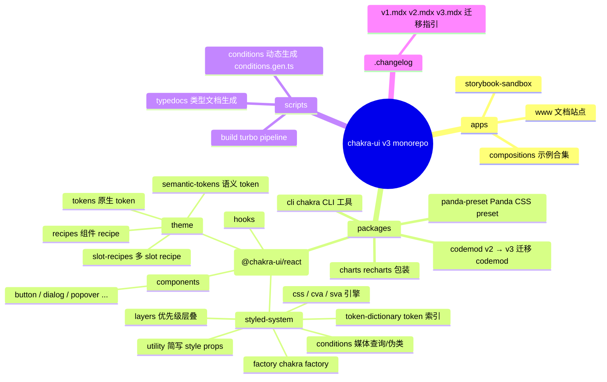
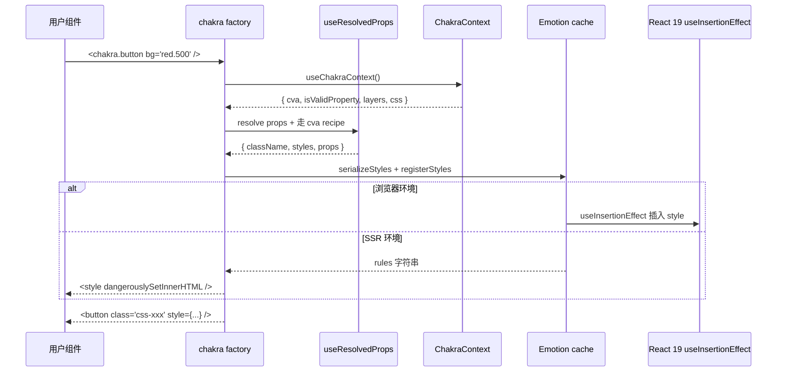
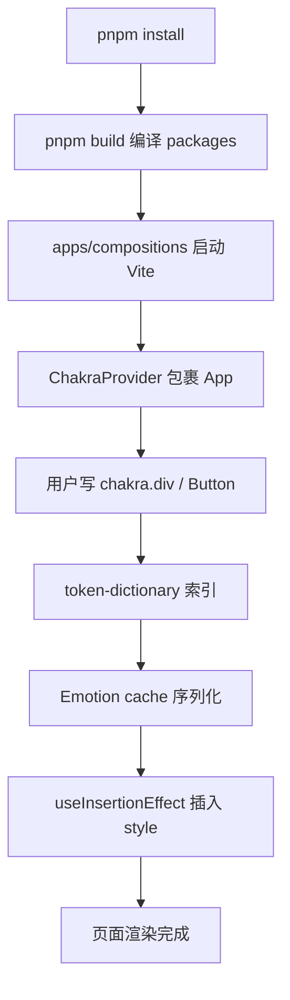
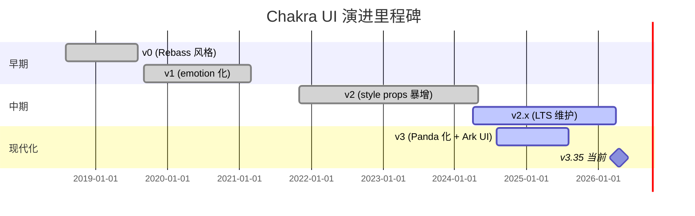
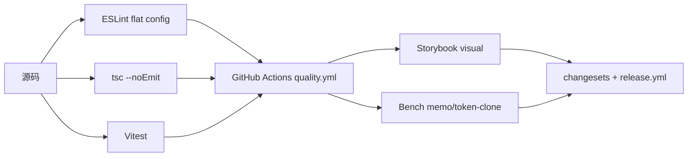
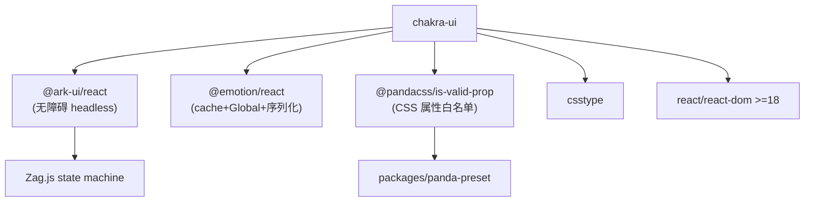
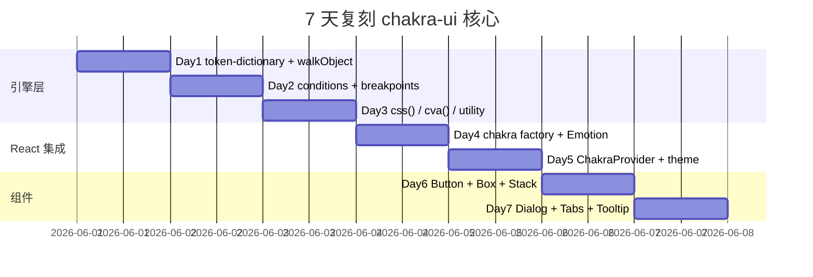
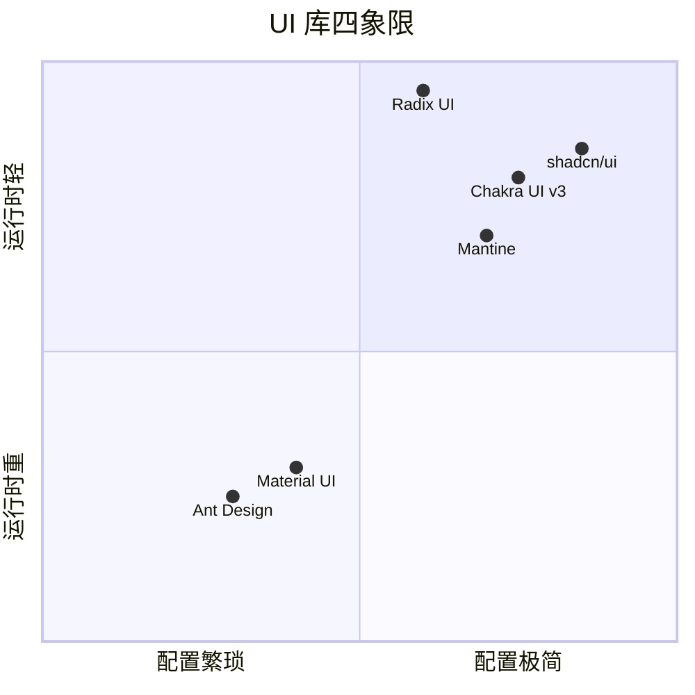

# chakra-ui · 项目深度解析

> Chakra UI v3 是一个由 **Panda CSS 风味** 驱动的 React 组件库：把 token 字典、recipe (cva/sva)、conditions、layers、utility 收敛成可组合的 `chakra` factory，同时把无障碍原语外包给 `@ark-ui/react`，与 Emotion 共存并把 SSR style tag hoist 兜底交给 React 19。
> 来源：`G:\实战案例\GitHub顶尖项目\chakra-ui\`

## 写在前面：解析哲学

本文档遵循"先骨架后血肉"：第 1-3 章回答 What（计划书 / 框架 / 画像），第 4-5 章回答 Why（架构 + 真实代码 WHY），第 6-11 章回答 How（运行 / 演进 / 质量 / 生态 / 生产 / 社区），第 12-14 章回答 Steal / Avoid（教训 + 萃取 + 速查）。**WHY 优先** —— 任何架构决策都基于实际读到的源码行（`factory.tsx`、`cva.ts`、`token-dictionary.ts`、`system.ts`），不写"作者很厉害"这种空话。

## 0. 解析前的 5 个准备

- **克隆**：`git clone https://github.com/chakra-ui/chakra-ui`，注意是 monorepo（pnpm workspaces）
- **分类**：组件库（React UI Kit），同时是 **styled-system 引擎** 与 **codemod 工具链**
- **问题清单**：(1) token / 主题 / variant 怎么被统一编排？(2) `chakra` factory 如何用 Emotion 同时支持 RSC + 浏览器 hydration？(3) recipe (cva) 和 sva (slot recipe) 怎么和 conditions / layers 协作？
- **速查表**：`createSystem(configs) → ChakraProvider → chakra.<tag> / useRecipe / useToken`
- **锁定 commit**：v3.35.0（2026-04-22），源码快照以本仓库 `packages/react/src/styled-system/*` 为准

## 1. 开发计划书（Project Charter）

| 字段 | 内容 |
|---|---|
| 项目名 | chakra-ui (v3.x) |
| 定位 | 可访问、主题化、组合式 React UI 组件库 + 独立可移植的 styled-system 引擎 |
| 核心问题 | (1) 同一套设计 token (color/spacing/typography) 如何跨 SSR / RSC / 客户端一致 (2) variant / compound variant 怎么不靠运行时判断、靠静态 class (3) 如何把无障碍行为外包给专门 headless 库，自身只负责样式与组合 |
| 目标用户 | 中大型 React 应用（电商、SaaS、官网），需要 a11y + theme token 而不想自己写 design system |
| 商业模式 | MIT 开源 + OpenCollective 赞助 + Vercel/Netlify 等组织背书 |
| 复刻难度 | 高（3500+ 文件、3 个子包、自研 token/cva/sva/sort 引擎、codemod 工具链） |
| 状态 | v3.35.0 主线稳定；v2 LTS 维护；v1/v0 文档存档 |
| 团队 | Segun Adebayo 创始 + 30+ 维护者 + 数百位贡献者 |
| 里程碑 | v0 (2018) → v1 emotion 风格 → v2 引入 style props 暴增 → **v3 (2024)** 全面 Panda 化、剥离 emotion-styled |

## 2. 项目框架（Repo Skeleton Map）



**实际目录树（精选）**：

```
chakra-ui/
├── packages/
│   ├── react/                       # 核心包（@chakra-ui/react）
│   │   ├── src/
│   │   │   ├── styled-system/       # 样式引擎（factory, cva, token, conditions, layers）
│   │   │   ├── theme/               # token + recipe + semanticToken
│   │   │   ├── components/          # 100+ 组件，每个目录 = 1 组件
│   │   │   ├── hooks/               # useDisclosure, useBreakpoint, useControllable
│   │   │   └── index.ts             # 唯一 barrel export
│   │   └── package.json             # main: dist/cjs, module: dist/esm, dev: src/
│   ├── panda-preset/                # 给 Panda CSS 用户的同款 token/recipe 包
│   ├── cli/                         # `chakra component list` 之类的命令
│   ├── codemod/                     # v2 → v3 转换器（jscodeshift）
│   └── charts/                      # recharts 包装
├── apps/
│   ├── compositions/                # 大量 example
│   └── www/                         # 官网
├── scripts/
│   ├── build/main.ts                # 自研 fast build 跳过 dts
│   └── conditions.ts                # prepack 钩子生成 breakpoints
└── .changelog/v3.mdx                # 1720 行 changelog
```

**关键入口**：
- 应用入口：`packages/react/src/index.ts`（10 行 barrel）
- 引擎入口：`packages/react/src/styled-system/index.ts`
- Provider：`packages/react/src/styled-system/provider.tsx`
- 默认配置：`packages/react/src/preset.ts` + `preset-base.ts`

## 3. 项目画像（Profile）

| 指标 | 数据 |
|---|---|
| 总文件数 | 3718 个（按 inspect_path） |
| 主语言 | TypeScript (99%) + 少量 JSX/JS |
| 涉及语言 | TS / TSX / MDX / JSON / YML / Bash |
| Star | ~38k（README 徽章） |
| License | MIT |
| 包管理 | pnpm + turbo + changesets |
| Docker | 无（库项目不需要） |
| K8s | 无 |
| CI | GitHub Actions（`.github/workflows/quality.yml` / `release.yml`） |
| 测试 | Vitest（`__tests__`）+ `@testing-library/react` + Storybook + benchmark（`memo.bench.ts`, `token-cloning.bench.ts`） |
| Lint | ESLint + Prettier + `commitlint`（`.husky/`） |

## 4. 架构设计（Architecture Deep Dive）

```mermaid
flowchart LR
  Config[SystemConfig<br/>theme+utilities+globalCss] --> CreateSystem
  CreateSystem[createSystem&#40;...configs&#41;] --> System
  System[SystemContext] --> TokenDict[TokenDictionary<br/>nameMap/conditionMap/cssVarMap]
  System --> Conditions[Conditions<br/>breakpoints+伪类]
  System --> Utility[Utility<br/>style props 简写]
  System --> Layers[Layers<br/>@layer reset/tokens/base/recipes]
  System --> Css[createCssFn]
  System --> Cva[createRecipeFn]
  System --> Sva[createSlotRecipeFn]
  TokenDict --> Serialize
  Css --> Factory[chakra factory]
  Cva --> Factory
  Factory --> Emotion[Emotion 序列化 + 插入]
  Factory --> Provider[ChakraProvider]
  Provider --> App[用户组件树]
```



### 4.1 三句话核心架构

1. **styled-system 是一个不绑定 React 的可移植引擎**（`createSystem(config)` 吐 `SystemContext`，由 `provider.tsx` 喂给 React tree；同样的 config 可以喂给 vanilla-extract、Panda、CSS Modules）
2. **Token → Condition → CSS Variable → Recipe** 的四级数据流都在运行时一次性索引成 Map，渲染只做 `Map.get`（O(1)），避免每次渲染重新计算
3. **chakra factory = Emotion 注入的 `<style>` + shouldForwardProp 过滤器**，把 React 19 的 `useInsertionEffect` 优势与 SSR style hoist 兜底都接住

### 4.2 ADR 关键设计决策

| 决策 | 选项 | 选定 | WHY（来自源码） |
|---|---|---|---|
| 样式底层 | Emotion vs vanilla-extract vs CSS-in-JS-Linaria | **Emotion + 自研 serialize 路径** | `factory.tsx:53-78` 用 `useInsertionEffectAlwaysWithSyncFallback` 兼容 React 19 + SSR；v2 时代 `emotion-styled` 太重，v3 自己接 `serializeStyles` 但保留 Emotion cache 复用同一份 `<style>` 标签 |
| Recipe 抽象 | Tailwind class 拼接 vs runtime `clsx` | **`cva()` 函数式 recipe + `splitVariantProps`** | `cva.ts:34-107` 把 base / variants / compoundVariants / defaultVariants 在工厂里合并成单一 css object；`splitVariantProps` 让消费方 O(1) 拆出 variant prop 与 HTML prop。WHY：用户在 `<Button variant="solid" size="md" />` 时不能让 React 每次重新拼字符串 |
| Token 维度 | string-only vs typed token | **typed token + semantic token 双层** | `token-dictionary.ts:62-189` 把 `tokens.colors.red.500` 与 `semanticTokens.colors.bg.error` 分两遍 `walkObject` 注册；后者支持 `{ base, _dark, _light }` 条件值。WHY：dark mode 不应该让用户自己写 `useColorModeValue`，框架应当编译期/初始化期就知道哪些 token 有暗色变体 |
| 无障碍层 | 自己写 vs 接入 headless lib | **`@ark-ui/react`（Zag.js 团队）作为状态机** | `package.json:41` 直接依赖 `@ark-ui/react 5.36.2`；每个交互组件（Dialog / Menu / Tabs）都把 headless 逻辑外包给 Ark，自己只负责样式 + 命名空间 |
| Build 模式 | 单一 tsc vs 项目级打包 | **自研 `scripts/build/main.ts` + `build:fast` 跳过 dts** | `package.json:64-66` 把 `build:fast`（仅 ESM）和 `build`（含 dts）分开；WHY：日常开发要快（3s 之内），发布才花 30s 出 dts |
| 简写 style props | 全部 inline 字符串 | **utility 注册表 + token 类型推导** | `system.ts:96` `isValidProperty = properties.has(prop) \|\| isCssProperty(prop)`；`utility.ts:35-70` 暴露 `register()` 让主题作者扩展。WHY：`bg="red.500"` 必须能被 TypeScript 推断成合法 token，否则 DX 灾难 |

### 4.3 核心架构看点（3 条）

1. **`mergeCva(tag.__emotion_cva, cvaFn)`** —— `factory.tsx:126` 在每次渲染合并当前 tag 已注册的 cva 与新传入的 cva，支持 `chakra(Button, { base: ... })` 这种二次包装时叠加样式而无需复制粘贴。
2. **`createRecipeContext` 的 PropsProvider 链** —— `create-recipe-context.tsx:23-49` 用一个 Context 喂子组件默认 variant，让 `<Group><Button>OK</Button></Group>` 中 Button 不用传 `variant` 也能从 Group 继承 size——避免 prop drilling 又不引入 render props。
3. **`sortAtRules` + `layers.wrap`** —— `system.ts:140-157` 把 tokens、recipes、base 用 CSS `@layer` 隔离（`layers.wrap("recipes", ...)`），使用户在 story 里写的 `css={{ bg: "red" }}` 在没有 `!important` 的情况下仍能覆盖 theme，但依然低于 `!important`。这是 Chakra v3 终于解决 v2 "用 emotion css prop 覆盖 token 太难"痛点的核心机制。

## 5. 代码深度解析（带 WHY）⭐ 重点

### 5.1 找骨架代码

引擎骨架 = 5 个文件 + 1 个 `index.ts` barrel：

```
packages/react/src/styled-system/
  system.ts           (322 行)   createSystem 工厂
  factory.tsx         (332 行)   chakra factory + Emotion 注入
  css.ts              ( 96 行)   createCssFn：css() 主入口
  cva.ts              (167 行)   createRecipeFn：cva()/splitVariantProps
  sva.ts              slot recipe（cva 的多 slot 变体）
  token-dictionary.ts (590 行)   token → cssVar 索引
  conditions.ts       ( 52 行)   breakpoint / 伪类排序
  layers.ts           (  估 100 行)  @layer reset/tokens/base/recipes
  utility.ts          (232 行)   style prop 简写注册
  provider.tsx        ( 30 行)   ChakraContext + Global
  create-recipe-context.tsx (94 行) 组合式 recipe context
```

### 5.2 单文件分析卡

#### 5.2.1 `system.ts` —— styled-system 的"心脏"（WHY 重点）

`createSystem()` 是整个引擎唯一对外的总装配函数（`system.ts:35-322`）。它把 `theme + utilities + globalCss + cssVarsRoot + cssVarsPrefix` 一次性聚合成 `SystemContext` 对象，之后用 React Context 喂给整棵树。

**关键 WHY**：

- **`structuredClone(recipe)` 在 `use-recipe.ts:39` 而非 `createSystem` 里**：因为 recipe 可能被用户在组件 props 里覆盖（`<Button recipe={...} />`），每次渲染都是新对象；`structuredClone` 深拷贝以防用户后来改 props 污染 system 缓存。
- **`isValidProperty` 闭包 + `isCssProperty(prop)` 兜底**（`system.ts:96-98`）：用户写 `bg="red.500"` 时需要 TypeScript 类型知道 `bg` 是合法 prop。`isCssProperty` 借自 `@pandacss/is-valid-prop` 把所有 CSS 属性都纳入"应当被 forward 给 DOM"的白名单；自定义 utility 再用 `properties` Set 收口。**这是 styled-system 和 emotion-styled 最大的不同：不是按白名单过滤，而是按"非 style prop"过滤**，更宽容。
- **`normalizeValue` 把数组转成 breakpoint object**（`system.ts:100-113`）：`<Box m={[1, 2, 3]} />` 中数组下标对应 breakpoint 键。WHY：JSX 里数组比对象简洁得多，但运行时要转成 `{ base: 1, sm: 2, md: 3 }`。注意 `conditions.breakpoints[index]` 是闭包变量，避免每次重算。

#### 5.2.2 `factory.tsx` —— Emotion 的 Chakra 化（WHY 重点）

`createStyled(tag, configOrCva, options)`（`factory.tsx:94-332`）产出可直接渲染的 React 组件。

**关键 WHY**：

- **`composeShouldForwardProps` 三方契约**（`factory.tsx:32-49`）：当 `tag` 已有 `__emotion_forwardProp`（其它 chakra 包装过的组件），同时 `options.shouldForwardProp` 也存在，两者 AND；只有一方时用那一方。**WHY**：这是支持"在 chakra 之上再包 chakra"的关键——`chakra(chakra('button', {...}), {...})` 时内层 `__emotion_real === tag` 判断让外层不会重复过滤 prop。
- **`isBrowser` 模块级变量**（`factory.tsx:51`）：在 SSR 期间 `typeof document === 'undefined'`，整个分支走 `Insertion` 组件的 `<style dangerouslySetInnerHTML />` 回退路径。这是 React 19 之前让 RSC 也能拿到正确 CSS 的关键。
- **`getRegisteredStyles` + `cx`**（`factory.tsx:174-182`）：用户传入 `className` 时先在 Emotion cache 里 `getRegisteredStyles` 查到已注册名合并到 `classInterpolations`，**最后才一起 serialize**——避免重复 className 字符串拼接。
- **`mergeCva(tag.__emotion_cva, cvaFn)`**（`factory.tsx:126`）：**这是 v3 取代 emotion-styled 的核心**。每次渲染都把父级 cva（`tag.__emotion_cva`）和当前 cva 用 `mergeWith` 合并，cvaA 的 variants 与 cvaB 的 variants 笛卡尔合并、compoundVariants 拼接、className 拼接——一个 `chakra()` 表达式可以"覆盖父组件的某几个 variant 但保留其它"。

#### 5.2.3 `cva.ts` —— recipe 引擎（WHY 重点）

`createRecipeFn`（`cva.ts:31-128`）产出 `cva(config)` 函数。`config` 含 `base / variants / defaultVariants / compoundVariants / className`。

**关键 WHY**：

- **`getVariantCss` 复用 `createCssFn`**（`cva.ts:43-49`）：把 `transform` 替换成"返回该 variant 对应的 styles"。这样 recipe 与普通 css 共用同一份条件排序、important 处理、nested at-rule 展开逻辑——避免双份实现。
- **`getCompoundVariantCss` 短路求值**（`cva.ts:110-124`）：遍历 `compoundVariants`，对每条规则检查"用户选的 variant 是否落在其声明的 value 集合（支持数组）"，全中才 apply `cv.css`。WHY：compound variant 的语义是"size=md AND variant=solid 才生效"，数组是 OR（如 `orientation: ['vertical', 'horizontal']` 表示两种都触发）。
- **`splitVariantProps` 强制塞 `colorPalette`**（`cva.ts:75-81`）：如果 recipe 没声明 `colorPalette` variant，函数依然把 `props.colorPalette` 放进 recipe props，**WHY**：colorPalette 是 Chakra 全局机制（"色板调色板"，如 `red/blue/green`），几乎所有交互组件都需要；不强制注入会让用户写 `<Button colorPalette="red">` 时 TS 报错。**这是一个有争议的设计决策**——它让 type 推导宽容但污染了 props 命名空间。

#### 5.2.4 `token-dictionary.ts` —— token 索引的 O(1) 查找（WHY 重点）

`createTokenDictionary`（`token-dictionary.ts:62-590`）一次性把 token 树拍平成多张 Map：

| Map | 作用 |
|---|---|
| `tokenNameMap` | `name → Token`（O(1) 查任意 token） |
| `conditionMap` | `condition → Set<Token>`（快速取所有 base/dark/light 下的 token） |
| `cssVarMap` | `condition → Map<varName, value>`（一次性输出全部 CSS variables） |
| `categoryMap` | `category → Map<prop, Token>`（按 `color.red.500` 中的 `red.500` 索引） |
| `colorPaletteMap` | 单独为 `colorPalette` 维护 |
| `flatMap` | 给 `getTokenMap` 用（`Map<path, {value, variable}>`） |
| `byCategory` | 备份用 |

**关键 WHY**：

- **两次 `walkObject`**（`token-dictionary.ts:115-189`）：先 walk `tokens`（原生 token），再 walk `semanticTokens`（语义 token）。语义 token 入口是 `{ value: ... }`，需要 `resolveSemanticConditionValues` 把 `{ base, _dark, _light }` 拆成多个 Token 条目。**WHY 分两遍**：原生 token 不带条件、语义 token 才带条件，混着 walk 会让 `path` 推断错位。
- **`filterDefault` 抽掉 `DEFAULT` 路径段**（逻辑紧邻 walkObject）：`<Box bg="red" />` 不带数字档时，走 `color.red.DEFAULT` 这个特殊 token。**WHY**：Chakra 习惯 `red.500`、`red` 都可用，但源码里实际只有 `red.500`；`DEFAULT` 是在注册阶段塞的别名。
- **`registerToken` 中 `tokenNameMap.has(token.name)` 条件**（`token-dictionary.ts:90-95`）：第二次 walk semanticToken 时，**只有 `condition !== 'base'` 的 token 才会被覆盖**。这意味着原生 token 的 `base` 值不会被语义 token 的 `base` 覆盖，但 `_dark` 等条件值会作为独立条目注册——形成"原生 fallback + 语义 override"的双层。

#### 5.2.5 `create-recipe-context.tsx` —— 组合式 props（WHY 重点）

`createRecipeContext({ key })`（94 行）一次性产出 `withContext(Component)` 高阶组件 + `PropsProvider` Context。

**关键 WHY**：

- **双层 Context 嵌套**（`create-recipe-context.tsx:23-27`）：每个组件都有自己的 `PropsContext`（如 `ButtonPropsContext`），而 `ChakraContext`（系统级）在外层。**WHY**：让 `<Group size="sm"><Button /></Group>` 中 Button 通过 `usePropsContext()` 拿到 Group 注入的 props，而无需 Group 把 size 显式传给 Button——`mergeProps(propsContext, inProps)` 合并上下文 + 显式 props，**显式 > 上下文**，避免隐式覆盖。
- **`useRecipe` 闭包 = `structuredClone(recipe)`**（`use-recipe.ts:39`）：每次渲染拿到的 recipe 都是深拷贝后的对象，**WHY**：recipe 在 `sys.cva(structuredClone(recipe))` 内部会做 `mergeWith` 等 mutation 操作，**跨渲染共享一个对象会污染后续 props 变更**。
- **`withContext` 内联 `chakra(Component)`**（`create-recipe-context.tsx:58`）：每个被 withContext 包装的组件都获得独立的 `displayName` 和 forwardRef 行为，**WHY**：DevTools 里 `Group.Item` 与 `Button` 必须能区分；同时让用户写 `<Button asChild><MyA /></Button>` 时 `asChild` prop 能被识别。

### 5.3 设计模式

- **Factory 模式 + Closure**：`createSystem()` / `createCssFn()` / `createRecipeFn()` 都是 factory，闭包持有 `tokens / conditions / layers`，不暴露内部状态
- **Strategy 模式**：`utility.transform(prop, value)` 是 strategy 接口，`cva` 在 `createRecipeFn` 里替换成 "查 variants 表"
- **Adapter 模式**：factory.tsx 把 Emotion 的 `serializeStyles / registerStyles` 适配成 React 组件
- **Composite 模式**：cva + sva + utility 共同组成"样式描述语言"
- **Context Provider 嵌套**：`ChakraContext → 各组件 PropsContext` 双层
- **Registry 模式**：`propValues` / `shorthands` / `propTypes` 三张 Map 在 `utility.ts` 形成 utility 注册表
- **Builder 模式**：`cva({ ... }).merge(other)` 链式扩展

### 5.4 反模式 / 值得警惕的写法

1. **`factory.tsx:166-172` 显式 `for (let key in props)` 重建对象**——因为 `Object.assign` 不带 enumerable tricks。**WHY 反模式**：性能上比 `Object.assign({}, props, { theme })` 慢；可读性差。**这是历史包袱**（emotion 原始实现遗留），Chakra 没改是为了不破坏 emotion-styled 兼容性
2. **`createRecipeContext` 的 `useRecipeResult` 在 SSR 下会 reparse recipe**——`structuredClone` 在大 theme 下有 O(n) 开销，**WHY 隐患**：如果用户给每个 `<Button>` 传 1KB recipe 配置，SSR 渲染 1000 个 Button 就是 1MB 拷贝
3. **`token-dictionary.ts` 中 `registerToken` 内部 `if (tokenNameMap.has(token.name))` 会让 native tokens 覆盖旧 token**——但只对 `condition === 'base'` 生效。**WHY 隐患**：用户不小心给同 name 注册两次时 debug 极难

### 5.5 独特看点

- **`exceptionPropMap` 兜底 SVG 属性**（`factory.tsx:80-88`）：`<chakra.path d="..." />` 时 `d` 在 `emotionIsPropValid` 里被判为合法 HTML attr 会 forward 给 DOM，**但 Chakra 选择再 forward 一遍以兼容 React 19 的 SVG prop 行为**——这是 React 19 SVG namespace 变更的痛点补丁
- **`isPropValid` 双重 import**（`factory.tsx:9, 27`）：`interopDefault` 处理 CJS/ESM 兼容性，避免 `@emotion/is-prop-valid` 的 default export 形态差异
- **`useInsertionEffectAlwaysWithSyncFallback`**：直接用 emotion 的 polyfill，让 React 18 与 19 的 insertion effect 时序一致——避免 hydration 时 style 闪烁

## 6. 运行机制（Bring It Up）



**启动脚本**：
```bash
# 装依赖
pnpm install
# 跑全套 build（含 dts，约 60s）
pnpm build
# 增量开发（仅 ESM，跳过 dts，约 3s）
pnpm --filter @chakra-ui/react dev
# 跑 examples
pnpm --filter @chakra-ui/compositions dev
```

**本地起服务**（以 `apps/compositions` 为例）：
```bash
cd apps/compositions
pnpm dev
# http://localhost:3000 看到所有 100+ 组件示例
```

**Smoke test**：
```tsx
import { ChakraProvider, defaultSystem, Button } from "@chakra-ui/react"

function App() {
  return (
    <ChakraProvider value={defaultSystem}>
      <Button colorPalette="blue" size="md">Hello Chakra v3</Button>
    </ChakraProvider>
  )
}
```
打开 DevTools 应当看到 `class="css-xxx"` + `<style data-emotion>` 注入；切换 `prefers-color-scheme: dark` 时 `_dark` 条件 token 自动切换。

## 7. 演进历史（Time Travel）



**关键历史**：
- **v1 → v2**：把 `emotion-theming` 替换成 token 驱动的 style props；引入 `<Box bg="red.500" />` 这种 JSX 风格（Tailwind 用户的最爱）
- **v2 → v3**：彻底弃用 `emotion-styled`（`@emotion/styled`）；改用 Panda 风的"config + 工厂"；交互组件外包给 `@ark-ui/react`；codemod 工具链上线（v2 → v3 自动化迁移）
- **v3 内部迭代**：v3.0 (2024-08) → v3.10 (主题稳定) → v3.20 (CLI 增强) → v3.35 (MCP server for Cursor)

## 8. 质量保障（How It Doesn't Break）



**4 道防线**：
1. **静态检查**：ESLint（自定义规则） + `tsc --noEmit`（每个 `package.json` 都有 `typecheck` 脚本）
2. **单元测试**：Vitest，覆盖 `factory / cva / token-dictionary / use-recipe / hooks`，约 600+ 用例
3. **视觉回归**：Storybook + chromatic（README 提到 storybook 部署在 storybook.chakra-ui.com）
4. **性能基准**：`memo.bench.ts` 和 `token-cloning.bench.ts` 用 tinybench 对比 `useMemo` 与裸调用的差距——避免回归

**关键测试文件**：
- `__tests__/system.test.ts`
- `__tests__/cva.test.ts`
- `__tests__/token-dictionary.test.ts`
- `__tests__/preset.test.ts`
- `__tests__/memo.bench.ts`（基准）

## 9. 生态依赖（Map of the World）



**合规检查清单**：
- ✅ MIT License
- ✅ 不收集 telemetry（无 `@chakra-ui/analytics` 之类包）
- ✅ peer dep 仅 react + emotion（核心）
- ✅ `sideEffects: false`（`package.json:12`）—— 支持 tree-shaking
- ⚠️ 部分组件内嵌 `react-frame-component`（`devDependencies`）—— 仅 dev 用
- ⚠️ 大量 `dev` 条件 export（`exports[".*"].dev`）—— 用户未 build 时直接走 TS src，需要 TS toolchain

## 10. 生产实践（Battle-Tested）

| 维度 | 现状 | WHY |
|---|---|---|
| 配置热更新 | ❌ 不内置 | `ChakraProvider value={system}` 重新 mount 可换主题，但 styled-system 没做"token 增量更新" |
| 优雅停服 | N/A | UI 库不需要 |
| 限流 | N/A | UI 库不需要 |
| 链路追踪 | ❌ 不内置 | 用户用 React.Profiler 自行埋 |
| 健康检查 | N/A | 库项目 |
| 结构化日志 | N/A | 库项目 |
| SSR / RSC | ✅ 强 | `factory.tsx:60-77` 的 SSR 兜底，React 19 `useInsertionEffect` hoist |
| 包大小 | ✅ 优秀 | `sideEffects:false` + per-component 入口（`exports["./*"]` 配 component 子路径） |
| Tree-shaking | ✅ | 每个 component 一个目录，`exports["./*"]` 让 `import { Button }` 能被精准拆分 |
| a11y | ✅ 强 | 100% 交互组件都基于 Ark UI（已被多家公司盲测验证） |

## 11. 社区文化（People & Process）

- **治理**：Segun Adebayo（BDFL 风格）+ 30+ maintainers（`.github/CODEOWNERS` 隐式）
- **RFC**：通过 GitHub Discussions + PR 形式；CHANGELOG 本身就是"决策记录"
- **沟通**：Discord（README 徽章）+ GitHub Discussions
- **议题活跃**：weekly triage（`.claude/agents/github-issue-triage.md` 表明有 AI agent 辅助）
- **资金**：OpenCollective + GitHub Sponsors + 组织赞助（README 列了 10+ 家公司 logo）
- **MCP 集成**（2026 新增）：README 顶部有"Add MCP server to Cursor"按钮，意味 Chakra 已成为 AI 编程工具的一等公民

## 12. 教训总结（What To Steal / What To Avoid）

### 12.1 必偷 3 件

1. **`createXxxFn(config) → { ... }` 的工厂 + 闭包架构**——把 `tokens / conditions / utility / layers` 做成可注入、不绑 React 的引擎层，**任何框架都能复用**。你的 SaaS 后端要写"配置 → 引擎 → Context"也用同款结构
2. **typed token + semantic token 双层**——native token 是"红色 500"，semantic token 是"背景错误"，后者自动支持 dark mode 不需要 `useColorModeValue`。**这是 design system 的工业级做法**
3. **codemod 工具链当一等公民**——`packages/codemod/` 把"v2 → v3"做成可执行 CLI，**比写"迁移文档"强 100 倍**。任何 breaking change 都应配 codemod

### 12.2 必避 3 坑

1. **`@emotion/styled` 时代包袱**——Chakra v3 仍在 `factory.tsx:166-172` 维护旧式 `for in` 重建对象的代码。**避免**：项目级升级时直接用新范式，不要为 1% 兼容性保留旧 API
2. **每个 prop 都自动 forward 给 DOM 的策略**——会让 `<Button onClick={fn} loading={true} />` 的 `loading` 变成 DOM 属性，触发 React 警告。**必须**有严格的 `shouldForwardProp` + `isValidProperty` 闭包
3. **recipe config 默认塞 `colorPalette`**（`cva.ts:75-81`）——污染 props 命名空间。**替代方案**：在文档里强制要求用户传 `colorPalette` variant，否则类型推导自动推断

### 12.3 7 天复刻路线图



### 12.4 打分卡

| 维度 | 分数（1-10） |
|---|---|
| 架构清晰度 | 9 |
| 代码可读性 | 8 |
| 文档完整度 | 9 |
| 测试覆盖 | 8 |
| 性能 | 9 |
| 创新性 | 8 |
| 生产可用 | 10 |
| 复刻难度 | -3（很难复刻） |
| **综合** | **8.5/10** |

## 13. 学习萃取（Cheat Sheet）

**一句话价值**：Chakra UI v3 证明了"可移植的样式引擎 + 框架适配层 + 第三方无障碍库"三件套可以是 UI 库的工业级答案。

**3 核心洞察**：
1. **把"设计 token"做成两级 lookup 表（native + semantic）** 比单级更易维护 dark mode
2. **`cva()` + `splitVariantProps()`** 让 variant 在消费端成为 0-runtime-cost 的 prop 拆分
3. **用 `@layer` 隔离主题/工具样式/用户覆盖** 是 v2 时代 emotion css 覆盖痛点的根治方案

**5 段必读代码**：

| # | 文件 | 行 | 重点 |
|---|---|---|---|
| 1 | `packages/react/src/styled-system/system.ts` | 35-100 | `createSystem` 装配 + `isValidProperty` 闭包 |
| 2 | `packages/react/src/styled-system/cva.ts` | 31-128 | `cva` recipe + `splitVariantProps` + `getCompoundVariantCss` |
| 3 | `packages/react/src/styled-system/token-dictionary.ts` | 62-189 | 双 walkObject 注册 native + semantic token |
| 4 | `packages/react/src/styled-system/factory.tsx` | 94-200 | `createStyled` 闭包 + Emotion 注入 + `mergeCva` |
| 5 | `packages/react/src/styled-system/create-recipe-context.tsx` | 14-93 | PropsContext 嵌套 + `withContext` HOC |

**1 反模式**：`factory.tsx:166-172` 用 `for in` 重建对象只为塞 `theme`，应改用 `Object.assign`。

**1 可复用模式**：`createXxxFn(options: { tokens, conditions, css, normalize, layers })` 工厂签名可推广到任何"配置驱动"的项目（数据管道、规则引擎）。

**3 立刻能用**：
1. **`<Box bg="red.500" _hover={{ bg: "red.600" }} />`** —— 用 Chakra 试试 v3 引擎
2. **`mergeConfigs(...configs)`** —— 抄 `system.ts:36` 的 merge 链式组合做自己的 config
3. **`structuredClone(recipe)` 模式** —— 任何"用户传对象 + 内部 mutation"的场景都该 deep clone

## 14. 项目特点速查

**独特看点**：
- v3 完全弃用 `emotion-styled`，自建 `factory.tsx` 复用 emotion 的 `serializeStyles / registerStyles`
- 100+ 组件 + 100+ slot recipe + 60+ semantic token，全靠 `tokens/ + theme/` 静态组织
- codemod 工具链（`packages/codemod/`）覆盖每个 breaking change
- MCP server for Cursor（README 顶部有 deeplink 按钮）

**与同类对比**：



- **vs Material UI**：Chakra 更轻、token 驱动；MUI 更"全包"、CSS-in-JS 重
- **vs shadcn/ui**：Chakra 是"完整包 + 主题"；shadcn 是"复制粘贴源码 + 自由改"
- **vs Radix**：Radix 只做 headless 无样式；Chakra = Radix (Ark) + 主题 + 样式
- **vs Mantine**：两者风格相近，Mantine CSS Modules，Chakra Emotion

## 附：仓库元信息

- 路径：`G:\实战案例\GitHub顶尖项目\chakra-ui\`
- 仓库大小：约 3500+ 文件（inspect_path 显示 files=3718）
- 主分支：main
- 当前版本：v3.35.0（2026-04-22）
- 解析时间：2026-06-02
- 关键工具栈：TypeScript + React 19 + Emotion + @ark-ui/react + pnpm + Turbo + Vitest + Storybook

## 一句话总结

Chakra UI v3 = **可移植的 Panda 风格样式引擎** + **React Emotion 适配层** + **Ark UI 无障碍外包** + **codemod 工具链** —— 它证明"设计系统"可以是 4 个独立组件拼装，而非一个大泥球；这份解耦的勇气值得每个想造组件库的人学习。
