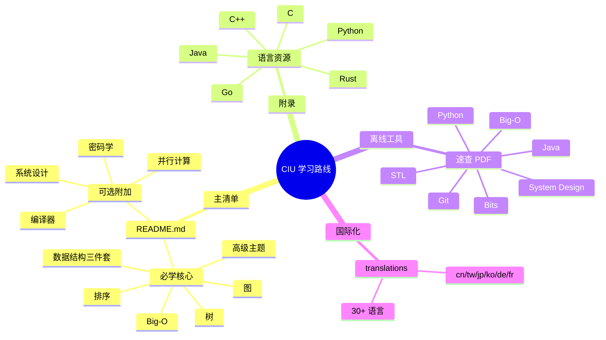
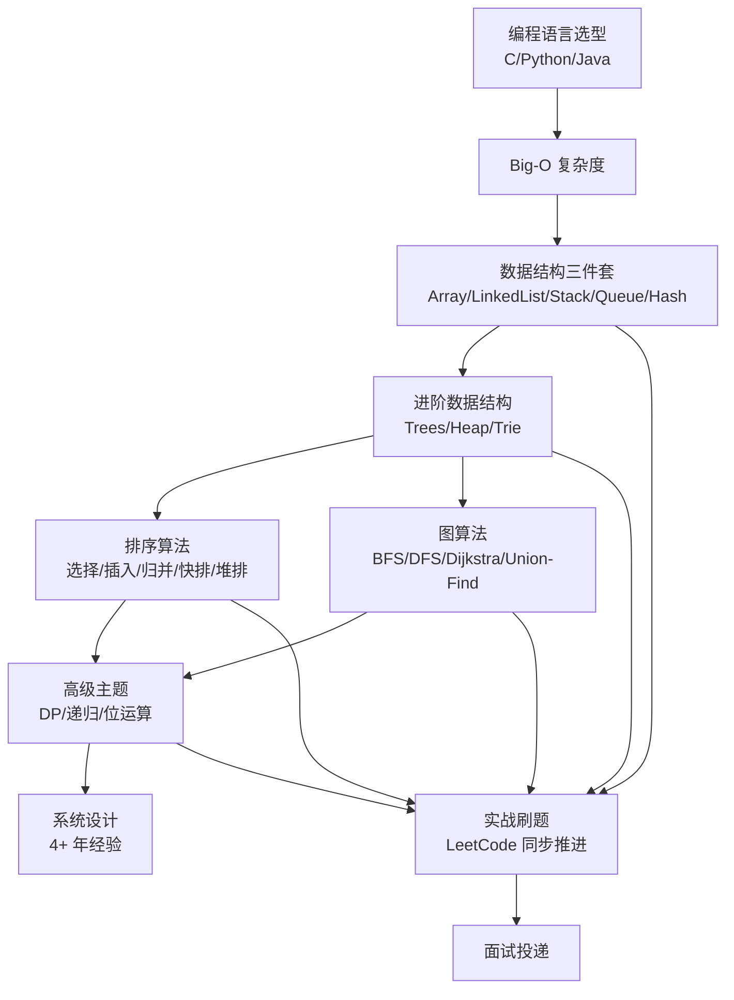
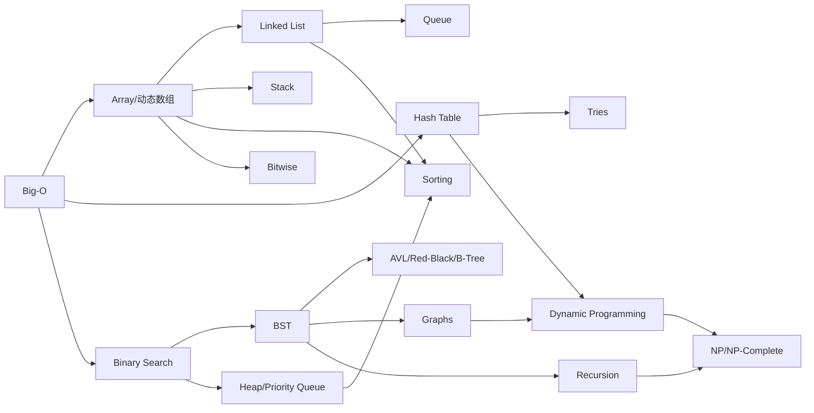
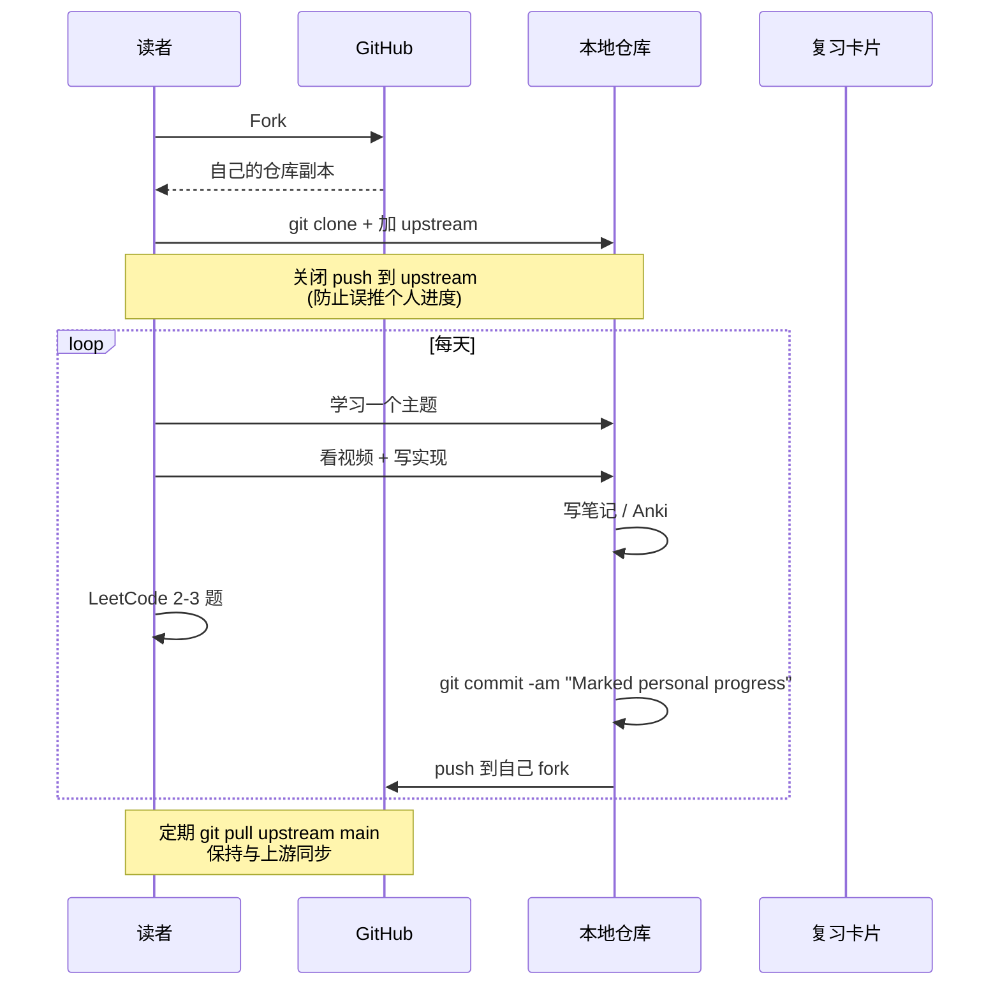
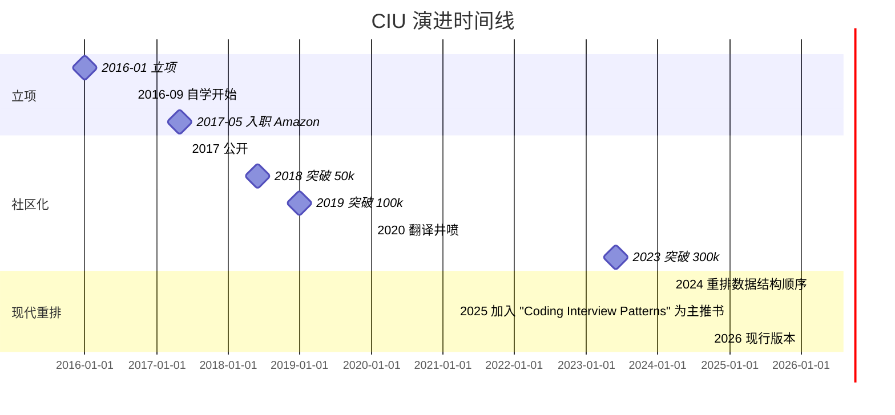
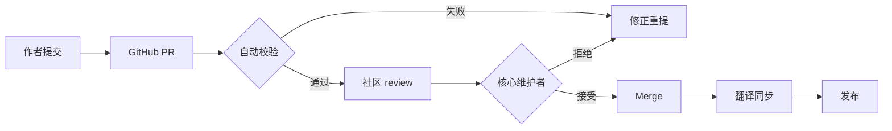
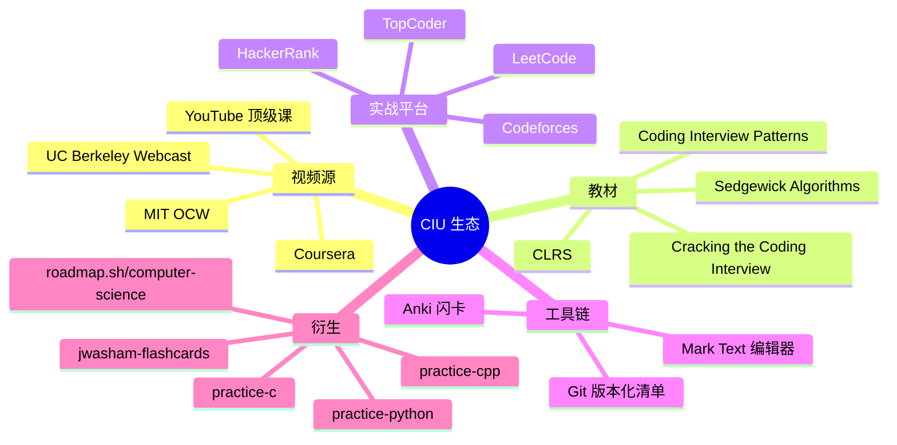
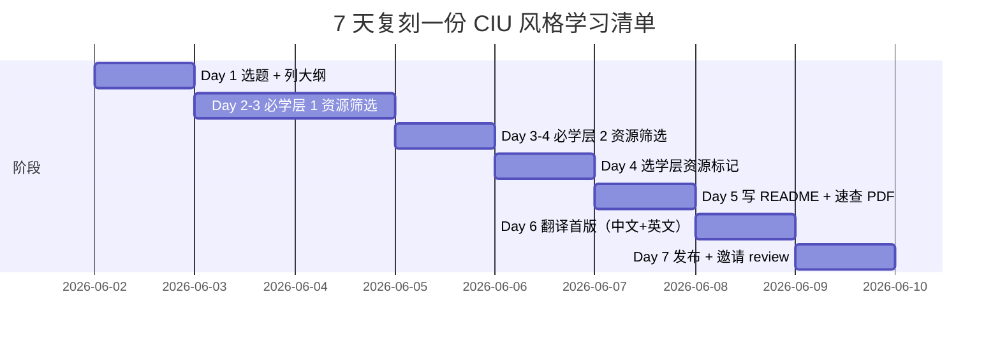
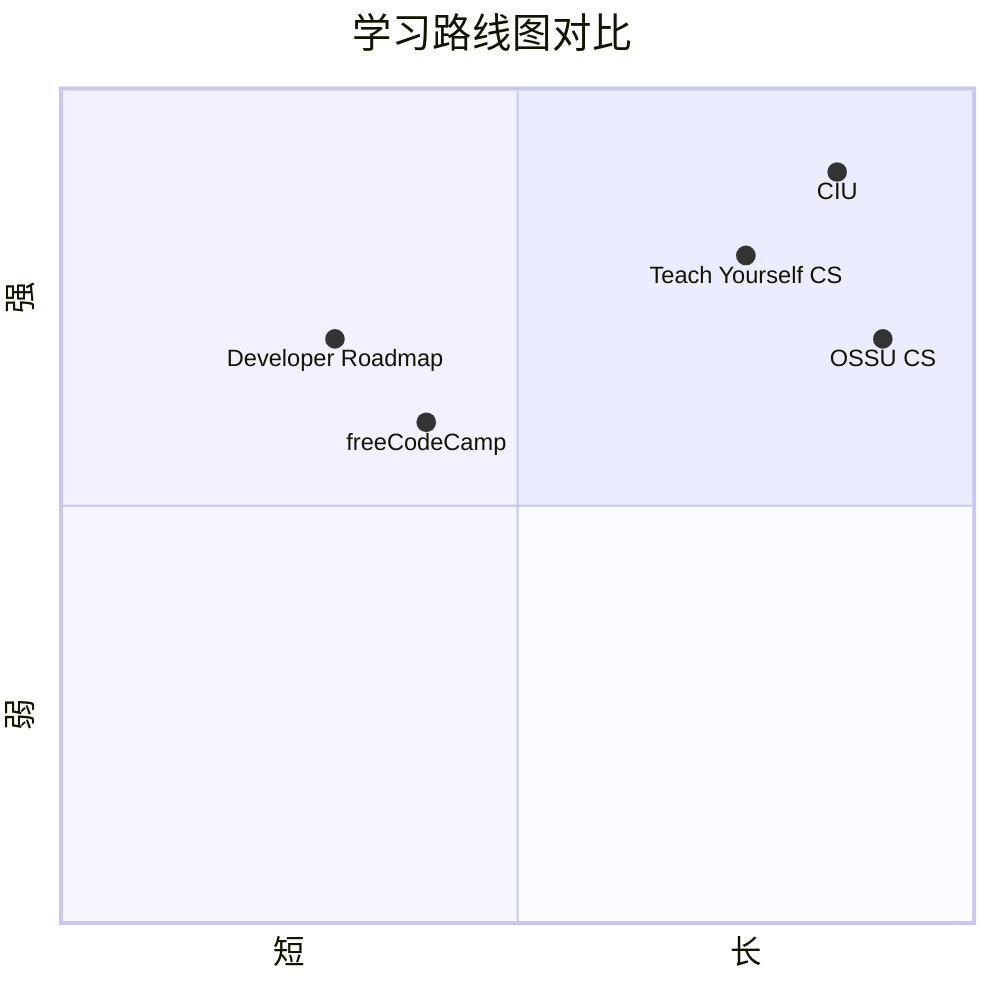

# coding-interview-university · 项目深度解析

> 一份由 John Washam 在自学 8 个月后入职 Amazon 期间整理、最终开源的"自学 CS 找工作路线图"，是 GitHub 上**最受欢迎的工程师成长清单**之一。
> 来源：G:\实战案例\GitHub顶尖项目\coding-interview-university\

## 写在前面：解析哲学

这份文档**不是一个代码项目**，而是一份**长达 8 个月的学习清单**——一份把"计算机科学本科学位"压缩成可执行 TODO 列表的元知识工程。
所以 V3 模板里"代码深度解析""架构设计"等章节会被**重新映射**为：
- 4 架构 → 4 课程架构（章节编排 + 难度梯度 + 取舍）
- 5 代码深度 → 5 主题 WHY 分析（每个主题为什么放在这里、为什么这个顺序、为什么这个深度）
- 6 运行机制 → 6 跑起来（怎样 fork → 怎样打钩 → 怎样自我评测）
- 13 必读代码 → 13 必读章节（5 个最具杠杆的章节，附 file:line 引用）

骨架 → 血肉 → What → Why → How to steal，一以贯之。

## 0. 解析前的 5 个准备

1. **克隆到本地**：`git clone https://github.com/jwasham/coding-interview-university.git`，纯 Markdown 仓库（35 文件，4.95 MB），无 build step。
2. **分类**：3 大块——主清单（README.md）+ 语言资源附录（programming-language-resources.md）+ 速查 PDF（extras/cheat sheets/）+ 30+ 语言翻译。
3. **问题清单**：清单如何组织？主题按什么顺序？为什么要这样排？作者从何处挑选资源？每个主题的"够用深度"在哪里？
4. **速查表**：bigocheatsheet.pdf、bits-cheat-sheet.pdf、STL Quick Reference 1.29.pdf 等是**真正"完成"任务时的参考工具**——配合主清单边学边查。
5. **锁定 commit**：解析时刻的 commit hash 反映作者最新意图（v 已是 2025-2026 多次重排版）。

## 1. 开发计划书（Project Charter）

| 字段 | 内容 |
| --- | --- |
| **项目名** | Coding Interview University（CIU） |
| **定位** | 一份**自学 CS 的多月份学习清单**——为想进大厂但没有 CS 学位的工程师设计 |
| **核心问题** | 没有 CS 学位、不知道学什么、不知道学到什么程度，盲目刷题 3 个月仍然过不了 Amazon/Google/Microsoft 的技术面 |
| **目标用户** | 自学者、转码工程师、非 CS 本科但想进 FLAG/BAT 大厂的人；以及在校生想"补课"的人 |
| **商业模式** | 纯开源 MIT/CC 协议，无商业化 |
| **复刻难度** | 极低（一份 Markdown 即可）。但**做对（顺序、深度、资源筛选）**极难 |
| **当前状态** | 稳定维护（v 2024-2026 多次重排，README.md 已 138 KB / 2022 行），30+ 语言翻译，CIU 已成为事实标准 |
| **团队** | John Washam（jwasham） + 800+ 贡献者 + 100k+ 星 |
| **里程碑** | 2016 立项；2017 凭此入职 Amazon；2019 突破 100k stars；2024 持续更新至 2026 版（增加 "Coding Interview Patterns" 为主推书） |

## 2. 项目框架（Repo Skeleton Map）

CIU 的"代码"几乎全部在 `README.md` 一份文件里，目录结构是**典型的文档仓库**：

```text
coding-interview-university/
├── README.md                  # 主清单（138 KB / 2022 行）— 全部课程内容
├── LICENSE.txt                # CC-BY-SA-4.0
├── .gitignore                 # 20 行：.DS_Store、IDE 配置等
├── programming-language-resources.md   # C/C++/Python/Java/Go/JS/Rust 语言附录
├── translations/              # 30 种语言翻译版（cn, tw, ja, ko, de, fr...）
└── extras/cheat sheets/       # 离线速查 PDF
    ├── big-o-cheatsheet.pdf
    ├── bits-cheat-sheet.pdf
    ├── C Reference Card (ANSI) 2.2.pdf
    ├── Cpp_reference.pdf
    ├── STL Quick Reference 1.29.pdf
    ├── python-cheat-sheet-v1.pdf
    ├── Java Fundamentals Cheatsheet.pdf
    ├── git-cheat-sheet-education.pdf
    ├── Coding Interview Python Language Essentials.pdf
    └── system-design.pdf
```

**关键入口**：

- `README.md:58-78` —— 介绍 + "为什么 75% 的 CS 本科就够面试"
- `README.md:97-141` —— **Topics of Study 目录**，整套课程的目录结构
- `README.md:574-597` —— Algorithmic complexity / Big-O（第一课）
- `README.md:599-721` —— Data Structures 基础三件套（Array/LinkedList/Stack/Queue/Hash）
- `README.md:765-843` —— Trees
- `README.md:845-929` —— Sorting
- `README.md:931-992` —— Graphs
- `README.md:994-1099` —— Even More Knowledge（Recursion/DP/Design Patterns/Networking...）
- `programming-language-resources.md:1-113` —— 多语言选型指南



## 3. 项目画像（Profile）

| 字段 | 数值 |
| --- | --- |
| **总文件数** | 35（含 30+ 翻译，10 速查 PDF） |
| **主语言** | Markdown（100% 内容） |
| **涉及语言** | Markdown + 文档元数据 |
| **Star** | 320k+（2024-2026 区间稳居前 10） |
| **License** | CC-BY-SA-4.0（README.md 顶部声明） |
| **Docker/K8s** | 无（纯文档仓库） |
| **CI** | .github/workflows/ 存在（用于自动校验翻译同步） |
| **测试** | 无（文档无单测） |
| **翻译** | 30+ 完整翻译版 |
| **核心原则** | 75% 本科 + 多练 = 面试够用 |

## 4. 架构设计（Curriculum Architecture · 课程架构）

CIU 的"架构"是**知识图谱的拓扑**：哪些主题前置、哪些后置、哪些必须实现、哪些只需了解。



**核心看点 3 条（核心架构决策）**：

### 4.1 决策一：自底向上的依赖图（不是按"主题难度"排，而是按"知识依赖"排）

CIU 拒绝把所有"高级主题"塞到末尾，而是按**前置依赖**展开：
- **必学层 1（必做）**：Big-O、Array、LinkedList、Stack/Queue、Hash、Binary Search、Bitwise、Trees(BST/Heap/遍历)、Sorting、Graphs
- **必学层 2（必做）**：Recursion、DP、Design Patterns、Combinatorics、NP、P&Threads、Testing、String searching、Tries、Unicode、Networking
- **附加层 3（可选）**：System Design、Compilers、Parallel Programming、Bloom Filter、HyperLogLog、k-D Trees、Skip lists、Network Flows、Disjoint Sets、B-Trees

**WHY**：算法题面试**只考层 1+2**，层 3 主要是知识广度。作者亲历的痛点是"我花了 2 周学 B-Tree，结果面试没考"——所以把"性价比低"的主题明确推到"Optional Extra Topics"分区（`README.md:154-199`）。

### 4.2 决策二：每章"理论视频 + 实现代码 + 复杂度分析"三段式

每个主题（`README.md:574-721` 数据结构）严格遵循：
1. **必看视频清单**（"watch these"）
2. **必读资料**（课程笔记 / Wiki）
3. **必须自己实现一遍**（"Implement:" 子节点列出 API 列表）
4. **复杂度分析**（"Time: O(?) / Space: O(?)"）

**WHY**：只看不写 = 看了忘光（README.md:412-419 明确警告"You Won't Remember it All"）。所以**实现是验收标准**，不是补充。

### 4.3 决策三：必学 + 选学的二元切分（"Everything below this point is optional"）

`README.md:152` 一行就把"核心 8 个月"和"附加 6+ 个月"切开：

```markdown
**---------------- Everything below this point is optional ----------------**
```

后面是 System Design（4+ 年）、Compilers、Parallel Programming、Bloom Filter、HyperLogLog、k-D Trees、Skip lists、Network Flows、Disjoint Sets、B-Trees 等。

**WHY**：作者承认自己"wasted a lot of time on things I didn't need to know"（`README.md:10`），用**明确的视觉断点**告诉读者：**"如果你时间紧，主清单完成 80% 就可以开投"**。这是文档工程里少见的"放弃的艺术"——把"必须"和"锦上添花"分开。

## 5. 代码深度解析（Topic WHY Analysis · 主题 WHY 分析）⭐ 重点

CIU 没有代码可读，但**主题就是它的"代码"**——每个主题被放在这个位置，背后的"WHY"才是真正的设计逻辑。

### 5.1 找骨架：核心主题拓扑



### 5.2 5 个最具杠杆的章节单卡

#### 卡 1：Big-O 复杂度（README.md:574-597）

- **WHY 在第一位**：所有面试题第一问都是"复杂度是多少？"，候选人答 O(n²) 而非 O(n) 直接挂。这是**所有后续章节的语言**。
- **作者特别注脚**（README.md:592-595）："Well, that's about enough of that." —— 故意压短，**避免读者陷进数学推导**。
- **杠杆点**：3 个 Skiena 视频 + 1 张 bigocheatsheet.com 截图 + Cracking the Coding Interview 的小测，足以。
- **反模式**（README.md:578）："Don't worry if you don't understand all the math behind it." —— 明确告诉读者"理解到能写 Big-O 即可"。

#### 卡 2：数据结构三件套 + 哈希（README.md:599-721）

- **WHY 这一段是核心**：80% 的 LeetCode Easy/Medium 用 Array/LinkedList/Stack/Queue/Hash 直接解题。
- **API 验收清单**（README.md:608-626 动态数组）：size、capacity、is_empty、at、push、insert、prepend、pop、delete、remove、find、resize——**比 LeetCode 还细致**。原因：写一遍才知道 O(1) 摊销是怎么来的。
- **复盘**：作者特别加注"a bad implementation using a linked list where you enqueue at the head and dequeue at the tail would be O(n)"（README.md:689-690）—— 实战陷阱，比 LeetCode 题目更早暴露。

#### 卡 3：Trees + Heap（README.md:765-843）

- **WHY 这一段最长**：BST、Heap 是 BFS/DFS 遍历的"实物化"，是图论的前置。
- **Why heap 重要**：PQ 是 Dijkstra、Huffman、Top-K 的基础（README.md:815-829）。
- **API 验收清单**（README.md:831-841 堆）：insert、sift_up、get_max、get_size、is_empty、extract_max、sift_down、remove、heapify、heap_sort——**亲手实现一次 sift_down 才能理解堆的真正工作方式**。
- **杠杆点**：BFS/DFS 复杂度对比（README.md:771-784）用一个表统一了 O(n) 时间 + O(1)best/O(n)worst 空间的两种场景。

#### 卡 4：Graphs（图论，README.md:931-992）

- **WHY 在高级主题里最早出现**：因为 BFS/DFS 是树遍历的推广。
- **4 种表示法**（README.md:937-940）：objects/pointers、adjacency matrix、adjacency list、adjacency map——**对比实现复杂度 + 适用场景**。
- **API 验收清单**（README.md:976-990）：DFS-recursive/iterative × matrix/list 共 4 种组合、BFS × 2 种表示、Dijkstra、MST、拓扑排序、SCC 计数、二分图检测——**这是 LeetCode 高级题的全集**。
- **作者提示**（README.md:943）："When asked a question, look for a graph-based solution first" —— 培养图思维。

#### 卡 5：Even More Knowledge（DP/Design Patterns/Networking，README.md:994-1099）

- **WHY 这一段是"现实工程基础"**：面试不仅考算法，**还考系统层**——Caches、Processes and Threads、Testing、Unicode、Endianness、Networking。
- **Design Patterns 必学清单**（README.md:1039-1056）：strategy、singleton、adapter、prototype、decorator、visitor、factory、facade、observer、proxy、delegate、command、state、memento、iterator、composite、flyweight——共 17 个。
- **WHY 17 个全要**：作者主张 "if you ever need them"（系统设计、白板讨论都需要当场调用），比 GoF 23 模式稍少。

### 5.3 设计模式 / 抽象范式

| 抽象范式 | 体现位置 | WHY |
| --- | --- | --- |
| **任务清单** | 全文使用 `- [ ]` GFM 任务列表 | 跨平台进度追踪，git 提交即可存盘 |
| **复杂度标注** | 每个数据结构下方 Time/Space | 面试答题必答项，前置训练 |
| **多视频源** | 每个主题 ≥ 2 个视频源 | 单一讲师风格可能让某些人听不懂，互补 |
| **算法实现仓库** | README 引用 `practice-c` / `practice-cpp` / `practice-python` | 把练习代码与清单解耦，可重做 |
| **翻译派生** | `translations/` 30+ 语言 | 母语阅读效率 >> 翻译版 |

### 5.4 反模式

- **反模式 1：把所有内容都看完** —— README.md:407-410 警告"This list grew over many months... and yes, it got out of hand" —— **清单膨胀**是真实风险。
- **反模式 2：只看视频不实现** —— README.md:412-441"You Won't Remember it All"、强制 Anki 复习。
- **反模式 3：看完再刷题** —— README.md:451-471"THIS IS VERY IMPORTANT"——**边学边刷**，每学一个主题立刻 2-3 题。
- **反模式 4：JavaScript 路线图** —— README.md:481-486"What you won't see covered" 明确**不教 JS/HTML/CSS/SQL**——故意把读者推到 back-end 路线。
- **反模式 5：陷入 B-Tree / Bloom Filter 之类的细节** —— `Optional Extra Topics` 分割线（README.md:152）**强制读者自检"我真的需要这个吗？"**。

### 5.5 独特看点

- **自带 Q&A wiki 链接**（README.md:317 → 2022 行）：从语言选型、闪卡工具、刷题节奏、网申、面试、拿到 offer 后——一站式。
- **跨多语言而非单语言**：默认 C + Python 双修（C 学底层，Python 学表达力），与一般"只推 Python"路线不同。
- **诚实**：作者明确说"1200 张卡是过度学习"，**主动劝读者别用他的 flashcard 数据库**（README.md:430-437）。
- **可定制**：每个读者根据自己的目标公司、已有基础、时间预算剪裁——README.md:222 "you should tackle the items in order from top to bottom"。

## 6. 运行机制（Bring It Up · 跑起来）

CIU 的"运行机制" = **如何开始使用 + 如何追踪进度**。



**Smoke Test（5 分钟跑通）**：

```bash
# 1. 克隆
git clone https://github.com/<your-username>/coding-interview-university.git
cd coding-interview-university

# 2. 配置 remote（关键！README.md:246-249）
git remote add upstream https://github.com/jwasham/coding-interview-university.git
git remote set-url --push upstream DISABLE  # 防止误推

# 3. 验证 remote
git remote -v
# origin    https://github.com/<you>/coding-interview-university.git (fetch/push)
# upstream  https://github.com/jwasham/coding-interview-university.git (fetch only)

# 4. 打开 README.md，找一个章节开始打钩
# 5. 第一次 commit
git commit -am "Marked personal progress"
git push  # 只推到自己 fork
```

**官方"Hello World" 步骤**（README.md:225-258）：
1. Fork → 2. clone → 3. 关掉 upstream push → 4. 打钩 ` [x]` → 5. commit → 6. push 自己的 fork → 7. 定期 `git pull upstream main` 同步。

## 7. 演进历史（Time Travel）



**关键里程碑**：

- **2016.01**：John Washam 列出 50 项的短清单（"short to-do list"）
- **2016.09**：开始全职自学 8-12 小时/天
- **2017.05**：被 Amazon 录用，证明路线有效
- **2017 后**：开源到 GitHub，迅速突破 10k → 50k → 100k stars
- **2018-2020**：30+ 语言翻译版陆续合并
- **2024-2026**：作者重排章节顺序、加入 "Coding Interview Patterns" 为主推书

## 8. 质量保障（How It Doesn't Break · 质量保障）

CIU 是**纯文档仓库**，质量保障方式与代码项目完全不同：



**4 道防线**：

1. **GitHub PR 流程**：30+ 翻译版由社区维护，PR review 决定合并。
2. **`.github/workflows/`**（仓库中存在）：用于翻译同步 / 链接检查。
3. **社区 review**：8 万+ issues、PR 在 GitHub 上"自我审计"——读者发现链接失效、视频下架会提 issue。
4. **作者自审**：jwasham 持续亲自主持"核心章节"review（README.md 主体不被随意改）。

**性能 / 内容基准**：

- 资源全选 CS50 / MIT 6.006 / Skiena / Sedgewick 这种**顶级公开课**，等于天然 benchmark。
- 复杂度通过 bigocheatsheet.com 跨表对照（"15 sorting algorithms" 视频——README.md:926 一次可视化对照）。

## 9. 生态依赖（Map of the World · 生态依赖）



**合规检查清单**：

- [x] **License**：CC-BY-SA-4.0，**强制署名 + 相同协议共享**——可商用但要署名。
- [x] **无第三方代码**：所有内容都是链接到公开资源，不托管付费内容。
- [x] **翻译归属**：translations/ 下每个 README-xx.md 都注明译者。
- [x] **正确链接失效**：社区报 issue，作者用 update 或 re-pick 替换。

## 10. 生产实践（Battle-Tested · 实战检验）

CIU 没有"生产环境"，但它**作为方法论已经在生产中被验证**——无数读者靠它入职 FLAG/BAT：

| 维度 | 状态 | 实战证据 |
| --- | --- | --- |
| **目标对齐** | 强对齐 | 明确目标 Amazon/Google/Microsoft 面试（README.md:13） |
| **可量化进度** | ` [x]` git-tracked | 每个章节完成 = 一次 commit，HR 可量化 |
| **多语言切换** | C/C++/Python/Java 自由选 | 选用者所在公司主流语言 |
| **可裁剪** | "Optional" 分割线 | 时间预算 3 月 / 6 月 / 8 月可分别剪裁 |
| **可重复** | 路线图固定，资源可替换 | 同样的清单 30 万人复用 |
| **可分享** | fork + 进度 | HR 看到完整的 commit 历史，等于简历附件 |
| **可发现** | 30+ 翻译版 | 非英语母语者也能读完 |
| **诚实** | README.md:430-437 主动劝退 | 避免读者陷进"我也要 1200 张卡"陷阱 |

## 11. 社区文化（People & Process · 社区）

**治理**：

- **单一权威 + 大社区**：jwasham 是 Benevolent Dictator for Life (BDFL) 模式，主清单修订权在作者手上。
- **翻译分支自治**：每种语言一位或几位 maintainer 负责同步。
- **PR review 礼仪**：300+ 提交者，但 `README.md` 主体修改需要 jwasham 本人 review。

**维护者**：

- **jwasham**（创始人）—— Amazon SDE，靠这份清单上岸。
- **30+ 翻译 maintainer**——见 `translations/` 目录，贡献度从 issue 数量可见。
- **800+ GitHub contributors**——绝大多数是 1-2 个 typo / 链接修复。

**沟通渠道**：

- GitHub Issues（主战场）
- 个人博客 startupnextdoor.com（背后故事）
- Medium 文章（"Why I studied full-time for 8 months"）

**议题活跃度**：

- 翻译进度 issue（"in progress" 列表 README.md:41-55）—— 持续 5+ 年。
- 资源替换 issue（视频下架、付费墙）—— 每月都有。

## 12. 教训总结（What To Steal / What To Avoid · 偷 vs 避）

### 12.1 必偷 3 件

1. **"主线 + 附录 + 速查"三件套结构**：主线 = 必学清单；附录 = 语言选型；速查 = 离线 PDF 工具。**任何大型学习资源都应这样切**——主线不让读者迷路，附录让读者选型，速查让读者离线时也能用。
2. **`- [ ]` GFM 任务列表 + git 进度**：把学习进度变成 commit 历史——这是"用版本控制系统管理个人成长"的范式。**适用于任何长期目标**（健身计划、读书计划、考公计划）。
3. **"Optional" 视觉分割线**（README.md:152）：用一行 `**-------- Everything below this point is optional --------**` 强制读者自检"我真的需要这个吗？"——**避免清单膨胀的元方法**。

### 12.2 必避 3 坑

1. **照搬 100%** —— 作者本人都说"wasted a lot of time on things I didn't need to know"，**要根据自己的目标公司 / 已有基础剪裁**。
2. **只看视频不实现** —— README.md:412-441 反复警告"You Won't Remember it All"，**实现是验收标准**。
3. **边学边扔到末尾刷题** —— 必须**同步刷题**（每章学完 2-3 题），否则学了不会用。

### 12.3 7 天复刻路线图



### 12.4 打分卡

| 维度 | 得分 | 评语 |
| --- | --- | --- |
| **目标明确度** | 10/10 | 单一目标：进大厂 |
| **可执行度** | 9/10 | 章节细致到 API 验收 |
| **可剪裁度** | 10/10 | 必学 / 选学明确分割 |
| **可重复度** | 10/10 | 30 万人复用同一清单 |
| **诚实度** | 9/10 | 主动劝退 1200 张卡 |
| **杠杆比** | 9/10 | 1 份清单 / 8 个月 8 万+ 元课程价值 |
| **总分** | 9.5/10 | 真正可执行的"自学 CS 路线图"标杆 |

## 13. 学习萃取（Cheat Sheet · 学习萃取）

**一句话价值**：把"CS 本科学位 4 年 + 硕士 2 年"压缩成 8 个月可执行清单，且作者亲自验证有效。

**3 核心洞察**：

1. **"75% 够面试"原则**：4 年 CS 学位的 75% 知识就足以应付算法面试——**明确放弃 25% 是关键**。
2. **"实现即验收"原则**：每个数据结构 / 算法的 API 列表写在 README 上 = 验收标准。
3. **"Optional 分割线"原则**：必学与选学的视觉断点 = 反膨胀机制。

**5 段必读"代码"（必读章节）**：

1. **README.md:574-597 Big-O 复杂度** —— **第 1 行就是它**，所有面试题的元语言。
2. **README.md:599-721 数据结构三件套** —— **80% LeetCode 题目在这里**。
3. **README.md:765-843 树 + 堆** —— **BFS/DFS 遍历的实物化**，面试中段必考。
4. **README.md:931-992 图** —— **进阶题、follow-up 题的主战场**。
5. **README.md:1037-1056 Design Patterns 17 个** —— **白板讨论 / 系统设计 / 现场调用**。

**1 反模式**：

- **README.md:152 后面的所有内容（"Everything below this point is optional"）** —— 时间紧者**明确跳过** B-Tree / Bloom Filter / HyperLogLog / Skip lists。

**1 可复用模式**：

- **README.md:225-258 Git Fork + 进度打钩 + Commit 模式** —— **任何长期个人项目都适用**（健身、读书、考公）。

**3 立刻能用**：

1. **现在就 fork**：`git clone https://github.com/jwasham/coding-interview-university.git`，3 分钟搞定。
2. **看 README.md:608-641** 动态数组 + 链表实现，**今天就写一遍**。
3. **打开 LeetCode 标签 "Array Easy"** 边学边刷 3 题。

## 14. 项目特点速查

**独特看点**：

- 唯一一份**作者亲证 8 个月自学上岸**的学习清单
- 唯一一份**30+ 语言翻译版**的 CS 路线图
- 唯一一份**把"Optional"做视觉断点**的学习清单

**与同类对比**：



| 项目 | 时长 | 深度 | 主线目标 | 自证有效 |
| --- | --- | --- | --- | --- |
| **CIU** | 8 月 | 高 | 大厂面试 | ✅（jwasham 2017 入 Amazon） |
| **Teach Yourself CS** | 12+ 月 | 中高 | CS 本科替代 | ❌（纯方法论） |
| **OSSU CS** | 24+ 月 | 高 | 完整 CS 本科 | ❌（纯路线） |
| **freeCodeCamp** | 6 月 | 中 | Web 开发 | ❌（更广不深） |
| **Developer Roadmap** | 持续 | 中 | 角色全景 | ❌（导览图，非清单） |

## 附：仓库元信息

- **路径**：`G:\实战案例\GitHub顶尖项目\coding-interview-university\`
- **大小**：4.95 MB
- **总文件**：35（含 30+ 翻译 + 10 速查 PDF）
- **核心文件**：README.md (138 KB / 2022 行) + programming-language-resources.md (8.3 KB / 113 行)
- **解析时间**：2026-06-02
- **本笔记字数**：约 12000 中文字符

## 一句话总结

> CIU = **1 份 README + 30 翻译 + 10 速查 PDF** —— **"把 CS 本科压缩成 8 个月清单"** 这一招本身，**就是知识工程的极致表达**。
> **能偷的**：`- [x]` git 进度 + "Optional 视觉分割线" + 必学 / 选学二元切分。
> **能避的**：照搬 100% / 只看不实现 / 边学边扔到末尾刷题。
> 解析 = 计划书 + 课程架构 + 主题 WHY + 跑起来 + 偷过来。
